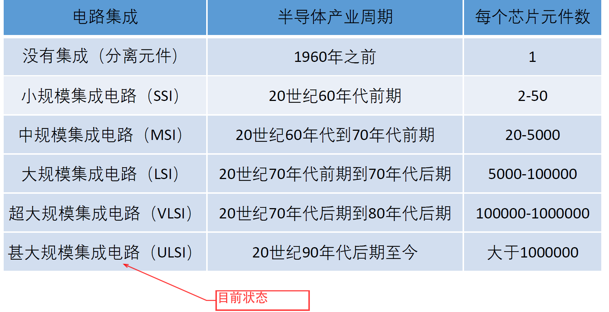

本系列博文基于学校的集成电路工艺课程和参考书《半导体制造技术》总结，笔者也是初学，如有错误敬请见谅

> 部分资料出自学校课程ppt和同学提供的重点，在此向不愿透露姓名的同学表示感谢

# IC工艺0【概论】

随着集成电路工艺的发展，目前集成电路产业已经进入了ULSI时代

芯片制造主要包含五个关键环境：

* 硅片制备：从高纯硅锭制作硅片并进行表面平滑抛光
* 硅片制造：包括清洗、薄膜沉积、光刻、刻蚀、掺杂等工艺
* 硅片测试：分别对硅片上的每个芯片进行测试，找出其中的缺陷芯片
* 装配与封装：沿划片将硅片（Wafer）切割成芯片（Die）并将其固定在封装中，使用金线连接引脚和芯片
* 终测：测试完成封装的芯片

用户要求更快、更可靠和成本更低的芯片，受用户需求的驱使，每隔18到24个月，半导体产业就引入新的制造技术。为达到这些要求，芯片制造商减小了芯片上元件的尺寸，从而提高芯片速度、减小功耗。这便是**摩尔定律**的现实基础

**集成电路**（integrated circuit，**IC**）是一种微型电子器件或部件。采用一定的工艺，把一个电路中所需的晶体管、电阻、电容和电感等元件及布线互连一起，制作在一小块或几小块半导体晶片或介质基片上，然后封装在一个管壳内，成为具有所需电路功能的微型结构

**微电子工艺**：狭义讲是指**在半导体硅片上制造出集成电路或分立器件的芯片结构，这20-30各工艺步骤的工作、方法和技术**即为芯片制造工艺；广义的讲，包含**半导体集成电路和分立器件芯片制造及测试封装的工作、方法和技术**。集成电路工艺是微电子学中最基础、最主要的研究领域之一。不同产品芯片的制造工艺就是将多个单项工艺按照需要以一定顺序进行排列，称为该产品的**工艺流程**

微电子工艺具有以下特点：**超净、超纯、高技术、高精度、大批量、低成本**