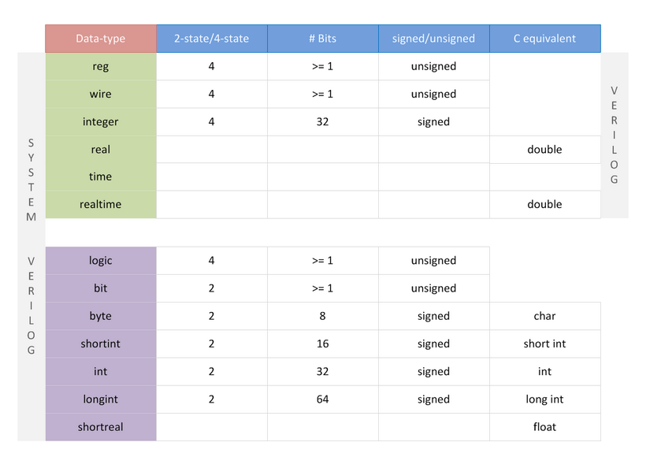

# 可综合的SystemVerilog

虽然SystemVerilog主攻验证，但它也提供了很多语法糖来改进Verilog可综合RTL代码的开发体验。在可综合语法领域，二者几乎是相同的。最大的不同在于SystemVerilog提供了

* 统一的logic类型可以替代reg和wire
* 使用`{}`来替代`begin end`
* 支持接口数组

## 数据类型对比

如上图所示，SV在V语法之外加入了

* `logic`：同时能够替代wire和reg，交由综合器来判断采用什么样的数据类型来描述寄存器或导线

    > 需要注意：**当一个信号有多驱动时，需要定义为wire类型来让综合器确定最终值**

* `bit`：很多时候我们并不需要所有的四个值（0、1、z、x），这样的数据类型只能存储0或1两个值，从而加速仿真，*当4状态变量转换为2状态变量时，任何z或x位都会被转换成零*

* `byte`和`int`：这两个数据类型都是2状态的。默认情况下，`byte`和`int`都是有符号数

* 

同时SV还引入了结构体。和C语言的结构体类似，

## 数组对比

## 基本控制结构语句对比

