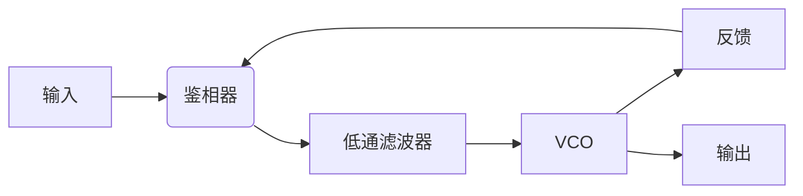
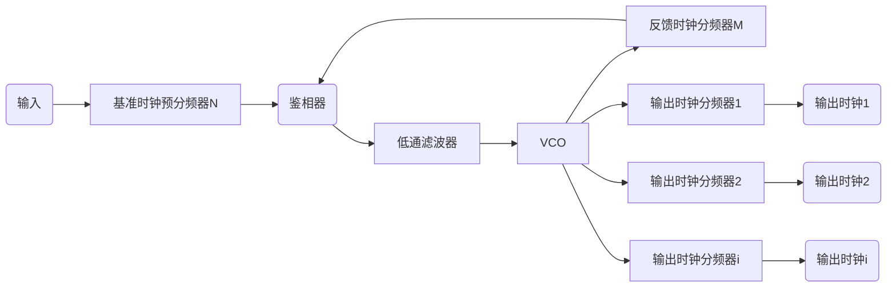
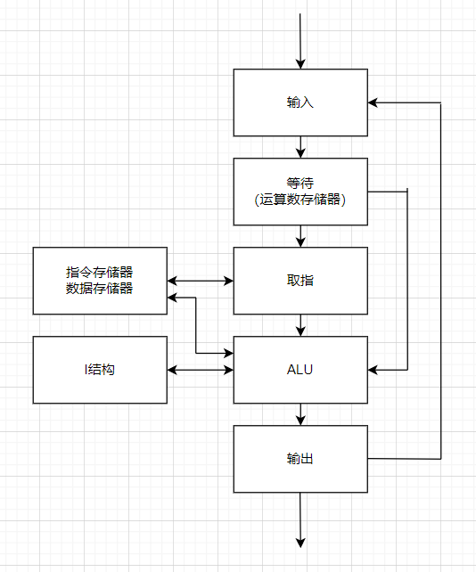

注意：本篇内容根据《FPGA原理和结构》（[日]天野英晴 著 赵谦 译）一书整理，作者也是初学者，有错漏请见谅

# 基础知识

FPGA即**现场可编程门阵列**（Field Programmable Gate Arry），与之对应的是FPAA**现场可编程模拟阵列**（Field Programmable Analog Array）。这是一种可以通过重新编程来实现用户所需**逻辑电路**的半导体器件

## 布尔代数

布尔运算是一种二值运算，在布尔运算中，运算数只有0或1，基本运算有**与 ·**、**或 +**、**非 ~**三种，可以通过这三种基本运算构造出异或、与非等等运算

布尔运算遵循的定理如下：

* 零元：x·0=0，x+1=1
* 单位元：x·1=x，x+0=x
* 幂等律：x·x=x，x+x=x
* 补余律：x·(\~x)=0，x+(\~x)=1
* 互反律：\~(\~x)=x
* 常见的交换律、结合律、分配律
* 吸收律：x+(x·y)=x，x·(x+y)=x
* 德摩根定律：\~(x+y)=(\~x)·(\~y)，\~(x·y)=(\~x)+(\~y)

布尔代数中的函数用**逻辑表达式**来描述，描述同一逻辑函数的逻辑表达式可能有多个。逻辑表达式中，逻辑变量以原变量或反变量的形式出现，原变量和反变量统称**字面量**，字面量的逻辑与称为**与项**，与项的逻辑或运算叫做**积之和**，包含所有字面量的与项称为最小项，由最小项构成的积之和称为标准积之和（**标准积**），类似的存在或项（字面量的逻辑或）、和之积、最大项、标准和的概念

逻辑函数还能通过**真值表**描述，针对逻辑函数所有可能的输入组合一一列出输出值就可以得到真值表。==一个逻辑函数的真值表唯一==，实现真值表定义的功能的电路称为**查找表**（LUT，Look-up Table），这就是FPGA的基本单元

写FPGA逻辑就是写其中的查找表逻辑

## 数字电路

数字电路也可以叫做逻辑电路

本质是用电路描述数字布尔逻辑。

**所有逻辑电路都能用积之和表达式来描述**

### 组合逻辑电路

不包含记忆元件，某时刻输出（逻辑函数值）仅取决于该时刻输入的数字电路就是组合逻辑电路

使用与-或-非三种门电路组合成的组合逻辑电路可以实现任何逻辑函数。这种方式被称为与-或逻辑电路或者是**与-或阵列**

PLA（可编程逻辑阵列Programmable Logic Array）就是使用与-或阵列

### 时序逻辑电路

含有记忆元件，某时刻输出取决于该时刻输入及系统过去的电路状态的逻辑电路就是时序逻辑电路

时序逻辑电路分为同步和异步两种

同步时序电路的输入状态和内部状态的变化由时钟信号控制同步进行，但异步时序电路不需要时钟信号

异步时序电路设计需要考虑临界资源、亚稳态等诸多因素，FPGA很少涉及异步时序电路。一般地，FPGA使用有限状态机模型来实现同步时序电路，同步状态机将会在之后的硬件算法部分介绍

同步状态机分为Moore和Mealy两类，Mealy模型的状态数一般比Moore模型的少，电路规模一般也更小，但输入会立刻反映到输出，容易造成信号竞争导致非预期的错误输出，这种情况称为竞争**冒险**。Moore电路速度快且不易发生冒险，但是电路规模较大

## 同步电路设计

同步电路让系统状态的变化和时钟信号同步，从而降低电路设计难度

**同步电路设计是FPGA设计的基础**

触发器（Flip Flop，FF）是一种只能存储一个二进制位的存储单元，一般用作时序电路的记忆元件。FPGA内一般使用D触发器（D-FF）在时钟跳变沿将输入信号的变化传送至输出

它的真值表如下所示

| 输入 D       | 时钟 CLK         | 输出 Q       | 反相输出 Q   |
| ------------ | ---------------- | ------------ | ------------ |
| x            | 0                | 保持之前状态 | 保持之前状态 |
| 0            | 上升沿           | 0            | 1            |
| 1            | 上升沿           | 1            | 0            |
| x            | 1                | 保持之前状态 | 保持之前状态 |
| x            | 下降沿           | 保持之前状态 | 保持之前状态 |
| 无论输入如何 | 当且仅当上升沿时 | Q<=D         | Q<=(~D)      |
|              | 任何其他情况     | 保持之前状态 | 保持之前状态 |

### D触发器的局限性

CMOS工艺下，D-FF由传输门1、主锁存器、传输门2、从锁存器串联组成

传输们起开关作用，会随CLK的状态变化切换开关，外部信号先被锁存在主锁存器，一个时钟周期后，信号会被再次锁存在从锁存器。这里传输门1和传输门2的时钟相位相反。

然而由于寄生电容、寄生电阻的存在，在时钟信号变化过快时，如果读取到还没有稳定下来而是在0和1之间摇摆的中间电位就会导致读取错误，这被称为**亚稳态**。所以一般会通过**建立时间**（Setup Time）来约束在时钟上升沿到来前输入D保持稳定的时间

对于下降沿的情况下，若输入在传输门变为高阻态之前就发生变化也会出现反相器环路震荡的隐患，所以使用**保持时间**（Hold Time）约束

由于这两个约束的存在，时钟频率需要受到限制，FPGA设计中使用静态时序分析STA来评估性能，静态时序分析主要评估FPGA上设计电路的延迟是否满足时序约束。此外还需要使用DRC约束和DC约束来保证电路的结构无误

STA验证具有验证速度高的特点，但对电路结构有要求：

* 延迟分析的起点和终点必须是基于同一时钟的FF，从而能够通过累加延迟来计算、验证每条路径的总延迟

所以FPGA一般来说都会使用单相同步时钟来设计

由于时钟信号驱动的负载（扇出数）、布线延迟等导致的时间差称为**时钟偏移**（skew）

由于时钟振荡器或PLL器件的输出变形或信号变形导致时钟边沿偏离平均位置的情况称为**时钟抖动**（jitter）

在实际ASIC设计中，需要控制时钟偏移和抖动在一定范围之内；FPGA上已经提前实现好了多层时钟树结构，并通过驱动能力强的专用布线（global buffer）将时钟低偏移地连接到全芯片的FF上，所以在时钟设计上比ASIC简便很多

## CPLD

所有可编程逻辑器件统称PLD，而其中有CPLD（Complex PLD）一个特殊的分支，与FPGA相反，它基于ROM技术制造，基本结构是乘积项。由与阵列和或阵列组成的与-或构造就称为乘积项形式，这一结构的特点就是成本低廉、掉电后不会丢失逻辑

# FPGA简介

FPGA是PLD的一种。实际上它并不是单纯由”门“形成的结构。

## FPGA结构简介

FPGA大致由三部分构成：

* 实现逻辑电路的逻辑要素：**逻辑块**

一般由查找表LUT、乘积项PT、数据选择器MUX等组成，不管什么方式，都应该是由实现FF等器件的数据存储电路和数据选择器MUX组成的

* 和外部进行信号输入/输出的要素：**I/O块**

连接IO引脚和内部布线要素的模块，其中通常包括控制上拉下拉、输入输出、极性、速率、开漏等模式的控制电路和触发器等数据存储电路。一般会支持TTL、PCI、PCIE、SSTL等等单端标准IO和LVDS等差分标准IO

* 连接前两种元素的布线要素：包括**布线通道、开关块SB、连接块CB**

可以通过布线资源形成任意的布线通路，其中主要通过开关的编程配置决定选择哪个布线通道

实际电路中还可能加入硬核处理器、DSP模块、块存储器等等其他具有固定功能的硬核电路

**硬核**：具有固定结构、无法使用硬件描述语言编程的电路

**软核**：具有一定结构，可以使用硬件描述语言编程的电路

这三个部分一般呈==岛型==排布，每个“岛“占据一个格子，格子之间是布线要素

## FPGA可编程技术

FPGA通过闪存、反熔丝和静态存储器作为可编程的基础，目前市面上的FPGA多使用SRAM技术（静态存储器）制造，这三种技术各有特点

### 闪存

闪存（FLASH）是EEPROM的一种，属于非易失存储器，采用MOSFET（Metal-Oxide-Semiconductor Field Effect Transistor金属-氧化物-半导体场效应管）技术制造

> MOSFET是一种以**金属栅极**隔着**氧化层**利用电场效应来控制**半导体**的场效应晶体管。而与之相对的还有JFET，即结型场效应管，在N型半导体（这里以N沟道为例）两端加入P型半导体，并在其中P型半导体较少的一端引出源极和漏极，另一边的P型半导体引出栅极，用栅极电压产生的静电效应来控制漏极电流。MOSFET则是以P型半导体为基底，两个小块N型半导体嵌入，通过引脚引出作为源极和漏极，在基底上有一个二氧化硅薄片，上面固定了金属铝制造的栅极，当栅极加适当电压时，在两个N型半导体之间会出现导电沟道，即源-漏极电流出现（这里以增强型NMOSFET为例，PMOS的导通电流方向相反，耗尽型为不加栅极电压时才会导通）
>
> 无论P类型还是N类型的MOSFET都分为增强型和耗尽型两种，增强型的特点是“常开”，耗尽型的特点是“常闭”，这里的增强和耗尽指的是栅极电压控制漏极电流的“增强”或“耗尽”

闪存根据写入方式不同可以分成两种：NAND型和NOR型，NAND型在写入时需要高电压，而NOR型在写入时需要大电流

NAND FLASH的MOSFET表现为耗尽型，源极、漏极之间存在一个栅极G，这里就和普通的DRAM构造相同（MOSFET结构），但是在栅极下方的二氧化硅中埋藏了一个多晶硅构成的浮栅。初始状态下浮栅不带电，根据耗尽型MOSFET的特点，栅极零偏压时电流可以通过；但当将栅极加高电压后，浮栅会由于电场效应（实际是产生了隧道电流）带电（负电），此时在低电压范围内，无论栅极加不加电压，导电沟道都关闭，电流无法通过，也就是说浮栅上存有电荷时表现为无电流通过；而只有再次在源极S上加高电压时，电流才能通过。由于浮栅中的电荷没有逃脱路径，因此可以半永久保存数据；当在源极加高电压时，可以将浮栅中的电子以隧道电流的形式引出。对于NOR FLASH的情况，通过在源极和漏极之间通大电流后，一部分电子作为热电子注入浮栅来完成写入

NAND FLASH的结构特点导致了它能够以位（比特）为单位写入（控制单个栅极电压），但只能以块为单位擦除（源极并联在一起，难以单个控制）

### 基于闪存的可编程开关

FPGA内的可编程开关由两个晶体管组成，一个负责编程信号的写入/擦除，另一个用于控制用户电路的开关，两个晶体管共用控制栅极G和浮栅，从编程用开关管注入电子就可以直接决定用户所使用开关的状态

使用步骤如下：

1. 在编程晶体管S-D之间加5V
2. 在G加-11V电压，电子自动流入G（G-D电压为-16V），开关开启
3. 正常工作时，栅极保持2.5V，浮栅电位会大致维持在4.5V
4. 擦除时，编程晶体管S、D接地，G极加16V电压后浮栅电位会降到0V以下，开关关闭

可编程开关的以上特性决定了它存在一些缺点：

* 无法使用CMOS工艺（最大硬伤，不过这也导致其成本较低）
* 重写次数有限制
* 接通电阻和负载电容较大

它的优点如下：

* 非易失、可重编程
* 对软性错误容错强、上电后立即工作（Live At Power-Up，LAPU）
* 尺寸较小（至少比SRAM工艺小，但是对于先进的FinFET优势就不大了）

目前的CPLD很多都是基于该工艺制造

### 反熔丝

熔丝是在电流过大时对电路进行保护或防止事故的元件，当有大电流流过时会自行发热并熔断。反熔丝的特性和熔丝正好相反：初始状态为开路，当通电后会发生熔合

一种反熔丝使用多晶硅和n^+^扩散层作为导体，在他们中甲插入ONO氧化物-氮化物-氧化物的电介质作为绝缘体的构造，ONO电介质厚度在10nm以下，通常在10V-5mA情况下可以形成上下连接的通路。其直径大约和接触孔（为了连接硅基底上的门电路和金属层或上下两层金属层而设置的通孔）相当，其导通电阻大概在300~500Ω

还有Metal-to-Metal设计的反熔丝，用于连接布线层，在上下两层金属布线层间插入绝缘的非晶硅和钨插塞等导体，在为编程时处于高阻抗状态，而在编程处理后可以变为几乎和金属层连线同等程度的低阻抗状态，导通电阻大约50~80Ω。在编程中需要约15mA电流

因为Metal-to-Metal反熔丝面积较小、导通电阻低，构造上不可能将配置信息直接读取出来，难以实行逆向工程，安全性很高，所以成为现代反熔丝技术的主流

反熔丝优点如下：

* 尺寸小、密度高、非易失
* 接通电阻和负载电容小
* 安全性高、对软性错误容错性强

缺点：

* 无法重写
* 每根线都需要额外的晶体管用于编程
* 需要使用专用编程器且编程时间长
* 难以debug、出错率较高

### 静态存储器

静态存储器由两个CMOS反相器构成的触发器和两个传输晶体管（Pass-Transistor，PT）组成。他利用触发器的双稳态0和1记录数据，通过NMOS型的PT执行写入

静态存储器通常使用地址信号来驱动字线（读取地址信号所控字线上的多位数据），数据的读取也通过PT进行。由于FPGA需要一直读取数据，所以在FPGA中数据直接从触发器读取而不通过PT。

基于静态存储器的FPGA大多使用LUT，并使用MUX等来切换布线连接，真值表本身由多位静态存储器构成，这种FPGA一般称为SRAM型FPGA。说人话就是使用SRAM技术存储真值表来实现编程信息的存储

优点如下：

* 能够使用先进的CMOS工艺
* 可重配置
* 重写次数没有限制（一片spartan传祖孙三辈人没问题）

缺点：

* 存储器尺寸大（可以通过FinFET工艺缓解）
* 易失性存储器
* 难以保证电路信息安全
* 对软性错误敏感
* 导通电阻、负载电容较大

目前SRAM型FPGA占据市场主流，因为CMOS和FinFET就是无敌的存在，制程碾压一切

### 总结

反熔丝待机耗电低、连接开关的接通电阻小、速度快，并且保密性高、无法进行重写，比较适用于军工等不要求最先进工艺但对可靠性要求高的场合

静态存储器工艺制程先进、性能强大，但存在易失性且安全性不高、待机功耗大（这一点正在逐渐改善）、耐放射线能力弱，但是很适合民用与实验，符合FPGA的定位，所以成为市场的主流

闪存工艺是静态存储器和反熔丝之间的平衡点，成本低廉且可以重写、可靠性较高，但是性能较劣势，说的难听点就是鸡肋，所以市场上基于闪存的FPGA已经越来越少

## FPGA的逻辑实现

基于LUT的FPGA逻辑块可以实现任何**输入数在查找表电路输入数量之内**的逻辑函数；基于乘积项方式实现的CPLD则需要先将表达式转换为标准积之和的形式

一个小型的电路至少需要通过IO PAD（输入信号）、FPGA内部布线、可编程逻辑块、FPGA内部布线、输出缓冲器、IO PAD（输出信号）这几个硬件资源才能实现

可编程逻辑块内的主要资源就是LUT，**LUT是1个字只有1位的内存表**，字数取决于地址的位数，FPGA中的查找表存储单元大多使用SRAM实现。一般k输入的LUT由2^k^个SRAM单元和一个2^k^输入的数据选择器组成，**查找表的输入就是内存表的地址信号，输出就是该地址所选字的1位数据**。k输入的查找表可以实现$2^{2^k}$种逻辑函数。

使用查找表时，先根据查找表的输入值对真值表进行转换，然后将函数值直接写入配置内存，当所要实现的逻辑函数的输入数比查找表的输入数多时，可以并联使用多个查找表来实现

### 查找表的实现

早期FPGA使用过5晶体管结构（两个晶体管构成一个非门，两个非门和一个额外的晶体管构成一个SRAM单元）存储单元，因为LUT中的SRAM总是在输出数据，所以查找表只需要以5晶体管存储单元为基础配合选择信号就可以实现了；在此之后Xilinx的Freeman改良了LUT的配置存储器，让其可以作为FPGA上的分散存储器使用，此时SRAM具有了独立的写入端口，该结构可以复用为存储器和查找表，使用两个输入信号作为控制——需要注意：存储器的读取端口和查找表的输出是通用的

随后，查找表又被改良可以作为移位寄存器使用；当前的查找表已经能够支持簇结构（cluster）和自适应（可以将一个8输入查找表分割为2个7输入查找表或1个7输入查找表和2个6输入查找表等小型查找表簇的方式使用，更加灵活）

# FPGA的结构

岛型FPGA由逻辑块、IO块、布线要素等组成，**相邻的逻辑块、开关块、连接块组成了一个可重复逻辑模块**，模块呈阵列型排列最终形成岛型FPGA

FPGA中具有专门用途的电路称为“硬核”，可编程的部分称为“软核”。Xilinx将逻辑块称为CLB（Configurable Logic Block可编辑逻辑块），Altera则将其称为LAB（Logic Array Block逻辑阵列块），但他们的基本原理一样

除了主要部件之外，现代FPGA通常还包括很多其他部件

## 逻辑块结构

对于逻辑块架构，最重要的设计问题就是权衡逻辑块的功能和自身面积

> 集成电路领域著名的AT^2^定律指的是对于某个给定的半导体工艺流程，如果其相关的某数字设计的面积是A，而执行时间是T，则存在一个下限边界B，使得AT^2^=B，也就是说面积和效率不可兼得

这一点同样适用于FPGA

其中对逻辑块功能影响最大的是查找表的大小，因为k输入查找表可以实现任意k输入的函数，采用较大的查找表有助于减少逻辑块的使用数量，但k-LUT需要使用2^k^个配置存储单元，因此逻辑块自身的面积会增大，而且增加的输入/输出引脚数量会导致布线面积增大。

此外，FPGA运行速度还受到以下影响：如果增加每个逻辑块的功能，所实现电路的逻辑深度就更小；但同时也会增加逻辑块自身的内部延迟

逻辑深度指通过关键路径的逻辑块数量，它由FPGA设计环节中的技术映射过程决定（参考后面FPGA设计与ASIC设计的区别与原理部分），降低逻辑深度可以减少布线、提高电路速度，同时也会增加内部延迟，导致降低逻辑深度的效果大打折扣

综上所述，查找表的输入大小和FPGA的面积、延迟有密切关系

**现代的商用FPGA都倾向于采用6-LUT**

### 专用进位逻辑

为了提高算术运算电路的性能，现代FPGA逻辑块中还含有专用的进位电路，可以使用这些专用进位逻辑来获得更高集成度和运行速度

Xilinx没有设计专用的全加器电路，而是使用查找表和进位生成电路的组合来实现加法。全加器的加法运算用两个2输入EXOR实现，进位输出电路由1个EXOR和1个MUX组成

可以通过这种单元的不断组合实现多位加法器甚至加法器矩阵

### 逻辑簇

逻辑簇是由多个BLE群组化形成的逻辑块结构，逻辑簇内部局部布线采用硬连线连接，比外部的通用布线速度更快；逻辑簇内部局部布线的负载电容比外部通用布线小很多，因此对FPGA的耗电（特别是动态功耗）的削减有效果；逻辑簇内部BLE可以共享输入信号，有助于减少局部连接块的开关数量

**含有多BLE的逻辑块最大的优势就是在增加逻辑块功能性的同时又不会大幅影响FPGA的整体面积**

逻辑块面积随输入k的增大呈指数级增大；而增加逻辑簇中BLE的数量N会导致逻辑块的面积只按二次函数增长

计算逻辑块输入数量$I=\frac{k(N+1)}{2}$

根据上面的经验公式，逻辑块面积的增长得到了抑制

一般来说，面积延迟乘积性能最优的结构参数为：N=3\~10,k=4\~6

也就是说一个逻辑簇中设置3到10个输入、4到6个BLE比较好

### 自适应查找表

Xilinx在XC40000系列的逻辑块中推出了早期的不同输入数查找表结构

而现代的FPGA多支持将较多输入的查找表分解使用的机制，也就是**自适应查找表**

## 全局布线架构

布线架构分为全局布线和详细布线，全局布线主要解决逻辑块的连接、布线通道的宽度等高层次问题；而详细布线则决定具体的连接方式

层次型FPGA使用UCB的HSRA布线构造，将FPGA内部布线分成多个层次，布线的交叉点上包含各层的开关，一般层次越高通道里连线的数量就越多。目前层次型FPGA已经不再适用

岛型FPGA就是一直在介绍的FPGA类型，下面的详细布线架构也将围绕岛型FPGA说明

## 详细布线架构

详细布线架构中需要确定逻辑块和布线通道之间的开关布置和布线的线段长度，以此来确定电路延迟

由连接块和开关块组成的布线要素对FPGA面积和电路延迟的影响很大，在决定详细布线架构时要注意：

1. 逻辑块和晶体管参数
2. 布线线段长度的种类和比例
3. 布线开关的晶体管参数

还应该考虑传输晶体管和三态缓冲器使用上的平衡

现代FPGA为了更好的性能，通常使用较多单向连线和辅助的双向连线，并正在加大单向连线的比重；同时还提供了各种不同长度的连线，从短线到长距离布线，以此增强设备的时序表现

## 开关块

**所有开关块均由可编程开关管构成，以下简称开关管，注意不要和晶体管意义上的开关管弄混**

### 开关块的拓扑

开关块位于横向和纵向布线通道的交叉处，通过可编程开关来控制布线路径，一般开关块的拓扑分为三种

对于一个开关块中的一个控制晶体管，负责三条交叉路经的通断，因此开关快都是从三个输入中选择一个输出，自由度F~s~=3

#### 不相交型

Xilinx的特色拓扑，因此也被称为赛灵思型开关块

由6个开关管构成

将四个方向上序号相同的进行连接，相邻两个方向呈斜45度或15度连接

自由度较低

#### 通用型

同样由6个开关管构成，但两个成对的连线可以在开关块内互联

总体上可实现斜对角45度全连接

但是这种技术只能对应单倍线，无法应用在其他长度的布线上

#### 威尔顿型

采用6*n个开关管连接序号不同的连线

自由度更高，可以实现顺时针、逆时针的闭环路径，可以提高FPGA的测试效率

### 数据选择器结构

一般使用4输入的数据选择器延迟最优，8输入的数据选择器面积延迟乘积最优

## 连接块与IO块

连接块也由可编程开关构成

连接块负责连接布线通道和逻辑块的输入/输出

由于需要考虑到连接块的面积，所以很少使用全交叉开关矩阵实现，而是使用节省掉一些开关的**稀疏开关矩阵**

IO块则负责器件的IO引脚和逻辑块之间的接口部分

一般FPGA的IO除了固定用途的电源、时钟等专用引脚，还有用户可以配置的用户IO，用户IO具有输入/输出缓冲、输出驱动、信号方向控制、高阻抗控制等功能，和现代MCU的GPIO结构相似

一般具有以下特点：

* 可配置的上拉、下拉电阻
* 输出使能信号可以控制输出缓冲器
* 输入/输出出啊其，可用于调整信号延迟
* 可编程的输出缓存器转换速率
* 可以调整使用TTL、CMOS、PCIE等多种输出电压标准或输入缓冲器阈值
* 专用延时电路，用于保证输入的保持时间
* 可适用于高速通信的差分信号LVDS
* 配置有钳位二极管

总体而言连接块与IO块类似MCU中的总线桥和GPIO

## 嵌入式硬核

### DSP块

现代FPGA被普遍用于数字信号处理DSP、人工智能加速AIA、硬件算法实现等场景，因此出现了搭载大量乘法器、浮点运算电路的FPGA

这些内嵌DSP块的结构大致如下：

输入

前置加法器

乘法器

累加运算单元

模式检测器与控制电路

输出

很多DSP块支持粒度调节和浮点运算支持

在FPGA厂商提供的IP生成工具中设置好相关IP就可以选择是否在DSP块上实现，同时使用FPGA厂商推荐的硬件描述语言使用方式，综合工具就可以自动识别并使用DSP块，也可以在代码中直接实例化并使用DSP块的模块，但这种方法缺乏可移植性

### 硬宏

**硬宏**：商用FPGA中嵌入的专用硬件电路

硬件乘法器和DSP块都属于硬宏，但都比较常见，当前已经被视为商用FPGA的“标配”

除此之外，很多中高端产品都会搭载PCIE接口、USB接口、SPI接口、外部DRAM接口、专用DAC、ADC等硬宏

一般来说硬宏化的接口电路不多，需要考虑硬宏的位置再进行布局布线

### 硬核处理器

FPGA厂商已经越来越多地在高端品牌上搭载硬核处理器，也就是作为硬宏的嵌入式处理器

比较著名的就是Xilinx的Zynq系列，搭载ARM Cortex A系列处理器，可以运行Linux等通用OS或RT-Thread等大型RTOS，同时可以按照标准设计电路接口，让FPGA部分的用户电路与硬核处理器通过AMBA交换模块连接，以定制硬件的方式实现加速

### 嵌入式存储器

部分商用FPGA为了解决存储器总线带宽问题，直接将存储器嵌入到FPGA内部

这样的嵌入式存储器分为两种类型

1. 存储器块硬宏

   以硬宏的形式在架构中嵌入存储器块，在Xilinx的架构中，这种存储器被称为块存储器（Block RAM，BRAM），支持一分多、多合一

   BRAM既可以作为单端口存储器也可以作为双端口存储器使用，可以方便的使用它作为FIFO存储器

   需要注意：BRAM不支持异步访问，想要同步两个时钟域还是应该使用传统的异步时钟FIFO

2. 查找表存储器

   也可以使用逻辑块内部的查找表实现存储器

   Xilinx的架构中，这种由查找表构成的存储器称为分布式RAM（distributed RAM），但只有被称为SLICEM的逻辑块中的查找表才能够作为分布式RAM使用。此外，为了不挤占查找表的存储资源，一般在需要小规模存储器时再使用这种方法

嵌入式存储器一般和DSP块一样，只要按照FPGA厂商的说明编写HDL程序，综合后就能够调用

它的优点在于大，能有效节省外部总线资源和时序损耗

### 配置链

把电路编程到FPGA上的过程叫做配置，向FPGA写入的电路信息叫做配置数据。配置数据包含在FPGA上实现电路的所有信息，包括但不仅限于查找表中的真值表数据和开关块中各个开关的状态等

一般地，FPGA可以分为三种类型

* SRAM型：掉电信息即丢失，所以一般在上电时使用内部或外部的自动配置器件将配置信息写入
* 闪存型：非易失，一般闪存写入次数的限制都比较大，虽然没有SRAM那样的永久寿命，但用十几年也没有问题，只是写入速度较慢
* 反熔丝型：写入一次后就不能再修改

一般在调试过程中使用JTAG接口，可以实时观测FPGA内部信号的变化：先将观测信号的变化写入嵌入式存储器，再通过JTAG读取到上位机，这样就能直观地看到信号波形，称为**虚拟逻辑分析仪**

这样对于配置流程就能有更好的把控

### PLL与MMCM

过去的FPGA一般使用外部晶振，在内部的时钟信号频率受到限制

现代FPGA大多配置有PLL电路，可以将外部输入的基准时钟进行进一步处理

PLL即Phase Locked Loop锁相环，外部基准时钟输入**鉴相器**，鉴相器就是一个精密的时钟相位比较器，将PLL内部**压控振荡器**（Votage-Controlled Oscillator，VCO，可以根据所加的电压调整输出频率）生成的时钟与外部输入的基准时钟进行比较，如果两个时钟一致则维持VCO电压，否则调整控制电路对VCO电压进行调整（VCO主频过高则降低电压；反之升高电压），经过鉴相器得到的电压还存在一定的高频谐波，通过一个低通滤波器后输入VCO即可实现效果。整个电路呈现为

基准时钟输入-鉴相器-低通滤波器-VCO-反馈输入-标准输出

的状态。整个电路使用模拟电路实现，高频谐波由于反馈电路和后级电路耦合而产生



除了基本结构之外，PLL通常还会在输入输出阶段添加额外的分频器用于削减输出频率；同时在反馈阶段加入分频器用于增加输出频率

流程框图如下：



可以得到输出频率控制公式
$$
F_{vco}=\frac{M}{N \cdot K_i} F_{ref}
$$
式中M为反馈时钟分频器分频系数，N为基准时钟预分频器分频系数，K~i~为输出时钟分频器分频系数，最后对应输出时钟F~i~

虽然可以通过有限个预分频器调节时钟，但事实上各个分频器的分频比是有限制的，设定值不能超出规定

**PLL实质上是一个以外部输入基准信号为目标，使用VCO为控制对象的线性反馈控制系统**，在启动、复位或基准时钟大幅度变动时，无法做到立即响应，所以在PLL的输出时钟稳定前，由该时钟同步的用户电路可能会发生无法预测的动作。为了避免这种情况，常常使用PLL锁定机制，PLL通常会设置1位输出信号来表示PLL是否为锁定状态，外部电路可以利用该寄存器位来判断是否能使用时钟

使用数字方式也可以实现PLL类似的功能，称为DLL，具有响应速度快的优势。但是因为PLL的自由度更高、稳定性更好、成本更低，所以大多使用PLL或其升级版本MMCM


# FPGA设计流程与原理

## 基于HDL

1. 使用FPGA厂商提供IDE创建工程

2. 约束设定

   设置物理约束、引脚约束

3. 创建源文件

   依次编写RTL级描述，可以按照自顶向下/自底向上设计方法，先编写顶层文件（系统级）或底层模块；通过模块例化进行层次连接

4. 创建仿真源文件

   可以使用SystemVerilog等语言创建仿真用的源文件testbench

5. 逻辑综合和技术映射

   对于Xilinx系FPGA来说需要先进行RTL文件的**逻辑综合**，如果使用了Verilog HDL则会先生成门级Verilog文件，随后生成网表文件，这些网表文件描述了逻辑门、触发器等逻辑元素的集合以及它们的连接关系。综合后在进行**技术映射**，将逻辑映射到FPGA实际的逻辑元素。

   一般在执行这两步时，厂商IDE会提供DRC、网表、逻辑分析报告，可以借此初步判断bug

6. RTL仿真

   使用testbench对电路进行仿真，这一步可以使用厂商提供的仿真软件或仿真器，也可以使用集成电路设计中常用的modelsim等仿真软件。通过对输入输出波形的仿真判断电路是否存在问题

7. 布局布线

   利用片上逻辑和布线等资源实现网表。先进行逻辑元素再进行网络布线。布局过程中可以对信号拥挤度和传输延迟进行初步预测，不过并不一定准确，目前业界多使用STA静态时序分析进行仿真。需要特别注意的是，布局布线需要耗费很长时间，规模越大、逻辑资源使用率越高的电路耗时越长，且布线失败的可能性越大。当前的IDE中虽然有自动布局布线功能，但是也可能发生问题，这就需要换用硬件或重新设计架构、算法等

8. 配置FPGA

   可以通过以下方法将编程数据烧录到FPGA：

   * JTAG烧录比特流文件

     JTAG是面向器件编程和板卡调试的一种通用标准，FPGA厂商都提供了对应FPGA的JTAG烧录器/调试器

     但是JTAG烧录后如果FPGA断电或重置，配置信息就会丢失

     一般使用bit格式

   * 自动从片外ROM中读取文件

     在上电或重置时可以让特殊配置过的FPGA从片外ROM中读取配置数据或使用其他控制器将片外文件数据加载到FPGA上

     一般使用mcs或pof格式

   * 通过储存卡等写入

   * 使用专用IC或总线协议配置FPGA

   特别地，一些FPGA配备了处理器硬核，可以使用SD卡或专用总线，可以用这种方式自动加载FPGA

9. 实机功能验证

10. 优化

    在实现功能后，可以考虑更改设计来让器件达到更高的工作频率或获得更高的效率

## 基于HLS

使用FPGA厂商专用的HLS工具可以将高级语言代码转换为HDL代码，进而实现方便的电路设计

详细内容可以查看其它关于HLS的介绍

## 基于已有IP

往往可以从厂商或开源社区获取到某些器件的RTL代码并加以修改融入当前设计

使用这种开发方式可以

* 使用开源的处理器RTL代码实现软核处理器
* 构建SoC
* 整合软硬件开发

## FPGA设计与ASIC设计的区别与原理

FPGA设计自由度较低，无法实现对硬件的定制，且无法在器件内集成模拟集成电路元件，但成本较低；而ASIC可以有更高的自由度，但成本高昂；FPGA也常常被用于ASIC设计中的原型验证

除此之外，FPGA与ASIC设计的不同点还体现在如下方面

### 工艺映射

**工艺映射**：将不依赖于任何工艺的门级网表转换为由特定FPGA逻辑单元所表示的网表的过程

人话：把网表翻译成用FPGA内部逻辑单元组成的电路

ASIC设计中并不需要这一步，而是直接将综合后的RTL文件映射为器件，之后就是版图设计师的任务了

工艺映射的步骤有两个：

#### 分解

**门级网络实际上是用布尔网络**（基于*有向图DAG*的门级网表的表现方式，各个节点表示逻辑门或逻辑门的组合逻辑，有向边则表示输入/输出信号）**的形式来表示的，在这一步里要将布尔网络的各个节点分解直到输入数小于查找表的输入数k**

#### 覆盖

使用某种基准对分解得到的布尔网络进行切分，使用k-LUT覆盖多个节点

实际上这个过程是一种可以在多项式时间内找到逻辑层数最优解的方法^[1]^

一种执行覆盖的方法**FlowMap**如下：

1. 获取分解得到的最小电路
2. 获取输出信号对应的最后一个器件，该器件被抽象为有2个输入、1个输出的节点
3. 将所有输入节点标号为0
4. 从输出节点开始，以遍历树的方式寻找对应的上一层节点，将其输入切分出来
5. 在上一层中标注标签最大的数字，再加上当前节点的层数（以最后一层的遍历为例，上一层标签为0+1=1）
6. 顺序计算已经标注节点的相邻节点，如果遇到还未标注的节点，先对其进行计算标注
7. 在当前层（切分点以下）所有相关标签都计算完毕后，再计算第二层节点的标签
8. 反复计算所有结点的标签
9. 每一层的逻辑都可以让单个查找表实现
10. 执行逻辑打包

术语介绍：

* 节点（node）：使用布尔网络表示DAG时基于2输入逻辑门模型表示的基本构成要素——电路网络中的逻辑门全部用2输入1输出的节点来建模表示

* 标签：标签的数值用于表示网络的深度，即从各个节点到主输入按照最小深度映射时的逻辑层数

* 切分集：按照k输入进行工艺映射时可能实现的切分集合

  切分：将节点划分为总输入在k之内、可以使用查找表实现的节点集合

### 逻辑打包

**逻辑打包**：将多个查找表和触发器集合到同一个逻辑块的过程

目前主流的FPGA逻辑块都有多个查找表，所以需要高效地将查找表打包到逻辑块

逻辑打包的要点如下：

1. 逻辑块内部布线（局部布线）和逻辑块外部布线（布线通道）的延迟相差较大，所以需要平衡并缩短延迟
2. 如果逻辑块中有查找表空闲，资源使用率就会降低，所以需要增加逻辑块使用量

一种早期的执行逻辑打包的方法^[2]^如下：

1. 选择输入占用最多的LUT作为逻辑块的种子
2. 将具有最多共同输入信号的LUT装填到当前逻辑块

这种方法无法考虑逻辑布线的延时差，所以有以下改进版本^[3]^：

采用Timing-driven（延时驱动）的装箱算法**T-VPack**

1. 选择关键路径上输入最多的LUT作为逻辑块的种子

2. 考虑连接重要度和影响路径数

   连接重要度使用slack（延迟余裕）值计算而来，用于判断当前路径对时序影响的大小和是否是关键路径

   slack值越小，该路径就越接近关键路径

   影响路径数指的是当前LUT所影响的关键路径的数目，即输入和当前LUT之间关键路径的总和，该指标表明了当前查找表的延迟一旦改善，总共会有多少路径可以随之得到改善

3. 考虑共同信号数量

4. 连接重要度大、延迟余裕小、共同信号数量多的逻辑打包到同一个查找表

这种算法很好的考虑到布线延迟和逻辑块使用量的均衡

近年来的自适应查找表也对装箱算法有很大影响

较为现代化的算法有AAPack等

### 布局布线

**布局**：决定逻辑块的物理位置

**布线**：决定逻辑块的信号连接路径

多数FPGA的逻辑块都成二维阵列状排列，因此**逻辑块布局问题可以被视为二次分配问题**，这类问题也被公认为NP问题（具有和计算复杂度理论中的NP（Non-deterministic Polynomial Time，非确定性多项式时间）类问题同等或同等以上难度的问题，二次分配问题是具有NP难度的组合优化问题中非常难解的一种问题），通常只能使用SA（Simulated Annealing）等算法获取近似解

布线过程中主要使用两种布线方法：全局布线和详细布线

全局布线主要决定线网的布线路径；详细布线则基于全局布线所得信息确定路径具体使用了哪些布线资源、通过了哪些开关等

这一步FPGA开发和ASIC设计采用的思路都差不多：==瞎蒙==

具体来说使用VPR工具步骤如下：

1. 随机放置逻辑块、IO块
2. 计算当前布局的布线拥挤度
3. 随机选择两个逻辑块并对调位置
4. 比较对调后的布线拥挤度
5. 比较对调前后拥挤度的数值，决定是否接受新的布局

# 硬件算法简介

对于FPGA，或者说ASIC而言，对比CPU最大的优势就是可以实现并行计算，同时能够针对特定问题、特定算法进行优化

## 流水线

将一个连续的硬件电路拆分为n个均等的阶段，每个阶段的输出作为下一个阶段的输入，下一个阶段执行必须等待前一个阶段完成，每个阶段称为流水线的“级”。对于一个非流水线结构中的运算，完成时间为L，则加入n级流水线后，每L/n个单位时间就可以完成1个运算，这样就将同时在电路运算中的数据量增大了n倍，即**吞吐量**增大了n倍。

实际运算中，n级流水线并不一定能够得到n倍的速度提升

对于n级流水线结构，完成N个运算所需时间为
$$
T_{pipe}(N)=L+\frac{(N-1)L}{n}=\frac{n+N-1}{n}
$$
其中完成一个运算所需时间为L

速度提升率为
$$
S_{pipe}(N)=\frac{T(N)}{T_{pipe}(N)}=\frac{nN}{n+N-1}=\frac{n}{1+\frac{n-1}{N}}
$$
当$n\ll N$时，有$S_{pipe}(N)\cong n$

流水线结构和非流水线结构相比所得的速度提升和级数成正比，系数为n

这里要注意的是：全部N个运算的时间被缩短，但每个运算从刚开始到结束的时间没有变化，且在刚开始计算时，也就是流水线没有完全开始工作时的**载入过程**，还有结束计算时的**清空过程**无法省略且难以获得吞吐量增益。

流水线结构设计中，还要注意时钟周期限制，在寄存器与寄存器之间存在传输延迟、关键电路延迟。当将非流水线硬件改为流水线结构设计时，需要考虑各个部分的延迟。考虑不周很可能发生前一级完成传输时后一级的传输还在进行，就会产生电路错误

对于两个寄存器之间的延迟，$时钟周期>传输延迟+组合逻辑电路的关键电路延迟+建立时间$，这一时钟周期对应频率的极限就是电路时钟频率的最大值

当级数增多时，流水线寄存器延迟、建立时间、寄存器输入时钟信号偏移、各级之间处理延迟的不同导致的问题越发显著，虽然引入流水线可以在一定程度上增加总体处理速率，增大吞吐量，但是会引入更多需要考虑的因素

## 并行计算与Flynn

Michel.J.Flynn在1965年提出了称为**Flynn分类**的并行计算架构分类方法

在通用计算机架构中存在用于控制的*指令流*和作为运算对象的*数据流*，Flynn根据基于指令流和数据流的并行度对架构进行分类，分成SISD、SIMD、MISD、MIMD四类，将计算机模型抽象为运算单元PU、控制单元CU、数据存储器、指令存储器四个部分

* SISD架构

  单一CU从指令存储器读取指令流来控制单一的PU，PU受CU控制，从数据存储器读取单一数据流进行计算处理

  这一架构代表基本的顺序计算，不具备并行计算能力

* SIMD架构

  单一CU读取指令流的同时控制多个PU，**各个PU接受相同的控制，各自对不同的数据流进行相同的计算处理**，各个PU可以有自己的本地存储器，也可以所有PU访问同一个共享存储器
  
  该架构中的PU常常被用于图像处理等ASIC中
  
  通常处理器还会提供SIMD指令来实现数据并行计算，经典的浮点数SIMD指令就是其中之一
  
* MISD架构

  多个CU各自读取不同的指令流并控制多个PU，各个PU根据不同的控制指令对单一数据流进行操作，操作完成后前一阶段的PU将计算结果交付给下一阶段的PU，这样就形成了类似流水线的结构。通过每个CU各自控制一个不同功能的PU来实现并行计算，一般和SIMD架构同时使用来提高效率

* MIMD架构

  多个CU各自读取不同的指令流并控制多个PU，各个独立受控的PU对不同的数据流并行处理

  该架构通常应用于具有SMP等多个核心紧密结合的处理器，可以实现共享数据存储器或独立存储器的计算

## 脉动算法

**脉动算法**：基于H.T.Kung所提倡的脉动阵列所实现并行处理算法的简称

**脉动阵列**：由大量单一或多种构造的运算元件（PE）按规律排列的硬件架构，其中只有相邻的运算元件互相连接，运算元件只重复进行简单的数据处理和必要的数据收发，且由统一的时钟同步工作，数据每次只能在相邻运算原件之间移动；使用了总线等连接方式的架构称为半脉动阵列

脉动阵列中的运算元件也可以称为单元

**这种架构的系统性能可以随阵列规模扩大而成比例增加，非常适合在集成电路上实现**

### 基于一维脉动阵列的部分排序

排序：将数据按照某种顺序重新排列的过程

一维排列上设计N个具有寄存器的PE，用于对N个数据进行排序

PE的寄存器用于保存临时最大值X~MAX~，当输入比临时最大值大时将临时最大值更新为输入值（使用两路数据选择器，输出较大的数据），在PE之间不断重复这个过程直到所有N个数据进入PE，数值最大的N个数据就会依次存储在各个PE的寄存器中，最后一起输出就完成了比较步骤

一般的硬件排序电路一般还具有_rst复位输入、mode模式选择输入、shiftRead从大到小逐次读出等输入端

这样的电路一般也可以当作移位寄存器

### 基于一维和二维脉动阵列的矩阵向量相乘

矩阵向量相乘**Y=AX**的计算也可以采用一维脉动阵列实现，呈网格状排列的二位脉动阵列可以更直观地体现计算思路

* 一维

  需要N个PE来实现N x N的矩阵运算，每个PE都是独立的加法器，矩阵X和A分别从左和从上输入阵列，PE会将两矩阵的对应行、列元素相加，并将结果暂存在各自的寄存器中。每个时钟周期都会进行运算并输出当前寄存器内的值

  需要注意在运算开始前应将寄存器初始化为0，即实现如下算法（C语言形式）

  ```c
  y=0;
  ```

  每一步都会执行如下算法（C语言形式）

  ```c
  y=y+a*x;
  ```

  最后完成运算所需总步数为2N-1

* 二维

  二维矩阵只需要将两个输入矩阵错位，每个时钟周期输入一次即可

  运算所需总步数为3N-2

### 实现任意模板计算的可编程脉动阵列

由

* 运算器

  用于进行浮点数乘法和加法

* 本地存储器

  用于在脉动阵列电路内存储一部分运算数据

* 交换电路

  将当前位置的运算器和本地存储器中的数据运输到其他地方

* 可编程序列发生器

  控制整个脉动阵列，使用微程序进行操纵

组成

通常一个脉动计算存储器阵列分为多个控制组，各控制组内的PE由统一序列发生器控制，按照SIMD架构并行处理

结合微程序控制交换电路对数据进行搬运，就可以实现任意模板计算

## 数据流机

**数据流机**是一种只要输入数据就能进行计算的非冯诺依曼架构的计算机。这种运行方式被称为数据驱动方式

他将对象程序转化为数据流图后执行处理。一个典型的数据流机有以下节点：

* Fork复制数据到另一支路
* Primitive Operation按描述进行两个数据的算术运算并输出结果
* Branch控制数据流向多个分支中的哪一个分支
* Merge根据条件信号的值选择输入数据并输出
* 令牌：被操作的数据

数据流机可以简单地实现条件分支和循环

其中条件分支可以使用Branch和Merge的组合来实现，而循环则有两类实现方式

### 静态数据流机

将循环完全展开，全部以数据流的形式实现

优点：并行性很高

缺点：数据流图的规模庞大，对应的电路结构也无法避免地变大

常用于节点运算功能和运算数混合存在的场合，电路中一个命令单元对应一个运算器，运算器会通过控制网络向命令单元传输当前状态。处理完毕的数据进入分发网络送至命令单元，命令通过仲裁网络以操作包的形式发送到运算器，这样就实现了循环的控制

### 动态数据流机

只实现循环体的数据流，在之后的循环中复用同一组硬件搭配条件分支来实现

优点：

缺点：需要设置额外的控制电路，如果发生循环间令牌混乱的情况就难以保证计算的正确性

常用于节点运算功能和运算数分离的场合，可以使用*带标号的令牌*来实现循环处理

典型的电路结构如下：


其中每个PE的结构如下：



运算数据由标号令牌表示，程序和数据完全分离，每个PE都可以视作一个小型的冯诺依曼架构计算机，数据令牌则由存储位置指令的状态编号、自己的标号、存储位置指令的入口编号、存储位置指令的运算数组成，控制不同标号的运算数据进入不同的PE即可实现循环

PE中的I结构是一个为数组等简单数据结构提供等待功能的模块，在按数据驱动方式处理数组访问时，需要保证数据在写入之后再次被读取。一般的解决方法是对每一个元素设置一个存在标志位，指示数据是否已经被写入，I结构一般要内置该功能以加速简单数据结构的运算。

### Petri网

表示信号输入/输出的图被称为Petri网，**信号转换图**是它的一个子类。可以用于描述并行系统和异步系统

Petri网是由*库所*（place）和*变迁*（transition）两类节点和有向弧组成的二分图

系统的状态或条件由库所表示，系统状态迁移的发生和完成等事件用变迁表示，库所->变迁的有向弧表示现象的发生及其前提条件，变迁->库所表示事件发生后的状态和成立条件的关系。

Petri网可以表示以下基本状态行为：

* 并发
* 冲突
* 困惑
* 同步
* 资源共享
* 读取
* 有限容量

常使用Petri网和数据流机共同描述一个算法，以便在HDL中进行有效的算法优化

## 流处理思想及其实现

**流处理**：针对逐个输入的数据序列，持续依次处理其中各个元素的方式

数据元素可以是单一标量数据，也可以是包含多个字的向量数据，但流处理每次只能处理一个元素，这就导致元素增多（数据流增长）时的处理时间会成比例增加，不过这也相当于**只要付出时间就可以处理巨大的数据集**

流处理数据元素的处理单元称为处理核（kernal），流处理中可以只包含一个处理核也可以包含多个处理核

### 硬件实现

如果有充足的硬件资源，可以实现多个处理核，每个处理核作为一级流水线相互连接，最终形成一个大型流水线设计，这样的系统能够达到吞吐量为1的流处理，每个时钟周期都可以进行数据的输入/输出；当硬件资源不充足时，可以将原数据流图折叠变小后映射到硬件，这种方法称为**折叠法**，该设计会导致处理周期增加，吞吐量降低，但可以节省硬件资源或在硬件资源有限的情况下实现流处理

对于某些硬件使用率不到100%的电路，也可以考虑使用折叠法来提高硬件使用率：在运算器输入处插入数据选择器，在需要提高硬件使用率的情况下将正常的流处理程序改变为折叠过后的流处理程序；如果连续处理的多个数据之间存在依赖关系，可以在流处理过程中插入延迟缓冲存储器，将上一步运算的结果暂存，在下一个时钟周期进行处理来实现流处理效果

## 元胞自动机

**元胞自动机**是基于网格状单元核简单规则的离散计算模型，于冯诺依曼等人在20世纪40年代提出。

元胞自动机由具有有限个状态的元胞组成，经过离散时间后每个细胞的状态都会发生变化，某时刻t元胞的状态会受到上一个时刻元胞状态和其邻居元胞状态的影响。按照考虑邻居元胞的个数，分为冯诺依曼型（只考虑上下左右四个元胞的状态）和摩尔型（考虑全部八个周边元胞状态）

最著名的元胞自动机就是*生命游戏*，它的一种简单C语言实现如下：

```c
//简单的状态机练习
#include "LifeGame.h"

//开始菜单
int CtrlGame(void)
{
    char input=0;
    printf("Welcome to play LifeGame!\n");
    printf("\n\n\n");
    printf("Enter p to start\n");

    while(1)
    {
        input=getch();
        if(input=='p')
            return 1;
        else
            return 0;
    }
}

//游戏数据初始化
void InitGame(void)
{
    srand((unsigned)time(NULL)); //生成种子
    for(int i=0;i<HIGH;i++)
    {
        for(int j=0;j<WIDTH;j++)
            cell_map[i][j]=rand()%2;//细胞初始状态随机
    }
}

//进行游戏
void RunGame(void)
{
    int cell_num=0;

    while(1)
    {
        system("cls");//清屏

        for(int i=0;i<HIGH;i++) //打印本迭代细胞地图
        {
            for(int j=0;j<WIDTH;j++)
            {
                if(cell_map[i][j]==1)
                    printf(" # ");
                else if(cell_map[i][j]==0)
                    printf(" * ");
            }
            printf("\n");
        }

        //计算1个细胞周围8个格子内的活细胞总量并进行下一步判断
        for(int i=0;i<HIGH;i++)
        {
            for(int j=0;j<WIDTH;j++)
            {
                if(i==0) //最上一行
                {
                    if(j==0) //左上角
                    {
                        cell_num=
                                                         cell_map[i][j+1]+
                                      cell_map[i+1][j]+ cell_map[i+1][j+1];
                    }
                    else if(j==WIDTH-1) //右上角
                    {
                        cell_num=
                                     cell_map[i][j-1]+                     
                                     cell_map[i+1][j-1]+ cell_map[i+1][j];
                    }
                    else //其他
                    {
                        cell_num=
                                     cell_map[i][j-1]+                     cell_map[i][j+1]+
                                     cell_map[i+1][j-1]+ cell_map[i+1][j]+ cell_map[i+1][j+1];
                    }
                }
                else if(i==HIGH-1) //最下一行
                {
                    if(j==0) //左下角
                    {
                        cell_num= cell_map[i-1][j]+ cell_map[i-1][j+1]+
                                                    cell_map[i][j+1];
                    }
                    else if(j==WIDTH-1) //右下角
                    {
                        cell_num=cell_map[i-1][j-1]+ cell_map[i-1][j]+ 
                                 cell_map[i][j-1];
                    }
                    else //其他
                    {
                        cell_num=cell_map[i-1][j-1]+ cell_map[i-1][j]+ cell_map[i-1][j+1]+
                                 cell_map[i][j-1]+                     cell_map[i][j+1];
                    }
                }
                else if(j==0) //除左上角和左下角的最左一列
                {
                    cell_num=cell_map[i-1][j]+ cell_map[i-1][j+1]+
                                               cell_map[i][j+1]+
                             cell_map[i+1][j]+ cell_map[i+1][j+1];
                }
                else if(j==WIDTH-1) //除右上角和右下角的最右一列
                {
                    cell_num=cell_map[i-1][j-1]+ cell_map[i-1][j]+
                             cell_map[i][j-1]+
                             cell_map[i+1][j-1]+ cell_map[i+1][j];
                }
                else //其他位置
                {
                    cell_num=cell_map[i-1][j-1]+ cell_map[i-1][j]+ cell_map[i-1][j+1]+
                             cell_map[i][j-1]+                     cell_map[i][j+1]+
                             cell_map[i+1][j-1]+ cell_map[i+1][j]+ cell_map[i+1][j+1];
                }

                if(cell_num==3) //当周围有3个活细胞时,该细胞下一代为活细胞
                    new_cell_map[i][j]=1;
                else if(cell_num==2) //周围有2个活细胞时，该细胞下一代状态不变
                    new_cell_map[i][j]=cell_map[i][j];
                else //其它情况时，该细胞下一代转为死细胞
                    new_cell_map[i][j]=0;
            }
        }

        for(int i=0;i<HIGH;i++) //创建下一迭代
        {
            for(int j=0;j<WIDTH;j++)
                cell_map[i][j]=new_cell_map[i][j];
        }

        Sleep(1000);
    } 
}
 
int main(void)
{
    if(CtrlGame()==1)
    {
        InitGame();
        RunGame();
    }
    return 0;
}
```

LifeGame.h

```c
#include <stdio.h>
#include <string.h>
#include <stdlib.h>
#include <time.h>
#include "windows.h"

//游戏尺寸
#define HIGH 10
#define WIDTH 10

int cell_map[HIGH][WIDTH]; //初始状态细胞地图
int new_cell_map[HIGH][WIDTH]; //下一代细胞地图

int CtrlGame(void);//开始菜单
void InitGame(void);//游戏数据初始化
void RunLifeGame(void);//进行游戏
```

## 硬件排序算法

**排序**：将由n个元素组成的乱序数列按升序或降序重新排列的过程

硬件上常常使用**排序网络**和**归并排序树**

### 基于冒泡排序的排序网络

特点：可以并行地对相邻两个元素进行排序

排序网络由连线和用于排序相邻元素的交换单元EU组成

连线的数量和元素的数量一致，每个元素最多通过n-1级EU，使用流水线可以提升吞吐量

缺点：面积大，占用硬件资源

在此基础上换用Batcher奇偶排序网络可实现高效排序

### 归并排序树

使用二叉树结构连接各个EU，使用FIFO进行输入/输出实现电路内部和外部去耦

全部EU的排序处理可以并行执行，待排列的数列并行输入归并排序树，每层EU选出两个元素中较大（较小）的那个，每层EU将排序后的数列送到下一层的输入FIFO，依次执行最后可以串行输出排序后的数列

## 模式匹配

**模式匹配**：在数据中按照给定的模式进行搜索

### 精确匹配

精确匹配中的模式长度固定，分成0、1、’dont care‘三种状态

可以使用CAM（Content Addressable Memory）存储器实现。在FPGA上常常实现CAM的索引生成单元（Index Generation Unit，IGU）

总体思路是将输入数据p存储到*主存储器*，主存储器输出索引生成函数f，使用辅助存储器存储f，将其和匹配输入X进行比较，输出q，使用q在辅助存储器查询得到X’，将X和X‘进行逻辑与运算，如果两者相同就输出q，否则输出0

IGU可以将2^n^个元素的集合映射到k+1个集合，内存占用量从O(2^n^)缩减到O(2^p^)，其中p是输入数据p的位数

### 正则表达式匹配

正则表达式由字符和描述字符集合的元字符组成。正则表达式匹配等价于使用同等功能的有穷自动机对字符串进行处理

对于确定的输入无法确定迁移状态的自动机称为**非确定性有穷自动机（NFA）**；对确定的输入能够确定迁移状态的自动机称为**确定性有穷自动机（DFA）**。采用DFA的硬件加速实现一般基于Aho-Corasick算法；采用NFA的硬件加速一般使用Prasanna方法

下面仅介绍NFA实现：

* 电路使用存储器对单个字符进行检索，并将结果送入匹配单元ME
* ME会模拟状态迁移过程并输出匹配信号

总体上是利用一个解析元字符的ME来控制对整个字符串的检索

NFA和DFA两种并行硬件的比较如下

|            |              | 按位分割DFA     | Prasanna-NFA |
| ---------- | ------------ | --------------- | ------------ |
| 空间复杂度 | 查找表数     | O(1)            | O(ms)        |
| 空间复杂度 | 存储器使用量 | $O(\sum ^{ms})$ | O(ms)        |
| 时间复杂度 | 处理周期     | O(1)            | O(1)         |

对于FPGA来说更适合NFA实现，因为DFA方法的存储器使用量呈指数型增加，而NFA方法的空间复杂度恒定

### 近似匹配

近似字符串匹配：在文本中查找和模式相似的字符串的问题

近似匹配过程中往往伴随着对模式进行删除、置换、插入等处理

一个典型的近似匹配硬件加速架构如下：

* 宿主PC将文本和模式发送到硬件部分
* 文本被发送到缓冲存储器，模式被发送到编辑距离运算电路
* 编辑距离运算电路从缓冲存储器读取一部分文本，并计算文本和模式的编辑距离。当且仅当编辑距离最小时，控制电路会将最小编辑距离和表示文本位置的地址输出到FIFO保存
* 文本每次移动一个字符并重复上一步
* 所有文本匹配完成时，会将结果发回宿主PC

所有步骤中最复杂的就是计算编辑距离，在这里常常需要实现特殊的**动态规划**硬件算法

# 参考文献

[1]Jason Cong,Yuzheng Ding. FlowMap: an optimal technology mapping  algorithm for delay optimization in lookup-table based FPGA designs.[J]. IEEE Trans. on CAD of Integrated Circuits and Systems,1994,13(1).

[2]VPack-Jonathan Rose.UToronto

[3]Alexander (Sandy) Marquardt,Vaughn Betz,Jonathan Rose. Using  cluster-based logic blocks and timing-driven packing to improve FPGA  speed and density[P]. Field programmable gate arrays,1999.