本文主要参考官方文档**UG471**编写，更多内容可以参考官方手册

# 基本输入输出逻辑资源

7000系FPGA提供了丰富的IO资源。FPGA内部，晶圆中间部分是由CLB构成的岛型阵列，外围环绕着用于将信号引出的IO块，被称为IO Block，即**IOB**。所有IOB都按照**bank**分组，主要分成两大类：**高性能**（High Performance，HP）和**高电压范围**（High Range，HR）

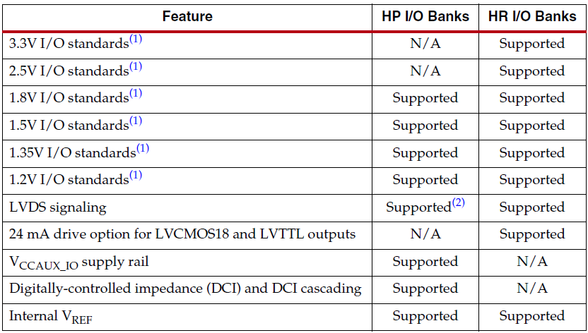

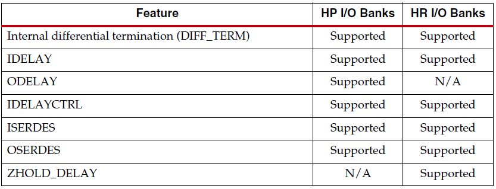

二者主要差别如上图所示

HR Bank具有更低的延迟和较小的驱动电流以及一些额外功能；HR Bank能支持更高的电压标准（2.5V和3.3V）。在板级硬件设计中，需要根据外围电路电平标准优先考虑使用哪种bank

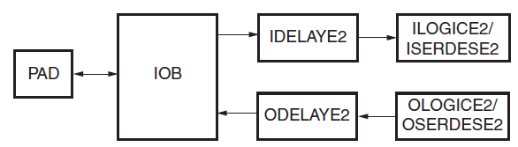

上图是HP Bank结构图

下图是HR Bank结构图，可以发现HR Bank不能控制输出Delay

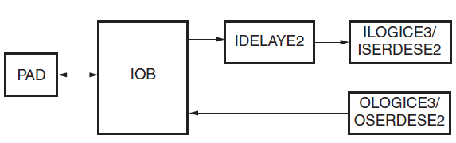

## IO Bank

一个IO Bank由50个**IOB**（IO Block）组成，器件的封装和型号决定了有多少bank可用。**每个bank的最末端两个IO只能适用于单端I/O标准**；剩下的48个的引脚可以使用单端或差分标准——两个IO引脚能组成差分对。

最末端两个IO被称为*单端IO*（Single-Ended IO）；其他的IO被称为*普通IO*（Regular IO）或差分IO

支持的IO电平标准如下

* 单端I/O标准：**LVCMOS**、**LVTTL**、HSTL、PCI、SSTL
* 差分I/O标准：**LVDS**、Mini_LVDS、RSDS、PPDS、BLVDS、差分HSTL、SSTL

单端、差分情况下的每种bank内部电路如下图所示

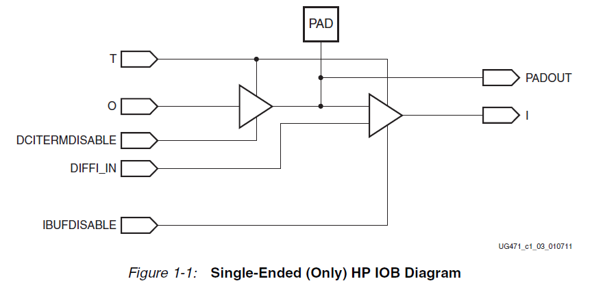

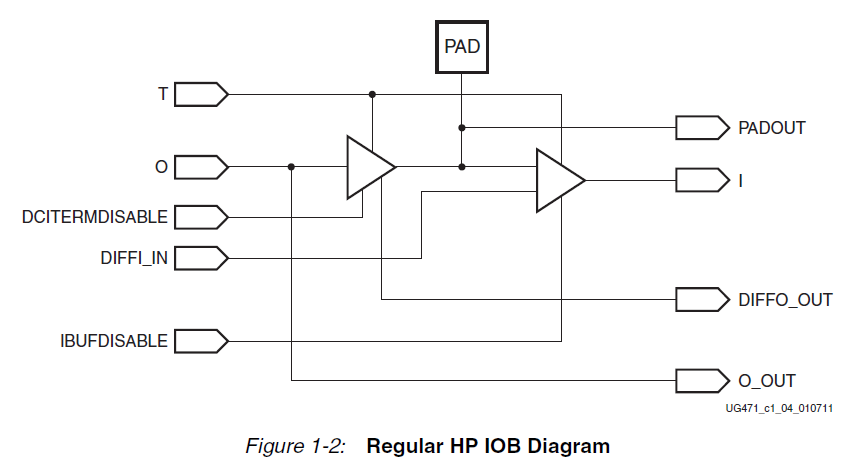

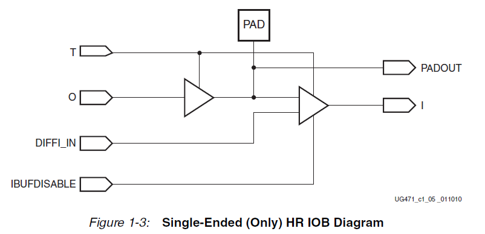

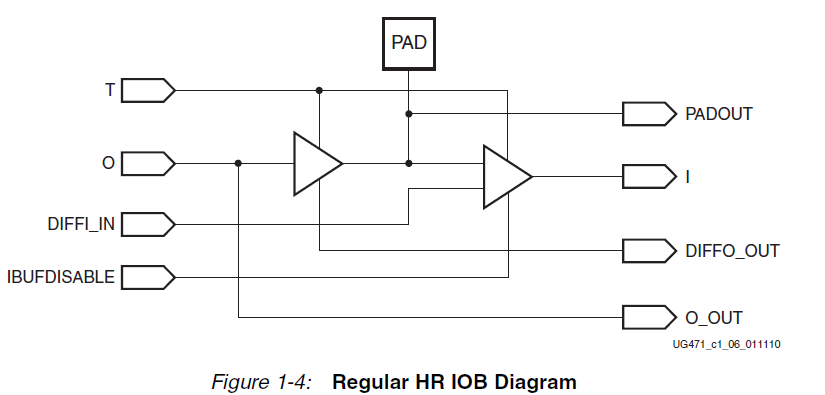

可以看出，单端IOB和普通IOB基本上是等同的，每个IOB都包含输入O、输出I和三态驱动器T以及一些内部缓冲器电路。只不过单端IO没有连接来产生差分输出信号；而HR Bank相较HP Bank缺少了`DCI Term Disable`端口来进行片上终端使能控制

### DCI

随着FPGA越来越大，系统时钟速度越来越快，PCB的设计和制造变得更加困难，信号完整性SI成为一个关键问题。PCB上的导线必须被正确端接以避免反射或振铃。

一般来说需要在传输线两端接入匹配电阻，使输出和输入与接收器或驱动器的阻抗相匹配。然而，由于设备I/O的增加，在设备引脚附近添加电阻会增加电路板面积和元件数量。为了解决这些问题并实现更好的信号完整性，Xilinx在7000系FPGA内提供了**数字控制阻抗**（Digitally Controlled Impedance，**DCI**）技术。根据不同的I/O标准，DCI可以主动调整I/O内部驱动器的输出阻抗，从而准确*匹配传输线VRN和VRP上外部精密参考电阻*的特性阻抗，这样就**不需要在电路板上安装多余的终端电阻**，减少了电路板的布线困难和元件数量

DCI还会不断调整阻抗以补偿温度和电源电压的变化。

注意：**DCI只适用于7000系FPGA的HP Bank**

在每个Bank中，使用两个多用途的参考引脚来确定这组IO Bank要匹配的终端阻抗。将N参考引脚（VRN）通过一个精密参考电阻拉高到VCCO；而P参考引脚（VRP）通过另一个参考电阻拉低到地。**每个参考电阻的值应等于IO对应PCB导线的特性阻抗或其两倍**

完成硬件设计后，只需要在FPGA物理约束中确定DCI电平标准即可使用

### IO Bank电源

1. **VCCO电源**

    VCCO电源是7000系FPGA里IOB的主要电源。一个IO Bank里的所有VCCO引脚都必须连接到电路板上相同的外部电源，因此一个特定的I/O组中的所有I/O都必须与外部电源共享相同的VCCO电平。不正确的VCCO电压可能会导致IO功能失效甚至损坏器件

    > HP Bank中，若IO电压低于1.8V但VCCO大于2.5V，器件会进入过压保护模式，用正确的VCCO电平重新配置器件才能恢复正常

2. **VREF**

    带有差分输入缓冲器的单端I/O需要一个输入参考电压VREF。当一个IO组内需要VREF时，该组的两个多功能VREF引脚必须用作VREF电源输入。

    通过启用INTERNAL_VREF约束，可以选择使用内部产生的参考电压

3. **VCCAUX**

    全局辅助电源VCCAUX主要用于为7000系FPGA内的各种块的互连逻辑（也就是连线资源）提供电源

    VCCAUX也被用来为某些IO标准的输入缓冲电路供电——包括所有1.8V或低于1.8V的单端I/O标准，在HR Bank使用2.5V的IO标准时，也会使用VCCAUX获取供电

    I/O Bank的差分输入缓冲器也使用VCCAUX供电

4. **VCCAUX_IO**

    辅助I/O电源VCCAUX_IO只存在于HP Bank，负责为高速I/O电路提供电源。使用独立供电可以满足某些类型内存接口的更高频率性能

    LVDS使用的驱动电路与单端驱动不同，后者受VCCAUX_IO的影响更大。因此对于LVDS接口来说VCCAUX_IO的电压影响不大

## MIO、EMIO与GPIO

Xilinx Zynq-7000设备中搭载了三个功能类似的片上外设：

* MIO：Multiuse-IO
* EMIO：Extendable Multiuse-IO
* GPIO：General Purpose IO

其中**MIO是PS端对片外的接口**，**EMIO是PS端与PL端的接口**，GPIO则是具有IO功能外设的统称，在PS端集成了一套GPIO，同样可以在PL端用HDL写出一个GPIO外设

观察系统框图可以发现PS部分的所有外设都需要先复用到MIO再引出片外。而部分外设可以选择先通过EMIO连接到PL端，再引出片外


> Zynq的核心是PS端的ARM核，将FPGA视为它的一个外设
>
> 从这个EMIO也可以反映出这个观点

PS端的引脚信号如下所示


Clock、Reset、DDR三个部分都是固定的，暂且不看，可以发现MIO有三组引脚，其中PS_MIO_VREF引脚是MIO1电源域的参考引脚；PS_MIO引脚被分成了两组，分别使用MIO0电源域和MIO1电源域的参考电压，分组信息如下所示：


ug585手册中还给出了PS-PL-MIO-EMIO的接口框图

> MIO是PS端的基础IO外设，不过IO外设信号也可以通过EMIO连接到PL端


从上面的系统框图中可以看出，PS端内核通过AHB、APB总线控制PS IO外设控制器（**IOP**），从而驱动MIO或EMIO。IOP可以同时管理MIO、EMIO的复用器。

需要注意：IOP就是传统意义上的GPIO，它通过复用连接到诸如I2C控制器、SPI控制器、SDIO控制器等外设上，从而为这些外设提供输出驱动，与此同时该设备不能像FPGA或者说FPIOA那样可以任意分配引脚，每个外设都被分配了固定的几组引脚，限制相对较大

与PS部分的AXI接口不同，EMIO只能将来自IOP的信号连接到PL端，并不能形成完整的总线架构

## IO原语（SelectIO Primitives）

在编写RTL中，可以选择直接调用Xilinx提供的IOB原语来使用某些具有特殊功能的IO，可用的单端IO原语如下所示

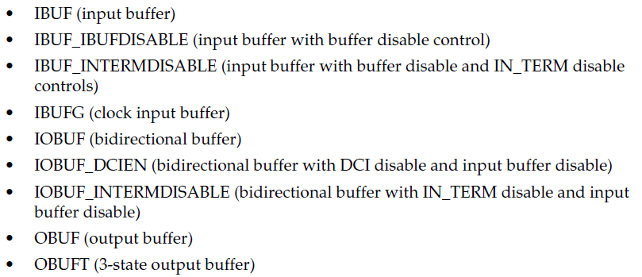

可用的差分IO原语如下所示

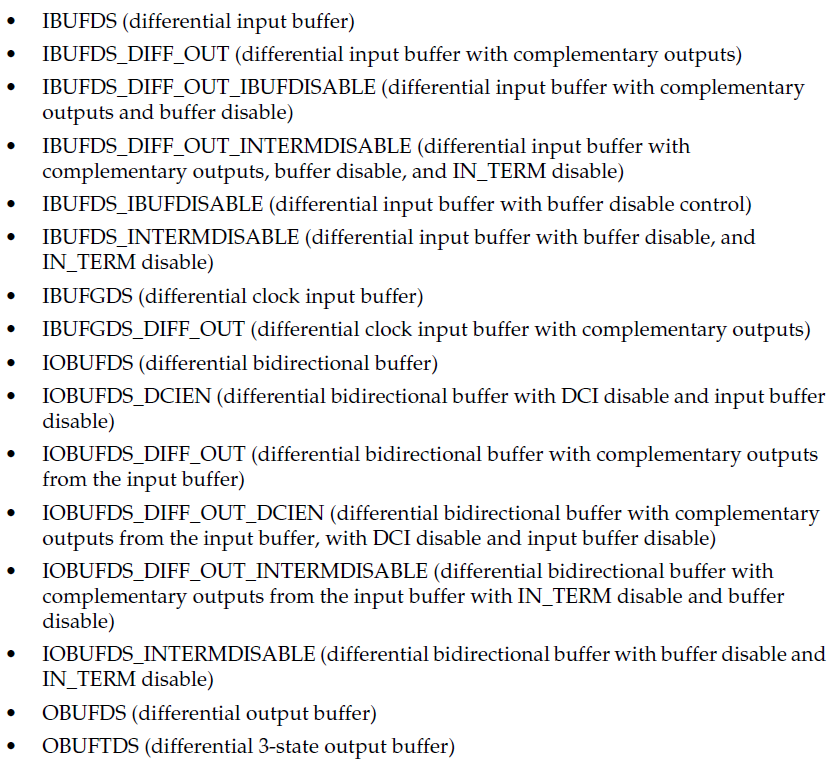

下面来简单介绍几个常用的原语

### IBUF和IBUFG

`IBUFG`原语用于时钟输入，综合器会调用一个输入缓冲器来实现电路，从而保证时钟的低抖动

`IBUF_IBUFDISABLE`原语用于禁用一个IBUF，并强制O引脚输出高电平，尝尝用于关闭不需要的输入缓冲器降低功耗

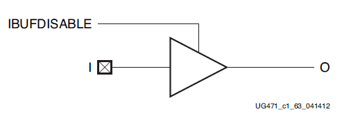

`IBUF_INTERMDISABLE`只能在HR Bank中使用，使用这个原语可以禁用输入缓冲器，并在USE_IBUFDISABLE属性被设置为1且IBUFDISABLE信号被断定为1时，将O输出到结构中

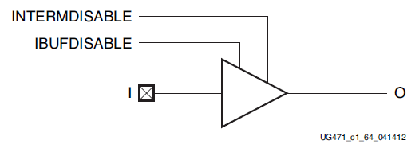

`IBUFDS`和`IBUFGDS`是IBUF的差分版本，常用于差分时钟信号的输入控制

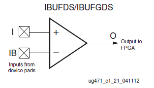

### IBUFDS_DIFF_OUT和IBUFGDS_DIFF_OUT

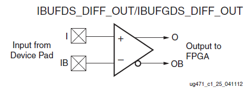

这个原语用于接收差分形式输入的信号，并将其转换成一对互补输出O和OB

它也可以使用`IBUFDISABLE`和`INTERMDISABLE`

### IOBUF

同时具有输入和输出功能的缓冲器原语，结构如下所示

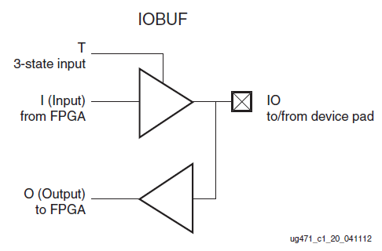

它也可以使用`IBUFDISABLE`和`INTERMDISABLE`功能端

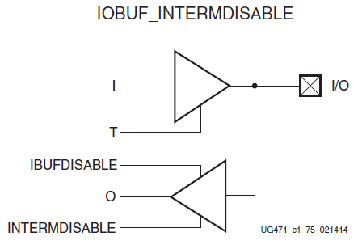

也有用于差分信号的原语`IOBUFDS`

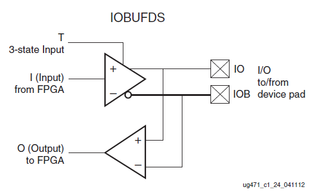

### OBUF

只能用于输出的缓冲器原语，常用于各种信号从FPGA内向引脚输出

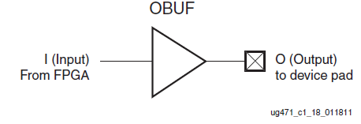

调用`OBUFTDS`可以实现三态输出

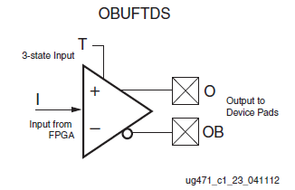

### 原语调用

使用下面语句即可调用IOBUF

```verilog
IOBUF #(
    .DRIVE(12), // 输出驱动强度
    .IBUF_LOW_PWR("TRUE"), // HR = "TRUE", HP = "FALSE" 
    .IOSTANDARD("DEFAULT"), // IO标准
    .SLEW("SLOW") // 速率等级
) IOBUF_inst (
    .O(user_out), // IOBUF输出端（用户信号输入端）
    .IO(user_io), // IOBUF输入输出端（直连到顶层模块）
    .I(user_in), // IOBUF输入端（用户信号输出端）
    .T(user_tri) // 三态控制端, 高电平输入, 低电平输出 
);
```
