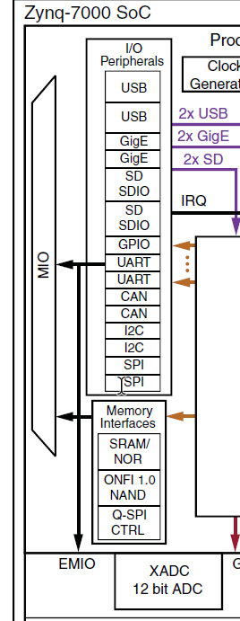
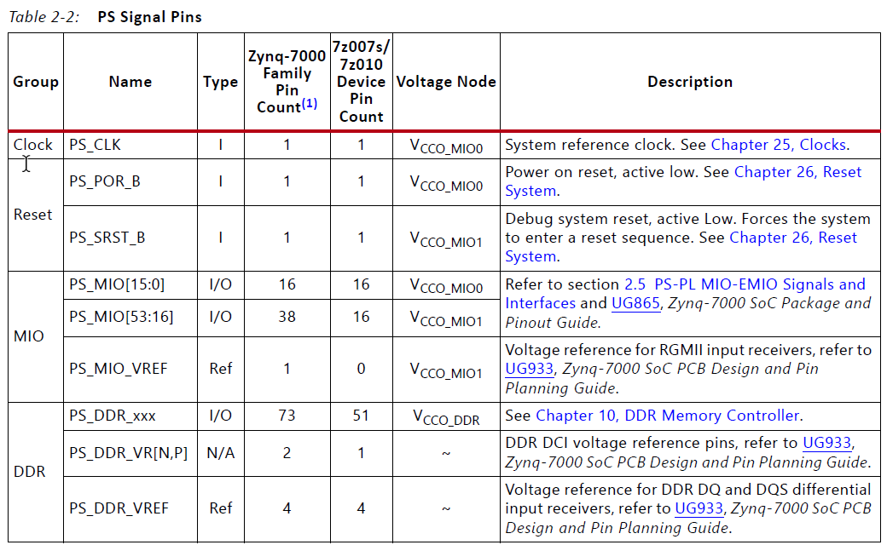

# MIO、EMIO与GPIO

Xilinx Zynq-7000设备中搭载了三个功能类似的片上外设：

* MIO：Multiuse-IO
* EMIO：Extendable Multiuse-IO
* GPIO：General Purpose IO

其中**MIO是PS端对片外的接口**，**EMIO是PS端与PL端的接口**，GPIO则是具有IO功能外设的统称，在PS端集成了一套GPIO，同样可以在PL端用HDL写出一个GPIO外设

观察系统框图可以发现PS部分的所有外设都需要先复用到MIO再引出片外。而部分外设可以选择先通过EMIO连接到PL端，再引出片外

> Zynq的核心是PS端的ARM核，将FPGA视为它的一个外设
>
> 从这个EMIO也可以反映出这个观点

PS端的引脚信号如下所示

Clock、Reset、DDR三个部分都是固定的，暂且不看，可以发现MIO有三组引脚，其中PS_MIO_VREF引脚是MIO1电源域的参考引脚；PS_MIO引脚被分成了两组，分别使用MIO0电源域和MIO1电源域的参考电压，分组信息如下所示：

ug585手册中还给出了PS-PL-MIO-EMIO的接口框图

> MIO是PS端的基础IO外设，不过IO外设信号也可以通过EMIO连接到PL端

从上面的系统框图中可以看出，PS端内核通过AHB、APB总线控制PS IO外设控制器（**IOP**），从而驱动MIO或EMIO。IOP可以同时管理MIO、EMIO的复用器。

需要注意：IOP就是传统意义上的GPIO，它通过复用连接到诸如I2C控制器、SPI控制器、SDIO控制器等外设上，从而为这些外设提供输出驱动，与此同时该设备不能像FPGA或者说FPIOA那样可以任意分配引脚，每个外设都被分配了固定的几组引脚，限制相对较大

与PS部分的AXI接口不同，EMIO只能将来自IOP的信号连接到PL端，并不能形成完整的总线架构

