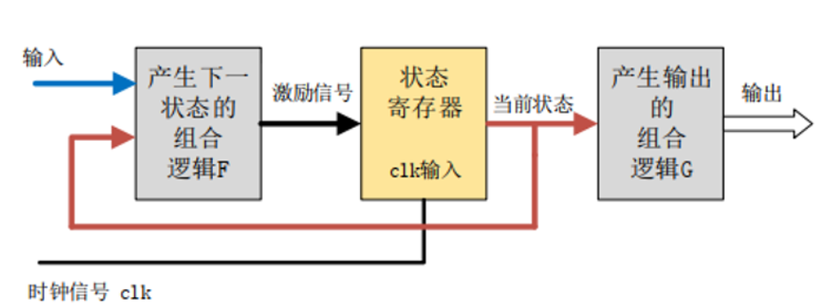
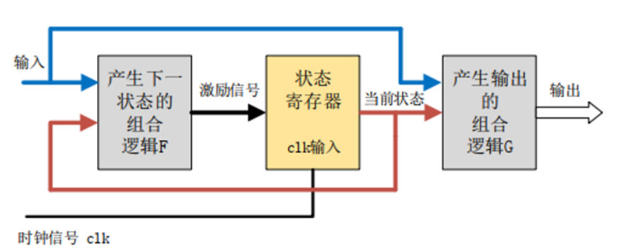

# Verilog HDL中的状态机

在写verilog的时候，难免要用到状态机来实现控制逻辑，这里面有很多需要仔细研究的电路特性，笔者将自己的部分学习感悟列举在本文中

> 下面内容仅针对verilog进行探讨，并且尽量以RTL描述而不是行为级描述给出代码

## 参考博文与教程

https://blog.csdn.net/weixin_39269366/article/details/120550409

https://www.cnblogs.com/lifan3a/articles/4583577.html

https://blog.csdn.net/Jackiezhang1993/article/details/85045621

https://bbs.huaweicloud.com/blogs/284793

## 状态机基本概念

在数字电路中，**有限状态机**（Finite State Machine，FSM）简称状态机，是一种基于状态转移描述顺序逻辑的组合逻辑时序逻辑混合电路。FSM源自“通用的”序列信号发生器电路。

### 状态机分类与基本描述

状态机模型分为两类：

* **Moore**状态机：时序逻辑的输出只与当前状态有关
* **Mealy**状态机：时序逻辑的输出不仅取决于当前状态，还与输入有关

FSM是一种在有限个状态之间按一定规律转换的时序电路，可以认为是组合逻辑和时序逻辑的一种组合，因此包含有组合逻辑和时序逻辑两部分。这就导致笔者在使用Verilog HDL描述时经常会有疑问：该怎么描述才能把时序逻辑和组合逻辑区分开并做到最稳定的时序？

为了深入探讨这个问题，我们不妨回顾一下状态机的硬件结构框图

下面是Moore型状态机的结构框图，不难发现，它由三块主要逻辑构成：**负责状态转移的组合逻辑F、负责产生输出的组合逻辑G、负责记录当前状态的时序逻辑R**



如果使用代码描述，我们可以如下尝试：

下列代码有四种状态，使用一个寄存器来存储，同时搭配了输入和输出的两套组合逻辑

```verilog
module Moore_FSM(
    input wire in,
    output wire out
);
    reg [1:0] current_state; //当前状态
    reg [1:0] next_state; //下一状态
    
    //负责状态转移的逻辑R
    always @(posedge clk) begin
        current_state <= next_state; //根据下一状态next_state激励信号完成当前状态切换
    end
    
    //产生下一状态的组合逻辑F
    always @(*) begin
        case(current_state)
            2'b00: begin
                if(in) begin //根据输入条件判断
                    next_state = 2'b01; //状态转移,以下省略
                end
                else begin
                    next_state = 2'b00;
                end
            end
            2'b01: begin
                //...
            end
            2'b10: begin
                //...
            end
            2'b11: begin
                //...
            end
            default: begin
                next_state = 2'b00; //满足自启动条件
            end
        endcase
    end
    
    //产生输出的组合逻辑G
    always @(*) begin
        case(current_state)
            2'b00: begin
                out = 1'b1;
            end
            2'b01: begin
                //...
            end
            2'b10: begin
                //...
            end
            2'b11: begin
                //...
            end
            default: begin
                out = 1'b1;
            end
        endcase
    end
        
endmodule
```

如果你经常使用状态机，那么肯定表示“*这不就是个三段式状态机吗*”。没错，这一段按照结构框图的RTL写法正好符合三段式状态机的要求，或者说三段式状态机的严谨性就来自于它严格按照了结构框图对硬件进行描述而不过于依赖综合器，至于这段代码对我们的启发，我们之后再谈，现在再来看Mealy型状态机的Verilog写法

> 你可能会发现组合逻辑G部分代码里面使用了current_state而不是next_state。这个问题很关键，但我们下个部分再详细说

Mealy状态机并没有复杂多少



```verilog
module Mealy_FSM(
    input wire in,
    output wire out
);
    reg [1:0] current_state; //当前状态
    reg [1:0] next_state; //下一状态
    
    //负责状态转移的逻辑R
    always @(posedge clk) begin
        current_state <= next_state; //根据下一状态next_state激励信号完成当前状态切换
    end
    
    //产生下一状态的组合逻辑F
    always @(*) begin
        case(current_state)
            2'b00: begin
                if(in) begin //根据输入条件判断
                    next_state = 2'b01; //状态转移,以下省略
                end
                else begin
                    next_state = 2'b00;
                end
            end
            2'b01: begin
                //...
            end
            2'b10: begin
                //...
            end
            2'b11: begin
                //...
            end
            default: begin
                next_state = 2'b00; //满足自启动条件
            end
        endcase
    end
    
    //产生输出的组合逻辑G
    always @(*) begin
        case(current_state)
            2'b00: begin
                if(in) begin //根据当前输入和状态产生输出
                    out = 1'b1;
                end
                else begin
                    out = 1'b0;
                end
            end
            2'b01: begin
                //...
            end
            2'b10: begin
                //...
            end
            2'b11: begin
                //...
            end
            default: begin
                out = 1'b1;
            end
        endcase
    end
        
endmodule
```

这段代码只不过在Moore型状态机的基础上加入了一对ifelse语句来满足*Mealy状态机输出同时取决于输入和当前状态*的特性——这也是实际应用中最常见的写法

需要说明一点：状态机的输出电路G，可以在后面加入一个寄存器用于满足后续电路的同步要求，还可以减少竞争冒险，不过这样的后果就是状态机输出相对输入会往后延迟一个时钟周期。在Verilog中只要把第三个always块改成时钟边沿触发即可

```verilog
always @(posedge clk)
```

## 如何写状态机

从上面标准的两个状态机模型上，我们可以发现：任何状态机都可以被抽象成标准的Mealy和Moore状态机，因此三段式状态机代码可以用于良好描述任何状态机。这就是为什么大伙都在说三段式状态机性能好。

不过一段式和两段式状态机也是能见到的。

**一段式状态机只有一个时序逻辑always块**，把所有的逻辑（输入控制状态转换F、输出控制G、状态轮转R）都在同一个always块内实现。代码看起来很简洁，而且很符合顺序执行的软件写法，但是不利于维护（修改逻辑会很痛苦），如果状态复杂一些就很容易出错，在简单的状态机情形下倒是经常使用

```verilog
//F、R、G写在同一个时序逻辑块内
always @(posedge clk) begin
    case(state)
        2'b00: begin
            if(a) begin
                state <= 2'b01;
            end
        end
        2'b01: begin
            if(b) begin
                state <= 2'b10;
            end
        end
        2'b10: begin
            if(c) begin
                state <= 2'b11;
            end
        end
        2'b11: begin
            if(d) begin
                state <= 2'b00;
            end
        end
        default: begin
        	state <= 2'b00;
        end
    endcase
end
```

**两段式状态机使用一个同步时序always块描述状态转移R，另一个组合逻辑always块判断状态转移条件F和判断输出G**，有一个问题：状态转移需要与时钟同步才能保证稳定无毛刺的运转，而状态转移这样比较大块的组合逻辑会为后面电路带来严重的竞争冒险隐患，因此**两段式状态机不常用**，很多厂商的EDA工具手册中也不推荐使用两段式状态机，因为这会让生成电路的效果依赖于综合器

```verilog
always @(posedge clk) begin
    current_state <= next_state;
end

always @(*) begin
    case(current_state) 
    	2'b00: begin
            next_state = 2'b01;
            if(in) begin
                out = 1'b0;
            end
            else begin
                out = 1'b1;
            end
        end
        2'b01: begin
            next_state = 2'b10;
        end
        2'b10: begin
            next_state = 2'b00;
        end
        default: begin
            next_state = 2'b00;
            out = 1'b1;
        end 
    endcase
end
```

### 被误用的三段式状态机

一般来说，三段式状态机只有我们之前谈到的两种形式，二者的区别就是

* Moore型状态机输出仅取决于当前状态，因此会使用下面这样的组合逻辑来实现输出选择

    ```verilog
    //产生输出的组合逻辑G
    always @(*) begin
    	case(current_state)
            2'b00: begin
                out = 1'b1;
            end
            2'b01: begin
                //...
            end
    		//...
            default: begin
                out = 1'b1;
            end
    	endcase
    end
    ```

* Mealy型状态机的输出同时取决于当前状态和输入，会在组合逻辑里面引入一系列if块，条件是当前输入状态

    ```verilog
    //产生输出的组合逻辑G'
    always @(*) begin
    	case(current_state)
            2'b00: begin
                if(in) begin
                    out = 1'b1;
                end
                else begin
                    out = 1'b0;
                end
            end
            2'b01: begin
                //...
            end
    		//...
            default: begin
                out = 1'b0;
            end
    	endcase
    end
    ```

其中Mealy型状态机的if语句是一个经常被误用的地方：很多教程中会提到使用`case(next_state)`而不是`case(current_state)`，同时以Moore型状态机的形式（case里面没有if语句）来描述三段式状态机，这可能会引入错误！

我们来看三段式状态机负责产生下一状态的组合逻辑F

```verilog
always @(*) begin
	case(current_state)
		2'b00: begin
			if(in) begin //根据输入条件判断
				next_state = 2'b01; //状态转移,以下省略
			end
			else begin
				next_state = 2'b00;
			end
		end
		//...
		default: begin
			next_state = 2'b00; //满足自启动条件
		end
	endcase
end
```

不难发现，下一状态的转移条件F是当前状态和输入决定，这与产生输出的逻辑G的工作条件*一模一样*，不同点只有时序逻辑和组合逻辑，因此大部分情况下完全可以使用`case(next_state)`来替代`case(current_state)`。然而有些开发者会有意无意的在状态机里面引入这样的输入：**只用于输出条件触发，而不用于状态转移**。这就导致了隐患出现：这样的输入信号只会出现在G逻辑块里面，而不会出现在F逻辑块里面。与此同时，G逻辑块使用了`case(next_state)`风格的描述，这就相当于在原来的if(in)块内部又引入了一个if(in_1)块，而if(in)块基于组合逻辑实时变化，if(in_1)块基于时序逻辑触发。这就将一部分工作交给了综合器——结果很明显：warning、亚稳态或latch三选一

因此**在使用三段式状态机时一定要注意输出逻辑G的描述**，根据实际情况合理选用Moore型或Mealy型

### 独热码or普通二进制or格雷码？

状态机中的状态寄存器通常使用三种编码方式，下面以五种状态作为演示：

* **二进制码**：正常的二进制编码或BCD码

    ```verilog
    localparam STATE_A = 3'b000;
    localparam STATE_B = 3'b001;
    localparam STATE_C = 3'b010;
    localparam STATE_D = 3'b011;
    localparam STATE_E = 3'b100;
    ```

* **独热码**：每个状态的编码中只有一个位是高电平，其余位都是低电平

    ```verilog
    localparam STATE_A = 5'b00001;
    localparam STATE_B = 5'b00010;
    localparam STATE_C = 5'b00100;
    localparam STATE_D = 5'b01000;
    localparam STATE_E = 5'b10000;
    ```

* **格雷码**：相邻状态之间只改变1位的二进制码

    ```verilog
    localparam STATE_A = 3'b000;
    localparam STATE_B = 3'b001;
    localparam STATE_C = 3'b011;
    localparam STATE_D = 3'b010;
    localparam STATE_E = 3'b110;
    ```

在比较三种编码之前，我们先来看RTL状态机状态寄存器电路的结构：R逻辑中主要包含两种电路——*负责存储状态的状态寄存器*和*负责判断状态的比较器组合逻辑*。在每个时钟上升沿，比较器组合逻辑会根据当前状态寄存器的值输出下一状态，状态寄存器的位宽就决定了状态机的寄存器资源占用，比较器组合逻辑规模则决定了状态机能接受的状态转移速率下限，即状态机的时钟频率。

**二进制码**是最节省寄存器的——他**只用n位就可以描述2^n个状态**；但它使用了较多的组合逻辑资源——二进制码需要嵌套比较器才能进行逐位比较，还要保证所有位都要同时到达目标层次的比较器，增加布线难度，综合时难以优化，同时嵌套多层的组合逻辑可能会拉低状态机时钟频率

独热码与二进制码正好相反——节省逻辑资源；但使用更多位宽，消耗寄存器资源更多。相对其他两种编码，**独热码**节省了组合逻辑，后续组合逻辑电路嵌套更少，因此能提高一点状态转移的速度，**适合在高速系统中使用**。*独热码实际上相当于已经译码过后的信号*，比较器逻辑只需要比较每一位是否为1就可以得到是否跳转

**格雷码**相邻的状态转移只有一位变化，因此在描述有序的状态转移中优势很大，需要的触发器少，**电路发生毛刺、亚稳态的概率非常小**；但相对应，需要的比较器和二进制码一样多，并且布线要更复杂

**一般低速系统中，状态机中状态的个数小于8个，就可以使用四位的二进制码表示，如果状态机需要保证更少的寄存器占用，也可以使用二进制码来压缩状态寄存器位宽；在高速系统中，尽量使用独热码，状态数小于4个的话，两位二进制码并不会引入额外的比较器，也可以使用；若状态机的寄存器资源无要求，独热码是性能最优的方案；格雷码尤其适用于大量状态转移、异步FIFO这些非常需要稳定性的状态机，只需要付出一点时钟频率就可以大幅度减小亚稳态出现的概率，如果状态数多于32，就可以考虑使用5位格雷码表示**

### 处理自启动问题

状态机中，若启动后的初始状态的次态能够落到状态机的几个状态中，则称此状态机具有**自启动**功能

状态机需要考虑从开机后不定态的情况下怎么跳转到初态。我们通常可以使用三种方法：

* 设置default状态：将F逻辑中case块的default设置为`next_state = STATE_0;`，从而让上电后不定态的寄存器被置为初态

    ```verilog
    always @(*) begin
    	case(current_state)
    		2'b00: begin
    			if(in) begin //根据输入条件判断
    				next_state = 2'b01; //状态转移,以下省略
    			end
    			else begin
    				next_state = 2'b00;
    			end
    		end
    		//...
    		default: begin
    			next_state = 2'b00; //满足自启动条件
    		end
    	endcase
    end
    ```

* 设置上电复位：在寄存器声明时进行初始化

    ```verilog
    reg [1:0] current_state = 2'b00;
    reg [1:0] next_state = 2'b00;
    ```

* 外部复位：在状态机中引入同步或异步的外部复位信号，上电以后自动触发复位信号，在这个信号触发时加载初始状态

    ```verilog
    always @(posedge clk or negedge rst_n) begin
        if(!rst_n) begin
            current_state <= STATE_0;
        end
        else begin
            current_state <= next_state;
        end
    end
    ```

解决了自启动问题，可以大大增强电路在上电和复位时的稳定性
