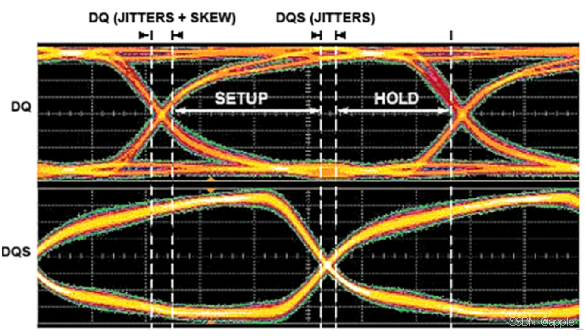

# SoC学习笔记【DDR】

**DDR**即“双倍数据速率”（Double Data Rate），采用DDR技术的RAM一般被直接称为DDR，我们就用DDR代称“DDR RAM”

## DRAM与DDR

DDR显然属于存储器的一部分，其主要功能是存储程序和各种数据，并能在计算机运行过程中高速、自动完成程序或数据的存取。存储器主要分成2类：**RAM**和**ROM**。

| 类型              | 作用                                                         | 特点                      | 示例             |
| ----------------- | ------------------------------------------------------------ | ------------------------- | ---------------- |
| 随机存取存储器RAM | 可以随时读写，DRAM工艺制造的器件速度很快，通常作为操作系统或其他正在运行中的程序的临时数据存储媒介 | 断电时RAM不能保留数据     | SDRAM、DRAM、DDR |
| 只读存储器ROM     | ROM所存数据一般是装入整机前事先写好的，整机工作过程中只能读出（相对于用户来说）。但现代的ROM一般都是可读写的，只不过受到工艺限制，擦除和重新写入的速度比RAM慢很多 | 断电后ROM所存数据不会改变 | FLASH、HDD       |

RAM技术又可以分成2大类：**SRAM**和**DRAM**

| 类型            | 实现   | 作用                                                         | 特点                                                         |
| --------------- | ------ | ------------------------------------------------------------ | ------------------------------------------------------------ |
| 静态RAM（SRAM） | 寄存器 | 门电路保持状态（0或1），通电时数据始终存在，不需要刷新       | 速度快，不必配合内存刷新电路，可提高整体的工作效率。缺点是同等存储1bit数据所占用的片上面积大，导致价格较高。少量用于关键性系统以提高效率（比如片上Cache） |
| 动态RAM（DRAM） | 电容器 | 如果电容器充电，则此时的状态是1；如果放电，则状态是0。因为电容器会随着时间而漏掉一部分电，所以内存单元需要周期性地刷新 | 必须刷新才可以持续使用，导致功耗更高；读写速度相对较慢。但是比较便宜 |

### DDR历史

在20世纪40年代，早期的计算机就已经出现，它采用**延迟线存储器**，基于声波或电信号在延迟线中的传播延迟来存储数据，这导致每次读写数据都要等待一轮信号循环。最经典的例子就是**磁鼓存储器**：利用旋转的磁鼓表面存储数据，和后来的磁带很像——这就导致如果想读写同一处的数据，就需要等待磁鼓完成一轮旋转，同时存储容量也非常小。

1950年到1970年代中，计算机设备开始使用**磁芯存储器**：利用铁氧体磁环存储二进制数据，每个磁环代表一个bit，利用磁场方向表示0和1。该类存储器存取速度相对高，并且不易损坏；但它制造复杂（当时美国的磁芯存储器供应商甚至雇佣纺织工来“编织”存储器设备）、体积大、存储容量有限，随着半导体存储器兴起而遭淘汰。

20世纪70年代是Intel的时代，随着科技的发展，半导体存储器成为了现代计算机存储器的主流，Intel就是凭借引领了这股浪潮崛起。Intel在1970年成功量产了划时代的C1103，这是世界上第一款成熟商用的**DRAM**芯片。DRAM利用电容存储数据，成功使得存储器存储1bit数据的成本降低到1美分，极大地推动了半导体存储器的普及和应用。到了1974年，Intel的DRAM产品全球市场份额达到82.9%，标志着半导体内存开始主导市场。

在后续的发展中，Intel提出了摩尔定律，70、80年代，半导体市场随摩尔定律膨胀，这导致**SRAM**开始在市场上出现——顺便一提，Intel在此之前急流勇退，凭借CPU再续数十年辉煌——它利用6个晶体管存储1bit数据（标准结构），速度非常快但密度低，这导致其成本较高，因此主要应用在需要高速缓存的场景，比如CPU缓存。

20世纪80年代，快速页面模式DRAM（**FPM DRAM**）成为主流，它通过在同一行内存中以更快的速度访问连续的数据，提升了数据访问的效率；但它在读取完当前数据后，必须等待一段时间才能发起下一次数据访问，这种停顿限制了内存带宽的提升。

1994年，**EDO DRAM**出现，它扩展了数据读出机制，允许内存可以在读取一个数据的同时准备下一个数据（流水线），使数据访问的停顿减少，提升了内存带宽。与FPM DRAM相比，EDO DRAM通常可以将存取周期缩短为70ns（FPM  DRAM通常需要80ns以上），虽然在整体系统中带来的性能提升相对有限（在5%~10%之间），但在多任务操作和图形处理等对带宽要求较高的应用场景下表现明显更好。这里补充一个重要的背景知识：微软在1985年开发了Windows，而在1994年这个节点，Windows NT3.5正随着PC的普及成为主流。因EDO DRAM制造工艺相对简单，成本适中，迅速普及并成为中低端计算机的标准配置，以**SIMM**模块的形式被插到了千家万户的PC中。EDO DRAM被广泛用于搭配Intel 80486、Pentium等处理器。

> 早期的PC是以DIP封装的芯片形式焊接或者插在主板上的，但是随着技术的进步（特别是Intel 80286处理器的推出），计算机对内存的需求大大增加，主板上有限的插座和内存容量已无法满足应用的需求。于是*SIMM模块*（Single In-line Memory Module，单列直插式内存模组），也就是早期的内存条被提出，用户只需插拔内存条即可扩展内存容量，这大大简化了操作。

随着计算机技术的进一步发展，处理器性能越来越高，曾经困扰老一辈计算机用户的*存储墙*问题重新出现，计算机对内存带宽的需求急剧上升。EDO和FPM DRAM都属于异步内存，它们与CPU和系统时钟没有同步，导致在更高频率的系统中无法充分发挥潜力。

> 异步内存的工作不依赖系统时钟。内存DIMM模块与CPU之间的通信基于请求和响应——处理器发出内存访问请求时，内存模块需要根据自己内部的时钟来控制访问延迟，处理器必须等待内存准备好数据。在没有统一时序的情况下，内存访问时延可能会有所变化，CPU不得不等待较长的时间才能获取所需的数据，这会导致当内存访问频繁时系统性能急剧下降。随着处理器频率提升，该现象愈发严重

1996年前后，**SDRAM**（Synchronous DRAM）被引入，并很快成为内存市场的主流。SDRAM即同步DRAM，这里的“同步”是指内存工作需要同步时钟，DRAM SIMM模块和CPU之间的通信以*系统时钟*为基准，内存频率与*CPU外频*同步。

> 系统时钟是计算机中用于控制和协调各个部件的节奏器，这里特指CPU外频。现代的CPU实质上是功能较为单一的SoC，它接收主板时钟芯片提供的基准时钟，在内部进行倍频和分频，得到用于CPU内核的内频和用于内存通信的外频。CPU和内存实质上是依据这个时钟进行数据传输的，但CPU和主板上其他设备可能会采用其他频率的时钟（因为其他设备的读写速率比内存更慢）。**同步内存的引入使得CPU能够在时钟的上升沿、下降沿有规律地进行数据的读写操作**

同时，为了应对带宽不足问题，内存插座从原来的SIMM升级为**DIMM**（Dual In-line Memory Module，双列直插式内存模组），DIMM正反两侧的金手指传输不同的数据，采用168Pin接口，单边针脚数是84，支持64bit的数据总线，与当时最先进的CPU总线位宽一致——这就是我们熟知的内存条的前身。当然，SDRAM的时钟频率从最初的66MHz逐步提升到133MHz，远高于EDO DRAM所能支持的频率。这些措施极大提高了内存带宽。

到了1997年，随着SDRAM的大量普及，EDO DRAM逐渐被淘汰。尽管EDO DRAM在当时性能有所提升，但与SDRAM相比，其性能和带宽远远不够。特别是在高端计算和服务器领域，EDO DRAM很快失去竞争力。内存进入了**SDR SDRAM**（Single Data Rate SDRAM）时代。

2000年，**DDR1**出现，从此SDR SDRAM也在DDR SDRAM的光辉下黯然失色。**DDR SDRAM**（Double Data Rate Synchronous DRAM）即**双倍数据速率同步动态随机存储器**。SDR SDRAM只在时钟信号的上升沿传输数据，而采用DDR（Double Data Rate）技术的内存能够在时钟周期的上升沿和下降沿都进行数据传输，这样不需要提高时钟的频率就能实现双倍的SDRAM速度，换句话说就是双倍带宽。举例来说，DDR266内存工作在133MHz时钟，与同频率的PC133  SDRAM内存相比，前者比后者的带宽高一倍。DDR SDRAM的“同步S”、“动态D”和“DRAM”含义不变，是从曾经的SDRAM继承而来。

随后，内存市场完全被DDR所占据，DDR技术也在不断革新，推出DDR2、3一直到如今的**DDR5**和已经有规格起草的DDR6，每一代内存都在数据传输速度、低功耗表现和容量方面实现了显著提升，当前的DDR4和最新的DDR5内存已经可以提供几乎百倍于EDO DRAM的带宽和数千倍的容量。

随着2010年前后的移动设备浪潮，**LPDDR**（Low Power DDR，低功耗DDR）成为关键技术，LPDDR SDRAM内存在手机、平板等设备上应用广泛，从LPDDR1发展到LPDDR5，强调功耗和性能之间的平衡。

如今的2024年，**HBM**（High Bandwidth Memory，高带宽）内存技术也已经从服务器领域进入了PC。HBM是具有更高带宽的内存设备，通过垂直堆叠的方式来提升存储密度和传输速度，减少延迟和能耗，主要应用于GPU、AI、高性能计算领域，随着苹果M1芯片问世，搭载HBM的CPU也出现在了PC上。

下表给出了DDR技术的迭代和级别参数

| 版本 | 发行年份 | 电压 (V) | 数据速率 (MHz) | 带宽 (MB/s)   | 引脚数量 (DIMM) | 特点                                                         |
| ---- | -------- | -------- | -------------- | ------------- | --------------- | ------------------------------------------------------------ |
| DDR1 | 2000     | 2.5      | 200 - 400      | 1600 - 3200   | 184             | DDR1是第一代双倍数据速率内存。它通过双边缘的数据传输，提供了比传统SDRAM快一倍的传输速率。 |
| DDR2 | 2003     | 1.8      | 400 - 800      | 3200 - 6400   | 240             | DDR2进一步提高了数据速率，优化了信号传输，支持更高的时钟频率，并通过降低电压实现了更好的功耗控制。 |
| DDR3 | 2007     | 1.5      | 800 - 1600     | 6400 - 12800  | 240             | DDR3提供了更高的频率和带宽，并支持更大的内存模块容量。与DDR2相比，DDR3在性能和能效上都有显著提升。 |
| DDR4 | 2014     | 1.2      | 1600 - 3200    | 12800 - 25600 | 288             | DDR4在能效、数据速率和容量方面有显著提高，能够支持更大的内存模块。它的时钟频率更高，延迟优化，满足了当代计算机和服务器对高带宽的需求。 |
| DDR5 | 2020     | 1.1      | 3200 - 6400    | 25600 - 51200 | 288             | DDR5在数据速率、带宽和效率上都有极大的提升，尤其适合高性能计算、AI、大数据等对内存有极高需求的应用。DDR5还引入了更智能的电源管理和更高的能效优化。 |

## DDR信号和核心机制

从内存控制器到内存颗粒内部逻辑，笼统上讲从大到小为：channel＞DIMM＞rank＞chip＞bank＞row/column

举例来说，一个桌面平台的CPU通常支持2个或以上**通道**（**Channel**）的DDR，每个通道上可以插接2个内存条，即2个**DIMM**，每个DIMM会分成2个**Rank**（物理Bank），其中一个Rank由8个芯片（**Chip**）构成。进入芯片内部，一个芯片会由大量**Bank**构成，一个Bank就是一个存储矩阵，由很多的列（**Column**）和行（**Row**）存储单元组织而成，在读写过程中，只需要指定对应行列地址即可。

> 现在多数内存颗粒的位宽是8bit，而DIMM和CPU间的互联带宽是64bit，所以常用8个chip构成一个Rank

每个内存存储单元的存储宽度即内存芯片（也叫*内存颗粒*）的位宽，一般定为1Byte=8bit。

### 常见DDR信号线

一般的DDR颗粒采用BGA封装，包含大量功能引脚：至少包括**电源**、**配置信号**、**时钟信号**、**控制信号**、**地址信号**和**数据信号**。这里先看比较通用的控制、地址、数据信号。

一般通用控制信号包括：

* **RESET#**：芯片复位引脚
* **CS#**：片选使能，常用于多个Rank时的Rank组选择
* **RAS#**：行地址选通
* **CAS#**：列地址选通
* **WE#**：写使能

部分芯片还会集成多功能控制引脚，可用于特殊情况下的突发传输等

对部分DDR来说，地址信号 **BA+CA** 被安排为18位，其中3位表示Bank地址线，即 `BA[2:0]`，剩余的是片内地址线 **CA** 。传输过程中*行地址和列地址通常不会同时给出*，而是按照下列顺序发送：

1. **行激活**：主机发送 Activate 激活命令，提供行地址选中内存阵列中的特定行，此时内存控制器会将选定行加载到行缓冲区，准备后续读写
2. **列激活**：行激活完成后，主机发送 R/W 读写命令，同时传输列地址，定位到要读写的具体存储单元
3. **预充电**：在完成读写操作后，主机发送 PreCharge 预充电命令，使内存复位，准备下一次行激活

因此，DDR的地址信号线通常不会是行数+列数，而是取二者较大值，一般来说安排行地址为15位（`A[14:0]`），列地址位10位（`A[9:0]`）

根据DDR存储单元位宽不同，数据信号线 **DQ** 也有不一样的宽度，一般芯片至少会取8bit位宽，即 `DQ[7:0]` 来完成数据传输。但DDR与普通SDRAM最大的区别就在于它在时钟上升下降沿均可传输数据，这就导致芯片需要为数据线搭配*时钟信号*和*数据控制信号*，这就引入了DQS和DQS#。

DQS即数据选通信号，相当于给DQ安排了独立的时钟，可以确保主机和DDR在每个时钟周期的上升沿和下降沿准确采样数据。DQS和DQS#是双向的，在写入时用来传输由芯片发来的 DQS 信号；读取时则由内存生成 DQS 向芯片发送。芯片的每一组DQ都会搭配对应的DQS、DQS#，**每组线内信号同步，但两组线之间不需要同步**。

> 理论上DQ的读写时序完全可以由主时钟来同步，但速度提高之后信号收发电路可用的时序裕量越来越小，因此引入DQS能够增加传输的可靠性，同时不需要再考虑DQ和主时钟之间的关系。由于 DQS 和 DQ 是分组同步的，因此可以将同一组数据线放在PCB同一层，这样有助于简化设计、保障传输时序

但在DDR芯片工作时，实际上还是通过主时钟同步的，因此DQS在片上还是要和CK去同步，这就要控制DQS和CK之间的延迟。一般来说，写入DDR时，以DQS的高/低电平中部为数据周期分割点，但数据采样还是在DQS的边沿，如下图所示

DDR读操作时，数据从DDR到主机，DQS信号需要与DQ同步，即DQS与读数据**边沿对齐**，主控可以有充足的setup和hold time来采样信号。DDR写操作时，数据由控制器发送给内存，DQS信号由主机产生，并与写数据**中心对齐**，确保内存能够在时钟周期的中间采样数据

> 时钟周期的中间区域波动最小，中心对齐可以提高写操作的稳定性

与AXI等高速总线相似，DDR也能够使用突发传输，即在单次读写中连续传输多个bit的数据，而在此过程中，DQS信号起到同步时钟的作用

DQS信号的一个特殊点还在于它采用了**LVDS**（低电压差分信号）电平，采用DQS和DQS#两个信号线传输，以减小电压摆幅、降低EMI、提高抗噪声能力，从而保证高频下的稳定性。

### 突发传输

当主机内存控制器向DDR发送读写命令时，DDR会根据预设的突发长度在每个时钟周期的上升沿和下降沿连续传输多个数据块，而不是逐个周期发出一个数据传输请求。例如如果设定了突发长度为8（BL8），那么DDR会在一个命令下连续传输8个数据块，而无需为每个数据块单独发送命令

一般来说，地址线CA中的3位（A2、A1、A0）会被单独预留出来以支持突发传输，通过3bit的8种组合来判断突发长度（Burst Length）。在后续的DDR中，突发长度可以动态调整。

### 预读取

DDR可以一次性从内存阵列中读取多个数据块，并将这些数据暂时存储在 **Prefetch Buffer** 中等待传输。在随后的时钟周期内，DDR可以将这些预取的数据块逐一传输给控制器，从而提高内存吞吐量。

预取技术通常与突发传输相结合：单次传输中，DDR通过预取缓冲区一次性从内存阵列中读取多个数据块放入Prefetch Buffer，主机控制器会通过DQS信号在每个时钟周期的上升沿和下降沿读取这些数据。不同版本的DDR预取深度不同：DDR1使用**2n预取**，每次预取2个数据块；DDR2/3使用4n或8n；DDR4强制使用8n；DDR5提升到16n预取，单次预取16个数据块，显然，预取深度越大，内存在一次读取中能获取的数据就更多，有效提升高频下的内存效率。

同时，使用预取技术还能解决DDR内部总线速率（核心主时钟频率）较低的瓶颈。

### DDR时钟

为了保障传输同步，DDR有四个主要时钟：

* **输入主时钟CK**：输入内存的时钟频率，DDR内部的PLL会将该时钟倍频为其余时钟信号

* **核心主时钟**：内存的工作频率。用于内存阵列的访问和刷新

* **IO时钟**：DDR1的核心频率与IO时钟频率相同，在DDR2以后允许将主时钟倍频来得到一个更高速度的IO时钟，从而更好地支持预读取特性

    > DDR等效为预读取2位，而DDR2预读取4位，DDR3是8位，这就对应倍频系数

    通过该机制，即使主时钟较慢，DDR仍可以通过预读取特性来保持更高的外部数据传输速率

* **数据传输时钟DQS**：数据线上单次传输所使用的时钟

## DDRC

## DDRPHY和DFI

## DDR关键参数

## Xilinx DDR IP

