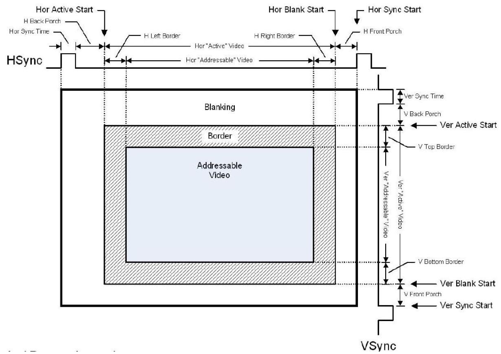
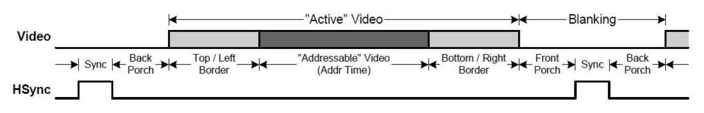

# SoC学习笔记【HDMI】

**HDMI**即高清多媒体接口（High Definition Multimedia Interface，HDMI），可以传输未压缩的音频、视频信号，是目前比较广泛使用的多媒体数据传输协议之一。

HDMI主要分为三个通道，以三种不同协议栈实现功能：

* **DVI通道**：使用4对TMDS（Transition Minimized Differential Signal，最小化传输差分信号）差分线，遵循DVI1.0规格传输信号，其中1对是时钟（data_clk），另3对是数据（data_red[7:0]，data_green[7:0]，data_blue[7:0]）
* **DDC通道**：采用100kHz时钟的I2C协议的双端协商通道，发送端和接收端通过该通道协商传输速率
* **CEC协商通道**：预留的扩展协商通道，不是协议中的必需项，但协议规定必须预留线路。

## DVI通道

HDMI协议的数据传输部分是从DVI协议演变而来的，不过加入了适应高速传输的编码和物理特性。DVI通道的8根数据线以**TMDS**作为物理层，并采用改版**8b10b编码**数据。该通道是HDMI传输的核心，在简化的HDMI设计中只需要实现该通道就可以完成图像数据传输了

> 需要注意：HDMI使用的8b10b编码并不是PCIe那种标准8b10b编码，HDMI不带有硬件时钟编码时钟恢复这样的复杂电路。

### TMDS传输

TMDS传输系统分为分为发送端和接收端。

TMDS以RGB888为像素颜色标准，发送端收到片上模块传来的24位并行RGB信号，对这些数据进行*8b10b*编码和并/串转换（利用*SERDES*硬件），再将表示3个RGB信号的数据分别分配到独立的传输通道发送出去

一个典型实现如下

```verilog
module dvi_encoder (
           input sys_pclk, // system clock
           input sys_pclk_5x, // system clock x5
           input sys_rst,
           //On-Chip parallel input
           input[7: 0] blue_din, // Blue data in
           input[7: 0] green_din, // Green data in
           input[7: 0] red_din, // Red data in
           input hsync, // hsync data
           input vsync, // vsync data
           input de, // data enable
           //TMDS output
           output tmds_clk_p,
           output tmds_clk_n,
           output[2: 0] tmds_data_p,
           output[2: 0] tmds_data_n
       );
wire [9: 0] red_coded;
wire [9: 0] green_coded;
wire [9: 0] blue_coded;

encode encoder_red(
           .sys_pclk ( pixelclk ),
           .sys_rst ( sys_rst ),
           .din ( red_din ),
           .c0 ( 1'b0 ),
           .c1 ( 1'b0 ),
           .de ( de ),
           .dout ( red_coded )
       );

encode encoder_green(
           .sys_pclk ( pixelclk ),
           .sys_rst ( sys_rst ),
           .din ( green_din ),
           .c0 ( 1'b0 ),
           .c1 ( 1'b0 ),
           .de ( de ),
           .dout ( green_coded )
       );

encode encoder_blue(
           .sys_pclk ( pixelclk ),
           .sys_rst ( sys_rst ),
           .din ( blue_din ),
           .c0 ( hsync ),
           .c1 ( vsync ),
           .de ( de ),
           .dout ( blue_coded )
       );

serdes_4b_10to1 u_serdes_4b_10to1(
                    .sys_pclk ( sys_pclk ),
                    .sys_pclk_5x ( sys_pclk_5x ),
                    .datain_0 ( blue_coded ),
                    .datain_1 ( green_coded ),
                    .datain_2 ( red_coded ),
                    .datain_3 ( 10'b1111100000 ),
                    .dataout_0_p ( tmds_data_p[0] ),
                    .dataout_0_n ( tmds_data_n[0] ),
                    .dataout_1_p ( tmds_data_p[1] ),
                    .dataout_1_n ( tmds_data_n[1] ),
                    .dataout_2_p ( tmds_data_p[2] ),
                    .dataout_2_n ( tmds_data_n[2] ),
                    .dataout_3_p ( tmds_clk_p ),
                    .dataout_3_n ( tmds_clk_n )
                );
endmodule
```

这里例化了3个`encode`编码器模块进行8b10b编码，并调用了一个`serdes_4b_10to1`进行串并转换

### TMDS编码

我们来看`encode`模块的实现

```verilog
module encode (
           input sys_pclk,
           input sys_rst,
           input [7: 0] din,  // data inputs: expect registered
           input c0,  // c0 input
           input c1,  // c1 input
           input de,  // de input
           output reg [9: 0] dout // TMDS data outputs
       );
localparam CTRLTOKEN0 = 10'b1101010100;
localparam CTRLTOKEN1 = 10'b0010101011;
localparam CTRLTOKEN2 = 10'b0101010100;
localparam CTRLTOKEN3 = 10'b1010101011;

/*
Counting number of 1s and 0s for each incoming pixel
component. Pipe line the result.
Register Data Input so it matches the pipe lined adder
output
*/
reg [3: 0] n1d; //number of 1s in din
reg [7: 0] din_q;

// always @ (posedge sys_pclk) begin
//     n1d <= #1 din[0] + din[1] + din[2] + din[3] + din[4] + din[5] + din[6] + din[7];
//     din_q <= #1 din;
// end
always @ (posedge sys_pclk) begin
    n1d <= din[0] + din[1] + din[2] + din[3] + din[4] + din[5] + din[6] + din[7];
    din_q <= din;
end

//INFO: Stage 1: 8 bit -> 9 bit
//INFO: Refer to DVI 1.0 Specification, page 29, Figure 3-5
wire decision1;
assign decision1 = (n1d > 4'h4) | ((n1d == 4'h4) & (din_q[0] == 1'b0));

/*
  reg [8:0] q_m;
  always @ (posedge clkin) begin
    q_m[0] <=#1 din_q[0];
    q_m[1] <=#1 (decision1) ? (q_m[0] ^~ din_q[1]) : (q_m[0] ^ din_q[1]);
    q_m[2] <=#1 (decision1) ? (q_m[1] ^~ din_q[2]) : (q_m[1] ^ din_q[2]);
    q_m[3] <=#1 (decision1) ? (q_m[2] ^~ din_q[3]) : (q_m[2] ^ din_q[3]);
    q_m[4] <=#1 (decision1) ? (q_m[3] ^~ din_q[4]) : (q_m[3] ^ din_q[4]);
    q_m[5] <=#1 (decision1) ? (q_m[4] ^~ din_q[5]) : (q_m[4] ^ din_q[5]);
    q_m[6] <=#1 (decision1) ? (q_m[5] ^~ din_q[6]) : (q_m[5] ^ din_q[6]);
    q_m[7] <=#1 (decision1) ? (q_m[6] ^~ din_q[7]) : (q_m[6] ^ din_q[7]);
    q_m[8] <=#1 (decision1) ? 1'b0 : 1'b1;
  end
*/
wire [8: 0] q_m;
assign q_m[0] = din_q[0];
assign q_m[1] = (decision1) ? (q_m[0] ^~ din_q[1]) : (q_m[0] ^ din_q[1]);
assign q_m[2] = (decision1) ? (q_m[1] ^~ din_q[2]) : (q_m[1] ^ din_q[2]);
assign q_m[3] = (decision1) ? (q_m[2] ^~ din_q[3]) : (q_m[2] ^ din_q[3]);
assign q_m[4] = (decision1) ? (q_m[3] ^~ din_q[4]) : (q_m[3] ^ din_q[4]);
assign q_m[5] = (decision1) ? (q_m[4] ^~ din_q[5]) : (q_m[4] ^ din_q[5]);
assign q_m[6] = (decision1) ? (q_m[5] ^~ din_q[6]) : (q_m[5] ^ din_q[6]);
assign q_m[7] = (decision1) ? (q_m[6] ^~ din_q[7]) : (q_m[6] ^ din_q[7]);
assign q_m[8] = (decision1) ? 1'b0 : 1'b1;

//INFO: Stage 2: 9 bit -> 10 bit
//INFO: Refer to DVI 1.0 Specification, page 29, Figure 3-5
reg [3: 0] n1q_m; // number of 1s and 0s for q_m
reg [3: 0] n0q_m;
// always @ (posedge sys_pclk) begin
//     n1q_m <= #1 q_m[0] + q_m[1] + q_m[2] + q_m[3] + q_m[4] + q_m[5] + q_m[6] + q_m[7];
//     n0q_m <= #1 4'h8 - (q_m[0] + q_m[1] + q_m[2] + q_m[3] + q_m[4] + q_m[5] + q_m[6] + q_m[7]);
// end
always @ (posedge sys_pclk) begin
    n1q_m <= q_m[0] + q_m[1] + q_m[2] + q_m[3] + q_m[4] + q_m[5] + q_m[6] + q_m[7];
    n0q_m <= 4'h8 - (q_m[0] + q_m[1] + q_m[2] + q_m[3] + q_m[4] + q_m[5] + q_m[6] + q_m[7]);
end

reg [4: 0] cnt; //disparity counter, MSB is the sign bit
wire decision2;
assign decision2 = (cnt == 5'h0) | (n1q_m == n0q_m);
// [(cnt > 0) and (N1q_m > N0q_m)] or [(cnt < 0) and (N0q_m > N1q_m)]
wire decision3;
assign decision3 = (~cnt[4] & (n1q_m > n0q_m)) | (cnt[4] & (n0q_m > n1q_m));

// pipe line alignment
reg de_q, de_reg;
reg c0_q, c1_q;
reg c0_reg, c1_reg;
reg [8: 0] q_m_reg;

// always @ (posedge sys_pclk) begin
//     de_q <= #1 de;
//     de_reg <= #1 de_q;

//     c0_q <= #1 c0;
//     c0_reg <= #1 c0_q;
//     c1_q <= #1 c1;
//     c1_reg <= #1 c1_q;

//     q_m_reg <= #1 q_m;
// end
always @ (posedge sys_pclk) begin
    de_q <= de;
    de_reg <= de_q;

    c0_q <= c0;
    c0_reg <= c0_q;
    c1_q <= c1;
    c1_reg <= c1_q;

    q_m_reg <= q_m;
end

// 10-bit out
// disparity counter
// always @ (posedge sys_pclk or posedge sys_rst) begin
//     if (sys_rst) begin
//         dout <= 10'h0;
//         cnt <= 5'h0;
//     end
//     else begin
//         if (de_reg) begin
//             if (decision2) begin
//                 dout[9] <= #1 ~q_m_reg[8];
//                 dout[8] <= #1 q_m_reg[8];
//                 dout[7: 0] <= #1 (q_m_reg[8]) ? q_m_reg[7 : 0] : ~q_m_reg[7 : 0];

//                 cnt <= #1 (~q_m_reg[8]) ? (cnt + n0q_m - n1q_m) : (cnt + n1q_m - n0q_m);
//             end
//             else begin
//                 if (decision3) begin
//                     dout[9] <= #1 1'b1;
//                     dout[8] <= #1 q_m_reg[8];
//                     dout[7: 0] <= #1 ~q_m_reg;

//                     cnt <= #1 cnt + {q_m_reg[8], 1'b0} + (n0q_m - n1q_m);
//                 end
//                 else begin
//                     dout[9] <= #1 1'b0;
//                     dout[8] <= #1 q_m_reg[8];
//                     dout[7: 0] <= #1 q_m_reg[7: 0];

//                     cnt <= #1 cnt - {~q_m_reg[8], 1'b0} + (n1q_m - n0q_m);
//                 end
//             end
//         end
//         else begin
//             case ({c1_reg, c0_reg})
//                 2'b00:
//                     dout <= #1 CTRLTOKEN0;
//                 2'b01:
//                     dout <= #1 CTRLTOKEN1;
//                 2'b10:
//                     dout <= #1 CTRLTOKEN2;
//                 default:
//                     dout <= #1 CTRLTOKEN3;
//             endcase

//             cnt <= #1 5'h0;
//         end
//     end
// end
always @ (posedge sys_pclk or posedge sys_rst) begin
    if (sys_rst) begin
        dout <= 10'h0;
        cnt <= 5'h0;
    end
    else begin
        if (de_reg) begin
            if (decision2) begin
                dout[9] <= ~q_m_reg[8];
                dout[8] <= q_m_reg[8];
                dout[7: 0] <= (q_m_reg[8]) ? q_m_reg[7 : 0] : ~q_m_reg[7 : 0];

                cnt <= #1 (~q_m_reg[8]) ? (cnt + n0q_m - n1q_m) : (cnt + n1q_m - n0q_m);
            end
            else begin
                if (decision3) begin
                    dout[9] <= 1'b1;
                    dout[8] <= q_m_reg[8];
                    dout[7: 0] <= ~q_m_reg;

                    cnt <= #1 cnt + {q_m_reg[8], 1'b0} + (n0q_m - n1q_m);
                end
                else begin
                    dout[9] <= 1'b0;
                    dout[8] <= q_m_reg[8];
                    dout[7: 0] <= q_m_reg[7: 0];

                    cnt <= #1 cnt - {~q_m_reg[8], 1'b0} + (n1q_m - n0q_m);
                end
            end
        end
        else begin
            case ({c1_reg, c0_reg})
                2'b00:
                    dout <= CTRLTOKEN0;
                2'b01:
                    dout <= CTRLTOKEN1;
                2'b10:
                    dout <= CTRLTOKEN2;
                default:
                    dout <= CTRLTOKEN3;
            endcase
            cnt <= 5'h0;
        end
    end
end
endmodule
```

这里抄了经典开源TMDS编码IP。

首先来了解一下TMDS编码流程：TMDS编码的目的和它的名字一样——**最小化传输差分信号**，因为一般的信号总会导致


1、8bit —> 9bit

第一比特不变，接下来的7比特或者是与上一比特异或，或者是同或，取决于哪种结果导致翻转数较少；第9比特指示是哪种操作（异或或者同或）；

2、9bit —> 10bit

第10比特决定是否要把阶段1中的前8比特反相，决策依据取决于操作是否有利于整体数据的0-1平衡（即，DC平衡）。


每一个TMDS 链路都包括3 个传输RGB 信号的数据通道和1 个传输时钟信号的通道。每一个
数据通道都通过编码算法，将8 位的视、音频数据转换成最小化传输、直流平衡的10 位数据。这
使得数据的传输和恢复更加可靠。最小化传输差分信号是通过异或及异或非等逻辑算法将原始8
位信号数据转换成10 位，前8 为数据由原始信号经运算后获得，第9 位指示运算的方式，第10
位用来对应直流平衡

一般来说，HDMI 传输的编码格式中要包含视频数据、控制数据和数据包（数据包中包含音
频数据和附加信息数据，例如纠错码等）。TMDS 每个通道在传输时要包含一个2bit 的控制数据、
8bit 的视频数据或者4bit 的数据包即可。在HDMI 信息传输过程中，可以分为三个阶段：视频数
据传输周期、控制数据传输周期和数据岛传输周期，分别对应上述的三种数据类型。

1.传输最小化
8 位数据经过编码和直流平衡得到10 位最小化数据，这仿佛增加了冗余位，对传输链路的带
宽要求更高，但事实上，通过这种算法得到的10 位数据在更长的同轴电缆中传输的可靠性增强了。
下图是一个例子，说明对一个8 位的并行RED 数据编码、并/串转换

第一步：将8 位并行RED 数据发送到TMDS 发送端。
第二步：并/串转换.
第三步：进行最小化传输处理，加上第9 位，即编码过程。第9 位数据称为编码位。

2.直流平衡
直流平衡（DC-balanced）就是指在编码过程中保证信道中直流偏移为零。方法是在原来的9
位数据的后面加上第10 位数据，这样，传输的数据趋于直流平衡，使信号对传输线的电磁干扰减
少，提高信号传输的可靠性。

3.差分信号
TMDS 差分传动技术是一种利用2 个引脚间电压差来传送信号的技术。传输数据的数值（“0”
或者“1”）由两脚间电压正负极性和大小决定。即，采用2 根线来传输信号，一根线上传输原来
的信号，另一根线上传输与原来信号相反的信号。这样接收端就可以通过让一根线上的信号减去
另一根线上的信号的方式来屏蔽电磁干扰，从而得到正确的信号。


### SERDES


每个像素时钟到来时，给出10bit的编码数据，串行发送时，需要用 **5倍** 于像素数据时钟的时钟频率分别在**时钟的双沿**将数据逐比特发出。

双沿数据发送使用 **ODDR** 原语（相同边沿 模式），差分转换使用 **OBUFDS** 原语。


### 经典VGA时序


HDMI 显示器扫描方式从屏幕左上角一点开始，从左向右逐点扫描，每扫描完一行,电子束回
到屏幕的左边下一行的起始位置，在这期间，CRT 对电子束进行消隐，每行结束时，用行同步信
号进行同步；当扫描完所有的行，形成一帧，用场同步信号进行场同步，并使扫描回到屏幕左上
方，同时进行场消隐，开始下一帧。
完成一行扫描的时间称为水平扫描时间，其倒数称为行频率；完成一帧（整屏）扫描的时间
称为垂直扫描时间，其倒数称为场频率，即刷新一屏的频率，常见的有60Hz，75Hz 等等。标准
的显示的场频60Hz。
时钟频率：以1024x768@59.94Hz(60Hz)为例，每场对应806 个行周期,其中768 为显示行。每
显示行包括1344 点时钟,其中1024 点为有效显示区。由此可知：需要点时钟频率：806*1344*60
约65MHz。





VGA 扫描，基本元素是行扫描，多行组成一帧，下图显示一行的时序，其中“Active”Video
是一行视频的有效像素，大部分分辨率时钟中Top/Left Border 和Bottom / Right Border 都是0。
“Blanking”是一行的同步时间，“Blanking”时间加上Active”Video 时间就是一行的时间。
“Blanking”又分为“Front Porch”、“Sync”、“Back Porch”三段。




## DDC通道

显示数据通道（DDC），是用于读取表示接收端显示器的清晰度等显示能力的扩展显示标识数据(EDID)的信号线。搭载HDCP（High-bandwidth Digital Content Protection，高带宽数字内容保护技术）的发送、接收设备之间也利用DDC线进行密钥的认证


## CEC通道


