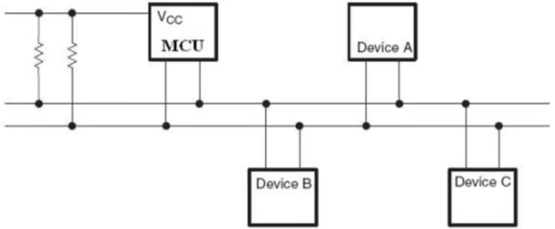
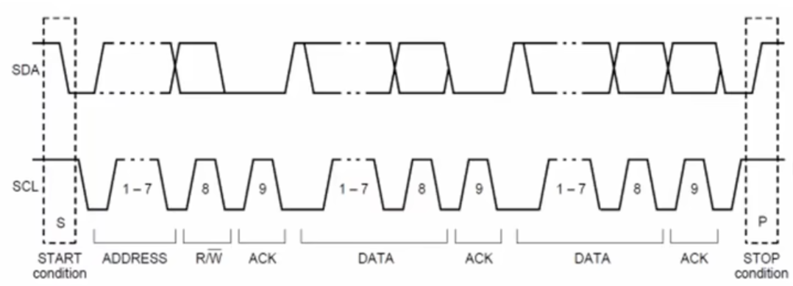
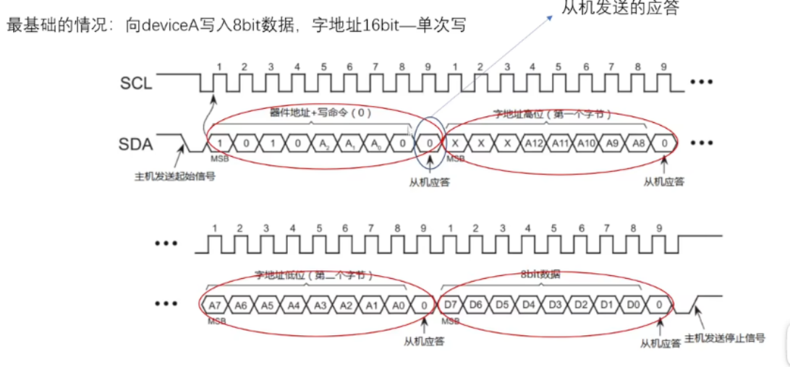
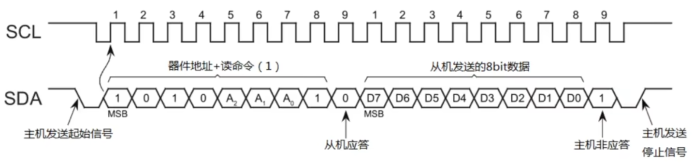
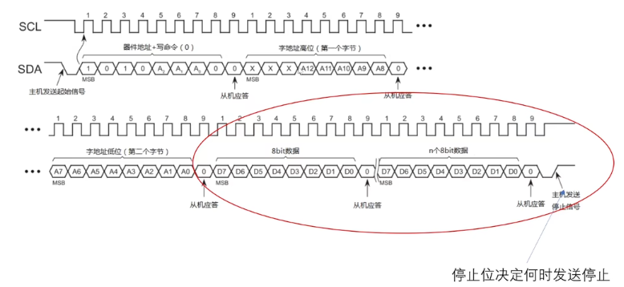
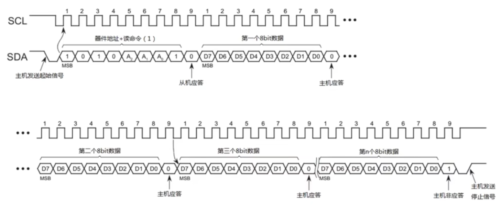
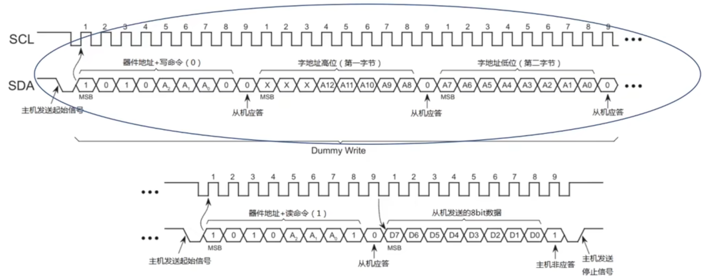

# I2C控制器的FPGA实现

I2C协议是常见的双线全双工同步通信协议，常用于简单的板级互联。各类传感器、专用芯片都会采用I2C作为主控协议，完成与主设备之间的通信。同时由I2C协议衍生出的SCCB协议常见于各种图像芯片（CMOS/CCD摄像头）的管理总线中

参考教程：https://www.bilibili.com/video/BV1cg411s7Yg

参考代码：https://github.com/alexforencich/verilog-i2c

## I2C协议简介

I2C采用双线通信，**SDA**线是数据线，**SCL**线是时钟线，两个线都要设置上拉到电源。设备间采用主从通信，**上拉电阻**就是为了满足多主多从的*线与*需求而设立（如果接入多个设备，需要将MCU的引脚配置成开漏输出）。每个从设备都有固定的I2C地址，称为**设备地址**，主机通过发送地址等待从机响应来完成片选。

总线的拓扑图如下所示

除了I2C设备地址外，每个设备内部也会预留供I2C主机读写的寄存器地址，这个地址一般设置成16位——但是也有部分设备可能会自定义更短或更长的地址位，标准的I2C协议中只支持16位寄存器地址——供I2C读写的寄存器地址被称为**字地址**

### I2C时序

1. 起始和停止

    非传输状态（总线释放release），SCL、SDA都拉高

    **SDA下降沿、SCL高电平**表示开始传输

    **SDA上升沿、SCL高电平**表示结束传输

    

2. 写时序

    I2C协议一帧传输7位器件地址+16位字地址+8位数据，每次传输的端序都是高字节在前（MSB）

    主机发送起始信号后，每个SCL上升沿主机发送数据同时从机会采集一次数据，首先发完7位的器件地址，后面紧跟一位读写指示

    *读写指示位为0表示写命令，1表示读命令*。这里先介绍写时序，也就是指示位为0的情况

    发送完前8位（7位器件地址+1位读写指示）后，主机SDA进入接收状态（input），等待从机**应答**（Response），SCL正常运行，也就是SDA会空闲一位的时间

    随后，主机会依次发送字地址的高8位和低8位，每次传输后都要让SDA等待一个SCL时钟周期的从机应答。最后发送要写入到这个字地址的数据（8位）

    

3. 读时序

    读指令帧不会发送字地址。从机I2C一般使用列表的数据结构来构建寄存器，因此读指令发出后，从机会自行上传上一次写指令中指定寄存器的下一个寄存器

    > 比如上一次写指令向0x01设备的0x0001地址写入数据0x66，那么下一次读指令就会让0x01从机回传0x0002地址的数据

    

4. 突发传输

    I2C协议支持突发（Burst）传输，也就是能够按地址连续读写从机I2C寄存器数据

    写突发帧中，只要主机不发送停止信号，就可以连续按每次8位写入数据到从机寄存器，如下图所示

    

    突发传输中，最开始发送的字地址addr作为起始地址，第n次传输的8bit数据会被写到`addr + n`地址对应的I2C寄存器中

    只有**主机发送停止信号后，写入帧才算停止**

    读突发和写突发类似，可以连续读写多个寄存器中的数据，直到主机发送停止信号，从机才结束回传

    

5. 指定读

    I2C支持虚写（Dummy Write）操作

    如果主机要读取指定字地址的寄存器数据，那么需要先进行一个虚写操作——向从机发送7位器件地址、写指令0、16位字地址addr，不跟要写入的数据。

    完成虚写后不加结束信号地发送一个起始信号，继续发送器件地址、读命令，这样就完成了从机读写指针的置位和读命令，从机会自行发送`addr + 1`地址寄存器的数据

    

### I2C时钟

主从机的SDA都是inout口，主机的SCL是output口，从机的SCL是input口，也就是说主从设备之间使用SDA进行双向数据通信，主设备采用SCL向从设备发送时钟信号

原始的I2C协议没有规定最高时钟频率，因此传输速率可以任意选取。一般为了方便应用，常分为5个模式

* 标准（Standard）：最高速率100Kbps，又称为低速I2C，很多传感器芯片最常用的速率
* 快速（Fast）：最高速率400Kbps，又称为高速I2C，一般的功能芯片都会选取这个速率
* 快速增强：最高速率1Mbps
* 高速（High-speed）：最高速率3.4Mbps
* 超快速：最高速率5Mbps，只支持单向传输，不兼容前面的速率模式

## I2C-Lite实现

I2C-Lite是指只有基本数据收发功能的快速I2C硬件实现。需要注意几个删减：

* 不支持快速以上的通信速率，或不保证高速时钟下的数据发送准确性
* 固定的外设时钟
* 不支持突发传输
* 不支持指定读操作
* 不支持长地址（16位以上）

下面重点介绍一个I2C-Lite的实现案例

### 电路框架

1. 基于协议帧结构

    > 这个实现方式是完整I2C协议最常见的，因为能够方便地拓展协议中的细节

    根据协议的帧结构，可以将I2C时序拆分成最基础的8位数据帧，每帧中总包含8位设备地址传输、8位寄存器地址高位传输、8位寄存器地址低位传输、多个8位数据的收发传输，每个8位数据帧的传输都具有相同的流程：发送数据-等待应答位-发送应答收取位（可选）

    底层模块实现8位数据帧的收发，并设置多个指令，上层模块通过向底层模块发送指令来指定当前的数据帧模式

    * I2C_CMD_NOP：空闲操作，底层模块待机
    * I2C_CMD_START：发送起始位
    * I2C_CMD_STOP：发送停止位
    * I2C_CMD_WRITE：执行固定的写8位数据协议帧
    * I2C_CMD_READ：执行固定的读8位数据协议帧
    * I2C_CMD_BURST：执行突发写传输，需要预先指定写入的数据量并流式传输数据到底层模块

    这些指令使用上层模块产生。上层模块包含了SPI协议所规定的移位寄存器和一个用于管理协议帧结构的状态机，状态机在`空闲-发送起始位-写入-读取-等待响应-发送响应收取-发送停止位`这些状态之间切换，根据顶层模块接收到的片上总线控制数据调度底层模块

    顶层模块包含了一个用于实现valid-ready协议（最基础的片上总线握手协议）的状态机，一个用于实现不同收发状态的状态机，用于生成状态信号的辅助电路，以及上层模块、底层模块的例化。由于SDA、SCL是inout端口，顶层模块还会包含三态门RTL描述或原语描述

2. 基于协议逻辑

    很多情况下我们会使用硬件状态机配合I2C控制器执行单一的数据发送或数据接收。因此我们可以只实现I2C-Lite主机协议，这会大大简化协议逻辑

    只需要将上面的I2C时序以一个大状态机的形式描述出来，使用单一状态内循环即可完成8位数据的发送部分，依次实现`空闲-起始位-8位器件地址发送-等待应答-发送字地址高8位-等待应答-发送字地址低8位-等待应答-发送写入数据-等待应答-等待从机返回读数据-等待应答-结束位`这一串状态，就可以达到基本的收发功能

    但是这个实现完全无法处理突发传输或指定读操作，数据帧固定无法扩展，片上电路时序也会较难收敛

### 代码实现

