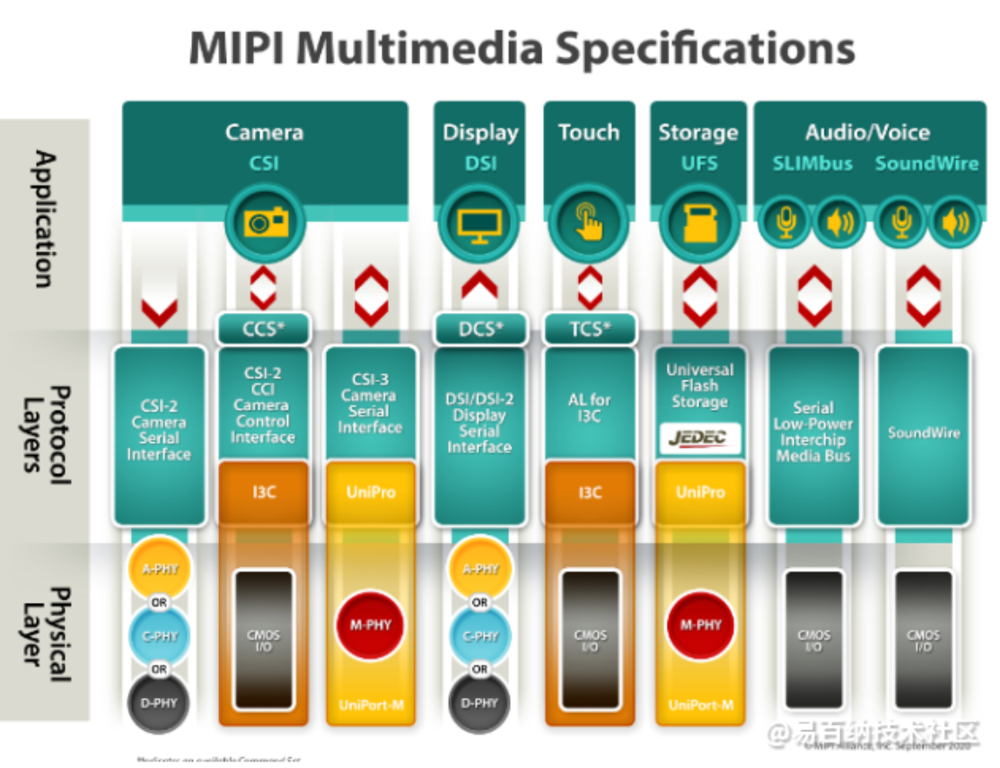
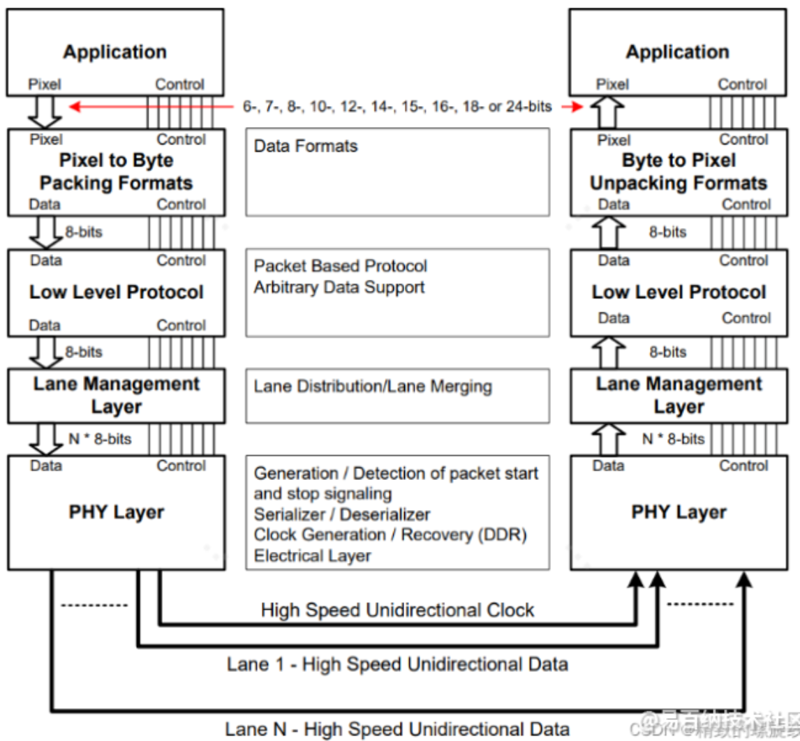
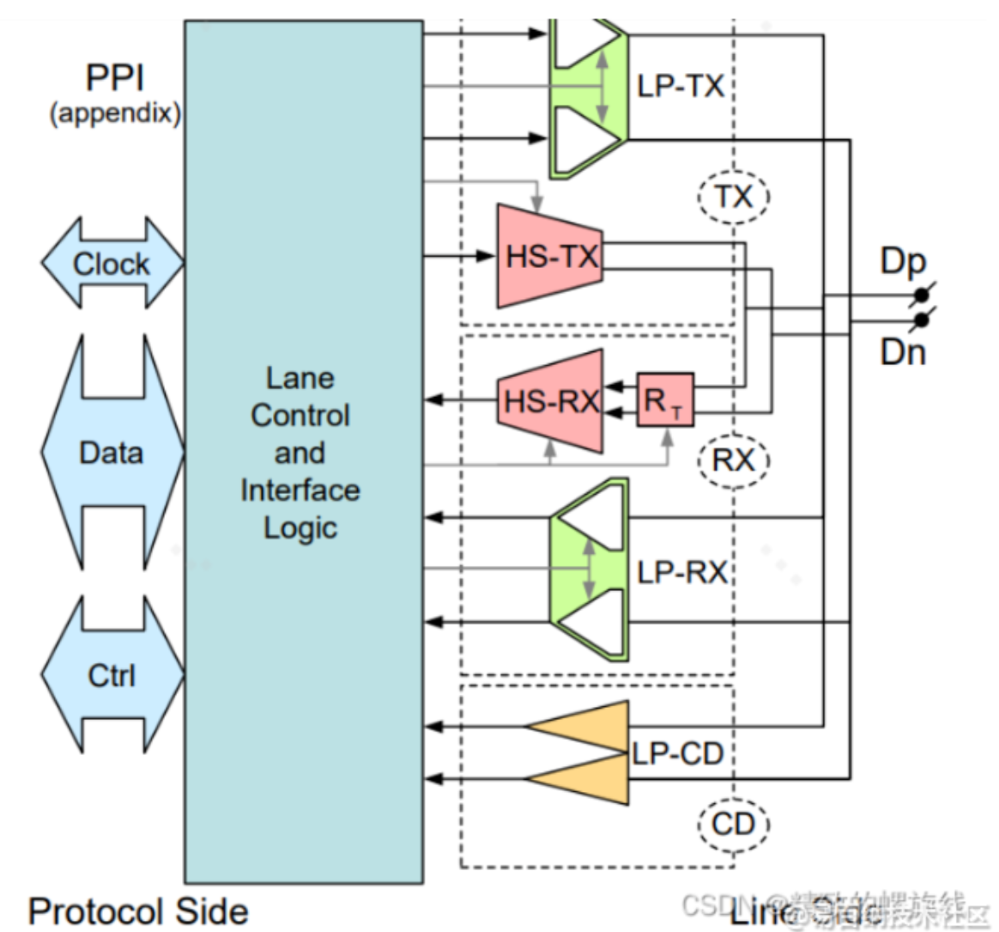

# SoC学习笔记【MIPI-CSI C/DPHY解析】

移动产业处理器接口（Mobile Industry Processor Interface，MIPI）联盟在2003年由ARM、诺基亚、ST、TI等公司成立，MIPI联盟成员包括移动通信设备制造商、半导体厂商、软件厂商、系统供应商、外围设备制造商、知识产权提供商等公司。其目的是把手机内部的接口如摄像头、显示屏接口、射频/基带接口等标准化，从而减少手机设计的复杂程度和增加设计灵活性。MIPI官网`https://www.mipi.org/`

MIPI并不是一个单一的接口或协议，而是包含了一套协议或标准，以满足手机内不同子系统的独特需求。其主要包含四个方面的协议：

* Multimedia
* Control&Data
* Chip-to-Chip Inter Process Communications
* Debug & Trace

如上图，比较常见的接口包括用于摄像头的**CSI**、用于屏幕显示的**DSI**、用于传感器的**I3C**、用于麦克风扬声器等声学外设的**SLIMbus**等。这些统一的接口使得手机厂商能够根据需要，从市面上灵活选择不同的芯片和模组定制完整的方案。其中应用于多媒体（Multimedia）的CSI和DSI协议是最常被提及的MIPI协议。**MIPI-CSI**协议即Camera Serial Interface，定义了摄像头模组与主SoC之间的高速串行接口；**MIPI-DSI**协议即Display Serial Interface，定义了显示模组与主SoC之间的高速串行接口。两个协议使用相同的物理层标准，目前有四种：D-PHY、C-PHY、A-PHY、M-PHY。

D-PHY作为一种源同步接口，以其成熟性和在高速与低功耗模式间的灵活切换而广泛应用。C-PHY则通过嵌入式时钟和三相编码实现了更高的引脚效率和更低的电磁干扰。

本文将针对MIPI-CSI协议进行讲解。其中重点介绍C-PHY和D-PHY两款在市面上比较常见的接口。

## MIPI-CSI协议概述

MIPI-CSI协议是现代成像系统的基石。CSI的演进历程体现了对不断增长的图像数据带宽和功能需求的积极响应。最初的CSI-1标准奠定了相机与处理器互联的基础，采用差分信号传输，数据速率可达1Gbps 。然而随着移动设备对更高分辨率和更复杂视觉处理的需求，CSI-1逐渐被淘汰，由其继任者CSI-2和CSI-3所取代。MIPI CSI-2于2005年发布，迅速成为智能手机和平板电脑中相机与处理器连接的主流方案。CSI-2在CSI-1的基础上进行了显著的功能增强，最初提供高达3.5Gbps的数据速率 。CSI-2协议实际上还在不断更新。

> 下面列举了MIPI-CSI2协议的更新版本和特性
>
> **v2.0 (2017年)**：引入了RAW-16和RAW-20色深支持，将虚拟通道从4个增加到32个，并带来了低延迟减少和传输效率（LRTE）、差分脉冲编码调制（DPCM）压缩以及用于降低功率谱密度（PSD）的扰码技术 。这些增强功能不仅提升了图像质量和传输效率，也为多相机系统和高级图像处理提供了基础
>
> **v3.0 (2019年)**：引入了统一串行链路（USL）、智能感兴趣区域（SROI）和传输结束短包（EoTp），并支持RAW-24色深 。USL旨在减少物联网、汽车和客户端产品中的布线数量，而SROI则有助于机器视觉系统更高效地分析图像
>
> **v4.1 (2024年)**：作为最新版本，CSI-2 v4.1进一步增强了对人工智能（AI）应用和超低能耗的支持，并与MIPI C-PHY v3.0的18线态模式对齐，扩展了Always-On Sentinel Conduit (AOSC) 功能 。AOSC使得图像传感器能够在超低功耗模式下持续监控环境，仅在检测到重要事件时才激活高功耗的主CPU，这对于AI驱动的监控系统和智能物联网设备至关重要

除了CSI-2，MIPI家族还包括CSI-3和CCS。MIPI CSI-3于2012年发布，是一种高速、双向协议，主要用于多层、点对点、基于UniPro的M-PHY设备网络中的图像和视频传输 。**相机命令集**（Camera Control Interface，CCS）则定义了一套标准功能，用于通过CSI-2控制图像传感器，从而简化了图像传感器的集成。该接口是一个双向通信的控制接口，本质是I2C接口的子集，用来提供MIPI接口对sensor进行控制的传输通道。

由于CSI-2最为常见，本文将重点介绍CSI-2的规范和实现。CSI-2架构分为5层，如下图所示

* **物理层**

    协议栈的最底层，定义了数据如何进行物理传输，包括电气特性和时序，负责二进制比特流传输。CSI-2主要使用D-PHY或C-PHY作为其物理层

* **通道管理层**

    负责从多个C/DPHY通道收集传入的字节，并将其合并成完整的协议包。此层还负责将所有C/DPHY数据通道同步到一个时钟域，并在使用多数据通道时执行去偏斜（de-skew）操作，以确保数据对齐

* **底层协议层**

    该层处理字节数据以提取真实的图像信息 。本层将完成解析数据包头、数据包尾、HS-trail和所有短包、生成重要标记（如帧起始（SOF）、隔行/偶数字段或行、数据类型和虚拟通道标识符）等功能。

    > 此层还执行数据包头的ECC检查和数据载荷的CRC检查以确保数据完整性。空包/空白包会在本层中被丢弃

* **像素到字节转换层**

    负责将像素数据转换为字节以便传输（在接收端执行相反的转换）

* **应用层**

    协议栈的最顶层，与主处理器交互以利用接收到的图像数据

特别地，根据MIPI联盟的规范，CSI-2也可以按照三层划分，分别为：**应用层、协议层、物理层**，协议层又由**通道管理层、底层协议层、像素到字节转换层**组成。

以一个典型的相机Sensor到主控SoC的应用场景为例，MIPI-CSI协议的整体工作过程概述如下。

图像数据从传感器记录并转换为数字信号后，通过MIPI接口发送到处理器。传输过程中，所有数据（一般是8bit RGGB RAW格式）被封装成数据包。每个数据包都包含数据格式、用于保护包头的ECC以及用于检验Payload（即数据本体）完整性的CRC。单个数据包通过CSI控制器经由D-PHY传输，然后被分割成所需数量的数据通道，以高速模式（HS模式）传输到接收器。CSI-2接收器利用其D-PHY物理层提取并解码数据包，最终将其传递给CSI-2主控制器。

## MIPI-CSI物理层

物理层规范了传输介质、电气特性、IO电路、和同步机制。通俗地说，就是指定在MIPI协议的最底层物理层，发送端如何拿到上层编码好的数据、转化成怎样的电信号、并通过多少根/组通道以何种形式发送给接收端等等。CSI和DSI的物理层由专门的工作组负责制定，目前公布的协议中有三类基于摄像头的物理层接口，一个遵循MIPI-CSI协议设备的物理层可以由**D-PHY**、**C-PHY**、**M-PHY**之一实现，但目前应用广泛的还是C-PHY（2009年发布的CSI-2 v1.3中引入，并在2014年9月发布为C-PHYv1.0版本，兼容D-PHYv1.2版本）和D-PHY。其中D-PHY是最基础的实现。

> M-PHY在车载领域应用较多，也是一种基于高速SerDes的接口，但采用异步传输，相较D-PHY有更少的引脚和更高的信号传输速度，在移动端还不广泛，此处暂时不做讨论

D-PHY和C-PHY都是串行接口，它们解决了并行的接口的很多问题，比如降低了接口功耗，改善了并行难以扩展的问题。在D-PHY中，有1组**Clock Lane**和1~4组**Data Lane**，皆为单向传输，协议支持1/2/4 lane的传输方式。每组lane在物理上是两根差分信号线，一个lane就像是一个车道，可以独立地传输数据；但MIPI协议通过规定两种传输模式，让多个lane可以按照异步和同步的方式进行数据传输。D-PHY的最初版本的设计目标是500Mbits/s，D是罗马数字中的500，D-PHY由此命名。

### MIPI D-PHY实现

D-PHY和C-PHY均支持LP（低功耗 Low Power）和HS（高速 High Speed）两种传输模式，两种模式的传输电平和传输机制均不同。

* **HS模式**：传输有效数据时，总线进入HS模式，该模式采用100mV~300mV峰峰值的差分信号传输，电平较低，传输速率高（可达4.5Gbps每通道）

    HS模式下，使用源同步的传输方式，由主机向从机提供DDR时钟

* **LP模式**：不需要传输数据，总线时进入LP模式，该模式下，差分传输通道会被拆分为两根独立的信号线，采用0V~1.2V单端信号传输，电平高，传输速率低（约为10Mbps每通道）但功耗也很低。

无论是HS模式还是LP模式，都采用LSB fisrt、MSB last的传输方式。下图给出了单Lane收发器模块（Universal Lane）的硬件结构框图。

Universal Lane由一对高速收发器（HS-TX、HS-RX）、一对低功耗收发器（LP-TX、LP-RX）、一个低功耗竞争检测器（LP-CD）和Lane的控制逻辑组成。所有收发模块均共用同一对差分线。整个Lane通过PPI接口（PHY Protocol Interface）与SoC内部的其他硬件连接。MIPI协议中的Universal Lane支持双向通信，只需要单向通信的Lane都是在这个基础上做一定简化

> 主机一般固定为Transmitter，不需要RX模块；从机一般固定为Receiver，不需要TX模块

需要注意：**无论是双向通信还是单向通信系统，Clock Lane的时钟信号也只需要从主机发送到从机，不需要反向传输，当数据由从机发送给主机时，DDR时钟依旧由主机提供**

Data Lane具有三种操作模式：

* **突发模式**（Burst Mode）

    运行在总线HS模式下，用于传输图像。当前模式下使用差分传输，定义差分对内dp电平比dn电平高的情况为逻辑1；dp电平比dn电平低的情况为逻辑0。典型情况下，差分对上电压为200mV

* **控制模式**（Control Mode）

    运行在总线LP模式下，高电平典型幅值为1.2V。此时dp和dn上的信号为单端而不是差分。定义状态如下

    | 状态 | dp电平 | dn电平 |
    | ---- | ------ | ------ |
    | LP00 | 0V     | 0V     |
    | LP01 | 0V     | 1.2V   |
    | LP10 | 1.2V   | 0V     |
    | LP11 | 1.2V   | 1.2V   |

    MIPI协议规定，将控制模式的4个不同状态组成不同时序，用来代表着将要进入或者退出某种模式。例如LP11-LP01-LP00序列代表总线将进入突发模式

* 逃避模式（Escape Mode）

    运行在总线LP模式下，这是Data Lane在LP状态下的一种特殊操作。Data Lane通过控制模式下LP11-LP10-LP00-LP01-LP00的序列来进入逃避模式；通过LP10-LP11序列来退出逃避模式

    该模式下可以可以进入一些额外的功能，比如低功耗数据传输模式（LPDT）、超低功耗模式（ULPS）或Trigger。

正常操作时，Data Lane处于突发模式或者控制模式。突发模式和逃避模式之间不可以直接来回切换，必须通过控制模式作为中转，即Burst Mode <-> Control Mode <-> Escape Mode

D-PHY在突发模式操作期间，总线会在LP和HS之间持续切换。**为了进入HS模式，总线必须传输特定的序列LP11-LP01-LP00。而通过传输LP11信号，总线可以返回LP模式。**在每个HS突发之前，发送端会发送一个同步序列 `00011101` ，接收端则通过识别 `011101` 的引导序列进行同步

> 即发送端数据的前两位 `0` 会被忽略

### 时钟同步

在HS模式下，D-PHY使用一条专用时钟通道（**Clock Lane**）来同步数据传输。Clock Lane必须由主机提供，使用差分双倍数据速率（DDR）方式传输。单向时钟通道信号与正向数据通道上的翻转比特序列呈正交相位，因此**时钟的边沿出现在突发传输的第一个比特的中心**，这为两端设备预留了建立时间和保持时间，从而确保D-PHY的信号完整性。

在LP模式下，D-PHY采用**自时钟**机制。通过对数据通道的dp和dn线进行异或（X-OR）运算，可以重建时钟信号。采用自时钟能够更好地降低总线功耗。

D-PHYv2.5及更高版本支持扩频时钟（SSC）技术。SSC技术是通过在小范围内改变时钟频率从而将时钟信号的能量分散到更宽的频谱上。这可以降低峰值EMI

### 通过电阻网络实现MIPI物理层转换

### MIPI C-PHY实现

MIPI C-PHY是在D-PHY基础上的改进，以达到更快的传输速率。其特点如下：

- D-PHY是两线一组的传输，C-PHY是三线一组的传输，每一组线称为一路trio，最多三trio，可以支持1/2/3组trio同时传输。
- C-PHY是一种嵌入式时钟链路，因此不再需要额外的时钟线。
- C-PHY也不再使用差分信号传输，而是采用三相符号编码来传输数据，高速模式下有3/4电平、1/2电平、1/4电平三种电平状态。

与D-PHY的差分对不同，C-PHY在三条信号线上运行，这些信号线被称为“三线组”（trio） 。这种独特的物理信号方案是其关键区别。C-PHY的一个决定性特征是时钟直接嵌入到数据流中，无需单独的时钟通道 。这减少了通信所需的布线数量 。

C-PHY采用多电平信号传输，但其接收器无需检测幅度差异；相反，它主要检测输入信号的极性 。多幅度信号用于增加可能的转换次数，并确保每个符号至少有一个转换 。C-PHY实现了“三相编码”方案 。这种编码每符号打包约2.28比特（16/7） ，比D-PHY无编码效率更高 

C-PHY编码器保证了信号完整性和时钟恢复的几个关键特性

- 每个符号至少有一个边沿/转换 。  
- 所有三个接收器（A-B、B-C、C-A）的差分输入非零
- 所有三个信号的共模恒定
- 这些通过将TX信号组合限制为高、中、低电平，并保持三条信号线上不同的电压电平来实现 

C-PHY必须在连续符号之间在不同的线态之间转换，从而在六种线态之间产生五种不同的独特转换，使其有效地成为一个五进制系统 。发送器将16位字通过映射器（Mapper）转换为七个符号，然后进行编码和串行化。在接收器端，三个差分接收器将信号输入到串行到并行转换器和时钟恢复电路，然后通过解码器（Decoder）和解映射器（De-Mapper）重建16位字 。C-PHY设计为与MIPI D-PHY在相同的IC引脚上共存，从而实现双模设备

C-PHY基于三线组的信号传输、嵌入式时钟和复杂的多电平编码，与D-PHY更简单的差分对和前向时钟方案相比，是一个显著的进步。这种创新源于对更高每引脚带宽、更少布线和更低功耗的需求，尤其是在移动和嵌入式设备日益紧凑且需要更高分辨率的背景下。编码方案是C-PHY在较低符号速率下实现更高数据速率的关键。C-PHY体现了物理层效率的持续驱动，突破了信号传输的界限，以更少的物理连接提取更多数据。这直接解决了高性能成像系统中的小型化和成本降低挑战

C-PHY中的嵌入式时钟消除了专用时钟通道相关的时钟杂散辐射，这对于多频段无线设备而言是一个显著优势，因为EMI是主要问题。然而，这需要在接收器端使用更复杂的时钟数据恢复（CDR）电路，并可能引入编码抖动。权衡是显而易见的：C-PHY通过嵌入时钟获得了EMI和引脚数量上的优势，但这种优势将复杂性转移到了收发器设计，需要先进的CDR技术和对抖动的精细管理以保持信号完整性。这凸显了高速接口设计中复杂的工程权衡

C-PHY在相同聚合数据速率下，比D-PHY使用更少的布线（最多减少40%）。例如，两个C-PHY通道（6条线）可以达到4Gbps，而D-PHY需要四个通道（10条线）才能达到相同的吞吐量 。这导致了更低的引脚数量 。C-PHY在相同数据速率下，每通道的翻转率比D-PHY低（低12.5%），这可以简化制造并降低成本，特别是对于低成本产品

C-PHY通常比D-PHY功耗更低（低20-50%），这归因于其较低的频率、较小的偏置和较少的通道 。例如，C-PHY模式的功耗可能比D-PHY模式低10-30% 。尽管其信号速率可能低于D-PHY，但C-PHY在每物理导体上提供了更高的吞吐量 。它在2.28比特/符号的情况下，峰值带宽可达3.5 Gb/s，或通过9线接口达到17.1 Gbps 

由于其嵌入式时钟，每个C-PHY通道都是独立的，允许将应用处理器上的任何通道灵活地分配给任何链路 。C-PHY的嵌入式控制码高效支持快速总线周转（BTA）操作、用于时间敏感链路的低延迟（LRTE）以及Alternate Low Power (ALP)模式，通过消除单端LP模式实现更长距离传输 。C-PHY适用于高分辨率显示器，并支持从低成本、低分辨率图像传感器到60兆像素传感器和4K视频显示面板的广泛应用 。它还用于可穿戴设备、物联网相机系统和汽车显示器/相机

C-PHY在更少布线、更低功耗、更小面积和更低翻转率方面的优势直接解决了现代便携式和嵌入式设备的关键设计限制。更少的布线意味着更简单的PCB和连接器，更小的面积意味着更紧凑的设计，而更低的功耗则延长了电池寿命。更低的翻转率简化了制造，也指向了成本驱动的优化。C-PHY是为高度集成、紧凑且成本敏感的视觉系统未来而设计的。其效率提升不仅仅是渐进式的改进，而是根本性的转变，它能够实现新的产品类别和功能，尤其是在消费电子和物联网领域。

在C-PHY中，时钟信息直接嵌入到数据流中，无需单独的时钟通道 。接收器利用时钟数据恢复（CDR）电路从传入数据中提取时钟 。C-PHY编码器旨在通过保证每个符号至少有一个边沿或转换来确保可靠的时钟恢复 。这种持续的转换提供了CDR有效同步所需的时序信息。C-PHY的设计包含了“快速时钟恢复”机制

C-PHY支持高速模式下的异步传输，符号速率为80-2500 MS/s，低功耗模式下的比特率为10 Mb/s 。这里的“异步传输”指的是数据传输不与固定的外部时钟同步，而是依赖于嵌入式时钟恢复。C-PHY IP核通常具有可配置用于发送器的片上时钟生成功能

C-PHY的嵌入式时钟将时钟同步的复杂性从专用物理通道（以及相关的PCB布线挑战，如偏斜）转移到收发器时钟数据恢复（CDR）电路内的数字域。虽然CDR本身更复杂，但整个系统受益于更低的引脚数量和改进的EMI性能。这种设计选择反映了一个战略性权衡：在PHY IP层面增加复杂性，以在系统集成和PCB设计层面获得更大的简化和成本节约。这对于大批量、成本敏感的应用尤其有吸引力，在这些应用中，最小化板层和引脚数量至关重要

C-PHY用于嵌入时钟的多电平信号传输和编码可能固有地引入编码抖动。这意味着，虽然时钟是嵌入式的，但保持信号完整性更多地取决于CDR的鲁棒性和编码/解码过程的精度，而不仅仅是物理走线匹配。设计人员在实施C-PHY时必须密切关注抖动分析和缓解策略，无论是在IP设计中还是在整个系统中。这需要先进的验证技术来确保在各种数据速率和通道条件下的可靠运行

## 通道管理层

## 底层协议层

LLP层通常会处理两种格式的包(Packet)：长包(Long Packet)和短包(Short  Packet)。无论哪一种包，LLP层都会根据CSI-2协议的规定，给它们添加包头(Packet Header, PH)和包尾(Packet  Footer, PF)，并作为有效数据在HS模式下传输。

同时，LLP层会在每次退出LP后添加一个SoT(Start of Transmission)序列作为开始进入HS模式的标志，并在进入LP模式前添加一个EoT(End of Transmission)序列作为退出HS模式的标志。如下图所示。

## 像素到字节转换层

支持多种像素格式的图像传输。发送端会将从应用层传下来的像素数据打包成字节流传递给底层协议层，接收端将从底层协议层传递的字节进行解包并发送给应用层。

以RAW10格式的图像数据为例，一个像素占10bit，pack的过程为：每个像素抽出2bit，剩下的8bit的作为一个字节传输；每4个像素抽出的2bit组合成一个字节传输。因此4个像素使用5个字节传输，这就是像素流转换成字节流的过程。

## 应用层

