# SoC学习笔记【PCIe】

**PCI**即Peripheral Component Interconnect的缩写，即外设组件互联，而**PCIe**即Peripheral Component Interconnect Express的缩写，在前者基础上强调“特快”。PCI在早期作为一种并行总线，由IBM最早用在IBM PC AT(80286)上，而随着PCI的速度难以满足个人电脑PC发展的需求，厂商提出了PCIe串行总线标准，保留部分PCI特征同时将其进行了较大改动，大大提高总线传输速率。也正是因此，**PCI和PCIe**不兼容。

## PCIe历史

从1992年第一版PCI协议标准至今，PCIE已走过30余年历史，在这一过程中，标准在几个节点发生了巨大变化

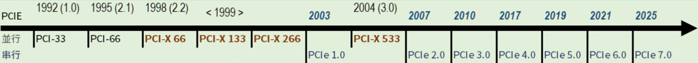

### 早期PCI

在IBM公司生产的第一台个人电脑IBM PC XT(8088)中，使用到了一套名为ISA的总线标准。然而，随着技术从16位向32位发展，ISA总线已无法满足性能需求，这催生了一场关于其“后继者”的竞争。当时出现了多个替代方案，包括IBM推出但因与ISA不兼容而最早出局的MCA接口，以及另外两种兼容方案VESA和EISA，但它们也分别在1996年和2000年左右退出了市场。

> ISA总线诞生于1980年左右，在设计上是一种并行的总线架构，它将CPU的数据、地址、中断请求等信号直接延伸出来，让打印机、显卡、网卡等外部I/O设备卡能够与CPU进行通信和控制。ISA的结构示意如下图
>
> 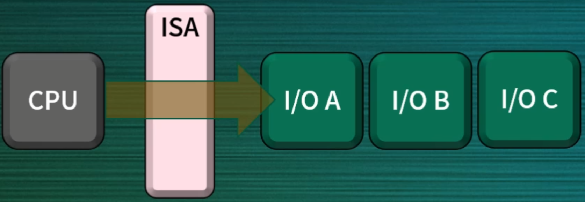

最终1992年，PCI技术成为了ISA最成功的继任者。在1992年到2000年的过渡时期，主板上常常能看到PCI与EISA、VESA等多种插槽并存的景象。2000年以后，PCI基本统一了市场，并接着开启了向更先进的PCIe时代过渡的进程，形成了PCI与PCIe插槽并存的局面。PCI（Peripheral Component Interconnect）技术最早由英特尔在1990年提出，旨在取代当时个人电脑中老旧的ISA总线。1992年，由一个名为PCI-SIG（外设组件互连特别兴趣小组）的组织发布了第一个版本。

> PCI-SIG的创始成员是Intel

PCI的架构设计相较于其前身ISA总线有了根本性的进步。与ISA直接将CPU信号延伸至扩展卡的方式不同，PCI/PCIe采用了一种间接连接的架构：CPU首先连接到一个称为芯片组（chipset）的中间单元，芯片组内部的IO Hub或Host Bridge再连接到PCI/PCIe总线。

> 这里的芯片组在Intel设计中被称为“南桥”（South Bridge），而AMD则依旧称其为“chipset”。这可以在二者CPU的芯片组驱动程序中看出

这种设计意味着CPU不直接访问I/O设备，这也是其名称外设组件互联的由来。 一个典型的PCI结构示意如下图，CPU需要通过Chipset和PCI Host Bridge来访问外部设备，而后续的PCIe也保留了这一特点

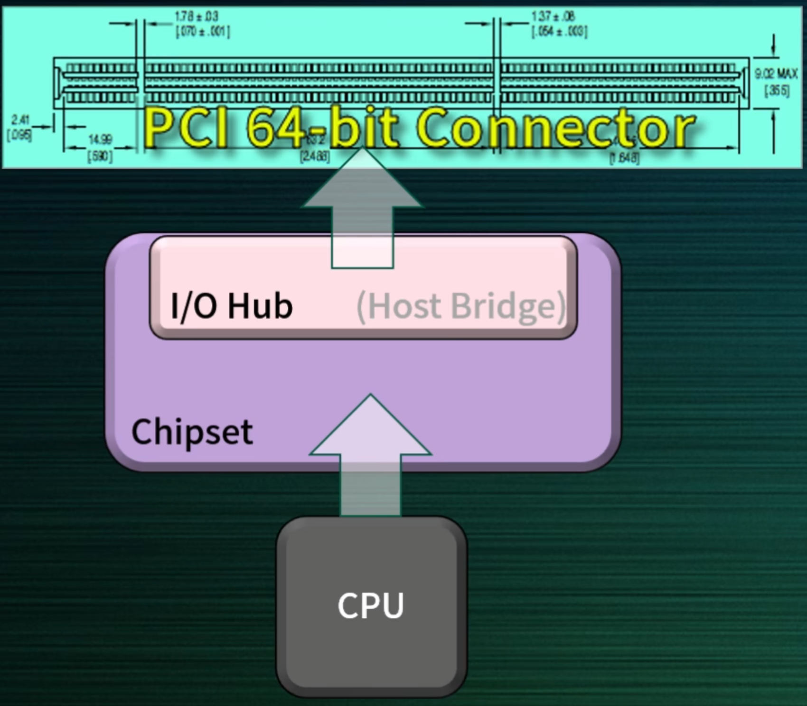

PCI的最后一个版本是2004年发布的PCI3.0。尽管速度不断提升，但其并行接口的固有缺陷限制了进一步发展，因此被PCIe所取代

### PCI-X

由于PCI存在一些先天缺点，例如一次只能读写一个设备且效率不高，几家公司另起炉灶，在1998年推出了名为PCI-X的技术，它改进了原有PCI的不足，例如引入了分割事务处理（Split Composition）和更智能的中断处理技术（MSI）。

> PCI-X的初始成员包括IBM、HP、Compaq

PCI-X的主要设计目标之一是保持与PCI设备的硬件和软件兼容性，以简化从PCI向PCI-X的迁移过程，但最终在1999，该阵营也加入了PCI-SIG，双方技术得以融合，促成了现代PCIe技术的出现。相关的分割事务处理、中断处理等技术也被传递给了PCIe规范。

> 由于PCI-X在硬件上保持了对PCI的向后兼容性，它依然是并行总线，因此继承了并行总线模型所面临的问题

### PCI-e

大约在2003年，Intel在PCI-SIG内部发起了一项名为`3G I/O`（第三代输入/输出技术）的计划，这便是PCIe的前身。该技术从并行总线转向了串行总线，通过串行点对点的传输方式解决了并行总线共享带宽的瓶颈，允许每个设备独享通道带宽，从而大幅提升了性能

PCIe的全称是**Peripheral Component Interconnect Express**，在从并行改为串行时，在PCI原名后加上了Express后缀。物理上，PCIe是一种串行接口，每个设备独享通道。一个通道包含一对独立的发送（TX）和接收（RX）信号线，均使用差分形式，因此能够实现**全双工通信**。插槽根据其包含的通道（Lane）数量分为x1、x4、x8、x16和x32五种类型，通道数越多，带宽越高。

随着技术发展，PCIe凭借其极高的带宽优势，不仅取代了因PCI带宽不足而催生出的专用显卡接口AGP（当时显卡需要带宽过大，会导致其他PCI设备带宽资源被占用，因此出现了专为显卡提供的高带宽接口，网卡等设备则接入PCI接口），甚至开始威胁到SATA等接口的地位（NVME接口本质上就是改变了插槽形态的PCIe接口）。一个典型的PCIe结构示意如下图

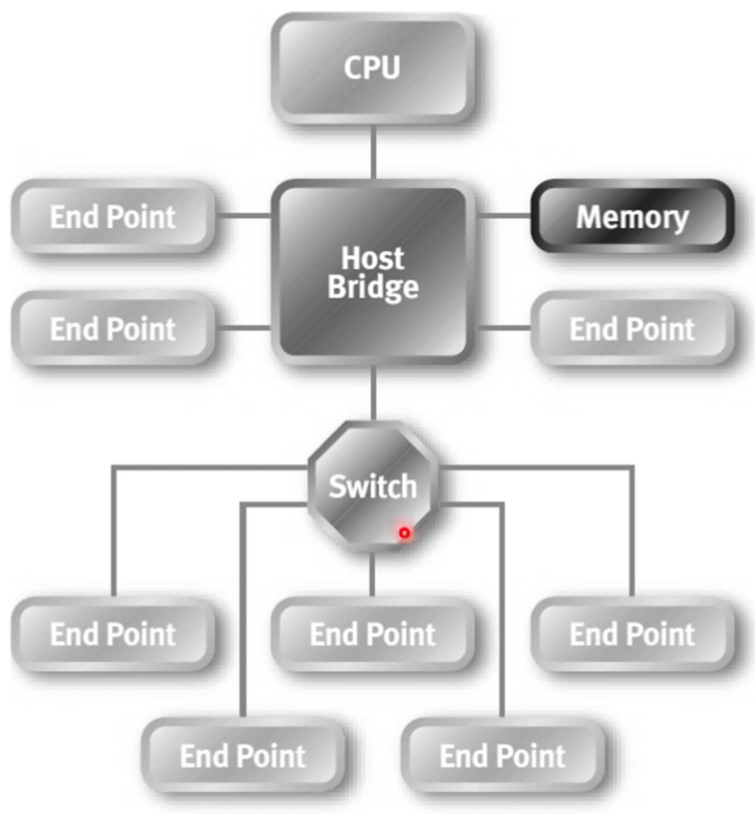

特别地，PCIe兼容PCI的核心点在于PCIe能够通过Host Bridge来实现PCIe-PCI的扩展连接，如下图

> PCIe能够通过总线桥Bridge来实现PCIe到PCIe、SATA、USB、PCI等多种接口的转换

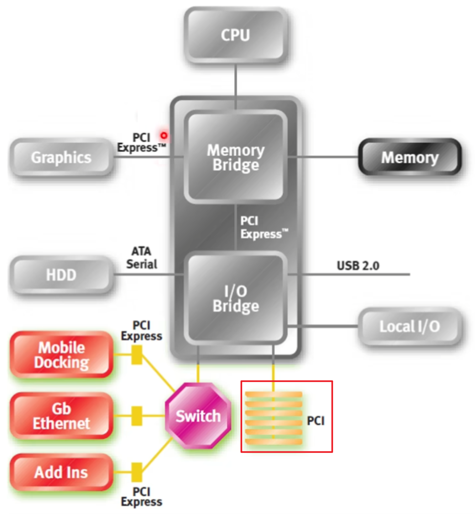

PCIe成功的另一个关键在于其完善的即插即用（Plug and Play）设计：现代PCIe设备插入后即可被系统自动识别并运行。

> 一般来说，Plug and Play指的是必须先给接口断电，把设备插上后再上电才可以；这和USB OTG的所谓Hot Plugin（热插拔）是不一样的

这一机制的核心在于，设备要向操作系统提供一套标准化的自身信息。要让一个设备工作，系统不仅需要知道它的厂商和型号ID，还必须获知其所连接的总线类型、总线地址、中断配置等关键的硬件连线信息。PCIe设备通过其**配置空间**向系统提供所有这些必需信息，使得操作系统能够自动加载并正确配置对应的驱动程序，从而实现无缝的用户体验。

> 现代M.2固态硬盘可直接通过PCIe通道与系统连接

这种独立的点对点连接方式对主板的高速布线技术提出了巨大挑战，同时串行接口不能像一般的并行接口那样同时连接多个设备，再使用CS片选信号来指定通信的对象。这两个困难促成了PCIe的协议分层，PCIe被分成三个层级：**事务层**（Transaction Layer，也被称为传输层）、**数据链路层**（Data Link Layer）、**物理层**（Physical Layer）。

* 物理层作为最底层，直接与硬件接触，提供了电气信号层面的支持，规定了发送器、接收器的设计规范、信号编解码方式和时钟同步等细节问题。

    PCIe采用差分信号、8b/10b（较新的规范中使用128b/130b）编码、多通道聚合等信号传输处理技术来降低主板的高速布线难度和对板卡的工艺要求。

* 数据链路层位于物理层之上，负责在两个相邻节点之间建立可靠的点对点连接，规定了错误检测与纠正、流量控制、链路管理等机制

    PCIe的数据链路层实现了ACK/NAK协议来确保TLP（Transaction Layer Packet）数据包的正确传输，使得信息无误的到达目标设备，并参与链路状态管理和初始化过程

* 事务层负责处理所有的请求和完成消息，发起/响应读写操作、构建TLP等均在本层实现

    该层定义了TLP数据包的格式。PCIe基于TLP实现数据传输，通过在事务层定义包交换机制，能够取代PCI中使用的广播方式，从而有效节省总线带宽、提高协议的传输效率

### 未来PCI-e

PCIe最显著的特点是其带宽能以2倍速率的方式成长：**每一代新版本的速度都是上一代的两倍**。这是并行总线难以做到的。从1992年的PCI直到2025年的PCIe7.0，总线带宽一直在持续提高，这要归功于PCIe标准的快速更新和通信技术、芯片制程、PCB工艺的迭代。

在此对PCI到PCIe的总线标准进行总结如下表

| 外设总线标准 | 概述                                                         | 时钟频率     | 最大带宽 |
| ------------ | ------------------------------------------------------------ | ------------ | -------- |
| PCI          | Intel于1992推出的并行总线                                    | 33MHz或66MHz | 533MB/s  |
| PCI-X        | 于1998年推出的PCI的扩展版本                                  | 133MHz       | 1.06GB/s |
| PCIe1.0      | 初代PCIe协议                                                 | 2.5GHz       | 4GB/s    |
| PCIe4.0      | 2025年消费级和企业级市场主流的PCIe协议实现                   | 16GHz        | 31.5GB/s |
| PCIe6.0      | 于2022年1月发布，2024年初次上板（根据公开消息）的PCIe协议实现 | 64GHz        | 126GB/s  |

## PCI介绍

前面的内容已经介绍了PCI、PCI-X、PCIe之间的历史渊源，虽然PCIe在硬件上有了很大的进步，但其使用的软件与PCI系统几乎保持不变。因此旧的PCI软件在PCIe系统中可以不做任何更改地运行，而新的软件也会继续使用相同的操作模型。在这里还是要首先从PCI讲起，方便读者了解PCIe设备的全貌。

### PCI概述

众所周知，一套x86指令集系统包含CPU、北桥、南桥。北桥连接DDR（内存总线）、处理器片内外设（如MMU）、显卡（AGP总线）；南桥雨北桥相连并负责将PCI连接到系统的外围设备，同时提供一些如USB、SATA之类的总线接口

> 虽然现代x86-64设备大都将CPU、北桥、南桥合封在SoC内，主板上采用芯片组（Chipset）设计，但各个关键部件的分工还是遵循了原来的设计思路

一个典型的PCI总线下挂载了多种设备，总线处于共享状态，需要特定的**仲裁器**（Arbiter）来决定当前时刻的总线的控制权。仲裁器一般位于北桥，通过一对引脚**REQ#**和**GNT#**与每个挂载到总线上的设备从机连接

* REQ#引脚表示当前设备需要使用总线，设备通过将该引脚拉低（低电平有效）来将请求发送给总线仲裁器
* 仲裁器根据请求情况决定哪个请求者将成为下一个总线的所有者，并通过将GNT#引脚拉低来发送授权信号
* 当总线处于空闲状态时，REQ#信号和GNT#信号均被断言的设备将被指定为下一任总线**控制器**（Initiator）

PCI是**同步并行总线**，因此设备在时钟上升沿时刻对总线数据采样。

同时，为了保障PCI板级布线低成本，采用地址和数据复用机制，占用同一组信号线**AD[0:31]**传输信号。而**C/BE#[0:3]**（命令/字节启用）信号共享了四根引脚，这样能够大大降低板级布线时的数量。为了协调传输，PCI采用了经典的**Valid-Ready握手**信号机制，使用FRAME#、DEVSEL#、TRDY#、IRDY#和STOP#信号线对总线时序进行控制。信号功能如下：

* **CLK**：同步时钟信号，上升沿采样
* **AD[0:31]**：用于传输要读写的地址和数据（在PCI2.0协议中扩展为64位）
* **C/BE#[0:3]**：用于传输控制总线通信的指令
* **FRAME#**：指示总线事务的开始和进行，在一次传输事务开始时拉低，传输结束后拉高。该信号拉低的同时，发起设备需要发送当前事务的传输地址（Address）和命令信息（Bus Command）。同时总线上的所有设备会对该地址进行接收，判断是否与自身匹配
* **DEVSEL#**：设备选择信号，用于目标设备响应事务，由目标设备控制。当目标设备准备就绪，可以开始接收数据时拉低。与TRDY#不同，DEVSEL#将在一次传输事务中保持拉低状态，直到FRAME#拉高，目标设备不再从总线上接收数据
* **TRDY#**：目标设备就绪信号，表示目标设备已经准备好进行数据传输，相当于Valid-Ready中的Ready。
* **IRDY#**：发起设备就绪信号，表示发起设备已经准备好进行数据传输，相当于Valid-Ready中的Valid。如果IRDY#和TRDY#信号同时拉低，数据传输就会在该时钟周期完成，表示一次数据传输结束
* **STOP#**：用于在目标设备希望终止事务时拉低。信号需要在传输开始后拉高
* **REQ#**：仲裁器请求信号。由发起设备控制，信号拉低一个周期表示生效，向总线仲裁器发起占用总线的申请。
* **GNT#**：仲裁器授权信号。由仲裁器控制，信号拉低一个周期表示生效，总线仲裁器授权当前设备成为下一次总线访问的发起者。当传输开始后，该信号被拉高

在PCI总线上，一次典型传输事务的时序如下图所示

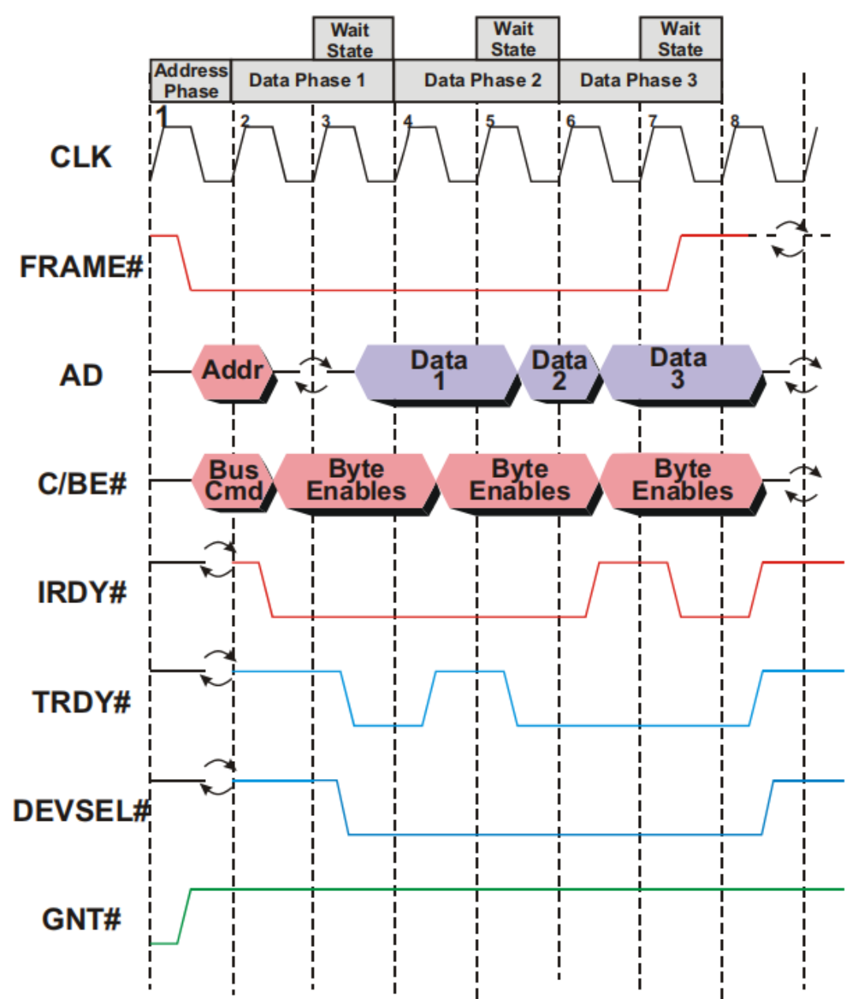

在上图中，PCI总线展示了一次完整的事务传输，传输过程中首先进行了地址和总线指令的传输，随后交替进行了三次数据交换，将Data1、Data2、Data3进行了传输

### PCI断连和重传协议

PCI主设备发起一个访问目标设备的事务，但目标设备没有准备好时，目标设备将发出**事务重传**信息。

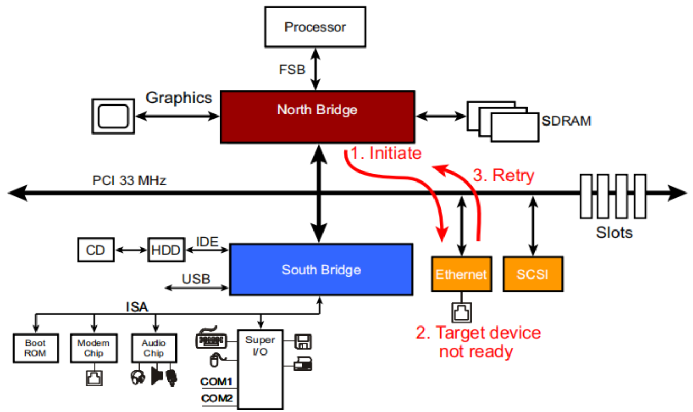

以上图为例，北桥发起了一次网卡读取事务。以太网卡作为目标设备认领了总线周期，但此时它并没有立即准备好返回数据给作为总线控制器的北桥。此时以太网设备可以有两种选项：

1. 在数据阶段插入**等待状态**（wait-states）
2. 拉低STOP#信号进行**重传**（Retry）

如果插入等待状态较少，并不会影响数据传输效率，但如果目标设备需要更多时间，则应采用重传机制以避免总线资源被浪费。

通过拉低STOP#信号，当前总线周期将被结束，此时总线控制器必须至少等待两个时钟周期，并再次进行总线仲裁以重新发起相同的总线传输事务。而在这个过程中，仲裁器可以将总线分配给其他发出请求的总线控制器以高效利用总线带宽，直到被重试的总线控制器重新获得总线使用权。

> 如果目标设备在下一轮仲裁后仍发起重传，那么整个过程会重复，直到总线控制器成功完成数据传输为止

与重传类似，PCI协议也规定了断开情形：当总线控制器访问目标设备时，如果目标设备能够传输至少一个双字的数据，但无法完成整个数据传输，它会在无法继续传输的时刻断开当前事务。

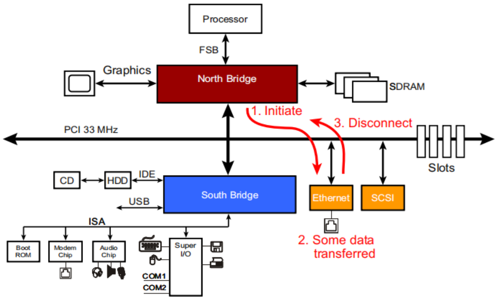


### PCI错误处理


### PCI中断处理


### PCI链路

* **System系统**：System是硬件平台的整体，包括CPU、内存、PCI总线、外部设备及功能。系统管理和协调所有硬件资源，一个系统内可以包含多条PCI总线，每条总线都可以连接多个PCI设备，设备中又可以包含多个功能
* **Bus总线**：Bus是系统中连接多个设备的通信通道，PCI设备通过总线来与其他设备通信。由于一个系统中可以有多个PCI总线，因此每条总线都被分配了唯一的总线号用于识别。系统中可以有最多256条编号从0到255的PCI总线。总线通过仲裁器（Arbiter）管理
* **Device设备**：Device是物理硬件的表示，它连接在PCI总线上，可以是单一功能设备或多功能设备。每个PCI总线最多可以支持32个设备，设备编号为0到31，每个PCI设备通过其唯一的设备号被主机识别。
* **Function功能**：Function是PCI设备中的独立子模块，一个设备（Device）可以包含多个功能，每个功能可以执行不同的任务。每个PCI设备最多可以有8个功能，编号为0到7

举例来说，一个PCI网卡插在一台PC上，这个网卡可能同时具有以太网控制器（Function 0）和无线网卡（Function 1）两种功能。这个情形被描述为：系统内挂载了1条PCI总线，总线号0；在该总线上挂载了一个设备0；该设备具有功能0和功能1两个功能。

在PCI架构中，每个设备和功能通过**总线号**、**设备号**和**功能号**唯一标识，形成三级地址结构：总线号（Bus Number）标识设备所在的总线；设备号（Device Number）标识总线上的设备编号；功能号（Function Number）标识设备中的功能编号

### PCI地址空间

这一节来说明PCI是如何实现可靠传输，从而对外设进行控制的。

众所周知，早期CPU一般采用**IO地址空间映射**（I/O Address Map）的方式去操作一个外设，外设寄存器被独立地作为端口映射到一个区域，CPU通过特别设计的指令（IN/OUT指令）或硬件机制来访问外设寄存器，x86设备都支持该功能。

> 这在早期计算机设计中非常常见，因为设计者不愿意增加设备的成本或复杂度以实现复杂的事务管理逻辑。由于当时CPU的速度比其他任何外设都快得多，因此CPU总是处理所有工作，包括IO

但现代的CPU设备中，处理器能够通过访问内存地址空间来像访问内存一样访问被映射到固定区域的外设寄存器，从而对外设进行读写。这被称为**内存映射**（Memory Map）机制。

> 在其他架构如ARM中，也大都采用内存映射机制而不是IO地址空间机制实现外设读写，因为后者需要增加额外片上面积，同时会导致微架构设计变得更复杂（需要增加专用的指令和硬件）

对应上述的外设控制机制，PCI一共有三种数据传输模型，分别是：

* **PIO**（Programmed I/O）

    本质上就是IO地址空间映射。PCI设备通过中断通知CPU需要将数据写入内存，CPU会首先从PCI设备读取数据到内部寄存器，再将寄存器中的数据复制到内存中，汇编如下（以x86为演示）

    ```assembly
    pci_isr:
        ; 中断保存现场
        pusha
    
        ; 设置DS段寄存器指向目标内存区域
        mov ax, DATA_SEGMENT
        mov ds, ax
    
        ; 设置目的地址
        mov di, DST_ADDR
    
        ; 读取来自PCI设备的数据到寄存器
        ; 从PCI设备读取数据到EAX寄存器 [ty-reference](12)并将数据复制到内存
        mov eax, [PCI_REG_ADDR]
        mov [ds:di], eax
    
        ; 恢复现场
        popa ; 恢复所有通用寄存器
        iret ; 中断返回指令
    ```

    尽管这种方式有效，但存在两个缺陷：

    * 每次数据传输时，CPU都会占用两个总线周期，读写各一次
    * 如果传输数据量大，CPU将被占用，无法执行其他任务

    在早期，这种方式是最快的数据传输方法，因为单任务处理器没有太多其他任务要处理。但在现代PC中，这种效率低下的方式通常不可接受，因此这种方法已经不再常用于数据传输

* **Peer-to-Peer**

    这个模型比较特殊，它基于一个朴素的思想：如果所有设备都挂载到一条总线，那么两个PCI设备之间可以**点对点**（Peer-to-Peer）启动通信。这种传输方式有明显的效率优势，因为系统的其他部分可以继续执行其他任务而不受影响

    > 例如网卡和硬盘之间可以直接建立通信并传输数据，而不需要经过CPU和内存的周转——当然这也需要设备支持

    但是由于两个设备之间往往不会使用相同的数据格式（除非是同一厂商的产品），因此原始数据还是要线传输到内存，经过CPU重排后再传输到目标设备

* **DMA**

    既然PIO效率低下、点对点又存在实际应用的问题，那就引出了一类更高效的传输方案：**直接内存访问**（Direct Memory Access）。在这种模型中，一个DMA控制器负责代替CPU处理内存和外部设备之间的传输，从而让CPU无需管理IO事务。一旦CPU为DMA控制器设置了传输方向（内存到外设表示输出，外设到内存表示输入，也可以从内存到内存搬运）、起始地址和传输字节数，DMA便独立处理总线协议和地址序列。这种方法不需要对PCI外围设备做出任何改变。

    后续随着技术进步，一些设备本地集成了DMA功能，也便不再需要在PCI总线上额外挂载DMA了。像这样能够自主处理总线传输的设备被称为**总线控制器**（Bus Master）

    > 这里的设备既包括CPU也包括外部设备，只要是能够主动管理PCI总线传输的设备都被称为总线控制器

    采用DMA，一次总线周期就足以传输一个数据块，还减少了总线占用开销

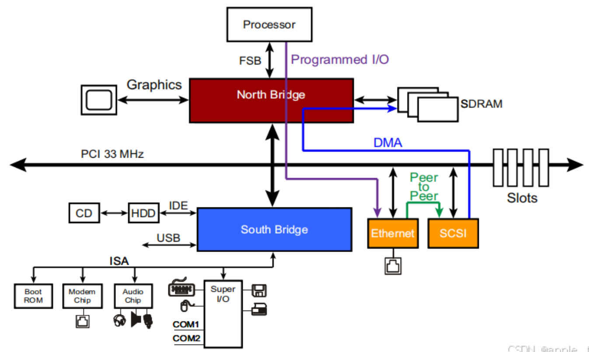

为了完成上述传输模型下的地址空间分配，PCI提供了三种地址空间可选，分别是**内存地址空间（Memory Map）**、**I/O地址空间(I/O Map)**和**配置地址空间（Configure Space）**。内存和IO地址空间顾名思义，CPU可以像访问内存映射区域或者专用指令读写那样来访问PCI总线上挂载的其他设备。特别地，PCI设备支持32位或64位内存寻址，同时支持16位或32位IO寻址，但由于x86 CPU只使用16位的IO地址空间，因此许多设备将I/O地址空间限制在64KB（即16位地址的容量）

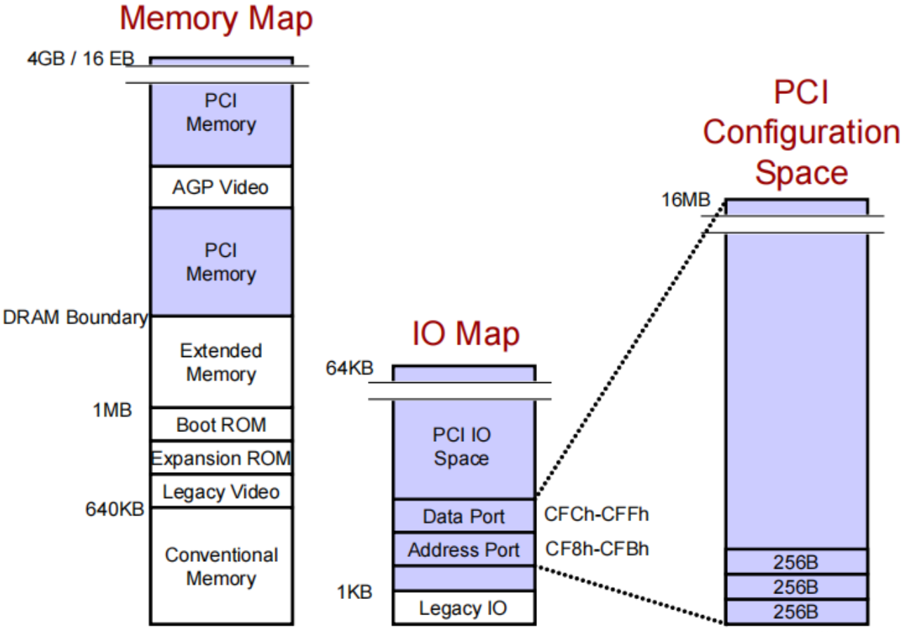

内存地址空间是最通用的，PCI设备将其资源（如设备寄存器、缓冲区等）映射到处理器的内存地址空间中，使CPU可以通过标准的内存读写指令访问PCI设备。在这种情况下，PCI设备的内存区域会映射到处理器的内存空间，CPU可以通过访问这些内存地址与PCI设备交互。而IO地址空间是专门为IO设备保留的空间，通常用于较小的外围设备（比如串口、并口等传统接口）。

此外，PCI还引入了配置空间。这个空间只能通过间接方式访问，如上图所示。配置空间中存储的信息包括设备ID、供应商ID、状态、命令寄存器等。传统PIO模型中，CPU必须通过IO寄存器映射来访问位于地址4'h0CF8到4'h0CFB的**配置地址寄存器**端口和位于地址4'h0CFC到4'h0CFF的**配置数据寄存器**端口。*使用这两个端口，CPU才能对位于PCI目标设备中内部的配置空间寄存器进行读写。*

协议规定每个功能（function）都需要提供自己的寄存器映射到配置空间，这些寄存器为设备提供了标准化的地址和资源控制，从而实现了PCI的即插即用特性。每个PCI功能最多有256B的配置地址空间，因此单个系统的总配置空间量为16MB
$$
256B * 8(function) * 32(device) * 256(bus) = 16MB 
$$
在后续PCIe中，为了兼容PCI协议，引入了将配置空间映射到内存地址空间的新方案，CPU只需要像访存一样读写指定内存区域的数据，即可完成对PCI配置空间的读写。这一点在后面的PCIe配置中详细介绍。

下面对配置空间进行详细介绍：

* **配置地址寄存器** `0x0CF8~0x0CFB`：共4字节，指定要访问的PCI设备的配置空间的地址，如下图所示

    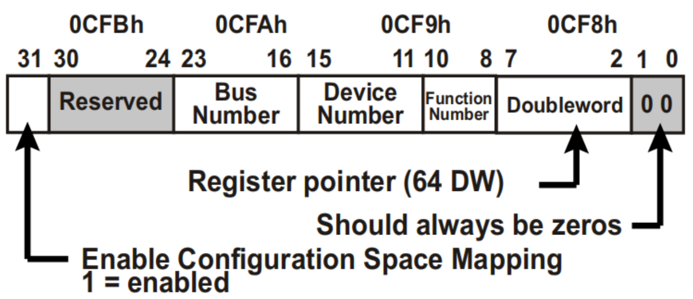

    其中第31位是启用位，必须设置为1；第30至24位保留设置为0；第1和第0位也是保留位，设置为0

    第23至16位代表总线号；第15至11位代表设备号；第10至8位代表功能号

    第7至2位代表寄存器号，指定配置空间中的寄存器，需要4字节对齐，因为一个寄存器占用4字节空间

* **配置数据寄存器** `0x0CFC~0x0CFF`：共4字节（32bit），用于读取或写入配置地址寄存器（0x00CF8）指定的PCI配置空间下的数据

    通过改变地址寄存器中的内容，可以对系统内任意总线（bus）下任意设备（device）中任意功能（function）所包含的256字节配置空间的每个寄存器寻址；通过改变数据寄存器中的内容，可以对当前寻址到的寄存器内容进行修改

由于I/O地址有限，传统模型会使用两个步骤进行寄存器访问：

1. **向配置地址寄存器写入目标地址**

    CPU执行一次I/O写操作，将寄存器访问地址写入位于北桥的配置地址寄存器端口。

    写操作的加载数据需要严格按照配置地址寄存器的格式，分别指定总线号、设备号、功能号，从而在256条总线、32个设备、8个功能中选择到需要的设备。同时，数据中还要包含具体的寄存器地址，这个寄存器地址是64位且4字节对齐的。

2. **向配置数据寄存器写入数据或读出数据**

    CPU执行一次I/O读或I/O写操作，对位于北桥的配置数据寄存器端口进行读写。

    在该过程中，北桥将执行一次PCI配置读取或PCI配置写入事务，发送到地址端口指定的PCI总线。因此位于PCI目标设备内部的数据将被先传输到北桥IO寄存器，再由CPU读取；抑或是先由CPU写入北桥IO寄存器，再经由PCI总线传输到目标设备内部

基本配置机制如上所述，下面来介绍配置寄存器空间内部的组织架构。

在每个PCI功能包含的最多256B配置空间中，前64字节包含一个被称为**Header**的结构体，而剩下的192字节用于支持可选功能。根据Header类型的不同，PCI功能可以分为两大类：

* **Type 0 Header**标识一个非桥接设备（non-bridge）
* **Type 1 Header**标识一个桥接设备（bridge）

桥接设备能够创建系统拓扑中的另一条PCI总线，抑或是与其他总线进行转换。非桥接设备的Header如下图

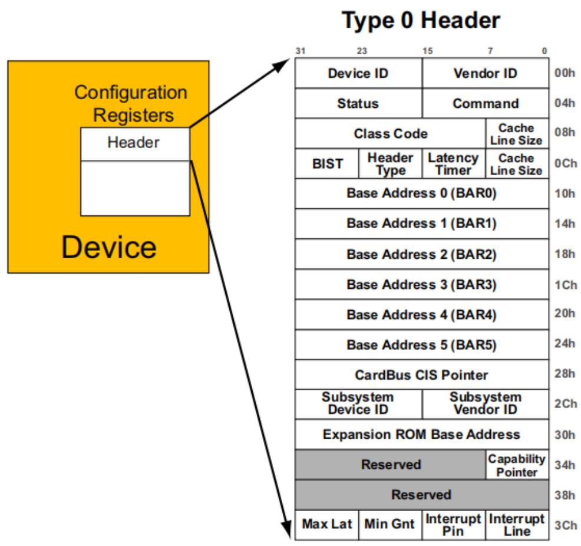

在系统启动过程中，将对所有PCI功能（function）进行遍历，此时就需要根据Header类型来判断遍历到的当前节点是否存在子节点。这一遍历过程帮助软件识别系统中存在的所有PCI功能，并根据其类型进行进一步的资源分配和管理。

### PCI桥接器

PCI架构理论上支持每个总线上最多32个设备，但在实际的电气限制下，这个数量远小于理论值，一般只能挂载10到12个负载。PCI总线使用了一种叫**反射波信号传输**的低功耗机制导致了该问题。设备能够用低功耗的发送器PHY来传输设备，这样的PHY一般只能将信号驱动到大约一半的电压，而当信号的入射波沿着传输线传播，直到到达传输线末端，由于PCI规范中末端不加终端匹配电阻，因此电信号会发生反射，如下图所示

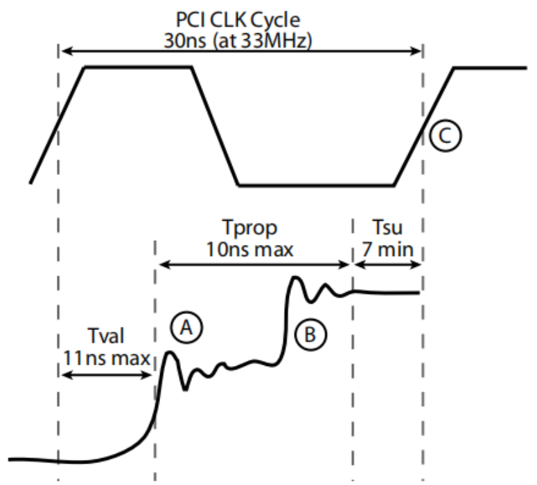

当反射波到达源缓冲器时，驱动器的低阻态能够作为终端匹配阻抗来防止进一步反射。因此电路的实际建立时间包括三部分：**接收端的固有建立时间**、**传输线延迟**、**反射延迟**。当且仅当电路实际建立时间小于时钟周期时，总线才能正常工作。

显而易见，随着总线上的电气负载增加或传输线长度加长，信号的实际建立时间也会延长。33MHz（PCI标准）下的总线速率只能满足约10到12个电气负载的信号时序要求。

> 一个电气负载是指系统板上的一个设备，但一个插满扩展卡的插槽实际上算作两个负载。因此，33MHz的PCI总线在可靠运行时，最多只能支持4到5个扩展卡插槽

为解决该问题， 系统连接负载越多就需要使用更多的**PCI到PCI桥接器**。每个桥接器都会创建一个新的PCI总线，这条总线与其上游总线电气隔离，从而允许连接另外10到12个负载，这样就允许在系统中连接大量设备。PCI规范也对桥接器做了约束：**在单个系统中最多支持256条总线，每条总线上最多可以连接32个设备**

可以发现桥接器实质上就是低功耗、多负载、高速率这个不可能三角下产生的妥协，虽然无奈，但桥接器机制也被沿用到了PCIe设备中，从而降低电气层面固有的信号完整性问题

### PCI2.0

PCI-SIG后续推出了时钟频率66MHz，传输速率533MB/s，采用64位宽总线的PCI2.0规范，一个典型示例如下图

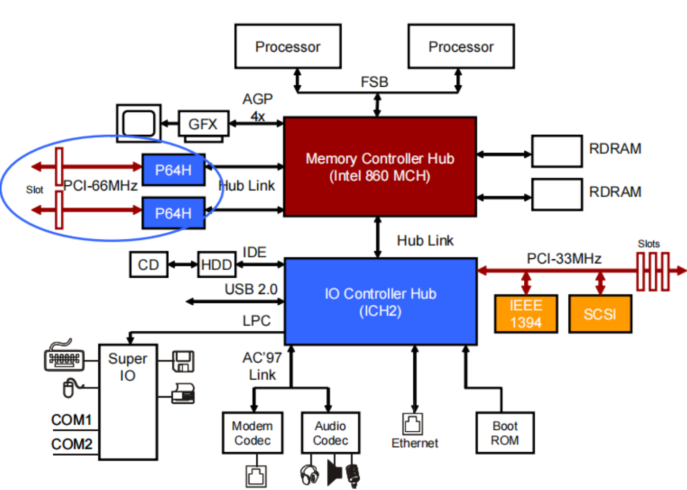

在PCI2.0中，吞吐量翻了一倍；但仍然采用相同的反射波信号传输，因此总线的负载能力大幅降低，每条总线几乎只能支持1个扩展卡，这也为后续PCI-X和PCIe的出现埋下伏笔。

在66MHz以上的时钟速率下，传统的并行PCI总线难以有效工作。这是由于总线上负载电容及传输线延迟导致的。66MHz对应时钟周期为15ns，其中3ns用于接收端的固有建立时间（对于PCI总线的反射波信号传输来说，减少接收端信号建立时间到低于3ns是不现实的）。其余12ns的时间则用于传输线延迟和反射延迟时间。

## PCI-X概述

PCI总线到这里就结束了，让我们回顾一下它所引入的各种机制和特色：

* 并行总线架构，可挂载多设备
* 地址和数据信号线复用，Valid-Ready握手
* 使用仲裁器控制设备的总线访问，确保设备之间的有序通信
* 支持三种地址空间：内存地址空间（设备内存映射）、IO地址空间（外围设备的输入输出操作）、配置地址空间（识别设备和分配资源）
* 支持单个设备最多具有8个功能（function）
* 支持外设中断管理
* 反射波信号传输机制降低功耗，但也限制了传输带宽和实际可挂载的设备数量
* 支持即插即用，具有较强的兼容性

## PCIe介绍

PCIe是目前最主流的外设总线，广泛用于连接显卡、固态硬盘（基于NVMe接口）、网卡等设备，几乎在所有现代PC和服务器中都有应用。PCIe作为外设总线的主要特点包括串行通信、点对点连接、高带宽、全双工通信、通道灵活性、向后兼容、支持热插拔、低延迟与高效率以及高级电源管理。它的灵活性和高性能使其成为现代计算机中用于连接外设的主流接口标准。

由于PCIe软件上兼容PCI（也兼容PCI-X），因此上述总线规范均可以套用到PCIe中。本章重点在于对PCIe的特殊点和更新特性进行介绍。

### 串行链路简介


### 拓扑结构


### 层次结构简介


### PCIe物理层


### PCIe数据链路层


### PCIe事务层


## PCIe配置

虽然PCIe的硬件实现部分还有很多内容，受限于篇幅，这里还是先对软件配置PCIe进行介绍。

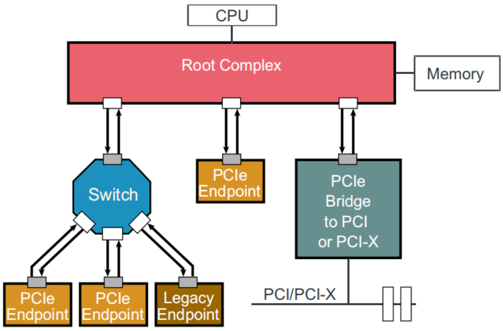

由于历史局限性，PCI设备采用IO地址空间，但PCIe要考虑的就很多了——它也需要支持这种机制以实现向前兼容。为此，现代CPU和PCIe采用了**MMIO**（Memory Map I/O）的机制来适配


### 配置空间

PCI协议首次引入了配置空间


### 传统PCI配置机制


### 增强型配置机制


## 参考资料

https://www.bilibili.com/video/BV1NQMqzQEXW

https://ztzhang.blog.csdn.net/article/details/142106665
