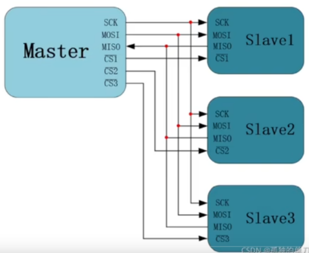

# SPI控制器的FPGA实现

SPI协议是一种中低速四线串行同步通信协议。目前常见的SPI协议分为双线SPI、三线SPI和四线SPI。

双线SPI是最基础的SPI规范，由时钟线sclk、主机输入信号线miso、主机输出信号线mosi和片选信号线cs组成。双线即信号线有两条；三线SPI又增加了一条，也就是由信号线d0、d1、d2和时钟线sclk、片选信号线cs组成，相较于双线SPI的**全双工通信**，三线SPI只能实现**半双工通信**；四线SPI同理，又称为QSPI，常见于各种FLASH、SRAM存储器。QSPI规定主机与从机之间由NSS、IO0、IO1、IO2、IO3、sclk六根线连接，其中IO0~3是数据线；NSS即cs，是片选信号线

这里我们仅解释双线SPI的协议规范，一般FPGA中需要用户实现的也仅仅是双线SPI（厂商一般会提供QSPI这种复杂IP给开发者使用）

所有SPI规范都采用主从通讯模式，可配置为**一主一从**或*一主多从*，主机负责产生时钟并由sclk传输给从机，片选信号cs也由主机产生。**cs低电平有效**，因此又称为NSS，从机接收到cs为低电平情况下才会接收主机传来的数据或向总线上发送数据

**SPI总线外设本质上是一个由SCLK控制的移位寄存器**。主机负责发起通信、拉低片选信号、产生总线时钟；从机则没有权限发起通信，只能在接收到片选信号拉低的情况下监听总线消息。主机向移位寄存器中挂载一位数据后，产生sclk时钟，数据会被通过mosi引脚移出芯片进入总线，并被从机的mosi脚接收；从机同时将移位寄存器中的数据通过miso发送到总线，数据会被主机通过miso引脚接收到内部寄存器。通过这一过程，SPI协议实现了双线全双工通信

SPI连线可以*线与并联*形式，也可以*菊花链*形式（所有设备MISO、MOSI级联，从机SCLK和CS引脚都并联接到同一个主机 的SCLK和CS引脚上，从而形成一个长串的移位寄存器，每个设备都是移位寄存器中的一个单元，主机发送的数据会按照时钟依次通过各个从机最后回到主机）

### SPI时钟

SCLK频率决定了SPI的传输速率。SPI的时序可以任意，SCLK一般控制在100MHz以下，但面对较庞大数据传输时，可以在确保板级电路信号完整性（需要PCB上SPI信号线预先进行差分布线、走线等长、阻抗匹配）的基础上，将SCLK频率提高到不高于400MHz。

一般我们常用的SPI传输频率为10MHz（低速）、40MHz（普通）、80MHz（高速）

SPI总线时钟可以配置四种传输模式，我们主要按照下面两个关键点来区分

* 空闲时候总线是否拉低
* MOSI在哪个边沿发送数据、MISO在哪个边沿接收数据

时钟极性（Clock Polarity，**CPOL**）决定了总线空闲时时钟信号是高电平还是低电平。**若CPOL=1，表示空闲时高电平；CPOL=0，表示空闲时是低电平**

时钟相位（Clock Phase，**CPHA**）决定了设备在哪个跳变沿对数据进行采样。若CPHA=0，表示在SCLK的第一个跳变沿（上升沿）采样MISO的数据；CPHA=1，在SCLK第二个跳变沿（下降沿）采样数据

### SPI硬件结构

