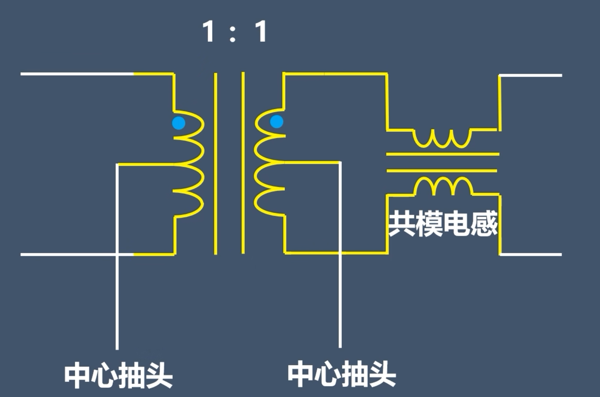
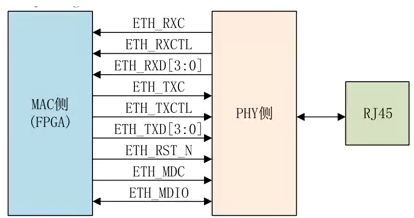

# 以太网

以太网接口由**IEEE802.3**标准规定，包括物理层、电子信号标准和介质访问层协议的内容。以太网的物理接口由以太网控制器管理。以太网硬件设计主要集中在物理层，嵌入式软件会与片上的以太网控制器配置相关；在SoC或者FPGA实现方面则需要与整个底层以太网标准打交道，这里从接口和电气规范角度介绍一下以太网控制器和相关电路的实现

## 以太网控制器

以太网控制器泛指**PHY**和**MAC**。

PHY即**Physical Layer**，通常称为**物理层接口收发器**，用于在各种以太网介质中传输网络帧，PHY连接MAC到一种物理媒介，最常见的就是光纤、铜线，但是对于特种行业中使用的以太网，往往有专门的PHY实现信号转换，比如光通信PHY就能将MAC侧的电信号转换给发光器件从而实现通信。一个典型的PHY包括**PCS**（Physical Coding  Sublayer，物理编码子层）和**PMD**（Physical Media  Dependent，物理介质相关子层），PCS对被发送和接受的信息编码和解码，一般是数字电路；PMD负责将编码后的数据以对应物理介质能接受的形式和规范发送出去，或者收取传输介质中的有效数据转换成数字形式后传给PCS，一般是模拟电路。

MAC即**Media Access Control**，也就是**介质访问控制子层协议**，用于控制以太网电路。MAC可以和PHY整合到单芯片——很多路由器或交换机SoC就是这样的；也可以分开，主控MCU或FPGA等设备搭载MAC核，另外使用专门的PHY芯片来与以太网传输线缆连接

PHY电路是一个典型的数模混合电路，其本身可以看作ADC/DAC电路的组合体，DAC电路负责TX发送，ADC电路负责RX接收。PHY电路在发送数据时会将MAC发送来的并行数据转换成串行流数据，也就是我们常说的par2ser转换，这个转换是根据*物理层*编码规则实现的，每种介质都有自己的物理特性，PHY芯片就是要根据不同介质物理特性不同将电信号转换成模拟信号。

> 一般情况下，以太网使用电信号传输，PHY芯片就是要将MAC发来的低电平（LVDS电平）转换成以太网可以使用的高电平（一般是模拟差分信号）
>
> 接收流程与其正好相反

PHY电路还负责与对端进行**自协商**（Auto Negotiation）：PHY一旦检测到网线被接入，就会不断发出脉冲信号来检测对端是否有设备，并在确认对方存在情况下依次通过标准格式沟通双方都可以接受的*连接速率*、*双工模式*、*是否采用流控*等，一般来说协商结果是两个设备中能同时支持的*最大*速度和*最好*的双工模式

### 电口与PHY间接口

以太网物理层主要由PHY芯片管理，PHY芯片提供了通过介质连接的基本功能和通信自协商功能。以太网接口分为十兆（10Mbps）、百兆（100Mbps）、千兆（1000Mbps）、万兆（10Gbps）等，对应于直观的传输速率单位MBps（MB per second），需要用bps单位除以8（1Byte=8bit）

使用电信号以铜芯屏蔽线缆（**双绞线**）传输数据的以太网物理层接口一般称为**电口**；相对来说使用光纤传输数据的以太网物理层接口就是**光口**，电口常用于十兆、百兆到千兆，万兆电口需要使用超六类或者七类网线才能传输数据；万兆以上速率的传输就很难使用电口了，一般来说会采用光纤（光模块）来传输万兆以上带宽的数据

电口从传输线到PHY部分的电路由以下几个主要部分构成。

**传输线**：主要是双绞线

**RJ-45网口**或其他工业标准接口：提供传输线到PCB板卡的连接，某些特种工业应用中也会直接让PCB板卡接传输线

**网络变压器**：提供传输线到PHY的隔离和电压变换功能

**PHY**：完成内部数字信号到网络模拟信号的转换

* 千兆以太网

    千兆以太网协议使用到以下四对差分线：

    * MX0
    * MX1
    * MX2
    * MX3

    其中的一半用于发送数据TX，另4根用于接收数据RX

* 网络变压器

    网络变压器是电口中以太网传输线和PHY之间的重要隔离措施，其内部结构如下图所示

    

    这是一种典型的隔离变压器，分为两个主要结构：隔离变压器和共模电感。网络变压器的主要作用有两个：**在支持POE供电的以太网传输线上搭载19V供电电压；隔离以太网传输线到控制部分（PHY+MAC电路）的电磁干扰**

    一般要基于网络变压器搭建**BobSmith电路**来提供有效隔离，常用电路拓扑如下所示

    

    BobSmith电路分为初级端（接PHY）和次级端（接传输线）。初级端的抽头通过一个电容连接到数字地（也就是MAC和PHY所使用的地），从PHY发出的各对差分信号直接接到初级端的变压器接头；次级端每个变压器的抽头都通过75欧电阻并串接一个高压电容接模拟地（网口所使用的地），变压器接头则对应差分信号输出到传输线

    > 选型方面要注意：如果是商用级产品，次级端接地电容要选择耐压1kV以上的高压电容；工控产品视具体应用应该选择400V耐压到10kV耐压的高压电容以防止传输线干扰与防雷击需求。

    上面的电路是最常用的*电压驱动型*，如果将初级端电容接地改成串联电感接VCC（CMOS电平，上拉电源大小取决于PHY端驱动能力大小，一般是1.8V或3.3V，也有2.5V和其他电平），那么就变成*电流驱动型*，两种接法一个可以提高传输速率（抑制干扰），一个可以提高传输长度（提高带载能力）

    BobSmith电路的基本功能有四个：前两个是最重要的功能

    1. **阻抗变换**：提供网口任意两对差分信号间**150欧的阻抗匹配**

        在长距离传输中，以太网传输线存在75欧姆左右的双绞线差分阻抗，这个阻抗从50欧到100欧之间不定，会随传输线情况而变化，不过为了合适的阻抗匹配，一般都是用75欧姆的电阻连接到次级端抽头

    2. **为共模信号提供回流路径**

        通过共模电感和次级端接地电容回路，共模信号可以得到有效滤除，改善EMI性能

    3. 降低EMI，防止传输线上的干扰回传到控制端

        这个功能主要是基于共模电感实现，与电源输入端的EMI磁环异曲同工

    4. **防浪涌**

        防浪涌功能主要通过次级端接地电容实现。信号线上的浪涌高频脉冲先经过变压器和电阻，再经过电容到地，会被高压电容滤去，部分高强度的谐波也会在变压器的寄生电感上得到滤除

    相关资料可以查看CSDN上的一篇博文：https://blog.csdn.net/weixin_42005993/article/details/102788907

    其中提到的内容很多都基于工况，如果用在其他领域可以适当改变选型

* 十兆/百兆以太网

百兆以太网中只使用到了两对差分线：Tx-Rx

千兆以太网的MX0+、MX0-对应百兆以太网的TX+和TX-；MX1+、MX2-对应百兆以太网的RX+和RX-

### PHY与MAC间接口

PHY和传输线之间的协议根据介质不同而不同，上面介绍的只是通用的电口以太网接口协议，实际上我们也可以基于不同的PHY定义不同类型的传输协议，主要考虑的还是传输过程中的抗干扰和远距离传输对收发端的干扰性。以太网协议中严格规定了PHY和MAC之间的接口，这才是以太网物理层的最重要协议（之一）

MAC和PHY之间的常用接口有**MII**、**RMII**、**GMII**、**RGMII**等

MII：媒体（或者翻译叫介质）独立接口，Media Independent Interface，支持10M/100M，**数据位宽为4，在100M传输下，时钟频率定为25MHz**。“媒体独立”表示在不对MAC重新设计或替换的情况下，任何类型的PHY设备都可以通过该接口正常工作

RMII是MII的简化版，使用2位数据位宽，但是时钟频率提高到原来的两倍：50MHz@100Mbps

GMII：千兆MII，适用于10M/100M/1000M的传输，**数据位宽为8位，时钟频率125MHz@1000Mbps**

RGMII：简化版的MII，数据位宽是4，采用125MHz@1000Mbps，**没有加快时钟速率，但在千兆传输情况下会在时钟上升沿、下降沿都采样**；在百兆和十兆速率下为单个时钟沿采样

**千兆以太网中，最常用RGMII和GMII接口，RGMII对PCB布线较严格（需要对时钟线、控制线和数据线都做等长处理），时序约束也较繁琐；但同时适用于10/100/1000M传输且占用引脚较少**

上图展示了标准RGMII接口的引脚，下面来详细介绍每个引脚的作用

* **ETH_RXC**：接收数据参考时钟，由PHY提供给MAC的时钟，用于接收数据的同步传输，1000M下，时钟频率125，上下沿同时采样；百兆下，时钟频率25MHz；10Mbps下，时钟频率2.5MHz
* **ETH_RXCTL**：也可以记为ETH_RX_DC（Ethernet Receive Data Valid）接收数据有效信号，和发送通道TX_EN作用相同
* **ETH_RXD[3:0]**：四位并行接收数据线
* **RX_ER**：接收数据错误指示信号，高电平有效，与ETH_RXC同步，当其拉高，表示当前传输数据无效。在十兆速率下忽略该信号
* **ETH_TXC**：发送数据参考时钟，由MAC提供给PHY的时钟，千兆下时钟频率125MHz，上下沿同时采样；百兆下、十兆下速率和ETH_RXC的对应速率一样
* **ETH_TXCTL**：发送数据控制信号
* **ETH_TX_EN**：发送使能信号，高电平有效，只有当其拉高时传输的数据才有效、
* **ETH_TXD[3:0]**：四位并行发送数据线
* **TX_ER**：发送数据错误指示信号，与ETH_TXC同步，高电平有效，作用和RX_ER一样
* **ETH_RESET_N**：芯片复位信号，低电平有效
* **ETH_MDC**：管理数据时钟（Management Data Clock），为ETH_MDIO下信号提供时钟同步
* **ETH_MDIO**：管理数据输入/输出（Management Data Input/Output），为PHY和MAC提供一个双向信号用于传递管理信息
* **CRS**：载波侦测信号（Carrier Sense），*当且仅当PHY处于半双工模式下*，只要数据线上有数据传输，CRS就会有效，用于提示总线有数据在传输。该信号不用与时钟同步
* **COL**：冲突检测信号（Collision Detected），*当且仅当PHY处于半双工模式下*，当总线上有传输冲突时会拉高。该信号不用与时钟同步

ETH_RXC、ETH_RXCTL、ETH_RXD都是MAC接收侧引脚；ETH_TXC、ETH_TXCTL、ETH_TXD是MAC发送侧引脚，也就是说这里的TX、RX是针对MAC而言的。MDC和MDIO有点类似DVP协议中使用到的SCCB/I2C总线，用于MAC配置PHY内部寄存器，有时候也可以让PHY来配置MAC内部寄存器

> 这里两根线也像I2C一样要加上拉电阻

RGMII采用上下沿双倍数据速率（DDR，Double Data Rate）的方式能够实现在一个周期内传输8位数据（2倍数据采样率乘4位数据位宽），协议中往往在**上升沿收发高四位数据，下降沿收发低四位数据**。ETH_TXCTL和ETH_RXCTL控制信号也采用这样的方式从而在一个时钟周期内传输两位控制信号，**上升沿收发数据使能信号TX_EN和RX_DV，下降沿收发使能信号与错误信号的异或值RX_ER\^RX_EN和TX_ER\^TX_EN，只有当上升沿和下降沿均为高电平时，发送和接收的数据才有效且正确**

> 需要注意：在GMII中，ETH_TXC由MAC提供给PHY，但MII中的TX_CLK由PHY提供给MAC，GMII为了兼容MII协议的接口，一般会提供两个发送参考时钟：ETH_TXC（为了区分，一般称为**GTX_CLK**）和**TX_CLK**，前者由MAC提供给PHY，后者由PHY提供给MAC

### MAC与主控间接口

上面我们说到

> MAC即**Media Access Control**，也就是**介质访问控制子层协议**，用于控制以太网电路

实际上并不准确。*MAC协议*只是一个抽象的标准，描述了硬件如何控制以太网，实际上起作用的是*MAC芯片*，发送数据时，MAC芯片遵循MAC协议的规定判断是否可以发送数据，如果可以发送就给数据加上一些控制信息（将上层数据封装成帧），最终将数据与控制信息以规定的格式发送到物理层；接收数据时，MAC芯片也会遵循MAC协议判断输入的信息是否发生传输错误，如果没有错误则将帧转发到上一层

很多芯片会将MAC集成在片上作为片上外设，并提供专用的以太网DMA。CPU通过配置DMA控制器和MAC控制器接口来对它们进行读写操作。MAC控制器自带RxFIFO和TxFIFO，DMA会从中搬运数据直接送到片上内存，MAC协议中的各个关键过程会由硬件完成。同时MAC会带有一个独立的中断控制器用于产生接收/发送完成中断或错误/唤醒中断

### 以太网电路的PCB布线原则

下面仅列举几个常用的布线原则：

1. RJ45（传输线）和变压器之间的距离尽可能的短
2. 靠近PHY侧网络变压器中心抽头对地的滤波电容要尽量靠近变压器管脚，保证引线最短，分布电感最小
3. 靠近传输线侧网络变压器中心抽头的电阻和电容靠近中心抽头放置，走线短而粗，线宽最好大于15mil
4. 走线时尽量保证差分对平行、等长，避免过孔或交叉；远距离传输时需要对差分对进行阻抗控制，一般在100欧姆左右
5. PHY和MAC之间距离尽量短
6. ETH_TX、RX内时钟线和数据线一定等长，有必要时采取蛇形线，但尽量避免蛇形线为好；MDIO、MDC尽量短且避免过孔
7. GMII时钟、信号线周围可以打屏蔽过孔

## 以太网IP实现

## 以太网驱动实现

