本文主要参考官方文档UG471、UG472、UG473、UG474编写

# Xilinx的CLB

Xilinx官方文档中将**可配置逻辑块CLB**（Configurable Logic Block）作为FPGA的逻辑资源的最小单元。但CLB实际是由多个Slice构成，因此工程应用中常常把Slice作为最小逻辑单元，很少提起CLB。本篇博文主要介绍Xilinx FPGA的CLB和Slice结构

## 区分Cells、CLB和Slice

Vivado的资源利用率（Utilization）列表往往像下面这样

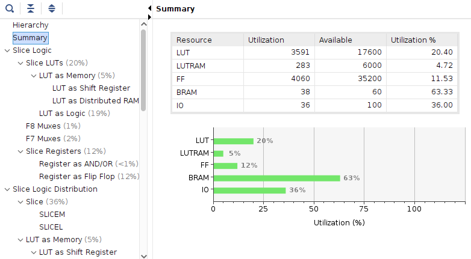

Slice和组成Slice的LUT、FF、BRAM是主要的显示项，也是工程中最为常用的资源；而在官方手册中，我们经常能看到Xilinx与友商通过逻辑单元（Logic Cells）进行比较；官方文档中又把CLB作为最基本逻辑单元。我们下面来详细区分一下三者

### Logic Cells

首先看最为广义的Logic Cells概念

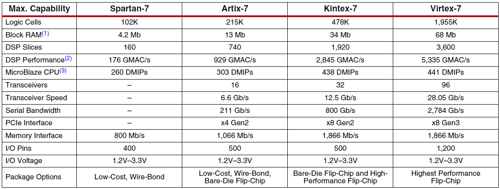

Logic Cells是Xilinx为了和友商对线创造出的一个市场说法，1个LC代表无任何附加功能的LUT4（4输入LUT）。

我们拿紫光同创的资源举例

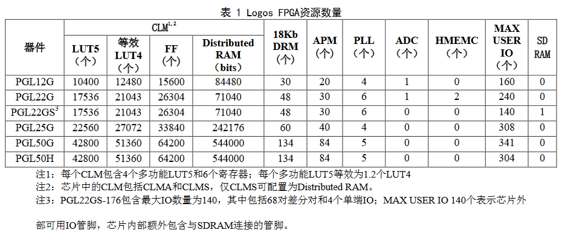

紫光的Logos FPGA使用自研的多功能LUT5作为基本逻辑单元，将其等效为1.2个LUT4，那么我们可以用1个LUT5等效成1.2个LC，从而与Xilinx的芯片对比：7000系FPGA使用LUT6作为基本LUT单元，并基于LUT6组合成Slice，因此采用系数**1.6**，即1个LUT6可以等效成1.6个LC，于是我们可以发现1个紫光同创的多功能LUT5=1.2/1.6个Xilinx的LUT6。这样就能横向比较两个公司的器件了

> 商业宣传，懂得都懂。在合理范围内营造一定水分XD

### CLB

下面是来自手册UG474的CLB介绍

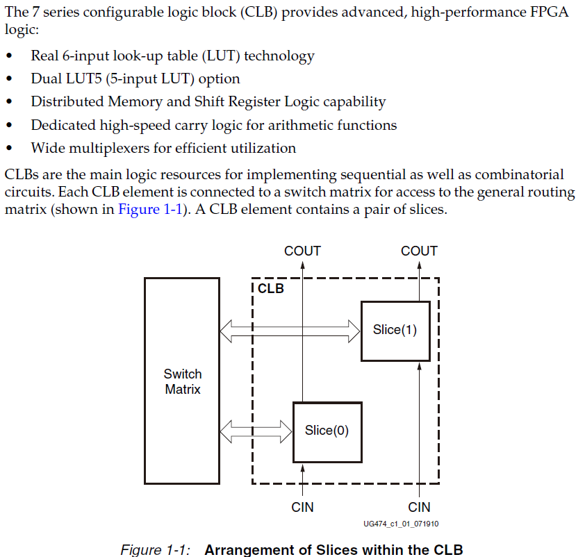

可以知道**一个CLB里面包含2个Slice**，每个CLB都连接到一个互联交换矩阵（Switch Matrix），这些交换矩阵被统一的通用路由矩阵连接起来

**CLB资源是对开发者不可见的**，它会被综合器和布局布线工具在底层调用，也就没有在RTL文件中实例化的必要。综合器会将RTL解析成以CLB为层次安排的Slice网表（网表中所有原语都调用Slice，但这些Slice符合CLB的布局要求）

CLB要么*被配置过*，要么*被复位*。设计者不能同时使用设置和复位CLB

下图描述了一个CLB的等效逻辑资源

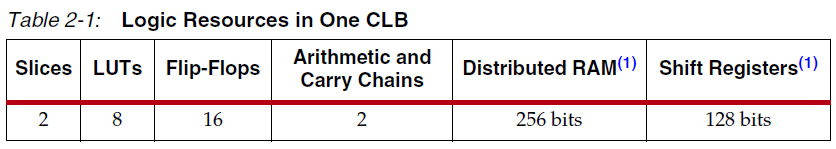

### Slice

Slice是实际上能被调用的FPGA最小组成单元。7000系列FPGA的Slice具有四种功能：

- **逻辑单元**，即LUT6，1个Slice里包含**4个LUT6**
- **存储单元**，也就是常说的触发器（Flip-Flop，FF）。1个Slice里包含**8个触发器**。每4个触发器为一组，可配置成锁存器。
- **多路复用器**，也就是**1位宽的数据选择器**（MUX），每个Slice里面都会配有海量MUX
- **进位逻辑**，每个Slice都有负责处理算术运算的**进位逻辑**，与本列的上下Slice的进位逻辑相连

7000系FPGA中的一个LUT可以被配置成*一个具有6输入1输出的LUT6*或被配置成*两个具有独立输出但使用共同地址或逻辑输入的5输入1输出LUT5*。可以选择利用一个LUT5的输出恰好构成一个触发器（Flip-Flop，FF）。四个LUT6和对应配置为双路LUT5时候能最多使用的8个触发器、多路复用器以及额外的算术运算逻辑构成一个Slice，再由两个Slice构成一个CLB。每个Slice中的四个FF可以选择配置为锁存器（Latch），在这种情况下，该片中剩余的四个FF必须保持不使用。

> 1个Slice等于4个6输入LUT+8个FF+MUX+算数进位逻辑
>
> 每个Slice的4个触发器（虽然有8个FF，但是每个LUT会被唯一地分配一个FF）可以配置成Latch，这样会有4个FF不能使用——*因为它们对应的LUT资源被用在了配置另外四个FF为Latch上面*

此外，FPGA里的Slice有2种，一种被称为**SliceL**，另一种被称为**SliceM**，有的CLB由2个sliceL构成，有的则是由1个sliceL和一个sliceM构成。

> 大约有三分之二的片子是SliceL逻辑片，其余的是SliceM

SliceM除了基本功能外，还可以实现**分布式64位RAM**或**32位移位寄存器**或**两个16位移位寄存器**的功能，这三种功能都可以通过调用Xilinx提供原语来在RTL文件中调用

## CLB和ASMBL架构

Xilinx设计了**高级硅模块块（Advanced Silicon Modular Block，ASMBL）**架构，以使具有不同功能组合的FPGA平台能够针对不同的应用领域进行优化。为了增加集成度，7000系FPGA还采用了特殊的**堆叠硅互联（Stacked Silicon Interconnect，SSI）**技术使多个超级逻辑区域（Super Logic Regions，*SLRs*）在无源内电层上组合起来，创建一个具有超过一万个SLR间连接的FPGA整体

> 这里是翻译官方文档原文，大意就是在吹自己的岛型架构和别家的架构更强集成度更高

FPGA内部的逻辑资源按照岛型排列，每个岛以竖列（Column）布局，如下图所示

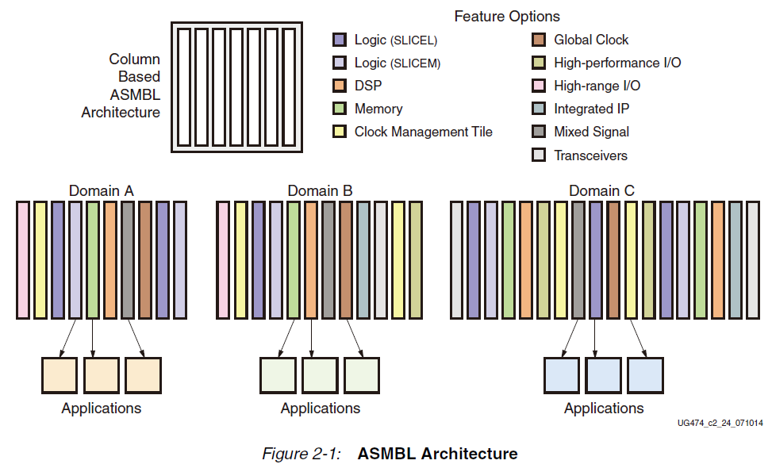

ASMBL架构中CLB之间结构如下图所示，一个CLB包含两个Slice，竖列CLB之间通过Slice的进位逻辑相连接

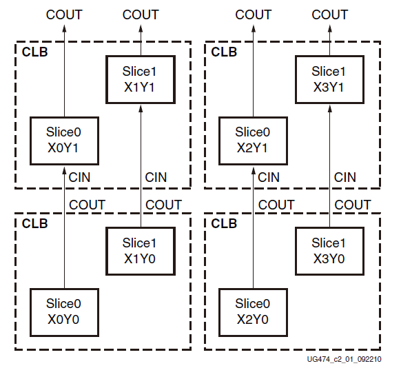

### Slice结构

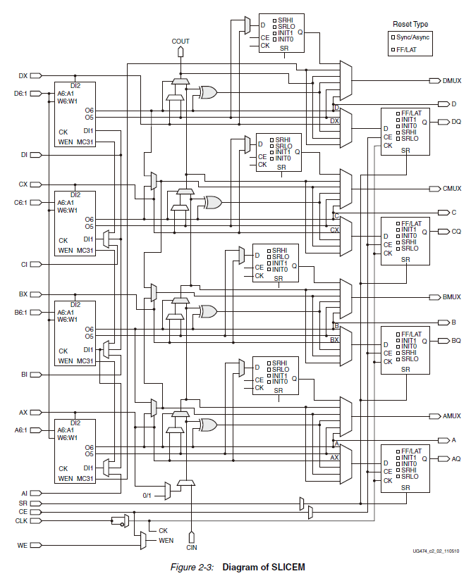

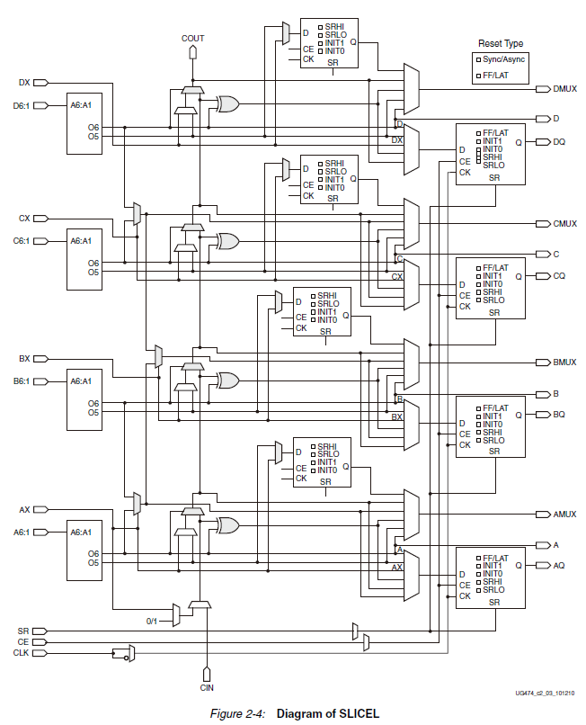

### LUT

7000系FPGA中的基本逻辑函数单元被实现为六输入查找表（**LUT6**）

一个标准的LUT6可以构造出：

* 任何任意定义的六输入布尔函数
* 有共同输入的两个任意定义的五输入的布尔函数
* 两个任意定义的3和2输入或更少输入的布尔函数

大体功能已经在上面的Slice介绍中提到过，这里不再赘述

### 存储单元

每个Slice包含8个FF。其中四个可以被配置为边沿触发的D型触发器或电平敏感锁存器。D输入可以由LUT直接驱动，也可以通过AFFMUX、BFFMUX、CFFMUX、DFFMUX由旁路的Slice输入驱动。结构如下所示

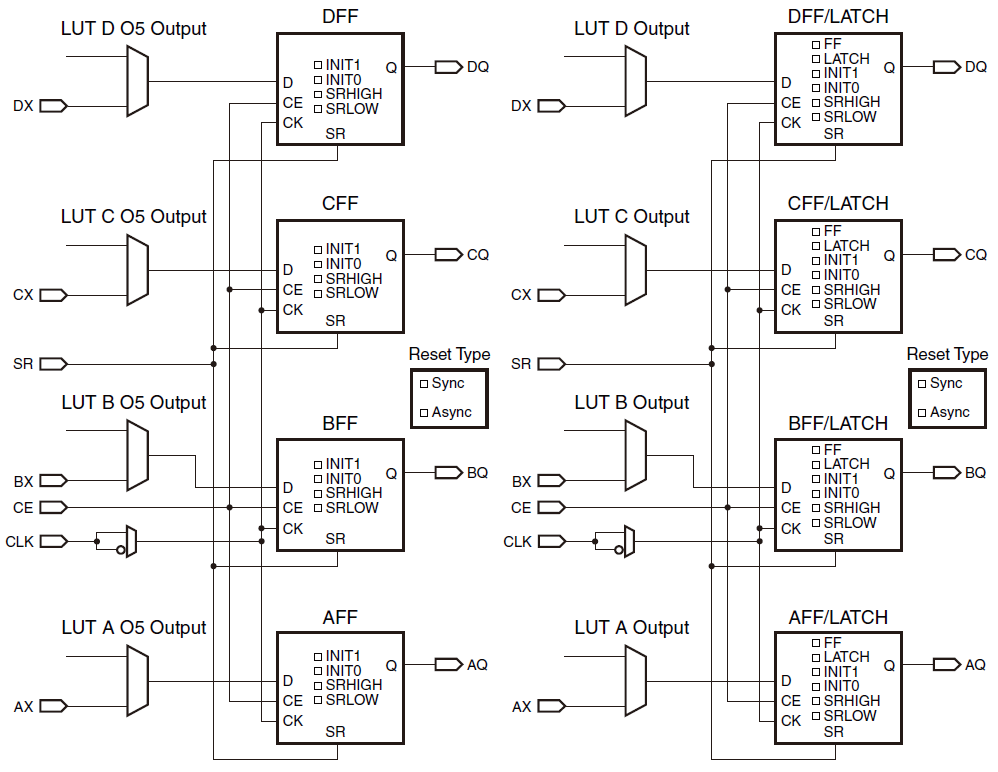

左边4个FF不能进行额外配置；右侧4个FF可以被选择配置成锁存器Latch，在这种情况下，左侧那四个FF不能使用

信号时钟CLK、时钟使能CE和设置/复位SR对一个Slice中的所有FF是共用的。当一个Slice中的一个触发器启用了SR或CE，Slice中使用的其他触发器也会启用SR或CE。

CLK信号具有可编程的极性，通过一个MUX可以选择触发电平。CE和SR信号则都是固定高电平有效。

### Distributed RAM

前面提到过，SliceM中的LUT可以实现**分布式64位RAM**或**32位移位寄存器**或**两个16位移位寄存器**的功能

这种由Slice逻辑资源构成的RAM称为分布式RAM（**Distributed RAM**），可用的组合有：

* 单口32/64/128/256位1比特RAM
* 双口32/64/128位1比特RAM
* 四口32位2比特RAM
* 四口64位1比特RAM
* 简单双口32位6比特RAM
* 简单双口64位3比特RAM

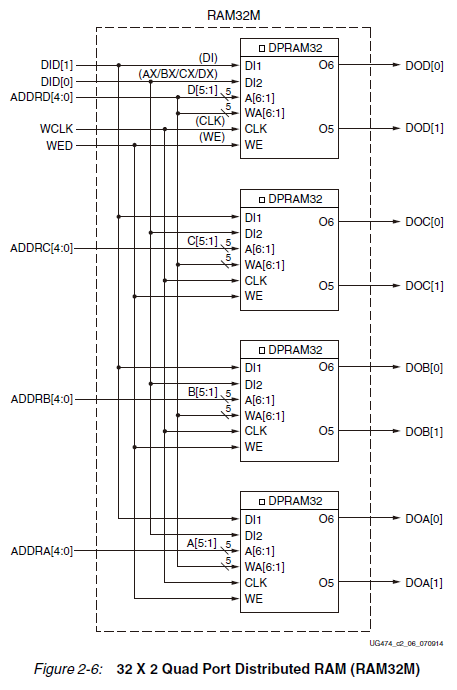

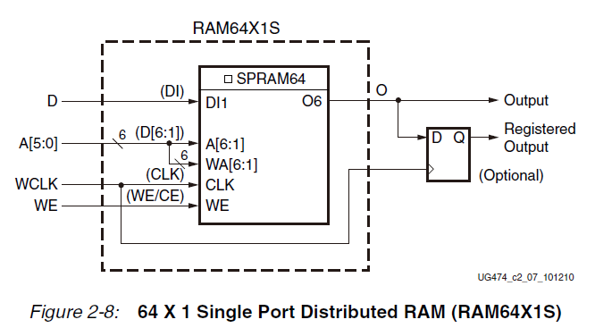

### Distributed ROM

SliceM和SliceL中的LUT都可以实现64位1比特的分布式ROM。

可以选择三种配置：ROM64x1、ROM128x1、ROM256x1，如下表所示

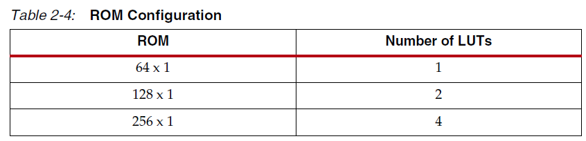

### 移位寄存器SR

SliceM中的LUT可以配置成**32位移位寄存器**或**两个16位移位寄存器**，这个配置方式不需要用到Slice中的FF

更进一步，可将多个SR级联来形成更大的SR。一个SliceM中的4个LUT被级联起来可以产生128个时钟周期的延迟。

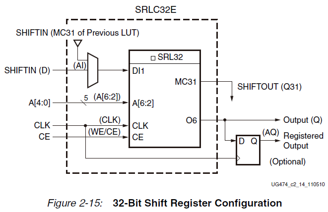

一个由SliceM构造的32位SR的结构如上图所示，能够实现动态读写操作（32位中的任何一位都可以被异步读出、同步写入）、与时钟输入和可选时钟使能的同步

LUT地址的LSB是未使用的，软件会自动将其连接到逻辑高电平；外部电路可以使用5位地址线A[4:0]来控制访问地址

移位寄存器的应用包括：

* 延迟或延时补偿
* 同步FIFO和内容寻址存储器（CAM）

使用相同的资源也可以构造双16位SR，结构如下所示

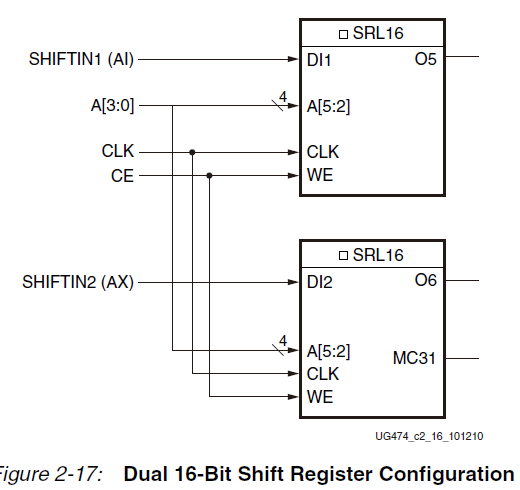

使用MUX和级联可以构造更多位宽的SR，如下图所示

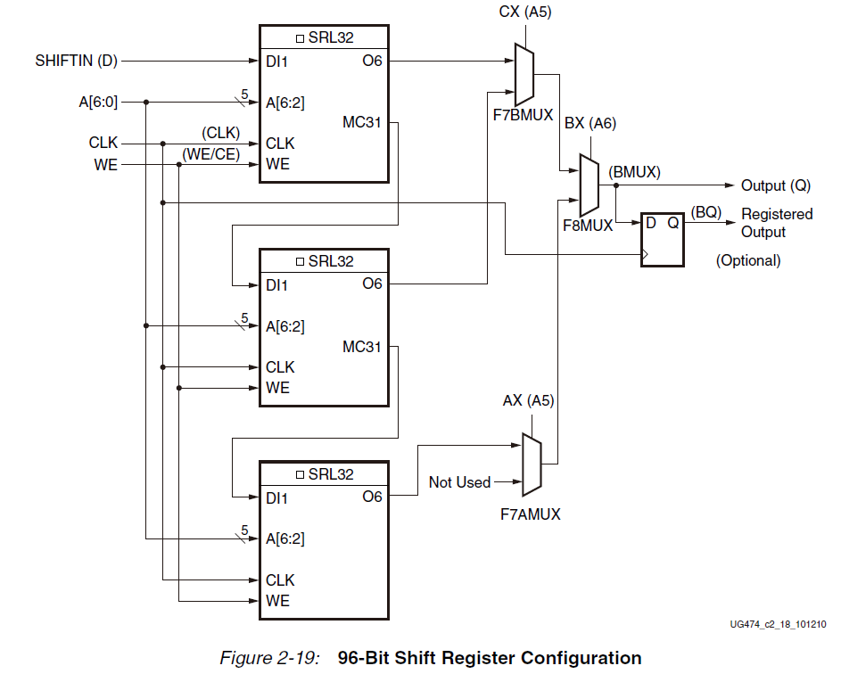

### 多路选择器MUX

除了Slice内部自带的1bit MUX外，使用LUT资源还可以构造下面的MUX：

* 1个LUT可构造4路MUX，每个Slice可以构造4组
* 2个LUT可构造8路MUX，每个Slice可以构造2组
* 4个LUT可构造16路MUX，每个Slice可以构造1组


这些宽输入多路复用器是通过使用专用的F7AMUX和F8MUX多路复用器在一级LUT中实现的。由于这些MUX的特殊性，在一个Slice中最多有4个LUT的组合，并且在2个LUT中最多有13个输入，或在4个LUT中有27个输入（一个Slice中）

*尽管多路复用器是组合逻辑，但它们实际上是利用CLB的存储单元来实现的*

### 进位逻辑Carry Logic

Slice中还提供了专门的快速前传进位逻辑，这可以加速Slice之间的算术运算。如果使用多个Slice构造多个加法器、除法器这样的网状逻辑电路，就可以用到这些进位逻辑形成运算链。硬件结构如下图所示

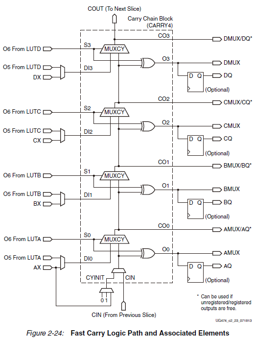

进位链向上运行，每个Slice有4位的Carry位（被称为**CARRY4**），对每一位都配备了一个进位复用器MUXCY和一个专用的异或门XOR，用于将操作数与选定的进位相加或相减。进位路径和进位复用器也可以用来级联LUT以实现更宽逻辑的功能

一个CARRY4有下面的10路独立输入信号端口

* 传递信号S0~S3：来自LUT6输出端口的信号
* 前导生成信号DI1~DI4：来自LUT5输出端口的输入/外部乘法器的输出/外部加法器的输出/来自外部Slice的输入
* CYINIT：置为0时执行加运算，1则执行减运算，也可以当作AX的动态进位位
* CIN：来自更长进位链的进位输入

还有8路独立的输出信号端口

* O0~O3：加减法算术运算的结构输出位
* CO0~CO3：用于级联多个Slice构造更长的进位链的进位信号前传位

使用一个Slice中的CARRY4可以恰好实现*超前进位*加法/减法运算电路

## Slice原语

### FF

```verilog
FDRE #(
    .INIT (INITIALISE[0]) // 初始数据
) fdre_inst (
    .C(clk), // 同步时钟
    .D(data_sync0), // 异步数据输入
    .Q(data_sync1), // 同步数据输出
    .CE(CE), // 时钟使能信号，高电平有效
    .R(R) // 复位信号输入，高电平有效
);
```


### MUX

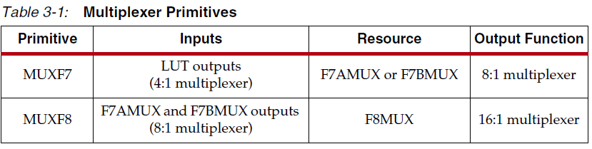

```verilog
MUXF7 MUXF7_inst (
	.O(O), // MUX输出
    .I0(I0), // MUX输入
    .I1(I1), // MUX输入
    .S(S) // MUX输入选择信号
);
```

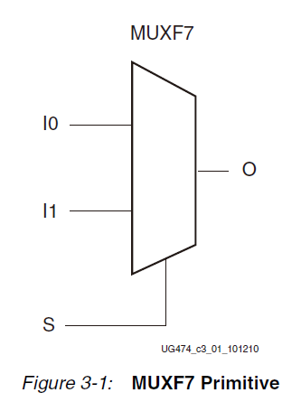

### CARRY4

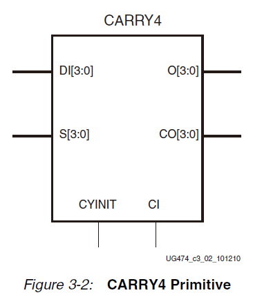

```verilog
CARRY4 carry4_inst (
    .CO(CO),
    .O(O),
    .CI(CI),
    .CYINIT(CYINIT),
    .DI(DI),
    .S(S)
);
```

### Distributed RAM

```verilog
RAM16X1S #(
    .INIT(16'h0000) // RAM内容初始值
) RAM16X1S_inst (
    .O(O), // RAM输出端口
    .A0(A0), // RAM地址线0
    .A1(A1), // RAM地址线1
    .A2(A2), // RAM地址线2
    .A3(A3), // RAM地址线3
    .D(D), // RAM输入端口
    .WCLK(WCLK), // 写时钟输入
    .WE(WE) // 写使能输入
);
```

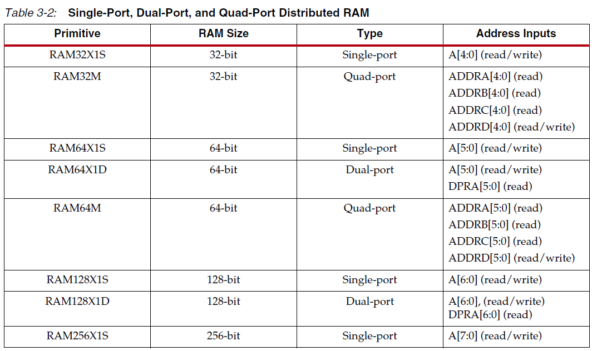

### SLICEM SRL

```verilog
SRL16 #(
	.INIT(16'h0000) // 初始化移位寄存器的值，可以为 16 比特任意整数
) SRL16_inst (
	.Q(Q), // SRL16 的数据输出信号
	.A0(A0), // 选择[0]输入
	.A1(A1), // 选择[1]输入
	.A2(A2), // 选择[2]输入
	.A3(A3), // 选择[3]输入
	.CLK(CLK), // 时钟输入信号
	.D(D) // SRL16 的数据输入信号
);
```

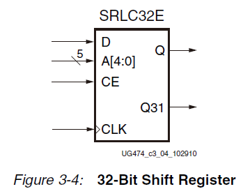
