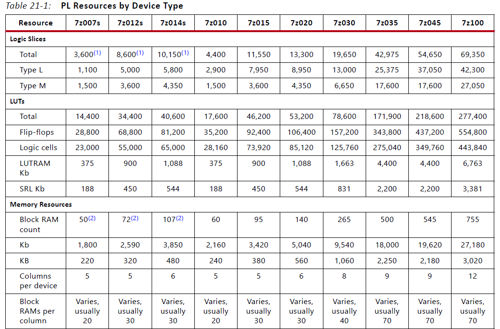
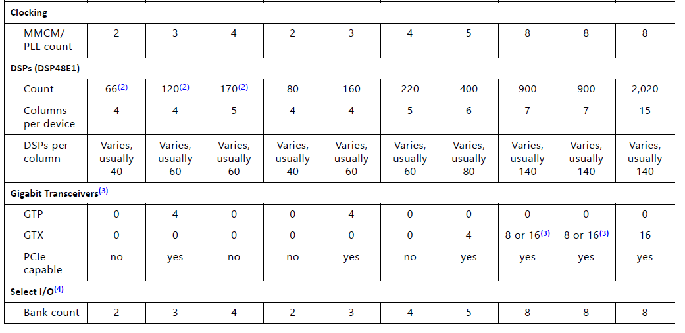

# ZYNQ-PL简介

Zynq的PL即Programmable Logic部分，实质上是一个和PS端紧耦合的Artix-7 FPGA，具有与普通FPGA相似的片上资源和模拟外设，可以单纯的代替FPGA——事实上如果看LUT-价格比，Zynq比单纯的FPGA更高一些；但是Zynq的PL可以使用MIO与PS交互，这就使得Zynq可以“随用随编”

* PS运算速度不够？直接构造一个硬件加速核挂到AXI总线上
* PS缺内存？直接把PL的块RAM当分布式内存用
* PS的实时性不够？直接在PL上放一块MicroBlaze、Xtensa、RISC-V的MCU

Xilinx还想办法搞了个PYNQ，能够直接把PL当工具核用Python+opncv写自带硬件加速的图像处理应用

## 硬件资源

Zynq-7020的PL部分资源比较丰富，约等于一个xc7a100t所有资源，具有约80k的LUT资源，并且能够调用500KB左右的块RAM，具有四个PLL硬核和220个DSP硬核

详细信息可查看下表

> 实际上Zynq7020就是把一个Artix-7的资源和一个双核A9粘到一起并添加了交互IP

## 开发流程

**PL部分的开发与传统FPGA开发一模一样**

但是如果需要与PS部分交互，还需要考虑EMIO、AXI、XADC等外设

如果在Zynq开发中使用到PL部分，还需要注意最后一定要生成比特流，并将导出的硬件信息包含比特流，否则PL部分不能正常工作

## 与PS交互

PL部分可以通过以下方式和PS部分交互

* EMIO：PS部分的GPIO可以与PL部分通过EMIO连接，从而能让PS通过软件IO逻辑控制FPGA设备或经由FPGA物理约束扩展IO接口
* XADC：XADC信号可以通过PL部分输入/输出
* IRQ：支持来自PL部分的中断
* CLK：PS-PL时钟信号可以直接连接
* AXI-Lite/AXI-Full：用于PS部分直接控制PL端的FPGA外设
* AXI-Stream：用于PL部分访问PS部分连接的DDR或其他存储设备
* DevC：设备配置模块，可用于PS端在上电后为PL端加载比特流。

