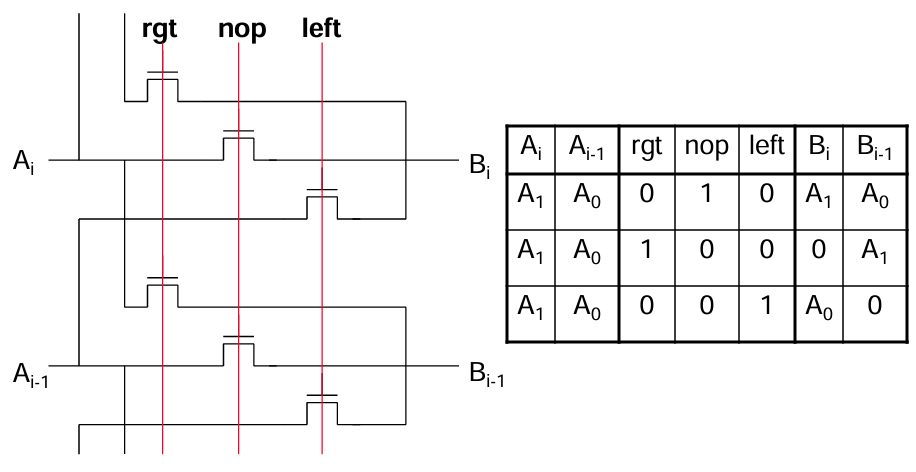
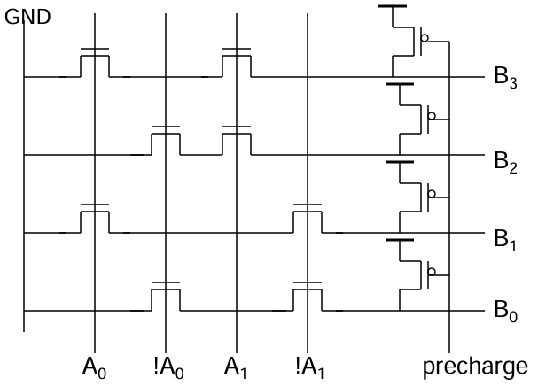
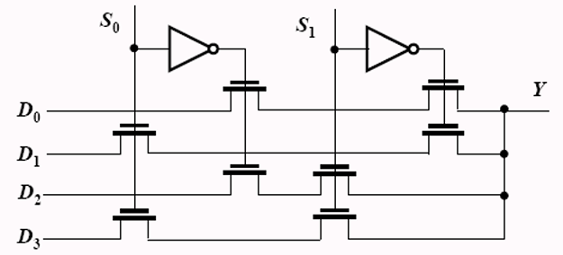
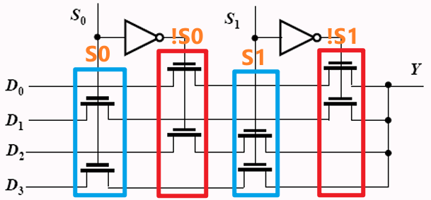

# 数字集成电路设计10【常见模块设计】

本章给出常见电路模块的设计示例

## 移位寄存器设计

## 译码器设计

基于动态电路+传输管的或非门设计如下

## 多路选择器设计

这里以传输管搭建4选1多路选择器（MUX）电路为例，给出一个标准的设计流程

一个标准的MUX电路存在4个输入信号C0、C1、C2、C3，其中有且只有一个位为1，暂不考虑输入均为0的情况。同时电路的输入数据为D0、D1、D2、D3，电路输出从中选择1位输出到Y，即满足
$$
Y=C_0D_0+C_1D_1+C_2D_2+C_3D_3
$$
该电路实际上存在冗余，4个控制量分别对应4个输入数据。如果对输入数据采用二进制编码表示，则可以化简到2个控制量S0和S1，并将输入条件加入到表达式内，形成
$$
Y=\overline{S_0}\overline{S_1}D_0+S_0\overline{S_1}D_1+\overline{S_0}S_1D_2+S_0S_1D_3
$$
这样得到的MUX电路真值表为

| 输入S0 | 输入S1 | 输出Y |
| ------ | ------ | ----- |
| 0      | 0      | D0    |
| 0      | 1      | D1    |
| 1      | 0      | D2    |
| 1      | 1      | D3    |

对应使用传输管实现如下图所示

该电路分析如下图。以D0输出行为例，Y=D0情况下，要求输入S0=0、S1=0，那么就在对应!S0、!S1的位置上添加传输管；以D2输出行为例，Y=D2情况下，要求输入S0=0、S1=1，那么就在对应!S0、S1的位置上添加传输管

根据上述方案，就可以根据真值表设计任意n选1的MUX电路了