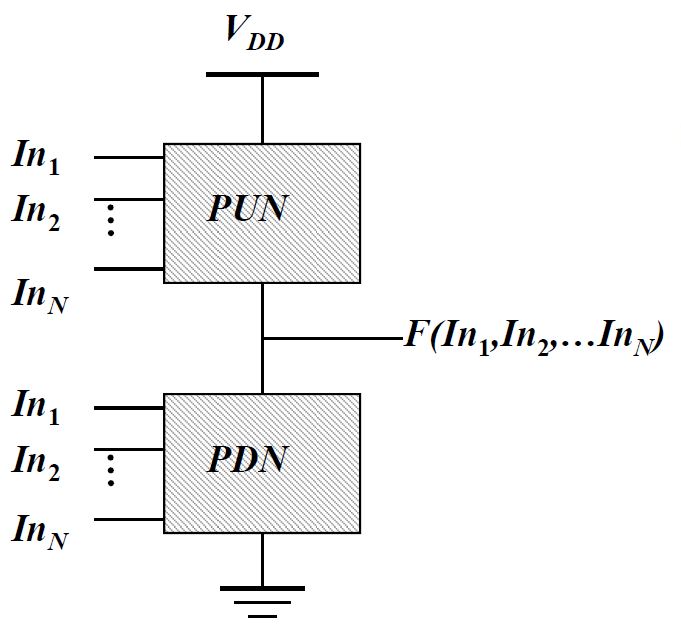
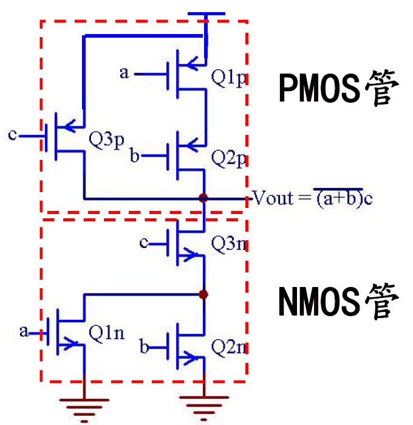
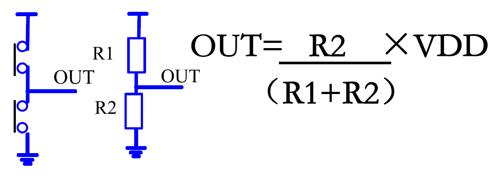
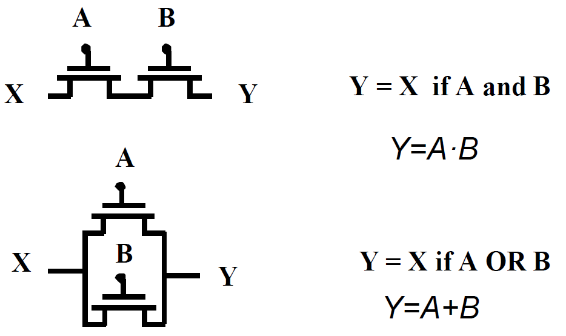
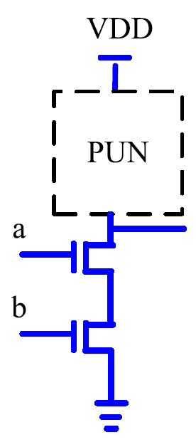
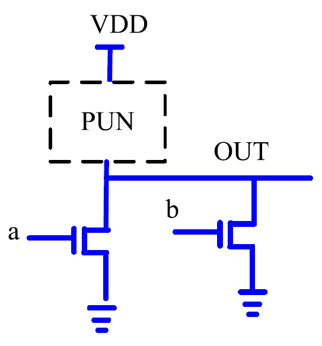
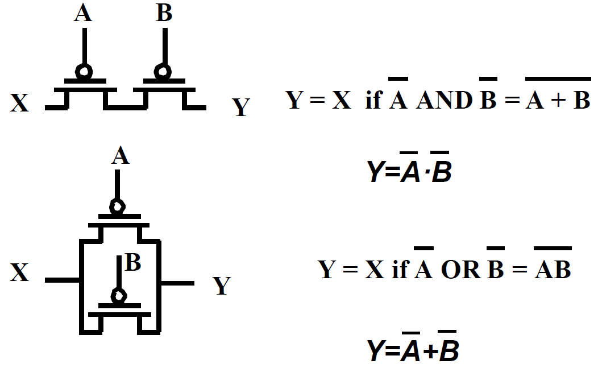
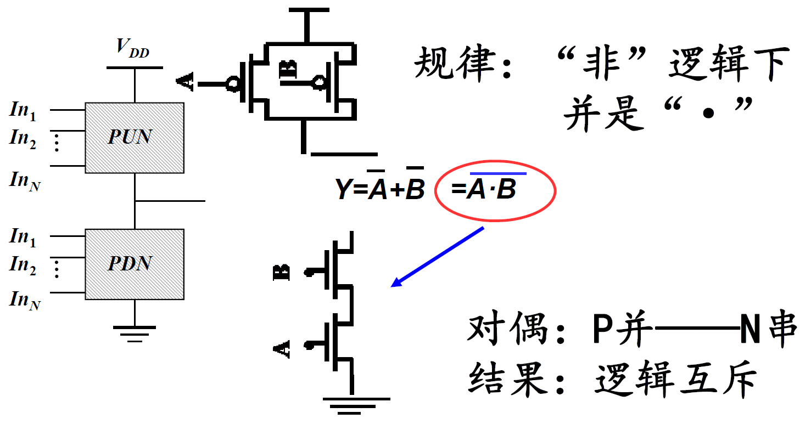
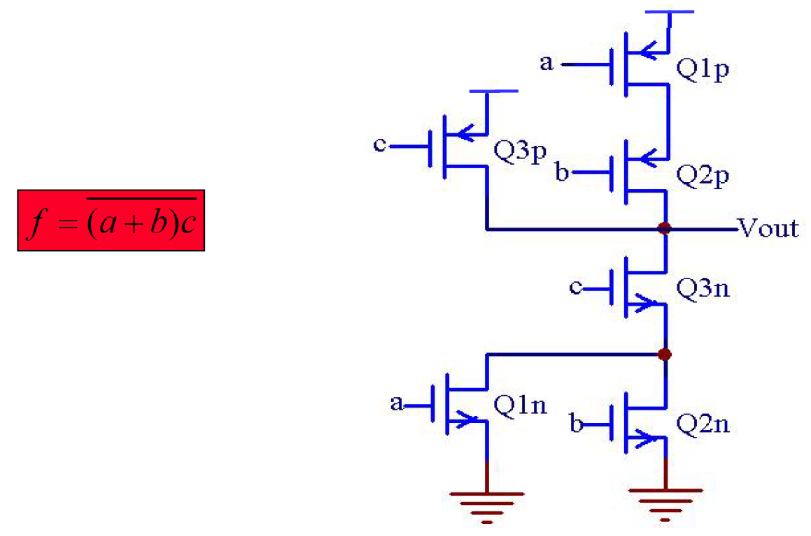

# 数字集成电路设计1【CMOS逻辑】

和模拟集成电路不同，数字集成电路的设计目标是更快地执行数字逻辑，它与工艺的耦合深度并没有模电那么高，更多情况下是在使用CMOS构成的逻辑网络，并研究CMOS门电路整体的电气特性

## 数字集成电路的基本概念

1. 摩尔定律是驱动数字集成电路发展的重要经验规律，而只有**技术突破**才能推动数字电路技术沿摩尔定律方向发展，这里的技术突破包含：

    * 特征尺寸（特征线宽）

        **28nm是传统制程和先进制程的分界点**，28nm以下的电路都是通过基本数字集成电路工艺制造，但随着特征尺寸缩小，短沟道效应加剧，导致需要使用FinFET等先进工艺才能让晶体管尺寸继续缩小

    * 存储器容量

        存储器的容量增大，意味着功耗增大、稳定性下降（功率密度快速提升导致单位面积下发热量巨大）。因此要实现更大容量的突破，需要寻找新技术（如傲腾持久性内存使用的新材料）、新架构（如3D堆叠架构）来让功耗增速变缓

    * 晶圆尺寸

        晶圆尺寸增加，单位硅片数量增加，所需的技术越先进，最终成品芯片价格也越低。同时大直径的硅片可以大大提高成品率

2. 

## CMOS数字集成电路结构基础

CMOS即Complementary MOS，在工艺或器件角度是指一个PMOS作为上管、NMOS作为下管构成的推挽结构，但在数字集成电路角度，**CMOS是由PMOS构成的上拉网络和NMOS构成的下拉网络组合而成的复杂电路**，如下图所示

PUN是只有PMOS的一个网络，PDN是只有NMOS的网络，具体结构展开后可以像下图一样

### CMOS结构的器件基础

根据半导体器件物理的理论，**PMOS上拉、NMOS下拉可以避免阈值电压$V_{th}$偏差**：如果使用NMOS上拉，那么当上管导通时，NMOS共源极的输出端电压Vout与VDD之间总会相差一个Vth
$$
V_{out}=V_{DD}-V_{th}
$$
如果使用PMOS下拉，那么下管导通时，PMOS共漏极的输出端电压Vout与VSS之间也会相差一个Vth
$$
V_{out}=V_{SS}-V_{th}
$$

> 考虑到PMOS具有负的$V_{th}$，输出电压总会比参考地电压高出一个$V_{th}$

PMOS上拉、NMOS下拉可以避免这些问题，让输出电压总是在
$$
V_{DD}-V_{SS}
$$
范围内，也就是*电路能够实现完整的逻辑传递*

CMOS电路还要求**上管和下管不能同时导通**。这很容易理解，如果两管同时盗铜，输出电压就不能为VDD或VSS，整个电路会成为一个分压网络，上管、下管导通电阻$R_{DS(on)}$就变成了分压电阻

### CMOS逻辑门

理解了CMOS的器件基础，下面就是看CMOS怎样才能表达数字逻辑

在数电中，我们知道**NMOS串联可以描述与逻辑**；**NMOS并联可以描述或逻辑**，如下图所示

如果我们将一个NMOS与逻辑放置到CMOS下拉网络，并使用一个能够配合它形成与逻辑的上拉网络，就能够得到一个**CMOS结构与非门**（CMOS输出时必定会带有“非”的逻辑），如下图所示

同理，我们可得到或非门

再看PMOS上拉网络，它和NMOS是对偶的结构：PMOS串联表示与非逻辑；并联表示或非逻辑，如下图所示

于是我们可以得到一个与非门的CMOS实现方法：

在使用CMOS处理数字逻辑时，只需要处理下拉网络的NMOS逻辑连接，再按照对偶规则连接上拉网络PMOS即可。整体设计方法可以简化成3步：

1. **通过布尔代数处理将所需逻辑化成非逻辑**
2. **按照NMOS串联表示“与”，并联表示“或”的方式设计N网络**
3. **根据N串P并、N并P串的对偶关系设计P网络**

> 下面给出一个示例，读者可自行理解
>
> 

### CMOS逻辑对器件尺寸的影响

使用CMOS结构搭建逻辑电路后，还需要确定每个器件应当使用的规格，否则会导致上拉网络和下拉网络输出电流不匹配

一般来说具有下面的规则：

* **n个NMOS串联，晶体管尺寸W/L变为原来的n倍**
* **n个NMOS并联，晶体管尺寸W/L不变**

这样，不需要改变器件特征线宽L，只改变W就可以实现数字逻辑了

