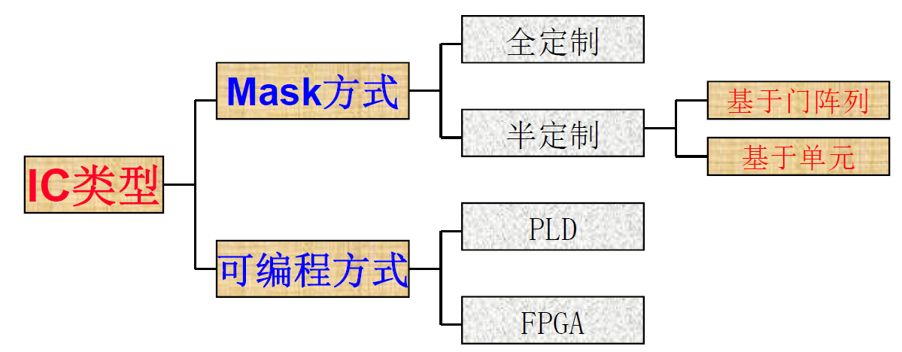
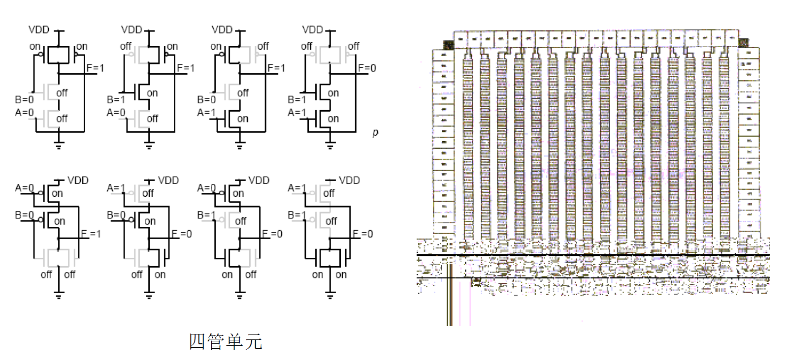
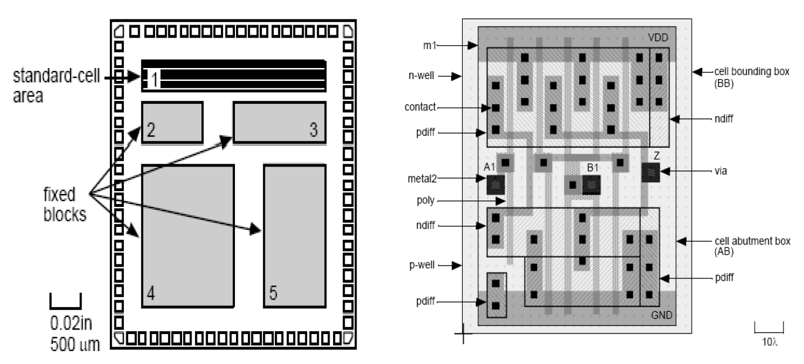

# 数字集成电路设计1【CMOS逻辑】

和模拟集成电路不同，数字集成电路的设计目标是更快地执行数字逻辑，它与工艺的耦合深度并没有模电那么高，更多情况下是在使用CMOS构成的逻辑网络，并研究CMOS门电路整体的电气特性

## 数字集成电路的基本概念

1. 摩尔定律是驱动数字集成电路发展的重要经验规律，而只有**技术突破**才能推动数字电路技术沿摩尔定律方向发展，这里的技术突破包含：

    * 特征尺寸（特征线宽）

        **28nm是传统制程和先进制程的分界点**，28nm以下的电路都是通过基本数字集成电路工艺制造，但随着特征尺寸缩小，短沟道效应加剧，导致需要使用FinFET等先进工艺才能让晶体管尺寸继续缩小

    * 存储器容量

        存储器的容量增大，意味着功耗增大、稳定性下降（功率密度快速提升导致单位面积下发热量巨大）。因此要实现更大容量的突破，需要寻找新技术（如傲腾持久性内存使用的新材料）、新架构（如3D堆叠架构）来让功耗增速变缓

    * 晶圆尺寸

        晶圆尺寸增加，单位硅片数量增加，所需的技术越先进，最终成品芯片价格也越低。同时大直径的硅片可以大大提高成品率

2. ASIC设计方法学

    

    ASIC一般有两种主要实现方式，其一是使用CPLD、FPGA等可编程数字逻辑器件的方式进行部署，依托可重构的特性能够在小批量产品中取得灵活性优势，随着近年来人工智能技术的发展，FPGA被发现很适合用来做专用算法部署，因此近年来应用逐渐从“接口器件”发展成除了CPU、GPU外的另一类具有通用运算功能的数字器件；另一种方式是与通用型IC一样采用集成电路工艺在硅片上制造，适用于大批量生产ASIC，被称为**Mask**方式。传统上使用晶体管级电路设计，所有器件和互联版图全部人工设计的方式被称为**全定制**，目前大部分IDM企业会使用全定制方法生产芯片，优点是集成度高、速度快、功耗低、批量成本低；但需要耗费更多时间进行后端仿真验证，并且对版图设计人员要求更高。为了适应市场需求，目前很多Fab都提供**半定制**的设计方式，这样Fabless企业可以快速推出新的芯片来满足市场迭代。数字IC可以使用半定制方式，但模拟IC一般都是全定制的

    半定制ASIC有两种类型，其一是基于**门阵列**：Fab会提供基础的CMOS逻辑门PDK，甲方使用这套PDK完成布局布线（也就是直接完成门级设计和布局布线，不需要管晶体管级）

    

    另一种是基于**标准单元**（Standard Cell）：Fab为甲方提供一套标准单元PDK，甲方使用该PDK完成布局布线设计。每个标准单元都有自己的作用，设计者像搭积木一样调用并组合成电路

    

3. 数字集成电路全定制流程

    1. 设计描述与功能验证：市场人员和产品人员制定需求，软件工程师根据需求编写软件模型和验证模型

    2. 功能模块划分：采用自顶向下设计模式，架构师根据需求划分各个功能模块

    3. 模块逻辑编写：前端设计者被分配到各个功能模块，使用HDL在行为级或RTL级完成模块的编写和子模块Testbench，并针对模块使用高级语言编写功能验证逻辑

    4. 前仿真：验证工程师编写模块Testbench和全局Testbench并进行布局布线前的功能性仿真（使用Modelsim、Synopsys **VCS**、Cadence NC等EDA工具）

    5. 综合：使用Synopsys **DC**、**ICC**等工具进行HDL综合或使用HLS直接从高级语言得到晶体管级**Verilog网表**，其中需要使用到**SDC**格式的时序、物理约束文件

    6. 综合后仿真：生成网表后，使用VCS等EDA工具对电路进行进一步的功能仿真，确保功能稳定后将晶体管级网表导出进行布局布线

    7. 布局布线：Layout工程师使用Cadence **Virtuoso**、Mentor ICStudio等工具完成晶体管布局、版图设计、布线工作，得到不附带寄生参数的**GDSII**文件

    8. 后验证：Layout工程师使用Mentor **Calibre**分别进行设计规则检查**DRC**、一致性检查**LVS**、寄生参数检查**PEX**等验证工作，导出PEX网表交付给验证工程师

        DRC是检查版图中所有因违反设计规则而引起潜在断路、短路或不良效应的物理验证过程，使用图形运算函数找出版图中违反规则的地方

        LVS是验证版图与电路原理图的电路结构是否一致的过程，将原始电路的Verilog门级或晶体管级网表转换成SPICE网表后与版图中提取出来的电路SPICE网表进行比较来进行验证

        PEX包含寄生电容提取LPE和寄生电阻提取PRE

    9. 后仿真：使用Synopsys **HSpice**（晶体管级验证）、Verilog-XL（门级验证）等工具完成版图后仿真验证工作，如果通过即可将版图交付给Fab厂

    10. 流片：Fab厂要求甲方提供Mentor Calibre、Synopsys HSpice等工具的验证结果，确保可行后进行生产

4. SoC关键技术

    * 软硬件协同设计
    * 系统级验证、测试
    * 深亚微米芯片版图设计
    * 设计平台
    * IP设计和复用
    * 新材料、Chiplet、先进封装等新技术

## CMOS数字集成电路结构基础

CMOS即Complementary MOS，在工艺或器件角度是指一个PMOS作为上管、NMOS作为下管构成的推挽结构，但在数字集成电路角度，**CMOS是由PMOS构成的上拉网络和NMOS构成的下拉网络组合而成的复杂电路**，如下图所示

PUN是只有PMOS的一个网络，PDN是只有NMOS的网络，具体结构展开后可以像下图一样

### CMOS结构的器件基础

根据半导体器件物理的理论，**PMOS上拉、NMOS下拉可以避免阈值电压$V_{th}$偏差**：如果使用NMOS上拉，那么当上管导通时，NMOS共源极的输出端电压Vout与VDD之间总会相差一个Vth
$$
V_{out}=V_{DD}-V_{th}
$$
如果使用PMOS下拉，那么下管导通时，PMOS共漏极的输出端电压Vout与VSS之间也会相差一个Vth
$$
V_{out}=V_{SS}-V_{th}
$$

> 考虑到PMOS具有负的$V_{th}$，输出电压总会比参考地电压高出一个$V_{th}$

PMOS上拉、NMOS下拉可以避免这些问题，让输出电压总是在
$$
V_{DD}-V_{SS}
$$
范围内，也就是*电路能够实现完整的逻辑传递*

CMOS电路还要求**上管和下管不能同时导通**。这很容易理解，如果两管同时盗铜，输出电压就不能为VDD或VSS，整个电路会成为一个分压网络，上管、下管导通电阻$R_{DS(on)}$就变成了分压电阻

### CMOS逻辑门

理解了CMOS的器件基础，下面就是看CMOS怎样才能表达数字逻辑

在数电中，我们知道**NMOS串联可以描述与逻辑**；**NMOS并联可以描述或逻辑**，如下图所示

如果我们将一个NMOS与逻辑放置到CMOS下拉网络，并使用一个能够配合它形成与逻辑的上拉网络，就能够得到一个**CMOS结构与非门**（CMOS输出时必定会带有“非”的逻辑），如下图所示

同理，我们可得到或非门

再看PMOS上拉网络，它和NMOS是对偶的结构：PMOS串联表示与非逻辑；并联表示或非逻辑，如下图所示

于是我们可以得到一个与非门的CMOS实现方法：

在使用CMOS处理数字逻辑时，只需要处理下拉网络的NMOS逻辑连接，再按照对偶规则连接上拉网络PMOS即可。整体设计方法可以简化成3步：

1. **通过布尔代数处理将所需逻辑化成非逻辑**
2. **按照NMOS串联表示“与”，并联表示“或”的方式设计N网络**
3. **根据N串P并、N并P串的对偶关系设计P网络**

> 下面给出一个示例，读者可自行理解
>
> 

### CMOS逻辑对器件尺寸的影响

使用CMOS结构搭建逻辑电路后，还需要确定每个器件应当使用的规格，否则会导致上拉网络和下拉网络输出电流不匹配

一般来说具有下面的规则：

* **n个NMOS串联，晶体管尺寸W/L变为原来的n倍**
* **n个NMOS并联，晶体管尺寸W/L不变**

这样，不需要改变器件特征线宽L，只改变W就可以实现数字逻辑了
