# 数字集成电路设计2【器件特性】

数字集成电路的基础是门电路，而门电路的基础是CMOS，不过在学习CMOS之前，我们要先复习一下半导体工艺和MOSFET的一些基本特性。在数字电路中对二者并不是非常关心，但我们仍然要理解一部分常见特性才能将后续的分析进行下去

## 工艺流程

制造晶体管的基本工艺流程如下：

1. 制备硅衬底：在高纯硅片底层通过离子注入或扩散法制造P+掺杂，并在硅片表层形成P-衬底
2. 氧化、涂胶：在硅片表面氧化出栅极，并旋涂光刻胶来形成N阱
3. 光刻：通过曝光来让部分胶变性成不可溶
4. 显影、烘干：去掉可溶部分的光刻胶，并对曝光后的光刻胶进行进行烘干
5. 蚀刻：使用酸洗去无胶的部分
6. 离子注入/扩散：在裸露出硅的部分进行掺杂入P型或N型离子来改变半导体性质，如果使用离子注入往往要配合退火来修正晶体结构中出现的缺陷
7. 除胶、平坦化：通过除胶剂洗去剩余光刻胶，并对硅表面进行化学机械平坦化等
8. 金属化：使用化学气相沉积等方式在硅表面制造接触孔contact、硅通孔via和金属连接线wire
9. 组合使用上述工艺流程，在硅表面制造CMOS结构

### CMOS制造流程

1. 制备硅衬底

2. 氧化场氧并光刻N阱

    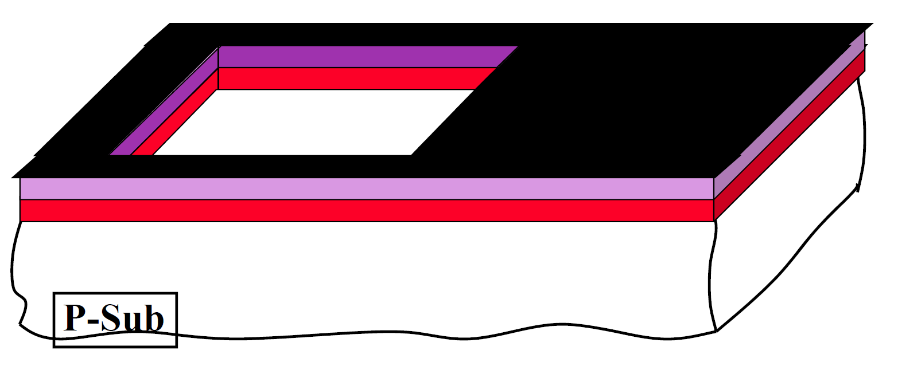

3. 离子注入N阱、退火并清洗

    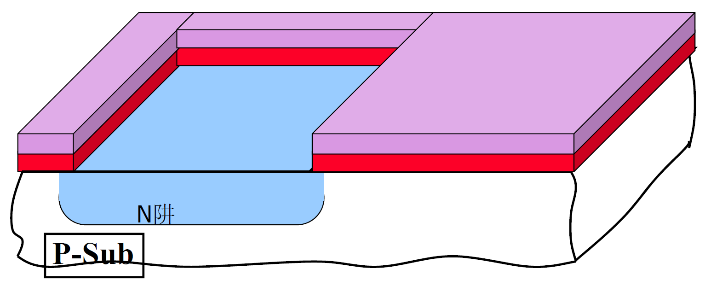

4. 生长薄氧、生长氮化硅保护层并光刻场区（STI工艺）

    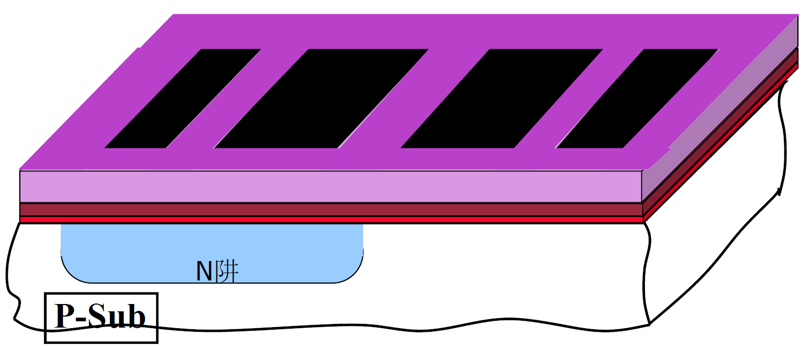

5. 制造场氧（LOCOS工艺）并清洗

    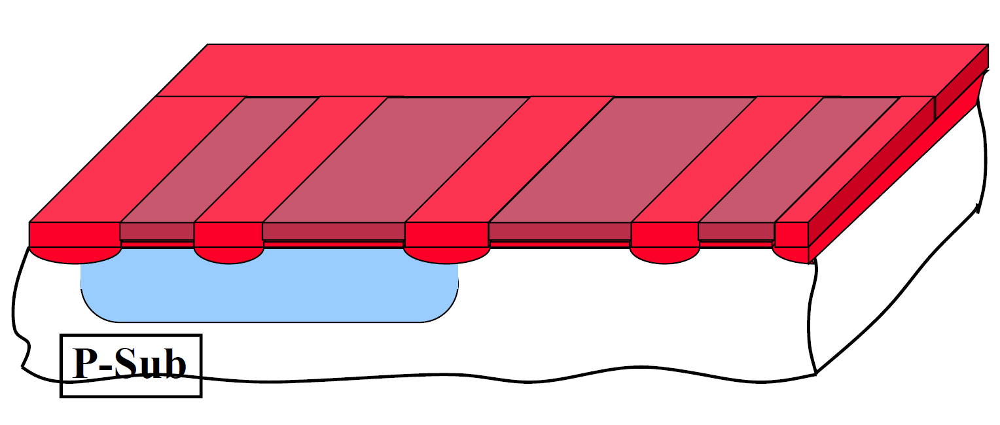

6. 氧化栅氧，在栅氧上淀积多晶硅并掺杂N+/P+，最后反向刻蚀多晶部分

    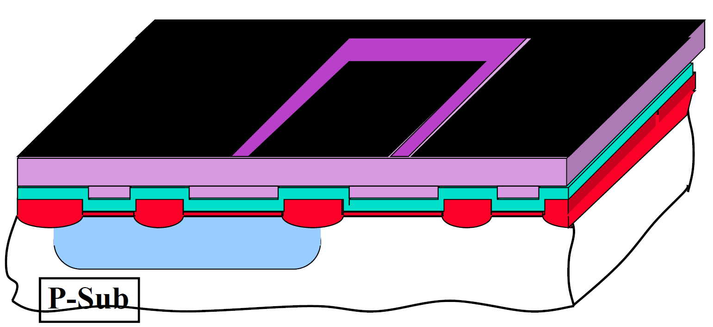

7. 使用硅栅自对准，注入P+区和N+区

    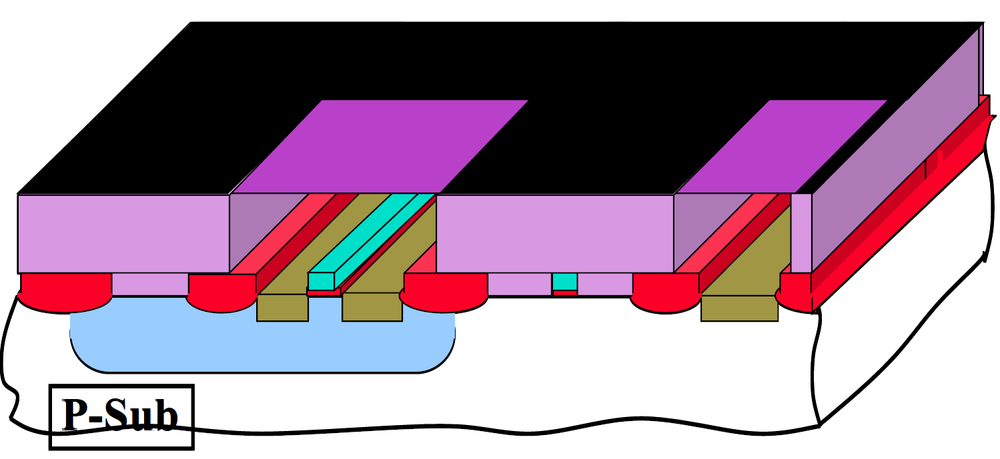

8. 积淀硼磷硅玻璃作为层间绝缘材料，在栅极、源极、漏极上面光刻接触孔（contact），并进行回流

    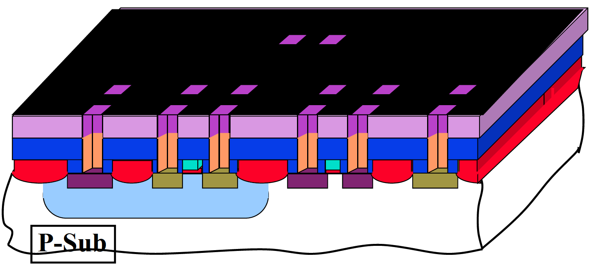

9. 在上层沉积金属层M1，并刻蚀出金属走线

    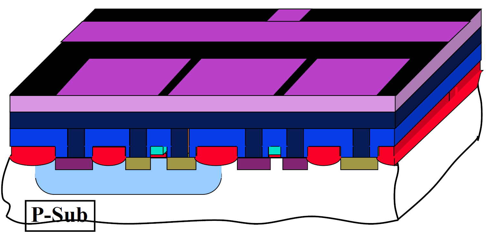

10. 绝缘层固化、化学机械平坦化并刻蚀硅通孔

    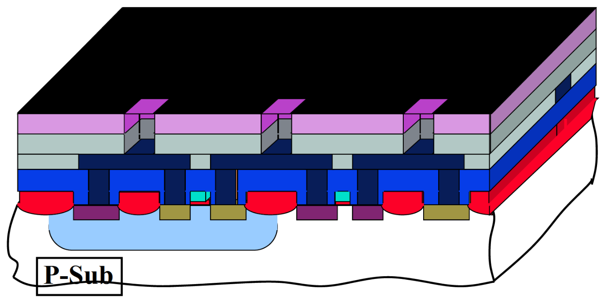

11. 依次制造M2、M3等金属走线层，完成电气连接

12. 积淀钝化层，平坦化后光刻引脚连接（pad）

    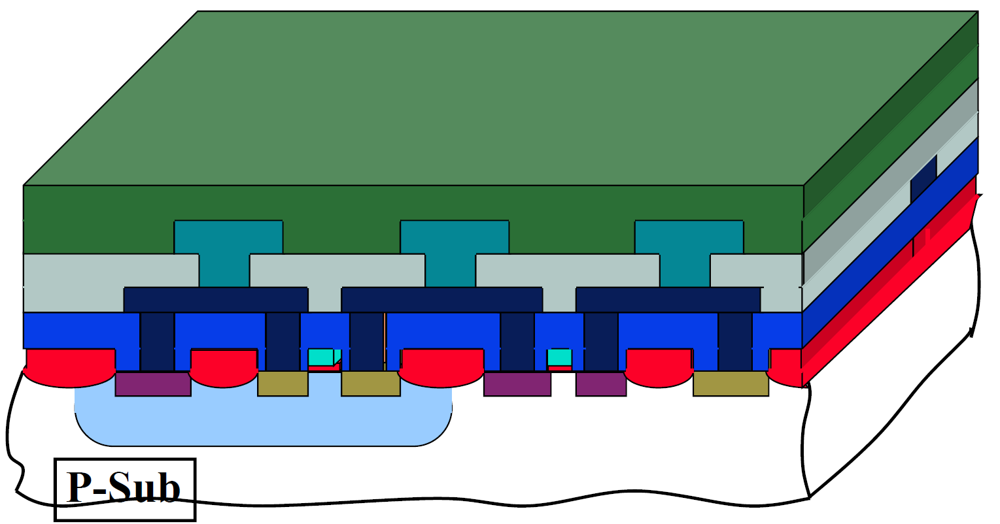

13. 晶圆封装

## MOSFET器件特性复习

在数字集成电路中，我们常常将MOSFET看成开关：对于NMOS，G极高电平导通，S、D极之间相当于一个电阻，G极低电平关断，S、G极可以视为开路；对于PMOS，开关逻辑正好相反，这里的高低电平以$|V_{th}|$作为区分点

### 体效应

不过存在一些特殊情况——MOSFET具有**体效应**（Body Effect），我们在半导体器件中学过体效应会导致阈值电压变化的经验公式
$$
V_{th}=V_{th0}+\gamma (\sqrt{\Phi_s +V_{SB}}-\sqrt{\Phi_S})
$$
其中$V_{SB}$是源-体极电压，$\gamma =\sqrt{\frac{2q\epsilon_{Si} N_A}{C_{ox}}}$是体效应系数

### 沟道长度调制效应

由于$V_{DS}$作用，有效沟道长度会发生变化，理论上饱和区的NMOSFET具有
$$
I_D =\frac{1}{2} \mu_n C_{ox} \frac{W}{L}(V_{GS} -V_{th})^2
$$
但实际上，存在
$$
I_D =\frac{1}{2} \mu_n C_{ox} \frac{W}{L}(V_{GS} -V_{th})^2 (1+\lambda V_{DS})
$$
其中$\lambda$是沟道长度调制因子

这就导致了饱和区下MOSFET的转移特性曲线会向上弯曲

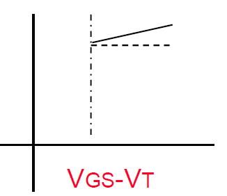

整体电压转移特性曲线（VTC）如下

### 短沟道效应

随着晶体管尺寸缩小，进入亚微米级别，量子效应也越发明显，这些由于沟道长度缩短引起的伴生效应统称为短沟道效应，一个比较普适的结论就是短沟道效应会导致阈值电压$V_{th}$降低。短沟道效应具体表现包括但不限于：

* 速度饱和效应：沟道长度缩短导致电场强度减小，而电子速度与电场强度成线性关系，当电场强度减小到一定程度时，载流子碰撞和散射导致电子速度存在一个饱和值，从而导致$V_{DS(sat)} < V_{OV}=V_{GS}-V_{th}$，即在未达到$V_{OV}$时，MOSFET就出现提前饱和，由于饱和，电压对电流的控制能力会减小

    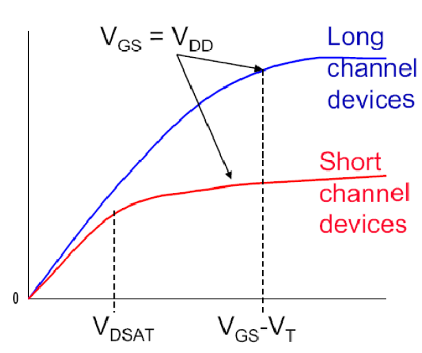

* 亚阈值导通

    在亚阈值下，MOSFET出现部分导通，存在亚阈摆幅来衡量亚阈值中电流每下降十倍时$V_{GS}$需要降低的电压
    $$
    S=nln10 \frac{kT}{q}
    $$
    而此时存在
    $$
    I_D =I_S exp(\frac{qV_{GS}}{nkT})
    $$

* 漏端感应势垒降低（DIBL）

    短沟道下，D极和S极非常接近，相当于降低PN结势垒，导致$V_{th}$降低，同时如果$V_{DS}$足够大，会导致D、S之间击穿短路

* 窄沟道效应：晶体管尺寸缩小带来短沟道的同时，沟道宽度也会减小，这被称为窄沟道效应。与短沟道效应相反，窄沟道效应会导致$V_{th}$升高，因此二者会相互抵消一部分——不过短沟道效应更加明显

### 闩锁效应

MOSFET结构中存在一个寄生可控硅，如下图所示

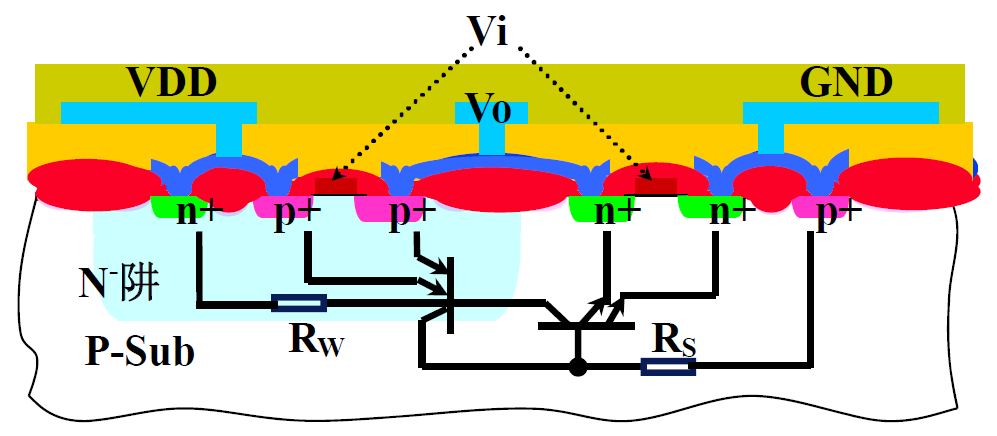

可控硅触发的条件：

* 两个发射结均正偏
* $\beta_{npn}\beta_{pnp}>1$
* $I_{power}>I_H$（出现大电流波动）

一旦触发，会产生巨大电流，导致晶体管被烧毁

## MOSFET结构分析