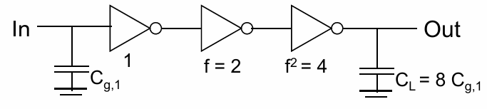

# 数字集成电路设计3【反相器特性】

根据上一章的内容，我们可以将MOS器件的寄生效应应用到实际电路中。在数字集成电路内部最重要的电路就是反相器了，本部分就要结合MOS器件理论推到反相器的电学特性

## 静态特性

对于CMOS结构，我们在第一节已经了解到它的独特优势，事实上可以如下总结：

1. **全电压摆幅带来高噪声容限**

    输出逻辑电平与器件尺寸无关，从而能够让晶体管以更小尺寸工作

2. **稳态下，输出端总是有到电源或地的通道带来低输出电阻**

    输出电阻越低，同样功率的电源能够提供的输出电流越大，电路能够承受的扇出（fan-out）越大

3. **近乎无穷大的输入电阻带来几乎为0的出入电流**

4. **稳态下电源到地之间没有通道带来趋近0的静态电流**

5. **传输延迟与负载电容和自身电阻有关带来计算的延迟时间**

不过，这些优势都建立在理想条件下；实际情况中，反相器的电气特性是我们需要确定的

### CMOS反相器的VTC曲线

使用图解法，将PMOS和NMOS的电气特性曲线放在同一张图中，连接其交点，就可以找出二者图腾柱连接得到反相器电路的电气特性曲线了，如下图所示

其中黄色曲线是PMOS，绿色曲线是NMOS。只需要找出它们栅电压相同的点（反相器电路的输入端同时连接到PMOS的G极和PMOS的G极）也就是Vin，连接起来就可以获得CMOS反相器的曲线，如下图所示

这就是**CMOS反相器电压传输特性曲线**

我们可以将其分成五个阶段，如下所示

总是存在输出低电平$V_{OL}$、输出高电平$V_{OH}$、输入低电平$V_{IL}$、输入高电平$V_{IH}$，当输入为$V_{IL}$时，输出$V_{OH}$；输入$V_{IH}$时，输出$V_{OL}$。**这四个参量是需要我们人为定义的**

> 数字电路需要逻辑门互相连接，而逻辑门总是用CMOS复杂门电路实现的，CMOS复杂门电路又可以被抽象成反相器的组合，于是发现研究数字电路的连接可以简化成研究反相器的互相连接。

在反相器互联时，可以观察到前一级反相器输出的范围是$V_{OH}$到$V_{DD}$描述为高电平，$GND$到$V_{OL}$描述为低电平；那么后一级反相器也需要设置$V_{IH}$到$V_{DD}$为高电平，设置$GND$到$V_{IL}$为低电平。这样就需要满足下图中的关系——后一级反相器必须为输入电压留出一个**噪声容限**（Noise Margin）

噪声容限定义为
$$
NM_L=V_{IL}-V_{OL},NM_H=V_{OH}-V_{IH}
$$
在电路设计中，我们希望噪声容限更大。这便是我们要人为定义（设计）这四个参数的原因

### 噪声容限、工艺角

我们可以通过两种方式增大噪声容限：

1. 保障VTC曲线对称：**让曲线中点VM处的翻转阈值$V_{in}=\frac{V_{DD}}{2}$**

    在翻转阈值处，两管都工作在饱和区，因此有条件
    $$
    \beta_p=\beta_n=\mu_n C_{ox} \frac{W}{L}
    $$
    当材料条件相同时，两管的尺寸关系$\frac{W}{L}$就决定了VTC曲线是否对称。对于设计者来说，我们能够改变的也只有两管的尺寸关系——$\mu_n C_{ox}$是搞材料的人关心的，以后的所有推导也都会将它当成常数

    > 一个形象的表述就是：当PMOS和NMOS导通能力相同时，曲线翻转阈值自然就等于$\frac{V_{DD}}{2}$

    由于尺寸关系
    $$
    (\frac{W}{L})_p/(\frac{W}{L})_n =\mu_n / \mu_p
    $$
    可以发现尺寸关系和载流子迁移率有关。根据半导体物理知识，PMOS基于空穴导电，NMOS基于电子导电，而电子迁移率是空穴迁移率的2到3倍，因此**我们只要保障PMOS和NMOS的尺寸之比在2到3即可让VTC曲线对称了**

    > **一般取尺寸比P:N=2:1**

    考虑寄生效应，那么有
    $$
    V_M\approx r \frac{V_{DD}}{1+r}
    $$
    其中$r=\frac{\mu_{nn} C_{oxn} V_{D(sat)n}}{\mu_{np} C_{oxp} V_{D(sat)p}}$，也就是与PMOS和NMOS驱动强度之比有关。一般要求$r\approx 1$

    得到关心的器件尺寸为
    $$
    \frac{(W/L)_p}{(W/L)_n}=\frac{k_n V_{D(sat)n} (V_M -V_{THn} -\frac{V_{D(sat)n}}{2})}{k_p V_{D(sat)p} (V_M -V_{THp} -\frac{V_{D(sat)p}}{2})}
    $$
    在制造中，由于PMOS和NMOS的制造可能出现尺寸差别，会出现不同的**工艺角**（Process Corner），如下图所示，*工艺角会导致翻转阈值发生偏移*

    

    **如果NMOS尺寸比设计尺寸变大，那么其导通能力变强，会让输出端更容易被下拉，这就导致翻转阈值变低，VTC曲线左移；如果PMOS尺寸变大，那么输出端更容易被上拉，导致翻转阈值变高，VTC曲线右移。**这里设计尺寸指的是W/L参数

    > CMOS电路的翻转阈值可以被形象的理解成NMOS下拉能力和PMOS上拉能力对抗的结果，如果PMOS的上拉能力强，那么需要更高的输入电压来让输出为低；如果NMOS的下拉能力强，那么需要更低的输入电压来让输出为高

    实际生产中，**将导通能力强的MOS状态称为Good；导通能力弱的MOS状态称为Bad**。我们就会对应不同NMOS、PMOS、Good、Bad的组合出现四种情况SS、SF、FS、FF

    一般厂家会提供四种情况+典型情况TT，设计时要以TT为基准，但在其他四个工艺角情况下进行仿真，所有仿真都通过才能保障芯片流片成功

2. 增大反相器增益G

    反相器的增益对应MOSFET饱和区斜率。
    $$
    g\approx \frac{1+r}{V_M -V_{TH}-\frac{V_{D(sat)}}{2}(\lambda_n -\lambda_p)}
    $$
    这个斜率主要由工艺参数决定，但**设计者可以通过供电电压和$V_M$来影响g值**

    降低电源电压$V_{DD}$可以增大g，让曲线变得陡峭一些。但电源电压降低会导致电路延迟增大、直流特性受影响大、抗外部噪声干扰能力降低

## 动态特性

CMOS反相器的静态特性本质上就是对其VTC曲线的考量；而对于动态特性，我们关心反相器的**开关时间**：反相器模型如下图所示，其负载通常是其他反相器或相似的CMOS逻辑，因此可以被描述为一个负载电容$C_L$，当PMOS导通时，后级电容充电；NMOS导通，后级电容放电

因此对于这个一阶电路模型，存在一个时间常数$\tau=R_{nmos/pmos}C_L$，对应的系统响应也就会出现缓升和缓降**信号斜率**（Signal Slopes），如下图所示，上升沿斜率记为$t_r$，下降沿斜率记为$t_f$

我们将上升沿和下降沿的中点对应时刻视为翻转时刻，能发现输入输出信号之间存在一个**传递延迟**，上升沿对应高电平延迟记为$t_{pHL}$，下降沿对应低电平延迟记为$t_{pLH}$

对于实际电路，我们往往关注反相器链中高低电平传输的**平均延迟**（**Propagation Delay**），用下式可描述
$$
t_p=\frac{t_{pHL}+t_{pLH}}{2}
$$
也就是高电平和低电平延迟取平均

### 反相器的负载电容

数字电路中，我们一般使用多级CMOS逻辑复杂门构成组合逻辑，而这种多级电路的简化形式就是由多级反相器串联构成的**反相器链**。

反相器链中负载电容由下列两个主要部分构成：

* 负载端电容贡献的**负载电容**
    * $C_L$：输出端连线的杂散电容等**负载电容**
    * $C_g$：作为负载的反相器的**栅电容**
* 驱动端电容贡献的**本征电容**
    * $C_{D}$：NMOS和PMOS两个有源区和衬底之间的寄生电容，称为**有源区电容**
    * $C_{gd}$：由于栅极和有源区必然存在的交叠（由工艺原因引起）而形成的交叠电容，称为**栅电容**

其中$C_g$、$C_D$、$C_{gd}$都与MOS的栅极宽度W成正比，属于寄生参数。简图如下

其中交叠电容$C_{gd}$就是引起MOS管开关时出现米勒平台的原因，因此也被称为**米勒电容**

> 米勒平台就是MOS在导通时，需要对栅电容充电，但当栅电容完成充电后，还存在交叠电容使得栅极电压无法继续上升，需要将交叠电容充满电后才能达到饱和区这样一个过程。从GS电压来看，就像是上升沿中间出现了一个平台
>
> 从微观层面看，在MOSFET开关过程中，当DS电压将快速变化，此时交叠电容的位移电流会被放大，等效于在栅极回路中引入一个更大的等效电容，而该电容的充电电流需要由驱动电路提供，导致栅极电压停止上升，形成米勒平台

特别地，**由于米勒效应，米勒电容可以通过变换在输出端等等效成两倍的电容$C_{gd}$**，如下图所示

而$C_{D}$是由有源区和衬底形成的寄生二极管带来的，因此被称为**结电容**

在芯片中，常常存在大量的互联，这就带来了不可忽略的导线寄生杂散电容$C_W=C_L$，也被称为线电容或互联电容。它们只有在连线较短的情况下可忽略

作为负载的反相器栅极存在寄生电容$C_{g}$，它们被称为**外部电容**

从外部电容和本征电容的角度看，平均延迟可以描述为：
$$
t_p=0.69 R_{eq}C_{int} +0.69 R_{eq}C_{ext}=0.69R_{eq}C_{int}(1+\frac{C_{ext}}{C_{int}})=t_{p0}(1+\frac{C_{ext}}{C_{int}})
$$
其中$t_{p0}=0.69 R_{eq}C_{int}$被称为**本征延迟**（unloaded）

我们假设管子都变大到原来的K倍，存在$R_{eq}=R_{ref}/K$和$C_{int}=KC_{intref}$，于是有$t_{p0}=0.69 R_{eq}C_{int}$保持不变，同时$t_p=t_{p0}(1+\frac{C_{ext}}{KC_{int}})$

我们可以发现本征延迟与MOS尺寸无关，只与版图、工艺有关，可以说*反相器的极限延迟就是本征延迟，通过将管子变得非常大，就可以让平均延迟接近本征延迟，但显然会让片上面积大大增加*。下图中给出了一个仿真实例，其中S表示管子相对原始值的尺寸放大倍数（等于上文中的K）

### 单级反相器最优

根据电路原理的知识，一阶RC网络中存在：
$$
V_o(t)=(1-exp(-\frac{t}{\tau}))V_i(t)
$$
其中$\tau=RC$，于是存在50%输出点为$t=ln2 \tau=0.69\tau$，90%输出点为$t=ln9 \tau=2.2\tau$

代入n管/p管等效电阻$R_{eqn/eqp}$和负载电容$C_L$，我们可以得到
$$
t_p=0.69\frac{R_{eqp}+R_{eqn}}{2}
$$
对于单管而言（以NMOS为例），存在
$$
t_{pHL}=0.69 * (\frac{3}{4} \frac{C_L V_{DD}}{I_{D(sat)n}}) \approx 0.52 \frac{C_L}{\mu_n C_{ox} \frac{W}{L} V_{D(sat)n}}
$$
可以发现下面几种方式可以提高单级反相器的开关速率：

* **减小$C_{L}$**

    减小有源区电容、线电容、扇出等

* **增加宽长比$W/L$**

    提高工艺水平，将MOS特征线宽做小、等效宽度做大。即管子越大越好

* **增加电源电压$V_{DD}$**

    需要注意：$V_{DD}$增大到一定值后回报会减小（边际收益递减），而且在追求低功耗的设计中是不可能允许提高电压的，同时可能会带来可靠性问题

### 单级反相器最优条件

不考虑VTC对称性、噪声容限的情况下，我们可以通过对平均延时求偏导的方式优化它：
$$
\frac{\partial t_p}{\partial \beta}=0,\beta = \frac{(\frac{W}{L})_p}{(\frac{W}{L})_n}
$$
计算得到忽略连线时，存在
$$
\beta_{opt}=\sqrt{r}
$$
其中r就是MOS具有相同尺寸时P管和N管的电阻之比，即
$$
r=\frac{R_{eqp}}{R_{eqn}}
$$
在0.25um工艺下，约为1.56。考虑片上面积和噪声容限（VTC曲线），我们**选择$\beta=2$时综合性能最好**，这也是我们在计算中常常取2的原因之一

> P:N=2

同时增大P和N，在最开始时候收益大，后段收益就小了

基于上述内容，我们可以确定：当单级反相器驱动负载（一个或多个，可以$C_L$替代）时，存在**PMOS与NMOS长宽比之比为2左右时达到平均最快值**，即
$$
\frac{PMOS}{NMOS}=\frac{\frac{W_{P}}{L_{P}}}{\frac{W_{N}}{L_{N}}}=2
$$
当且仅当PMOS和NMOS具有相同特征线宽L时，最快的反相器版图应当使用2：1宽度W排列，这与前文中具有最优噪声容限的反相器电路设计的结果是相同的。

### 多级反相器链最优

在多级反相器链的优化中，我们主要关心**反相器链有多少级**，以及**每一级有多大时延迟最低**的问题

强调一下：本征电容$C_{int}$=有源区电容+米勒电容；外部电容$C_{ext}$=线电容+扇出栅极电容

可以发现本征电容、外部电容都和MOSFET尺寸W成线性关系，那么我们假设外部电容和本征电容之间存在一个关系：
$$
C_{int}=\gamma C_{ext}
$$
其中当且仅当忽略线电容的情况下，存在$C_{int}=\gamma C_{g}$。代入之前推导出的平均延迟和本征延迟关系公式，我们就可以得到
$$
t_p=t_{p0}(1+\frac{f}{\gamma})
$$
发现延迟与f有关，其中$f=\frac{C_{ext}}{C_g}$，称为**扇出**（fan-out）

当$\gamma=1$时，存在$f=\frac{C_{g2}}{C_{g1}}$，也就是*反相器输出端连接的栅极电容和本身栅极电容之比*

基于上述原理，考虑如下图所示的**N级反相器链**场景

该电路中每一级反相器的延迟为
$$
t_{p,j}=t_{p0}(1+\frac{C_{g,j+1}}{\gamma C_{g,j}})=t_{p0}(1+\frac{f_{j}}{\gamma})
$$
上式将延迟公式代入当前场景，因此我们可以得到该电路的总延迟
$$
t_{p}=\sum t_{p,j} = t_{p0}\sum (1+\frac{f_{j}}{\gamma}) = t_{p0}\sum (1+\frac{C_{g,j+1}}{\gamma C_{g,j}})
$$
为了获得最优的延迟时间，每级的尺寸（与电容成比例）都应该是前后级尺寸的几何平均值：
$$
\frac{C_{g,j+1}}{C_{g,j}}=\frac{C_{g,j}}{C_{g,j-1}} \leftrightarrow C_{g,j}=\sqrt{C_{g,j-1} C_{g,j+1}}
$$
此时
$$
f=(\frac{C_L}{C_{g,1}})^{\frac{1}{N}}
$$
也就是反相器链的最小延迟为
$$
t_p=N t_{p0}(1+\frac{F^{\frac{1}{N}}}{\gamma})
$$
其中$F=\frac{C_L}{C_{g,1}}$即输出负载电容与第一级反相器自身的栅极电容之比，表示**总扇出**

说明**等比例放大，反相器链达到最快**

> 但是每级扇出应该等于多少（f）才能获得最优值？要有多少级反相器（N）才能达到最优值？
>
> 会发现如果级数太多，本征延迟会占主导；如果级数太少，每级的输出延迟会占主导。针对这个优化问题，可以方程两边对$t_p$求导，得到$f=exp(1+\frac{\gamma}{f})$
>
> 求解上式的极值点，获得一个最合理的取值

对于一个三级的反相器链，如下图

给出$F=\frac{C_L}{C_{g,1}}=8$，因此取每级之间的扇出比例为$f=8^{\frac{1}{3}}=2$，就得到图上的例子。

**通常取f=4，并按照等比例放大的方式求得最优级数**

一般宁可让f>4也不要f<4，因为f大了，虽然每级延迟增大，但级数会变少，延迟增加得不明显；但f过小，级数增多，延迟会明显增大

很多时候会**用FO4来代表f=4的情况**，对于FO5、FO6等称呼也是同理。*大部分工艺都采用FO4*

如果题目中给出了输出端的负载电容$C_L=AC_{g1}$，已知有N级反相器，要求每一级的最合理f，如果每一级反相器都有相等的大小，那么可以使用$f_1=f_2=\cdots = f_n=A^{\frac{1}{N}}$来求每一级的f；但**如果每一级反相器的扇出都不均等，就只能使用根本公式$f_1=f_2=\cdots = f_n$，并依次列出每一级的扇出来计算了**

根据上述内容，给出如下图所示的计算实例（假设γ=1）

## 非理想情况下的动态特性

### 输入信号斜率影响

实际情况下，输入信号具有斜率，这对电容充放电速度造成影响。一般来说，可以用下面的公式概括扇出和前级驱动强度共同作用下的门延迟
$$
t_p=t_{step (i)}+\eta t_{step (i-1)}
$$
其中$\eta \approx 0.25$

电路设计中使沿的上升时间小于门延迟是非常有益的，但不需要过分追求信号陡峭，因为过于陡峭的边沿会导致芯片的动态功耗不稳定

> 回顾分布参数电路相关知识，信号的带宽取决于边沿（尤其是上升沿），因此边沿适宜有助于降低对传输线、CMOS逻辑复杂门等关键点的带宽要求，从而降低对电源完整性的要求，即稳定动态功耗

### 线延迟影响

对于非集总参数电路，与集总参数电路对照如下

可以发现分布RC电路的阶跃响应时间常数总比同电压下的时间常数小

### 动态功耗分析

芯片的功耗定义为
$$
P(t)=I(t)V(t)
$$
而对于电容器件，存在能量公式
$$
E_C=C\int_{0}^{V_{DD}}V(t)dV=\frac{1}{2} CV^2_{DD}
$$
电源为芯片中电容提供能量其中的一半都变成热耗散掉，针对芯片中存在由**漏电功耗**和**直流功耗**组成的静态功耗和由**开关功耗**和**短路功耗**组成的动态功耗，其中动态开关功耗的表达式如下
$$
P_{switching}=CV_{DD}^2 f_{sw}
$$
即开关功耗和开关管负载电容、电源电压、开关频率有关
