# 数字集成电路设计4【静态CMOS特性】

## 进一步理解标准CMOS复杂门

在电路中，我们通常并行地使用多个MOS管来实现等效电阻变换，如下图所示

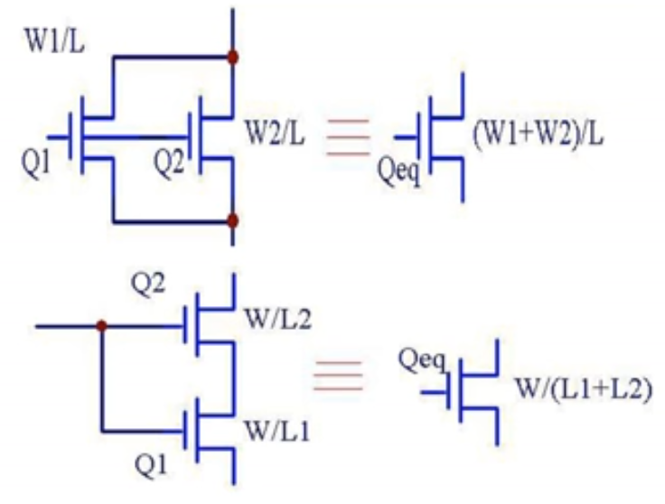

可以发现两管并联的等效电导等于二者电导相加；两管串联的等效电阻等于二者电阻相加。于是有下面的规律：**并联电导相加，串联电阻相加**

这和最开始我们讨论的MOS串并联是不一样的

> * n个NMOS串联，晶体管尺寸W/L变为原来的n倍
> * n个NMOS并联，晶体管尺寸W/L不变
>
> 这个规则是针对P网络/N网络中的MOS串并联而言，这里我们是在说多个MOS输入端和输出端都对应连接，从而合并成一个等效的大管子

利用这个性质，我们可以对某些网络进行简化，或是对版图进行优化

### VTC曲线

标准CMOS复杂门的VTC曲线和反相器类似，但会受到*体效应*影响

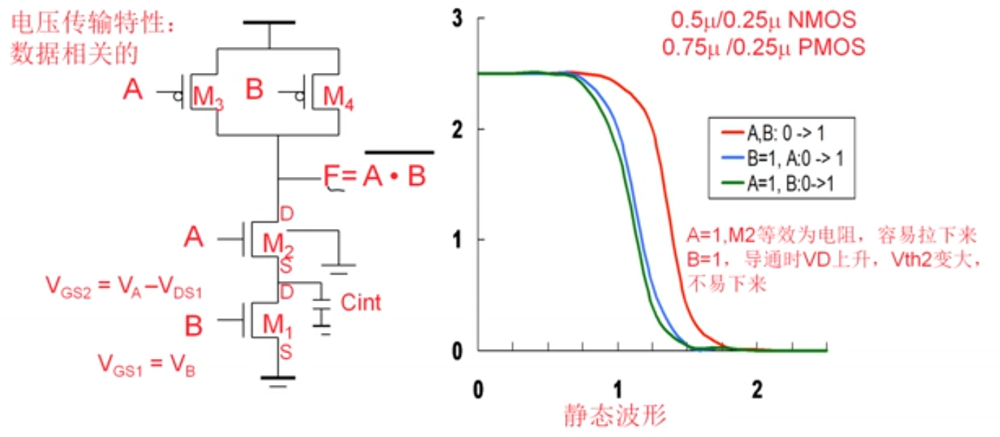

如上图当A、B同时从0到1时，电路的下拉能力最强，需要更高的输入电压来让输出为0；而受到体效应影响，当A或B管有一个为1时，对应管子的阈值电压会升高，导致电路的下拉能力下降；其中当B管为1时，A管受到体效应影响不那么严重，阈值电压稍低，因此电路更不容易被下拉

### 延迟

CMOS复杂门的延迟计算可以使用**erlmore延迟**公式计算。一般只需要看N网络的延迟即可
$$
t_{pHL}=0.69 R_{eqn} (C_1+2C_2+3C_3+\cdots+kC_k+\cdots+nC_L
$$
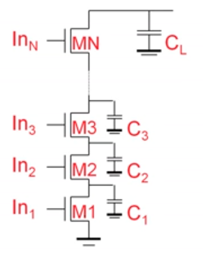

为了和扇出对应，我们用**扇入（fan-in）描述CMOS复杂门输入端的个数**

可以发现扇入越多，上面公式中的n数目越大，导致输出延迟越大。**在实际使用中应当尽量避免高于4的扇入**。如果遇到很多扇入的情况，我们应当对其分级处理

从上面公式中还能发现，越远离输出端的MOS对延迟的影响越大，理论上可以将远离输出端的MOS做小来提高速度，但实际上并不实用，因为在版图上难以实现有源区共用

晶体管顺序对延迟也有影响：**如果晚到的信号靠近输出端，就可以减小延迟**

## 逻辑能力

对于简单的反相器链，我们使用上一节提过的优化方法就可以得到最优延迟了。

> 反相器链最优：$f_1=f_2=\cdots =f_n=\hat{f}^{\frac{1}{N}}$

但对于标准CMOS复杂门，我们需要将这套理论进行推广，这就是**逻辑能力**（Logic Effort）算法。由于CMOS复杂门能够等效成反相器的组合，因此逻辑努力和反相器链最优是等价的

> 逻辑能力，顾名思义就是逻辑的延迟能力。至于这个逻辑是什么意思，我们往下看

一般情况下，CMOS复杂门的延迟表示为
$$
D_i=t_{p0}(p+g_i f_i) \rightarrow d=p+gh
$$
其中p、g都是线性相关系数，其中p本质上和反相器链的本征延迟对应；h表示扇出，和反相器扇出f是类似的。通过上式，就可以把反相器链形式的延迟通过线性变换映射到CMOS复杂门上。我们将D称为**归一化延迟**

我们将**p**描述为CMOS复杂门空载时的**寄生延迟**，它描述了*器件本身的延迟*；**h**称为**电学能力**（Electrical Effort），即$h=\frac{C_{out}}{C_{in}}$，它表征了CMOS*逻辑门电气连接对延迟的影响*；**g**就是我们最关心的**逻辑能力**（Logic Effort），它和逻辑门的类型有关系，代表了*逻辑类型对延迟的影响*

### 逻辑能力

**逻辑能力**：一个门电路输入电容和同样导通能力情况下的反相器输入电容之比

在特征线宽L一定的情况下，输入电容（栅电容）正比于沟道宽度W，因此逻辑能力和W存在关系。导通能力相同也就是说时间常数RC相等，一般来说R都是相等的，这时候就要看栅电容C了，因此我们就可以把导通能力和W连接起来，导通能力之比就等于W之比

如下图所示，我们有一个P:N=2的反相器，其输入电容就是3

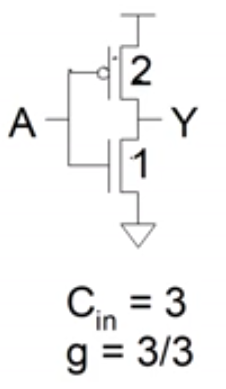

与他等效的逻辑门是非门，因此就能计算出g=3/3=1

我们如果要求一个与非门的逻辑能力，首先看到下面的电路

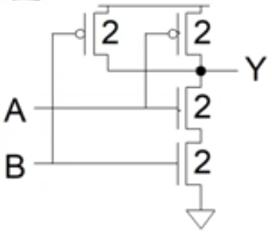

要让它和一个反相器有相同的导通能力——知道串n个管时W/L翻n倍，那么就得到该电路的P:N=1:2，那么就有对应的反相器大小为1/2，其栅电容就是1+2=3；回到与非门电路，这里很显然A和B端的输入电容都是2+2=4，就可以知道g=4/3了

根据上面的理论，就可以推导出常见门电路的逻辑能力如下：

* 非门NOT/INV：等于反相器，$g=1$
* 与非门NAND：$g=(n+2)/3$
* 或非门NOR：$g=(2n+1)/3$

其中*n代表n输入的逻辑门*

### 寄生延迟

**寄生延迟**：一个门电路输出电容和同样导通能力情况下的反相器输出电容之比

寄生延迟实际上就是把逻辑能力中的输入电容换成输出电容，从而以比值的形式描述MOS管本身器件特性带来的延迟

我们可以用d=p+gh来描述FO4反相器链的延迟：逻辑能力g=1（反相器的逻辑能力恒为1），电学能力h=4（等于扇出），寄生延迟p=1，于是有d=1+1*4=5。如果要量化描述延迟时间，只需要用$t_{abs}=5t_{p0}$计算即可，其中$t_{p0}$是与工艺有关的参数

### 逻辑能力最优

回到最开始的目标，给出一个由CMOS复杂门构成的组合逻辑路径，每级扇出多少是最优的？F又应该是多少？

观察反相器链，有d=1+f，其中p=1，g=1：它在$f_i=f_{i+1}=f_k=F^{\frac{1}{N}}$时最优。我们可以推测对于CMOS复杂门组合逻辑路径，有d=p+gh，在$f_ig_i=f_{i+1}g_{i+1}=f_kg_k=(GH)^{\frac{1}{N}}$时最优

事实就是如此，我们利用线性关系优化可以得到严谨的结果，这里不再讨论

于是存在CMOS复杂门组合逻辑最优
$$
F=GH
$$
其中F为路径的最优扇出，G为路径逻辑能力，H为路径总扇出（路径电学能力）

当且仅当
$$
g_ih_i=\hat{f_i}=F^{\frac{1}{N}}
$$
时，取得最优速率

有些情况下，会存在很多路扇出的多输入单输出逻辑门电路，这就会导致计算H时出现系数，出现
$$
F\neq GH
$$
的情况，这时候我们需要引入一个系数B来让
$$
F=GBH
$$
从而使方程普遍适用于各种关键路径

这个B被称为**分支能力**（Branching Effort），描述了逻辑门电路分支数对总扇出的贡献。分支能力定义为：对于某条关键路径的某级，本级中所有逻辑门扇出与关键路径上的那个逻辑门扇出之比。实际上在顺序计算中我们可以将B参数内含在H中，直接按照计算H的通用方法约掉未知参数，最后把系数提出来作为B

>可以用下面的方法快速判断每级的分支能力：
>
>有分支时，B就等于分支的数目
>
>没有分支时，B=1

### 延迟优化算法

目前得到了两种算法能求得每级逻辑门的最优尺寸：

1. 先用$F=GBH$求得总扇出，再用$\hat{f}=F^{\frac{1}{N}}$求出每级最优扇出，最后从第一级开始依次算出每级最优尺寸
2. 使用$g_i h_i=g_k h_k=\cdots =g_n h_n$依次推导出最优尺寸

计算最优尺寸x时，总使用$g_i h_i=\hat{f_i}$公式，g、h中一定是包含未知数x的，解方程就可以得到这个最优尺寸

计算最优级数时，使用$N=log_4 F$即可

还可以用公式$D=P+NF^{\frac{1}{N}}$求出关键路径上的N级电路总延迟

计算最优P、N大小时，要使用基本反相器大小P:N=2:1，根据逻辑门的类型来计算逻辑门的PN比，代入最优尺寸x，使得$P+N=x$且$P:N=\hat{P:N}$

> 这个算法实际上是$g_i h_i = \hat{f_i}$的变形：对于单级逻辑门，已经得到了$g_i和\hat{f_i}$，又根据$h_i=\frac{C_{out_i}}{C_{in_i}}$，就可以得到公式$C_{in_i}=\frac{g_i C_{out_i}}{\hat{f_i}}$

计算的最后，可以根据FO4=5来换算关键路径总延迟D，即$D=\lambda FO4$，这个$\lambda$就是用计算出的总延迟除以5得到的值

## 标准CMOS逻辑改进

标准CMOS逻辑依赖于P网络，从P:N=2:1这个最优比来看P网络是非常消耗片上面积的，同时随着工艺优化，P网络的大小也需要更快的下降才能跟上N网络的需求。因此我们尝试从消除P网络的角度来改进标准CMOS逻辑

### 有比逻辑

最简单的方案就是将P网络用电阻取代。我们在板级设计中常见电阻+BJT/MOS的方案实现非门，但对于片上设计，这种方案会导致上拉速度变慢，因为需要比PMOS等效电阻更大的电阻才能实现上拉，同时还要求这个上拉电阻要足够小，使得输出1时，电阻在输出端的分压接近于0，这样才能让输出电平接近VDD；最难顶的情况莫过于实现这样一个电阻在集成电路工艺中非常困难

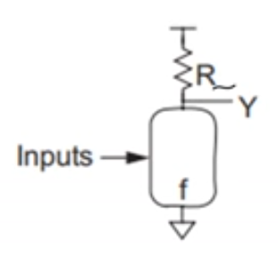

> 在上世纪七八十年代没有CMOS工艺的岁月里，工程师们会使用模集中的技巧，基于NMOS的二极管连接，使用耗尽型NMOS来将MOSFET作为上拉电阻使用，如下图所示
>
> 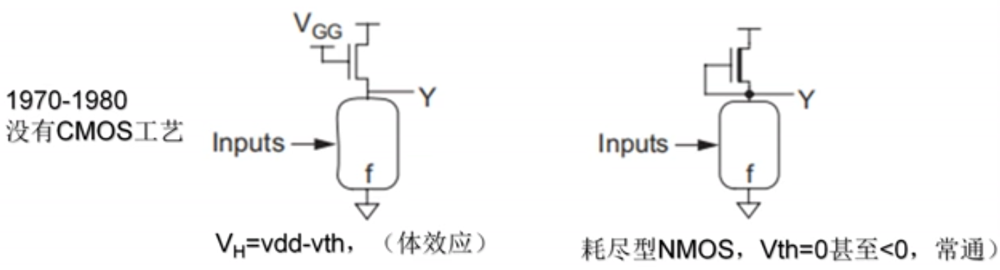
>
> 使用一般的NMOS有一个弊端：因为体效应，会导致VDD和输出端之间存在一个压差$V_H=V_{DD}-V_{th}$；使用耗尽型NMOS，则可以让阈值电压够小

### 伪NMOS

由于电阻和耗尽型NMOS都不容易集成在硅片上，因此出现了**伪PMOS**工艺（pseudo NMOS），采用CMOS工艺，但可以减少PMOS的使用

使用一个P管作为上拉电阻，其栅极接地，使其常通；下拉网络采用N网络实现逻辑，如下图所示

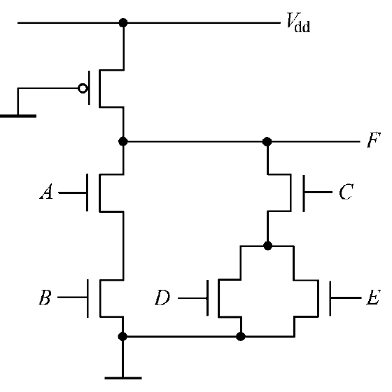

只需要k+1个MOSFET即可实现原来2k个MOS才能实现的逻辑；而输入电容是一般CMOS电路的一半；但是会存在直流静态功耗（CMOS工艺没有），在后续工艺进步、集成MOS数量多起来以后就淘汰掉了；同时这个电路是**有比逻辑**

> **有比逻辑/有比电路**：电路功能与MOS管尺寸有直接关系，要针对功能使用合适的MOS尺寸
>
> **无比逻辑/无比电路**：电路功能和管子尺寸没有直接关系

设计者需要仔细设计NMOS网络的大小，才能让输出能够下拉到地。随着逻辑的复杂，MOS数量增多，会导致静态功耗增大到不能接受的程度

### 传输管

使用NMOS/PMOS作为**传输管**（PT，Pass Transistor）而不是开关管，如下图所示

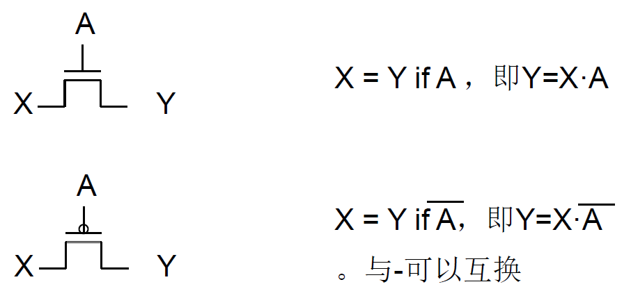

使用传输管可以如下图所示应用于逻辑门电路

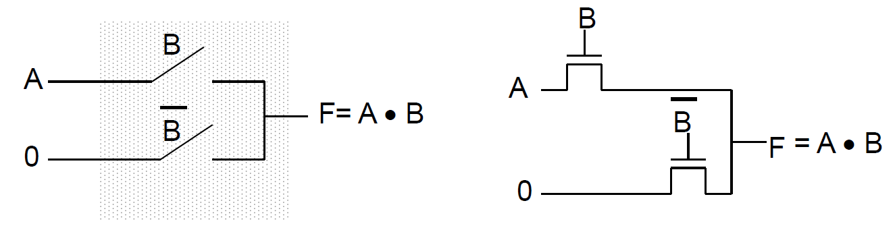

传输管的栅极和源极都可以接入信号，但需要注意：**NMOS传输管会传输强0和弱1；PMOS传输管会传输强1和弱0**，如果后续的电路中会出现对信号强度的要求，应该避免使用传输管

在实际使用时，需要加入**保护支**路，如下图所示，当B=0时，输出为0，防止输出端悬空的情况

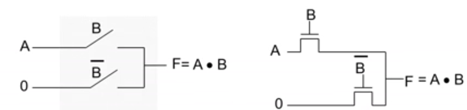

传输管具有如下优势：

* 静态电路
* 使用k个传输管来代替k个开关管实现相同的逻辑
* 无静态功耗
* 无比电路
* 可双向传输信号

有如下劣势：

* 传输信号不能再生，没有放大功能，因此经过传输管的信号会逐级减弱

    可以使用反相器对传输门控制的信号进行再生

* N管传输高电平或P管传输低电平时，会由于体效应而出现阈值电压损失，导致传输的信号总是有强弱区别

传输管逻辑可以用于高性能电路，采用差分的传输管可以实现可重构的电路（CPLD）

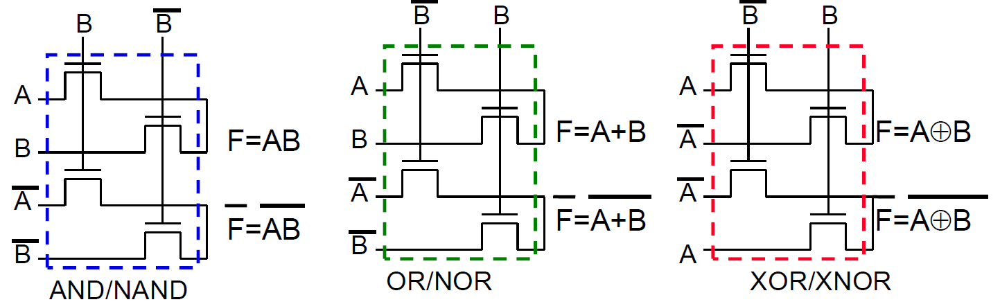

## 传输管逻辑改进

### 电平恢复器

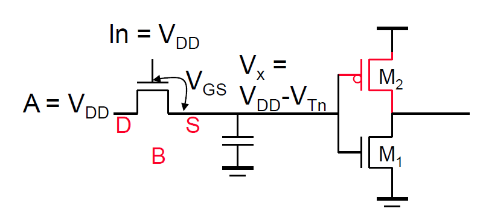

如上图所示，传输管逻辑总会导致在负载端的电平不够强，可能造成后续电路的逻辑错误，这时候就可以在后续接入一个反相器和一个反馈，如下图所示

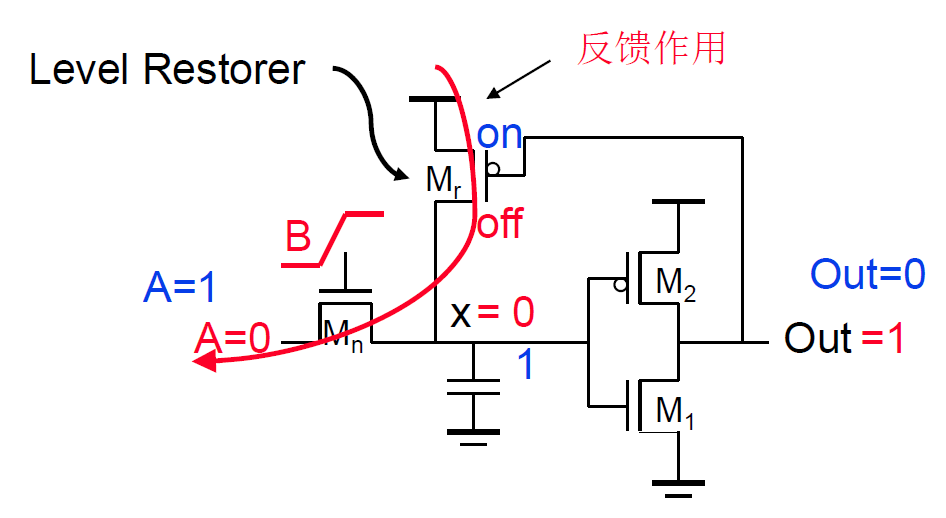

这样就引入了一个正反馈，传输管输出端的0、1信号都会得到加强

### 传输门

传输管逻辑总会导致输出电压比电源电压低，但是组合NMOS和PMOS构成一个如下图的传输门可以有效改善这个问题

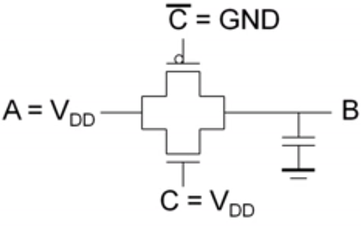

利用对管可以让输出电压达到全电压摆幅（Full Swing），当C=1时，A=B

传输门逻辑形成链状时也可以使用erlmore延迟公式计算，不加证明地给出：
$$
t_p = 0.69R_{eq}C \frac{n(n+1)}{2}
$$
且
$$
\hat{m}=1.7\sqrt{\frac{t_{pbuf}}{R_{eq}C}}
$$
一般来说最优的m为3~4，也就是3到4级传输门是延迟最优的

**所有传输管逻辑都可以用传输门来替代**

## 传输门逻辑

对于CMOS工艺，我们往往希望有成对的NMOS和PMOS，从而让它们共用N阱，这样可以缩小P管的面积，因此我们可以考虑将传输门分成N网络和P网络，如下图所示

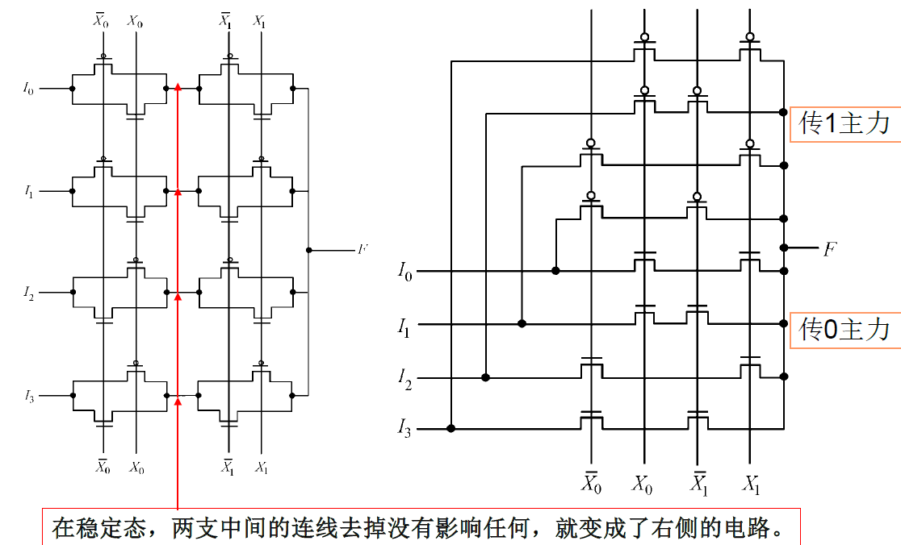

这是一个小改进，忽略一定的电学特性，利用传输管中间支路分开，逻辑等效的原理，但可以方便我们后续的改进

> 从独立的PT一路改成P网络和N网络构成的PG（Pass Gate）

### 差分传输管逻辑

将之前提到的差分想法应用在传输管上，我们可以获得**差分传输管逻辑**（**DPTL**）

DPTL中不需要使用PMOS，实质上是由两组NMOS传输网络构成的，这两组网络采用相同的控制信号，但传输的是一组原量和一组非量构成的差分信号，这样虽然NMOS传输门在传1时会存在“弱1”，但总会有一路是“强0”的，这样通过输出端的差分放大器，就可以把逻辑正常传输出去

> 这里的“差分放大器”本质上是一个预先设置好的译码器

其优势有：

* 全部NMOS，速度快、连线简单、寄生参数少
* 没有电平退化的限制

其劣势有：

* 多了一半数量的NMOS，还多出了一批反相器和一个译码缓冲器，因此占用硅片面积比NMOS传输网络略多

### 差分级联电压开关逻辑

将上面的差分思路改到CMOS逻辑复杂门上，就可以得到我们改进的终点了（大概）

**差分级联电压开关逻辑**即Differential Casecode Voltage Switch Logic，**DCVSL**

> 基本思路就是代表非的“圈”和“杠”是等效的，PMOS可以用信号的非来替代，从而换掉大部分的PMOS

电路基础结构如下所示

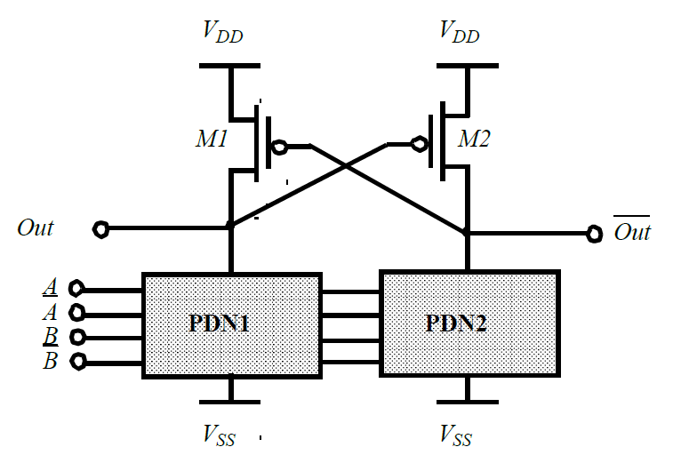

工作过程：

1. PDN1工作，若其导通，则PDN2关断
2. 导通一段的输出Out被下拉到地，输出0，同时P管M2导通
3. 由于M2导通，对面的M1会被上拉到VDD，输出Out非正好是1
4. 两个PMOS互锁，产生正反馈加强信号

其缺点包括：

* P阵列动作会比NMOS滞后一定时间，在此时间差内可能造成PMOS和NMOS同时导通，静态功耗增加、电源中毛刺、尖峰较大
* 整个电路延迟较大，电路速度慢，在高速电路中难以使用

优点包括：

* 所需晶体管总数为2k+2
* 输出电压摆幅与标准CMOS复杂门一样可以实现0到VDD
* 可以利用N阱将少量PMOS做在阱内，而将大量NMOS坐在阱外

而搭建这样一个电路的方法并不难，只需要3步：

1. 把标准CMOS复杂门的P网络中圈和杠互换位置，将PMOS全部改成NMOS驱动，信号则使用非量
2. 将改变后的P网络和N网络并行放置
3. 加两个交叉耦合的PMOS负责上拉，它们的源极一个作为正相输出端，一个作为反相输出端，各自接到P网络和N网络

这样就能够让N网络传输反相逻辑，P网络传输正相逻辑了

一个逻辑示例如下

需要注意：*虽然其形式和标准CMOS复杂门类似，但这里的MOSFET还是在用传输门的方式工作*
