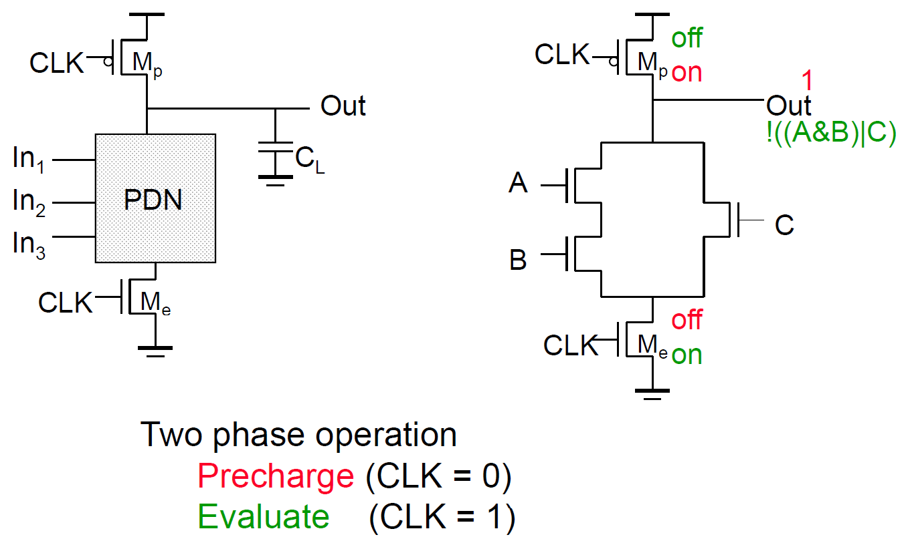
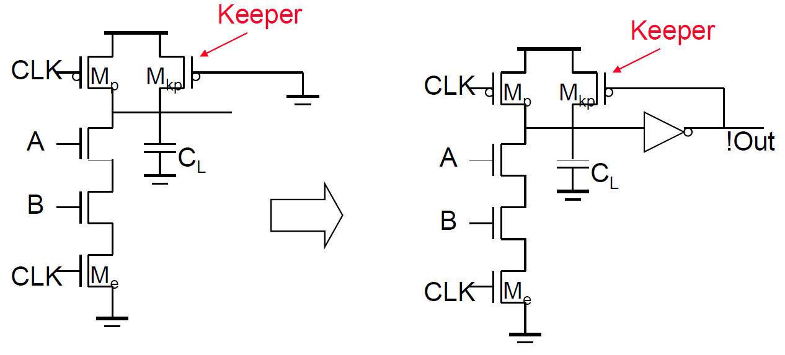
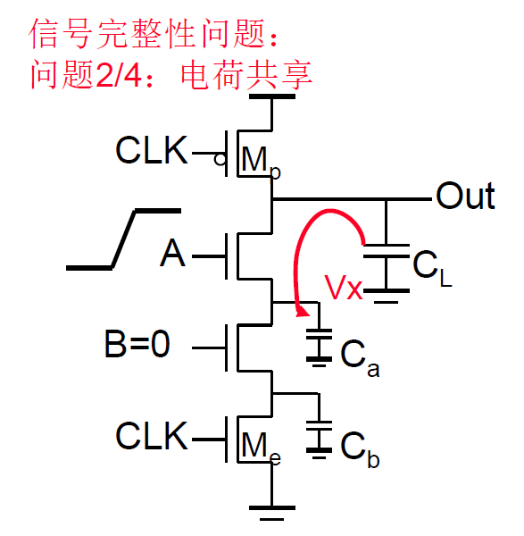
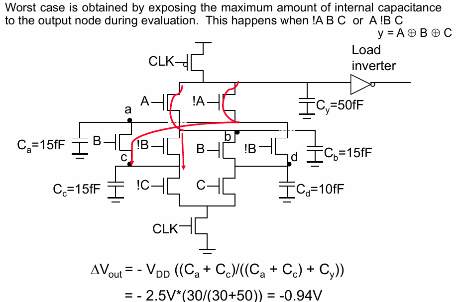
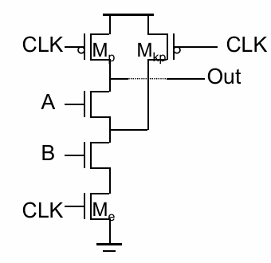
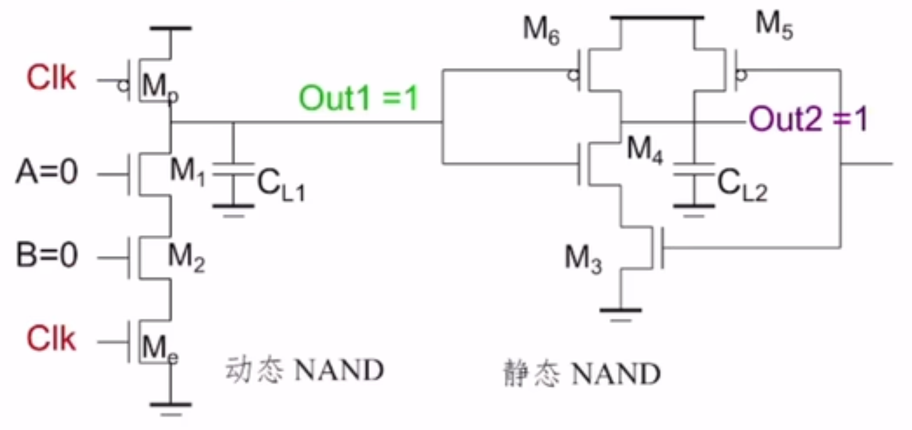
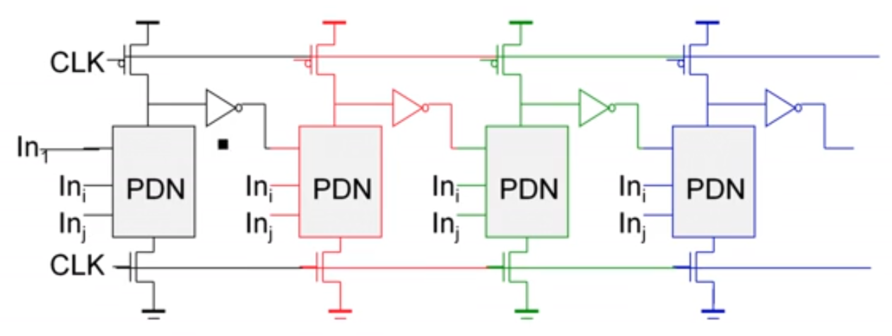
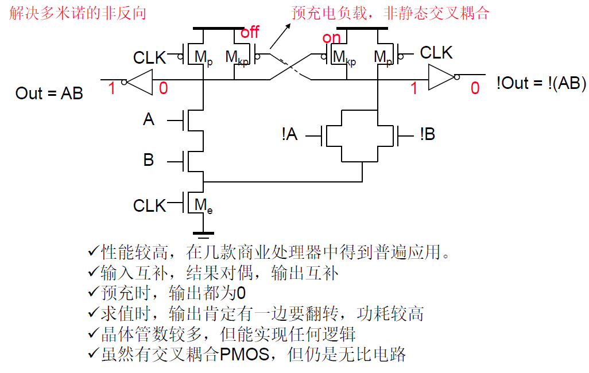
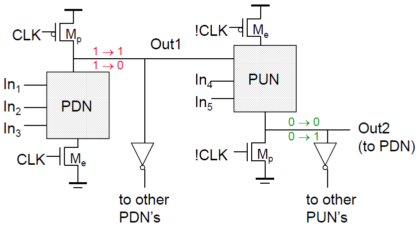

# 数字集成电路设计5【动态电路】

电路中的P网络会给设计带来很多难题，因此就要考虑将其优化掉，但对于静态电路而言，我们只能添加PMOS控制或者使用传输管/门，本质上都是在用等效电阻。即使采用DCVSL改进，也存在诸多弊端，尤其存在速度瓶颈，无法提高开关速率，这对数字电路是致命的。

> 需要注意：采用等效电阻方式上拉或者下拉的电路总是有比电路，这对设计者来说是很麻烦的

不过换个思路——如果在N网络下方再加一个MOS，上下MOS交替开关，就可以减少使用的PMOS，同时还能避免静态功耗。

使用一对时钟控制电路预充电和预放电，这样就可以把PMOS扔掉（前提是要使用CLK非——或者保留一个PMOS，这样可以避免对时钟线使用非逻辑）

这时候电路是无比电路，而且只比伪NMOS电路多一个NMOS。同时，在没有时钟高电平时，输出端总是高阻态的，需要使用时钟高电平为其不定时充电

该电路具有如下特点：

* PR=1期间，负载电容$C_L$放电。在此期间，不允许输入信号再有任何变化，否则逻辑取值就不是唯一的了

    > 这一点也是动态电路的特点

* P管尺寸不影响功能，增大P管可以上升快，但下降慢，同时时钟开关功耗也会变大

动态电路是一种比较敏感的设计，虽然静态功耗很低，但也存在一些缺点：

* 电路翻转阈值和器件阈值电压在同一水平，电路抗噪声能力弱（噪声容限小）
* 由于电路的充电速度和时钟速度限制，开关阈值是一个动态量

## 动态电路特性

### 预充和预放对翻转的影响

由于动态电路需要对输出端进行预充和预放，而负载电容会在非充电边沿抽走一定电压，会导致出现“浪费电”的情况。对于静态门发生翻转的概率$P=P_0P_1$，而动态门的翻转概率伪$P=1P_0 $，只要输出1，就一定会发生翻转，这就是所谓的在输出高电平时“浪费电”

### 开关活动性因子

我们将上面所说门电路发生翻转的概率$P$称为**开关活动性因子**，可知动态电路的开关活动性因子比静态电路大，但实际上需要用动态电路的调用概率来计算

### 电荷泄露

虽然预充后可以在输出端维持高电平，但输出端的电压会由于各种原因出现漏电，因此需要对其进行不间断的充电，这就意味着**动态电路需要一个最低的刷新频率**来防止电荷泄露

回想之前传输管逻辑常用的反相器+PMOS的电平恢复器，也可以在动态电路中引入一个正反馈机制，如下图所示

既然是为了解决漏电问题，那么这样的一个保持器可以做得很小，仅提供一定反馈锁定能力即可（锁存器中使用的MOS不需要太大就可以起到很好的反馈作用）

### 电荷共享

由于预充过程中会导致与输出端相邻的NMOS充电，又因为NMOS内部可能是关断的，这样电荷就会被存储到一个NMOS中，如下图所示电容CL就在对Ca充电。负载端的电荷反灌很可能会导致信号完整性问题

最坏情况下，输出电容将通过每个可能的节点到GND来对路径上所有电容进行充电，这就会导致负载电容的电荷在所有可能路径中的输入电容上重新分配，如下图所示

我们也可以通过在每个NMOS中间结点引入预充PMOS来减小该问题的影响，如下图所示。但这样的话，在复杂电路中将会引入大量不必要的PMOS

### 回栅耦合

当且仅当使用动态逻辑驱动静态逻辑，且驱动目标为远离GND的NMOS（扇出侧存在存在下拉网络且被驱动的NMOS没有直接接到GND）的栅极时。由于NMOS的栅源之间存在一个交叠电容，这会对动态电路输出端造成影响——**输出端耦合的交叠电容会从前级取电**，使输出端电平下降，如果信号变化过快会导致信号完整性问题

通过合理设计layout，减小寄生电容能够缓解该问题。如果要从根本上解决问题，就需要在动态逻辑驱动静态逻辑时让动态逻辑驱动靠近电源或GND的管子（非NMOS）

### 时钟馈通

栅源交叠电容也在时钟控制PMOS上存在，它会导致存电，当下个充电周期到来时让NMOS的输出端电压高于预期的充电电压。比如上图中的Mp和M1之间就会出现时钟馈通问题。*时钟馈通会导致信号过冲*，有可能导致正偏和闩锁效应

### 动态电路级联

动态电路禁止串联，因为它的级联会出现延迟问题，当前一级电路输出信号到达后一级时，会存在一个延迟，就可能导致第二级输出错误。本质原因是前一级的输出端直接连接到了后端

我们可以通过**多米诺逻辑**（Domino Logic）解决这个问题：前一级的信号后加入一个反相器，再传递给后级，只有前一级电路预充完毕时信号才会传输到下一级，如下图所示

多米诺逻辑存在如下特点：

1. **逻辑求值需要一级一级传播**
2. **速度非常快**，可应用于各种高性能电路，但需要配合更强大的综合器和布局布线工具
3. **无比逻辑**（若添加电平恢复电路则会变成有比逻辑）
4. **抗噪声能力强**
5. **动态节点必须在设定的预充电时间内完成预充，且求值期间输入必须保持稳定**
6. **只能实现非反相的逻辑**，因为所有多米诺门都是非反相输出的逻辑门

多米诺逻辑会导致预充时下一级电路的所有输入都是0，因此可以考虑将输出端信号通过一个反相器连接到接地的NMOS栅极，也有人提出了*差分多米诺逻辑*，利用反逻辑来实现耦合，如下：

本质上就是将普通的动态多米诺电路构造成了差分形式

还有np-CMOS的改进方法，如下图所示

