# 数字集成电路设计6【时序逻辑】

*组合逻辑*：任一时刻的稳定输出只取决于当前时刻的输入

*时序逻辑*：任一时刻的稳定输出不仅决定于该时刻的输入,而且还和电路原来的状态有关

**无比电路**：电路功能的正确性不依赖于管子的尺寸比

**有比电路**：电路功能的正确性与管子的尺寸比有关系

*静态逻辑*：电路输出总是与电源或地之间有稳定的通道

*动态逻辑*：电路输出节点通过寄生电容来保持其电荷，依赖于动态的充放电来实现输出

**D触发器**（DFF，D Flip-Flop）：边沿敏感器件

**锁存器**（Latch）：电平敏感器件

## 静态时序逻辑

时序逻辑的基础就是触发器和锁存器，**触发器是边沿敏感器件；锁存器是电平敏感器件**

对锁存器而言，时钟为高电平时，输出=输入；电平为低电平时则将输出值锁存保持。分为正锁存器和负锁存器

D触发器分为上升沿触发和下降沿触发，一般可以由锁存器来构建，当边沿到来时，触发器会对输入进行采样并令输出=输入，其他时刻则将输出值锁存保持

### 锁存器

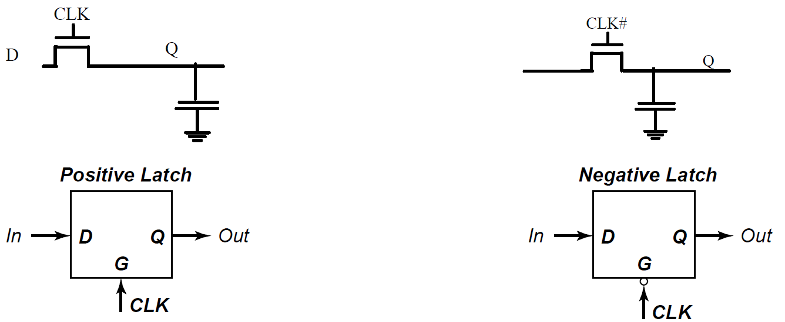

latch结构非常简单，使用一个传输管+一个保持电容即可实现

### 触发器

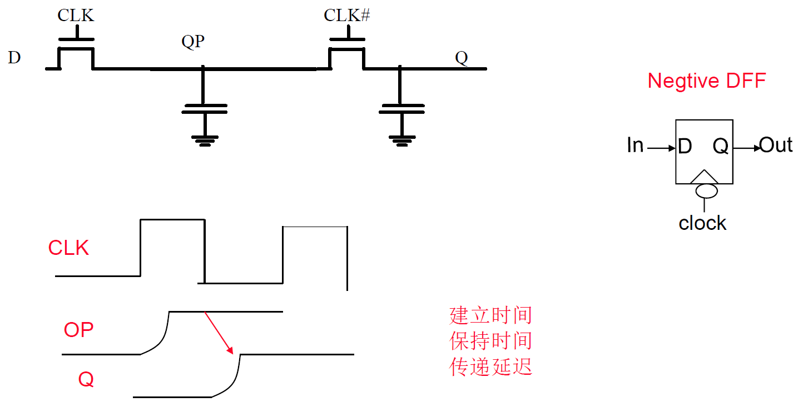

两个锁存器相连，引入正负时钟就可以构造出简单的DFF。利用了时钟边沿控制传输门和信号传输延迟。如上图所示，OP的边沿上升时间与时钟边沿之差就是**建立时间**；Q的边沿上升时间与时钟边沿之差就是**保持时间**；两个信号上升边沿中点时间差就是**传递延迟**

### 建立时间和保持时间

建立时间和保持时间都是不可避免的，但传递延迟是我们不希望的，我们需要尽可能让传递延迟在可控范围内。我们会考虑触发沿前，输入信号必须稳定多长时间，触发器才能够采样到稳定值；触发沿后，输入信号必须稳定多长时间，才能保障触发器采样到的数据不丢失

**建立时间**：时钟边沿到来**前**，**输入**数据能保持稳定的时间

**保持时间**：时钟边沿到来**后**，**输入**数据能保持稳定的时间

**传递延迟**：时钟边沿到来后能够将数据送到输出端所需的时间

我们希望建立时间和保持时间恰好够用来让前后级电路不出错，同时传递延迟尽可能短。

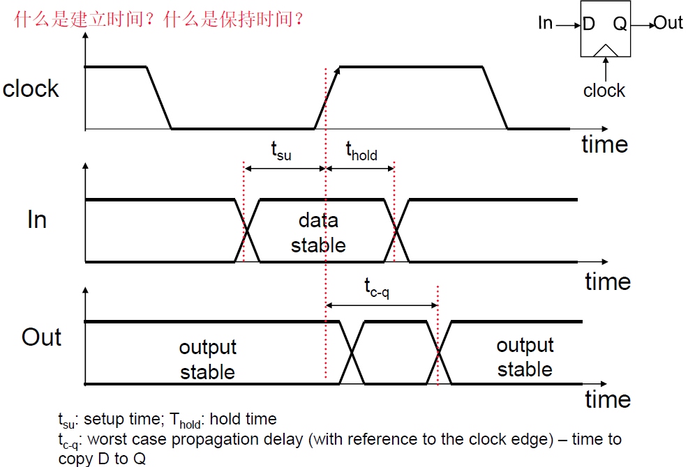

一般来说我们的数字电路是DFF-组合逻辑-DFF的结构，因此我们的需求如下：

* **后级电路采样的建立时间要尽可能短，保障能够及时采样到前级输出的数据**
* **前级电路的保持时间要足够长，保障输出数据能够被后级采样到而不是被新的数据覆盖，让电路功能正确**

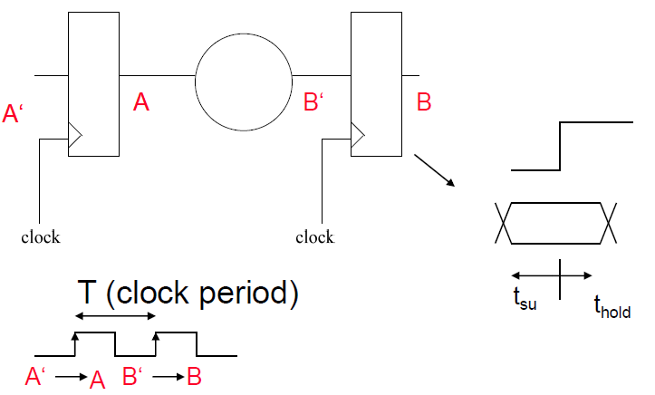

上面两个需求就对应了建立时间和保持时间的要求公式：

对建立时间$t_{su}$，
$$
T\ge t_{c-q} +t_{plogic} +t_{su}
$$
对保持时间$t_{hold}$，
$$
t_{cdreg} + t_{cdlogic} \ge t_{hold}
$$
建立时间决定了时钟的频率上限；保持时间决定了电路的功能稳定性

> 对于锁存器，也有建立时间、传递延迟和保持时间，如下图所示
>
> 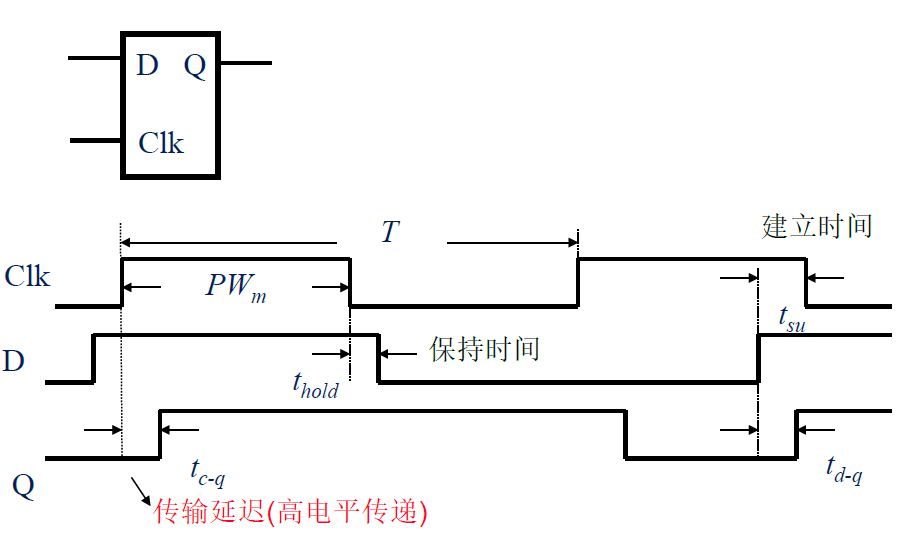
>
> 可以发现这个latch是一个高电平触发的latch，在时钟高电平到来后，输入信号D到Q的延迟就是**传输延迟**；**保持时间**则定义为从时钟高电平变为0后到输入信号D结束的时间；**建立时间**定义为从输入信号D保持稳定到高电平到来前的时间

### 存储电路

存储单元电路分为静态和动态。**静态存储器**采用正反馈来保持，使用两个首尾相连的反相器

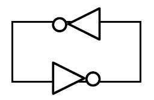

具体实现如下

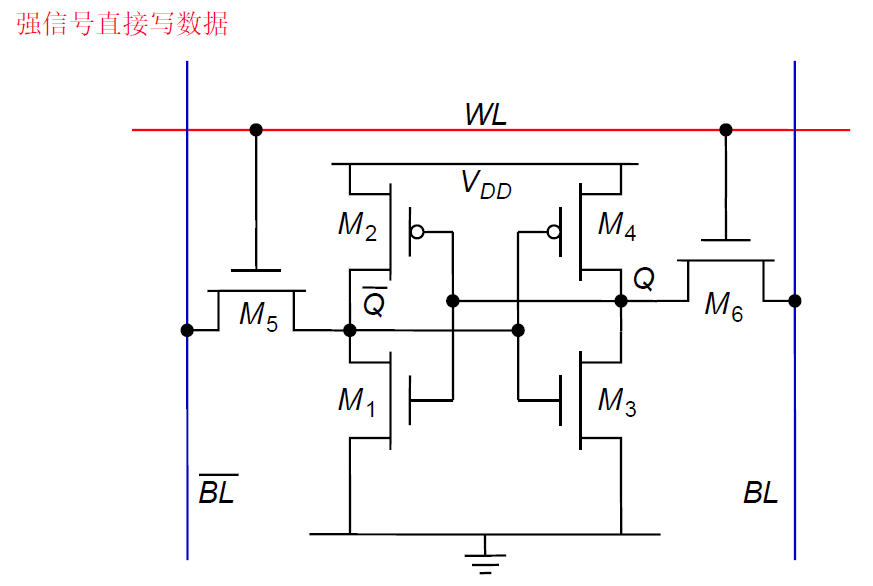

一个静态存储器至少需要6个MOS，它没有静态功耗，但是有比电路

> RS触发器的基本原理

也可以使用多路开关型锁存器来对其进行写入（切断反馈通道），这个电路就是无比逻辑

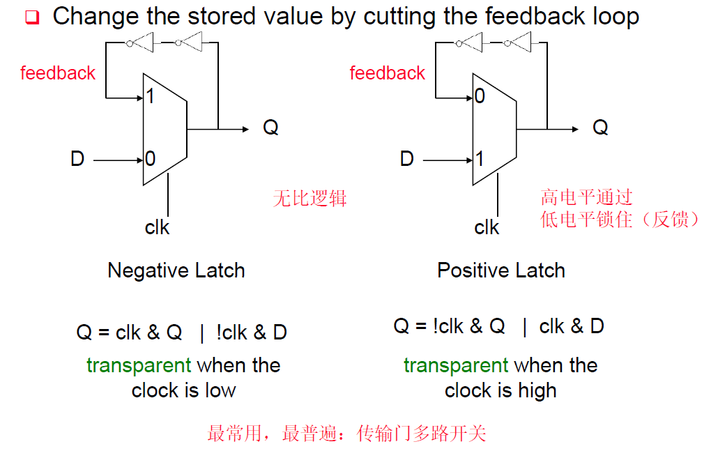

**动态存储电路**采用寄生电容和时钟周期刷新来实现，功耗可以比较低

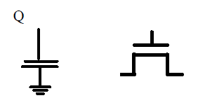

### D触发器结构和时序要求

D触发器可以看成如下图的两个锁存器构成，同时使用一个时钟信号来实现采样

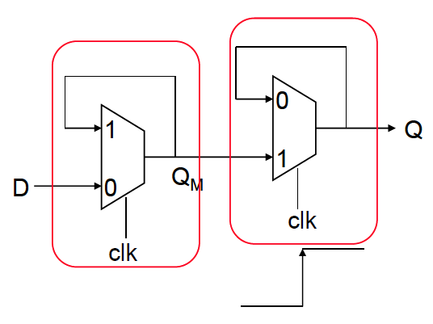

我们来仔细分析一下DFF的结构中哪一部分决定了建立时间、保持时间和传输延迟，看下图

这是一个上升沿触发的DFF，上升沿前，clk=0，传输门打开，D通过传输门和一个反相器传输到QM，这时候就需要满足建立时间足够长，让QM的D非信号再通过一个反相器到达传输门前，才能让clk=1，从而实现信号的锁存；传输时间则等于QM处信号通过一个反相器和一个传输门的延迟；保持时间是0，因为当QM信号到达QY时，若满足建立时间，那么恰好可以通过传输门到达输出端

因此这个电路中，存在

* 建立时间$t_{su}=2t_{pd_{inv}}+t_{pd_{tx}}$
* 传播延迟$t_p=t_{pd_{inv}}+t_{pd_{tx}}$
* 保持时间$t_{hold}=0$

特别地，**如果我们在clk引脚处引入一个$t_{delay}$延迟，那么需要让建立时间减去$t_{delay}$，让保持时间加上$t_{delay}$**

### 时钟问题

有时候，时钟clk和反相时钟clk非可能并不是严格对齐的，我们称这种情况为**时钟歪斜**（skew），这会对DFF造成严重影响：数据有几率直接透传过DFF

### 根据电路判断DFF性质

1. **触发沿**

    DFF的第一级锁存器的传输门在关门时会进行采样，因此只需要判断第一级传输门关断电平即可。比如传输门高电平关断，那么说明它是在下降沿前采样，DFF是下降沿触发；反之亦然

2. **建立时间**

    从信号输入往后遍历第一级锁存器的信号路径，根据信号流向将一路上所有具有延迟的器件相加，直到回到能让第一级锁存器输出保持稳定的位置，得到总延迟就是建立时间

3. **传递延迟**

    从第一级锁存器的输出端到DFF输出端之间通路中所有具有延迟的器件累计起来的总延迟即为传递延迟

4. **保持时间**

    首先观察第一级锁存器的传输门关门时，前面的输入信号是否会影响到第一级锁存器的输出，如果不会影响，则保持时间是0；如果会影响，则要计算从输入信号到第一级锁存器输出保持稳定时，信号所历经的通路

## 动态时序逻辑

下面来介绍利用动态存储器实现的动态DFF和其中要关心的问题

### 动态DFF

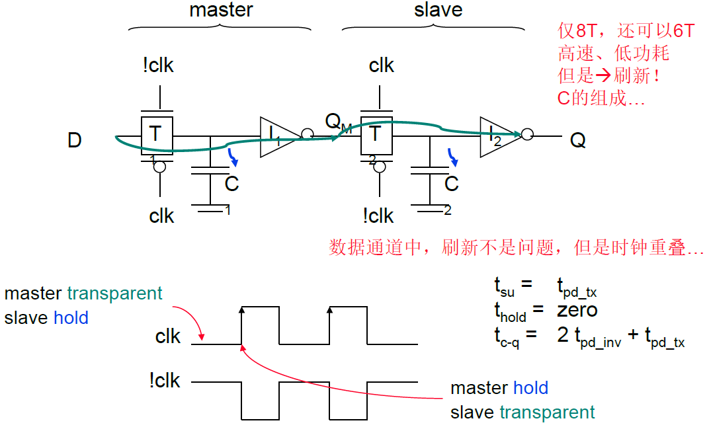

如上图所示，基于两个传输门、两个电容、两个反相器，就可以实现DFF逻辑了，它和所有动态电路一样高速、低功耗、需要刷新，但具有一个大缺点：如果时钟出现歪斜（skew），它有可能无法正常工作

### 伪静态电路

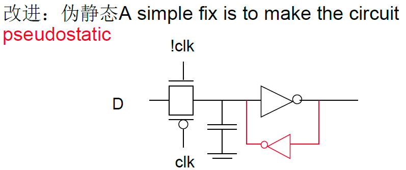

通过在动态电路电容输出端引入一个小的反相器，可以补充动态电路的漏电，解决动态电路不稳定的问题

### Clocked CMOS

基于主从方式可以实现时钟歪斜不敏感的动态DFF，分别使用clk和D控制两对传输管来达到时钟歪斜发生时不会影响输出端的作用

(0,0)重叠会导致如下图所示情况

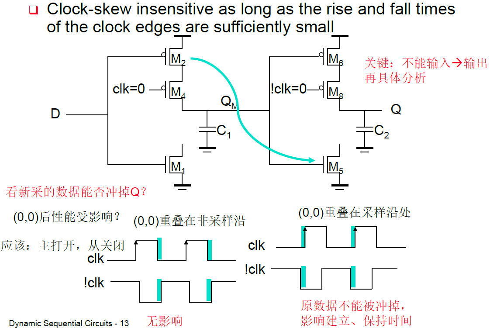

(1,1)重叠会导致如下图所示情况

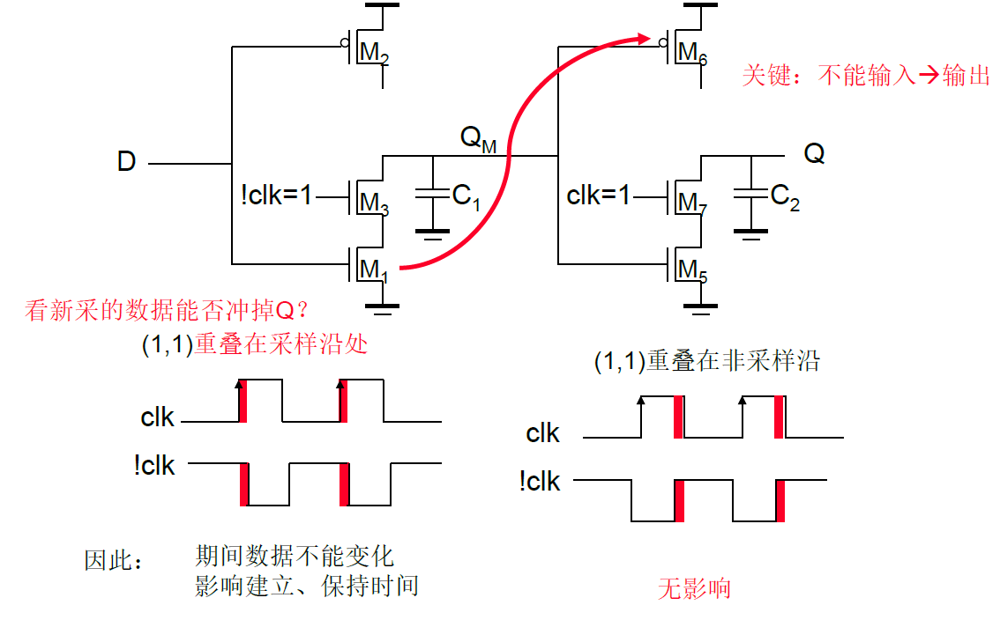

都不会对输出造成影响

CCMOS还可以设计成流水线（pipline）结构，从而加速电路时钟

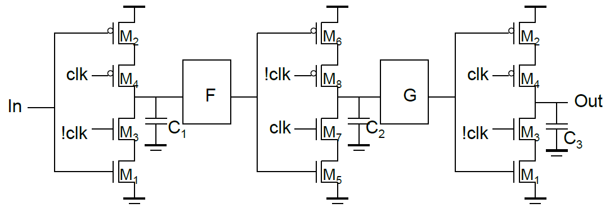

但需要注意：**CCMOS两级中间不能接入in非（反相）的逻辑**，否则会破坏掉时钟无关的特性
