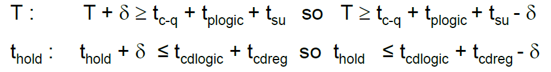
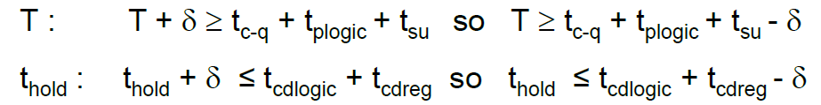
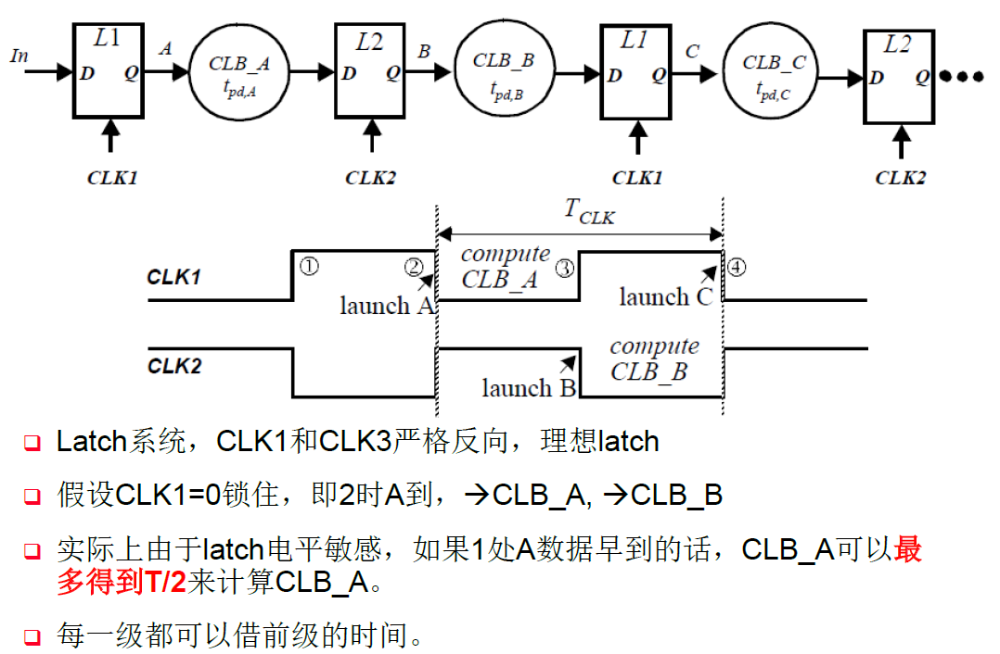

# 数字集成电路设计7【电路时序分析】

**同步时序系统**：所有时序电路使用同一个时钟驱动的系统

**异步时序系统**：存在多个不同时钟或不同触发信号驱动时序电路运行的系统

**时钟歪斜**（skew）：时钟边沿不对齐

**时钟抖动**（jitter）：时钟边沿突变

对于理想时钟，我们规定

对建立时间$t_{su}$，有
$$
T\ge t_{c-q} +t_{plogic} +t_{su}
$$
对保持时间$t_{hold}$，有
$$
t_{cdreg} + t_{cdlogic} \ge t_{hold}
$$
从而让DFF正常工作

但**实际上大部分时钟都存在时钟歪斜和时钟抖动**，属于非理想时钟，这时候就需要进行时序分析

## 实际时钟存在的误差

实际的时钟存在三种主要干扰

* **时钟歪斜**Clock skew

    空间上的变化，时钟边沿位于不同位置，通常是由于时钟相位偏差导致的固定偏差

    原因：制造偏差、静态偏差、互连线层间电介质厚度不同、温度因素

* **时钟抖动**Clock jitter

    时间上的变化，本应该在同一位置上的时钟沿，在每个周期都发生错位，导致时钟像是在左右抖动，频率不稳，通常由于时钟信号边沿受到干扰导致

    原因：时钟产生不稳（本征噪声、电源噪声、衬底耦合等）、电容网络耦合、电源瞬间变化等

* **脉冲宽度变化**Variation of the pulse width

### 时钟歪斜

时钟歪斜分为**正时钟歪斜**和**负时钟歪斜**

正时钟歪斜：前一级DFF时钟比后一级DFF时钟提前（或者说后一级DFF时钟比前一级DFF时钟延迟）

正时钟歪斜让保持时间更难以满足；但可以让建立时间变得更小一些，从而提高整体电路时钟速率。通过在后一级DFF时钟前插入buffer可以缓解或者解决正时钟歪斜

设时钟歪斜是在时钟周期上加入了一个$\delta$，那么有

负时钟歪斜：前一级DFF时钟比后一级DFF时钟延迟（或者说后一级DFF时钟比前一级DFF时钟提前）

与上面同理，有负的时钟歪斜$\delta<0$

负的时钟歪斜让保持时间更容易满足；但会增大建立时间的要求，导致电路时钟速率降低

**虽然时钟歪斜有利有弊，但一般情况下我们都希望时钟是稳定的，时钟歪斜越小越好**

### 时钟抖动

时钟抖动是随机的，因此我们常常规定一个时钟抖动的最坏范围$t_{jitter}$，作为一个参数加到时钟周期T上，通过引入时钟抖动，我们将上面的公式写成统一的形式：

对建立时间$t_{su}$，
$$
T+\delta -2t_{jitter} \ge t_{c-q} +t_{plogic} +t_{su}
$$
对保持时间$t_{hold}$，
$$
t_{hold} +\delta +2t_{jitter} \le t_{cdreg} + t_{cdlogic}
$$
一般来说保持时间违例都可以通过插入buffer解决

## 关键路径

**关键路径**（Critical Path）是设计时序时必须要考虑的，它是指所有*有效*信号路径中最长的那条

有时候看起来最长的路径并不是关键路径，因为信号可能并不经过，在找关键路径过程中要注意

### 时钟分布技术

在片上时钟布线时，可以选择**均衡**树**路径**来避免时钟歪斜

> 理论上可以使用H树网络实现处处相等的时钟歪斜，但实际使用中并不现实

实际使用中经常使用**均衡RC树**，从时钟源到各个叶节点的时钟歪斜尽可能保持一致

使用**时钟网格**可以最小化时钟歪斜

## 使用latch进行高性能设计

利用latch的传输特性，可以向前一级“借”建立时间，从而实现高性能计算