# 数字集成电路设计8【加法器设计】

加法器作为一种最基本电路模块，广泛应用在CPU和各类ASIC中。除了最基本的加法功能外，加法器还能够用于构造减法、循环等多种算法电路实现。本章介绍数字集成电路中的加法器实现。

## 加法运算回顾

首先来考虑最基础的二进制加法运算。1bit二进制加法逻辑如下：

| 输入A | 输入B | 输出Y | 输出Co |
| ----- | ----- | ----- | ------ |
| 0     | 0     | 0     | 0      |
| 0     | 1     | 1     | 0      |
| 1     | 0     | 1     | 0      |
| 1     | 1     | 0     | 1      |

该逻辑可以使用一个异或门实现，即 $Y=A \oplus B$。如果考虑输出进位Co，那么只需要对输入A和B做与运算，即 $C_O=A \& B$，这样就构造出了**半加器**。但该电路太过简单，无法实现加法进位输入操作，因此需要考虑带进位的1bit全加器逻辑。**全加器**用于对三个输入位进行加法运算，产生两个输出结果：一个是和（Sum，这里用Y表示），另一个是进位（Carry，这里用Co表示）

| 加数输入A | 加数输入B | 进位输入Ci | 和数输出Y | 进位输出Co |
| --------- | --------- | ---------- | --------- | ---------- |
| 0         | 0         | 0          | 0         | 0          |
| 0         | 0         | 1          | 1         | 0          |
| 0         | 1         | 0          | 1         | 0          |
| 0         | 1         | 1          | 0         | 1          |
| 1         | 0         | 0          | 1         | 0          |
| 1         | 0         | 1          | 0         | 1          |
| 1         | 1         | 0          | 0         | 1          |
| 1         | 1         | 1          | 1         | 1          |

注意到：当A、B、C输入中存在奇数个1时，和数为1。因此一个简单的想法是：和数输出项可以采用两级异或门实现，即 $Y=A \oplus B \oplus C_i$ ；而进位输出项可以采用一个三者表决器（三输入的多数表决器）电路实现，即 $C_o = AB + AC_i + BC_i = AB +(A+B)C_i$

> 与分立式数字电路实现不同，我们希望直接在片上基于CMOS复杂门实现全加器，因此并不需要像分立电路那样采用半加器串联的形式（下图）
>
> 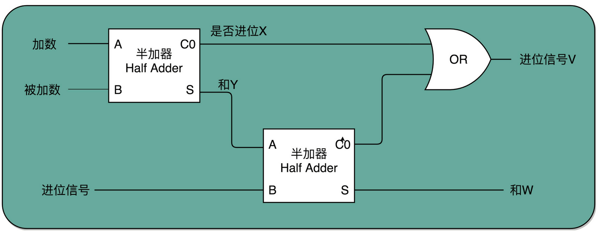

异或逻辑是比较耗费片上资源的，因此我们考虑使用简单的与、或、非门电路替换它。考虑到
$$
Y = A \oplus B \oplus C_i = (\overline{A}B + A\overline{B}) \oplus C_i=(A+B+C_i)\overline{C_{o}} +ABC_i
$$
 其中包含了输出 $C_o$，因此可以直接复用进位输出。

同时，对于进位输出，可以将其优化为二输入标准逻辑门形式，最后得到如下图所示的全加器电路

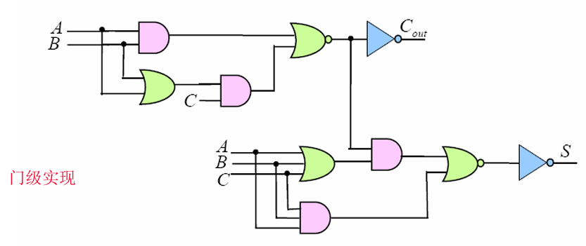

图中存在
$$
C_o = AB +(A+B)C_i
$$
和
$$
S=(A+B+C_i)\overline{C_{o}} +ABC_i
$$
对应的CMOS逻辑复杂门如下图所示，**总共需要24个MOS管，并额外使用4个MOS管构成两个反相器用于输出**

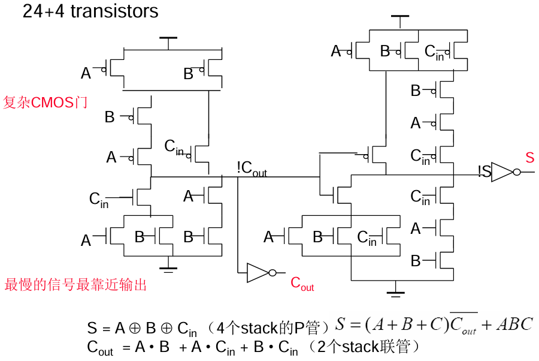

继续看多位加法器的实现。以一个4bit的加法器为例，通过将四个全加器单元串联起来，将上一级的Co作为下一级的Ci，即可实现4bit数的加法运算，如下图所示。其中An、Bn为加数输入，C0为初始的进位输入，C4为进位输出，Sn为和数输出。在实际电路中往往将C0设置为0或根据外界电路的状态配置，并将C4作为电路的额外输出

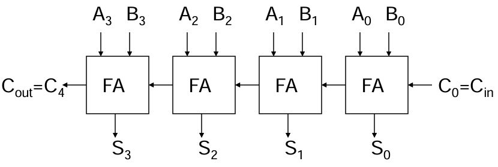

## 加法器硬件电路优化

### 镜像原理

如果需要针对经典的24+4MOS全加器进行优化，可以利用1bit全加器的反向特性：
$$
\overline{C_{out}}=\overline{(AB)+C_{in}(A+B)}=\overline{A}\overline{B}+\overline{C_{in}}(\overline{A}+\overline{B})
$$
即对全加器的所有输入量取反，则输出量也被取反，即如下图所示的左右两个电路是等效的

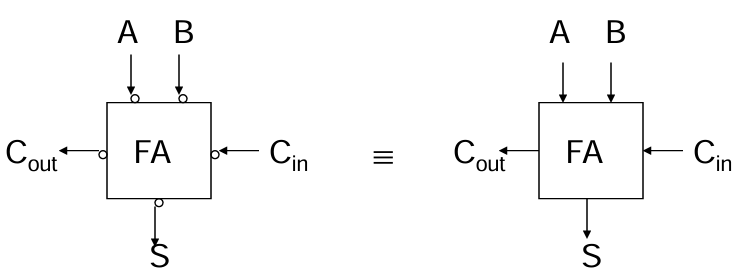

基于该特性，我们可以总结出一个基本的硬件优化方案：**镜像加法器**。考虑N网络和P网络的对偶性，即对N网络中所有输入变量取反，等效于将N网络中的所有NMOS替换为等尺寸的PMOS，同时它们的输出值也被取反。这个性质正好与全加器的反向特性吻合，因此可以把上述24+4管全加器中的P网络全部替换成等效的N网络（结构相同、管型代换），得到电路如下图所示

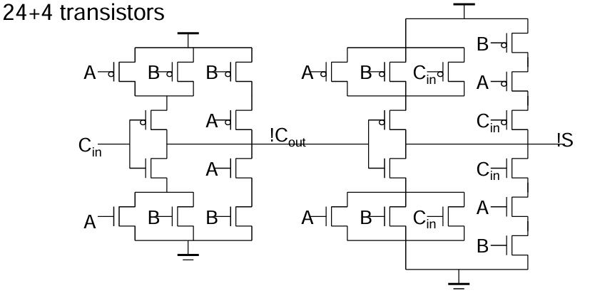

乍一看二者区别不大（还是24+4个MOS，只是N网络和P网络拓扑变得完全一致），但可以发现，利用镜像原理后，加法器的P网络上拉级数减少了，这意味着开关延迟将得到降低，电路速度变快了

**镜像原理可以在所有满足上述反向特性的器件上工作**，因此可以对除了加法器之外的更多电路使用。

### 传输门加法器实现

除了基本的镜像原理优化，还可以采用传输门实现加法器，该实现将使用的MOS管降低到16个，如下图所示

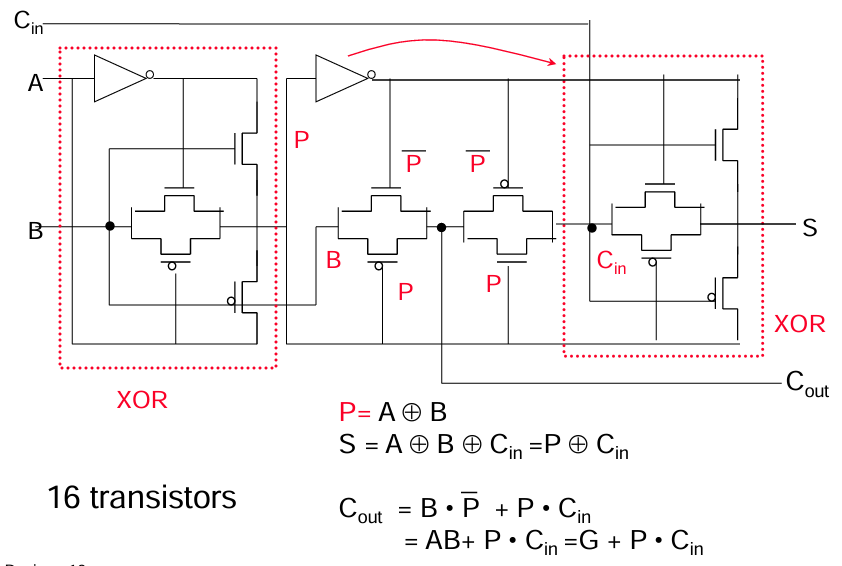

类似地，前面章节中所讲述的互补传输管CPL、DCVSL、动态电路（多米诺连接）都可以应用到加法器上，从而对用户更加关心的方向进行优化

### 多位加法器的瓶颈

回顾上一部分给出的4bit加法器结构图，观察其中的关键路径（Critical Path），可以发现An、Bn作为输入值是给定的，Sn作为输出值全部都可以在单个加法器的延迟后得出；但C4需要从C0开始，逐级计算：C1、C2、C3、C4，因此从C0计算得到C4需要4个加法器的延迟才能得到。下面将给出全部分析过程，证明**进位链就是多位加法器的瓶颈（关键路径）**。

注意到当Ai=Bi=1时，肯定产生Co=1并传递到下一级，将该逻辑称为**Generate**（G）；当Ai=Bi=0时，产生Co=0传递到下一级，将该逻辑称为**Kill**（K）；当Ai或Bi中有一个是0时，则根据前一级Ci的值确定输出Co的值，将该逻辑称为**Pass**（P）

因此，可以将进位输出Co的表达式改写为
$$
C_{out}=G+PC_{in}
$$
其中$G=AB,P=A\oplus B,K=\overline{A}\overline{B}$

同样地，还可以对Sn进行简化，得到
$$
S=P\oplus C_{in}
$$
将上述分析带入到镜像加法器的实现，如下图所示

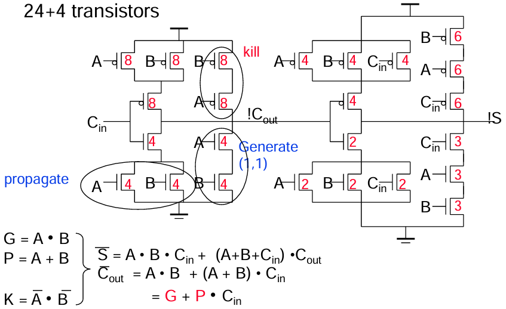

可以发现镜像加法器实际上是满足表达式分析的。其中产生$\overline{C_{out}}$的部分可以被拆分成kill、generate、Propagate三部分。其中propagate部分是一个不完整的异或门（电路实现上表现成或门的形式，只满足A+B的情况）

将整理后的进位表达式应用到电路上，就得到了**曼彻斯特进位链单元**，如下图。这个单元就是单个全加器电路造成延迟的关键路径


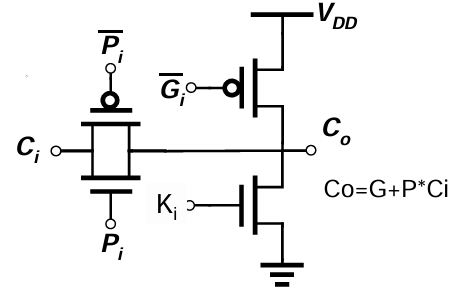

该电路中使用一个传输门构造P门控，使用一个反相器分别实现G和K门控。从而得到$C_{out}=G+PC_{in}$实现。该电路也可以通过动态电路形式实现，如下图

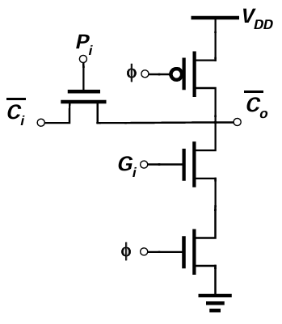

利用这个单元将4个全加器连接起来，得到如下图所示的**曼彻斯特进位链**，红圈处是一个独立的进位链单元

> 这里基于动态电路形式描述，对于静态电路也具有相同的结果

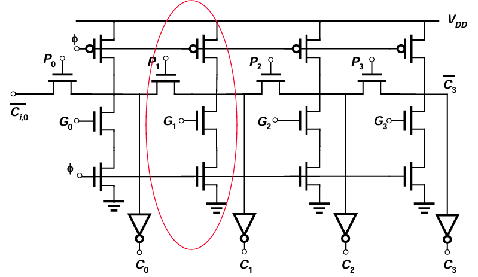

此时就得到了最简加法器结构：由四个N管构成的关键路径。为了让电路运行中传输管产生的电压损失处于合理范围，不影响信号完整性，一般每3到4级传输管后会串联一个buffer或者使用电平恢复电路

由曼彻斯特进位链构造的加法器将呈现进位数一级一级传递的效果，被称为**行波进位加法器**（Ripple Carry Adder，RCA），这样一个电路的最坏延迟呈现的时间复杂度为**O(N)**，即延迟随着电路中全加器单元级数的增长呈线性增长关系。分析如下：
$$
T_{total}=T_{基于输入计算出Co}+T_{基于C_{in}计算出S}+(N-2)T_{基于C_{in}计算出C_{out}}
$$
其中出现了全加器级数N，由于公式中前两项的延迟都等于单个全加器单元的延迟，因此最后一项的延迟决定了多位加法器电路的总延迟。也就是说进位链的延迟成为了电路瓶颈。

一个比较自然的想法是直接利用镜像原理（全加器反向特性），如下图所示，可以直接给每一级进位的输出去掉一个反相器

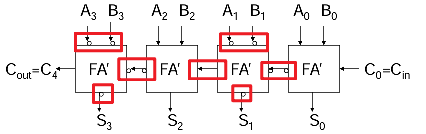

但这个方案的弊端在于每个奇数级输出S信号都会被取反，因此需要在输出时再接入两个反相器，本质上是把反相器从每级之间移动到了输出端。

### 进位旁路优化

在电路层面上，可以使用进位旁路（**Carry Bypass**或**Carry Skip**）的技巧，这在加法器进位链很长的时候有效。如下图所示，假设整个加法器的进位链是16位，我们并不需要等32个进位链传输延迟，而是可以把它分成4组，每组4个加法器，同时每组提供一个独立的进位输出，这样我们只需要在每组的最后一个全加器单元输出端添加MUX，使用P门控并直接使用来自每组C0的输入就可以在1个传输延迟内得到Co结果

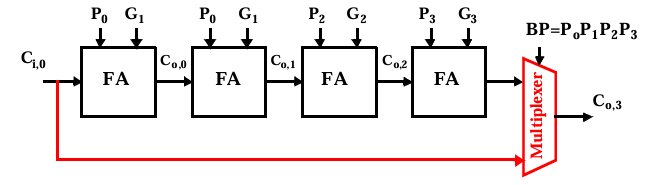

整个的16bit加法器电路会被修改为

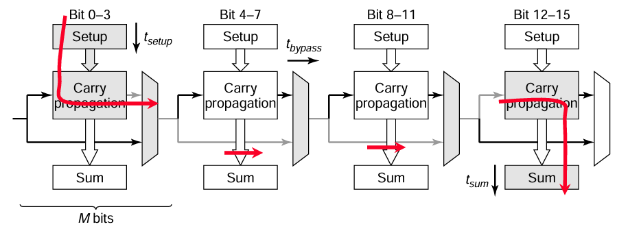

其中的进位延迟时间复杂度为O(N/M)，其中M表示切分的进位旁路级数，增长速度相较原始版本显著变慢（虽然还是多项式复杂度）

### 进位选择优化

基于上述分治思想，还可以加入以空间换时间的方案，这就是如下图所示的进位选择加法器（**Carry Select** Adder）。

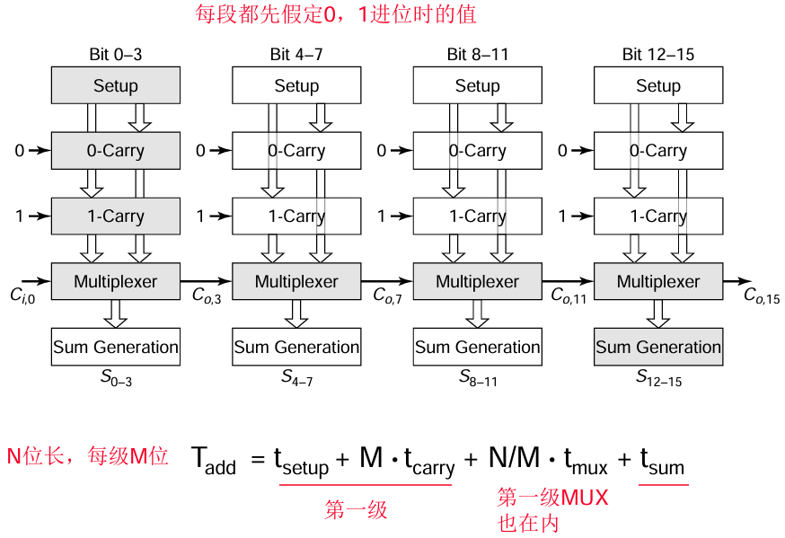

将16bit的加法器同样拆分为四组，但每组中都使用一个MUX根据当前进位值和前级输入值Ci来直接获得进位结果Co，具体实现如下

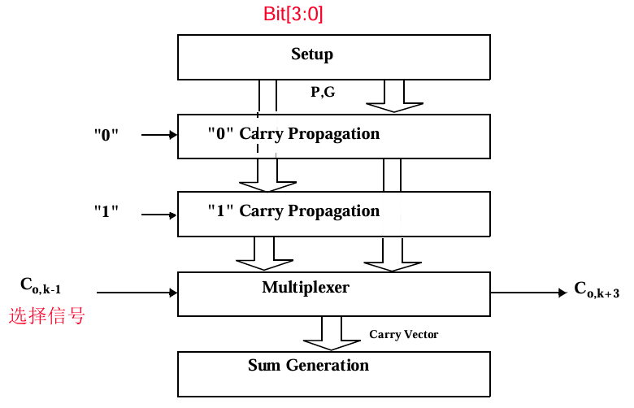

因为是否允许Ci以传递的方式进入Co（Co=Ci或Co=!Ci）仅仅取决于P、G参数。因此可以在加法计算开始之前就基于输入数据给出P、G的值（实际上该步骤和加法同时进行），并利用一个二选一MUX判断是否让Co=Ci

该实现引入了一个额外的setup常数延迟，但有效降低了总延迟。表面上看电路的关键路径和进位旁路优化相同，因为我们并未加入旁路优化。观察下图，第i级电路的进位输出实际上与第i级的进位选择器信号可以复用，因此从第二级之后的进位选择器的一端输入可以被优化掉，减少总延迟

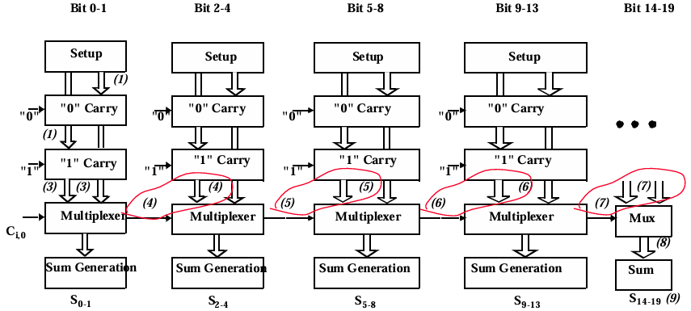

根据上图给出的延迟分析，延迟表达式中的N可以被重写为$\sum (M+P_i-1)$，其中M和-1都是常数项，则当N远大于M时，存在$N\rightarrow \frac{P^2}{2}$，于是得到进位选择优化电路的时间复杂度为$O(\sqrt{N})$

### 超前进位优化

回看加法器的计算原理，可以得到如下图所示的分析过程：

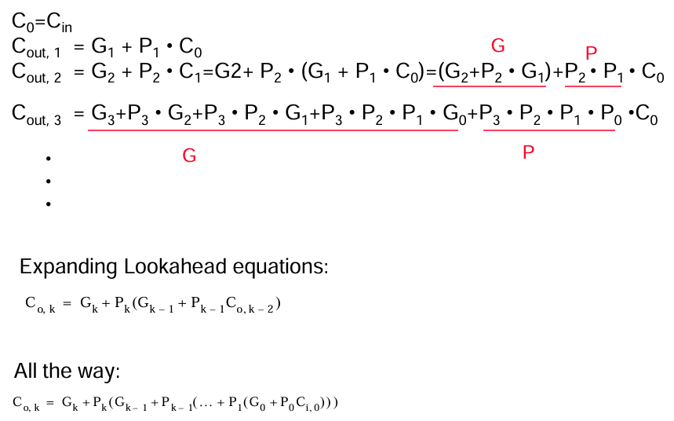

其中Cout是每一位进位信号的输出，G、P、Ci组成了每一位加法器的输入。我们可以发现，加法器总可以被拆分为上图中的“Lookahead equations”。不妨定义操作：

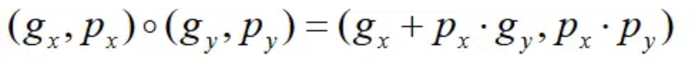

使用该操作改写进位链迭代如下图

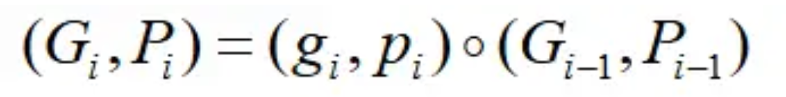

不加证明地给出结论：这个操作满足结合律。因此我们可以把这个操作传播，得到任意跨度进位如下

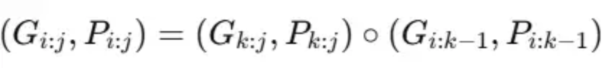

基于该公式，我们可以设计具有超前进位机制的优化的加法器电路。超前进位优化是基于极致的空间换时间，因此会导致加法器面积大量增加。该算法的核心思想是只使用当前An、Bn输入和第一级全加器单元的输入Ci来计算出当前位的进位输出Coi。这里以Kogge-Stone加法器为例，如下图所示。

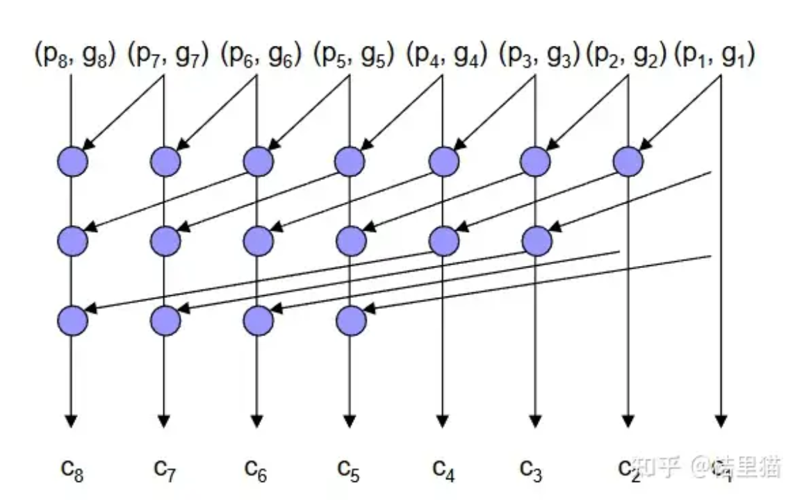

其中P0和G0可以描述为

```verilog
assign P0 = A ^ B;
assign G0 = A & B;
```

由此可以得到第一排PE如下

```verilog
assign P1[0] = P0[0];
assign G1[0] = G0[0];
genvar i;
generate
    for (i=1; i<8; i=i+1) begin
        assign P1[i] = P0[i] & P0[i-1];
        assign G1[i] = G0[i] | (P0[i] & G0[i-1]);
    end
endgenerate
```

对于G2、P2、G3、P3同理，由此计算出第二、第三排PE，最后使用如下代码计算所有进位输出Cout和最终和数Sum的值

```verilog
assign Coi[0] = Cin;
assign Coi[1] = G0[0] | (P0[0] & Cin);
assign Coi[2] = G1[1] | (P1[1] & Cin);
assign Coi[3] = G2[2] | (P2[2] & Cin);
assign Coi[4] = G3[3] | (P2[3] & Cin);
assign Coi[5] = G[4] | (P2[4] & Cin);
assign Coi[6] = G[5] | (P2[5] & Cin);
assign Coi[7] = G[6] | (P2[6] & Cin);

assign Cout = G3[7] | (P2[7] & Cin);
assign Sum = P0 ^ Coi;
```

该电路能够将时间复杂度控制在O(1)，无论加法器有多少位宽，都可以在有限晶体管延迟下完成计算；但电路的规模将随加法器位宽快速膨胀。因此为了平衡电路规模和加速比，可以采用多种局部超前进位的思想，基于不同PE排布形式来得到适合对应应用的加法器结构。

### 硬件电路优化总结

各种电路的基本总结如下图所示

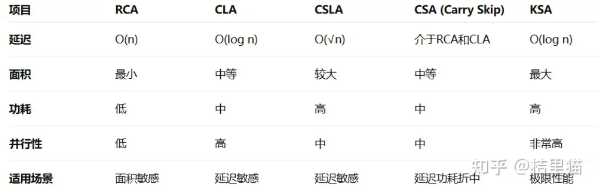

## 参考资料

本文大量文本和图片内容参考了桔里猫大佬的[知乎回答](https://www.zhihu.com/question/504107090/answer/1917153409443825287)与数字集成电路设计课程PPT