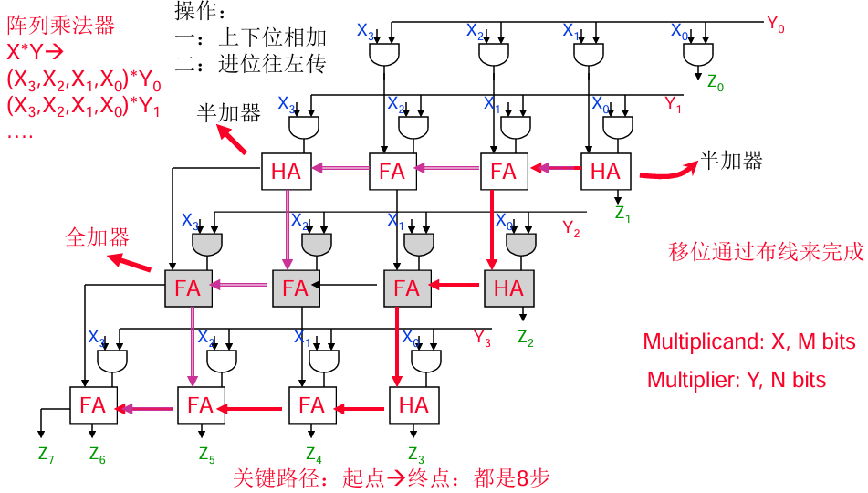
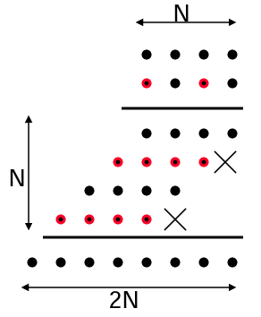

# 数字集成电路设计9【乘法器设计】

乘法器要基于加法器完成设计，因此乘法器的面积要大于同位宽的加法器。

观察竖式乘法的计算过程，我们可以将其简单归结为两步：首先逐位计算乘数得到部分积，然后将全部的部分积相加得到结果。在这个过程中可以发现二进制的乘法运算存在两个特点：

* 部分积从上到下累加
* 累加结果需要先左移一位，对齐后再累加

因此，乘法计算会在加法计算上引入更多操作，最终导致乘法器电路的面积要远远大于同位宽的加法器，这也是很多低成本CPU中不希望引入硬件乘法器的原因。而本章将对乘法器的实现和优化进行讨论

## 乘法器实现

回到乘法原理，如下图所示，一个二进制乘法被分成**计算部分积**和**移位累加**的两个阶段，但在电路实现上，我们希望能够对电路进行复用来同时实现两个计算阶段，即在电路中同时进行相加和进位

在此基础上，观察第一个操作，实际上是利用乘数的第j位依次对被乘数的第i位进行与操作，**部分积的数量等于乘数的位宽，部分积的位宽等于被乘数的位宽**。第二个操作其实可以被拆分成对齐和累加两步。对齐本质上就是对部分积左移j位，然后按照列顺序送入加法器。

比较经典的乘法器实现如下图所示

在该电路中，FA表示全加器，HA表示半加器，Xm是M位被乘数，Yn是N位乘数，Zm+n是积。阵列中使用到半加器作为部分积最低位的加法器来节省面积。进位数据流如图中红色和粉色箭头所示，而无论哪条路径，从右上角起点到左下角终点的关键路径都是8个加法器延迟，因此对于该电路无法通过简单的电路级方案优化

## 乘法器优化

对乘法器的优化一般从算法级入手

### 进位保留乘法器

基于进位保留（Carry-Save）机制的乘法器如下图所示。

图中，所有加法器的进位都被重定向到了下一级的全加器输入，并在最后一行添加了一行向量合并加法器。该设计能够将关键路径减少到7级加法器延迟（走斜线能够省掉一条垂直方向的传递路径），并且对应的关键路径只有从右上方起点到左下方终点的最外层路径（红色箭头所示）

在关键路径唯一的情况下，就可以直接使用加法器一章中提到过的优化方法，针对对应路径上的加法器进行优化而不大幅度增加整个乘法器阵列的面积

### Booth（基4）乘法器

从基础乘法原理上考虑，如果能够将部分积相加的行数减少，就可以降低硬件的延迟。Booth乘法器一般采用去掉奇次项部分积的形式，如下图所示，不计算红色的部分积的值

如下图，将输入数A展开，可以发现它是由2^n奇次项（1、3、5、7等）和偶次项（2、4、6、8等）组合而成。由于其中的2可以提出来，我们就可以把奇次项都去掉，变换为以4为底的偶次项，这样所需要的加法器（对应部分积的数量）就减少到原来的一半。同时，由于出现了系数，在计算之前还需要使用公式将每一项的系数都提前算出来，并完成左移操作

### Wallace Tree乘法器

TODO