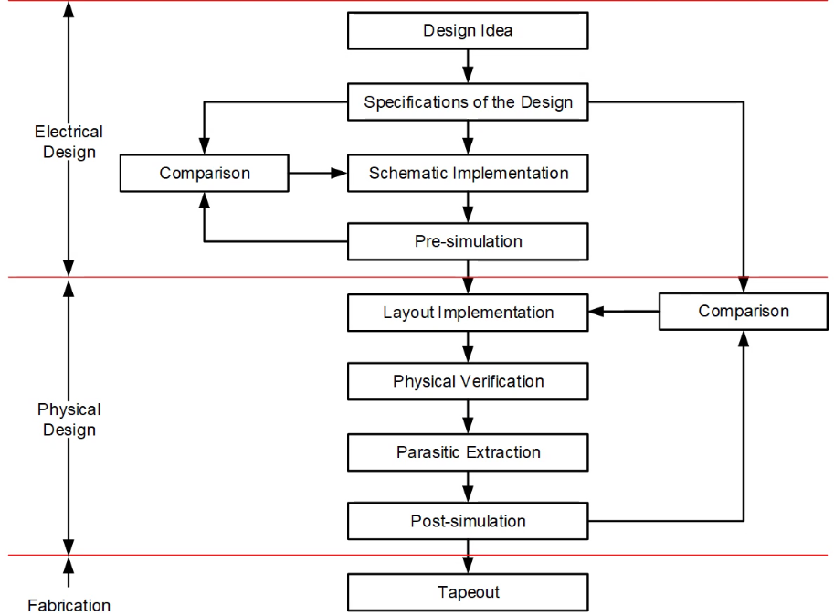

本系列博文参考模集圣经：拉扎维《模拟CMOS集成电路设计》和本校课程PPT编写。笔者也是初学者，如有问题敬请指正

# 模拟集成电路设计1【概论】

学习集成电路设计，可以采用两种极端方法之一：1. 从量子力学开始，通晓固体物理、半导体物理、半导体器件物理、器件模型，最后是电路设计；2. 把每个半导体器件都看成黑箱，使用其端电压电流描述行为，很少考虑器件内部的工作原理。拉扎维指出这两种方法都不是最佳的，第一种方法会让读者看不到各种物理现象与所设计电路之间的关系；第二种方法则会导致设计者对半导体工艺无法做到深入理解，从而对涉及器件物理的问题迷惑不解。因此模拟集成电路设计的学习中既要理解如何针对片上器件特性设计模拟电路，也要能够理解器件的特性由何而来，这就需要同时在**器件物理**和**电路设计**两条主线学习。本系列博文是针对学校所学模拟集成电路设计课程，结合个人理解所写笔记，会以上面两条主线完成模集知识的总结。对于更贴近板级电路的笔记，可以参考笔者《*电路设计从入门到弃坑*》一系列笔记；而更接近器件基础的笔记，可以参考笔者《*从固体物理到半导体物理*》系列笔记。和本文一样，这两个系列博文也在持续更新

## 集成电路设计流程

## MOS器件

## BJT器件

