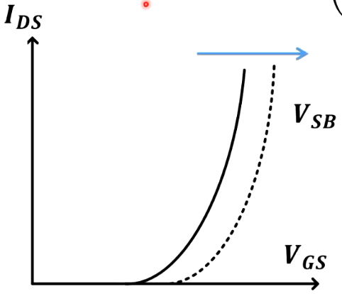

本系列博文参考模集圣经：拉扎维《模拟CMOS集成电路设计》和本校课程PPT编写。笔者也是初学者，如有问题敬请指正

# 模拟集成电路设计1【概论】

> 学习集成电路设计，可以采用两种极端方法之一：1. 从量子力学开始，通晓固体物理、半导体物理、半导体器件物理、器件模型，最后是电路设计；2. 把每个半导体器件都看成黑箱，使用其端电压电流描述行为，很少考虑器件内部的工作原理。

拉扎维指出这两种方法都不是最佳的，第一种方法会让读者看不到各种物理现象与所设计电路之间的关系；第二种方法则会导致设计者对半导体工艺无法做到深入理解，从而对涉及器件物理的问题迷惑不解。因此模拟集成电路设计的学习中既要理解如何针对片上器件特性设计模拟电路，也要能够理解器件的特性由何而来，这就需要同时在**器件物理**和**电路设计**两条主线学习。

本系列博文是针对学校所学模拟集成电路设计课程，结合个人理解所写笔记，会以上面两条主线完成模集知识的总结。对于更贴近板级电路的笔记，可以参考笔者《*电路设计从入门到弃坑*》一系列笔记；而更接近器件基础的笔记，可以参考笔者《*从固体物理到半导体物理*》系列笔记。和本文一样，这两个系列博文也在持续更新

## 集成电路设计流程

## BJT器件

在开始介绍电路前，本部分要先承接半导体器件物理的知识，说明一遍各个器件的特性

首先看比较经典的BJT

### 小信号分析

工作在放大区的BJT需要使用小信号分析，总体过程就是小电压以电流形式输入晶体管，再通过转移特性转换成大电流，加在负载电阻上形成小电压到大电压的转换

### 基区宽度调制效应

如果不考虑基区宽度调制效应，BJT的表达式为
$$
I_C =I_S exp(\frac{q}{kT}V_{BE})
$$
在模拟集成电路中，我们往往使用
$$
I_C =I_S exp(\frac{V_{BE}}{V_T})
$$
其中$V_T=\frac{kT}{q}=26mV$是我们很熟悉的参数

而$I_S$就是饱和漏电流

考虑基区宽度调制效应，BJT的表达式为
$$
I_C=I_S exp(\frac{V_{BE}}{V_T})(1+\frac{V_{CE}}{V_A})
$$
其中$V_A$为Early电压

该表达式就说明了三极管基极会受到集电结偏压的影响而展宽或缩短

## MOS器件

### 工艺基础

Substrate衬底

Poly多晶硅

Via金属通孔

Contact接触

Diffusion/Active扩散区/有源区

IMP implanted

实际MOSFET的栅极材料一般采用poly而不是金属，因为poly和半导体之间的功函数匹配更好

自对准工艺（self-aligned process）：先制作栅极再在两侧制作漏极和源极的工艺

模拟集成电路不需要太先进的工艺制程——因为晶体管大一点有好处。晶体管太小会导致输入阻抗变小；能通过的电流变小；而外接电容仍然很大，工艺尺寸小也无法缩减电路尺寸

### 从按比例缩小理论到摩尔定律

> 登纳德缩放定律：晶体管在满足内电场恒定（即每代芯片的供电电压降低30%）条件下，晶体管尺寸每代（约两年）减少30%。
>
> 摩尔定律：数字集成电路中每单位面积上可以容纳的晶体管数量在每隔一年（现）时间会增加一倍
>
> 推论：晶体管密度每代翻倍，同时晶体管延时降低30%，功耗降低50%，能耗降低65%

> 拉扎维17.1节

### 基本公式

在模拟集成电路中，我们主要关心器件具有放大性质的工作区域，因此对于MOS管，我们主要研究其在饱和区的工作状态

**饱和电压**
$$
V_{DS(sat)}=V_{GS}-V_{TH}
$$
**饱和区下MOSFET转移特性曲线**：
$$
I_{DS}=\frac{1}{2} C_{ox}\mu_n \frac{W}{L} (V_{GS}-V_{TH})^2
$$
由于$C_{ox} \mu_n \frac{W}{L}$是MOSFET的工艺参数，我们可以将其作为$K'$整体使用，即
$$
I_{DS}=\frac{1}{2} K' (V_{GS}-V_{TH})^2
$$

同时，根据半导体器件理论，在$V_{DS}=V_{GS}-V_{TH}$时，MOSFET反型区恰好夹断，我们将这个**夹断电压**描述为过驱动电压（Overdrive Voltage，OV），用$V_{OV}$表示
$$
V_{OV}=V_{GS}-V_{TH}
$$
也就是$V_{DS}=V_{OV}$时候，反型区夹断，这个电压也就是$V_{DS(sat)}$

> 补充一下线性区下MOSFET的转移特性曲线为
> $$
> I_{DS}=\mu_n C_{ox} \frac{W}{L} [(V_{GS} -V_{TH})V_{DS} -\frac{1}{2} V_{DS}^2]
> $$
> 因此线性区下MOSFET的转移特性曲线是一条抛物线

### 沟道长度调制效应

由于$V_{DS}$引起的效应，会改变MOSFET的放大倍数

在考虑沟道长度调制效应的情况下，修改基本公式为
$$
I_{DS}=\frac{1}{2} \mu_n C_{ox} \frac{W}{L} (V_{GS} -V_{TH})^2 (1+\frac{V_{DS}}{V_A})
$$
其中Early电压$V_A=\frac{I_D}{\partial{I_D}/\partial{V_{DS}}}=L_{eff} (\frac{dx_d}{dV_{DS}})^{-1}$

令$\lambda=\frac{1}{V_A}$，则有
$$
I_{DS}=\frac{1}{2} \mu_n C_{ox} \frac{W}{L} (V_{GS} -V_{TH})^2 (1+\lambda V_{DS})
$$
这个公式是集成电路设计中比较常用的“精确”公式

**如果提供了条件$\lambda=0$，可以视为忽略沟道长度调制效应**

### 体效应

一句话描述体效应：由于源极和体极之间的偏压$V_{SB}$导致的阈值电压的变化，**$V_{SB}$增大会导致$V_{TH}$增大**，进而导致同等$V_{GS}$的情况下得到的$I_{DS}$减小

> 在后面的Cascade放大器中，需要额外注意体效应的影响

原因如下式所述
$$
V_{TH}(V_{SB})=V_{TH0}+\gamma (\sqrt{2\phi_{f} + V_{SB}} -\sqrt{2\phi_{f}})
$$
其中$\phi_f$就是费米势$\phi_{FP}$，$V_{TH0}$是不计算体效应情况下的阈值电压

体效应常数
$$
\gamma =\frac{1}{C_{ox}} \sqrt{2qN_A \epsilon_s \epsilon_0}
$$

随着$V_{SB}$增大，相同$V_{GS}$下的电流降低，导致MOSFET导电能力下降

**如果提供$\gamma = 0$，可以视为忽略体效应**

### 短沟道效应

> 拉扎维17.2节
