# 模拟集成电路设计2【小信号模型】

## 跨导

**在小信号分析中，输入、输出关系可以被视作线性**

小电压输入，小电流放大输出的电路中，存在
$$
V_i=V_Q +v_i,I_O=I_Q +i_o
$$
上式描述了小信号分析中在晶体管上叠加的偏置电压$V_Q$电流$I_Q$和小信号电压$v_i$电流$i_o$，它们之间存在关系
$$
I_O=f(V_i V_{out})
$$
定义**跨导**为输出电流和输入电压在输出电压为定值情况下的偏导，也就是小信号输出电流和小信号输入电压的比值
$$
g_m=\frac{i_o}{v_i}=\frac{\partial I_o}{\partial V_i}|_{V_o}
$$
下面我们来分析各种不同器件工况下的跨导

* 对于BJT，我们已经有低频下BJT的转移特性：
    $$
    I_{C} =I_{S} exp(\frac{V_{BE}}{V_T}) (1+\frac{V_{CE}}{V_A})
    $$
    **BJT的跨导可以表示为**
    $$
    g_m=\frac{\partial I_C}{\partial V_{BE}}|_{V_{CE}}=\frac{I_{C}}{V_T}
    $$
    其中
    $$
    V_T=\frac{kT}{q}
    $$
    也就是说**跨导只和三极管的集电极电流有关**，和三极管的形状尺寸无关
    
* **对于MOSFET，跨导可以表示为**
    $$
    g_m=\frac{\partial I_D}{\partial (V_{G} -V_{TH})}=\frac{2I_{D}}{V_{OV}}
    $$
    其中$V_{OV}=V_{GS}-V_{TH}$，我们对其进行展开，
    $$
    V_{OV}=V_{GS}-V_{TH}=\sqrt{\frac{2I_{DS}}{\mu_n C_{ox} \frac{W}{L} (1+\lambda V_{DS})}}
    $$
    再代入回原式得到
    $$
    g_m=\sqrt{2 \mu_n C_{ox} \frac{W}{L} (1+\lambda V_{DS}) I_{DS}}
    $$
    忽略沟道长度调制效应时，有$\lambda = 0$，我们也可以使用下式描述
    $$
    g_m =\sqrt{2 \mu_n C_{ox} \frac{W}{L} I_{DS}}
    $$
    也就是说**MOSFET的跨导与$\sqrt{V_{DS}}$ 成正比**，核心思想是增大$V_{DS}$就是增大$V_{OV}$，从而增大跨导
    
* 特别地，对于MOSFET，还具有**亚阈值区**（Subthreshold），在这一情况下，
    $$
    I_{DS}=I_{DC} \frac{W}{L} exp(\frac{V_{GS}}{nV_T})
    $$
    其中*n在1.5左右*

    带入$g_m$定义式得到
    $$
    g_m=\frac{I_{DS}}{nV_T}
    $$

## 小信号等效电路

有了跨导，我们就能画出各个器件的小信号等效电路了

### 低频下MOSFET

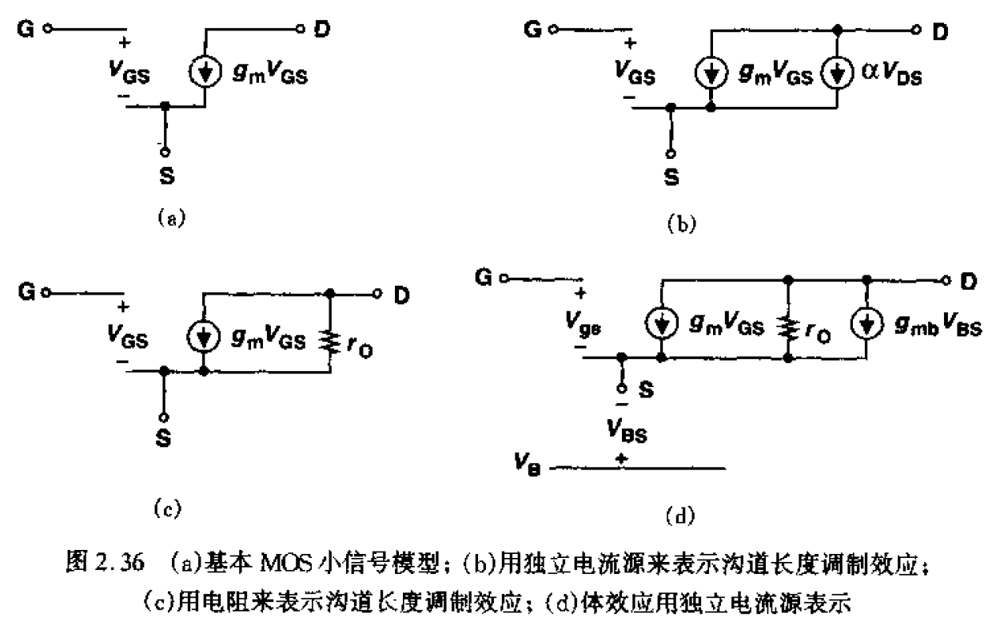

在上面这些等效电路中，比较常用且相对精确的等效电路是图（d）：

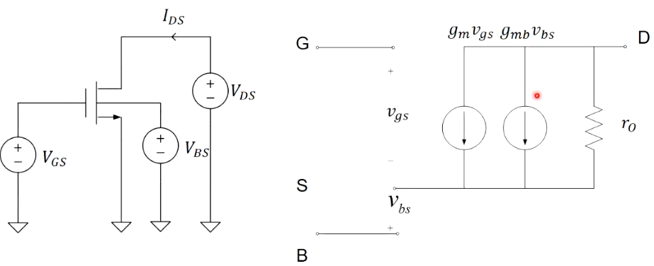

$g_m$已经介绍过，而其中**输出电阻**$r_O$来自于沟道长度调制效应，有基本表达式
$$
r_O=\frac{1}{\lambda I_{DS}}
$$
λ是沟道长度调制因子，L越大，λ越小，输出电阻$r_O$越大

> 一个经验表达式
> $$
> \lambda \propto \frac{1}{L\sqrt{V_{DS} -V_{DS(sat)} +\phi_f}}
> $$
> 

我们即想要大的输出电阻，又想要更小的L（L和W是相辅相成的，MOSFET越大开关速率/高频性能越差），于是实际电路中采用特殊的电路拓扑

再来说一下$g_{mb}$，这个电导来源于体效应。之前一篇文章提到过体效应的表达式
$$
V_{TH}(V_{SB})=V_{TH}+\gamma (\sqrt{2\phi_{f} + V_{SB}} -\sqrt{2\phi_{f}})
$$
对其带入$g_m$的公式，化简后可以得到
$$
g_{mb}=g_m \chi
$$
其中$\chi$是对体效应的一个抽象表达

> 体效应可以理解成在栅极控制之外引入了一个体极“栅”，于是MOSFET同时会受到栅极电容和体极电容的影响

表达式为
$$
\chi =\frac{\gamma}{2\sqrt{V_{SB} +2\phi_f}}
$$
这样我们就得到了MOSFET的低频小信号等效电路

### 高频下MOSFET

*进入高频以后，MOSFET各个区域结带来的电容效应开始显现*

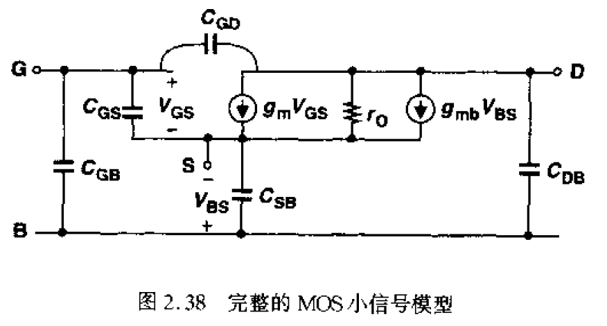

如果去掉上面的已知项目，可以得到下图

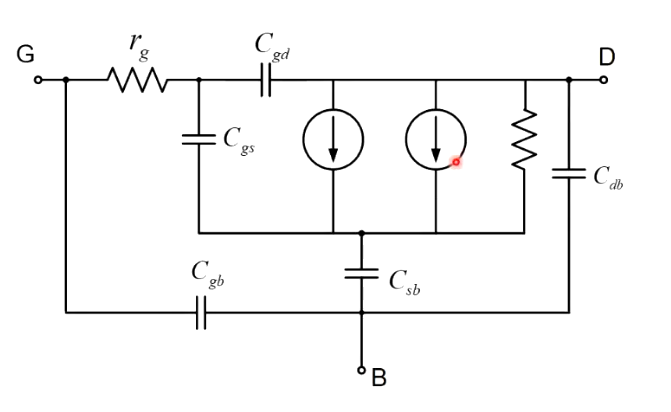

特别地，该图中包含了高频交流小信号等效电阻$r_g$，它来自于**高频小信号下栅极多晶硅的电阻**效应

覆盖电容$C_{GB}$由G极绝缘层（Poly）露出多晶硅的面积和体极形成，也可以将其称为$C_{OL}$

$C_{GS}$是栅极和沟道之间的电容，它和$C_{GD}$电容一样都是由MOSFET器件的结构（氧化层和G、D、S三极都接触，把它们隔离开，从而形成了平板电容）带来的。这两个电容相加几乎等于栅极电容

* 工作在**三极管区**时
    $$
    C_{GS}=C_{GD}=\frac{1}{2} C_{ox} WL + C_{OL}
    $$
    其中$C_{OL}$是栅极氧化层覆盖电容

* 工作在**饱和区**时
    $$
    C_{GS}=\frac{2}{3} C_{ox} WL + C_{OL},C_{GD}=C_{OL}=C_{ox} WL_D
    $$
    饱和区情况下，由于发生沟道夹断，栅极只和源极相连，不与漏极相连

    并且$C_{GS} \gg C_{GD}$

    > 需要注意：由于米勒定理，实际的$C_{GD}$是非常重要的，它会被乘以本征增益后反馈回来（**米勒电容**）。这一点会在之后提及

$C_{SB}$电容表征了体效应

$C_{DB}$是体效应电容的体现，源于漏极和体极相隔

### 低频下BJT

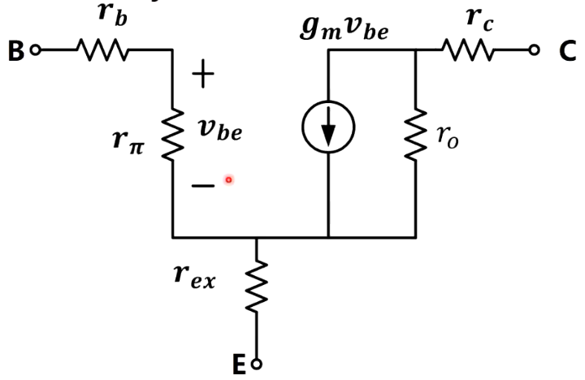

低频下的BJT小信号等效电路如上图所示。$g_m$已经在之前介绍过。$r_{b},r_{c},r_{ex}$都是物理电阻；而$r_\pi,r_O$是小信号参数等效电阻，并不是物理电阻

一般来说，$r_\pi$是输入电阻，在任何情况下都需要分析；$r_b$在高频时很重要；而$r_c$和$r_{ex}$一般比较小，可以忽略

对于BJT，**输入电阻**$r_\pi$是相较MOSFET最特殊的一点（MOS没有输入电阻）
$$
r_\pi=r_i=\frac{1}{g_m} \beta=\frac{V_T}{I_{C}} \frac{I_{C}}{I_{B}}=\frac{V_T}{I_{B}}
$$
**输出电阻**
$$
r_O=\frac{V_A}{I_{C}}
$$

### 高频下BJT

高频下的BJT小信号等效电路如下图所示

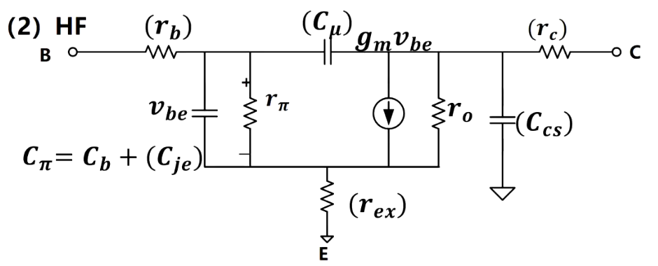

在低频等效电路的基础上又加入了

$C_\mu$，相当于MOSFET的$C_{GD}$

$C_\pi$，输入电容，存在
$$
C_\pi=C_{BE}+C_{jE}=g_m \tau_B
$$
相当于一个物理电容和一个PN结等效电容的组合。$\tau_B$是经典的**基区渡越时间**，表示为$\tau_B=\frac{x^2_B}{2D_n}$

## 三种输入电阻

对于输入电阻，我们通常关心下面三种情况

* 基极/栅极输入电阻
* 集电极/漏极输入电阻
* 发射极/源极输入电阻

下面就要给出MOSFET和BJT小信号模型中这3x2=6种情况的输入电阻公式

### 栅极输入电阻

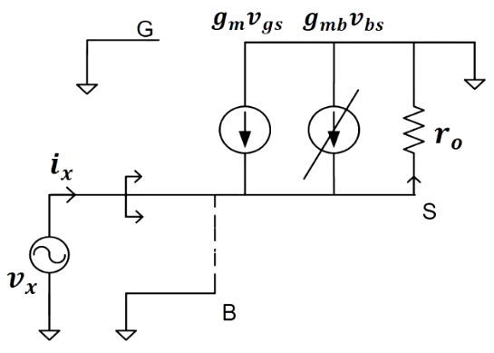

从栅极向MOSFET看去的输入电阻为
$$
R_i=\frac{1}{g_m}//r_O \approx \frac{1}{g_m}
$$
特别地，如果考虑体效应，可以得到下面的小信号等效电路

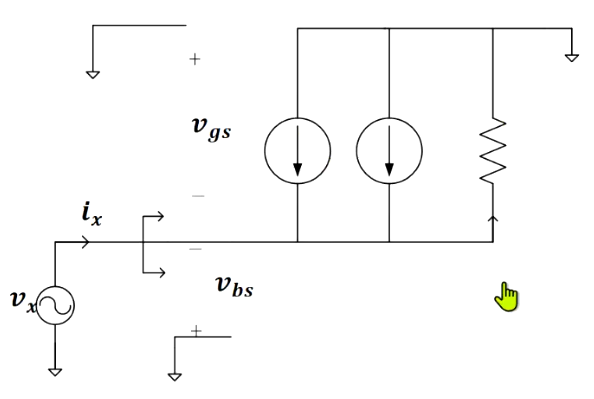

有公式
$$
R_i=\frac{1}{g_m +g_{mb}}//r_O \approx \frac{1}{g_m +g_{mb}}
$$

### 二极管连接

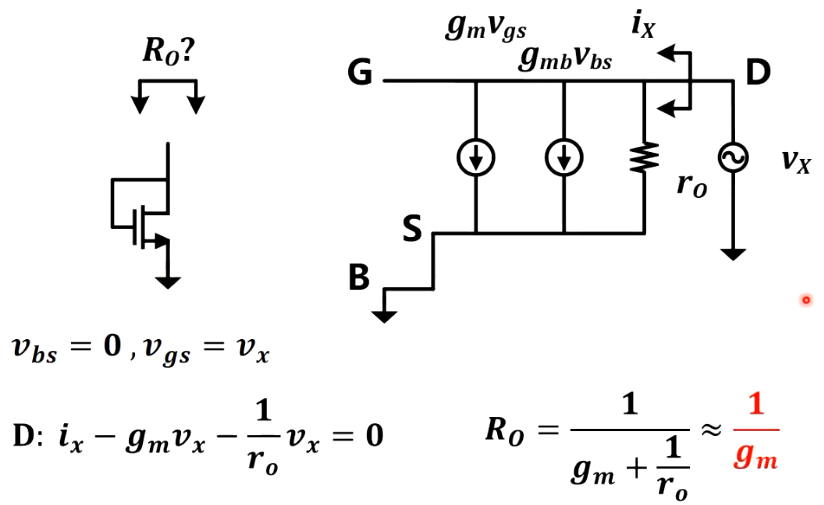

这种漏极和栅极相连的拓扑被称为MOSFET的二极管连接，其输出电阻为
$$
R_O =\frac{1}{g_m} //r_O
$$

### 从漏极看向MOSFET的内阻

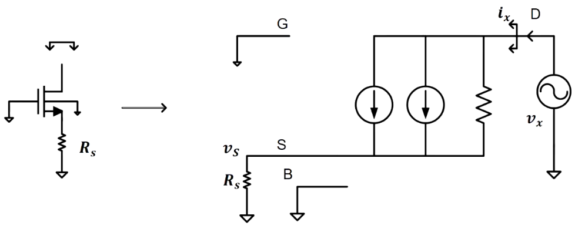

内阻为
$$
R_O=r_O + [1+(g_m + g_{mb})r_O] R_S=r_O[1+(g_m +g_{mb})R_S] +R_S
$$
其中$R_S$是源区电阻，由于$R_S$很小，可以忽略，我们就能得到
$$
R_O\approx r_O (g_m +g_{mb}) R_S
$$
也就是近似于自然的源区电阻$R_S$被**放大**了$(g_m +g_{mb}) r_O$倍

实际计算中，我们可以使用公式
$$
R_O=r_O + [1+(g_m + g_{mb})r_O] R_S
$$
并在忽略体效应的情况下得到	
$$
R_O=r_O + (1+g_m r_O) R_S
$$

### 从源极看向MOSFET的内阻

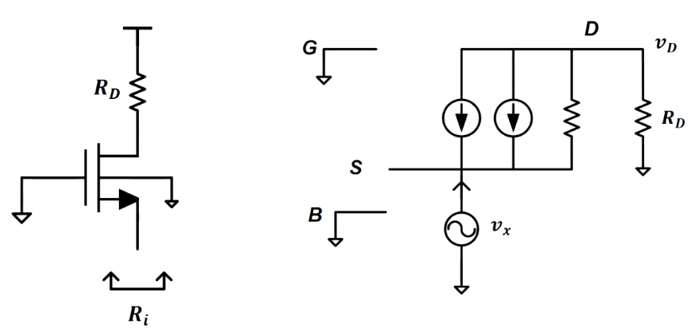

内阻为
$$
R_i=\frac{r_O +R_D}{1+(g_m +g_{mb})r_O}
$$
其中$R_D$是漏区电阻，在$R_D$很小的情况下，我们可以发现
$$
R_i \approx \frac{1}{g_m + g_{mb}} \frac{r_O +R_D}{r_O}
$$
近似于自然的输入电阻$R_D$被缩小了$(g_m +g_{mb})r_O$倍

### BJT的三种输入电阻关系

1. 基极输入电阻
    $$
    r_i=r_\pi =\frac{\beta}{g_m}
    $$
    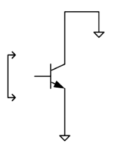

    由于$g_m$通常为10mS量级，输入电阻约为kΩ量级

2. 集电极输入电阻
    $$
    r_i= r_o =\frac{V_A}{I_C}
    $$
    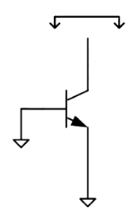

    输入电阻约为100kΩ左右

3. 发射极输入电阻
    $$
    r_i =r_\pi // r_o // \frac{1}{g_m} \approx \frac{1}{g_m}
    $$
    

    输入电阻和基极的输入电阻基本在同一个数量级，但更小（1<β）

综上所述，我们可以得到三种情况下BJT的输入电阻和CMOS三种情况的输入电阻很类似

### 带$R_E$的三种BJT输入电阻关系

1. 基极输入电阻

    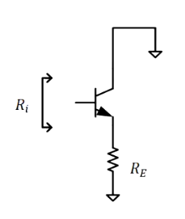

    和MOSFET版本拓扑很像，有公式
    $$
    r_i=r_\pi +(r_o //R_E)(1+g_m r_\pi) \approx (1+g_m r_\pi ) (r_o // R_E)
    $$
    也就是$r_o //R_E$被放大了$1+g_m r_\pi$倍

2. 集电极输入电阻

    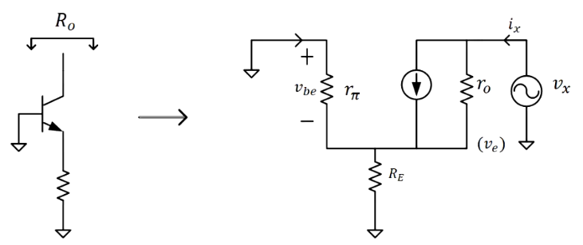
    $$
    R_O =r_o[1+g_m (r_\pi // R_E)] +r_\pi //R_E
    $$

3. 发射极输入电阻

    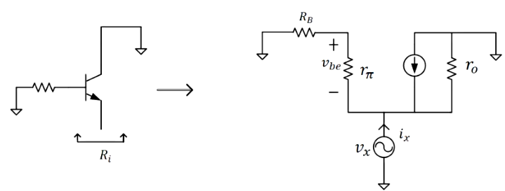
    $$
    ·R_i = \frac{1}{g_m} +\frac{R_B}{1+ \beta}
    $$
    

## 双端口网络结论

对于双端口网络，放大倍数
$$
A_V =-G_M R_O
$$

其中$R_O$是输出电阻，$G_M$是跨导
$$
G_M=\frac{i_o}{v_i}
$$
即输出电流与输入电压的比值

**大负载表现为需要大电流来驱动，这就意味着相同电压下电阻越小负载越大**。负载电阻小（大负载情况）会极大程度拉低$R_0$，使得$A_V$严重削减
