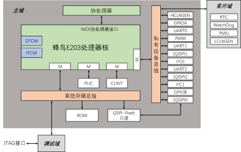

# RISC-V架构的中断与异常

一般来说由处理器内部的事件或程序执行中的事件引起的程序跳转称为异常；一般的由处理器外部因素引起的程序跳转称为中断

广义上来说中断和异常都被处理器视为**异常**，一般将其分为**同步异常**和**异步异常**

## 同步异常

**同步异常**：由于执行程序指令流或者试图执行程序指令流而造成的异常

表现：CPU外部环境一定，多次执行时每次能够精确复现

常见的同步异常包括但不限于：

* 取指令访问到非法的地址区间
* 读写数据访问地址属性出错
* 取指令地址非对齐错误
* 非法指令错误
* 执行调试断点指令

## 异步异常

**异步异常**：产生原因不能被精确定位于某条指令的异常

表现：CPU外部环境一定，但是每次发生异常的指令PC都可能会不一样

最常见的异步异常就是*外部中断*。外部中断的发生和中断请求到达时处理器执行的指令都是不确定的，这就导致很难出现反复执行同一条指令时恰好发生外部中断。==外部中断也因此常常被直接用“异步异常中断”指代==

根据处理器响应异常后的状态，可以分为精确异步异常和非精确异步异常

### 精确异步异常

响应异常后处理器状态能精确反映为某一条指令的边界

* 外部中断狭义来讲就是一种精确异步异常：执行完以后还会返回到原来断开的指令处继续执行

### 非精确异步异常

响应异常后处理器状态不能精确反映为某一条指令的边界

* 读写存储器出错是一种最常见的非精确异步异常

  访问存储器时处理器还会接着执行指令，如果在此期间出现了访问错误进而触发异常，处理器会在处理到之后的某条指令时进入异常服务程序，难以预测当前执行到了哪个指令

  写入缓存行时，也可能发生类似的错误，具体的原理与访问情况类似

## 异常处理机制

RISC-V架构要求必须实现机器模式的异常处理机制，蜂鸟E203也只实现了机器模式

RISC-V对于异常处理的实现相对简单，并不如ARM Cortex系列CPU那样具有复杂的NVIC或GIC中断控制器

执行异常处理的流程如下：

### 进入异常

该过程在RISC-V架构中定义为**陷阱**（Trap），也就是“进入异常”

1. 停止执行当前程序流，转而从CSR寄存器mtvec定义的PC地址开始执行

   mtvec即机器模式异常入口基地址寄存器（Machine Trap-Vector Base-Address Register）

   这是一个可读写的CSR寄存器，可使用软件编程。mtvec寄存器的低2位是MODE域，当MODE=0时，所有异常响应时处理器跳转到BASE值指示的PC地址；当MODE=1时，会分情况参考mtvec寄存器的高30位BASE域：由CPU内部引发的狭义异常出现时，CPU跳转到BASE值指定的PC地址，当由CPU外部引发的狭义中断出现时，CPU跳转到BASE+4*CAUSE值指示的PC地址，其中CAUSE值表示中断对应异常编号，也就是中断号

   在配合使用SoC时通常会使用MODE=1的情况，这样机器就能对外部中断进行更好的响应

2. 让硬件更新几个CSR寄存器

   * 机器模式异常原因寄存器mcause（Cachine Cause Register）

     用于反映当前的异常种类，软件可以查询该寄存器来了解异常原因

   * 机器模式异常PC寄存器mepc（Machine Exception Program Counter）

     异常的返回地址由mepc保存，进入异常时硬件会自动将mepc更新为当前遇到异常的指令PC值，特别地，软件也可以更改这个寄存器，这样就会导致从异常返回时跳转到其他地方

     对中断而言，mepc的值保存为下一条尚未执行的指令

     对异常而言，mepc的值被更新为当前发生异常的指令PC，这样有助于在异常服务程序中修正当前指令出现的错误；但是如果异常由ecall或ebreak造成，mepc的值会被更新为ecall或ebreak指令自己的PC，在指令返回时如果直接使用mepc保存的PC值将导致跳回ecall或ebreak导致死循环。需要在异常处理程序中用软件改变mepc=mepc+4或mepc=mepc+2

   * 机器模式异常值寄存器mtval（Machine Trap Value Register）

     进入异常时硬件会自动更新mtval来反映引起当前异常的存储器访问地址或指令编码：对于存储器访问异常会保存指令访问的地址，对于非法指令，则会保存该指令的编码

   * 机器模式状态寄存器mstatus（Machine Status Register）

     mstatus的某些域会在进入异常时被改写。

     MPIE域的值更新位异常发生前MIE域（表示机器模式下中断的开/关，1为全局打开，0为全局关闭）的值，由此能够使用MPIE的值恢复出异常发生前MIE的值；MIE则会被置0，进入异常服务程序后全局中断关闭；MPP（用于记录异常发生之前的工作模式，对只支持机器模式的CPU来说MPP的值永远是2'b11）的值会被更新到异常发生之前的状态

**中断等待**：就是等待当前发生的中断被处理，简单理解成指示中断发生的标志即可

### 执行异常服务程序

以下为执行分支异常处理的异常服务程序片段

通过读取mcause的值来判断异常的类型，进而进入不同的异常服务子程序

**特别注意：RISC-V中规定进入和退出异常机制中没有硬件自动保存和恢复上下文的操作，软件需要明确地使用指令进行上下文的保存和恢复**

```c
uintptr_t handle_trap(uintptr_t mcause,uintptr_t epc)
{
    if(0)
    {
        //来自PLIC的外部中断
    }
    else if((mcause & MCAUSE_INT) && (mcause & MCAUSE_CAUSE)==IRQ_M_EXIT)
    {
        handle_m_ext_interrupt();//来自PLIC的外部中断
    }
    else if((mcause & MCAUSE_INT) && (mcause & MCAUSE_CAUSE)==IRQ_M_TIMER)
    {
        handle_m_time_interrupt();
    }
    else
    {
        write(1,"trap\n",5);
        _exit(1+mcause);
    }
    return epc;
}
```

PLIC在之后的SoC部分讲述

### 退出异常

RISC-V定义了一组**退出异常指令**，软件在机器模式下必须使用MRET退出异常，这会导致

1. 停止执行当前程序流，从CSR寄存器mepc定义的PC值开始执行

   恢复现场，可以继续之前被终止的程序流

2. 同时更新CSR寄存器机器模式状态寄存器mstatus

   * MIE域的值被更新为当前MPIE的值
   * MPIE域的值被更新为1（打开全局中断）

## 中断分类

RISC-V定义了4种中断类型，大体上和ARM架构的中断类似，中断类型选取都是通过屏蔽寄存器来控制，下面所说的由xx寄存器控制就是指由xx寄存器来负责屏蔽某种中断类型

* 外部中断External Interrupt

  来自核心外的中断，常见的GPIO、UART中断都属于这个中断

  由CSR寄存器mie中的MEIE控制，等待标志反映在CSR寄存器mip中的MEIP域

* 定时器（也就是计时器）中断Timer Interrupt

  来自定时器的中断

  由mie寄存器的MTIE域控制，等待标志反映在mip寄存器中的MTIP域

* 软件中断Software Interrupt

  来自软件自己触发的中断

  由mie寄存器中的MSIE域控制，等待标志反映在mip寄存器的MSIP域

* 调试中断Debug Interrupt

  用于实现调试器的中断

RISC-V定义了一个**平台级别中断控制器PLIC**（Platform Level Interrupt Controller），可用于多个外部中断源的优先级仲裁和派发

PLIC可以将多个外部中断源仲裁为一个bit的中断信号送入处理器核，处理器核接收到中断进入异常服务程序后可以通过读PLIC的相关寄存器查看中断源的编号和信息，在处理完响应中断服务程序后可以通过写PLIC的相关九年起和外部中断源寄存器来清除中断源

==PLIC就相当于RISC-V上的弱化版NVIC==

RISC-V规定系统平台至少有一个定时器，并应配由2个64位寄存器mtime（反映当前定时器的计数值）和mtimecmp（设置计时器比较值），当mtime中的计数值大于等于mtimecmp中设置的比较值时，计时器就会产生计时器中断，中断期间会一直拉高直到重写mtimecmp的值大于mtime中的值

特别地，两个定时器寄存器不归属于CSR寄存器，而是定义为存储器地址映射的系统寄存器，由配套SoC控制，这样就使得位于内核中的定时器变成了“一半外设”

这个定时器的时钟必须是为低速（意味着省电）的电源常开（意味着准确稳定）的时钟，它是一种实时计时器

## 中断屏蔽

RISC-V中狭义上的异常是不可屏蔽的，但狭义上的中断可以被屏蔽

CSR寄存器中的机器模式中断使能寄存器mie负责控制中断的屏蔽，这就是上面所说的

* MEIE控制外部中断
* MTIE控制计时器中断
* MSIE控制软件中断

## 中断等待

和中断屏蔽部分类似，中断等待在之前的中断分类部分列出，需要注意等待寄存器的属性都是只读，软件无法写入，只有这些中断的源头被清除后才能将中断源撤销

中断的撤销方法会在下面的SoC部分介绍

## 中断优先级与嵌套中断

**RISC-V中不存在高优先级中断可以打断低优先级中断的硬件支持**

外部中断来自PLIC，所以外部中断的优先级由PLIC控制，但是最后决定执行中断的还是CPU

细心的读者可能注意到：RISVC-V架构CPU在进入中断后会关闭全局中断，也就是说**进入中断后无法响应新的中断**，这就导致只能使用软件方式才能实现中断嵌套

理论上可以使用如下方法：

1. 进入异常后，软件查询mcause确认中断造成异常，执行中断服务程序

2. 强行改写mstatus的值，将MIE域的值改为1

   在此环节，需要配置mie寄存器中的MEIE/MTIE/MSIE域来选择性屏蔽不同类型的中断

   还要配置PLIC阈值寄存器来选择性屏蔽不同优先级的中断

3. 在嵌套中断发生前，软件必须将上下文保存在存储器堆栈内，并在嵌套中断服务函数执行完毕后恢复上下文

   这里的上下文不仅包括控制寄存器、通用寄存器组，还包括mepc寄存器等其他CSR寄存器的值，否则就会导致程序跑飞

# SoC对中断的处理

下图是蜂鸟E203的系统结构框图



蜂鸟E203的SoC只支持机器模式定义的中断，且不支持MPU、MMU（不会生成虚拟地址页错误异常）

支持3种基本中断类型，但不支持JTAG调试中断，这需要使用调试器来进行

mtvec寄存器最低位MODE域仅支持模式0，在异常响应时处理器跳转到BASE域指示的PC地址，这就需要使用软件来判断异常类型

对于同步异常，mepc值更新为发生异常的指令PC值；对于精确异步异常，mepc更新为下一条尚未执行的指令PC值；非精确异步异常，mepc更新为当前发生异常的指令PC值

## CLIENT模块

CLIENT即**处理器核局部中断控制器**（Core Local Interrupts Controller）

用于产生计时器中断和软件中断

它作为一个存储器地址映射的模块，可以说是一个片上外设，只支持操作尺寸为32位的读写访问

CLIENT内有一个32位的msip寄存器，其最低位是有效位，会被直接作为软件中断信号送到处理器核，写1可以进入中断等待，写0可以清除中断

当且仅当全局中断和软件中断局部中断被打开时才能响应软件中断

同时CLIENT内还设置了mtime计数寄存器和mtimecmp比较寄存器，上电后默认会进行计数，**在使用中一般不直接操作CPU的寄存器，而是通过存储器地址映射操作CLIENT的寄存器来达到控制核内定时器的效果**

## PLIC与外部中断

PLIC被挂载到专用的总线接口，直接对内核负责

蜂鸟E203的配套SoC中实现了RISC-V规定的PLIC，可以实现类似ARM的NVIC的功能

SoC的外部中断源一共有53个，其中**0被预留表示不存在的中断**，每个**中断号和中断源一一对应**

PLIC寄存器只支持操作尺寸为32的读写访问。

E203的PLIC仅支持单内核机器模式，所以禁用到了PLIC的Target 0

理论上PLIC能够支持1024个中断源，但因为SoC外设不多，只支持了53个中断源，但是还预留有剩下的中断源空间。

# 总结

RISC-V（蜂鸟E203）的中断、异常处理机制比较简单，但是仍然可以用类似ARM Cortex-M系列的理念套用，也是外设中断控制器作为“丞相”，CPU当“皇帝”的思路，使用中断屏蔽机制来初步筛选中断类型；最大的不同就在于RISC-V将更多的任务扔给了软件实现