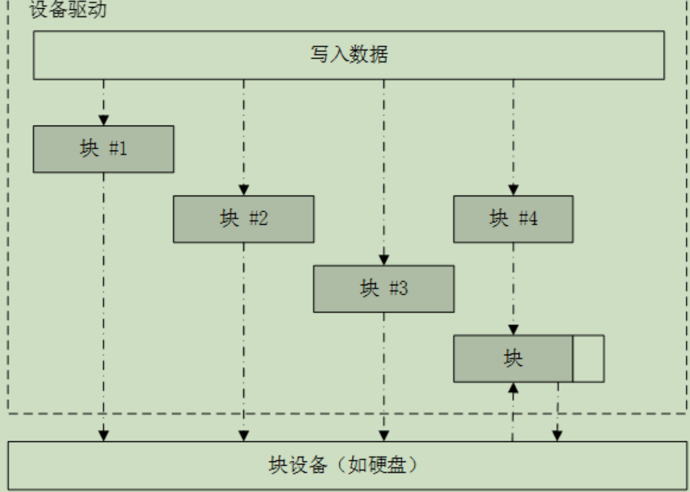

# I/O设备

## IO设备模型框架

RTT提供了一套简单的IO设备模型框架，**位于硬件和应用程序之间**，分成三层，从上到下分别是IO设备管理层、设备驱动框架层、设备驱动层，示意图如下所示


应用程序通过IO设备管理层提供的接口获取设备驱动，然后通过设备驱动与底层IO硬件进行数据交互或进行控制

**IO设备管理层封装了设备驱动程序**

应用程序通过IO设备层提供的标准接口访问底层设备，所以设备驱动程序的升级、更替不会对上层应用产生影响，应用程序可以更好地在RTT支持的设备间移植，提高系统可靠性和代码可移植性

驱动设备框架层是对**同类**硬件设备驱动的抽象，及那个同类设备中相同的部分抽取出来，不同的部分则留出接口，方便驱动程序的使用

**设备驱动层是一组驱动程序组成的**

驱动程序负责创建和注册IO设备、访问硬件设备。设备驱动根据设备模型定义，创建出具备硬件访问能力的设备实例，通过接口rt_device_register()注册到IO设备管理器中。应用程序通过接口rt_device_find()查找设备并通过IO设备管理接口来访问硬件。驱动的管理由**IO设备管理器**完成

一些特殊的设备（如看门狗等），会==先将创建的设备实例先注册到对应的设备驱动框架，再由设备驱动框架向IO设备管理器进行注册==（使用rt_hw_watchdog_register()一类的接口注册到看门狗设备驱动框架并使用rt_device_register()接口注册到IO设备管理器），使用时应用程序先使用IO设备管理器接口，股那里其再调用驱动框架接口，最后才调用看门狗设备驱动

**RTT借用了Unix及类Unix系统“万物皆文件”的思想**

## IO设备模型

IO设备模型继承自内核对象模型，**将设备看作一类对象**，每个设备对象都是由基对象派生而来，每个具体设备都可以继承其父类对象的属性并派生出其私有属性（就是对象的继承特性）

设备对象定义如下

```c
struct rt_device
{
    struct rt_object          parent;//对内核对象基类的继承
    enum rt_device_class_type type;//设备类型
    rt_uint16_t               flag;//设备参数
    rt_uint16_t               open_flag;//设备打开标志
    rt_uint8_t                ref_count;//设备被引用次数
    rt_uint8_t                device_id;//设备ID，限制为0-255

    /* 数据收发回调函数 */
    rt_err_t (*rx_indicate)(rt_device_t dev, rt_size_t size);
    rt_err_t (*tx_complete)(rt_device_t dev, void *buffer);
#ifdef RT_USING_DEVICE_OPS
    const struct rt_device_ops *ops;//是否使用设备接口访问设备
#else
    /* 通用设备接口 */
    rt_err_t  (*init)   (rt_device_t dev);
    rt_err_t  (*open)   (rt_device_t dev, rt_uint16_t oflag);
    rt_err_t  (*close)  (rt_device_t dev);
    rt_size_t (*read)   (rt_device_t dev, rt_off_t pos, void *buffer, rt_size_t size);
    rt_size_t (*write)  (rt_device_t dev, rt_off_t pos, const void *buffer, rt_size_t size);
    rt_err_t  (*control)(rt_device_t dev, int cmd, void *args);
#endif
#if defined(RT_USING_POSIX)
    const struct dfs_file_ops *fops;//是否使用dfs
    struct rt_wqueue wait_queue;//设备等待队列
#endif
    void *user_data;//用户数据
};
typedef struct rt_device *rt_device_t;//封装为设备对象句柄

//RTT支持很多设备类型，以下是它们的枚举结构
enum rt_device_class_type//设备类型
{
    RT_Device_Class_Char = 0,//字符设备
    RT_Device_Class_Block,//块设备
    RT_Device_Class_NetIf,//网络接口
    RT_Device_Class_MTD,//内存
    RT_Device_Class_CAN,//CAN总线设备
    RT_Device_Class_RTC,//RTC设备
    RT_Device_Class_Sound,//声音设备
    RT_Device_Class_Graphic,//图形设备
    RT_Device_Class_I2CBUS,//I2C总线设备
    RT_Device_Class_USBDevice,//USB device设备
    RT_Device_Class_USBHost,//USB host设备
    RT_Device_Class_SPIBUS,//SPI总线设备
    RT_Device_Class_SPIDevice,//SPI设备
    RT_Device_Class_SDIO,//SDIO总线设备
    RT_Device_Class_PM,//PM pseudo设备
    RT_Device_Class_Pipe,//管道设备
    RT_Device_Class_Portal,//portal设备
    RT_Device_Class_Timer,//定时器设备
    RT_Device_Class_Miscellaneous,//杂类设备
    RT_Device_Class_Unknown//未知设备
};

struct rt_device_ops//访问硬件的设备接口
{
    /* 通用设备接口 */
    rt_err_t  (*init)   (rt_device_t dev);//初始化设备，将控制块的flag设置为激活状态
    rt_err_t  (*open)   (rt_device_t dev, rt_uint16_t oflag);//打开设备
    rt_err_t  (*close)  (rt_device_t dev);//关闭设备
    rt_size_t (*read)   (rt_device_t dev, rt_off_t pos, void *buffer, rt_size_t size);//读取设备数据
    rt_size_t (*write)  (rt_device_t dev, rt_off_t pos, const void *buffer, rt_size_t size);//写入设备数据
    rt_err_t  (*control)(rt_device_t dev, int cmd, void *args);//根据cmd命令和args参数控制设备
};
```

各种设备中，**字符设备**和**块设备**最为常用，他们依据设备数据与系统之间的传输处理方式来分类：==字符设备允许非结构的数据传输，通常数据采用串行方式每次一个字节，通常用于串口、按键之类简单设备的传输；块设备每次传输一个数据块，数据块是硬件强制性的，可能使用某类数据接口活某些强制性的传输协议，否则就可能发生错误。所以有时块设备驱动程序对读或写操作必须执行附加的工作==

当系统服务于一个具有大量数据的写操作时，设备驱动程序必须首先将数据划分为多个**包**，每个包采用设备指定的数据尺寸，当剩余数据小于包的大小时，设备驱动程序首先执行相对应的设备快的读操作，然后把写入数据覆盖到读出数据上，再把这个 “合成”的数据块作为一整个块写回到设备



## 创建和注册IO设备

创建设备实例和注册设备在驱动层完成，可选择静态或动态创建

1. 创建和删除设备

```c
//创建设备
rt_device_t rt_device_create(int type,//设备类型
                             int attach_size)//用户数据大小
{
    int size;
    rt_device_t device;

    size = RT_ALIGN(sizeof(struct rt_device), RT_ALIGN_SIZE);//计算设备控制块内存
    attach_size = RT_ALIGN(attach_size, RT_ALIGN_SIZE);//计算用户数据内存
    /* 使用总大小作为设备实例大小 */
    size += attach_size;

    device = (rt_device_t)rt_malloc(size);//分配内存
    if (device)
    {
        rt_memset(device, 0x0, sizeof(struct rt_device));
        device->type = (enum rt_device_class_type)type;//设置设备类型
    }
    return device;
}

void rt_device_destroy(rt_device_t dev)//删除设备
{
    RT_ASSERT(dev != RT_NULL);
    RT_ASSERT(rt_object_get_type(&dev->parent) == RT_Object_Class_Device);
    RT_ASSERT(rt_object_is_systemobject(&dev->parent) == RT_FALSE);

    rt_object_detach(&(dev->parent));//将设备从设备链表（内核对象链表）中脱离

    /* 释放内存 */
    rt_free(dev);
}
```

flag参数如下

```c
#define RT_DEVICE_FLAG_DEACTIVATE       0x000//未激活，不能使用

#define RT_DEVICE_FLAG_RDONLY           0x001//只读
#define RT_DEVICE_FLAG_WRONLY           0x002//只写
#define RT_DEVICE_FLAG_RDWR             0x003//读写

#define RT_DEVICE_FLAG_REMOVABLE        0x004//可删除
#define RT_DEVICE_FLAG_STANDALONE       0x008//独立
#define RT_DEVICE_FLAG_ACTIVATED        0x010//已激活，可以使用
#define RT_DEVICE_FLAG_SUSPENDED        0x020//挂起
#define RT_DEVICE_FLAG_STREAM           0x040//流模式

#define RT_DEVICE_FLAG_INT_RX           0x100//中断接收模式
#define RT_DEVICE_FLAG_DMA_RX           0x200//DMA接收模式
#define RT_DEVICE_FLAG_INT_TX           0x400//中断发送模式
#define RT_DEVICE_FLAG_DMA_TX           0x800//DMA发送模式
```

RT_DEVICE_FLAG_STREAM流模式用于向串口终端输出字符串，当输出的字符是'\n'时，自动在前面补一个'\r'作为分行

创建设备以后需要将其注册到IO设备管理器，应用程序才能访问

2. 注册和注销设备

注意：**不要重复注册已经注册的设备或尝试注册相同名字的设备**

```c
rt_err_t rt_device_register(rt_device_t dev,//设备句柄
                            const char *name,//设备名，最大长度由RT_NAME_MAX指定，多余部分裁掉
                            rt_uint16_t flags)//设备模式标志
{
    if (dev == RT_NULL)
        return -RT_ERROR;
    if (rt_device_find(name) != RT_NULL)
        return -RT_ERROR;//查错

    rt_object_init(&(dev->parent), RT_Object_Class_Device, name);//注册设备（其实就是初始化设备对象）
    dev->flag = flags;
    dev->ref_count = 0;
    dev->open_flag = 0;//设置设备

#if defined(RT_USING_POSIX)//是否使用POSIX
    dev->fops = RT_NULL;
    rt_wqueue_init(&(dev->wait_queue));
#endif
    return RT_EOK;
}

rt_err_t rt_device_unregister(rt_device_t dev)//注销设备
{
    RT_ASSERT(dev != RT_NULL);
    RT_ASSERT(rt_object_get_type(&dev->parent) == RT_Object_Class_Device);
    RT_ASSERT(rt_object_is_systemobject(&dev->parent));

    rt_object_detach(&(dev->parent));//将设备从设备链表中脱离

    return RT_EOK;
}
```

注册成功的设备可以在FinSH命令行使用list_device命令查看（查看所有已注册的设备）

注意：**注销设备不会释放设备控制块占用的内存**

## IO设备的管理和访问

应用程序通过IO设备管理接口来访问硬件设备，驱动程序负责将硬件底层协议转换为IO设备管理接口的API

相关API如下所示

1. 查找设备

```c
rt_device_t rt_device_find(const char *name)
{
    struct rt_object *object;
    struct rt_list_node *node;
    struct rt_object_information *information;

    /* 锁定线程调度 */
    if (rt_thread_self() != RT_NULL)
        rt_enter_critical();

    /* 遍历链表以查找设备对象 */
    information = rt_object_get_information(RT_Object_Class_Device);
    RT_ASSERT(information != RT_NULL);
    for (node  = information->object_list.next;
         node != &(information->object_list);
         node  = node->next)
    {
        object = rt_list_entry(node, struct rt_object, list);
        if (rt_strncmp(object->name, name, RT_NAME_MAX) == 0)
        {
            /* 开启线程调度 */
            if (rt_thread_self() != RT_NULL)
                rt_exit_critical();
            return (rt_device_t)object;
        }
    }
    /* 开启线程调度 */
    if (rt_thread_self() != RT_NULL)
        rt_exit_critical();
    /* 未找到目标设备 */
    return RT_NULL;
}
```

2. 初始化设备

```c
rt_err_t rt_device_init(rt_device_t dev)
{
    rt_err_t result = RT_EOK;
    RT_ASSERT(dev != RT_NULL);

    /* 获取设备句柄 */
    if (device_init != RT_NULL)
    {
        if (!(dev->flag & RT_DEVICE_FLAG_ACTIVATED))
        {
            result = device_init(dev);
            if (result != RT_EOK)
            {
                rt_kprintf("To initialize device:%s failed. The error code is %d\n",
                           dev->parent.name, result);//打印debug消息
            }
            else
            {
                dev->flag |= RT_DEVICE_FLAG_ACTIVATED;//进行初始化（这个语句用|=优化了一下）
            }
        }
    }

    return result;
}
```

这个API其实不用直接调用，因为打开设备的时候会默认调用一次这个函数

注意：不要尝试重复进行初始化，如果调用这个API初始化一个已经初始化的设备将不会重复初始化

3. 打开、关闭设备

```c
crt_err_t rt_device_open(rt_device_t dev, rt_uint16_t oflag)//打开设备
{
    rt_err_t result = RT_EOK;
    RT_ASSERT(dev != RT_NULL);
    RT_ASSERT(rt_object_get_type(&dev->parent) == RT_Object_Class_Device);

    /* 顺便进行初始化 */
    if (!(dev->flag & RT_DEVICE_FLAG_ACTIVATED))
    {
        if (device_init != RT_NULL)
        {
            result = device_init(dev);
            if (result != RT_EOK)
            {
                rt_kprintf("To initialize device:%s failed. The error code is %d\n",
                           dev->parent.name, result);
                return result;
            }
        }
        dev->flag |= RT_DEVICE_FLAG_ACTIVATED;
    }

    /* 如果设备是独立的且已经打开 */
    if ((dev->flag & RT_DEVICE_FLAG_STANDALONE) &&
        (dev->open_flag & RT_DEVICE_OFLAG_OPEN))
    {
        return -RT_EBUSY;//不允许重复打开
    }

    /* 打开设备 */
    if (device_open != RT_NULL)
    {
        result = device_open(dev, oflag);
    }
    else
    {
        /* 设置设备的打开状态 */
        dev->open_flag = (oflag & RT_DEVICE_OFLAG_MASK);
    }

    /* 设置打开设备状态 */
    if (result == RT_EOK || result == -RT_ENOSYS)
    {
        dev->open_flag |= RT_DEVICE_OFLAG_OPEN;

        dev->ref_count++;
        /* don't let bad things happen silently. If you are bitten by this assert,
         * please set the ref_count to a bigger type. */
        RT_ASSERT(dev->ref_count != 0);
    }
    return result;
}

rt_err_t rt_device_close(rt_device_t dev)//关闭设备
{
    rt_err_t result = RT_EOK;

    RT_ASSERT(dev != RT_NULL);
    RT_ASSERT(rt_object_get_type(&dev->parent) == RT_Object_Class_Device);

    if (dev->ref_count == 0)
        return -RT_ERROR;

    dev->ref_count--;//设备调用次数-1

    if (dev->ref_count != 0)
        return RT_EOK;

    /* 使用关闭设备接口 */
    if (device_close != RT_NULL)
    {
        result = device_close(dev);
    }

    /* set open flag */
    if (result == RT_EOK || result == -RT_ENOSYS)
        dev->open_flag = RT_DEVICE_OFLAG_CLOSE;

    return result;
}
```

注意：打开和关闭设备要成对使用，否则会造成设备未关闭的情况

4. 控制设备

应用程序可以使用命令控制字对设备进行控制

```c
rt_err_t rt_device_control(rt_device_t dev, int cmd, void *arg)
{
    RT_ASSERT(dev != RT_NULL);
    RT_ASSERT(rt_object_get_type(&dev->parent) == RT_Object_Class_Device);

    /* 调用接口 */
    if (device_control != RT_NULL)
    {
        return device_control(dev, cmd, arg);
    }

    return -RT_ENOSYS;
}
```

通用设备控制命令如下

```c
#define RT_DEVICE_CTRL_RESUME           0x01//恢复设备
#define RT_DEVICE_CTRL_SUSPEND          0x02//挂起设备
#define RT_DEVICE_CTRL_CONFIG           0x03//配置设备
#define RT_DEVICE_CTRL_SET_INT          0x10//设置中断
#define RT_DEVICE_CTRL_CLR_INT          0x11//清除中断
#define RT_DEVICE_CTRL_GET_INT          0x12//获取中断状态
```

5. 读写设备

```c
//读设备
rt_size_t rt_device_read(rt_device_t dev,//设备句柄
                         rt_off_t    pos,//读取数据偏移量
                         void       *buffer,//内存缓冲区指针，读取的数据会被保存在缓冲区
                         rt_size_t   size)//读取数据的大小
{
    RT_ASSERT(dev != RT_NULL);
    RT_ASSERT(rt_object_get_type(&dev->parent) == RT_Object_Class_Device);

    if (dev->ref_count == 0)
    {
        rt_set_errno(-RT_ERROR);
        return 0;
    }

    /* 调用接口 */
    if (device_read != RT_NULL)
    {
        return device_read(dev, pos, buffer, size);
    }

    /* 设置错误码 */
    rt_set_errno(-RT_ENOSYS);

    return 0;
}

//写设备
rt_size_t rt_device_write(rt_device_t dev,
                          rt_off_t    pos,
                          const void *buffer,
                          rt_size_t   size)
{
    RT_ASSERT(dev != RT_NULL);
    RT_ASSERT(rt_object_get_type(&dev->parent) == RT_Object_Class_Device);

    if (dev->ref_count == 0)
    {
        rt_set_errno(-RT_ERROR);
        return 0;
    }

    /* 调用接口 */
    if (device_write != RT_NULL)
    {
        return device_write(dev, pos, buffer, size);
    }

    /* 设置错误码 */
    rt_set_errno(-RT_ENOSYS);

    return 0;
}
```

6. 数据收发回调

当硬件设备收到/发送数据时，可以通过数据收发回调函数来设置数据接收指示等

```c
rt_err_t rt_device_set_rx_indicate(rt_device_t dev,
                          rt_err_t (*rx_ind)(rt_device_t dev, rt_size_t size))
{
    RT_ASSERT(dev != RT_NULL);
    RT_ASSERT(rt_object_get_type(&dev->parent) == RT_Object_Class_Device);

    dev->rx_indicate = rx_ind;

    return RT_EOK;
}

rt_err_t rt_device_set_tx_complete(rt_device_t dev,
                          rt_err_t (*tx_done)(rt_device_t dev, void *buffer))
{
    RT_ASSERT(dev != RT_NULL);
    RT_ASSERT(rt_object_get_type(&dev->parent) == RT_Object_Class_Device);

    dev->tx_complete = tx_done;

    return RT_EOK;
}
```

这两个函数的回调函数由调用者提供，当硬件设备收到数据时，会回调这个函数并把收到的数据长度放在size参数中传递给上层应用，上层应用线程可以收到收到指示后从设备中读取数据

用这个方式可以完成DMA传送、SPI通信等操作

rt_device_set_tx_complete()函数与之相反，上层应用设置的回调函数会在底层硬件数据发送完成后被调用
