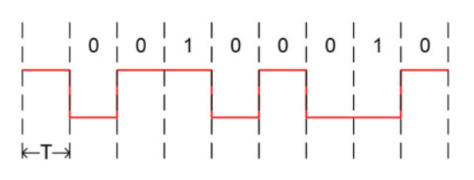

# USART

单片机中最常用的外部总线就是**串口**，STM32使用**USART**（Universal Synchronous/Asynchronous Receiver/Transmitter通用同步/异步串行接收/发送器）管理串口数据的收发

stm32的通用同步异步收发器可支持以下特性：

* 全双工异步通信

* NRZ标准格式

    > 提一下什么是NRZ标准格式
    >
    > 数字信号需要通过编码实现同步，于是考虑使用一种时钟和数据融合在一起的编码，使用这种异步编码就可以灵活应用于工况
    >
    > 最简单的编码就是RZ码（Return Zero Code），它用二进制传输数据为，每一位脉冲结束后需要维持一段时间的低电平来表示本周期或本位传输结束。它可以同时传递时钟信号和数据信号，但归零往往会导致一部分带宽被占用，传输效率受限
    >
    > 相对应的编码就是NRZ码（Non Return Zero Code），现在常见的各种串口异步通信协议都使用这种编码，它的一个周期全部用来传输数据。但是没有确定的传输完成标志就意味着高速传输不可靠。SPI、IIC本质上也是NRZ编码，它们只有依靠信号线才能正确传递数据，其中更高速的SPI协议甚至需要做好走线等长和阻抗匹配才能正常使用。低速异步传输下可以不使用时钟线，RS232、RS485协议就是这样，传输前设定好通信波特率就可以正常传输了
    >
    > 作为一种妥协，NRZI码（Non Return Zero Inverted Code）也可能被使用。这种编码既能传输时钟信号又能尽量不损失系统带宽。USB2.0协议就是NRZI编码。它用信号电平翻转表示0，信号电平不变表示1，接收机使用一个边沿检测器并设定好采样时钟就可以实现数据接收。特殊情况下，传输数据会出现一长串1，这时候协议强制要求经过一定数量1后插入一个0来让接收机可以同步时钟信号。USB2.0协议中就规定传输7个1后必须要插入一个0
    >
    > 曼彻斯特码与NRZI码类似，它利用每个周期中间的信号跳变决定数据，这种编码经常用于高速数据传输，因为它不存在长时间信号状态不变而导致时钟信号丢失的情况，通常会辅以高速时钟信号使用
    >
    > 
    >
    > 曼彻斯特码（上图）NRZI码（下图）
    >
    > 

    * 可编程的16倍或8倍过采样
    * 使用小数波特率发生系统实现的可编程的收发波特率
    * 可编程的数据位长度（8位/9位）
    * 可编程的停止位（1位/2位）
    * LIN主模式同步停止符号发送功能和LIN从模式（可生成13位停止信号和检测10/11位停止符号）
    * 用于同步发送的发送器时钟输出
    * 奇偶校验控制
    * CTS/RTS调制解调器操作

* lrDA SIR编解码器，支持3/16位持续时间

* 智能卡仿真功能，支持一部协议智能卡

* 单线半双工通信

* 使用DMA实现可配置的多缓冲区通信

* 发送器和接收器具有独立使能位

* 传输检测标志（包括接收缓冲区满/空标志位和传输结束标志）

* 错误检测标志（溢出错误、噪声检测、帧错误、奇偶校验错误）

* 常用中断源

* 允许多处理器通信

    * 地址不匹配进入静默模式
    * 静默模式唤醒
    * 从地址位（MSB，第9位）和线路空闲状态唤醒

一个标准的USART设备需要至少两个引脚：用于输出数据的Tx和用于接收数据的Rx

需要注意：正常情况下**两个引脚需要外部上拉**，但是stm32内部已经设置了上拉电路，所以片外不需要额外的电路

在正常USART模式下，两个引脚会以帧的形式发送和接收串行数据，帧结构如下所示：


一般情况下会包含8或9个数据位，可选的1个奇偶校验位，1个必须的起始位和1到2个停止位，最后从机可能会向主机发出响应ACK

带硬件流控的串口信号线会包含额外的nCTS和nRTS，分别表示“清除以发送”（CTS，Clear To Send）和“请求以发送”（RTS，Request To Send），可以在当前传输结束时（高电平）阻止数据发送和指示已经准备好接收数据（低电平）

## STM32的USART外设


外设电路结构如上图所示

### 发送

发送器可发送8位或9位数据，通过M位控制

**当发送使能位TE置为1时，USART发送控制器会将发送移位寄存器的数据在TX引脚输出，同步输出SCLK时钟**

发送控制器会读取发送寄存器TDR中的数据，根据控制寄存器的设置把数据、停止位、校验位输入发送移位寄存器，输入时间位于上一轮发送完成时，整个过程相当于并入串出

可通过配置控制寄存器2的12和13位来确定停止位数量，可用1、2、0.5、1.5四种停止位数量，其中小数停止位只在智能卡模式下使用

TXE位由硬件置1，表示：

* 数据已从TDR输入移位寄存器并开始发送
* TDR寄存器当前为空
* USART_DR寄存器可写入下一数据

当且仅当TXEIE位置1时，该标志位会生成一个串口中断

发送时，要传入USART_DR寄存器的写指令中存有TDR寄存器中的数据，该数据将在当前发送结束时复制到移位寄存器中。未发送时，要传入USART_DR寄存器的写指令直接将数据置于移位寄存器中，数据发送开始时，TXE位立即置1。

如果帧已发送且TXE寄存器置1，TC位将变为高电平。向USART_DR寄存器中写入最后一个数据后，必须等待TC=1，之后才可禁止USART或让设备进入低功率模式，TC位可以通过以下两种情况之一清零：

* 从USART_SR寄存器读取数据
* 向USART_DR寄存器写入数据

> 允许向TC位写入0将其强制清零


> **将SBK位置1将发送一个中断字符**。如果软件在中断发送开始前对SBK位进行了复位，将不会发送中断字符。对于两个连续的中断，应在上一个中断的停止位发送完成后将SBK位置1
>
> **数据发送期间不应复位TE位，因为这样会导致波特率计数器冻结**；而将TE位置1会让USART在第一个数据帧之前发送一个空闲帧

TE：发送使能位

TXE：发送空闲标志位

TXEIE：串口中断标志位

TC：串口忙碌标志位

### 接收


### 时钟控制


### 串口中断


### 唤醒单元


## USART库函数使用

库函数中使用下面的结构体控制USART外设

```c
typedef struct
{
  uint32_t USART_BaudRate; //波特率
  uint16_t USART_WordLength; //数据长度
  uint16_t USART_StopBits; //停止位数
  uint16_t USART_Parity; //奇偶校验位
  uint16_t USART_Mode; //传输模式
  uint16_t USART_HardwareFlowControl; //硬件流控
} USART_InitTypeDef;
```

同时可以通过下面的结构体设置USART外设同步时钟和过采样

```c
typedef struct
{
  uint16_t USART_Clock;
  uint16_t USART_CPOL;
  uint16_t USART_CPHA;
  uint16_t USART_LastBit;
} USART_ClockInitTypeDef;
```

相关设置宏定义可以在stm32f4xx_usart.h文件中找到

配置外设的主要步骤如下：

1. 使能USART控制器总线时钟

    其中USART1和USART6需要使用`RCC_APB2PeriphClockCmd(RCC_APB2Periph_USARTx, ENABLE)`

    USART2、3、4、5需要使用`RCC_APB1PeriphClockCmd(RCC_APB1Periph_USARTx, ENABLE)`

2. 配置USART所需的GPIO并设置为端口复用模式

    ```c
    RCC_AHB1PeriphClockCmd(); //配置GPIO总线时钟
    //......
    //设置GPIO初始化结构体
    GPIO_Init(); //初始化GPIO
    GPIO_PinAFConfig(); //按照数据手册标注配置端口复用
    ```

3. 通过上面的外设配置结构体设置USART外设并通过`USART_Init()`进行应用

4. 可选择配置串口中断，先使用NVIC设置结构体配置中断线和中断优先级，再通过`USART_ITConfig()`连接中断线到USART

5. 如果选择使用同步时钟，使用外设配置结构体和`USART_ClockInit()`函数控制相关设置

6. 如果使用DMA传输，需要先配置DMA，使用`DMA_Init()`使能；随后配置USART需要使用的DMA通道，通过`USART_DMACmd`函数使能；最后用`DMA_Cmd()`函数开启DMA

7. 在所有配置完毕后，使用`USART_Cmd()`开启USART传输

相关控制函数如下：

初始化USART外设

```c
void USART_StructInit(USART_InitTypeDef* USART_InitStruct)
{
	/* USART_InitStruct members default value */
	USART_InitStruct->USART_BaudRate = 9600;
	USART_InitStruct->USART_WordLength = USART_WordLength_8b;
	USART_InitStruct->USART_StopBits = USART_StopBits_1;
	USART_InitStruct->USART_Parity = USART_Parity_No;
	USART_InitStruct->USART_Mode = USART_Mode_Rx | USART_Mode_Tx;
	USART_InitStruct->USART_HardwareFlowControl = USART_HardwareFlowControl_None;
}

void USART_Init(USART_TypeDef* USARTx, USART_InitTypeDef* USART_InitStruct)
{
	uint32_t tmpreg = 0x00, apbclock = 0x00;
	uint32_t integerdivider = 0x00;
	uint32_t fractionaldivider = 0x00;
	RCC_ClocksTypeDef RCC_ClocksStatus;

	/* Check the parameters */
	assert_param(IS_USART_ALL_PERIPH(USARTx));
	assert_param(IS_USART_BAUDRATE(USART_InitStruct->USART_BaudRate));
	assert_param(IS_USART_WORD_LENGTH(USART_InitStruct->USART_WordLength));
	assert_param(IS_USART_STOPBITS(USART_InitStruct->USART_StopBits));
	assert_param(IS_USART_PARITY(USART_InitStruct->USART_Parity));
	assert_param(IS_USART_MODE(USART_InitStruct->USART_Mode));
	assert_param(IS_USART_HARDWARE_FLOW_CONTROL(USART_InitStruct->USART_HardwareFlowControl));

	/* The hardware flow control is available only for USART1, USART2, USART3 and USART6 */
	if (USART_InitStruct->USART_HardwareFlowControl != USART_HardwareFlowControl_None)
	{
		assert_param(IS_USART_1236_PERIPH(USARTx));
	}

	/*---------------------------- USART CR2 Configuration -----------------------*/
	tmpreg = USARTx->CR2;

	/* Clear STOP[13:12] bits */
	tmpreg &= (uint32_t)~((uint32_t)USART_CR2_STOP);

	/* Configure the USART Stop Bits, Clock, CPOL, CPHA and LastBit :
		Set STOP[13:12] bits according to USART_StopBits value */
	tmpreg |= (uint32_t)USART_InitStruct->USART_StopBits;

	/* Write to USART CR2 */
	USARTx->CR2 = (uint16_t)tmpreg;

	/*---------------------------- USART CR1 Configuration -----------------------*/
	tmpreg = USARTx->CR1;

	/* Clear M, PCE, PS, TE and RE bits */
	tmpreg &= (uint32_t)~((uint32_t)CR1_CLEAR_MASK);

	/* Configure the USART Word Length, Parity and mode:
	   Set the M bits according to USART_WordLength value
	   Set PCE and PS bits according to USART_Parity value
	   Set TE and RE bits according to USART_Mode value */
	tmpreg |= (uint32_t)USART_InitStruct->USART_WordLength | USART_InitStruct->USART_Parity |
		USART_InitStruct->USART_Mode;

	/* Write to USART CR1 */
	USARTx->CR1 = (uint16_t)tmpreg;

	/*---------------------------- USART CR3 Configuration -----------------------*/
	tmpreg = USARTx->CR3;

	/* Clear CTSE and RTSE bits */
	tmpreg &= (uint32_t)~((uint32_t)CR3_CLEAR_MASK);

	/* Configure the USART HFC :
		Set CTSE and RTSE bits according to USART_HardwareFlowControl value */
	tmpreg |= USART_InitStruct->USART_HardwareFlowControl;

	/* Write to USART CR3 */
	USARTx->CR3 = (uint16_t)tmpreg;

	/*---------------------------- USART BRR Configuration -----------------------*/
	  /* Configure the USART Baud Rate */
	RCC_GetClocksFreq(&RCC_ClocksStatus);

	if ((USARTx == USART1) || (USARTx == USART6))
	{
		apbclock = RCC_ClocksStatus.PCLK2_Frequency;
	}
	else
	{
		apbclock = RCC_ClocksStatus.PCLK1_Frequency;
	}

	/* Determine the integer part */
	if ((USARTx->CR1 & USART_CR1_OVER8) != 0)
	{
		/* Integer part computing in case Oversampling mode is 8 Samples */
		integerdivider = ((25 * apbclock) / (2 * (USART_InitStruct->USART_BaudRate)));
	}
	else /* if ((USARTx->CR1 & USART_CR1_OVER8) == 0) */
	{
		/* Integer part computing in case Oversampling mode is 16 Samples */
		integerdivider = ((25 * apbclock) / (4 * (USART_InitStruct->USART_BaudRate)));
	}
	tmpreg = (integerdivider / 100) << 4;

	/* Determine the fractional part */
	fractionaldivider = integerdivider - (100 * (tmpreg >> 4));

	/* Implement the fractional part in the register */
	if ((USARTx->CR1 & USART_CR1_OVER8) != 0)
	{
		tmpreg |= ((((fractionaldivider * 8) + 50) / 100)) & ((uint8_t)0x07);
	}
	else /* if ((USARTx->CR1 & USART_CR1_OVER8) == 0) */
	{
		tmpreg |= ((((fractionaldivider * 16) + 50) / 100)) & ((uint8_t)0x0F);
	}

	/* Write to USART BRR register */
	USARTx->BRR = (uint16_t)tmpreg;
}
```

USART同步时钟初始化

```c
void USART_ClockStructInit(USART_ClockInitTypeDef* USART_ClockInitStruct)
{
	/* USART_ClockInitStruct members default value */
	USART_ClockInitStruct->USART_Clock = USART_Clock_Disable;
	USART_ClockInitStruct->USART_CPOL = USART_CPOL_Low;
	USART_ClockInitStruct->USART_CPHA = USART_CPHA_1Edge;
	USART_ClockInitStruct->USART_LastBit = USART_LastBit_Disable;
}

void USART_ClockInit(USART_TypeDef* USARTx, USART_ClockInitTypeDef* USART_ClockInitStruct)
{
	uint32_t tmpreg = 0x00;
	/* Check the parameters */
	assert_param(IS_USART_1236_PERIPH(USARTx));
	assert_param(IS_USART_CLOCK(USART_ClockInitStruct->USART_Clock));
	assert_param(IS_USART_CPOL(USART_ClockInitStruct->USART_CPOL));
	assert_param(IS_USART_CPHA(USART_ClockInitStruct->USART_CPHA));
	assert_param(IS_USART_LASTBIT(USART_ClockInitStruct->USART_LastBit));

	/*---------------------------- USART CR2 Configuration -----------------------*/
	tmpreg = USARTx->CR2;
	/* Clear CLKEN, CPOL, CPHA and LBCL bits */
	tmpreg &= (uint32_t)~((uint32_t)CR2_CLOCK_CLEAR_MASK);
	/* Configure the USART Clock, CPOL, CPHA and LastBit ------------*/
	/* Set CLKEN bit according to USART_Clock value */
	/* Set CPOL bit according to USART_CPOL value */
	/* Set CPHA bit according to USART_CPHA value */
	/* Set LBCL bit according to USART_LastBit value */
	tmpreg |= (uint32_t)USART_ClockInitStruct->USART_Clock | USART_ClockInitStruct->USART_CPOL |
		USART_ClockInitStruct->USART_CPHA | USART_ClockInitStruct->USART_LastBit;
	/* Write to USART CR2 */
	USARTx->CR2 = (uint16_t)tmpreg;
}
```

开启USART外设

```c
void USART_Cmd(USART_TypeDef* USARTx, FunctionalState NewState)
{
	/* Check the parameters */
	assert_param(IS_USART_ALL_PERIPH(USARTx));
	assert_param(IS_FUNCTIONAL_STATE(NewState));

	if (NewState != DISABLE)
	{
		/* Enable the selected USART by setting the UE bit in the CR1 register */
		USARTx->CR1 |= USART_CR1_UE;
	}
	else
	{
		/* Disable the selected USART by clearing the UE bit in the CR1 register */
		USARTx->CR1 &= (uint16_t)~((uint16_t)USART_CR1_UE);
	}
}
```

设置USART过采样

```c
void USART_OverSampling8Cmd(USART_TypeDef* USARTx, FunctionalState NewState)
{
	/* Check the parameters */
	assert_param(IS_USART_ALL_PERIPH(USARTx));
	assert_param(IS_FUNCTIONAL_STATE(NewState));

	if (NewState != DISABLE)
	{
		/* Enable the 8x Oversampling mode by setting the OVER8 bit in the CR1 register */
		USARTx->CR1 |= USART_CR1_OVER8;
	}
	else
	{
		/* Disable the 8x Oversampling mode by clearing the OVER8 bit in the CR1 register */
		USARTx->CR1 &= (uint16_t)~((uint16_t)USART_CR1_OVER8);
	}
}
```

按位传输串口数据

```c
//发送数据
void USART_SendData(USART_TypeDef* USARTx, uint16_t Data)
{
	/* Check the parameters */
	assert_param(IS_USART_ALL_PERIPH(USARTx));
	assert_param(IS_USART_DATA(Data));

	/* Transmit Data */
	USARTx->DR = (Data & (uint16_t)0x01FF);
}

//接收数据
uint16_t USART_ReceiveData(USART_TypeDef* USARTx)
{
	/* Check the parameters */
	assert_param(IS_USART_ALL_PERIPH(USARTx));

	/* Receive Data */
	return (uint16_t)(USARTx->DR & (uint16_t)0x01FF);
}
```

控制USART的DMA传输

```c
void USART_DMACmd(USART_TypeDef* USARTx, uint16_t USART_DMAReq, FunctionalState NewState)
{
	/* Check the parameters */
	assert_param(IS_USART_ALL_PERIPH(USARTx));
	assert_param(IS_USART_DMAREQ(USART_DMAReq));
	assert_param(IS_FUNCTIONAL_STATE(NewState));

	if (NewState != DISABLE)
	{
		/* Enable the DMA transfer for selected requests by setting the DMAT and/or
		   DMAR bits in the USART CR3 register */
		USARTx->CR3 |= USART_DMAReq;
	}
	else
	{
		/* Disable the DMA transfer for selected requests by clearing the DMAT and/or
		   DMAR bits in the USART CR3 register */
		USARTx->CR3 &= (uint16_t)~USART_DMAReq;
	}
}
```

串口中断控制函数

```c
void USART_ITConfig(USART_TypeDef* USARTx, uint16_t USART_IT, FunctionalState NewState)
{
	uint32_t usartreg = 0x00, itpos = 0x00, itmask = 0x00;
	uint32_t usartxbase = 0x00;
	/* Check the parameters */
	assert_param(IS_USART_ALL_PERIPH(USARTx));
	assert_param(IS_USART_CONFIG_IT(USART_IT));
	assert_param(IS_FUNCTIONAL_STATE(NewState));

	/* The CTS interrupt is not available for UART4 and UART5 */
	if (USART_IT == USART_IT_CTS)
	{
		assert_param(IS_USART_1236_PERIPH(USARTx));
	}

	usartxbase = (uint32_t)USARTx;

	/* Get the USART register index */
	usartreg = (((uint8_t)USART_IT) >> 0x05);

	/* Get the interrupt position */
	itpos = USART_IT & IT_MASK;
	itmask = (((uint32_t)0x01) << itpos);

	if (usartreg == 0x01) /* The IT is in CR1 register */
	{
		usartxbase += 0x0C;
	}
	else if (usartreg == 0x02) /* The IT is in CR2 register */
	{
		usartxbase += 0x10;
	}
	else /* The IT is in CR3 register */
	{
		usartxbase += 0x14;
	}
	if (NewState != DISABLE)
	{
		*(__IO uint32_t*)usartxbase |= itmask;
	}
	else
	{
		*(__IO uint32_t*)usartxbase &= ~itmask;
	}
}
```

获取串口中断标志位

```c
FlagStatus USART_GetFlagStatus(USART_TypeDef* USARTx, uint16_t USART_FLAG)
{
	FlagStatus bitstatus = RESET;
	/* Check the parameters */
	assert_param(IS_USART_ALL_PERIPH(USARTx));
	assert_param(IS_USART_FLAG(USART_FLAG));

	/* The CTS flag is not available for UART4 and UART5 */
	if (USART_FLAG == USART_FLAG_CTS)
	{
		assert_param(IS_USART_1236_PERIPH(USARTx));
	}

	if ((USARTx->SR & USART_FLAG) != (uint16_t)RESET)
	{
		bitstatus = SET;
	}
	else
	{
		bitstatus = RESET;
	}
	return bitstatus;
}
```

清除中断标志位

```c
void USART_ClearFlag(USART_TypeDef* USARTx, uint16_t USART_FLAG)
{
	/* Check the parameters */
	assert_param(IS_USART_ALL_PERIPH(USARTx));
	assert_param(IS_USART_CLEAR_FLAG(USART_FLAG));

	/* The CTS flag is not available for UART4 and UART5 */
	if ((USART_FLAG & USART_FLAG_CTS) == USART_FLAG_CTS)
	{
		assert_param(IS_USART_1236_PERIPH(USARTx));
	}

	USARTx->SR = (uint16_t)~USART_FLAG;
}

void USART_ClearITPendingBit(USART_TypeDef* USARTx, uint16_t USART_IT)
{
	uint16_t bitpos = 0x00, itmask = 0x00;
	/* Check the parameters */
	assert_param(IS_USART_ALL_PERIPH(USARTx));
	assert_param(IS_USART_CLEAR_IT(USART_IT));

	/* The CTS interrupt is not available for UART4 and UART5 */
	if (USART_IT == USART_IT_CTS)
	{
		assert_param(IS_USART_1236_PERIPH(USARTx));
	}

	bitpos = USART_IT >> 0x08;
	itmask = ((uint16_t)0x01 << (uint16_t)bitpos);
	USARTx->SR = (uint16_t)~itmask;
}
```

获取当前中断状态

```c
ITStatus USART_GetITStatus(USART_TypeDef* USARTx, uint16_t USART_IT)
{
	uint32_t bitpos = 0x00, itmask = 0x00, usartreg = 0x00;
	ITStatus bitstatus = RESET;
	/* Check the parameters */
	assert_param(IS_USART_ALL_PERIPH(USARTx));
	assert_param(IS_USART_GET_IT(USART_IT));

	/* The CTS interrupt is not available for UART4 and UART5 */
	if (USART_IT == USART_IT_CTS)
	{
		assert_param(IS_USART_1236_PERIPH(USARTx));
	}

	/* Get the USART register index */
	usartreg = (((uint8_t)USART_IT) >> 0x05);
	/* Get the interrupt position */
	itmask = USART_IT & IT_MASK;
	itmask = (uint32_t)0x01 << itmask;

	if (usartreg == 0x01) /* The IT  is in CR1 register */
	{
		itmask &= USARTx->CR1;
	}
	else if (usartreg == 0x02) /* The IT  is in CR2 register */
	{
		itmask &= USARTx->CR2;
	}
	else /* The IT  is in CR3 register */
	{
		itmask &= USARTx->CR3;
	}

	bitpos = USART_IT >> 0x08;
	bitpos = (uint32_t)0x01 << bitpos;
	bitpos &= USARTx->SR;
	if ((itmask != (uint16_t)RESET) && (bitpos != (uint16_t)RESET))
	{
		bitstatus = SET;
	}
	else
	{
		bitstatus = RESET;
	}

	return bitstatus;
}
```

除此之外还有一些多处理器通信的函数和不常见协议的函数，可自行翻阅stm32f4xx_usart.c查询

## USART配合其他外设构建快速通信协议


### 串口收发

**串口发送数据最直接的方式就是标准调用库函数**，本质上是操作串口控制寄存器和数据寄存器

使用USART_SendData()发送数据；使用USART_ReceiveData()接收数据

```c
void Send_data(USART_TypeDef * USARTx,u8 *s)
{
	while(*s!='\0')
	{ 
		while(USART_GetFlagStatus(USARTx, USART_FLAG_TC)==RESET);	
		USART_SendData(USARTx, *s);
		s++;
	}
}
```

这里改进了一下原函数（原函数只能发送单个字符），只要使用Send_data就可以发送字符串，同时可以适用于各种串口

而串口数据的接收一般采用中断辅助，下面是一个典型例子

```c
#define Max_BUFF_Len 32

unsigned char Uart_Buffer[MAX_BUFF_LEN];
unsigned int UART_RX_FLAG=0;

void USARTx_IRQHandler() //串口中断服务函数
{
	if(USART_GetITStatus(USARTx,USART_IT_RXNE) != RESET) //中断产生 
	{
		USART_ClearITPendingBit(USARTx, USART_IT_RXNE); //清除中断标志位
        
		Uart_Buffer[UART_RX_FLAG] = USART_ReceiveData(USARTx); //接收串口数据到缓冲区
		UART_RX_FLAG++; 

        //人为设置一个标识符0x0a用于指示本次传输的结尾
        //传输到结尾或者等于最大接受数就清空重新接收
		if(Uart_Buffer[UART_RX_FLAG - 1] == 0x0a || UART_RX_FLAG == MAX_BUFF_LEN) 
		{
			if(Uart_Buffer[0] == 0x0b) //检测到头标识是指定的0x0b，标志后续数据有效
			{
				deal_with_data(); //数据处理
				UART_RX_FLAG=0;                                   
			} 
			else
			{
				UART_RX_FLAG=0; //重新接收
			}
		}
	}
}
```

但是中断一次就接收一个字符这种形式会导致频繁的后台中断，影响系统的实时性，非常消耗CPU资源，特别是在加入RTOS的情况下，由于出现大量后台中断，在需要接收大量数据或波特率很高的情况下可能导致数据丢失问题

可以使用DMA辅助串口接收，如下所示

```c
#define DMA_USART_RECEIVE_LEN 32

void USARTx_IRQHandler(void)                                 
{     
    u32 temp = 0;  
    u8 i = 0;  
      
    if(USART_GetITStatus(USARTx, USART_IT_IDLE) != RESET) //串口中断
    {
        USART_ClearITPendingBit(USARTx, USART_IT_RXNE); //清除中断标志位
        
        DMA_Cmd(DMA1_Channel5,DISABLE); //关闭DMA，防止读取数据过程中数据被DMA覆盖
        //接收的字符串长度=设置的接收长度-剩余DMA缓存大小
        temp = DMA_USART_RECEIVE_LEN - DMA_GetCurrDataCounter(DMAx_Channeln);
        for (i = 0; i < temp; i ++)
        {
			Uart_Buffer[i] = USARTx_RECEIVE_DMA_Buffer[i];  
        }
        //设置传输数据长度  
        DMA_SetCurrDataCounter(DMAx_Channeln, DMA_USART_RECEIVE_LEN);  
        //打开DMA，开始传输
        DMA_Cmd(DMAx_Channeln, ENABLE);  
    }        
} 
```

同样地，DMA也能用于带RTOS的设备上进行数据发送

```c
#define DMA_USART_RECEIVE_LEN 32

void DMA_SEND_EN(void) //使能DMA发送功能
{
	DMA_Cmd(DMAx_Channeln, DISABLE);
	DMA_SetCurrDataCounter(DMAx_Channeln, DMA_USART_RECEIVE_LEN);   
	DMA_Cmd(DMAx_Channeln, ENABLE);
}
//DMA会直接将数据从DMA通道搬运到USART外设发送出去，不会再占用VPU资源
```

### 使用RTOS的串口驱动

在有RTOS的情况下，可以很方便地使用消息队列或邮箱等线程间通讯工具实现串口收发，并且在一些RTOS上还提供了文件形式的串口读写，可以很方便地实现实时性要求不高的操作

```c
#define UART_QUEUE_SIZE 5
#define UART_QUEUE_LENGTH sizeof(uint8_t)
#define UART_TEMP_BUFFER_SIZE 64

QueueHandle_t UartQueue_handle;

uint8_t Uart_rx_cnt; //字节大小计数值
uint8_t* Uart_rx_pointer; //缓存区指针
uint8_t* Uart_rx_pointer_head; //缓存区首地址指针

uint8_t uart_temp_data; //每次中断接收的数据

void USARTx_IRQHandler() 
{
	disable_interrupt(); //进入临界区
    if(USART_GetFlagStatus(USARTx, USART_FLAG_RXNE) != RESET) //中断产生 
    {
        USART_ClearFlag(USARTx, USART_FLAG_RXNE); //清除中断标志
        uart_temp_data = USART_ReceiveData(USARTx);
        if(uart_temp_data == 0x0b) //接收到数据头标识
        {
            Uart_rx_pointer = (xSize)pvPortMalloc(UART_TEMP_BUFFER_SIZE*UART_QUEUE_LENGTH); //分配缓存区
            Uart_rx_pointer_head = Uart_rx_pointer;
        }
        if(uart_temp_data == 0x0a) //接收到尾标志
        {
            *Uart_rx_pointer++ = uart_temp_data;
            Uart_rx_cnt++; //字节大小增加
            xQueueGenericSend(UartQueue_handle, Uart_rx_pointer_head, 0, queueSEND_TO_BACK); //发送消息
            Uart_rx_pointer = NULL; //将指针指向为空，防止修改
			Uart_rx_cnt = 0; //字节大小计数清零
        }
        else
        {
            *Uart_rx_pointer = uart_temp_data; //储存接收到的数据
			Uart_rx_pointer++;
			Uart_rx_cnt++;
        }
    }
	ensable_interrupt(); //退出临界区
}

//串口数据处理任务
void uart_task(void *param)
{
    UartQueue_handle = xQueueGenericCreate(UART_QUEUE_SIZE, UART_QUEUE_LENGTH, NULL, NULL, queueQUEUE_TYPE_BASE);
    //创建消息队列

	uint8_t Uart_data_size[UART_TEMP_BUFFER_SIZE];
	u8 *p;
	
	while(1)
	{
        xQueueReceive(UartQueue_handle, Uart_data_size, portMAX_DELAY);	//接收数据到前台任务，进行处理
	}
}
```
