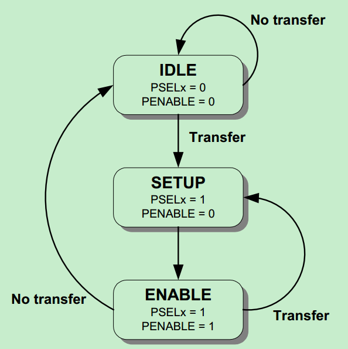
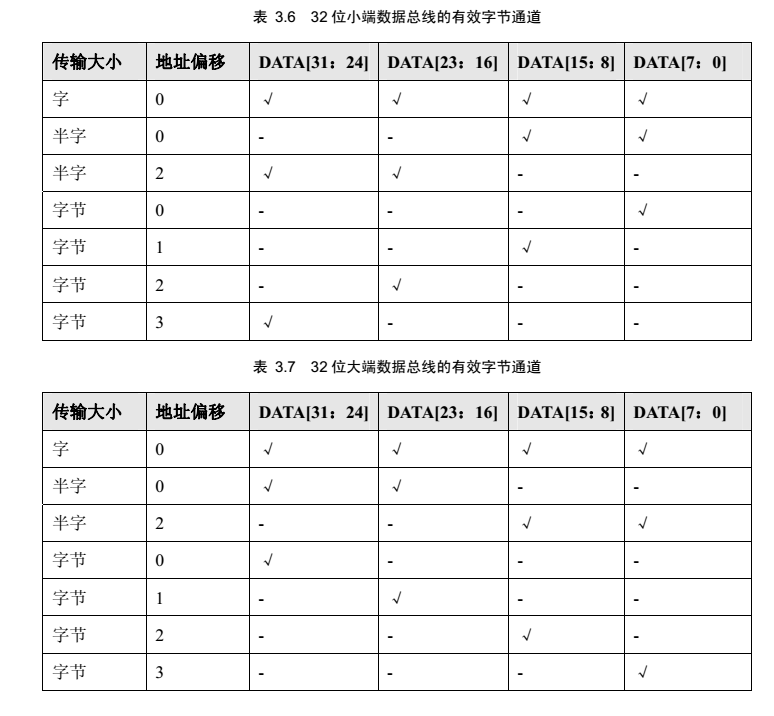
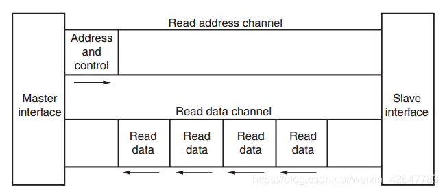
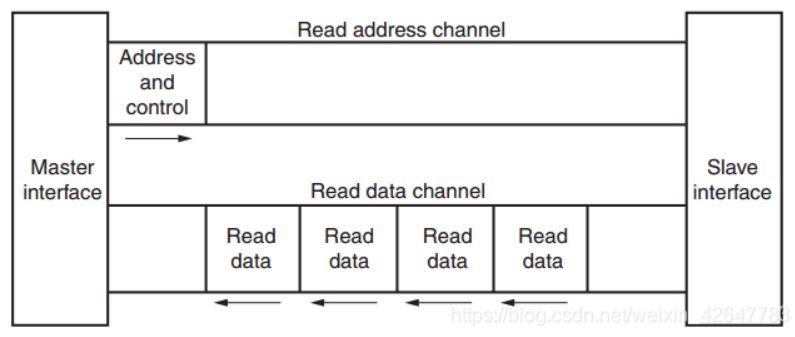
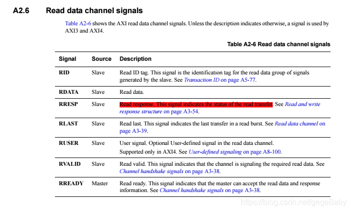
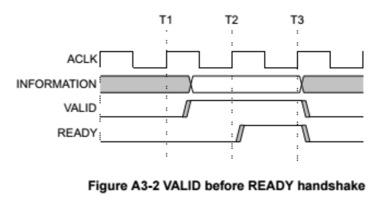

# AMBA总线规范

AMBA规范由ARM公司制定，用于SoC内IP互联

AMBA即（Advanced Microcontroller Bus Architecture，AMBA）规范是一种开放式标准片上互联规范，用于连接和管理片上系统中的各个功能模块（IP）。显而易见，AMBA协议是一套片上总线协议，一般来说其信号线数量都比较多——ARM通过这套协议规定了各种信号线的作用，并没有规定信号线的位宽和具体实现，所以说每个芯片中的AMBA都可能具有不同的架构

AMBA中有以下几个主要接口：

* 高级外设总线APB：用于低速低功耗外设连接
* 高级高性能总线AHB：用于高速外设连接
* 高级可扩展接口AXI：最普遍使用的高性能总线
* 高级跟踪总线ATB：用于在芯片外围移动跟踪数据
* AXI一致性扩展接口ACE：用于移动设备的大小核之间高速连接
* 相关集线器接口CHI：用于网络和服务器设备的高带宽高性能数据传输

## APB规范

**在APB总线中，唯一的主机为APB总线桥，其它外设都是从机**。因此APB总线不需要有一个像AHB一样的仲裁器以及其它控制器，因此通常APB总线可看做由**APB总线桥**和**APB上的从设备**两部分组成。APB总线通常是AHB或者ASB系统总线（已经过时的总线）的扩展，便于外设链接到系统总线上，AHB和APB之间就使用APB总线桥来链接

APB规定**所有信号必须在时钟上升沿进行传递**

APB总线包含8根信号线，都是以H开头，区别其他的AMBA总线信号：

* **PCLK**：总线时钟，由总线时钟源提供
* **PRESETn**：复位信号，低电平有效，由系统总线复位信号提供
* **PADDR**：总线地址信号，由外设APB总线桥提供
* **PPROT**：保护信号，用于表示普通的、剥夺的或安全保护级别
* **PSELx**：总线选择信号，该信号表示选中某个从设备，*每个从设备都应该有一个PSELx信号*
* **PENABLE**：总线数据传输使能，用于触发APB总线的访问周期
* **PWRITE**：总线访问方向信号，信号拉高表示APB写访问；信号拉低表示APB读访问
* **PWDATA**：写数据信号，使用该信号线驱动写数据总线
* **PRDATA**：读数据信号，在读周期时从所选择的从设备驱动该总线，宽度受限（最高32位）
* **PSTRB**：写选通信号，用于表示写传输时更新哪个字节通道。每8位使用一个PSTRB信号线控制。在读传输时，写选通信号不活动
* **PREADY**：总线准备信号，从设备控制该信号来扩展APB传输
* **PSLVERR**：总线错误信号，用于表示传输失败。外设可以不使用PSLVERR引脚，在外设不包含该引脚时，APB桥的数据应适当拉低

以上总线结构可以和下文相互参考理解

### 读写时序

1. 无等待状态写
    1. 需要一个**建立周期**寄存PADDR、PWDATA、PWRITE、PSEL，这些信号会在PCLK上升沿完成寄存
    2. 在第二个周期，PENABLE和PREADY寄存，PENABLE表示传输**访问周期**开始；PREADY表示PCLK的下一个上升沿从设备可以完成传输
    3. 第三个周期完成之前，PADDR、PWDATA和控制信号会一直保持有效
    4. 第四个周期，PENABLE和PSEL变成无效，等待下一个传输开始
    
    
    
2. 有等待状态写

    1. 在访问周期开始时，PENABLE为高时，可以通过拉低PREADY来扩展传输
    2. PREADY拉低后，可以添加两个传输周期
    3. 新添加的周期也可以是有等待状态的，即可以通过拉低PREADY来无限延长传输周期

3. 无等待状态读

    基本时序和无等待状态写类似，但是使用PRDATA作为信号传输线，在读传输结束之前，从设备必须主动提供数据

    

4. 有等待状态读

    与有等待状态写类似，可以通过拉低PREADY来实现延长传输周期

事实上，除了写信号有效性相反外，APB读操作时序和写操作时序非常相似。特别地，如果写操作之后跟随着读操作或者相反，那么需要 3个等待周期来完成读操作。通常的情况下，不会有读操作之后紧跟着写操作的发生，因为两者之间CPU会进行取指操作——更重要的是指令存储器不太可能直接挂在APB总线上

### 错误响应

传输中使用*PSLVERR*信号来指示APB总线传输的错误条件。

为了防止读写交易过程中发生错误，当PSEL、PENABLE、PREADY都为高时，PSLVERR有效

当外设接收到一个错误时，写交易并不会更新外设内的寄存器；而当读交易能够返回无效的数据，对于读错误，并不会要求外设将数据总线驱动置0

### APB控制状态机



APB总线状态机如上图所示

* **IDLE**：空闲状态，APB总线默认处于此状态
* **SETUP**：建立状态，当请求传输时，PSEL=1。在一次传输中，该状态只会保留一个时钟周期
* **ACCESS**：访问状态，PSEL=1，PENABLE=1。要求地址信号、选择信号、读/写数据信号保持不变。准备信号PREADY决定了是否从ACCESS状态退出（PREADY=0，保持；PREADY=1，退出，如果此使没有其他传输请求，就返回IDLE，否则继续进入SETUP）

APB的每次传输均需**消耗2个周期的时间**

## AHB规范

APB总线用于低速低功耗的情况，一般只是用他来控制外设的寄存器；而AHB总线则通常用于更高速的情况——基于ARM核的MCU一般都使用AHB连接内核和APB总线。


如上图所示，典型AMBA总线系统就是这样，ARM核、片上RAM、DTCM/ITCM等高带宽内存、DMA设备这些需要高速传输的设备挂载到AHB总线上；APB总线连接低速的定时器、GPIO、串口、片外总线控制器等外设；AHB总线和APB总线间通过总线桥相连不过近年来，随着外设和片外总线速度越来越高（MCU逐渐整合DSP功能），一些高速定时器、高速GPIO都会被直接挂载到AHB总线上

与APB总线协议不同，AHB总线具有以下特性：

* 高性能：支持流水线操作和分割交易（分割交易含义在后文给出）
* 支持猝发传输（也就是突发传输Burst Mode）：在一次传输内向固定地址传输多个数据字，也就是说可以一次传输一个地址和一批地址连续的数据
* 可由多个总线主设备控制

### 总线互联

AHB协议规范只规定了总线的通信时序，并没有规定总线的具体实现方法和互联机制，于是可以在AHB基础上采用多路复用器互联、总线矩阵等等实现思路

最基本的互联方式就是**多路复用器互联**：使用两个MUX分别控制地址信号线和读写数据信号线的传输，使用一个译码器实现主设备控制读写数据和响应信号的切换，所有总线设备都由总线仲裁器控制。如下图所示


### 总线操作流程

1. **总线仲裁**

    在开始传输前，主设备需要先向AHB总线仲裁器提出使用申请，总线仲裁器随后会根据仲裁逻辑授权主设备进行总线访问。

    在总线仲裁之前，允许一个主设备以特定的猝发方式完成所有传输。但是为了避免产生过长的仲裁延迟，仲裁器可以将一个猝发分解，这个操作称为**分割交易**

2. 猝发传输

    在总线仲裁完毕后，主设备会启动AHB传输，在这个阶段可以使用两种被允许的猝发传输逻辑（不知道该怎么翻译比较好）：

    * 增量猝发：在地址边界不回卷
    * 回卷猝发：在特殊的地址边界回卷

3. 每次传输由*地址和控制周期*与*数据周期*构成

    在传输期间，所有从设备必须采样地址

4. 从设备回报

    在每次传输期间，从设备使用响应信号HRESP[1:0]显示状态，可选的状态如下：

    * OKAY：传输正常，当HREADY=2'b11时，表示传输成功结束
    * ERROR：传输失败。表示发生传输错误
    * RETRY和SPLIT：表示不能立即完成传输，但是总线主设备应该继续尝试传输

    如果发生分割交易，主设备会在这个时间段向仲裁器提出仲裁以便完成猝发传输中剩余的操作

### 读写时序

如果没有猝发传输或等待，主设备会发起一个普通传输，分成两个主要部分

1. 地址周期

    这个环节持续一个时钟周期，在第一个HCLK上升沿，主设备会先驱动总线上的地址和控制信号并保持
    
2. 数据周期

    在下一个时钟上升沿，从设备采集总线上的地址和控制信号

    从设备完成采集后立刻驱动响应信号线，在第三个时钟上升沿时，主设备再采样这个响应

    数据周期可以持续几个时钟周期，因为在任何一个传输中，从设备都可能插入等待状态。在读传输的等待状态中，从设备不必提供有效数据，在将要完成传输前提供有效数据即可

    为了允许更高性能的操作，AHB总线允许**流水线操作**：在前一个数据周期结尾，一旦主设备采样完成就可以启动地址周期，驱动总线的地址和控制信号，这样从设备就能够获得充足时间响应一次传输

### AHB总线的信号线种类

AHB总线的信号都是以H开头，区别其他的AMBA总线信号

| 信号名                                      | 信号源               | 信号功能                                                     |
| ------------------------------------------- | -------------------- | ------------------------------------------------------------ |
| HCLK                                        | 总线时钟源           | 总线时钟信号，上升沿有效                                     |
| HRESET                                      | 系统复位             | 系统reset信号，低电平有效                                    |
| HADDR[31:0]                                 | 主设备               | 32位系统地址总线                                             |
| HTRANS[1:0]               | 主设备               | 传输类型，一共有四种类型：NONSEQ、SEQ、IDLE、BUSY |
| HSIZE[2:0]                | 主设备               | 每次传输的数据大小。以字节为单位。最高支持1024位 |
| HBURST[2:0]                  | 主设备               | 猝发传输类型，一共有8种                               |
| HPROT[3:0]          | 主设备               | 保护控制信号                                       |
| HWDATA[31:0]             | 主设备               | 写数据信号线                                              |
| HSELx                      | 译码器               | 从设备选择信号线                                               |
| HRDATA[31:0]              | 从设备               | 读数据信号线                                            |
| HREADY                    |      从设备                | 传输完成信号。当这个信号线拉高时，表示当前传输完成；从设备也可以通过拉低这个信号线来延长一个传输。注意：从设备需要2个HREADY信号线，其中一个作为输出，一个作为输入 |
| HRESP[1:0]            |从设备               | 从设备给主设备的响应信号。一共有四种：OKAY、ERROR、RETRY、SPLIT |
||                                              下面是仲裁器的信号                                           ||
| HBUSREQx                    | 主设备               | 主设备请求信号线。主设备通过该信号线向仲裁器发出获得总线使用权的请求信号，最多支持16个主设备 |
| HLOCKx                 | 主设备               | 总线锁定信号线。如果一个主设备希望自己在传输期间不丢掉总线，则需要向仲裁器发送这个锁定信号 |
| HGRANTx                       | 仲裁器              | 授权信号线。仲裁器的仲裁结果会通过该信号线传送给每一个主设备。当HREADY和HGRANTx同时为高时，主设备被允许获取系统总线 |
| HMASTER[3:0]              | 仲裁器           | 主设备ID信号线。仲裁器为每一个主设备分配对应的的ID，用来给多路选择器提供选择信号和为SPLIT操作提供控制信号 |
| HMASTLOCK               | 仲裁器           | 总线阻塞信号。表示当前的主设备正在执行锁定操作。该信号和HMASTER时序相同 |
| HSPLITx[15:0] | 具有SPLIT操作的从设备 | 仲裁器SPLIT控制信号 |

### 传输类型编码

每个传输都有独立的传输类型，由HTRANS[1:0]表示

* 00：**IDLE**（空闲）。表示没有请求数据传输，这个信号表示总线主设备获得了总线控制权但是并没有执行数据传输。这种情况下从设备需要返回一个零状态等待信号OKAY并忽略本次传输
* 01：**BUSY**（忙碌）。忙传输，允许总线主设备在猝发传输中插入空闲周期。一般这种类型表示主设备正在连续执行猝发传输但不能立即产生下一次传输。当一个主设备触发该类型时，要求它驱动带地址和控制信号必须反映猝发中的下一次传输；从设备则应该忽略这种传输
* 10：**NONSEQ**（非连续）。一次猝发的第一次传输或者一个独立传输，表示地址与控制信号和前一次传输无关。总线上的单个传输会被看作一次猝发传输，随意使用这个信号会导致传输不连续
* 11：**SEQ**（连续）。表示在一次猝发传输中剩下的传输是连续传输且与前一次传输有关，控制信息和前一次传输时一样，地址等于*前一次*传输的地址加上传输大小（以字节为单位）。在回卷猝发的情况下，传输地址需要在地址边界处回卷，*回卷值等于传输大小乘传输次数*

```verilog
// Transfer type: HTRANS[1:0]
`define HTRANS_IDLE   2'b00
`define HTRANS_BUSY   2'b01
`define HTRANS_NONSEQ 2'b10
`define HTRANS_SEQ    2'b11
```

### 传输控制信号

每次AHB传输中，都会使用一组控制信号线提供传输的附加信息，要求他们的时序和地址总线时序严格一致，并且信号在猝发传输中保持不变

下面是用到的控制信号线

1. 传输方向HWRITE

    HWRITE=1时，表示写传输，主设备会将数据放到写数据总线HWDATA[31:0]

    HWRITE=0时，表示读传输，从设备会将数据放到读数据总线HRDATA[31:0]

    ```verilog
    // Write signal: HWRITE
    `define HWRITE_READ  1'b0
    `define HWRITE_WRITE 1'b1
    ```

2. 传输大小HSIZE

    使用HSIZE[2:0]表示传输宽度，该信号线和HBURST[2:0]信号一起决定了回卷猝发的地址边界

    有以下几种选项：

    * 000：8位，字节
    * 001：16位，半字
    * 010：32位，字
    * 011：64位，双字
    * 100：128位
    * 101：256位
    * 110：512位
    * 111：1024位

    ```verilog
    // Transfer size: HSIZE[2:0]
    `define HSIZE_8    3'b000
    `define HSIZE_16   3'b001
    `define HSIZE_32   3'b010
    `define HSIZE_64   3'b011
    `define HSIZE_128  3'b100
    `define HSIZE_256  3'b101
    `define HSIZE_512  3'b110
    `define HSIZE_1024 3'b111
    ```

3. 保护信号HPROT[3:0]

    用于提供附加信息，一般提供给能执行不同保护级别的模块使用，表示传输时一次预取指或数据访问、特权模式、用户模式访问，或带高速缓存/无高速缓存

    设备在没有严格要求的情况下不需要使用该信号

    * HPROT[0]：0，预取指；1，数据访问
    * HPROT[1]：0，用户模式；1，特权模式
    * HPROT[2]：0，无缓冲；1，带缓冲
    * HPROT[3]：0，无高速缓存；1，带高速缓存

### 猝发操作详解

AHB协议规定了4、8、16拍的基本猝发和未定长度的猝发。协议默认支持两种猝发方式

* 递增猝发：访问连续地址且猝发中每次传输的地址仅是前一次地址的一个递增和回卷

* 回卷猝发：若传输起始地址并未和猝发中的字节总数对齐，那么传输地址会在达到边界处回卷

    > 一个4拍回卷猝发的字访问将在16字节边界回卷，因此若传输起始地址是0x34，那么它会包括0x34、0x38、0x3C和0x30四个地址，其中0x30是由回卷导致的

通过HBURST[2:0]信号线指示促发信息，具有8种可能的猝发类型：

* 000：单一传输
* 001：未定长度的递增猝发
* 010：4拍回卷猝发
* 011：4拍递增猝发
* 100：8拍回卷猝发
* 101：8拍递增猝发
* 110：16拍回卷猝发
* 111：16拍递增猝发

```verilog
// Bus operation: HBURST[2:0]
// Note: 猝发传输不能跨越1kB的地址边界
`define HBURST_SINGLE 3'b000
`define HBURST_INCR   3'b001
`define HBURST_WRAP4  3'b010
`define HBURST_INCR4  3'b011
`define HBURST_WRAP8  3'b100
`define HBURST_INCR8  3'b101
`define HBURST_WRAP16 3'b110
`define HBURST_INCR16 3'b111
```

特别注意：**猝发不能超过1KB的地址边界**

猝发大小表示猝发的节拍数量而不是一次猝发传输的实际字节数——**每拍字节数是由HSIZE[2:0]指示的**

对于一个从设备而言，可以在不允许完成一个猝发的特殊情况下提前终止猝发传输。一般通过监控*HTRANS信号*完成，如果产生一个非连续或空闲传输，则表示新的猝发开始，需要保证在此之前终止了前一次的猝发传输，并向主设备提供过连续或忙指示

### 地址译码器

**AHB总线上的从设备一般共用一个中央地址译码器提供选择信号HSELx**

一般要求这个译码器尽可能简单可靠，避免复杂的逻辑实现高速操作

协议规定：

1. 从设备只能在HREADY为高时采样地址总线信号、控制信号和HSELx信号
2. 当HSELx信号为高时，表示当前传输完成，因此在特定情况下会在HREADY为低时采样HSELx信号，但会在传输完成后更改选中的从设备
3. 总线主设备不能执行超过1KB地址边界的递增传输
4. 在存储器映射不能完全填满存储空间时，需要设置一个额外的默认从设备来让主设备访问不存在地址空间时提供响应，要求至少实现以下两个响应
    * ERROR：当传输访问不存在的地址空间或出现非连续传输时
    * OKAY：当空闲或访问不存在的地址空间（默认从设备）时

### 从设备传输响应时序

从设备使用HREADY信号来扩展一次AHB传输的数据周期——HREADY=0，表示要扩展传输；否则表示传输完成，同时可以结合从设备输出的HRESP[1:0]信号表示传输情况

协议推荐从设备不要插入多余16个扩展传输等待状态，否则单个访问会将总线锁定较长的时钟周期，影响片上数据传输——*不过这并不是强制规定*

HRESP[1:0]具有以下四种状态：

* 00：OKAY，表示成功完成传输
* 01：ERROR，表示发生传输错误，出现错误条件时，需要两个周期响应
* 10：RETRY，表示传输并未完成，总线主设备应重新传输直到完成，要求两个周期响应。仲裁器收到该指示后会继续使用原有的优先级方案，重新为申请总线的设备排序并进行调度分配
* 11：SPLIT，表示未成功完成传输，下次授权总线主设备访问总线时再尝试传输；当能够完成传输时，从设备会将请求代替主设备访问总线，要求两个周期响应。仲裁器收到该指示后会调整优先级方案来让其他主机的传输优先完成，随后再进行当前主机的传输

```verilog
// Transfer response: HRESP[1:0]
`define HRESP_OKAY  2'b00
`define HRESP_ERROR 2'b01
`define HRESP_RETRY 2'b10
`define HRESP_SPLIT 2'b11
```

上面要求两个周期响应的情况被称为**双周期响应**，需要在最后一个传输的前一个周期驱动HRESP[1:0]表示扩展一个周期。而如果从设备还需要更多周期，应该在传输开始时将HREADY信号拉低，同时响应OKAY。双周期响应允许主设备有足够时间取消该地址，并且在下次传输前驱动HTRANS[1:0]为空闲传输

特别的，如果从设备出现错误响应，主设备可以选择取消猝发中剩下的传输，但这并不是强制规定

由于分割传输的“**释放总线**”特性，可以更有效地实现长数据分批传输

### 数据总线

AHB协议要求读写数据总线至少为32位，但是允许用户扩展数据位，一些高性能核使用64位的读写数据总线

1. 写数据总线HWDATA

    写数据总线依赖主设备驱动，如果使用扩展传输，总线主设备需要保持数据有效知道HREADY为高（表示传输完成）为止。要求传输与数据宽度相等的数据宽度对齐：字传输对其到字边界，半字传输对齐到半字边界，以此类推。

    同时需要区分大端和小端序，二者的有效字节通道是正好相反的，如下图所示

    

    显而易见，**不要把端序不同的设备接到同一个总线上**

2. 读数据总线HRDATA

    从设备负责驱动读数据总线，当HREADY拉低，可以扩展读传输过程，从设备只需在传输的*最后一个周期*提供有效数据。

    对于小于总线宽度的数据传输，从设备需要在有效的字节通道提供有效数据，总线主设备负责从这些通道内选择数据采样，且**只有传输以OKAY响应结束时，从设备才需要提供有效数据**

3. 端结构

    **AHB总线不支持动态端结构**

    同时对于其他具有相似性能的总线，也不推荐支持动态端结构——因为它的面积和功耗开销太大了

### 仲裁器

**设置总线仲裁器的目的是保证任意时刻只有一个主设备在占用总线**。仲裁器会检测多个主设备的总线使用需求，确定当前请求总线的主设备中优先级最高的主设备，并动态调节来自从设备的分割传输请求。

仲裁器作为总线主控设备使用以下信号线：

* HBUSREQx总线请求信号：主设备会使用该信号请求访问总线

    因为一个系统中最多有16个独立的总线主设备，因此x在0~15之间

* HLOCKx总线同步锁定信号：用于通知仲裁器主设备正在进行不可分割的传输

    一旦该信号拉高，仲裁器就不应该授权其他主设备访问总线

    主设备应当保证寻址完毕之前HLOCKx信号在一个周期内有效，防止仲裁器改变授权信号

* HGRANTx授权信号：由仲裁器产生，高电平有效，表示对应的主设备优先级最高，享有总线控制权，优先考虑锁定传输和分割传输。

    得到该信号确认的主设备，在HCLK上升沿时HREADY为高——当HREADY和HGRANTx同时为高时，主设备被允许获取系统总线

* HMASTER[3:0]主设备ID信号线：表示当前被授权使用总线的主设备编号

    特别情况，具有分割传输能力的从设备也能请求主设备号，以便提示仲裁器能够完成一个分割传输的主设备

* HMASTLOCK锁定信号：指示某个传输是一个锁定序列的一部分

    表示当前的主设备正在执行锁定操作

* HSPLIT[15:0]分割传输信号：从设备用来指示能够完成一个分割传输的总线主设备，仲裁器获取该信号线上数据来向对应的主设备提供授权完成分割传输

下面是仲裁器的一个实现

```verilog
/*
AMBA 总线规范是一种多主总线标准。因此
需要一个总线仲裁器来确保只有一个总线主机可以访问
任何特定时间的总线。这个仲裁器最多可以支持三个总线主设备
*/
module ahb_arbiter3
(
  //主设备0
  input HBUSREQx0,
  input HLOCKx0,
  output reg HGRANTx0,
  //主设备1
  input HBUSREQx1,
  input HLOCKx1,
  output reg HGRANTx1,
  //主设备2
  input HBUSREQx2,
  input HLOCKx2,
  output reg HGRANTx2,
  //主设备3
  input HBUSREQx3,
  input HLOCKx3,
  output reg HGRANTx3,

  //地址和控制信号线
  input [31:0] HADDR,
  input [3:0] HSPLIT,
  input [1:0] HTRANS,
  input [2:0] HBURST,
  input [1:0] HRESP,
  input HREADY,

  //总线复位
  input HRESETn,
  //总线时钟
  input HCLK,

  //从设备信号线
  // MASTER: which signal owns the current address phase
  output [3:0] HMASTER,
  // MASTERD: which signal owns the current data phase
  output [3:0] HMASTERD,
  output HMASTLOCK
);
```

这是仲裁器的总线接口

```verilog
/*
本地寄存器
*/
//输出本地寄存器
reg [3:0] HMASTER_l;
reg [3:0] HMASTERD_l;
reg HMASTLOCK_l; //HMASTLOCK的缓存

/*
控制信号
*/
reg [1:0] grant; //标明现在拥有总线控制权的设备
reg [1:0] next_grant; //下个传输周期拥有总线控制权的设备

reg is_degrant; //确认下个周期是否是上个传输的最后一个周期以便总线能安全使用
wire is_locked; //确认当前传输是否被锁定
reg is_fixed_length; //确认当前传输数据长度是否固定
reg is_split; //从设备是否返回一个分割交易信号
reg is_retry; //从设备是否返回一个RETRY信号

reg [6:0] count; //传输时钟周期的计数器
reg [6:0] next_count; //下个传输周期还剩下多少时钟周期结束

reg [3:0] req_mask; //屏蔽来自分割交易主设备的请求，如果对应位是1则不会屏蔽；如果是0则会屏蔽并需要等待从设备的HSPLIT
reg [3:0] next_req_mask; //下个周期的req_mask值
```

上面部分统一实现了仲裁器内部的控制寄存器和输出寄存器，带`next`的寄存器变量都是用于预存下个周期的数据，该部分代码相当于经典三段式状态机的第一段

实现上，仲裁器输出可以用多个mealy状态机的组合实现：在一次普通传输中，总线主设备首先通过HBUSREQx请求总线使用权，仲裁器在HCLK上升沿采样请求，随后在内部判断访问总线的下一个主设备。仲裁器通过HGRANTx信号线和HMASTER[3:0]信号线授权主设备。主设备获取授权后可以选择通过拉高HLOCKx信号锁定访问总线，仲裁器在HCLK上升沿采样该信号后会锁定总线并阻止其他设备获取总线控制权。所有操作都要发生在总线空闲也就是HRADY为高时

需要解释一下**默认主设备**的概念：每个系统必须包含一个默认主设备——如果其他所有主设备不能使用总线，则授权主设备使用总线且它只能执行空闲传输；如果其他主设备都在等待分割交易，则必须给默认主设备授权总线。这是为了便于降低功耗总线。下面的代码就是默认主设备的输出——默认主设备会一直保持下面的总线驱动方式

```verilog
assign HTRANS = `HTRANS_IDLE;
assign HLOCK = 1'b0;

assign HADDR = 32'b0;
assign HWRITE = 1'b0;
assign HSIZE = 3'b0;
assign HBURST = 3'b0;
assign HWDATA = 32'b0;
```

特别地，在猝发传输时，仲裁器授权主设备获取总线没有必要继续请求总线以便完成传输，仲裁器应使用HBURST[2:0]信号决定主设备请求的传输个数，如果主设备希望在当前正在进行的传输之后执行另一个猝发，主设备需要在猝发中重新拉高HLOCKx；对于未定长度的猝发，主设备应继续请求，直到已经开始最后一次传输。猝发传输结束时，最后一个地址采样的同时仲裁器会采样新的HGRANTx数据

下面是负责控制输出的电路

```verilog
/*
输出逻辑
*/
//HMASTLOCK信号生成电路
//当且仅当总线被授权且对应的HLOCKx拉高时才允许HMASTLOCK生成
always @ (*) begin
  if((HGRANTx0 && HLOCKx0) || (HGRANTx1 && HLOCKx1) || (HGRANTx2 && HLOCKx2) || (HGRANTx3 && HLOCKx3)) 
  begin
    HMASTLOCK_l = 1'b1;
  end
  else
  begin
    HMASTLOCK_l = 1'b0;
  end
end
assign HMASTLOCK = HMASTLOCK_l;

//HGRANTx信号生成电路:
//基于以下优先级（从高到低）实现
//Master 3
//Master 0 （Dummy Master）
//Master 2
//Master 1
always @ (posedge HCLK or negedge HRESETn) begin //状态转移部分
    if(!HRESETn) begin //复位
    grant <= 2'b01; //默认主设备
  end
  else begin
    if((is_locked && (HRESP == `HRESP_SPLIT)) ||
       (HGRANTx1 && HRESP == `HRESP_SPLIT && !HBUSREQx2 && !HBUSREQx3) ||
       (req_mask == 4'b0)) begin
      grant <= 2'b00; //Master 2 次高优先级 但一直作为Dummy Master保留
    end
    else if(is_degrant) begin
      grant <= next_grant; //如果总线正被占用则轮转切换grant状态
    end
  end
end

always @ (*) begin //状态更新部分
  if(HBUSREQx3 && req_mask[3]) begin
    next_grant = 4'h3; //Master 3 最高优先级
  end
  else if(HBUSREQx2 && req_mask[2]) begin
    next_grant = 4'h2; //Master 2 第三优先级
  end
  else begin
    next_grant = 4'h1; //Master 1 最低优先级
  end
end

always @ (*) begin //输出部分
  //清除旧值
  HGRANTx0 = 1'b0;
  HGRANTx1 = 1'b0;
  HGRANTx2 = 1'b0;
  HGRANTx3 = 1'b0;
  //输出新值
  case(grant) 
    4'h3: HGRANTx3 = 1'b1;
    4'h2: HGRANTx2 = 1'b1;
    4'h1: HGRANTx1 = 1'b1;
    4'h0: HGRANTx0 = 1'b1;
  endcase
end

//HMASTER信号生成电路
//当且仅当HREADY拉高时再更新HMASTER；切换grant信号则表示最终传输已经被从设备缓存，新的主设备接管了总线
always @ (posedge HCLK or negedge HRESETn) begin
  if(!HRESETn) begin
    HMASTER_l <= 2'b01; //默认主设备
  end
  else if(HREADY) begin
    HMASTER_l <= grant;
  end
end
assign HMASTER = HMASTER_l;

//HMASTERD信号生成电路
//只有当HREADY拉高时更新HMASTERD
always @ (posedge HCLK or negedge HRESETn) begin //输出部分
  if(!HRESETn) begin
    HMASTERD_l <= 0;
  end
  else begin
    if(HREADY) begin
      HMASTERD_l <= HMASTER_l;
    end
    else begin
      HMASTERD_l <= HMASTERD_l;
    end
  end
end
assign HMASTERD = HMASTERD_l;
```

下面是各个信号的判断电路

总线需要监视来自各个主设备的HLOCKx信号，为了确定主设备何时希望执行一个锁定连续传输

```verilog
//is_degrant判断逻辑
always @ (*) begin
  if((HGRANTx0 && !HBUSREQx0) || 
     (HGRANTx1 && !HBUSREQx1) ||
     (HGRANTx2 && !HBUSREQx2) ||
     (HGRANTx3 && !HBUSREQx3)) begin
    is_degrant = 1'b1; 
  end
  //如果当前传输为IDLE状态，可以安全地将总线授权给主设备
  else if(HTRANS == `HTRANS_IDLE)
  begin
    is_degrant = 1'b1;
  end
  //如果当前传输是定长且下次传输是最终传输周期，可以安全地将总线授权给主设备
  else if(is_fixed_length && 
         (!is_locked) && 
         (next_count == 1'b0 || next_count == 1'b1)) begin
    is_degrant = 1'b1;
  end
  //如果出现分割交易，可以安全地将总线授权给主设备
  else if(is_split) begin
    is_degrant = 1'b1;
  end
  //如果出现分割RETRY信号，可以安全地将总线授权给主设备
  else if(is_retry) begin
    is_degrant = 1'b1;
  end
  //否则不可以将总线授权给主设备
  else begin
    is_degrant = 1'b0;
  end
end

//is_locked信号控制电路
assign is_locked = (HGRANTx0 && HLOCKx0) ||
                   (HGRANTx1 && HLOCKx1) ||
                   (HGRANTx2 && HLOCKx2) ||
                   (HGRANTx3 && HLOCKx3);
//出现任意一个设备占用总线时都会锁住总线

//is_fixed_length信号控制电路（时序逻辑）
always @ (posedge HCLK or negedge HRESETn) begin
  if(!HRESETn) begin
    is_fixed_length <= 1'b0;
  end
  else begin
      case(HBURST)  //分状态控制
      `HBURST_SINGLE: is_fixed_length <= 1'b0;
      `HBURST_INCR:   is_fixed_length <= 1'b0;
      `HBURST_WRAP4:  is_fixed_length <= 1'b1;
      `HBURST_INCR4:  is_fixed_length <= 1'b1;
      `HBURST_WRAP8:  is_fixed_length <= 1'b1;
      `HBURST_INCR8:  is_fixed_length <= 1'b1;
      `HBURST_WRAP16: is_fixed_length <= 1'b1;
      `HBURST_INCR16: is_fixed_length <= 1'b1;
    endcase
  end
end

//is_split、is_retry控制电路（时序逻辑）
always @ (posedge HCLK or negedge HRESETn) begin
  if (!HRESETn) begin
    is_split <= 1'b0;
  end
  else begin
      if(HRESP == `HRESP_SPLIT) begin //直接读取从设备回传信号
      is_split <= 1'b1;
    end
    else begin
      is_split <= 1'b0;
    end
  end
end

always @ (posedge HCLK or negedge HRESETn) begin
  if (!HRESETn) begin
    is_retry <= 1'b0;
  end
  else begin
    if(HRESP == `HRESP_RETRY) begin
      is_retry <= 1'b1;
    end
    else begin
      is_retry <= 1'b0;
    end
  end
end
```

下面的电路则是典型的计数器处理状态机

```verilog
//next_count计算和更新电路（状态机）
always @ (*) begin
  //如果HTRANS为NONSEQ，重置计数器
  if(HTRANS == `HTRANS_NONSEQ)
  begin
    if(HREADY) begin //如果HREADY拉高，则当前传输会在下一时钟周期结束，计数器清零后-1
      case(HBURST) //猝发传输控制
        `HBURST_SINGLE: next_count = 6'h0;
        `HBURST_INCR:   next_count = 6'h20; //使用第6位指示INCR
        `HBURST_WRAP4:  next_count = 6'h3;
        `HBURST_INCR4:  next_count = 6'h3;
        `HBURST_WRAP8:  next_count = 6'h7;
        `HBURST_INCR8:  next_count = 6'h7;
        `HBURST_WRAP16: next_count = 6'hf;
        `HBURST_WRAP16: next_count = 6'hf;
      endcase
    end
    else begin
      case(HBURST)
        `HBURST_SINGLE: next_count = 6'h1;
        `HBURST_INCR:   next_count = 6'h20; //使用第6位指示INCR
        `HBURST_WRAP4:  next_count = 6'h4;
        `HBURST_INCR4:  next_count = 6'h4;
        `HBURST_WRAP8:  next_count = 6'h8;
        `HBURST_INCR8:  next_count = 6'h8;
        `HBURST_WRAP16: next_count = 6'h10;
        `HBURST_WRAP16: next_count = 6'h10;
      endcase
    end
  end
  else if(HTRANS == `HTRANS_BUSY)begin //BUSY状态
    next_count = count;
  end
  else if(HTRANS == `HTRANS_IDLE)begin //IDLE状态
    next_count = 6'h0;
  end
  else begin //普通情况基于上一周期的计数器进行计算
    if(HREADY) begin
      if(count[5] == 1) begin
        next_count = count; //如果计数器溢出则保留值
      end
      else begin
        next_count = count - 1; //正常情况-1
      end
    end
    else begin
      next_count = count; //如果HREADY拉低，说明传输未开始，不改变计数器
    end
  end
end

always @ (posedge HCLK or negedge HRESETn) begin //更新/复位计数器
  if (!HRESETn) begin
    count <= 6'b0;
  end
  else begin
    count <= next_count;
  end
end
```

下面的电路负责分割交易时的**主设备掩码**处理

```verilog
//next_req_mask和req_mask计算/更新电路
always @ (*) begin
  //基于HSPLIT信号控制HBUSREQ掩码
  next_req_mask = req_mask | HSPLIT;
  if(is_split) begin //如果出现分割交易则使用掩码机制
    case(HMASTER)
      2'b00: next_req_mask[0] = 1'b0;
      2'b01: next_req_mask[1] = 1'b0;
      2'b10: next_req_mask[2] = 1'b0;
      2'b11: next_req_mask[3] = 1'b0;
    endcase
  end
end

always @ (posedge HCLK or negedge HRESETn) begin //复位与更新req_mask
  if(!HRESETn) begin
    req_mask <= 4'b1111;
  end
  else begin
    req_mask <= next_req_mask;
  end
end
```

**早期猝发停止**：在一般的猝发传输结束之前，仲裁器不会把总线移交给一个新的主设备，但是如果仲裁器决定必须提前终止猝发来防止过长的总线访问时间时，他可能在一个猝发完成之前将总线授权转移给另一个总线主设备。这种情况称为早期猝发停止。主设备授权总线控制权后，它**必须重新断言总线请求（包括HBURST、HTRANS信号）**来完成猝发传输。

协议建议但并不规定：主设备在任何锁定连续传输之后插入一个空闲传输，以提供给仲裁器在准备另一个猝发传输之前改变总线授权的机会

### 分割交易详解

**分割交易**也称为**分割传输**：根据从设备的响应操作来分割主设备，这是从设备响应速度不够的无奈之举

在分割传输时，可以通过给从设备提供地址和合适的数据来提高总线的整体使用率——**当且仅当从设备认为传输执行将占据大量时钟周期的情况下会使用分割传输机制**。分割传输信号由从设备提供——这一点上文中已经提到过，但还是需要强调主设备并没有分割传输的命令权——仲裁器则负责监视分割传输信号并在内部屏蔽分割传输主设备的任何请求，这就是主设备掩码的作用

从设备需要通过断言合适的地址位来让仲裁器识别到哪个主设备应该使用分割传输；如果系统中具有多个从设备，它们的信号需要经过或门传输给仲裁器。*协议建议将所有分割传输能力的从设备设计成支持最大十六个主设备*

分割传输的执行顺序如下：

1. 主设备发起总线传输
2. 如果从设备发现需要很多周期才能获取到主设备需要的数据，他将发起分割传输
3. 才能够设备广播一个标记表示正在使用总线的主设备，仲裁器将记录该号码并在一段时间后重新发起传输
4. 仲裁器授权其他主设备使用总线
5. 如果其他主设备也出现了分割传输需求，仲裁器允许嵌套的分割传输
6. 从设备准备完成传输时拉高HSPLITx信号里的对应位
7. 每个时钟信号HCLK上升沿，仲裁器读取HSPLITx信号并重新授权对应的访问总线的主设备
8. 仲裁器授权分割的主设备总线后，主设备可以重新尝试传输，如果有优先级更高的设备正在使用总线，分割传输不能打断
9. 完成传输

AHB总线只允许每个总线主设备有一个未完成的处理，如果任何主设备模块能够处理多个未完成的处理，那么它需要为每个未完成的设置额外的请求和授权信号；但是一个具有分割交易能力的从设备可能会接收比他能并发处理传输还要多的传输请求，如果从设备出现来不及响应的请求，可以只记录主设备号来发出分割响应，之后等到设备完成当前工作再接收传输

分割交易时，需要警惕**总线死锁**的情况：如果多个不同的主设备同时尝试访问同一个从设备，但从设备发出的分割或重试响应表示从设备不能处理他们时，就可能发生死锁。为了避免死锁，**仲裁器**应当**记录已经处理和发出分割响应的传输请求**，**从设备**不需要锁存地址和控制信息，而是**记录特定主机设备发出的传输请求**，这样同时可以避免总线不安全因素：如果从设备不记录应该发出分割交易请求的主机，外来设备有可能在总线分割交易中间获取从设备回传的数据。

> 协议建议：分割交易中从设备发现主设备号不一致时，应该选择以下几种响应方式之一：
>
> * 错误响应
> * 传输对应信号给仲裁器
> * 向总控制器发出系统级中断
> * 执行完全的系统复位

### AHB位宽

AHB协议允许8、16、32、64、128、256、512、1024位宽的数据总线，但是大多数用户都会使用32位~256位的总线

只需要在总线外部加入转换逻辑即可实现宽总线传输数据到窄从设备

> 传输时需要保证：
>
> 1. 将待传输数据分成两份
> 2. 同时传输；两份数据，但让从设备串行接收数据
>
> 这样就能实现1/2位宽的数据传输

但是如果要在窄总线上实现宽从设备的数据传输，就要在外部转换逻辑的基础上加入**多路选择输入总线**和**复制输出总线**电路，也就是说主设备的指令译码和从设备的返回数据都要加入额外的处理电路

### AHB复位

HRESETn是AHB协议中唯一的低电平有效信号，并且是所有总线设备的复位源

**AHB总线采用异步复位**

但是复位可以在HCLK上升沿被同步撤销

需要保证复位期间主设备信号可控，并使用HTRANS[1:0]信号表示空闲

### 一套开源的AHB总线实现

GitHub上的一套开源[AHB总线实现](https://github.com/Lianghao-Yuan/AHB_Bus_Matrix)，**上述代码全部以该repo为例**

感兴趣的读者可以翻阅源码

## AXI4规范

AHB总线和APB总线相关内容可以参考知乎上面@[桔里猫](https://www.zhihu.com/people/orangeofcat)的[简介](https://zhuanlan.zhihu.com/p/157808097?from_voters_page=true)，本博文也参考了一部分

下面再介绍现代FPGA/SoC中常用的AMBA总线：AXI4总线

对比AHB总线，AXI4总线通过**猝发交易机制**实现了高性能、大吞吐量的数据传输。

AXI即Advanced Extensible Interface，是ARM公司提出的AMBA3.0协议中最重要的一种总线协议，面向高性能、高带宽、低延迟的片内传输。它的地址位、控制位、数据位相互分离，支持不对齐的数据传输，同时在猝发交易（突发传输）中只需要首地址。

AXI重要的三个特色就是分离的读写数据通道、支持显著传输访问和乱序访问、更加容易就行时序收敛，满足超高性能和复杂SoC设计的需求

AXI4包括了三个子总线协议：

- 标准**AXI4**：针对高性能内存映射（high-performance memory-map）要求实现的总线
- **AXI4-Lite**：用于低吞吐率内存映射（low-throughput memory-map）通信的总线（例如操作控制和状态寄存器），具有较小的面积，其中与标准AXI4最大的区别是突发（猝发）传输不受支持
- **AXI-Stream**：用于高速数据流的总线（比如视频信号、大量传感器数据通信），完全移除了对地址周期的要求，并允许无限制的突发数据尺寸，大大强化了传输周期的吞吐量，但是失去了内存地址映射的能力

> 可以这样理解三个协议：
>
> AXI就是AHB的高速强化版，专用于CPU和缓存、内存的通信；Lite则是介于AXI与AHB速度之间的“青春版”，可以用于CPU控制较远的寄存器，或在小IP中使用以减小面积；Stream就是一个没有寻址功能的“管道”，数据管子进管子出，因为没法寻址所以也只能一对一传输

注意：**AXI可以“向下”兼容AHB和APB接口**

### AXI综述

在硬件层次，AXI4允许每个AXI主从对使用不同的时钟。 此外，AXI协议允许插入寄存器片（通常称为流水线级）以帮助实现时序收敛

AXI总线共有5个单方向通道，分别是

* 读地址通道（read address channel），用**AR**标记
* 写地址通道（write address channel ），用**AW**标记
* 读数据通道（read data address channel），用**R**标记
* 写数据通道（write data channel ），用**W**标记
* 写响应通道（write response channel ）用**B**标记

每一个通道都包含了一组信号线，这些线的作用不同，位宽大都可以自定义，但是每个通道都会包含两根**握手信号线**：READY和VALID。握手机制是AXI总线中主机和从机之间建立传输的一个标志。VALID信号来自于源设备（source），READY来自于目标设备（destination），所有的信息源设备都会发送一个VALID信号，去展示出自己通道内此时的东西是否是有效的。

传输建立之前，目标设备都会发送一个READY信号，去展示自己是否准备好，当VALID和READY都是高电平的时候，对应的通道就被“使能”，传输也就建立了

所以说**通道握手**就是源设备发送VALID，目标设备发送READY

每个通道都有不同的功能：

*读地址通道AR*和*写地址通道AW*用于在本次传输中收发所需的地址和控制信息

*读数据通道R*携带主机要读出的数据

> 对于读过程来说，从设备是源设备，主设备是目标设备，所以在R通道内部，VALID是从设备发出，READY是主设备发出

*写数据通道W*把主设备要写入从设备的数据转发给从设备

*写响应通道B*用于提交写处理的响应，需要注意：AXI协议规定所有写处理都需要返回响应信号

下图展示了AXI4读事务中读地址通道读数据通道的工作状态





### 总线信号

**全局信号**

* **ACLK**：总线时钟

    这是一个单bit信号，系统会根据总线时钟在**上升沿触发**

    > 一个常见的问题，自行设计的AXI总线有时候会在主设备输入和从设备输出端有意或无意地接入组合逻辑电路，这样容易导致时序混乱。比较常用避免这一情况的方法是在输入输出AXI时钟接口的信号线上接入reg型变量，引入时序要素

* **ARESETn**：总线全局复位，低电平触发，支持异步复位，但是要让这个复位信号触发，还是同步于时钟，这就是所谓的`异步复位同步触发`

    需要注意：协议要求复位高于一切，也就是说在复位期间，ARVALID和AWVALID同时还有WVALID需要全部置低，不允许有用信号产生

上面的两个总线要求看着很复杂，实际上代码实现就是

```verilog
always @(posedge clk or negedge n_rst) begin
    if(！rst_n_0) begin
        RVALID<=1'b0;
        BVALID<=1'b0;
    end
end 
```

无论是主机和从机都应该加上这段复位代码

**写地址**通道总线信号



**写数据**通道总线信号


**写响应**通道总线信号


**读地址**通道总线信号


**读数据**通道总线信号


### 握手信号

对于五个通道而言，它们都使用各自的READY和VALID实现握手机制去控制五个通道内部的处理，包括传递地址、数据及控制信息。这个两路双向控制的机制让主设备和从设备都能够控制通道内部的信息交换速率。

源设备能够产生valid信号告知目标设备通道内部信息是否有效；目标设备能够产生ready信号告知源设备是否准备好了接收信息。如果要完成一次传输（一拍）则需要两个信号都是高电平。

和时钟、复位信号类似，ready和valid信号之间不能有组合逻辑链接——就是两个信号其实相互无关，只是他们共同决定传输是否开始，即valid产生是因为信号有用而产生，而不是有ready信号出现才产生；类似地，ready信号是因为目标设备做好了准备菜产生，并不是valid有效而产生），这也就是所谓的**独立握手**

协议中给出了几个典型情况下对于握手信号的要求：

**如果valid信号先于reday，这个情况必须要主机保持有效信号直到从机准备完毕**

下图给出了这种情况下的时序图



源设备在T1时刻之后产生了有用的信息，于是拉高VALID信号，T2时刻时钟上升沿处采样，系统**才**知道信息有效；而目标设备在T2时刻之后才准备好，同时发送ready信号，错过了T2时刻上升沿，所以源设备必须保持它携带的的信息稳定知道T3时刻，此时valid、ready握手信号都为高电平，于是在T3时刻上升沿传输发起

**如果ready先于valid，这个情况必须要让从机等待主机发出有效信号**


T1时刻之后从机准备好，READY信号开始拉高，到了T2时刻的上升沿，系统知道目标设备准备好了；但是主设备在T2之后才生成有效数据并将VALID信号拉高，所以真正有效的传输要等到T3时刻

**如果ready和valid同时到来，这个情况必须要等待到下一个时钟上升沿**


这个很容易理解，时钟信号上升沿采样，双方都没有拿到valid、ready，自然要同时保持直到下个上升沿

总的来说就是**源设备的VALID信号只要没准备好就可以拉低，READY拉高拉低标准取决于目标设备，和VALID无关**，所以这也印证之前讲的VALID和READY之间不能有组合逻辑。

> 协议标准中不建议随时把READY拉低，因为在READY先到的情况下需要使用一个上升沿确定READY拉高，然后必然又要花费一个上升沿等待VALID，这样完成握手其实已经等待了两个时钟周期


### AXI猝发传输


一次burst只能传递4KB的数据，根据数据总线宽度变化，决定有多少拍（transfer）

burst length  刚才我们说了一次burst最大包含4kB字节，但是这个数据量其实是根据总线宽度来决定的，假设我们有32位数据线，则每一拍其实传4个字节，这时候一共需要

128拍才会完全传4kB的量，所以我们把128叫做burst length 通俗点就是多少次transfer。这个burst length 是根据 总线宽度和这个上限4KB共同决定的，当然你也可以不传满。

AXI3支持burst LENGTH为1到16

AXI4支持INCR 这类burst 为1到256 ，其他burst类型则还是1到16

上一个连载学习了burst size 和burst length 回忆一下，我们知道再一次burst的过程里，burst size 实际上是数据总线位宽，burst length 是拍数，两个的乘积就是数据的总量，但是数据总量不能超过4KB的

容量。


fixed burst机制，这时候每一次都是重复的往这一个地址写东西，这个很好理解，这个其实就是FIFO的作用，往一个地址的地方重复的写入。


增长burst机制，顾名思义，这个方式是每一次传输都在上一次传输地址的基础上增长，地址到底增长多少取决于burst size ，其实就是要是burst size每次增加

多少个字节相应的做出变化，官方做了一个实例，假设每一次传输的burst size 都是32位即4个字节，由于是字节编址，所以下一次的传输地址会增加4，但是要记住地址通道

其实只传输首地址，至于后续地址怎么变化，其实就是取决于burst type。

这种方式，其实常用于一般的存储单元的有序访问，比如ram读写什么的


回环突发

这个机制和刚才增长机制很像，除了一点不同就是当写到最高地址的时候

又回到了最开始的最低起始地址。当然有如下的要求

在wrapping模式里有以下的约束

       开始地址必须和这个传输的burst size对齐，什么叫做对齐，其实就是，你存的数据是多少位，就必须给够，假设burst size 是32 那么第一次地址为0 则下一个为4

在下一个是8.这样堆积起来，自己可以画一个图看看。

     第二个就是burst length 必须是2，4，8，16

其实就是不超过4KB的一个保证而已。

常常最低地址是用来对齐这个最开始的burst size的，所以接下来的传输，如果我们要的到这种burst边界在哪里，我们可以想，burst size 决定了每一次需要占据

多少地址的字节，那么burst size 就表示单次transfer有多少个字节，然后乘以这个burst length 就是整个burst有多少字节，这样一来就知道了最后一个字节地址是

多少了，那么这个字节就是边界了。

在每一次传输之后，地址都会增长，按照incr模式一样，只是需要对齐，但是注意上限。如果有一次增长地址变成了边界地址加上burst size接下来则会倾斜回原来的

边界地址。

这种机制常常用来为cache 的访问。


### 数据读写


write strobes ：叫做写字节通路

narrow TRANSFER：狭窄传输

   BYTE invariance ：字节不变性

   unaligened  transfer：不对齐传输

  mixed-endian 混合字模式

  unaligened transfer 不对齐传输


只有WDATA中数据有用，即WVALID高电平，才能够说字节通路开始有用，如果说WVALID为低电平，也就是说数据没有用，则这个时候字节通路即WSTRB可以为任意值，但是建议如果WVALID

为低电平，还是建议WSTRB维持上次的值或是低电平，这个很好理解，从代码风格讲，逻辑更清晰更完善，从电路角度看，WSTRB的所拓扑的电路结构，不存在更多电平变化，对于系统更加稳定。我们知道如果

电路是cmos电路，或者是FinFET型的，电平转换意味着动态功耗大幅增加，如果电路能够维持稳定，则基本保持一个静态工作的模式，更能降低能耗。


根据官方定义，当主设备发起的一次传输，比总线宽度更窄，其实就是burst size 比总线宽度小，那么地址和控制信息(burst的type size length)决定了到底是哪几位在传，也就是哪几个字节通路在传送

注意在增长和倾斜传输这两者模式里面，每一拍的传送用的是不同的字节通路在固定模式下，固定了字节通路。


其实可以看见WDATA是32位，然后有五次transfer，每次传送8bit，这样说也不详细。

我们看第一次传输，地址总线是32，字节通路选择的是第0到第7位，这时候WSTRB其实是0001，对于第一次传输。

第二次传输，由于是INCR模式，地址从0到4，但是WSTRB其实是0010，所以只有中间第8到第15位的WDATA写进去

第三次地址通路变成0100，第四次1000，第五次0001，所以这个就很好理解什么是NARROW transfer，其实就是，字节通路

存在然后总线上只有一部分是传输的，但是都是字节为单位哈。


如果说在一个数据里面，有很多个字节，就是若干个八位

1.那么设备必须对于一段数据，使用连续的地址空间去存，不管是不是大字还是小字，这句话意思就是，比如一个32位数据，你不能把他们拆开了，只能够挨在一起，必须要连续。

2.这个字端的类型决定了，这些字节按照什么顺序存在这个内存里面，意味着也决定了，这个数据的第一个字节，是在存储空间（存储字）的LSB低八位还是高八位，这个和大字和小字概念一样。

3.如果给了一个地址去放置传送中的一个字节，那么接下来，传这个字节的八位数据总线，  就按照这个字节的字端顺序来，也就是说32位的宽度，有8位可以是大字段，有8位可以是小字端

这个由这个设备决定，相当于mixed 混合的字节不变性。

