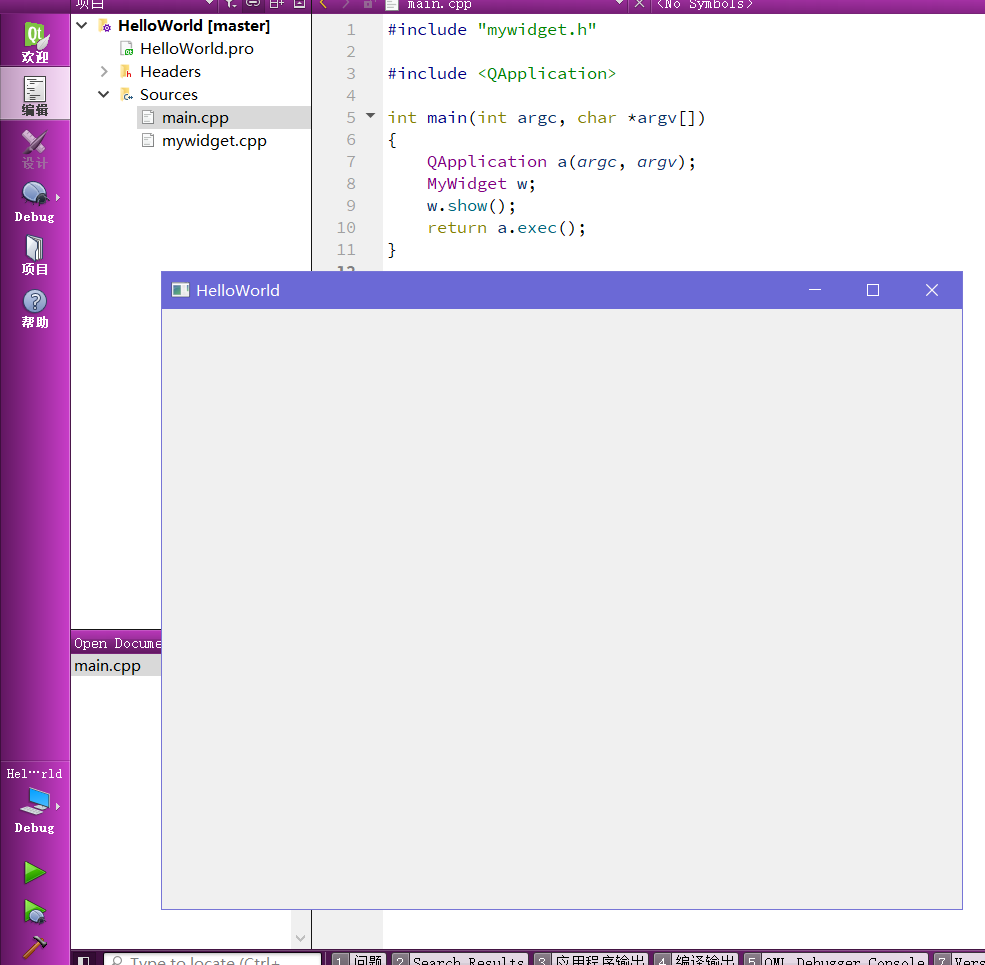

# 从零开始的Qt学习

Qt是一个跨平台图形用户界面应用程序开发框架，并在安装过程中提供了Qt Creator这个IDE

使用Qt Creator、VS、VS Code等都可以开发Qt程序，这里为简单起见使用Qt Creator进行开发

配环境过程在此不表，正常安装软件就行

## Qt HelloWorld

* 选择【Project】-【New】-【Application】-【Qt Widgets Application】-【choose...】

* 选择文件保存位置

* 选择building system

  可以选择qmake、cmake等多种用于创建makefile并进行自动化编译的building system

  这里选择qmake

* 选择类信息

  这里注意Qt在创建时会自动创建一个基本的类，需要修改这个类的名字，同时选择要继承的基类

  可以选择三种基类

  * qwidget：所有窗口类的父类，派生出两种子类
  * qdialog：从qwidget派生出的对话框窗口，只有一个关闭按钮，并且一般用作信息显示或弹出
  * qmainwindow：从qwidget派生出的主窗口

  这里选择qwidget即可

* 取消勾选【generate form】（创建界面）

* 不需要选择Translation

* 选择编译套件

  直接选择合适的Qt版本即可

* 如果有git，可以使用添加到版本控制系统：git 来进行版本控制，版本控制是自动配置的

创建完成后就会出现以下界面


点击左下角的绿色箭头即可执行该程序，可以看到出现了一个windows窗口



**`QApplication`是一个应用程序类，在每个Qt程序中有且只有一个**，用于处理窗口的情况

底层的原理是让程序进入一个消息循环，然后让其捕获外界触发条件

**`MyWidget`是一个窗口类，用来创建一个窗口对象**，窗口对象创建出来后默认不显示，所以使用`w.show();`

**`a.exec()`用于处理后台的消息循环，监控窗口收到的事件**，这是一个有出口事件的死循环（点右上角的×）

再来看mywidget.h头文件，

```c++
#ifndef MYWIDGET_H
#define MYWIDGET_H

#include <QWidget>

class MyWidget : public QWidget //窗口类
{
    /* 如果使用信号和槽，就要添加这个宏 */
    Q_OBJECT

public:
    MyWidget(QWidget *parent = nullptr);
    ~MyWidget();
};
#endif // MYWIDGET_H
```

HelloWorld.pro则用于管理整个文件项目，Qt会根据这个文件来执行cmake、make、gcc等编译系统

第一行是Qt程序用到的模块

修改TARGET即可修改应用程序的名字；TEMPLATE用来指定生成的makefile类型；SOURCES用来指定源文件；HEADERS用来指定头文件

在类名/头文件上点击F1即可显示帮助信息

创建新的**按钮类**并**指定其父类**就可以将按钮依附在某个窗口上

## 信号和槽

