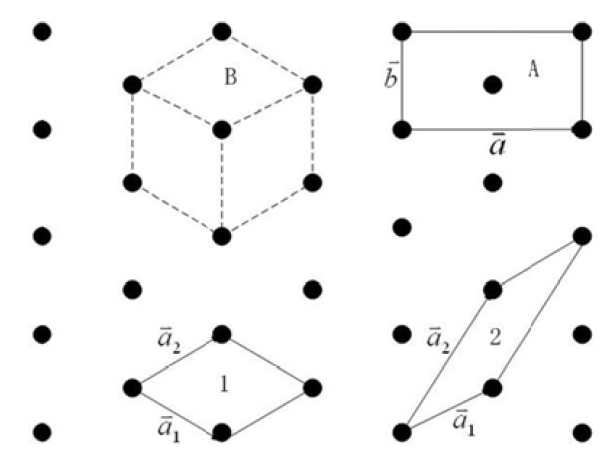
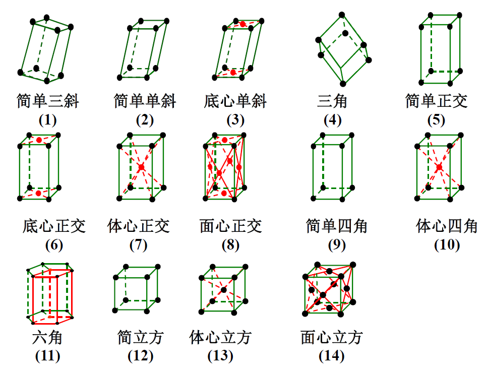
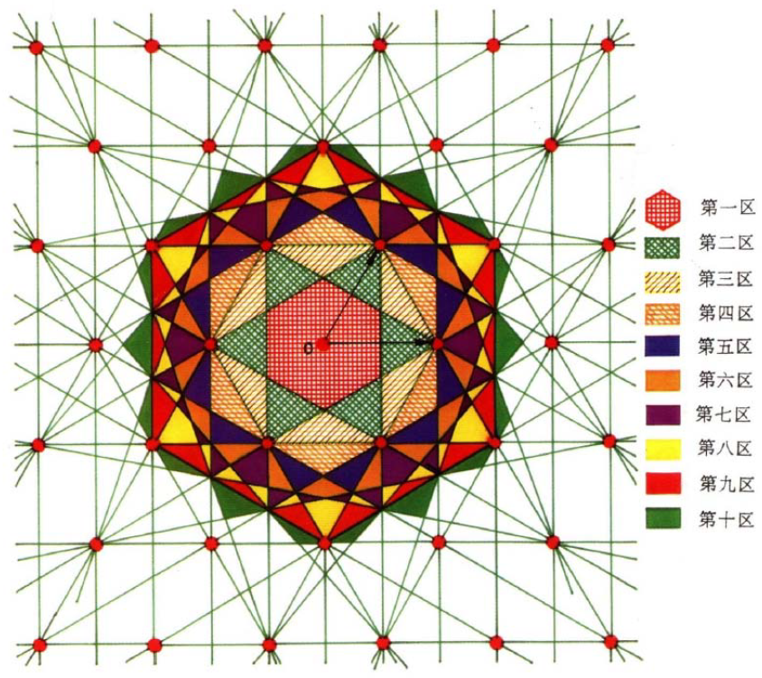

# 从固体物理到半导体物理1【晶体结构】

这一部分对应黄昆《固体物理学》中第一章，主要引出晶体的结构和用于描述晶体的一些物理量和方法

## 晶体与晶格

### 晶体的分类

固体分为晶体和非晶体，其中晶体分为**单晶体**、**多晶体**和**准晶体**。单晶和多晶内部以点阵式的周期性结构为基础，对同一品种晶体而言，二者都存在*固定熔点*，*多晶可以近似为由不同取向的单晶晶粒的集合*。单晶具有规则的外形，且内部原子排列长程有序，呈现*各向异性*。由单晶集合成的多晶则呈现部分有序，整体无序的形态。准晶具有完全有序的结构，但不具有单晶的*平移对称性*，反而具有单晶所不具有的*宏观对称性*。

固体物理和半导体物理**课程主要探讨单晶**的组成及其结构性质。半导体一般都指晶态半导体，其导电类型和电学性能可控，电阻率介于导体和绝缘体之间。

### 晶体基本特征

晶体具有以下特征：

* **周期性**（平移对称性）：一块宏观上足够小的完整晶体可以看成点阵元胞或单胞在空间三个方向上无限重复平移得到的

	> $f(\vec{r}+\vec{R}_m)=f(\vec{r})$

* 宏观对称性（准晶独有）

* **结构对称性**（点群对称性）：晶格具有旋转后对称的性质，用群进行描述，称为点群对称性

* **固定的熔点沸点**：晶体具有固定的熔沸点

* **各向异性**：晶体内部结构是具有周期性的，从而在宏观上呈现出各个方向的物理性质差异

固体物理就是从这些性质出发，使用到各自对应的基础数学工具和物理理论，从而构建了晶体性质的物理图像，从而为上层的半导体物理打下基础。

> 笔者感觉学到现在才刚刚了解了如何入门微电子（指材料方向）——底层的高数、线代、普物、复函、数物方程、量力、热统都是为了上层这一系列知识搭建的框架。而整个微电子的全貌就应该是从数学逻辑和物理基础出发，先构建半导体器件的物理图像，再将其性质应用到电路上，通过半导体器件物理、模拟集成电路这些连接底层理论和上层应用的课搭建半导体器件。最后才是集成电路和架设在集成电路上的计算机硬件和软件系统
>
> 和我选专业时候简单理解的“更靠近物理底层的电气专业”相差有点大（悲）

晶体、准晶体、非晶体的区别和判断方法：用**X射线衍射**判断

* 晶体：具有点阵空间对称性，包括平移对称性（周期性）7、旋转对称性（点群对称性）、反射对称性（手性对称性），长程有序
* 非晶体：原子排列无序，没有长程序，只有局部短程序
* 准晶体：晶体中只具有1、2、3、4、6重旋转对称，而*准晶体是具有5重旋转对称的固体*。准晶体点阵不存在平移对称性，但是有长程有序结构

### 周期性与晶体的几何描述

**周期性**结构是晶体最显著的特征

晶体中的原子、分子或原子团在空间规则排列，这些原子、分子、原子团是构成晶体的最基本单元，称为**基元**。基元呈现周期性排列，为了描述周期性，引入了**布拉伐格子**

在三维空间中，根据晶体结构性质，可以选取一组基矢量，称为**原基矢**，它们线性组合可以构成**晶格矢量**，简称**格矢**$\vec{R}_m$
$$
\vec{R}_m=m_1\vec{a}_1+m_2\vec{a}_2+m_3\vec{a}_3
$$
其中$m_i$是任意整数，其中点所指定的各点称为**格点**，一个**晶格**由符合晶体周期性特征的格点组成，晶格在物理上被描述成组成晶体的最小周期性结构，而在数学上可以抽象成**空间点阵**或**布拉伐格子**

> 按照以下原则确定晶体的原基矢：以三个原基矢撑起的平行六面体必须是构成晶格的最小体积单元，称为**原胞**
>
> 原胞要能反映晶体的对称性和周期性
>
> 布拉伐格子是一组无限个**全同点**的集合，连接其中任意两点可得一矢量，将各个点按此矢量平移能使它复原。注意，这里所说的平移**必须是按矢量平行移动**，而**没有丝毫的转动**。点阵中每个点都具有完全相同的周围环境。

如果将晶格这个最小的周期性结构单元抽象成几何点（**结点**），并沿着一定方向周期性出现，就构造出一个无限大的结构，从而能用无限大的点阵描述晶体结构

### 对称性和群

晶格具有结构**对称性**，经过某些特定的空间集合操作后，晶格可以自身重合。为了描述对称性，引入了**晶胞**（也称为单胞）：能够反映晶格最高对称度的周期性单元

> 注意区分晶胞和原胞（又称布拉伐格子或晶格）
>
> **原胞**：在晶格取一个格点为顶点，以三个不共面的方向上的周期为边长形成的平行六面体作为重复单元，这个平行六面体沿三个不同的方向进行周期性平移，就可以充满整个晶格形成晶体，这个平行六面体即为原胞。原胞是体积的最小重复单元，**反映晶体的周期性特征**。**要求结点只能在原胞的顶角上**。且原胞的选取不唯一，但同种晶体内原胞的体积必须一样
>
> **晶胞**：其形状、大小与空间格子的平行六面体单位相同，保留了整个晶格的所有特征。晶胞**反映晶体的对称性特征**，结点不仅可以在顶角上，还可以在体心或者面心上。并且体积不一定最小。一个晶胞内可能包含多个原胞

晶胞通常选用晶体学的惯用晶胞

如上图所示，1和2都是原胞，只包含一个格点。A为惯用晶胞，与1的对称度一样。当1中a1、a2的夹角为60度时，选取包含三个原胞1的晶格单元B作为晶胞，因为B的对称度大于1

需要注意：**惯用晶胞（单胞）的边长就是晶格常数a**

引入了晶胞，就可以结合群论来描述晶体的对称性。晶格在一定的对称操作下保持自身不变的性质称为**对称性**

晶格的对称性包括：

1. 平移对称性

	也就是上面所说的周期性，用公式$f(\vec{r}+\vec{R}_m)=f(\vec{r})$描述

	意思是：晶体内部相差一个晶格矢量$\vec{R}_m$的两点空间函数$f(x)$应该在平移一个晶格矢量后保持不变

	> f(x)是与空间有关物理量，静电势、电子密度等物理量都是空间位置的函数，也都遵循这个规律

2. 点群对称性

	根据群论，晶格具有以下12个点对称要素及其组合的点群对称性，而**晶格的点群对称性可以用一个晶胞的点群对称性描述**

	* **n重旋转轴**：n=1、2、3、4、6，如果晶格绕某一固定轴旋转$\frac{2\pi}{n}$或其整数倍后仍能与自身重合，称该轴为n重旋转轴。记为$C_n$
	* **镜像反射面**：如果想对于某平面作镜像反射后，晶格能与自身重合，称该平面为镜像反射面，记作$\sigma_{h/v/d}$
	* **反演中心**：将格矢$\vec{R_m}$变成$-\vec{R_m}$的操作，等效于2重旋转轴和镜面反射的组合，记作$i$
	* **n重旋转反射（反演）轴**：如果晶格绕某一固定轴旋转$\frac{2\pi}{n}$，再相对于垂直该轴的平面$\sigma_h$或反演中心$i$做镜像反射或反演后，能够与自身重合，则称该轴为旋转反射（反演）轴

> 点群有32种，空间群有230种
>
> 宏观对称性也要受到周期对称性的影响，因此对称素只能有十种（1，2，3，4，6及其空间反演对称轴），直白的说，就是正五角形铺不满。
>
> 宏观对称性对周期性也有要求，导致**布拉伐格子只有七类十四种**（所有晶体的抽象格式就十四种），14中布拉伐格子可以按照点群对称性分成7类即7大晶系。如下表所示
>
> | 晶系         | 布拉伐格子     | 单胞基矢量的特性                                             | 需要指明的基矢量长度和夹角 |
> | ------------ | -------------- | ------------------------------------------------------------ | -------------------------- |
> | *三斜晶系*   | 简单三斜（1）  | $a\neq b \neq c ; \alpha \neq \beta \neq \gamma$             | a、b、c、α、β、γ           |
> | **单斜晶系** | 简单单斜（2）  | $a\neq b \neq c ; \alpha = \gamma =90 \degree \neq \beta$    | a、b、c、β                 |
> | **单斜晶系** | 底心单斜（3）  | $a\neq b \neq c ; \alpha = \gamma =90 \degree \neq \beta$    | a、b、c、β                 |
> | *正交晶系*   | 简单正交（5）  | $a\neq b \neq c ; \alpha = \beta = \gamma = 90 \degree$      | a、b、c                    |
> | *正交晶系*   | 底心正交（6）  | $a\neq b \neq c ; \alpha = \beta = \gamma = 90 \degree$      | a、b、c                    |
> | *正交晶系*   | 体心正交（7）  | $a\neq b \neq c ; \alpha = \beta = \gamma = 90 \degree$      | a、b、c                    |
> | *正交晶系*   | 面心正交（8）  | $a\neq b \neq c ; \alpha = \beta = \gamma = 90 \degree$      | a、b、c                    |
> | **正方晶系** | 简单正方（9）  | $a = b \neq c ; \alpha = \beta = \gamma = 90 \degree$        | a、c                       |
> | **正方晶系** | 体心正方（10） | $a = b \neq c ; \alpha = \beta = \gamma = 90 \degree$        | a、c                       |
> | *立方晶系*   | 简单立方（12） | $a = b = c ; \alpha = \beta = \gamma = 90 \degree$           | a                          |
> | *立方晶系*   | 体心立方（13） | $a = b = c ; \alpha = \beta = \gamma = 90 \degree$           | a                          |
> | *立方晶系*   | 面心立方（14） | $a = b = c ; \alpha = \beta = \gamma = 90 \degree$           | a                          |
> | **三角晶系** | 三角（4）      | $a = b = c ; \alpha = \beta = \gamma < 120 \degree \neq 90 \degree$ | a、α                       |
> | *六角晶系*   | 六角（11）     | $a = b \neq c ; \alpha = \beta = 90 \degree , \gamma = 120 \degree$ | a、c                       |

### 倒空间和倒格矢

虽然布拉伐格子可以将晶体的周期性拆出来，让晶体可以像波那样归纳成`f(x+T)=f(x)`的形式，但是事实上晶体内的位置坐标是冗余的——我们只要知道晶格中N个原子中任意一个原子的坐标就可以利用周期性推导出其他原子的坐标。那么根据封装和抽象的理念，完全可以使用一套去冗余的方式描述晶体。数学家发现傅里叶变换可以完成这个任务

> 这里列出傅里叶变换的公式。在高数中学到的基本公式如下
> $$
> f(t) = a_0 + \sum_{n=1}^{\infin} (a_n cos (n \omega t) + b_n sin (n \omega t) ) 
> $$
> 傅里叶的一种理解就是将一个难以处理的函数变换为一系列容易处理函数（三角函数）的和，所有函数都应该满足*完备性*和*正交性*。
>
> 其中完备性指变换为的函数需要能覆盖到原函数的值域；正交性指一系列函数（相当于变换后函数空间的基）要满足正交性
>
> 而这里的基本公式就是将函数变换为一系列sin、cos的和
>
> 利用欧拉公式$cos x = \frac{e^{ix}+e^{-ix}}{2},sinx=\frac{e^{ix}-e^{-ix}}{2i}$可以把傅里叶变换在复数域上扩展为如下形式
> $$
> f(x)=\sum_{k=-\infin}^{\infin}c_ke^{i\frac{k\pi x}{l}}
> $$
> 其中l表示函数周期的一半，这就是复变函数中常见的傅里叶变换。它将时域值变换为频域值，同时将其展开成一系列指数函数的和
>
> 对于周期函数，傅里叶变换将其变成一系列离散的尖峰；对于非周期函数，则可以看成一个周期为无穷大的周期函数，从而获得其特征频域值——可以认为**傅里叶变换消除了函数的周期性，从而方便分析周期函数**
>
> 而在数学物理方程和量子力学中，为了方便使用常把傅里叶变换写成如下形式
> $$
> f(t)=\frac{1}{2\pi} \int_{-\infin}^{\infin} F(\omega) e^{i\omega t} d\omega
> $$
> 这就是下面要使用的公式了

**倒空间是正格子空间的傅里叶变换**，与波矢空间在同一空间中

在离散的晶格中，对布拉伐格子做傅里叶展开去除其周期性，就得到
$$
f(\vec{r})=f(l_1,l_2,l_3)=\sum_{k_1,k_2,k_3} C(k_1,k_2,k_3) e^{i \cdot 2\pi(k_1l_1+k_2l_2+k_3l_3)}
$$
其中的$k_1l_1+k_2l_2+k_3l_3$可以表示为内积的形式，为了进一步简化运算，设法构造一个与$\vec{a}$正交的矢量$\vec{b}$，于是要让他满足如下条件

1. 矢量b要垂直于两个矢量a的平面

	$\vec{b_i}=A(\vec{a_j} \times \vec{a_k})$

2. a与b矢量要归一化

	$A=\frac{1}{\vec{a_i} \cdot (\vec{a_j} \times \vec{a_k})}$

综上，再考虑系数$2\pi$就能得到倒格矢的定义
$$
\vec{b_i}=\frac{2\pi (\vec{a_j} \times \vec{a_k})}{\vec{a_i} \cdot (\vec{a_j} \times \vec{a_k})}
$$
对于其他方向的矢量$\vec{b_j},\vec{b_k}$类似

而由这些倒格矢张成的空间就是傅里叶变换后得到的布拉伐格子空间——**倒空间**

> 从倒空间的概念中，可以发现倒格空间中的空间结构等效为实空间中的波，反之亦然。
>
> 周期性的晶格空间对入射波的作用，等于以倒格矢为波矢的波叠加在入射波上的效果

### 倒格子的性质

1. 倒格矢和正格矢之间的关系
    $$
    \vec{K_n} \cdot \vec{R_m} = 2\pi \times 整数
    $$
    如果一个矢量与正格矢点乘后等于$2\pi$的整数倍，这个矢量一定是倒格矢

    如果一个矢量与正格矢点乘后是一个没有量纲的数，这个矢量一定能在倒空间表示出来
    $$
    exp(i \vec{K_n} \cdot \vec{R_m})=1
    $$

2. 倒格子基矢一定是按原胞基矢来取，二者有如下关系
    $$
    a_i b_j = 2 \pi \delta_{ij}=2\pi (i=j时) 或 0 (i \neq j时)
    $$

3. 倒原胞的体积
    $$
    \Omega ^* = \vec{b_1} \cdot (\vec{b_2} \times \vec{b_3}) =\vec{b_2} \cdot (\vec{b_3} \times \vec{b_1})=\vec{b_3} \cdot (\vec{b_1} \times \vec{b_2})=\frac{(2\pi)^3}{\Omega},\Omega 表示正原胞的体积
    $$

4. 倒格矢$\vec{K_h}$是晶面指数为(h1,h2,h3)所对应晶面族的法线
    $$
    \vec{K_h} \cdot \vec{AB}=0
    $$

5. 倒格矢与晶面间距$d_{h_1,h_2,h_3}$关系为
    $$
    d_{h_1,h_2,h_3}=\frac{2\pi}{\abs{\vec{K_h}}}
    $$

6. 任选一个倒格点为原点，从这个原点向其第一、第二、第三......近邻倒格点画出倒格矢，作这些倒格矢的中垂面，绕原点所成的多面体称为**第一布里渊区**，其体积为倒格子原胞的体积

### 布里渊区

第一布里渊区可以描述为：从原点触发，不与任何中垂面相交所能到达的倒空间区域，第n个布里渊区是从原点出发跨过n-1个倒格矢中垂面所到达的区域

**各个布里渊区的体积相等，都等于倒格子原胞的体积，布里渊区的边界面是倒格矢的垂直平分面**

> 在之后的能带章节中会了解区分布里渊区的作用

第一布里渊区又称为**简约区**

## 晶格结构

### 晶面和晶向

**晶向**：同一个布拉伐格子可以形成不同方向的晶体列，每个晶列定义的方向称为晶向

**晶面**：将布拉伐格子中的格点看成分列再平行等间距平面上的点，对应平面称为晶面

取晶面的法向量$\vec{V}=(x,y,z)$表示晶面的朝向，称为**晶面指数**，记作$(xyz)$

**晶面指数按惯用晶胞（单胞）基矢取**且**需化为互质整数**

**三维的晶面指数与密勒指数相等**

晶面系的密勒指数（平面的密勒指数）可以用的每个平面与基矢量坐标系的截距的倒数表示

符号相反的晶面指数只是在区别晶体的外表面时才有意义，在晶体内部这些面都是等效的

### 配位数

**最近邻**：离某一原子最近的原子称为该原子的最近邻

**配位数**：晶体中一个原子的最近邻原子数，记为CN

不存在11、10、9、7、5的配位数，最大配位数是12；可能的配位数有2、3、4、6、8、12

### 常见的布拉伐格子

常见的布拉伐格子有如下几个：

* 简单立方，记作SC：一个原子周围最邻近有6个原子，原子排列最紧密晶面是{100}，面间距a
* 体心立方，记作BCC：一个原子周围最邻近有8个原子，原子排列最紧密晶面是{110}，面间距$\frac{\sqrt{2}a}{2}$
* 面心立方，记作FCC：一个原子周围最邻近有12个原子，原子排列最紧密晶面是{111}，面间距$\frac{\sqrt{3}a}{3}$

**BCC与FCC互为倒格子**

如下表所示

| 正格子 | 倒格子 | 正格子晶格常数 | 倒格子晶格常数   | 简约区                               |
| ------ | ------ | -------------- | ---------------- | ------------------------------------ |
| SC     | SC     | a              | $\frac{2\pi}{a}$ | 由六个{100}面围成的立方体            |
| BCC    | FCC    | a              | $\frac{4\pi}{a}$ | 由12个{110}面围成的正12面体          |
| FCC    | BCC    | a              | $\frac{4\pi}{a}$ | 由8个{111}面和6个{100}面围成的14面体 |

### 常见材料的晶体结构

根据配位数不同可以做如下划分：

* CsCl型结构：CN=8
* NaCl型结构：CN=6
* 四面体结构：CN=4
* 层状结构：CN=3
* 链状结构：CN=2

**堆积比**：晶格中原子球体积占总体积的百分数

单胞/原胞的**体密度**：由晶格常数/边长算体积，数出原子个数，个数/体积即体密度

知道质量密度、原子量，由阿伏伽德罗常数求体密度公式如下
$$
面密度=体密度×面间距
$$

注意：这里“原子球体积”不是原子的真实体积

**金刚石和闪锌矿结构属于立方晶系**，其布拉伐格子为面心立方格子。金刚石结构的一个格点包含两种同种元素的原子，闪锌矿结构的一个格点包含两种异种元素的原子。**纤锌矿结构属于六角晶系**，一个格点包含4个原子，每个原子与周围的四个异种原子形成四面体结构。这三种电子结构都是sp3杂化轨道，每个原子与周围的4个原子以共价键或准共价键结合成四面体

*密排指的是在一个平面内相切的，非密排是不相切的*

**Si**、**Ge**：**金刚石结构**，由共价键结合

**GaAs**、InP、**SiC**、**ZnS**、GaP、InAs、GaSb：**闪锌矿结构**，由带一定离子性的准共价键结合

CdS、**GaN**、**ZnO**：**纤锌矿结构**，由带一定离子性的准共价键结合

**金属**一般是**密堆结构**，包括六角密排和面心立方

金刚石结构是“金刚石晶格”（Diamond Structure, DIA），不是布拉伐格子。可以看成FCC的套构
