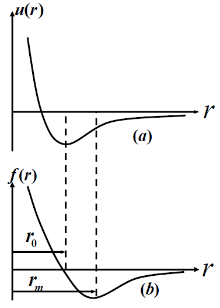
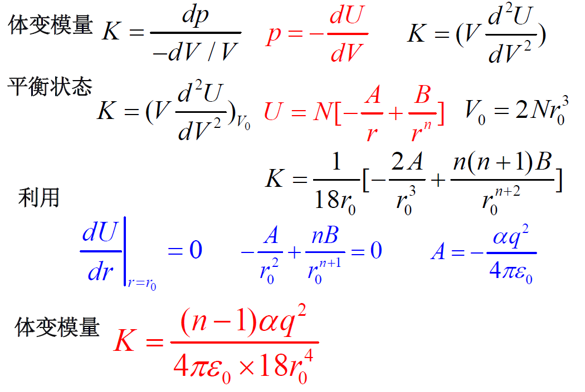
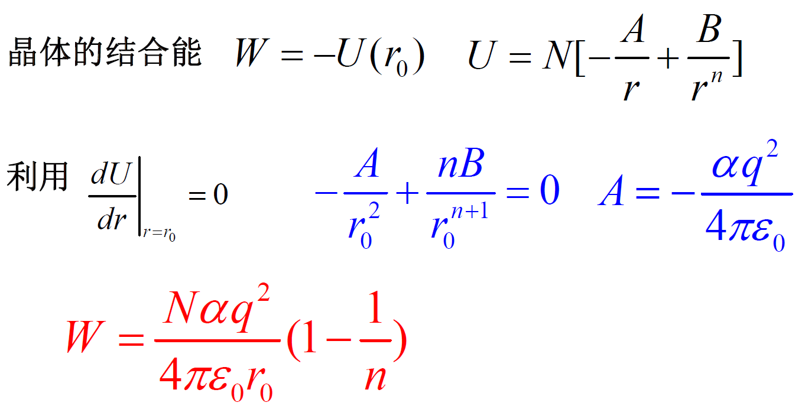
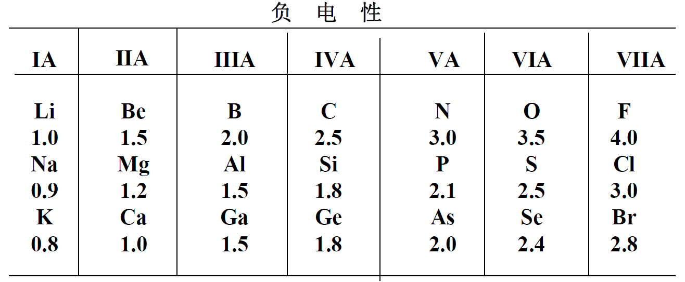

# 从固体物理到半导体物理2【固体的结合】

这节内容主要为之后的晶格振动和能带理论作铺垫，讲述常见的固体间结合作用

**离子键**：电子从一个原子完全转移到另外一个原子上，形成正负离子

**共价键**：原子间共用电子对

**金属键**：电子在整个晶体内共有，不再束缚在原子周围，即电子海

**范德华键**：稳定原子或分子间瞬时电偶极矩的吸引

**氢键**（少见）

> 固体间的结合作用本质上都属于静电吸引作用

**晶体结合能**：自由原子/分子/离子结合成晶体时释放的能量
$$
E_b=E_N -E_0
$$
E0表示晶体总能量，EN表示组成晶体的N个原子自由状态时的总能量，Eb是晶体结合能

晶体中原子间最基本的作用力是吸引力和排斥力的组合，**吸引力主要源于异性电荷间的库伦吸引；排斥力源于同性电荷之间的库伦排斥和泡利不相容引起的排斥**

存在一个相互作用势能
$$
u(r)=-\frac{A}{r^m}+\frac{B}{r^n}
$$
可以对其求导来计算出对应的原子间相互作用力
$$
f(r)=-\frac{du(r)}{dr}
$$
r表示两原子间距，其中分子是A的项代表吸引能，分子是B的项代表排斥能

存在如下图像

有平衡距离$r_0$，此处
$$
-\frac{\partial U}{\partial r}|_{r_0}=0
$$
能量在r0处达到极小值，此时吸引力等于排斥力

有吸引力最大的距离，这里恒有$-\frac{\partial^2 U}{\partial r^2}|_{r_m}=0$

$f(r_m)$代表**最大有效引力**

### 晶体结合的特性

1. **原子形成晶体以后，系统具有更低的能量**

2. 一般条件下, 晶体只受大气压的作用，对晶体体积的影响很小

3. 体变模量与结合能
    $$
    K=\frac{dp}{-\frac{dV}{V}},\ p=-\frac{dU}{dV}
    $$
    平衡状态下，存在
    $$
    K=V \frac{d^2 U}{dV^2}
    $$
    其中
    $$
    U=N[-\frac{A}{r^m} + \frac{B}{r^n}]
    $$
    A表示

    且
    $$
    V=Nfr^3
    $$
    
    
    

    计算出K以后可以使用
    $$
    U=N(-\frac{A}{r^m}+\frac{B}{r^n})
    $$
    计算出晶体结合能

    

    

    

    

## 固体的结合方式

### 离子性结合与共价结合

### 范德瓦尔斯结合

惰性元素最外层8个电子，具有球对称的稳定封闭结构。但是某一瞬时正负电中心不重合使原子呈现出瞬时偶极矩，使其它原子产生感应极矩

非极性分子晶体依靠瞬时偶极矩的相互作用而结合

## 负电性

负电性=0.18(电离能+亲和能)

周期表由上到下，负电性逐渐弱

周期表越往下，一个周期内负电性的差别也越小

周期表左端的元素负电性弱，易于失去电子；而右端的元素负电性强，易于获得电子，因此它们形成离子晶体
