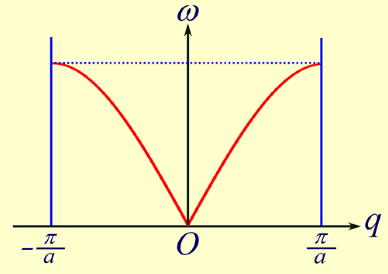
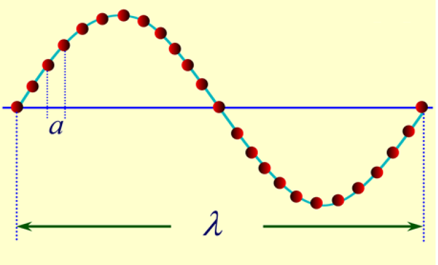
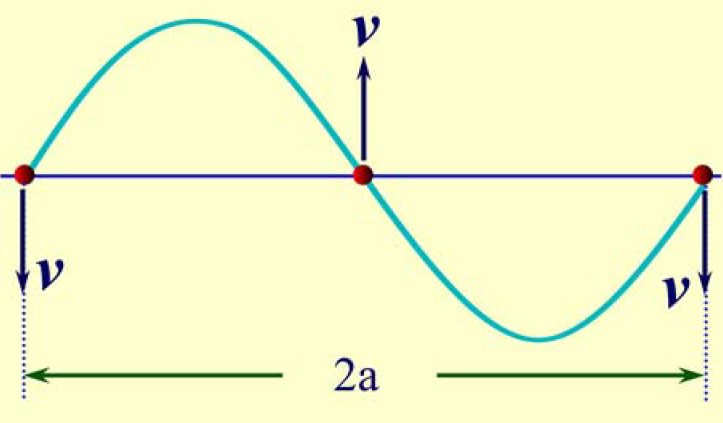
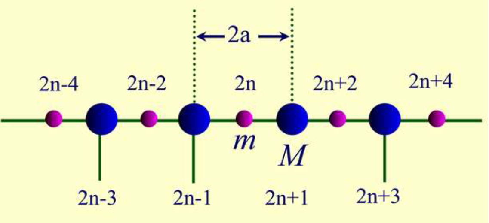
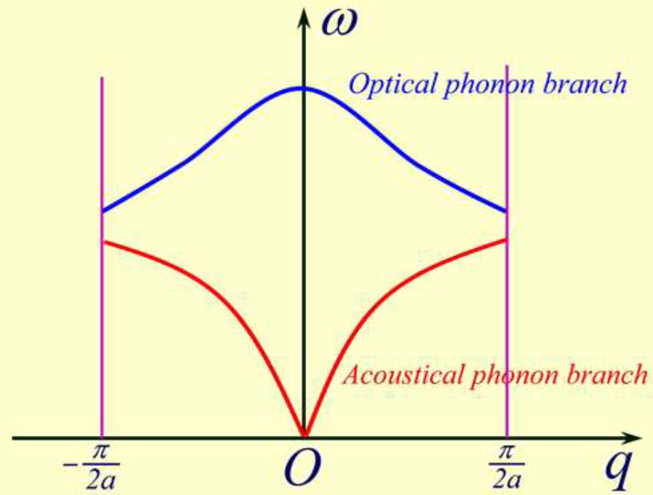

# 从固体物理到半导体物理3【晶格振动】

**有限温度（$T \neq 0K$）下，组成晶体的原子或离子以格点作为平衡位置作热振动**，这种振动就称为晶格振动

这一节总结一下晶格振动的知识

## 简谐近似和一维单原子链问题

将晶格振动看做小振动问题，就可以使用经典力学的观点解决问题了。

将布拉伐格矢$\vec{R}$作为平衡位置，进行**简谐近似**，相当于把一列原子等效成一根细绳。这样的近似存在问题，但可以大致推导出晶格振动的模式和波类似。具体到每个原子，分析时可以只考虑相邻原子的作用，即第n个原子受到的作用力

### 简正振动

**简正振动模式**：在简谐近似下, 由N个原子构成的晶体的晶格振动, 可等效成3N个独立的谐振子的振动. 每个谐振子的振动模式称为简正振动模式

简正振动模式对应着所有的原子都以该模式的频率做振动, 它是晶格振动模式中最简单最基本的振动方式

格波振动通常是三个方向上即3N个简正振动模式的线形叠加

### 一维单原子链模型

这个模型的一个条件是**绝热近似**，即用一个均匀分布的负电荷产生的常量势场来描述电子对

> 绝热近似的含义：
>
> 1. 电子和晶格之间是绝热的
> 1. 电子的能量不会传递给声子
> 1. 晶格固定不动
> 1. 等效于温度T=0K（绝对零度）
> 1. 晶体中的离子实（声子）都周期性地静止排列在格点位置上
>
> 以上几点都是绝热近似的表现，分别从热力学、量子力学、固体物理的角度进行描述，可以综合理解

绝热近似下，可以将电子的运动和离子的运动分开

考虑一维的简单情形，一个原子就是一个晶格，这样排成一排的单原子链就是最简单的抽象模型

### 格波

因为晶格具有周期性，一个晶格内的原子振动并不是孤立的，而是会通过相邻的原子在晶格之间传递振动模式，晶格的振动就具有波的形式，可以*将晶格的振动抽象为格波*

推导出第n个原子的运动方程
$$
m\frac{d^2 u_n}{dt^2}=\beta (u_{n+1} + u_{n-1} -2 u_n)
$$
其中β称为*准弹性力常数*，有$\beta = \frac{K}{a}$，K为弹性模量，计算方法参考上一节的弹性模量计算；a表示*晶格常数*

在一维单原子链模型中，有n个原子，每个原子都有一个自己的运动方程，也就是n个相似但不一样的运动方程，可以解出总体的格波方程
$$
\mu_n  =Ae^{i(\omega t - naq)}
$$
其中频率
$$
\omega^2 = \frac{4\beta}{m} sin^2 (\frac{aq}{2})
$$
格波的波速（相速度）$v_p=\frac{\omega}{q}$，它是波长的函数，从而有
$$
\omega = v_p q
$$
格波频率ω和波数q之间的关系被称为**色散关系**，对应宏观角度就是格波的振动**频谱**

> 从频谱这个名字不难联想到傅里叶变换
>
> 我们在第一节用到了傅里叶变换推导出的倒空间，这里的格波很显然可以写成三角函数和的傅里叶变换形式。在有了这一层联系之后就可以通过倒空间来简化很多正格子空间里面以三角和e形式出现的复杂运算了
>
> 别急

容易推导出格波的其他参数

1. 波长
    $$
    \lambda = \frac{2\pi}{q}
    $$

2. 波矢
    $$
    \vec{q}=\frac{2\pi}{\lambda} \vec{n}
    $$

3. 相邻原子的相位差
    $$
    (n+1)aq-naq=aq
    $$

4. 不同原子间的相位差
    $$
    n'aq - naq = (n' - n)aq
    $$

在普物里学过连续介质波，可以发现*格波和连续介质波具有完全类似的形式*，也就是说**一个格波表示的是所有原子同时做频率为$\omega$的振动**

简谐近似下，格波是简谐平面波

经过对比可以发现，相邻原子相位差$2\pi$，那么两原子的振动状态相同；进一步，当相邻原子的位相差为$-\pi < aq < \pi$情况下，波矢的取值为$-\frac{\pi}{a} < q \le \frac{\pi}{a}$，这个区间实际上就是**第一布里渊区**

所以可以发现，由于晶格的周期性排布，我们只要研究清楚第一布里渊区的晶格振动问题，就可以通过周期性推导出其他任意区域的物理情景

### 玻恩-卡门（Born-Karman）周期性边界条件

一维单原子模型下，晶格看作无限长，所有原子是等价的；但实际上的晶体是有限的，也就是说链边缘的原子不能用中间原子的运动方程来描述。我们可以换一个模型——**将N个原子头尾相接形成一个环链**，这样就保持了所有原子等价的特点，由于N很大，原子运动近似为直线运动。

**这个模型并没有在原来的基础上增加新东西，只是对原有结论加以规范**

在这个模型下推导出的结论如下

波矢
$$
q=\frac{2\pi}{Na} \times h
$$
其中h为整数，且有$-\frac{N}{2} < q \le \frac{N}{2}$

第一布里渊区内的线度$\frac{2\pi}{a}$，状态数为N

模型中存在以下三个性质：

1. 所有原子以相同角频率$\omega$和振幅$\omega_m$作简谐振动

2. 各个原子间有一均匀变化的位相差，相邻原子间位相差$|q|a = \frac{2\pi}{\lambda} a$

3. 若两个波矢q和q'存在以下关系
    $$
    q'=q+\frac{2\pi}{a} l
    $$
    则相对于这两个波矢的格波所引起的原子振动相同

推导出新模型的色散关系为
$$
\omega^2=\frac{2\beta}{m} sin^2 (\frac{aq}{2})
$$
可以化简为色散关系的*常用形式*：
$$
\omega = 2 (\frac{\beta}{m})^{\frac12} \abs{sin \frac{qa}{2}}=\omega_m \abs{sin \frac{qa}{2}}
$$
其中$\omega_m$代表最大震动角频率$2(\frac{\beta}{m})^{\frac12}$

一维单原子链中准弹性波的传播速度
$$
\nu = v\lambda = \frac{\omega \lambda}{2 \pi} = \frac{\lambda}{\pi}(\frac{\beta}{m})^{\frac12} \abs{sin \frac{\pi a}{\lambda}}
$$
可知

* 频率是波数的偶函数
* 色散关系曲线具有周期性

色散关系曲线如下

对其进行分析，发现**只有频率$0 \le \omega \le 2 \sqrt{\frac{\beta}{m}}$之间的格波才能在晶体中传播，其它频率的格波被强烈衰减**——一维单原子晶格看作低通滤波器

长波极限情况下，存在
$$
\omega = V q
$$
其中
$$
V=a \sqrt{\frac{\beta}{m}}
$$
K表示连续介质的弹性模量，ρ表示介质密度

在连续介质波中，常有
$$
V=\sqrt{\frac{K}{\rho}}
$$
这里无异于把K换成了β，ρ换成了m，又额外乘了一个系数a

也就是说**一维单原子格波的色散关系与连续介质中弹性波的色散关系一致**

> 这里解释一下后面会一直出现的长波极限和对应的短波极限
>
> **长波极限**：波长$\lambda \rightarrow \infin$，波矢$k \rightarrow 0$的情况
>
> **短波极限**：波长$\lambda \rightarrow 0$，波矢$k \rightarrow \infin $的情况
>
> 长波极限可以理解成将目标波视为一种弹性波（声波）。短波极限可以理解为将目标波视为一种光学波（光波）
>
> 在固体物理中，二者概念被缩小到了“远大于”和“远小于”，即
>
> **长波极限**：波长$\lambda \gg a$，波数$q \ll \frac{\pi}{a}$
>
> **短波极限**：波数$q \rightarrow \frac{\pi}{a}$

短波极限下，存在
$$
\omega = 2\sqrt{\frac{\beta}{m}} \abs{sin(\frac{aq}{2})}=\omega_m \abs{sin \frac{qa}{2}}
$$
从而有波长
$$
\lambda = \frac{2\pi}{q}=2a
$$
**相邻两个原子振动的位相相反**

用图示表明二者区别如下：

上图是长波极限，整个格波就像一个宏观上的连续介质波

下图是短波极限情形，就好像晶格内分散着一堆反相运动的粒子

## 一维双原子链问题

在原来单原子链的基础上，增加一种原子，现在我们有这样一个模型：

既然我们有了两种原子，那么就可以同时写出两种原子的运动方程，用和之前一样的经典力学方法（简正坐标）或者用格波的公式方法推出结果

两种格波的解表示为：
$$
\omega_{1,2} = \frac{\omega_0^2}{2} [1 \pm \sqrt{1-r^2 sin^2 \frac{qa}{2}}]
$$
其中格波角频率
$$
\omega_0^2 = 2\beta \frac{m_1 + m_2}{m_1 m_2}
$$
幅值
$$
r^2 =4 \frac{m_1 m_2}{(m_1 +m_2)^2}
$$
不难发现：

* 一维双原子链（或者说一维复式格子）种存在两种独立的格波，如下图所示

    

* 对应存在两种色散关系

将两种格波里频率较高（带+号）的那一支称为**光学波**；频率较低的那一支称为**声学波**

布洛赫定理的定义

当势场有周期性时 V(r) = V(r+Rn) 时，波动方程的解满足
$$
\psi (r+R_n)=e^{ikR_n} \psi(r)
$$

故，ψ可以写成 
$$
\psi(r)=e^{ikr}U_k(r)
$$
其中Uk(r)在晶格平移下保持不变。

物理意义：Bloch电子波函数是受晶格周期函数调制的平面波。

一维双原子链的光学支和声学支画一下，那几个特殊点的意义是什么？ 两支的物理意义是什么？

图的话可以参考课件，这里列出几个比较关键的特殊点的物理意义：长波极限对应着波矢q趋向于0时的情况，晶格振动的最大频率是在光学支上取得的，最小频率是在声学支上取得的，波数q在布里渊区边界取值时发生布拉格反射，形成驻波，群速度为零。

长光学支格波的物理意义：每个原胞内的原子做相对振动，频率较高。

长声学支格波的物理意义：原胞原胞中的原子做整体运动，频率较低。

