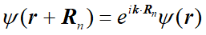
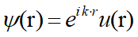
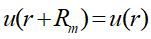
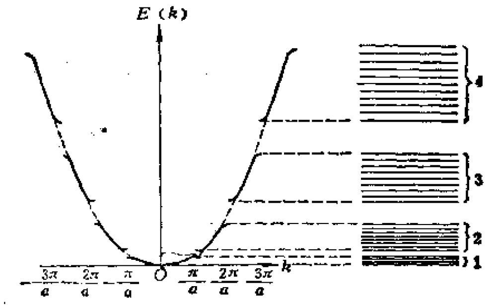
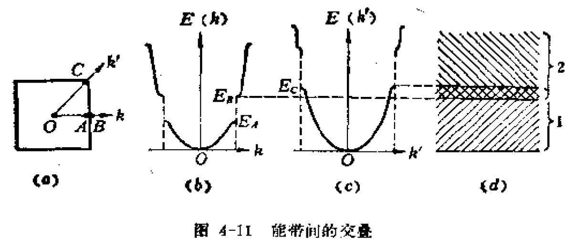

# 从固体物理到半导体物理4【能带】

能带理论是一个近似的理论，固体中的电子运动是相互关联的，不可能得到这种复杂多电子运动的严格解。目前最被广泛接受的一种近似理论就算**能带理论**。

## 电子的能级

首先根据薛定谔方程
$$
[-\frac{\hbar^2}{2m} \laplacian+V(r)]\psi =E\psi
$$
推导电子在自由空间、氢原子核有限空间中薛定谔方程的解。得到了这三个情况下电子波函数，就可以广泛地对多电子原子和一些更复杂的情况总结出普遍规律，从而帮助我们分析原子的能量性质

1. 自由空间

    自由空间中势场为0，$V(r)=0$，因此解为
    $$
    \psi(r)=Ae^{ikr}
    $$
    这个波函数展示了在r方向上传播的平面波，其波长$\lambda=\frac{2\pi}{k}$，k为平面波的波数

    > 波数和波长成一个倒数关系，用波长可以描述电子的波动性，用波数可以描述电子的粒子性
    >
    > 需要注意：**自由空间中电子的波数k可以取任意值**，因为不存在边界条件约束波动

    含时波函数为$\psi(r,t)=Ae^{j(kr - \omega t)}$，其中$\omega =2\pi \nu$，$\nu$是平面波的频率

    于是可以得到德布罗意关系
    $$
    P=\hbar k=\frac{h}{\lambda};E=\hbar \omega =h \nu = \frac{hc}{\lambda}
    $$
    从粒子性考虑，可以知道动量$P=m_0 v$和能量$E=\frac{1}{2} \frac{p^2}{m}$，带入上式有
    $$
    v=\frac{\hbar k}{m_0};E=\frac12 \frac{\hbar^2 k^2}{m_0}
    $$
    **在自由空间中，电子的E-k关系**是呈**抛物线型**

    电子不受或几乎不受原子核的影响，这样的情况都可以使用自由电子模型来近似描述，这种近似方式被称为**自由电子近似**

2. 氢原子

    氢原子中，电子的势函数存在
    $$
    0-V(r)=\frac{q^3}{4\pi \epsilon_0 r}
    $$
    表示将电子移动到无穷远时，电场力做负功
    $$
    V(r)=-\frac{q^3}{4\pi \epsilon_0 r}
    $$
    因此薛定谔方程变形为
    $$
    \frac{2m}{\hbar^2}(E+\frac{q^2}{4\pi \epsilon_0 r}) \psi + \laplacian \psi=0
    $$
    将其变换成球坐标形式并使用分离变量法解出定态解，表示为
    $$
    \psi(r,\theta,\Phi)=R(r)\Theta(\theta)\Phi(\phi)
    $$
    在求解过程中三个分式分别包含了三个变量，它们分别是

    * 主量子数n
        $$
        E_n=-\frac{m_0 q^4}{8\epsilon_0 h^2} \cdot \frac{1}{n^2} \approx -13.6 \frac{1}{n^2}
        $$
        给出了**氢原子能量量子化表达式**

    * 角量子数l

    * 磁量子数m

    在基态，n=1，l=m=0，可以得到波函数
    $$
    \psi_{100}=\frac{1}{\sqrt{\pi}} (\frac{1}{a_0})^{\frac32} e^{-\frac{r}{a_0}}
    $$
    其中$a_0 =\frac{4\pi \epsilon_0 \hbar^2}{m_0 q^2} \approx 0.529 \mathring{A}$为中性氢原子的半径，也称为**玻尔半径**

    于是我们可以得到氢原子的基态波函数是球形的，电子在r到r+dr这个薄壳层中出现的概率为
    $$
    P(r)=|R(r)|^2 r^2 dr
    $$
    在$r/a_0 = 1$时，达到概率最大

    电子只要受到原子核较强影响，就可以使用氢原子的电子模型来描述，在这种情况下，电子的运动空间会被束缚在原子核附近，因此这样的近似描述被称为**紧束缚近似**

3. 长度为L的一维有限空间中

    在这一模型下，存在势场为0，边界条件$\psi_n(0)=\psi_n(L)=0$，得到的解与自由空间中电子的平面波函数有相同形式
    $$
    \psi(r)=Ae^{ikr}
    $$
    但由于存在边界条件，**k只能取分立的值**
    $$
    k=\frac{\pi n}{L}
    $$
    得到
    $$
    E_n=\frac{1}{2} \frac{\hbar^2 k^2}{m_0}=\frac{1}{2} \frac{\hbar^2}{m_0} (\frac{\pi n}{L})^2
    $$
    可以发现：**波函数在有限的空间中形成驻波，每一级驻波代表一个量子态，可以被两个自旋方向相反的电子占据**。有限空间中，波函数必须是驻波才能保持稳定

我们将上述三个模型推广到多原子电子中，可以发现电子轨道能量分立、不连续的特性是广泛成立的，因此**我们可以用能级来描述电子的状态**

能级理论是能带理论的基础

## 布洛赫波

这一部分内容相当于一个“前置理论”。布洛赫定理给出了晶格中普遍存在的周期性规律，这为后面能带理论的导出提供了一个基本假设——**严格周期性**假设

### 布洛赫定理

当势场具有周期性时，波动方程的解具有以下性质：
$$
\psi (r+R_n)=e^{i\vec{k}\cdot R_n} \psi(r)
$$
上式即为**布洛赫定理**

> 这里不加证明地使用该定理。根据后面讲的*单电子近似*假设 ，通过引入描述平移对称操作的算符T，带入单电子运动的哈密顿量后可以得到一系列与T对易的H本征态；随后根据波恩-卡门边界条件就可以筛选出三个分别沿原胞边方向的矢量，它们的线性组合具有周期性，这就意味着这个周期性对所有H适用，即得到布洛赫定理

使用该定理可以将波函数写成
$$
\psi(r)=e^{i\vec{k} \cdot r}u(r)
$$
的形式，其中u(r)具有与晶格相同的周期性，即
$$
u(r+R_n)=u(r)
$$
该式表达的波函数称为**布洛赫函数**，数学本质上是平面波和周期函数的乘积

其中k称为**波矢**，是对应于周期函数带来平移操作本征值的量子数，能够表示原胞之间电子波函数位相的变化。

### K空间和第一布里渊区

根据布洛赫定理的证明过程，我们可以得到波矢k是三个沿原胞边方向的矢量的线性组合，如果k改变了一个倒格子矢量，完全不会影响波函数的本征值，因此我们需要约定一个条件来让k既能概括所有本征值又没有两个k值相差一个倒格矢。这个条件就隐藏在我们之前引入的**第一布里渊区**

所有k值可以组成一个向量空间，这被称为**K空间**。K空间以$k_x, k_y,k_z$为基矢，这三个k值又对应物理空间中的波函数本征值矢量的线性组合。通过引入K空间，我们所有对晶胞的计算都可以从物理空间转移到K空间，从而在量子力学计算中引入周期性，这为计算带来了方便。

如果以$\vec{b}$表示k空间的基矢，以$\vec{a}$表示晶格的基矢，那么存在
$$
\vec{a_i} \cdot \vec{b_i} =2\pi \delta_{ij}
$$
k空间和晶格物理空间是对易的，因此k空间又被称为**倒格子空间**，

> $$
> \vec{K_n} \cdot \vec{R_m} = 2\pi \times 整数
> $$
>
> 这是倒格矢和正格矢之间的关系
>
> 而对于倒格子基矢和正空间基矢，它们的关系就是上面k空间和晶格物理空间的关系

回顾之前对布里渊区的介绍，第一布里渊区可以描述为：从原点触发，不与任何中垂面相交所能到达的倒空间区域，第n个布里渊区是从原点出发跨过n-1个倒格矢中垂面所到达的区域。我们可以发现：k空间正好可以被布里渊区所覆盖。我们只要提出**第一布里渊区**，通过周期性就能描述所有布里渊区中的物理情景，也就是之前所求的哪个条件！

## 能带

晶体中存在大量规则排列紧密，相互作用的原子，它们中的电子状态分析利用的是固体能带理论：每个原子都有自己的能级分布，在原子数目很大的情况下，原子中的能级会扩展成能带。这便是能带理论的直观描述。在分析能带前，我们先要了解能带理论建立的前提

### 能带基本假设

薛定谔方程可以很好地描述单个电子在各种场景下的运动，但对于晶体这样包含无数电子的关联系统就无能为力了：正像包含了广义相对论修正的恒星三体运动方程不可解，超过三体的关联系统的薛定谔方程是不可能解出来的。因此我们需要引入简化问题的基本假设

1. 共有化运动

    原子组成晶体后，最外层电子可以在整个晶体中运动，这被称为**共有化运动**。回想之前推导的电子运动近似规律，可以发现**晶体原子内层电子可以用紧束缚近似描述，最外层电子可以用自由电子近似描述**，内层几乎不对外层产生影响。通常情况下，半导体的电子学行为就是由做共有化运动的最外层电子的输运行为决定的

2. 单电子近似

    在晶体中，原子按晶格格点周期性排布，原子核产生了一套固定不动、相互交叠且周期性变化的势场。原子核、电子之间产生复杂的相互作用，这大大增加我们分析问题的复杂度。考虑到共有化运动的大量电子对原子核的反作用是微不足道的。将其中一个电子作为考察对象，只需要分析其他电子产生的平均势场和原子核的周期性势场叠加得到的周期性势场就可以满足我们的需求。于是我们得到了一个被称为**单电子近似**的关键理论：周期性势场可表示为
    $$
    V(r)=V(r+na)
    $$
    这个势场是晶体中所有原子和所有电子产生势场的总和。使用这个近似我们就不需要再考虑三体问题了

3. 布洛赫波

    **布洛赫定理**指出：周期性势场中运动的电子，其波函数具有以下形式

    

    也就是说它给出了周期性势场下电子波函数应具有的普遍性的性质。这个函数被称为**布洛赫函数**，我们将其写成*带周期性的形式*

    

    其中

    

    可以发现对共有化运动的电子来说，周期性排列的每个原子都是相同的，因此**可以将共有化运动电子视为具有周期性调幅因子的平面波**。我们将晶体中的电子称为**准自由电子**

> 能带理论的基本假设：**不考虑散射、碰撞、能级跃迁等情况，将晶格中电子的运动近似为自由电子的运动，并且周期性势场很弱，可以当做微扰来处理**，这便是上面三点的定性概括

根据上面三个假设，我们可以建立一套**三维空间周期场中完整的近自由电子近似**，这就是概括了能带理论的数学模型。对应上面的假设，我们可以建立能带论的三个基本近似：

* **绝热近似**：假定原子核（离子）在晶格点上固定不动，当分析电子的运动时忽略原子核实际的运动。这可以避免方程中出现含时项
* **单电子近似**：将对所有电子的求和转化为一个平均势场作用在单电子上。这可以避免电子之间的多体问题
* **严格周期性**：假设电子感受到的势场是一个严格的周期势。在周期势背景下研究问题可以采用多种方法简化问题的分析

通过近似可以将电子的一套薛定谔方程转换为
$$
\hat{H} \psi = [-\frac{\hbar^2}{2m} \laplacian+V(r)]\psi =E\psi
$$

$$
V(r)=V(r+R_l),R_l = \sum_i l_i a_i
$$

即**周期性结构中德布罗意波的传播问题**

### 能带理论

从近似概念回归到数学模型，我们会发现*三维空间周期场中的近自由电子近似*首先是一个微扰模型，因此我们可以根据微扰论求解得到一阶、二阶......n阶近似。

在自由电子近似中我们通过计算可以得到
$$
k=\frac{2\pi l}{na}
$$
其中l是角量子数，n表示能级近似阶数，这对周期场中的近自由电子近似是同样成立的

重点考虑能量E和波矢k的关系

> 能量E是我们的最终目标——分析电子能量就能得到固体的电子学特性，从而满足后续应用的需求；而波矢k是k空间的基本组成，相当于物理空间中的动量（实际上它和K空间中的动量呈线性关系）

零阶近似相当于自由电子近似，能量本征值$E_k^0$作为k的函数具有抛物线形式；n阶近似中，我们开始引入周期势场的微扰，使得k只与$k+\frac{2\pi}{a}n$的状态产生相互作用，若k不在$\frac{\pi}{a}n$附近，存在
$$
|E_k^0 -E_{k+\frac{2\pi}{a}n}^0| \gg |V_n|
$$
也就是能量修正很小；但在特殊值附近的k则会存在微扰带来的巨大差别

简并微扰影响下，原来能级较高的电子能级更高了，原来能级较低的电子能级更低了，这被称为能级间的*排斥作用*。宏观上来看，由于周期势场存在，E(k)会在$k=\frac{\pi}{a}n$处断开，能量突变为$2|V_n|$，如下图所示

注意到随着原子数量的增多，n会变得很大，而此时k的取值会变得密集，这个图中的能级排布会越来越密集，最终形成一系列不连续的**能带**，每个能带都可以包含
$$
\frac{na}{2\pi} \times \frac{2\pi}{a}=n
$$
种可能的k取值，也等于晶格中原胞的数目，如果计入自旋则每个能带中包含2n个量子态

我们称能带是**准连续**的，这样的能级结构就是能带理论的核心

各个能带之间不存在能级，这样的间隔称为**带隙**或**禁带**；准连续的能带部分则被称为**允带**

> 有些教材里把能量禁区都称为禁带，但在大部分文献中提到的**禁带**或者说**band gap**基本上都是**特指导带和价带之间的能量禁区**

### 简约波矢

之前提到过，我们可以使用第一布里渊区来限制k的周期性。

对于**一维晶格**，第一布里渊区范围$-\frac{\pi}{a} \sim +\frac{\pi}{a}$，也就是说只需要在
$$
-\frac{\pi}{a} < k < \frac{\pi}{a}
$$
范围内研究E-k关系就足够了，总是存在
$$
k=k+\frac{2\pi}{a}n
$$
为了方便描述，我们引入**简约波矢**概念：简约波矢$\bar{k}$是第一布里渊区内的波矢k，对它进行变换
$$
\bar{k}+\frac{2\pi}{a}n =k
$$
就可以得到第n布里渊区内的波矢k。**从量子力学角度看，简约波矢是平移算符的一般量子数，满足布洛赫定理。从数学角度看，每个允带中的E-k关系都是周期性函数，具有相同的周期$\frac{2\pi}{a}$，并且在第一布里渊区范围内，E总是k的多值函数**

> 根据这样的性质，我们可以理解“简约”的含义了：对k的化简，从而利用其周期性
>
> 故又将第一布里渊区称为简约布里渊区

### 能带交叠

上面的内容是基于一维晶格得到的，而在实际的三维晶格中，k空间中的布里渊区是真正的无数二维平面，这样不同能带不一定会在能量上分隔开，有可能存在**能带交叠**现象

沿各个方向，晶格参数a是不同的，这就造成了k值分布查别，从而导致布里渊区边界不同方向上E(k)是间断的，但不同方向断开时能量的取值不同，导致能带在相同的能量上产生交错，如下图所示

### 从半导体角度理解能带

固体物理只是在量子力学的基础上推导出能带理论，并没有针对实际应用提出可用的理论；而半导体物理中，能带被按照费米能级（后面会提到）更细致地分类

> 半导体中的电子能级由于原子之间的相互作用，原子和原子之间的电子波函数发生交叠，从而使原子分立的能级分裂成一系列的能带。每个能带中电子的能级是分立的能级，但是能级和能级之间的能量差非常小，能量的变化可以看成是准连续变化。

在半导体中，在0K下完全空着的能量最低的能带称为**导带**（Conduction Band）。导带的最低能级为**导带底**，用$E_C$表示。完全被电子占据的能量最高的能带称为**价带**（Valence Band）。价带能量最高的能级称为**价带顶**，用$E_V$表示。将导带和价带之间的能量禁区（带隙）称为**禁带**（Band Gap）。

晶体中的电子能级能量越低，原子之间的电子相互作用越弱，能带越窄；而能带和能带之间的能量禁区（禁带）越大。在这些能带中电子在各能级中填充时先占据低能级，每个k状态上填充2个电子。

假设形成晶体的原子能级都是非简并能级，如果晶体的原胞中电子的数量是**偶数**，组成晶体的原胞数量有N个，则电子的总数是N的偶数倍，这样晶体的每个能带中有N个能级，可以被填充2N个电子。在电子填充时，每个能带都填充2N个电子，总共有N的偶数倍个电子，能够被填充的能带一定是要么完全被填充，要么完全空着的状态。这样的材料为**半导体或者绝缘体**。如果组成晶体的原胞中的电子个数是**奇数**。那么这样在电子填充时最高一个被填充的能带一定是半满的能带，这样的材料为**金属**。当然，实际的材料不一定都是这样的，但是大部分都满足这样的规律。

有些材料的能带和能带之间能够发生交叠，例如原子的能级顺序发生交叉的原子形成的晶体中，能带和能带就能够发生交叠。发生交叠的能带也可能是半填充的，构成金属材料。而半导体和绝缘体的差别就在于最高被完全填充的能带和最低被完全空着的能带之间的禁带的差别。半导体的这个能量禁区较小，在热振动作用下，被填充能带中的电子就有一定几率跃迁到完全空着的能带中，从而形成导电的载流子。而绝缘体的这个能量禁区较宽，需要更多的能量才能使最高能级是满带中的电子跃迁到上一个能级，导致通常情况下没有导电的载流子。绝缘体在外加能量足够的情况下也可以变成半导体或导体，这是因为外加的电压给予价带中的电子更多能量，它就能跃迁到导带了

对于半导体物理，能带的描述并没有那么“数学”：绘制半导体的能带一般有两种方式，一种是在实空间绘制能量变化情况，通常我们用导带底能级$E_C$代替导带，用价带顶能级$E_V$代替价带，绘制**能带简图**。另外一种表示能带的方式就是绘制能量E与电子状态、波矢k之间的**关系曲线图**。前者是半导体物理中常用的，后者则一般被用于固体物理。

从固体物理到半导体物理的不同可以理解成按照能带理论对底层的量子力学进行“封装”，这样顶层的工程师可以更容易理解材料性质而不用深究量子力学和热力学理论

半导体有“直接带隙和间接带隙”的区分

Si是金刚石结构，导带的能量高，价带的能量低，费米能级在导带和价带之间。

Si掺杂成n型加入什么物质？费米能级怎么移动？

加入施主杂质（如5价的磷），费米能级升高，向导带靠近。

德拜模型的定义

德拜模型在爱因斯坦模型的基础上，考虑了晶格振动频率的分布，更好地模拟了晶体热容的变化规律，克服了爱因斯坦模型得到的热容在低温情况下下降过快的缺点。

•近自由电子近似的微扰处理方法

–非简并（远离布里渊区边界）：以自由电子的波函数为零级近似，考虑周期性势场的波动引起的修正。能量取到二级近似，波函数取到一级近似

•简并（靠近布里渊区边界）：原子轨道线性组合法；能级在布里渊区边界劈裂，E-k曲线以抛物线形式趋近

