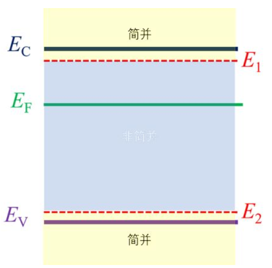

### 半导体电中性条件的解释

对于存在杂质补偿的半导体，有电中性条件
$$
n+(N_a -p_a)=p+(N_d -n_d)
$$
其中n、p分布表示电子和空穴，也就是载流子。$N_a,N_d$分别表示受主能级和施主能级——也就是掺杂进半导体的杂质带来的杂质能级——的密度。$p_a$表示受主能级上的空状态（空穴）密度，$n_d$表示施主能级上的电子密度

施主能级电子浓度等于施主能级密度，因此其完全电离的情况下，首先和受主能级上的空穴结合；以及受主能级上的空穴首先接收施主能级电子的过程，就分别是$N_a-p_a$和$N_d-n_d$，而后得到的有效电子、空穴才能计入整体

将这个方程中的变量再组合，就可以得到：

* 电离施主密度=$n+N_a$
* 电离受主密度=$N$
* 中性施主密度=$N_d-n-N_a$
* 中性受主密度=$p+p_a$

### 简并和非简并半导体

常见的硅、锗或轻微掺杂的p、n型半导体都属于**非简并半导体**；而掺杂浓度很高，半导体开始表现出不像半导体而像金属的行为，具有很高的载流子浓度和导电性，这样的半导体是**简并半导体**

量子力学中的*简并态*即体系中的一个力学量有两个或两个以上线性无关的本征函数对应于同一本征值，简并态的系统表现出同一运动状态可以容纳很多微粒，对应到电子上就是不满足泡利不相容原理。费米系统是一个典型的非简并体系，费米体系下的粒子满足泡利不相容原理。而玻尔兹曼系统则是简并体系，玻尔兹曼体系下的粒子不满足泡利不相容。

在统计物理中，描述过费米统计是玻尔兹曼统计的特例，满足费米统计的系统可以在一定条件下满足玻尔兹曼统计，也就是说费米体系-非简并和玻尔兹曼体系-简并可以在一定条件下相互转化

>费米系统-费米统计-费米分布函数-非简并
>
>玻尔兹曼系统-玻尔兹曼统计-玻尔兹曼分布函数-简并

费米能级接近带边甚至进入能带的情况下，量子态被载流子占据几率很小的条件不成立，需要考虑泡利不相容，于是就只能使用费米分布函数分析能带中载流子的统计分布，这种情况称为**载流子简并化**，发生载流子简并化的半导体称为**简并半导体**

把这个概念套用到半导体中，已知费米-狄拉克分布：
$$
f(E)=\frac{1}{1+e^{\frac{E-E_f}{K_0T}}}
$$
我们这里关注点在于费米能级的位置和分布函数的关系。

根据玻尔兹曼分布函数的理论推导（统计物理），在$E-E_f \gg K_0T$情况下，费米统计可以近似描述为玻尔兹曼统计，或者说费米分布函数此时转化为玻尔兹曼分布函数：
$$
f(E)=e^{-\frac{E-E_f}{K_0T}}
$$
达到这个条件可以有两种方法：一个是“高温极限”，也就是在高温情况（也就是常温而不是0K）下可以使用玻尔兹曼分布函数；另一个是高浓度掺杂。

一般来说，对于普通掺杂浓度不高的半导体，$E_f$在禁带中且往往远离导带底或价带顶，会使用玻尔兹曼分布函数简化计算导带电子和价带空穴的分布情况；但发生载流子简并的情况下，载流子不再能用玻尔兹曼统计近似，出现了简并的载流子，这时候就要用费米统计描述了

我们实际应用中一般按照费米能级对半导体类型如下划分：

$E_C-E_f > 2K_0T$时，为**非简并半导体**，此时费米能级一般在禁带中间左右

$0 < E_C-E_f \le 2K_0T$时，为弱简并，有时候也可以归类为非简并半导体

$E_c-E_f \le 0$时，为**简并半导体**，这时候半导体掺杂浓度极高或温度极低才能达到

> 一般金属都是简并的
>
> 当掺杂浓度很大时，杂质之间的距离变得非常近，彼此之间产生相互作用，局域的杂质能级变成了能带，形成半导体的带尾，所以半导体的能隙也就相应的减小了，即简并掺杂会导致半导体能隙变小

用下图可以更直观描述简并和非简并半导体的分类方法：

对于非简并半导体，可以很简单得到其分布，对于电子，
$$
n=N_C \exp(-\frac{E_C-E_f}{K_0T})
$$
对于空穴，
$$
p=N_V \exp(-\frac{E_f-E_V}{K_0T})
$$
于是又
$$
np=n_i^2
$$
得到
$$
n_i^2=N_C N_V \exp(-\frac{E_g}{K_0T})
$$
其中的$N_C、N_V$称为导带电子/价带空穴的**有效状态密度**，有公式
$$
N_{C,V}=\frac{2(2\pi m_{dn,dp} K_0 T)^{\frac{3}{2}}}{h^3}
$$
其中$E_g=E_C -E_V$表示半导体的禁带宽度，这个公式就表示**载流子密度之积与费米能级无关，只依赖于温度和材料本身的性质**，这个公式被称为质量作用定律

$m_{dn,dp}$是*导带电子状态密度有效质量*或*价带空穴状态密度有效质量*

其中$n_i$表示**本征载流子密度**，会在后面的本征半导体中提到

对于简并半导体，也可以进行如上分析，得到
$$
n=\frac{2}{\sqrt{\pi}} N_C F_{\frac{1}{2}} (\eta_n)
$$
其中
$$
F_{\frac{1}{2}} (\eta_n)=\int_0^{\infin} \xi^{\frac{1}{2}} [\exp(\xi - \eta_n)+1]^{-1}
$$
称为*费米积分*，对于空穴，也可以得到
$$
p=\frac{2}{\sqrt{\pi}} N_V F_{\frac{1}{2}} (\eta_p)
$$
我们通常**取$\eta=0或\eta=-2$作为简并化发生的标准**，这样就从半导体物理的角度描述了简并化

### 本征半导体

**本征半导体**：完全没有杂质和缺陷的完整半导体

本征半导体只有导带和价带，没有与杂质和缺陷相关的能级。当K=0时，本征半导体价带填满，导带全空。当温度升高时，电子可能获得足够高的能量从价带激发到导带，这被称为**本征激发**

本征半导体的电中性条件很简单：
$$
n=p
$$
可以直接将之前推得的公式带入，获得**本征费米能级**：
$$
E_i=\frac{1}{2}(E_C +E_V)+\frac{K_0T}{2}ln(\frac{N_C}{N_V})
$$
其中第一项表示禁带中心能级，第二项比较小，约在-1和+1之间，所以可以发现$E_i$在禁带中心上下$1K_0T$范围内浮动

将电中性条件代入$np之积$公式，可以得到
$$
np=n_i^2
$$
这个重要公式，只要是**非简并半导体中，该公式恒成立**

同时有
$$
n_i=p_i=(N_C N_V)^{\frac{1}{2}} \exp(-\frac{E_g}{2K_0T})
$$
将这个公式再代回非简并半导体的公式，就可以把$N_C、N_V$替换为$n_i、p_i$：
$$
n=p_i \exp(-\frac{E_f-E_i}{K_0T}),p=n_i \exp(-\frac{E_i-E_f}{K_0T})
$$
这就是一般的非简并半导体和本征半导体之间的载流子密度关系