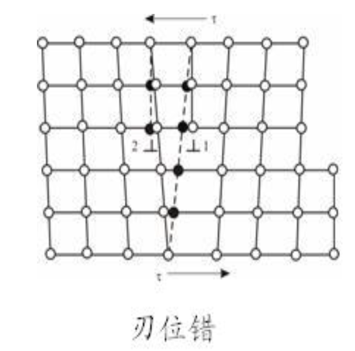
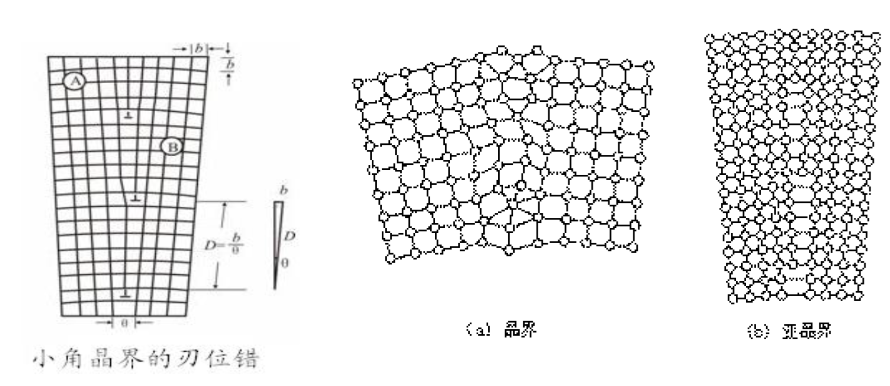

# 从固体物理到半导体物理8【晶格缺陷】

晶体缺陷分为*点缺陷*，*线缺陷*和*面缺陷*。可用*衍射*的方法测定（电子衍射、中子衍射、X射线衍射）

晶格中的填隙原子、空位、俘获电子的空位、杂质原子等，称为点缺陷，尺度只有一个或几个原子大小

## 点缺陷：空位、填隙原子、杂质

**点缺陷**：指发生在一个或几个晶格常数的线度内的晶格周期性破坏，包括*空位*、*填隙原子*、*杂质原子*等

**空位**：晶体某些原子振动剧烈，脱离格点而跑到表面上，在内部留下了空格点，形成空位

**填隙原子**：如果脱离格点的原子进入晶格中的间隙位置，就会形成填隙原子

**杂质原子**：杂质原子进入晶体后，可以处在间隙位置上形成填隙式杂质原子，也可以占据空位形成替位式原子

点缺陷的诱发因素很多，主要有以下几种

### 热缺陷

**热缺陷**指由**热起伏**引起的点缺陷

**弗伦克尔缺陷**：在金属和离子晶体中，由于热运动的能量涨落，原子或正、负离子都可以各自形成“空穴-填隙离子对”，这种*成对*的空位和填隙原子称为弗伦克尔缺陷

热平衡时，弗伦克尔缺陷的数目可以表示为
$$
n=Ae^{-\frac{u}{2k_B T}}
$$
其中u是形成一个Frenkel缺陷所需要的能量，称为*缺陷形成能*

**肖特基缺陷**：一定温度下，晶体中最表面的原子由于热涨落获得足够能量，离开格点位置，迁移至晶体表面，于是在晶体中出现不被原子占据的空格点，称为空位，也称肖特基缺陷

肖特基缺陷发生的情况下，*晶体内不伴随填隙原子产生*，但**表面原子会增多，晶体质量密度会减小**

> 形成填隙原子时，原子挤入间隙位置所需要的能量比产生肖特基空位所需能量大，因此**当温度不太高时，肖特基缺陷的数目要比弗仑克尔缺陷的数目大得多**

热平衡时，肖特基缺陷的数目可以表示为
$$
n=Ne^{-\frac{u}{k_B T}}
$$
u是空穴形成能，N是晶体的原子数目

*晶体内部只有填隙原子的缺陷*：晶体表面上的原子跑到晶体内部的间隙位置，这样晶体内部只有填隙原子，**填隙原子与晶体表面上原子处于平衡**

### 点缺陷的产生

1. 高温淬火
2. 辐照
3. 离子注入
4. 非化学配比

### 替位杂质

**替位杂质**：落在晶体的正常格点位置的杂质原子

**化学不纯**或（有目的的）**掺杂**都会导致替位杂质（离子）的出现

> 半导体制备过程中，常会在高纯Si、Ge种掺杂微量三价或五价元素；再刚玉中也会掺杂少量Cr2O3来替代Al3+，变成红宝石

## 线缺陷和面缺陷

**线缺陷**：周期性遭受破坏的区域形成一条线

线缺陷常以刃位错、螺位错的形式出现

**面缺陷**：偏离周期性的区域形成平面

包括层错、小角晶界、孪晶界等情况

**范性形变**：金属受到的应力超过弹性限度时会发生永久形变，称为范性形变

范性形变的发生是由于晶体某族晶面发生了滑移，这种晶面称为**滑移面**

对于一定的晶体材料，存在产生范性形变的最小的切应力tc，称为临界切应力

晶体内位错的存在使临界切应力大为减小

晶体中已滑移区和未滑移区之间的分界线，常常称为**位错线**，位错线与滑移方向垂直的位错称为**刃位错**，位错线与滑移方向平行的位错称为**螺位错**

在刃位错滑移的过程中，原子的滑移方向、位错线的运动方向和外加切应力三者是平行的

**螺位错**：可以想象用刀子将理想晶体切开一部分，在平行于切割边界的方向上施加切应力，将切开的晶体平行切割边界方向切移一个原子间距，这样就形成一个螺位错。螺位错使原来垂直于切割边界的原子面变成一个螺旋曲面

螺位错在晶体表面提供了一个天然的*生长台阶*，而且原子沿螺位错台阶集合生长不会消灭台阶，晶体沿螺位错线不断生长，台阶移动的角速度愈靠近螺位错线愈大，因此逐渐形成了螺旋形的晶体生长台阶

•X射线衍射

–布拉格公式2dsinθ=nλ，布拉格角θ是衍射角2θ的一半

–当衍射角θ最小时，对应d/n最大，因n最小取1，所以d即最大面间距（排列最密集晶面的间距）

迁移率μ : 单位电场作用下载流子的平均迁移速度，故单位是速度单位除以电场单位，为m2 / (V*s)

掺杂之后可以人为控制半导体的导电特性，改变热平衡时载流子的类型和浓度（本征半导体很难控制）。

肖特基接触和欧姆接触。肖特基接触要求金属的功函数大于半导体的功函数，而欧姆接触一般要求金属的功函数小于半导体的功函数。
