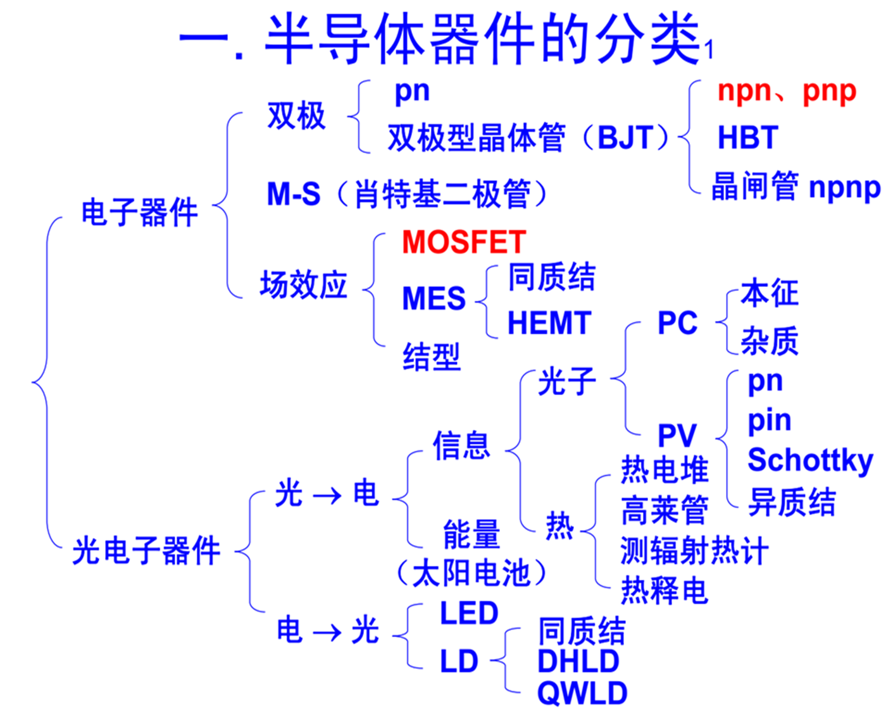
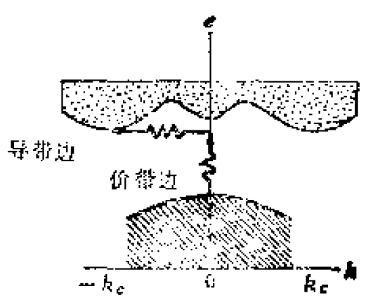
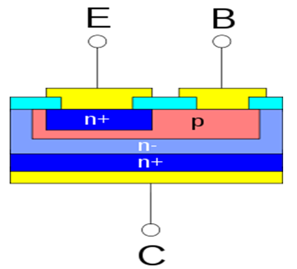
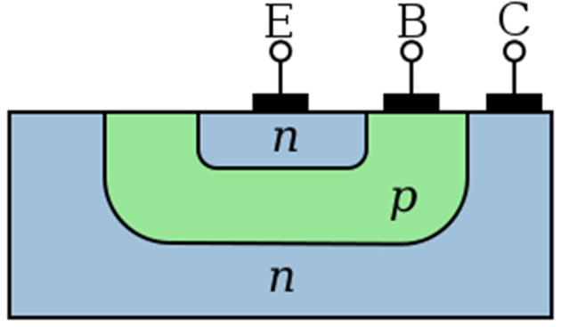

# 半导体器件物理0【绪论】

半导体器件物理中，我们主要关注电子器件，并且重点研究基于硅的*掺杂*、*注入*、*PN结*、*异质结*这几个物理情景制造的**二极管**、**BJT**和**MOSFET**器件的物理特性

## 半导体器件物理

硅和锗是典型的**间接带隙半导体**，电子在从价带进入导带的过程中需要吸收光子（本征光吸收），同时电子会很难从导带跌落回价带

> 间接带隙半导体的导带边和价带边的电子存在动量不守恒，因此价带电子需要与光子耦合才能获得合适的动量。电子首先被光子激发到某导带极小值最近处（此时没有进入导带），再通过弛豫过程移动到导带边。这就导致其需要吸收光子才能跃迁。而在逆过程中，电子跃迁不满足动量匹配，光子能量会被全部吸收提供能量，这就是导致**间接带隙半导体会有光致电现象但很难出现电致发光现象**

### 二极管

### BJT

经典Bipolar-NPN晶体管的剖面图如下所示

我们制造三极管的目的就是对电流进行控制，因此会使用垂直结构来尽可能减少损耗、减小硅上面积。这个结构抽象后可以近似为

这就是我们更熟悉的NPN三极管模型

### MOSFET

## 半导体器件物理的研究范围

1. 半导体器件的基本工作原理

2. 半导体器件的电学特性和材料特性之间的关系

    材料特性包括材料参数（$N_D$、$N_A$、$\mu_n$、$\mu_p$、$\tau_n$、$\tau_p$）、几何尺寸（$W_b$、$L_g$）、偏置电压V、频率$\omega t$等等

3. 半导体器件的高级特性

4. 半导体器件模型化方法论

    主要是SPICE模型的构建理论

## 半导体物理关键公式回顾

1. 经典物理基础公式
    $$
    E=-\frac{dV}{dx}
    $$
    
2. **载流子浓度**

    电子浓度
    $$
    n_0=N_C \exp{\frac{-(E_C - E_F)}{kT}}
    $$
    空穴浓度
    $$
    p_0=N_V \exp{\frac{-(E_F - E_V)}{kT}}
    $$
    在特殊情况中，我们会遇到已知费米能级$E_{F1}$处能量和$E_{F2}$处能量差为qV，且2大于1，并且已知$E_{F1}$处电子浓度为$n_1$，就可以推得$E_{F2}$处电子浓度$n_2=n_1 \exp{\frac{qV}{kT}}$

    该公式可以变形为
    $$
    V=E_C -E_F = \frac{k_BT}{q}\ln \frac{N_A N_D}{n_i^2}
    $$

3. **扩散方程**

    **漂移**运动是载流子在外电场的作用下发生的定向运动；而**扩散**运动是由于浓度分布不均匀导致载流子从浓度高的地方向浓度低的地方定向运动

    电子扩散电流密度
    $$
    J_{n扩}=qD_n \frac{dn}{dx}
    $$
    电子漂移电流密度
    $$
    J_{n漂}=qn\mu_n E
    $$
    空穴扩散电流密度
    $$
    J_{p扩}=eqD_p \frac{dp}{dx}
    $$
    空穴漂移电流密度
    $$
    J_{p漂}=qp\mu_p E
    $$

4. **耗尽层厚度和外加电压的关系**
    $$
    x_d=d_{耗尽}=(\frac{2\epsilon_0 \epsilon_r}{q} \frac{V_D - V}{N})^\frac{1}{2}
    $$
    采用高斯定理
    $$
    \int{\vec{E}\cdot d\vec{S}}=\frac{1}{\epsilon} \sum_S q
    $$
    就可以从PN结内建电场中推出该公式的基本形式
    $$
    x_d^2=\frac{2\epsilon V_D}{qN_d}
    $$

5. **注入时导体内载流子分布**

    无限厚导体中空穴分布方程
    $$
    \Delta p(x)=p_{n0}[\exp(\frac{qV}{kT})-1] \exp(\frac{-x}{L_p})
    $$
    其中第一项$p_{n0}[\exp(\frac{qV}{kT})-1]$代表了空穴注入处的空穴浓度，后面的$\exp(\frac{-x}{L_p})$是一个衰减项

    无限厚导体中电子分布 方程同理，将式中p改为n即可

6. **注入情况下导体内电流方程**
    $$
    J=J_s [\exp(\frac{qV}{kT}) -1]
    $$
    其中$J_s(x_n)=J_n(x_n) +J_p(x_n)=J_n(-x_p)+J_p(x_n)$表示总电流密度=扩散电流密度+漂移电流密度

    电流大小取决于载流子浓度梯度，该式中系数$[\exp(\frac{qV}{kT}) -1]$一项就来自于导体载流子分布方程中的注入载流子浓度
    
    该公式在理想pn结中成立
    
    > 前提条件：
    >
    > * **小注入**条件（$\Delta n_p \ll p_{p0}$或$\Delta p_n \ll n_{n0}$）
    > * 耗尽层突变条件（**耗尽层外电中性**）
    > * **忽略**势垒区中载流子的**产生和复合**
    > * **非简并半导体**（温度不太高、掺杂浓度不太大）

