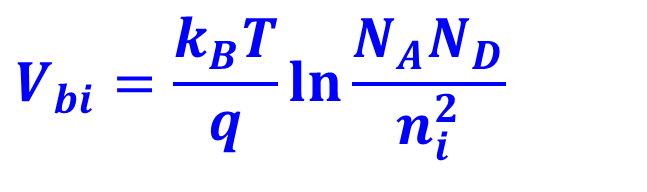
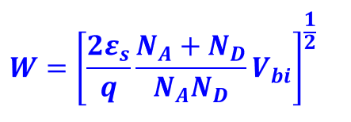
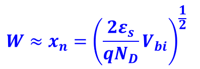

# 半导体器件物理1【二极管】

半导体器件中最基础的就是二极管，它所使用的就是最基本的半导体结：**PN结**

### PN结的基本分类

能带图描述了能带在半导体材料中的空间分布

掺杂浓度改变，内建电势基本不变（改变量非常小）

## 公式总结

1. 内建电势

    

2. 空间电荷区/耗尽层宽度

    一般情况

    

    P+N结时，有NA >> ND，有

    

    正好N+P结相反，ND >> NA

3. 