# 半导体器件物理4【重点QA】

1. 突变结的概念

    PN结冶金结（PN结的界面）处杂质分布有突变，且交界面两侧杂质浓度相差很大（浓度梯度可被视为无限大），这种结称为**突变结**

2. （线性）缓变结的概念

    杂质浓度从P区到N区是逐渐变化的PN结被称为**缓变结**。可以对缓变结冶金结附近的掺杂浓度作线性近似，因此又被称为线性结。一般的PN结都属于缓变结，高低结如PP-、NN-结等也都属于缓变结

    > 缓变结中掺杂浓度随着位置的变化而变化。恒有常数$a=\frac{d(N_D -N_A)}{dx}$

3. 单边突变结的概念

    PN结一侧的掺杂浓度远大于另一侧的突变结。P和N区的其中一者重掺杂就会导致单边突变结（N+P、P+N结都属于突变结）

4. 突变结与单边突变结的区别是什么？

    一般$N_D$和$N_A$相差两个数量级（$10^2$）时候，突变结可以视为单边突变结

    

5. PN结能带图

    PN结未形成前，P型半导体和N型半导体的能带图如下所示

    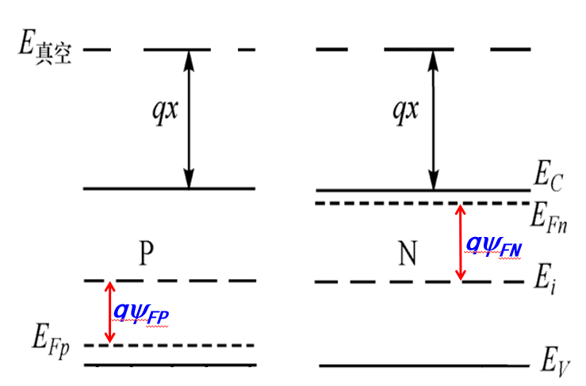

    P型半导体的费米能级总低于禁带中心（少一半的能级被电子填充）；N型半导体的费米能级总高于禁带中心（多一半的能级被电子填充），对于非简并半导体，它们的费米能级总在$E_i \pm 3k_BT$之间

    可以使用下面的公式计算==P型或N型半导体的费米势==
    $$
    |\psi_{F}|=\frac{kT}{q} ln(\frac{N_A}{n_i})=\frac{kT}{q} ln(\frac{N_D}{n_i})
    $$
    当PN结形成后，如果不外加电压（平衡PN结），总是有统一的费米能级存在，会发生合并，能带如下图所示

    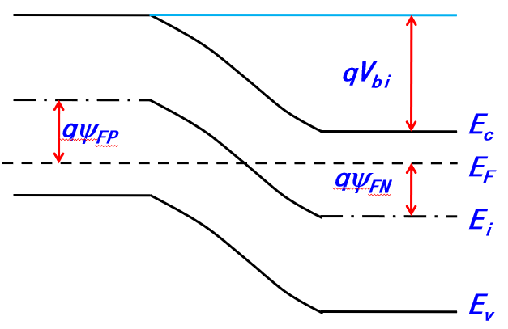

    其中$V_{bi}$被称为内建电势，内建电势源于P型半导体和N型半导体接触后方向相反的扩散电流和漂移电流，两部分电流动态平衡后内建电势就稳定下来。在这个电势作用下，PN结冶金结处会生成一个内电场，内电场存在的区域便是**空间电荷区**，或者说**耗尽区**，PN结的其他区域被称为**中型区**，中型区中没有电荷

    内建电势大小总等于P区和N区空穴/电子费米势之和，可以用下式计算
    $$
    V_{bi}=|\psi_{FP}|+|\psi_{FN}|=\frac{kT}{q} ln(\frac{N_A N_D}{n_i^2})
    $$

    > 内建电势几乎不受掺杂浓度影响，总在0.7V附近

    利用内建电势还可以将平衡PN结空间电荷区两侧的电子/空穴浓度联系起来
    $$
    p_{p0}=p_{n0}exp(\frac{qV_{bi}}{kT}),p_{n0}=p_{p0}exp(\frac{-qV_{bi}}{kT})
    $$
    或
    $$
    n_{p0}=n_{n0}exp(\frac{-qV_{bi}}{kT}),n_{n0}=n_{p0}exp(\frac{qV_{bi}}{kT})
    $$

6. 耗尽层近似包括什么？

    1. **空间电荷区由电离了的施主和受主构成，无可动离子**
    2. **空间电荷区以外是中性区**，中性区与空间电荷区之间的过渡区非常窄，认为是突变的（耗尽层以外电荷突然下降为0）
    3. **外加电势直接降落在空间电荷区上**，中性区无电场

7. 空间电荷区宽度和内建电场关系？

    掺杂浓度越小，耗尽层越宽；对于单边突变结（P+N结），耗尽层主要扩展在低掺杂浓度一侧（N区）；冶金结处电场最高

    

    可用下式计算==空间电荷区宽度==
    $$
    x_n=(\frac{2\epsilon_s}{q} \frac{N_A}{(N_A + N_D)N_D} V_{bi})^{\frac{1}{2}}
    $$

    $$
    x_p=(\frac{2\epsilon_s}{q} \frac{N_D}{(N_A + N_D)N_A} V_{bi})^{\frac{1}{2}}
    $$

    $$
    W=x_p+x_n=(\frac{2\epsilon_s}{q} \frac{N_A +N_D}{N_A N_D})^{\frac{1}{2}}
    $$

    对于==最大电场（电势）==，有
    $$
    E_m=\frac{qN_A x_p}{\epsilon_s}=-\frac{qN_D x_n}{\epsilon_s}=(\frac{2\epsilon_s}{q} \frac{N_A N_D}{N_A +N_D} V_{bi})^{\frac{1}{2}}
    $$
    结合二者可以得到内建电势的另一个表达式
    $$
    V_{bi}=\frac{1}{2}E_{m} W
    $$
    对于P+N结，有
    $$
    x_P \approx 0
    $$
    可以推得
    $$
    W\approx x_n =(\frac{2\epsilon_s}{q N_D} V_{bi})^{\frac{1}{2}}
    $$

8. 夹带本征层的PN结能带图

    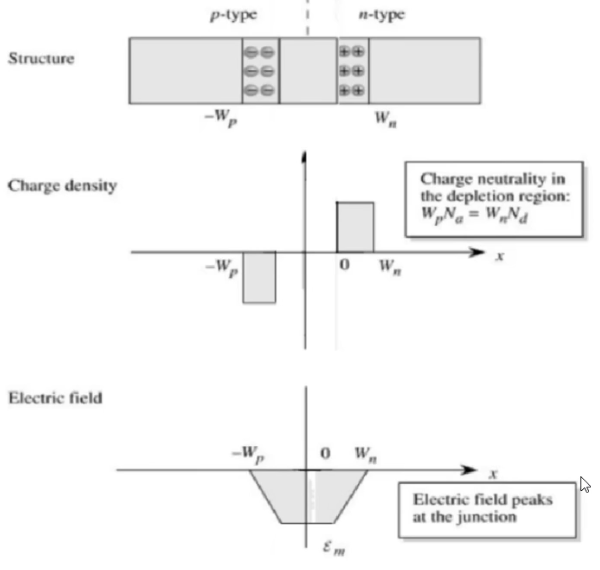

    可以发现这个PN结的P区和N区中间夹了一个本征层。**本征层**实际上就是纯硅，它是由于形成的，可以被看成是没有掺杂的

9. 利用势垒电容测量内建电势的方法以及应用前提

    耗尽区宽度随外加电压变化，其中电离杂质数目随之改变，这种电压变化引起电荷量变化具有电容的性质，这被称为**耗尽层电容**或**势垒电容**

    *PN结电容（势垒电容）相当于宽度为W的平板电容*，面积为A的PN结电容为
    $$
    C_j =|\frac{dQ}{dV}|=\frac{\epsilon_s}{W}=\frac{\epsilon_s}{(\frac{2\epsilon_s}{q} \frac{N_A +N_D}{N_A N_D} V_{bi})^{\frac{1}{2}}}
    $$
    在单变突变平面结中，公式可以写成
    $$
    C_j=A(\frac{q\epsilon_s N_D}{2V_{bi}})^{1/2} \rightarrow \frac{1}{C_j^2} = \frac{2}{q\epsilon_s N_D A^2} V_{bi}
    $$
    其中A为结面积

    根据测量出的$C_j \sim V_R$数据，绘出$1/C^2_j \sim V_R$曲线，可以得到一条直线，利用其斜率就可以获得低掺杂区的掺杂浓度，从外延线与横坐标的交点，可以确定内建电势$V_{bi}$的大小

    应用前提：**均匀掺杂的单边突变平面结**

10. PN结开路外加电压后的能带图

    * 正偏：等效内建电势减小，耗尽层变窄，相当于让$V_{bi}$减去一个$V_F$

        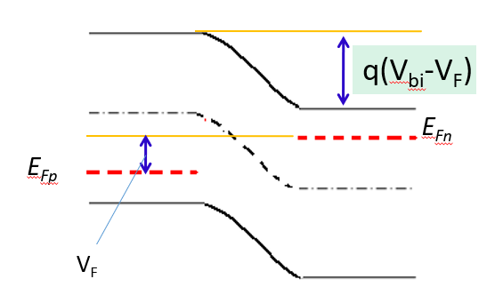

    * 反偏：等效内建电势增大，耗尽层展宽，相当于给$V_{bi}$加一个$V_R$

        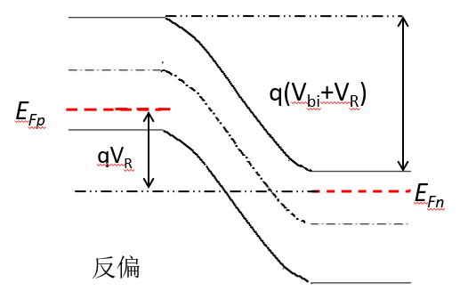

    **在有偏压的情况下，所有公式中$V_{bi}$都要改成$V_{bi} + V_F$或$V_{bi} + V_R$，也就是叠加一个正向偏压或反向偏压**

    根据上面的概念可以得到外加电压调节耗尽区边界处载流子浓度的公式如下
    $$
    n_p=n_{p0}exp(\frac{V_F}{kT}),p_n=p_{n0}exp(\frac{V_R}{kT})
    $$
    以及
    $$
    n_p=n_{n0}exp(\frac{-V_{bi}}{kT})exp(\frac{V_F}{kT}),p_n=p_{p0}exp(\frac{V_{bi}}{kT})exp(\frac{V_R}{kT})
    $$
    其中$n_{p0},p_{n0},n_{n0},p_{p0}$的下标表示哪个区域的平衡浓度（下标是p0就是p区的电子/空穴平衡浓度）

11. **理想PN结假设**

       > 准中性区和中性区是一样的东西，不过侧重的表述方向不同：准中性区侧重于描述“在理想PN结假设下是中性的”；中性区仅仅是描述除了耗尽区以外的区域

       1. **外加电压直接降落在耗尽区上**，耗尽区外的半导体是电中性的
       2. **忽略**中性区的体电阻和接触**电阻**
       3. 准中性区**均匀掺杂**，无载流子漂移运动
       4. 满足小注入条件：**注入的非平衡少子浓度远小于多子浓度**
       5. **耗尽区内不存在载流子的产生和复合**
       6. 半导体**非简并**：温度不太高、掺杂浓度不太大

12. 二极管的直流特性？

       **肖克利方程**
     $$
       PN结总电流J=J_p(x_n)+J_n(-x_p)=J_S [exp(\frac{qV}{kT}) - 1]
     $$
       描述了**PN结总电流等于P区电子和N区空穴的扩散电流之和**

       其中
     $$
       J_S=[q\frac{D_p p_{n0}}{L_p}\frac{1}{tanh(\frac{W'_n}{L_p})} + q\frac{D_n n_{p0}}{L_n}\frac{1}{tanh(\frac{W'_p}{L_n})}]
     $$
       描述了P区电子和N区空穴的扩散分布

13. 偏置电压对空间电荷区边界处少子浓度的影响

       在闭合电路中，由于偏置电压，PN结能带弯曲量发生变化，即$q(V_{bi} - V_F)$和$q(V_{bi} + V_R)$，处于非平衡状态

       * 正偏

           外电场方向与自建电场方向相反，载流子漂移电流减小，两区少子注入增强，耗尽层变窄

           **正偏电压很小的改变就可以使少子浓度发生数量级的变化**

       * 反偏

           反偏下，少子浓度在空间电荷区边界处降低为0，这被称为**反向偏置电压的抽取作用**

           > 三极管的集电区就是利用了抽取作用增大电子收集率

           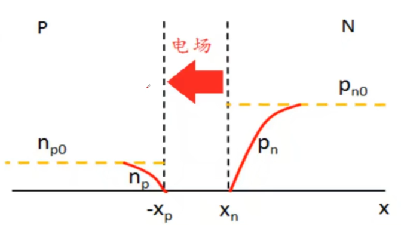

14. PN结反向饱和电流是什么？由什么决定

       PN结反偏，V<0，有
     $$
       exp(\frac{qV}{kT}) \rightarrow 0
     $$
       即
     $$
       J=-J_S=[q\frac{D_p p_{n0}}{L_p}\frac{1}{tanh(\frac{W'_n}{L_p})} + q\frac{D_n n_{p0}}{L_n}\frac{1}{tanh(\frac{W'_p}{L_n})}]
     $$

       > 上下文中提到的$J_S$就是$J_0$，是一个根据PN少子分布情况不同而不同的参数

       这个J被称为**反向饱和电流**，理想情况下**该电流与外加电压无关，是由PN结几何参数**（PN结长度W、中性区P区N区长度L、少子扩散情况等）**决定的**

15. PN结反向饱和电流对于长、短PN结的表达式

       * 长PN结

           长PN结指准中性区长度远大于少子扩散长度的情况，这时候少子在P区、N区的分布可被看作无限厚导体中少子注入分布，有
           $$
           J_S=q\frac{D_p p_{n0}}{L_p} +q\frac{D_n n_{p0}}{L_n}
           $$
           代入肖克利方程就可以得到长PN结中的电流密度

       * 短PN结

           短PN结准中性区宽度远小于少子扩散长度，因此少子注入后几乎不会经过符合就直接到达了电极，相当于少子寿命无限大，因此
           $$
           J_S=q\frac{D_p n_i^2}{W'_n N_D} +q\frac{D_n n_i^2}{W'_p N_A}
           $$

       上面的$J_S$就是对应情况的反向饱和电流。再次注意：反向饱和电流很小且不随外加电压而改变

16. 什么是大注入效应，什么是大注入自建电场

       **大注入**是指注入准中性区的少子浓度接近或大于多子浓度

       **大注入自建电场**：多子与注入的少子相复合，导致出现多子浓度梯度后，存在扩散的趋势，为保持电中性，必须存在一个电场，对多子产生一个漂移作用，补充扩散走的多子，维持多子的分布。这个电场叫大注入自建电场

       大注入自建电场表达式为
     $$
       E_e=\frac{kT}{q} \frac{dln N_n}{dx}
     $$
       准中性区压降为
     $$
       V_D=V_J + \frac{kT}{q} ln\frac{p_{n0}}{n_{n0}}
     $$
       其中$V_J$是结压降，存在
     $$
       V_J=V_{F/2} -\frac{kT}{q} ln\frac{p_{n0}}{n_i}
     $$
       考虑大注入，准中性区边界处少子浓度与衬底掺杂浓度无关，相当于与平衡少子浓度无关——这说明大注入自建电场阻止了多子扩散，但会叠加一个与扩散方向相同的少子漂移运动，于是少子电流为
     $$
       J_p |_{x=x_n}=-q D_p (1+\frac{p_n}{n_n})\frac{dp_n}{dx} |_{x=x_n}=-2qD_p \frac{dp_n}{dx} |_{x=x_n}
     $$
       也就是说**大注入自建电场相当于使少子扩散系数增加了一倍**

17. 什么是扩散电容？扩散电导和扩散电容与什么有关？
     $$
       C_D=\frac{q}{kT} (\frac{\tau_p I_{p0}}{2} +\frac{\tau_n I_{n0}}{2})
     $$
       称为**扩散电容，是正偏压下PN结准中性区中存贮电荷随偏压变化引起的电容**，随直流偏压的增加而增加。

       扩散电导
     $$
       g_D=\frac{qI_0}{kT}=\frac{q}{kT} (I_{p0} + I_{n0})
     $$
       二者相加可以得到二极管的导纳为
     $$
       Y=g_D + j\omega C_D
     $$
       需要注意正向偏置条件下，*扩散电容远大于势垒电容*

18. 小信号等效电路，$R_S$是什么

       $R_S$是串联电阻

       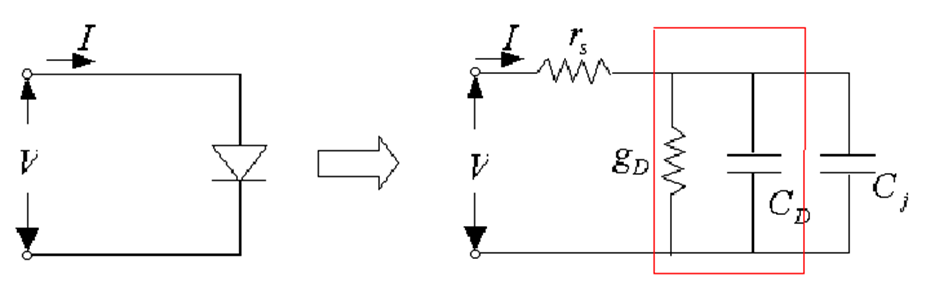

19. 为什么$C_J$与$C_D$并联

       因为对于相同的电压偏置，势垒电容和扩散电容同时作用在信号上

20. PN结的击穿特性

       * **热击穿**：由反向电流增大、结温升高，电流进一步增加从而导致的PN结烧毁，不可恢复，往往首先发生在局部过热的地方

       * **雪崩击穿**：反向偏压导致空间电荷区电场较强，载流子能够获得足够能量与晶格原子碰撞来源源不断产生新的电子空穴对，像雪崩一样造成的击穿。在低掺杂PN结、空间电荷区很宽的时候会发生

           发生条件：
           $$
           \int_0 ^W \alpha dx =1
           $$
           表示**一个载流子通过整个空间电荷区，只要碰撞电离产生的电子空穴对数目等于1，就可以发生雪崩击穿**（雪崩倍增条件）

       * **隧道击穿**：反向偏压增加，势垒升高，导致导带、价带水平间距减小，电子由价带量子隧穿到导带的几率增加从而导致的击穿。一般发生在窄带隙材料、重掺杂PN结中，空间电荷区变窄的时候会发生。又称为齐纳击穿。

           > 隧道二极管就是利用隧道击穿实现高频开关的

       * **穿通击穿**是指PN结最高电场还没有达到临界击穿电场，但空间电荷区已经扩展到重掺杂区的情况。

           > 工艺中PN结、三极管都要使用平面工艺做在重掺杂硅衬底的外延层上，其中一个电极是从重掺杂硅衬底引出的，而不是直接从P/N区引出

           当空间电荷区刚好扩展到重掺杂衬底时，若偏置电压继续增大，空间电荷区就不再向衬底展开，而是电场线“向下平移”，当冶金结处的电场达到临界击穿电场时，就会导致穿通击穿

           **穿通击穿电压要小于固有的雪崩击穿电压**

21. 为什么一旦达到阈值电场就认为击穿

       > PN结击穿只关注电场，不关注电流。热击穿才会与电流热效应有关

       发生雪崩倍增时，载流子碰撞电离由耗尽区场强提供的最大能量决定，也就是最大电场
     $$
       E_{em}=E_{eC}=(\frac{8qN_D}{\epsilon_s c_i})^{1/8}
     $$
       决定了是否发生击穿。这个电场被称为**临界击穿电场**

       雪崩击穿电压
     $$
       V_B=\frac{\epsilon_s E_{eC}^2}{2qN_D}
     $$

22. 三极管端电流的组成

       平衡能带图

       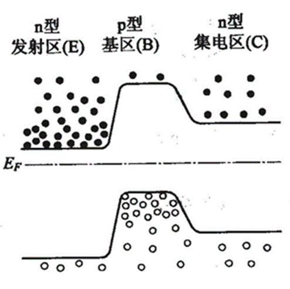

       发射结正偏，电子从发射区转移到基区；发射结反偏，电子从基区被抽取到集电区

       载流子分布图

       > 三极管是双极性器件，两种载流子共同参与导电；MOSFET是单极性器件，只有一种载流子（电子或空穴）参与导电

      

       三极管端电流组成

       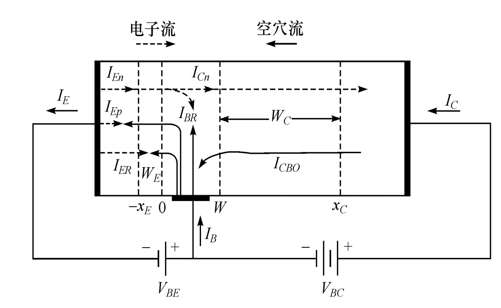

       从器件整体上看，
     $$
      I_E=I_B+I_C
     $$
       从端电流上看，三端电流分别为：

       * 发射极E：$I_E=I_{nE}+I_{pE}+I_{ER}$

           E极的电子扩散电流$I_{nE}$、从基区进入发射区的空穴扩散电流$I_{pE}$、发射结复合电流$I_{ER}$共同组成E极电流

       * 基极B：$I_B=I_{pE}+I_{ER}+(I_{nE}-I_{nC})-I_{CBO}$

           注入发射区的空穴电流$I_{pE}$、发射结复合电流$I_{ER}$、B极注入空穴导致的基区复合电流$I_{BR}=I_{nE}-I_{nC}$、集电结反偏导致的反向饱和电流$I_{CBO}$共同组成了B极电流

           > 基区复合电流采用间接的方式表示：从发射结来到基区的电子电流$I_{nE}$减去成功越过基区到达集电区的电子电流$I_nE$就等于在基区内被复合掉的那部分电流 

       * 集电极C：$I_C=I_{nC}+I_{CBO}$

           由发射极注入且通过基区又被集电极收集的电子电流$I_{nC}$、上面提到过的集电结反向饱和电流$I_{CBO}$共同组成了C极电流

     总体上看，发射区电子受到发射结（BE结）正偏影响，向基区漂移，在发射结复合一部分；到达基区后又与基区复合一部分，剩下的电子受到集电结反偏产生抽取效应影响，越过集电结（CB结）向集电区运动；最后一部分电子越过集电结到达集电区。

     将E极接地，控制C、B极电压就相当于控制两个PN结正反偏的程度，从而让上面这个过程更容易发生或更不容易发生，这就起到了用BE电流控制CE电流的作用。

23. **共射极直流电流增益**是什么
     $$
       \alpha_0 =\frac{I_{nC}}{I_E}
     $$
     定义上式为**共射极直流电流增益**。表示注入基区的电子电流（$I_{nC}$）占发射极电流（$I_E$）的比例

     有集电极电流的另一个表达式
     $$
       I_C =\alpha_0 I_E +I_{CBO}
     $$

24. **发射效率**是什么

     **发射效率**就是发射区发射出去的电子电流占发射区总电流的比例
     $$
       \gamma=\frac{I_{nE}}{I_ER +I_{nE}+I_{pE}}=\frac{1}{1+\frac{R_{sh,e}}{R_{se,b}}}=\frac{1}{1+\frac{D_{pE}}{D_n}\frac{W}{L_{pE}}+\frac{N_B}{N_E}}
     $$
       其中$R_{sh}$表示方块电阻（单位长度、面积下的电阻值），有
     $$
       R_{sh,E}=\frac{\rho_E}{W_E},R_{sh,B}=\frac{\rho_B}{W_B}
     $$
       分别是发射区和基区的方块电阻

       可以发现想要让发射效率提高，必须要让$N_E /N_B$提高，有两种方法：

       * 提高$N_E$：但发射区浓度不能太大，否则会导致重掺杂效应导致禁带变窄
       * 降低$N_B$：但不能太低，否则会导致基区电阻太大

25. **基区传输因子**是什么

       定义
     $$
       \alpha_T =\frac{I_{nC}}{I_{nE}} \approx 1- \frac{W_B^2}{2L^2_{nB}}
     $$
       为**基区传输因子**，表示能够通过基区传输到集电区的电子占从发射区发射而来电子的比例

       $\alpha_T$越高，被发射结和基区复合的电子越少，能从发射区达到集电区的电子越多

       根据表达式，**要想提高基区传输因子，降低基区的宽度非常重要**。一般来说基区宽度要远远小于电子扩散长度。不过不能把基区宽度做得太窄，否则会降低击穿电压

       根据上面三个问题的结论，可以得到共射极直流电流增益与发射效率、基区传输因子之间的关系：
     $$
       \alpha_0 =\gamma \alpha_T
     $$

26. $I_{CEO}$与$I_{CBO}$分别代表什么

     $I_{CEO}$表示B极开路，CE之间的漏电流。可以用$I_{CBO}$结合放大倍数推导出来
     $$
     I_{CEO}=(1+\beta)I_{CBO}=\frac{1}{1-\alpha}I_{CBO}
     $$
     $I_{CBO}$表示E极开路，CB之间的漏电流。等于集电结的反向饱和电流
     $$
     I_{CBO}=\frac{qAn_i x_c}{2\tau}
     $$

27. 三极管四种情况下的少子分布，临界饱和条件

     以本图的x坐标可以得到正向有源状态下少子分布情况：

     发射区一般都是重掺杂，空穴扩散长度小于准中性发射区的宽度，发射区少子空穴的分布由正偏的发射结电压控制，因此
     $$
       p_E(x)=p_{E0}+p_{E0}[exp(\frac{qV_{BE}}{kT}-1)]exp[\frac{x+x_E}{L_{pE}}], x\le -x_E
     $$
     由于实际BJT的基区宽度远小于少子扩散长度，基区内的电子分布可以用线性表示
     $$
       n_B=n_{B0}+n_{B0}[exp(\frac{qV_{BE}}{kT}-1)](1-\frac{x}{W_B}) -n_{B0}\frac{x}{W_B}
     $$
     集电区的宽度往往比较大，集电区少子的分布由反偏的集电结电压确定，有
     $$
     p_C(x)=p_{C0}+p_{C0}[exp(\frac{qV_{BC}}{kT}-1)]exp[\frac{-(x-x_C)}{L_{pC}}], x\ge x_C
     $$
     式中所有以“x0”为下标的量都表示平衡态时对应区域x的电子/空穴浓度

       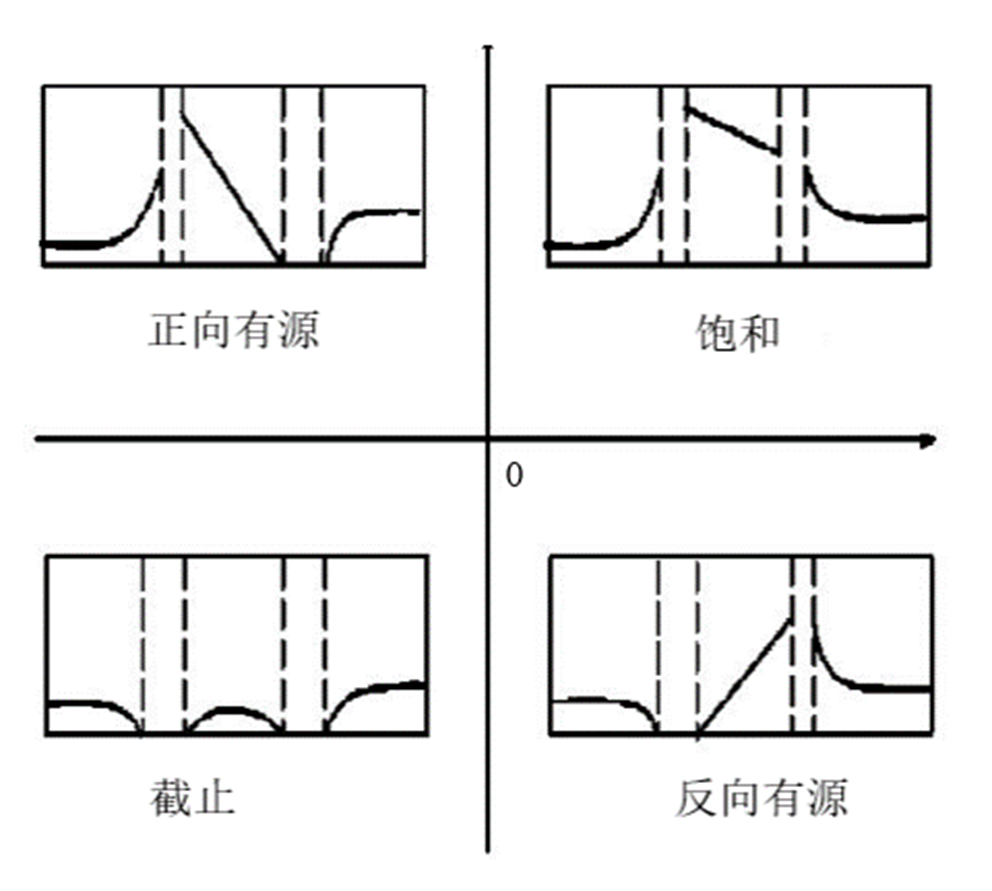

     *正向有源放大模式*的发射效率高、放大倍数大；*截止模式*下，发射结、集电结都反偏，端电流主要是很小的PN结反向饱和电流；*饱和模式*下，发射结和集电结都正偏，耗尽区边界处少子浓度大于平衡值，导致基区有过量少子堆积，造成大电导（小电阻）；*反向有源放大模式*和正向放大模式看起来是对称的，但由于三极管结构和制造工艺，性能上要远远差于正向放大

     **临界饱和条件**：$I_B * β = \frac{V_{BE}}{R}$

     *临界饱和状态下，集电结零偏，从基极抽取的电子和集电区本身空穴浓度恰好达到平衡，集电区载流子分布与平衡时载流子分布一样，是处处相同的*，载流子分布如下图所示

       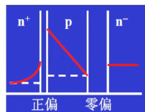

28. 共射、共基反向电流和击穿电压关系，击穿电压的推导

     放大状态下，当$V_{CB}$（共基）或$V_{CE}$（共射）超过某一临界值时，晶体管C极电流会因为雪崩效应急剧增大（集电结反偏），对应临界电压称为**击穿电压**

     击穿电压由集电结本身的雪崩击穿电压决定
     $$
     BV_{CEO或CBO}=\frac{\epsilon_s E_{eC}^2}{2qN_C}
     $$
     **共射**接法中，有
     $$
       I=\frac{MI_{CBO}}{1-\alpha_0 M}
     $$
     可以得到雪崩击穿的条件
     $$
       \alpha_0 M=1
     $$
     其中M是集电结的雪崩倍增因子，有经验公式如下
     $$
       M=\frac{1}{1-(\frac{V}{BV_{CBO}})^n}
     $$
     n在2到6之间，这是一个经验公式

29. 基区穿通的概念

     在基区宽度很小或掺杂浓度比较低的情况下，集电结空间电荷区在集电结雪崩前就已经扩展到发射结的空间电荷区边界，这时中性基区的宽度降为0，这种现象称为**基区穿通**

     忽略集电结内建电势，基区穿通电压为
     $$
     V_{PT}=\frac{q}{2\epsilon_s} \frac{N_B}{N_C} (N_B +B_C) W_B^2 \approx \frac{q}{2\epsilon_s} \frac{N_B^2}{N_C} W_B^2
     $$

30. 三极管小信号等效电路

       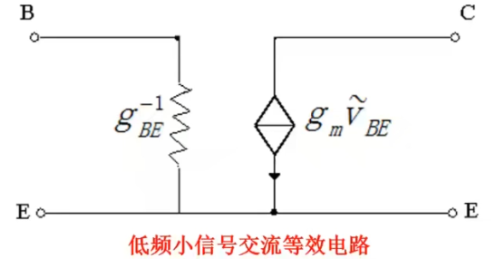

       低频下，

       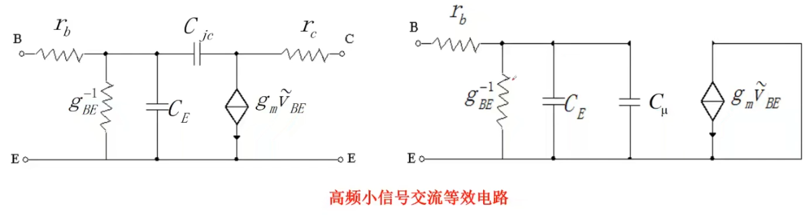

       其中$C_\mu$为米勒电容，它可以把集电结势垒电容倍乘后反馈到输入端。表达式为
     $$
       C_\mu=(1+g_m r_C)C_{jC}
     $$
       其中$C_{jC}$是集电结势垒电容

31. 什么是特征频率，为什么又叫增益带宽积？

     **特征频率**：$\beta=1$时的频率，用$f_T$表示。

     **$\beta$截止频率**：定义$\beta=\frac{i_C}{i_B}$也就是集电区电流和基区电流之比，高频情况下有
     $$
       \beta=\frac{\beta_0}{1+\frac{j\omega}{\omega_\beta}}
     $$
     其中$\omega_\beta=\frac{g_{B'E}}{C_E+C_\mu}$，$\beta_0=\frac{g_m}{g_{B'E}}$。当$f=f_\beta$时，$\beta=\frac{\beta_0}{\sqrt{2}}$，此时的$f_\beta$称为$\beta$截止频率

     恒有对应关系
     $$
       |\beta|=\frac{\beta_0}{\sqrt{1+(\frac{f}{f_\beta})^2}}\approx \frac{\beta_0 f_\beta}{f}
     $$
     根据上式，可以得到当$f \gg f_\beta$时，
     $$
       \beta f=\beta_0 f_\beta =f_T
     $$
     **当工作频率远大于截止频率时，工作频率与此频率下放大倍数的乘积等于特征频率，因此特征频率又称带宽增益积**

     当工作频率大于$f_\beta$时，频率每升高1倍，其放大倍数就是原值的1/2

32. 渡越时间与特征频率的关系，渡越时间由什么组成

       渡越时间表达式
     $$
       \tau = \tau_E+\tau_B+\tau_D+\tau_C=r_e(C_{jE}+C_{dE})+\frac{W_B^2}{2D_{nB}}+\frac{x_{dC}}{v_S}+r_C(C_{jC}+C_S)
     $$
       总延迟时间=发射结电容充电时间+基区渡越时间+集电结耗尽区渡越时间+集电结电容充电时间。其中基区渡越时间$\tau_B$是最耗时的

33. 三极管开关过程，饱和深度定义

     三极管的开关过程分为下面两个阶段：

     1. 导通过程：对发射结空间电荷区充电、基区电荷注入、集电结空间电荷区充电
     2. 关断过程：抽取基区和集电区存储的少子，发射结和集电结由正偏转为反偏

     存储时间是决定晶体管开关速率的关键参数，降低基区、集电区存储的过量少子总数可以降低存储时间

     饱和深度用S表示，
     $$
     S=\frac{I_B}{I_{BS}}
     $$
     其中$I_{BS}$为基极临界饱和电流
     $$
     I_{BS}=\frac{I_{CS}}{\beta}
     $$
     其中$I_{CS}$为集电极临界饱和电流
     $$
     I_{CS}=\frac{V_{CC}}{R_L}
     $$
     $R_L$为负载电阻。在S=1的情况下，晶体管临界饱和；S越大，饱和程度越深，存储的过量少子越少，存储时间越长，开关速率越慢

     根据饱和深度不同，晶体管开关工作模式分为两种：

     * 饱和开关模式：在饱和状态和截止状态之间工作
     * 非饱和开关模式：在临界饱和甚至临近临界饱和的放大状态与截止状态之间转换。这个模式具有更快的开关速度，但对晶体管参数的均匀性要求高，输出电平欠稳定

34. 什么是钳位二极管，**提高开关速度的方法**

     晶体管的开关过程主要是对发射结和集电结充放电和对基区电荷注入、抽取，因此有下面几种途径提高开关速度

     1. 缩小结电容，**缩短充放电时间**：减小集电结面积
     2. **增大基区注入、抽取电流**
     3. 减小基区驱动电流
     4. **减小基区和集电区少子存储量**：降低基区宽度、降低饱和深度、降低少子寿命。比较常见的*降低少子寿命*的方式是*掺金作为复合中心*

     钳位二极管就是金属-半导体结，具有较低的正向导通电压（约0.3V）。并联钳位二极管和三极管的集电结，可以将$V_{CB}$迁至在不超过0.3V，降低饱和深度、提高开关速度

35. **基区宽度调制效应**

      又叫**Early效应**：实际三极管使用中B极和C极都有电压，但集电极电压$V_{CE}$增大还会带来基极-集电极电压$V_{BC}$增大，这就导致集电结反偏的程度逐步加深。**随着共射三极管加在CE两端的电压$V_{CE}$增大，集电结耗尽区宽度增加，基区宽度降低，导致基区少子浓度梯度增加，集电结电流随之增大，输出电导不再为0**。Early效应就是造成三极管输出特性曲线如下图所示的重要原因

      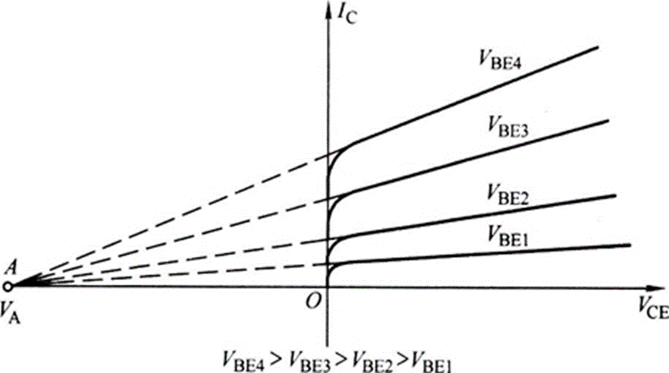

      可以发现
     $$
      V_A=\frac{Q'_B}{C_{jC}}
     $$
      其中$Q'_B$表示单位面积上准中性基区的掺杂杂质总量

      Early电压$V_A$与基区电荷的电容效应有关。当基区掺杂浓度比较低时，Early电压较小，效应明显（掺杂浓度较低时，集电结宽度随结电压变化较大，就导致Early效应明显了）

36. Gummel数的意义

      实际晶体管制备中基区存在非常大的杂质分布梯度和载流子浓度梯度，**使空穴具有向集电极运动的趋势**，为了维持基区电中性，会有一个**缓变基区自建电场**形成

      

      如上图所示，空穴会有从基区P型半导体向两侧N型硅扩散的趋势，因此对于缓变基区的分析要同时分析空穴梯度扩散作用和自建电场漂移作用，用公式描述如下：
     $$
      qp_B\mu_{pB}E_{eB} -qD_{pB}\frac{dp_B}{dx}=0
     $$
      即自建电场漂移电流等于梯度扩散电流（矢量和为0）

      经过分析可以知道$E_{eB}$方向从集电结指向发射结，因此从发射区注入基区的电子会在缓变基区自建电场作用下向集电结漂移

      为了方便分析，定义**缓变基区晶体管基区中多子的总量为Gummel数$Q_{GB}$**
     $$
      Q_{GB}=\int_0^{W_B} N_B(x) dx
     $$
      可以得到
     $$
      I_{nB}=\frac{-qAD_{nB}n_i^2 e^{\frac{qV_{BE}}{kT}}}{Q_{GB}}
     $$

37. 发射区重掺杂效应

      对发射区进行中掺杂处理可以提高发射系数$\gamma$，但由于掺杂浓度增大会让禁带宽度变窄，本征载流子（也就是少子）浓度增大，因此**过高掺杂浓度下发射区的空穴浓度会不降反升**，表达式
     $$
      p_{E0}=\frac{n_{iE}^2}{N_E}=\frac{n_i^2 exp(\frac{\Delta E_G}{kT})}{N_E}
     $$

38. 基区扩展电阻效应（发射极电流集边效应）

     由于基区很薄，平行于发射结（水平）方向的基区电阻（基区扩展电阻）不可忽视，这就产生了一个电阻分压网络；同时发射区重掺杂，因此认为整个发射区处于同一电位，发射结压降从边缘到中心降低，这就导致发射结电流$I_E$从边缘到中心按指数规律衰减。这被称为**发射极电流集边效应**，又因为它是由基区扩展电阻引起的，又被称为**基区扩展电阻效应**

     $I_E$指数规律衰减的表达式为
     $$
      I_E =I_0 exp(\frac{qV_{BE}}{kT})
     $$
     对应含有发射结有效宽度的表达式
     $$
      S_{eff}=1.86 (\frac{\beta_0 kT}{q J_E R_{sh}})^{1/2}
     $$

      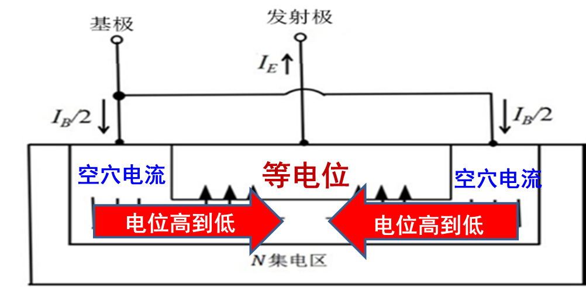

      发现$J_E$越大，电流集边效应越显著，有效宽度越小。因此大功率器件都要设计成梳状结构来增加发射区有效发射面积

39. **大注入特性**

       发射结大注入导致的三极管放大倍数降低，包含下面几个效应：

      * Early效应：由于$V_{BC}$增大导致集电结耗尽区宽度增大，基区随之变窄，电子浓度梯度增加，集电结电流又增大，从而导致输出电导不再为0的情况
      * Webster效应：由于集电极电流随注入电流增大而下降，导致放大倍数下降的情况
      * Kirk效应：由于基区向集电区注入电子量过多导致基区变为准中性基区，同时基区展宽到集电结以后

40. Sah效应与Webster效应

      Webster效应发生在集电结电流*很大*的情况下，Sah效应发生在集电结电流*很小*的情况下。二者都导致放大倍数$\beta$下降

      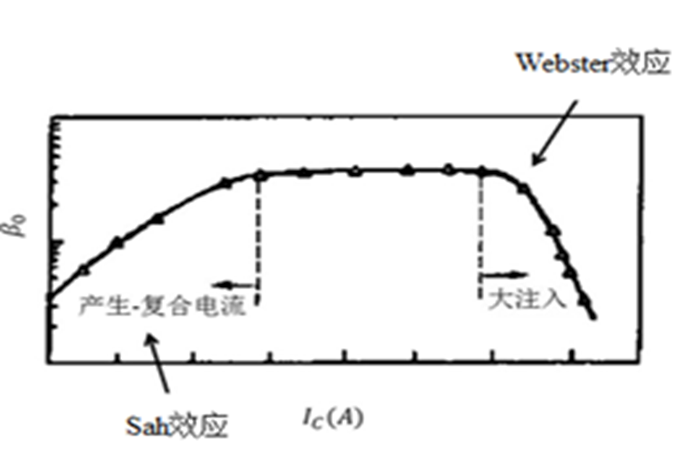

     Webster效应由于集电极电流带来的发射极向基区的电子大注入：集电极电流随注入电流增大而下降（很多电子都被基区多出来的空穴掉了），从而导致放大倍数下降

     Sah效应源于发射结正偏时结内负荷电流的影响，有
     $$
      \beta_{小电流}=\frac{I_{nC}}{I_B}=\frac{qV_{BE}}{2kT}
     $$

41. **Kirk效应（基区展宽效应）**

     随着集电极电流密度增大，从集电区进入基区的空穴增多，表现出基区展宽的现象，会导致电流增益下降、有损器件频率响应特性

     通常情况下，发射区注入基区的电子到达集电结耗尽区以饱和速度$v_s$通过，这些电子相当于可动电荷
     $$
      n_m=\frac{J_C}{qv_s}
     $$
     其中$J_C$是集电区电流密度

     集电结基区一侧是电离受主N-，集电区一侧则是带正电荷的施主N+，这些可动电荷对电场分布的影响在小注入情况下可以忽略。

     但大注入情况下，基区电子浓度增大，越过集电结的电子浓度也增大，为了与注入电子平衡，集电区正电荷（空穴）浓度随之降低，空间电荷区会随着集电区空穴浓度降低而发生移动

     如下图所示，第一张图展示了正常情况下随着集电结电流增大，集电结展宽（相当于基区展宽）并最终扩展到整个集电区的情况，此时集电区电荷仍然是正的。

     但在大注入情况下，会发生之后的情况：随着$J_C$继续增加，在$J_1<J_C < qv_s N_C$时，集电区正电荷数目减少，空间电荷区宽度应该增加，但由于空间电荷区已经达到N+衬底界面处，因此电场线下的面积变成了梯形

     第三张图：集电结变成电中性，这时Kirk效应开始出现，发生条件是
     $$
      J_{kirk}=qv_s N_C
     $$
     这时的集电极电流定义为**Kirk电流**

     也就是*基区可动电荷浓度恰好达到集电区掺杂浓度时的集电极电流*

     第四张图中，$J_C >J_{kirk}$，此时集电区电荷改变极性变为负电荷，所以电场方向改变了（集电区N-与衬底N+形成了高低结），PN结转移到集电区与N+衬底的边界处，这个结称为**感应结**

     第五张图中，集电结冶金结处电场恰好为0，准中性基区边界扩展到集电结边界

     最后第六张图，准中性基区的边界进入集电区，这就是基区展宽效应

      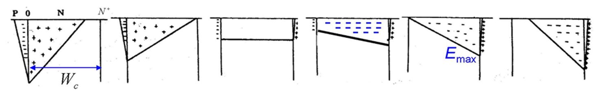

     Kirk效应发生后，由于基区宽度增加，少子渡越时间增加，导致放大倍数减小、频率特性下降

     Kirk效应在集电区掺杂浓度较低的情况下很容易发生

42. **异质结晶体管（HBT）的优点和特点**

     由于异质结会提高价带的差距，空穴由基区注入到发射区的势垒被提高了，空穴注入效率大大降低，相对提高了发射效率$\gamma$，这样就不需要对发射区掺杂浓度过高，基区的掺杂浓度也可以提高。

     发射区掺杂浓度$N_E$可以降低到$10^{17}\ cm^{-3}$，这

       * 让发射结电容减少，从而使电流放大截止频率$f_T$上升

     基区掺杂浓度$N_B$可以提高到$10^{20} cm^{-3}$，这导致了

       * 基区不容易穿通，从而厚度可以做小
       * 基区电阻$R_B$降低，开关频率$f_{max}$可提高
       * 基区宽度调制效应、大注入效应都不明显，可以改善大注入导致的增益$\beta$下降
       * 基区电荷对输出电压不敏感，让Early电压显著增大，饱和时输出电导就可以保持稳定

43. 理想MOS二极管以及能带图正偏反偏

     $q\phi_s$表示**半导体表面功函数**；$q\phi_m$表示**金属表面功函数**；$q\psi_{FP}=q(E_i - E_{FP})$表示**金属费米势**；$\chi_{Si}$表示**半导体电子亲和势**，等于半导体导带底到真空能级的距离

     半导体空间电荷区表面势$\phi_s=\frac{qN_A W^2}{2\epsilon_s}$

       > $\chi_{Si}\approx 4.03eV$

     **理想MOS二极管假设**：

       * 零偏置条件下，金属半导体功函数差为0
           $$
           q\phi_{ms}=q(\phi_m -\phi_s)=q\phi_m - (q\chi_{Si} +\frac{E_g}{2}+q\psi_{FP})=0
           $$

       * 任何偏执条件下，二极管中的电荷只存在在半导体表面和金属上，二者符号相反、电量相同。氧化层中不存在电荷

       * 氧化层电阻无穷大：直流偏置条件下，氧化层中没有电流通过

       * 界面态电荷密度为0

     **P型半导体表面状态和功函数之间的关系**：

       * $\psi_s<0$：空穴在半导体表面积累，能带上弯
       * $\psi_s=0$：平带
       * $\psi_B>\psi_s>0$：空穴耗尽，能带下弯
       * $2\psi_B>\psi_s>\psi_B$：弱反型。虽然发生了反型，但半导体表面电子浓度远小于体内空穴浓度
       * $\psi_s \ge 2\psi_B$：强反型。半导体表面电子浓度等于甚至大于体内空穴浓度

     强反型判据：强反型发生时半导体表面电势
     $$
       V_S=\phi_s=2\psi_{FP}=\frac{2kT}{q}ln(\frac{N_A}{n_i})
     $$
     强反型时耗尽层宽度达到最大：
     $$
     W_m=\sqrt{\frac{2\epsilon_s(2\psi_{FP})}{qN_A}}=\sqrt{\frac{4\epsilon_skTln(\frac{N_A}{n_i})}{q^2 N_A}}
     $$
     强反型时表面电荷： 
     $$
     Q_{sc}=Q_{S}=-\sqrt{2q\epsilon_s N_A (2\psi_{FP})}
     $$
     氧化层电容：等于氧化层介电常数与氧化层厚度之比
     $$
     C_{ox}=\frac{\epsilon_{ox}}{t_{ox}}
     $$

44. 金属和半导体平衡时能带图

       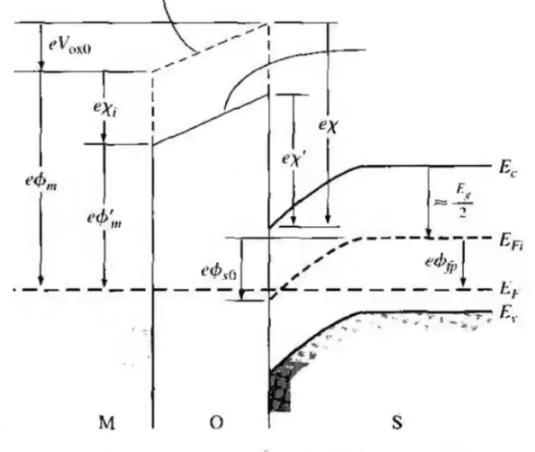

45. 阈值电压表达式是什么？如何调整阈值电压？

     使半导体表面达到强反型时施加的栅压称为**阈值电压**，用下式描述（N型半导体）：
     $$
       V_T=\phi_s+\frac{Q_S}{C_{ox}}=\frac{qN_A W_m}{C_{ox}}+2\psi_{FP}=\frac{\sqrt{4q\epsilon_s N_A \psi_{FP}}}{C_{ox}} +2\psi_{FP}
     $$

       > 此时$\phi_s=2\psi_{FP}$

     阈值电压由掺杂浓度和氧化层厚度决定。在半导体表面进入强反型后，若栅压继续增大，半导体表面电势将维持$2\psi_{FB}$不变，相应的耗尽层宽度达到最大值，这是由于反型层高浓度少子的屏蔽作用

     实际MOSFET中，金属半导体功函数差和氧化层电荷都会影响阈值电压

     **考虑金属半导体功函数差和氧化物电荷后的阈值电压**：
     $$
     V_{TH}=V_{FB1}+V_{FB2}-\frac{Q_B}{C_{ox}}+V_{TH0}=(\phi_{ms}-\frac{Q_0}{C_0})+\phi_s -\frac{Q_B}{C_{ox}}=\phi_{ms}-\frac{Q_0}{C_0}-\frac{Q_B}{C_{ox}} +\psi_s
     $$
     其中第一项$V_{FB1}=\phi_{ms}=\phi_m -\phi_s$是为了消除半导体金属功函数差影响所需的平带电压

     第二项$V_{FB2}=-\frac{Q_0}{C_0}$是为了把绝缘层中正电荷发出的电力线全部吸引到金属电极一侧所需要加的外加电压

     第三项$-\frac{Q_B}{C_{ox}}$是支撑开始出现强反型时的体电荷$Q_B$所需要的外加电压

     第四项$\psi_s=2\phi_{FP}$就是理想MOSFET模型中开始出现强反型时，半导体表面应达到的表面势

     **离子注入**和**衬底偏压**都可以改变阈值电压

46. 金属和半导体存在功函数差的时候的能带图

     实际MOSFET在平衡情况下，半导体表面电势不为0，需要在金属电极上施加一个电压来消除金属半导体功函数差的影响，该电压称为**平带电压**
     $$
     V_{FB}=\phi_m -\phi_s
     $$

     能带图为

     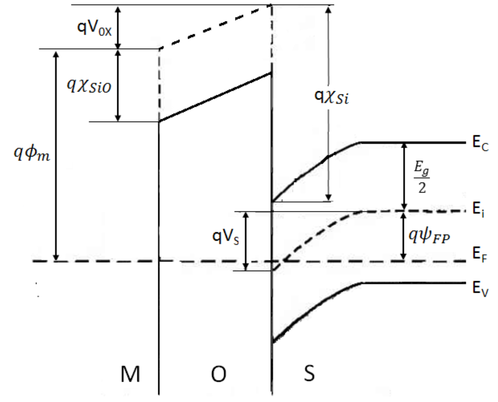

47. C-V曲线在低频高频不一样的原因，以及不同情况的表达式

     理想MOSFET的电容包括

     * 绝缘层表面电容$C_{ox}=\frac{\epsilon_0 \epsilon_{ox}}{d_{ox}}$
     * 半导体表面空间电荷区单位面积电容$C_0$

     两个电容串联排布

     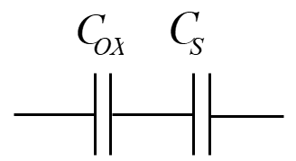

     理想MOSFET的C-V曲线如下图所示

     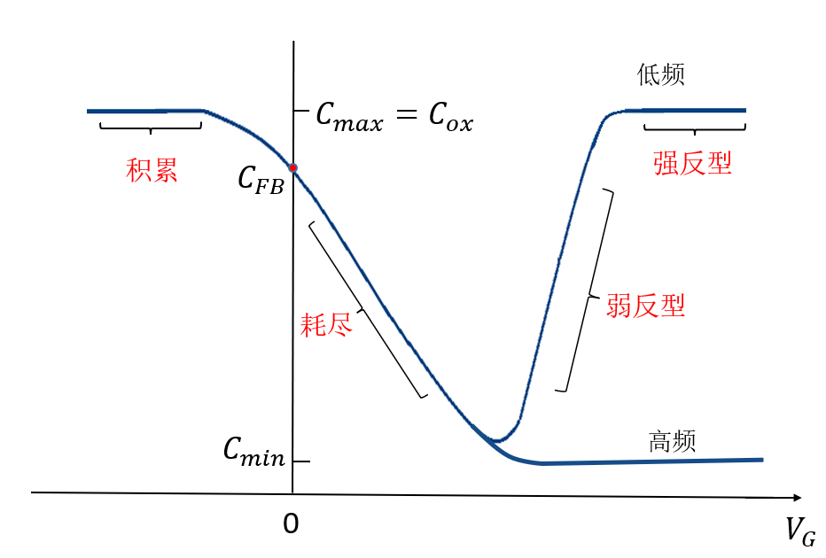

     可以发现半导体表面电容随栅压改变而改变。MOS系统的电容基本上等于绝缘层电容$C_{ox}$

     实际MOSFET还有：

     * 平带电容$C_{FB}$
     * 耗尽区电容$C$

     由于金属半导体功函数差和氧化层电容存在会让C-V曲线发生平移；而界面态会让C-V曲线变形，如下图所示

     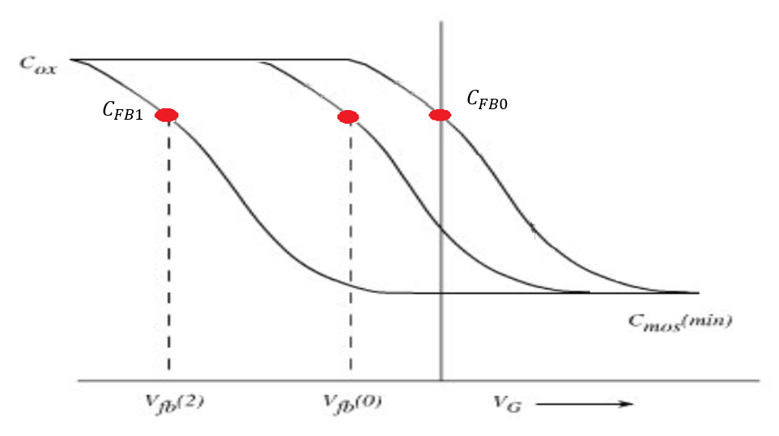

48. 温度偏压实验原理

     温度偏压实验即B-T实验，用于测量离子沾污程度。
     $$
     Q_m=C_0 \Delta V
     $$
     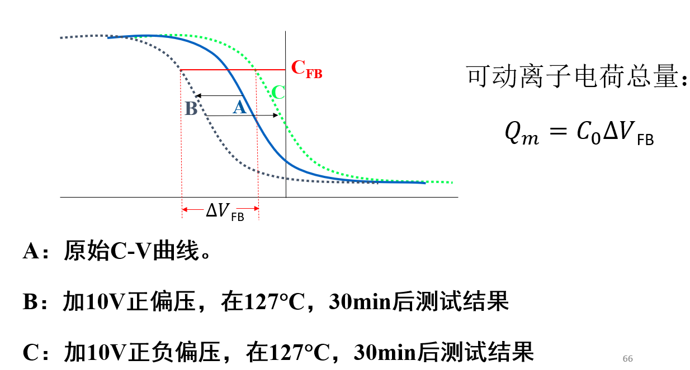

49. 夹断的概念？

     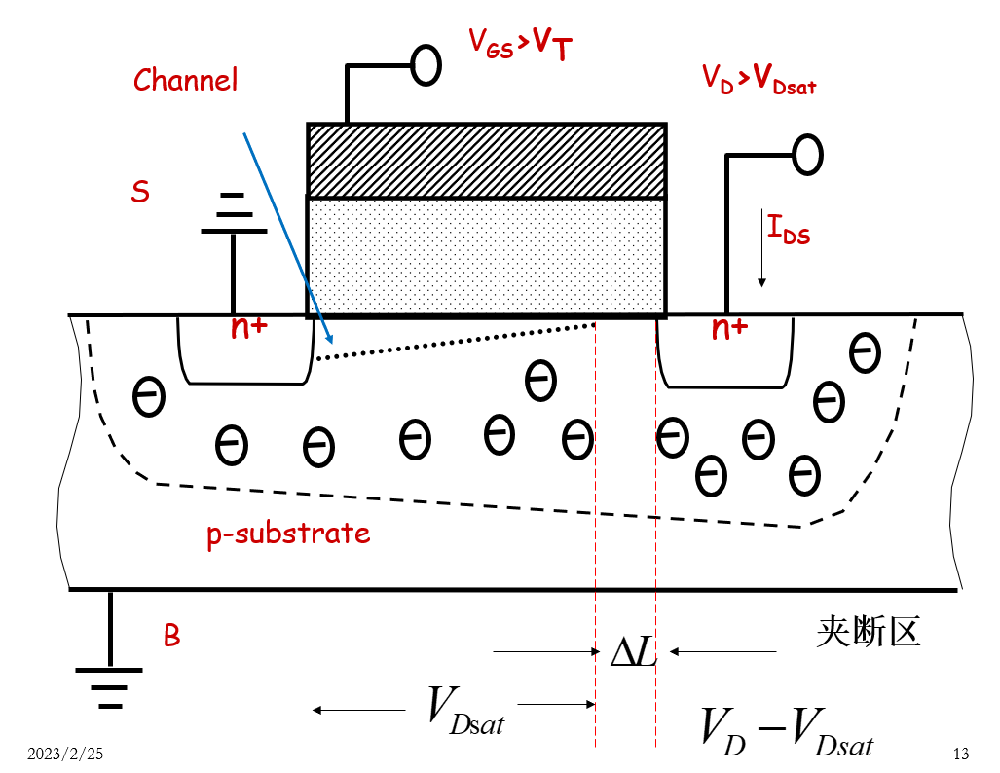

50. 什么是亚阈值电流、亚阈摆幅，它们的特点是什么？会带来哪些缺点？

     阈值电压$V_{TH}$定义为半导体表面势达到$2\psi_{FP}$时所加的栅电压，在$V_{GS}$达到阈值电压后，沟道进入强反型区，但在半导体表面势为$\psi_{FP}$到$2\psi_{FP}$之间，沟道已经进入弱反型区，此时半导体表面的漏电流被称为**亚阈值电流**

     亚阈电流会随栅压指数变化：
     $$
       I_D =exp(\frac{qV_S}{kT})[1-exp(\frac{-qV_d}{kT})]
     $$
     当$V_d>3kT/q$时，$I_D$就与$V_d$无关了

     **亚阈摆幅**是指亚阈值下位于电流每变化一个数量级，所引起$V_{GS}$的变化幅度（*漏电流减少到1/10所需要的栅压摆幅*），用S表述
     $$
     S=\frac{dV_{GS}}{d(lgI_D)}=ln10\frac{dV_{GS}}{d(ln I_D)}
     $$
       S越小，器件导通和截止之间转换越容易，说明亚阈区特性越好

       亚阈电流的存在使器件：

       * 截止电流大大增加
       * 开关特性恶化
       * 电路功耗增加

51. 线性区饱和区漏电流表达式，跨导漏导

        增强型MOSFET截止漏电流
     $$
        I_{DS0}=I_{DS}|_{V_{GS}=0}
     $$
        即在$V_{GS}=0$时的两个PN结的反向饱和电流

        导通电阻在$V_{DS}$很小时与成线性关系（线性区）
     $$
        R_{DS_{on}}=\frac{V_{DS}}{I_{DS}}=\frac{1}{\beta (V_{GS} - V_{T})}
     $$
        实际的导通电阻
     $$
        R_{DS_{on}} ^{*}=R_{DS_{on}} +R_S +R_D
     $$
        还要加上源区和漏区串联电阻

52. **沟道宽度调制效应**

53. 短沟道效应定义是什么？包括什么？

     **短沟道效应**（SCE，Short Channel Effect）和窄沟道效应是发生在小尺寸MOSFET中的一系列性质。随着沟道长度L和特征线宽W减小，会诱发MOSFET出现下面几种变化：

        * 阈值电压减小（$V_{TH}$ roll-off）
            $$
            V_{TH}=V_{FB}+2V_B +\frac{Q_B}{C_{ox}}
            $$
            可分成平带电压（源于金半接触）+耗尽区强反型时的表面势$V_B=\psi_{FP}$+二氧化硅上的串联压降$Q_B=\sqrt{4q N_{A\epsilon} \psi_{FP}}$，其中没有一项与L或W直接相关。但实验表明**随着L减小，$V_{TH}$减小；随W减小，$V_{TH}$增大**，这就是阈值电压卷曲效应

            本质上是由于沟道长度减小，栅控电荷减少，导致阈值电压降低。从图像上看就是原来栅氧化层下方平行的能带变成了弯曲的能带，表面势自然减小了

            > 随W减小，$V_{TH}$增大的情况被称为窄沟道效应，导致

        * 漏感应势垒降低（**DIBL**）

        * 速度饱和效应

        * 亚阈特性退化

        * 热载流子效应（高场效应）

54. 速度饱和模型电流的表达式
     $$
       I_D(sat)=qWC_{ox}(V_{GS}-V_T -V_{DS})V_{sat}
     $$

55. 为什么源漏结深是一个重要的参数？

56. 怎么提高MOSFET的截止频率$f_T$

        1. 降低寄生电容：减小Overlap（栅氧化层覆盖到源漏区的部分）

            由于饱和区中，$f_T = \frac{g_m}{2\pi (1+|G_V|) C_{GDO}}$，减小$C_{GDO}$就可以提高截止频率

            使用离子注入自对准技术可以起作用

        2. 

            

57. **CMOS及闩锁效应**

     CMOS即Complete MOS，由一个增强型PMOS和一个增强型NMOS组合而成，**PMOS的源极S接高电位VDD，NMOS的源极S接低电位GND**，二者栅极相接，两管串联，可以表达非逻辑

58. 结型场效应晶体管

     使用金属-半导体结，多子器件，噪声更低

59. 高电子迁移率晶体管

      **高电子迁移率晶体管**即**HEMT**，又被称为**异质结场效应晶体管**，既具有JFET的特点，又和MOSFET一样是栅极电荷调制型器件

     二维电子气（2DEG）：电子/空穴在与界面平行的平面内自由运动，在垂直于界面的方向受到限制。浓度和势阱深度受栅压控制，但不受电离杂质散射，迁移率极高
