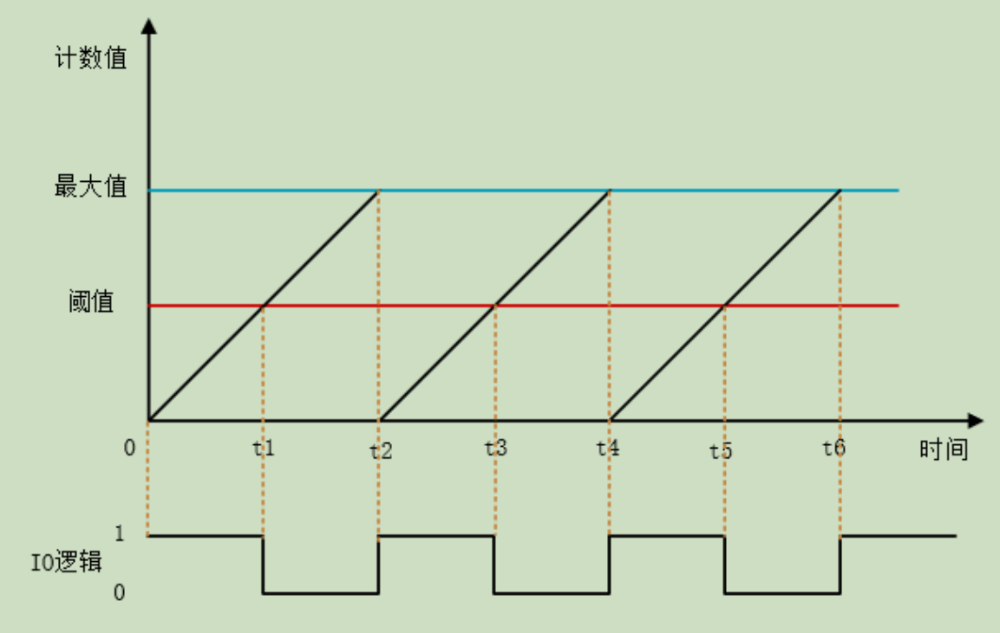

# PWM驱动设备

**脉冲宽度调制PWM是一种对模拟信号电平进行数字编码的方法**，通过不同频率的脉冲使用方波的占空比（duty-cycle）对一个具体的模拟信号的电平进行编码，使输出端得到一系列幅值相等的脉冲，用这些脉冲来替代所需要波形的设备

人话：用定时器控制电压为U输出信号的占空比D（$0\le D \le1$），可以得到0\~U之间一个电压U~T~的输出信号，且有$$U_T=U*D$$

# 裸机PWM的使用方法（复习）

一般使用定时器来控制PWM

1. 设置定时器溢出值a和频率f
2. 设置定时器为PWM模式，并选择具体的“上升模式”或“下降模式”或“往返模式”
3. 设置定时器比较值k，定时器计数器当前值达到k时则根据设置溢出/反转
4. 设置定时器有效电平，此选项决定了是定时器达到k值前还是达到k值后GPIO输出高/低电平
5. 开启定时器
6. 开启PWM
7. 开始输出



使用途中如果需要改变占空比只要在运行代码里调节k值即可，用上面这张图解释就是上下调整阈值会导致IO逻辑中的跳变沿左右移动

# PWM设备的访问

RTT将上面的所有过程封装起来，只要使用以下API，草履虫都能写呼吸灯

### 查找PWM设备

```c
rt_device_t rt_device_find(const char* name);
```

使用这个API通过设备名称获取设备句柄

### 设置PWM周期和占空比

```c
rt_err_t rt_pwm_set(struct rt_device_pwm *device,//设备句柄
                    int channel,//PWM通道
                    rt_uint32_t period,//周期时间，单位纳秒 ns
                    rt_uint32_t pulse);//脉冲宽度时间，单位纳秒 ns
```

通过上面的API设置PWM周期和占空比

**PWM的输出频率由周期时间period决定**，$占空比D=\frac{pulse}{period}$

注意：$pulse \le period$

### 使能和关闭PWM设备

```c
rt_err_t rt_pwm_enable(struct rt_device_pwm *device, int channel);//使能设备
rt_err_t rt_pwm_disable(struct rt_device_pwm *device, int channel);//关闭设备
```

其中channel都是OWM通道，设置为1-4

使用例如下

```c
#define PWM_DEV_NAME "pwm3" /* PWM设备名称 */
#define PWM_DEV_CHANNEL 4 /* PWM通道 */
struct rt_device_pwm *pwm_dev; /* PWM设备句柄 */   
rt_uint32_t period, pulse;

period = 500000; /* 周期为0.5ms，单位为纳秒ns */
pulse = 0; /* PWM脉冲宽度值，单位为纳秒ns */

pwm_dev = (struct rt_device_pwm *)rt_device_find(PWM_DEV_NAME);/* 查找设备 */
rt_pwm_set(pwm_dev, PWM_DEV_CHANNEL, period, pulse);/* 设置PWM周期和脉冲宽度 */
rt_pwm_enable(pwm_dev, PWM_DEV_CHANNEL);/* 使能设备 */
rt_pwm_disable(pwm_dev,PWM_DEV_CHANNEL);/* 关闭设备通道 */
```

## FinSH命令使用PWM设备

使用以下命令在FinSH中设置、使能和关闭PWM

```shell
msh />pwm_set PWM设备名称 PWM通道 周期【单位ns】 脉冲宽度【单位ns】

msh />pwm_enable PWM设备名称 PWM通道

msh />pwm_disable PWM设备名称 PWM通道
```

# 使用示例

呼吸灯就是这么简单.cpp

```c
#include <rtthread.h>
#include <rtdevice.h>

#define PWM_DEV_NAME "pwm3" /* PWM设备名称 */
#define PWM_DEV_CHANNEL 4 /* PWM通道 */

struct rt_device_pwm *pwm_dev; /* PWM设备句柄 */

static int pwm_led_sample(int argc, char *argv[])
{
    rt_uint32_t period, pulse, dir;

    period = 500000;    /* 周期为0.5ms，单位为纳秒ns */
    dir = 1;            /* PWM脉冲宽度值的增减方向 */
    pulse = 0;          /* PWM脉冲宽度值，单位为纳秒ns */

    /* 查找设备 */
    pwm_dev = (struct rt_device_pwm *)rt_device_find(PWM_DEV_NAME);
    if (pwm_dev == RT_NULL)
    {
        rt_kprintf("pwm sample run failed! can't find %s device!\n", PWM_DEV_NAME);
        return RT_ERROR;
    }

    /* 设置PWM周期和脉冲宽度默认值 */
    rt_pwm_set(pwm_dev, PWM_DEV_CHANNEL, period, pulse);
    /* 使能设备 */
    rt_pwm_enable(pwm_dev, PWM_DEV_CHANNEL);

    while (1)
    {
        rt_thread_mdelay(50);
        if (dir)
        {
            pulse += 5000;      /* 从0值开始每次增加5000ns */
        }
        else
        {
            pulse -= 5000;      /* 从最大值开始每次减少5000ns */
        }
        if (pulse >= period)
        {
            dir = 0;
        }
        if (0 == pulse)
        {
            dir = 1;
        }

        /* 设置PWM周期和脉冲宽度 */
        rt_pwm_set(pwm_dev, PWM_DEV_CHANNEL, period, pulse);
    }
}
```