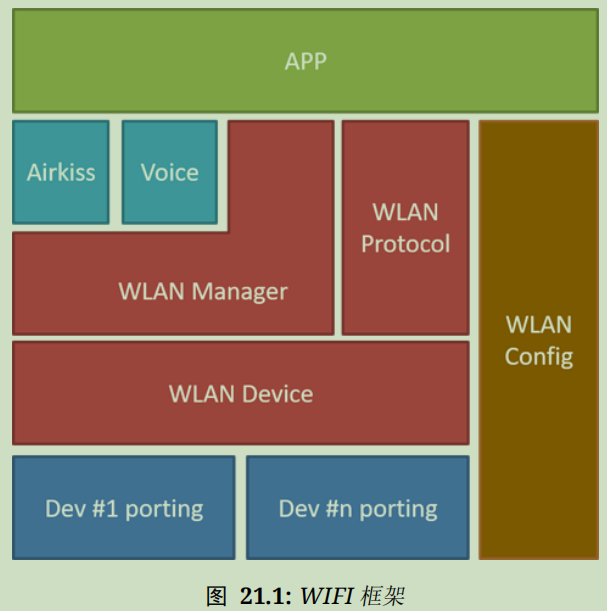

# WLAN简介

RTT使用WLAN设备管理WIFI无线网络和网络协议栈，**众所周知，RTT是一个主打IoT的RTOS，WLAN设备是它的基础**

RTT使用WLAN框架实现网络设备的驱动

## WLAN框架

基本功能

* 对底层控制WiFi连接、断开、扫描等
* 对上层提供WiFi控制、事件、数据导流等应用操作
* 对上层应用程序实现统一的WiFi控制接口

### WLAN框架组成

1. DEV驱动接口层

为WLAN框架提供统一的API

2. MANAGE管理层

提供WiFi扫描、连接、断线重连等具体功能

3. Protocol协议层

处理WiFi上产生的数据流，可以**根据不同的使用场景挂载不同的通讯协议**

示意图如下所示：



APP：应用层，由开发者实现的基于WLAN框架的具体应用，可以被FinSH直接调用

airkiss、voice：配网层，实现无限配网和声波配网等功能

WLAN Manager：管理层，直接控制WLAN的连接、扫描

WLAN Protocol：协议层，管理当前协议、处理数据流、进行数据解析

WLAN config：参数管理层，管理当前WiFi连接参数（SSID等）和安全参数（密码、加密方式等），一般会与存储器管理应用协同工作，将数据保存在非易失性存储介质中

WLAN dev：驱动接口层，直接操作WLAN硬件，向上提供API

### WLAN框架典型功能

1. 自动连接：自动保存并连接已知AP，会不断尝试直到连接成功
2. 参数存储：记录已知AP的连接参数和相关信息，会自动缓存在内存，如果挂载了外部非易失性存储器，还会在外部存储设备中备份
3. WiFi控制：提供基本WiFi连接API和相关回调事件，可以使用FSM进行处理
4. Shell命令：在Msh中输入脚本命令即可控制WiFi

### 启用WLAN框架

在ENV工具中使用menuconfig或在RTT Studio中打开RT-Thread Settings -> 更多配置 -> 设备驱动程序勾选相关设定即可启用WLAN框架 

## WLAN设备使用

### 初始化

1. 连接管理器初始化

使用rt_wlan_init()初始化连接管理器所需的静态资源

一般会自动初始化，如果关闭了自动初始化功能则需要在使用相关API前手动调用上述API进行初始化

2. 设置WLAN设备模式

使用rt_wlan_set_mode(const char* dev_name,rt_wlan_mode_t mode)设置WLAN设备的工作模式

同一个设备切换相同的模式无效；同一种模式只能存在一个设备，不能让两个设备设置为同一模式。

可用模式如下

```c
typedef enum
{
    RT_WLAN_NONE,			//停止模式
    RT_WLAN_STATION,		//STA模式
    RT_WLAN_AP,				//AP模式
    RT_WLAN_MODE_MAX		//无效
}rt_wlan_mode_t;
```

AP模式：设备作为AP供周边设备接入；STA模式：设备接入周边AP

3. 获取设备模式

使用rt_wlan_get_mode(const char* dev_name)获取设备工作模式，返回值为上述模式之一

### STA模式

1. 阻塞式连接热点rt_wlan_connect(const char* ssid,const char* password)

此API调用时间较长，使用期间可能会阻塞其他函数运行

如果无密码，设置password为空即可

WLAN连接成功后需要等待连接就绪才能通讯

2. 无阻塞链接热点rt_wlan_connect_adv(struct rt_wlan_info* info,const char* password)

连接参数info可通过扫描获得，也可以手动指定，一般用于连接特定热点或隐藏热点，返回值仅表示连接动作是否开始执行，需要主动查询或设置回调函数来确认是否连接成功

info结构体的完整配置如下所示

```c
struct rt_wlan_info
{
    rt_wlan_security_t security;                        /* 安全类型 */
    rt_802_11_band_t band;                              /* 2.4G或5G连接 */
    rt_uint32_t datarate;                               /* 连接速率 */
    rt_int16_t channel;                                 /* 通道 */
    rt_int16_t  rssi;                                   /* 信号强度 */
    rt_wlan_ssid_t ssid;                                /* 热点名称 */
    rt_uint8_t bssid[RT_WLAN_BSSID_MAX_LENGTH];         /* 热点物理地址 */
    rt_uint8_t hidden;                                  /* 热点隐藏标志 */
};

//可选择的安全模式如下所示
typedef enum
{
    SECURITY_OPEN = 0, /* Open security */
    SECURITY_WEP_PSK = WEP_ENABLED, /* WEP Security with open authentication   */
    SECURITY_WEP_SHARED = (WEP_ENABLED | SHARED_ENABLED), /* WEP Security with shared authentication */
    SECURITY_WPA_TKIP_PSK = (WPA_SECURITY  | TKIP_ENABLED), /* WPA Security with TKIP */
    SECURITY_WPA_AES_PSK = (WPA_SECURITY  | AES_ENABLED), /* WPA Security with AES */
    SECURITY_WPA2_AES_PSK = (WPA2_SECURITY | AES_ENABLED), /* WPA2 Security with AES */
    SECURITY_WPA2_TKIP_PSK  = (WPA2_SECURITY | TKIP_ENABLED), /* WPA2 Security with TKIP */
    SECURITY_WPA2_MIXED_PSK = (WPA2_SECURITY | AES_ENABLED | TKIP_ENABLED), /* WPA2 Security with AES & TKIP */
    SECURITY_WPS_OPEN = WPS_ENABLED, /* WPS with open security */
    SECURITY_WPS_SECURE = (WPS_ENABLED | AES_ENABLED), /* WPS with AES security */
    SECURITY_UNKNOWN = -1, /* security is unknown. */
} rt_wlan_security_t;
```

使用例如下所示

```c
struct rt_wlan_info info;

INVALID_INFO(&info);                                /* 初始化 info */
SSID_SET(&info, "test_ap");                         /* 设置热点名字 */
info.security = SECURITY_WPA2_AES_PSK;              /* 指定安全类型 */
rt_wlan_connect_adv(&info, "12345678");             /* 执行连接动作 */
while (rt_wlan_is_connected() == RT_FALSE);         /* 等待连接成功 */
```

3. 断开热点

使用接口函数rt_wlan_disconnect()断开当前连接，返回值表示是否成功断开

一般断开前应先查询是否连接，如果已连接再断开

4. 获取连接状态

相关API如下所示

```c
rt_bool_t rt_wlan_is_connected(void);//查询是否连接到热点
rt_bool_t rt_wlan_is_ready(void);//查询连接是否就绪，获取到IP表示已准备就绪，此时可以传输数据
rt_err_t rt_wlan_get_info(struct rt_wlan_info *info);//获取连接信息，可获取SSID、CHANNEL、信号强度、安全类型等
int rt_wlan_get_rssi(void);//获得信号强度。信号强度为负值，值越大信号越强（-1强度高 > -10强度低）
```

### 扫描与自动重连

1. WLAN扫描

**基本API**如下所示

```c
rt_err_t rt_wlan_scan(void);//异步扫描函数，扫描完成需要通过回调进行通知
struct rt_wlan_scan_result *rt_wlan_scan_sync(void);//同步扫描函数，扫描全部热点信息，完成后直接返回扫描结果
```

rt_wlan_scan_result结构体定义如下所示

此结构体包含热点信息和附近热点数量

```c
struct rt_wlan_scan_result
{
    rt_int32_t num; /* 热点个数 */
    struct rt_wlan_info *info; /* 热点信息 */
};
```

rt_wlan_info是连续的内存块，可以通过类似数组的方式访问

```c
result = rt_wlan_scan_sync(void);//获取扫描结果
for (i = 0; i < result->num; i++)
    printf("SSID:%s\n", result->info[i].ssid.val);//使用数组的形式进行访问，打印扫描到的 SSID 信息
```

**条件API**如下所示

```c
struct rt_wlan_scan_result *rt_wlan_scan_with_info(struct rt_wlan_info *info);
//同步条件扫描。根据参入的条件进行过滤，可用于扫描指定 SSID

//使用SSID_SET(&ssid,"target ssid")进行设置
```

使用例如下所示

```c
struct rt_wlan_info info;

INVALID_INFO(&info); /* 初始化 info */
SSID_SET(&info, "test_ap"); /* 指定 SSID */
result = rt_wlan_scan_with_info(&info); /* 开始同步扫描 */
```

2. 获取热点个数

使用rt_wlan_scan_get_result_num()获取扫描到的热点数量

3. 复制热点信息

使用rt_wlan_scan_get_info(struct rt_wlan_info *info, int num)复制num个热点信息到info缓存

使用例如下所示

```c
num = rt_wlan_scan_get_result_num(); /* 查询热点数量 */
info = rt_malloc(sizeof(struct rt_wlan_info) * num); /* 必须事先分配内存 */

rt_wlan_scan_get_info(info, num); /* 复制到info */
```

4. 扫描缓存管理

**获取扫描缓存**rt_wlan_scan_result *rt_wlan_scan_get_result()

**清理扫描缓存**rt_wlan_scan_result_clean()

一般在驱动中封装对应功能

4. 查找信号最好的热点信息

使用接口函数rt_wlan_find_best_by_cache(const char *ssid, struct rt_wlan_info *info)指定 SSID 并在扫描缓存中查找信号最好的热点信息，返回是否查找到热点，并将查找到的热点信息保存到info中

### AP模式

1. 阻塞式启动热点rt_wlan_start_ap(const char *ssid, const char *password)

和阻塞式连接对应

2. 非阻塞式启动热点rt_wlan_start_ap_adv(struct rt_wlan_info *info, const char *password)

和非阻塞式连接对应

可以指定加密类型、通道等，但需要手动查询或设置回调函数通知热点启动情况

password为空时不设密码

3. 获取启动状态

相关API如下所示

```c
rt_bool_t rt_wlan_ap_is_active(void);//查询热点是否处于活动状态
rt_err_t rt_wlan_ap_get_info(struct rt_wlan_info *info);//获取热点相关信息，如热点名字，通道等
```

4. 停止热点

使用接口rt_wlan_ap_stop()阻塞式停止当前热点运行

停止前应查询是否已经启动，已经启动后再停止

5. WLAN自动重连

使用以下API进行配置

```c
void rt_wlan_config_autoreconnect(rt_bool_t enable);//开启或关闭自动重连模式，当没有网络时，会自动进行重连
rt_bool_t rt_wlan_get_autoreconnect_mode(void);//查询自动重连是否启动
```

### WLAN事件回调

1. 事件注册

```c
rt_err_t rt_wlan_register_event_handler(rt_wlan_event_t event,//事件类型
                                        rt_wlan_event_handler handler,//事件处理函数
                                        void *parameter)//用户参数
```

可用事件类型如下

| 事件                           | 类型                         | 描述                    |
| ------------------------------ | ---------------------------- | ----------------------- |
| RT_WLAN_EVT_READY              | ip_addr_t *                  | IP 地址                 |
| RT_WLAN_EVT_SCAN_DONE          | struct rt_wlan_scan_result * | 扫描的结果              |
| RT_WLAN_EVT_SCAN_REPORT        | struct rt_wlan_info *        | 扫描到的热点信息        |
| RT_WLAN_EVT_STA_CONNECTED      | struct rt_wlan_info *        | 连接成功的 Station 信息 |
| RT_WLAN_EVT_STA_CONNECTED_FAIL | struct rt_wlan_info *        | 连接失败的 Station 信息 |
| RT_WLAN_EVT_STA_DISCONNECTED   | struct rt_wlan_info *        | 断开连接的 Station 信息 |
| RT_WLAN_EVT_AP_START           | struct rt_wlan_info *        | 启动成功的 AP 信息      |
| RT_WLAN_EVT_AP_STOP            | struct rt_wlan_info *        | 启动失败的 AP 信息      |
| RT_WLAN_EVT_AP_ASSOCIATED      | struct rt_wlan_info *        | 连入的 Station 信息     |
| RT_WLAN_EVT_AP_DISASSOCIATED   | struct rt_wlan_info *        | 断开的 Station 信息     |

触发条件如下

```c
typedef enum
{
    RT_WLAN_EVT_READY = 0,              /* 网络就绪 */
    RT_WLAN_EVT_SCAN_DONE,              /* 扫描完成 */
    RT_WLAN_EVT_SCAN_REPORT,            /* 扫描到一个热点 */
    RT_WLAN_EVT_STA_CONNECTED,          /* 连接成功 */
    RT_WLAN_EVT_STA_CONNECTED_FAIL,     /* 连接失败 */
    RT_WLAN_EVT_STA_DISCONNECTED,       /* 断开连接 */
    RT_WLAN_EVT_AP_START,               /* 热点启动 */
    RT_WLAN_EVT_AP_STOP,                /* 热点停止 */
    RT_WLAN_EVT_AP_ASSOCIATED,          /* STA 接入 */
    RT_WLAN_EVT_AP_DISASSOCIATED,       /* STA 断开 */
} rt_wlan_event_t;
```

当以上情况发生时，触发回调函数并回传事件类型

2. 解除注册

```c
rt_err_t rt_wlan_unregister_event_handler(rt_wlan_event_t event)//事件类型
```

用于接触某个类型事件的回调函数注册

### 功耗管理

1. 设置功耗等级rt_wlan_set_powersave(int level)

**专用于STA模式**

2. 获取当前功耗等级rt_wlan_get_powersave()

注意：level越大，功耗越高

### FinSH命令

RTT设置了wifi相关的shell命令以供调试

```c
wifi                           /* 打印帮助 */
wifi help                      /* 查看帮助 */
wifi join SSID [PASSWORD]      /* 连接 wifi，SSDI 为空，使用配置自动连接 */
wifi ap   SSID [PASSWORD]      /* 建立热点 */
wifi scan                      /* 扫描全部热点 */
wifi disc                      /* 断开连接 */
wifi ap_stop                   /* 停止热点 */
wifi status                    /* 打印 wifi 状态 sta + ap */
wifi smartconfig               /* 启动配网功能 */
```

# 使用示例

自动连接示例（摘自官网文档中心）

```c
#include <rthw.h>
#include <rtthread.h>

#include <wlan_mgnt.h>
#include <wlan_prot.h>
#include <wlan_cfg.h>

static void
wifi_ready_callback(int event, struct rt_wlan_buff *buff, void *parameter)
{
    rt_kprintf("%s\n", __FUNCTION__);
}

static void
wifi_connect_callback(int event, struct rt_wlan_buff *buff, void *parameter)
{
    rt_kprintf("%s\n", __FUNCTION__);
    if ((buff != RT_NULL) && (buff->len == sizeof(struct rt_wlan_info)))
    {
        rt_kprintf("ssid : %s \n", ((struct rt_wlan_info *)buff->data)->ssid.val);
    }
}

static void
wifi_disconnect_callback(int event, struct rt_wlan_buff *buff, void *parameter)
{
    rt_kprintf("%s\n", __FUNCTION__);
    if ((buff != RT_NULL) && (buff->len == sizeof(struct rt_wlan_info)))
    {
        rt_kprintf("ssid : %s \n", ((struct rt_wlan_info *)buff->data)->ssid.val);
    }
}

static void
wifi_connect_fail_callback(int event, struct rt_wlan_buff *buff, void *parameter)
{
    rt_kprintf("%s\n", __FUNCTION__);
    if ((buff != RT_NULL) && (buff->len == sizeof(struct rt_wlan_info)))
    {
        rt_kprintf("ssid : %s \n", ((struct rt_wlan_info *)buff->data)->ssid.val);
    }
}

int wifi_autoconnect(void)
{
    /* Configuring WLAN device working mode */
    rt_wlan_set_mode(RT_WLAN_DEVICE_STA_NAME, RT_WLAN_STATION);
    /* Start automatic connection */
    rt_wlan_config_autoreconnect(RT_TRUE);
    /* register event */
    rt_wlan_register_event_handler(RT_WLAN_EVT_READY,
            wifi_ready_callback, RT_NULL);
    rt_wlan_register_event_handler(RT_WLAN_EVT_STA_CONNECTED,
            wifi_connect_callback, RT_NULL);
    rt_wlan_register_event_handler(RT_WLAN_EVT_STA_DISCONNECTED,
            wifi_disconnect_callback, RT_NULL);
    rt_wlan_register_event_handler(RT_WLAN_EVT_STA_CONNECTED_FAIL,
            wifi_connect_fail_callback, RT_NULL);
    return 0;
}

int auto_connect(int argc, char *argv[])
{
    wifi_autoconnect();
    return 0;
}
```

WLAN框架的使用难度约等于Arduino，这是连道场的小鬼都知道的事=)

不过真正的难点在于移植时编写驱动...

