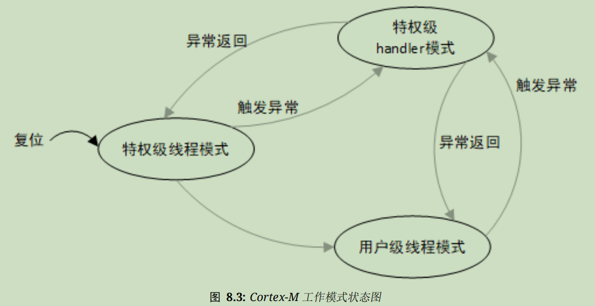
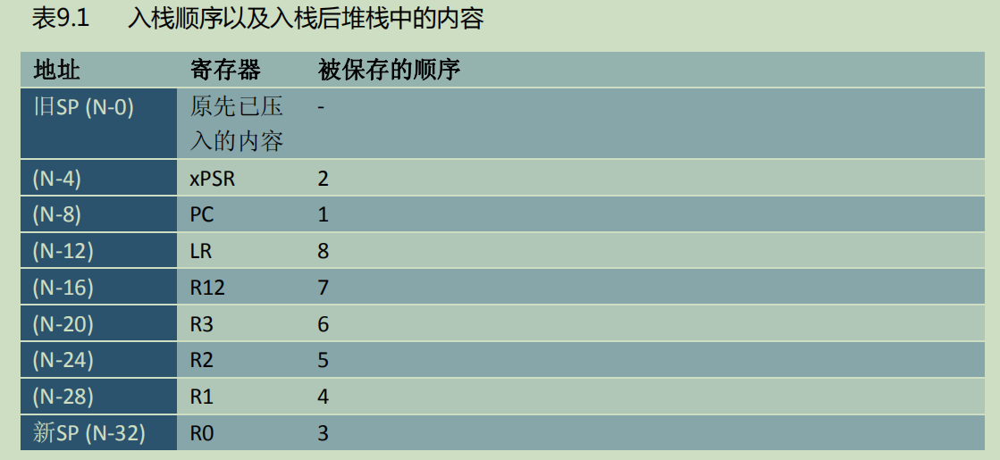

# 中断简介

异步事件：CPU外部发生的紧急事件，需要CPU进行处理

中断系统：实现CPU暂停当前任务，转而处理异步事件，处理完后再回到原来被中断地址继续工作的过程

中断源：申请CPU中断的请求源

异常：导致CPU脱离正常运行转向执行特殊代码的事件

**中断是一种异常**

# Cortex-M系列CPU架构简介

Cortex-M系列CPU的寄存器组里由R0-R15共**16个通用寄存器**和**若干特殊功能寄存器**

其中，R13为堆栈指针寄存器（栈顶指针Stack Pointer，一般称为**sp**），可以是MSP（主堆栈指针），也可以是PSP（进程堆栈指针）；

​			R14为连接寄存器（Link Register，**LR**），用于在调用子程序时**存储返回地址**；

​			R15为程序计数器（Program Counter，即**PC**）

特殊功能寄存器包括**程序状态字**寄存器组（**PSR**s）、**中断屏蔽寄存器**组（PRIMASK、FAULTMASK、BASEPRI）、控制寄存器（CONTROL）

PSR中保存了算术与逻辑标志；中断屏蔽寄存器组控制中断除能；控制寄存器用于定义特权级别和当前使用那个堆栈指针；特别地，具有FPU的Cortex-M4和Cortex-M7，控制寄存器也用了指示浮点单元（包含32个浮点通用寄存器S0-S31和特殊浮点状态与控制寄存器FPSCR）当前是否在使用

在ARM汇编中可通过MSR/MRS指令来访问特殊功能寄存器

```assembly
MRS R0,CONTROL ; 读取CONTOL到R0
MSR CONTROL,R0 ; 写入R0到CONTROL
```

## ==操作模式与特权级别==

Cortex-M系列CPU具有线程模式和处理模式，**CPU正常运行在线程模式，当且仅当进入异常或中断处理的情况下进入处理模式**；具有特权级别和用户级别，**线程模式可以工作在特权级或用户级，但处理模式总工作在特权级**



可通过CONTROL寄存器控制CPU工作模式和特权级别

**处理模式总是使用MSP作为堆栈，线程模式可以选择MSP或PSP作为堆栈**，同样通过CONTROL寄存器控制

**复位后CPU默认进入特权级线程模式，使用MSP**

## ==嵌套向量中断控制器NVIC==

当一个中断触发且系统响应时，会进行以下操作：

1. CPU将当前位置的上下文寄存器（8大金刚）的内容压入中断栈，包括PSR、PC、LR、R12、R0-R3


1. 读取中断向量：查找位于程序开头的中断向量表，从向量表中找出对应的服务程序入口地址
3. 更新SP、PSR、PC、LR
3. 执行中断服务函数（异常服务例程）
4. 触发异常返回序列
5. 将之前压入栈的寄存器出栈，SP的值也被恢复
6. 更新NVIC寄存器：硬件清除NVIC活动位，若中断输入未被屏蔽，悬起位也将被再次置位，准备新一轮中断响应

第一步称为“保护现场”，其中的入栈顺序如下图所示。注意**R0-R3、R12时最后被入栈的——这样可以更容易地使用sp基地址来索引寻址**



因为流水线操作，I-Code总线（指令总线）在系统总线（数据总线）执行入栈的**同时**从向量表中找出正确的异常向量，然后在服务程序的入口**预取指**

第二步统称“更新寄存器”，其中寄存器的变化如下图所示


第四步的作用是通知CPU“没想到吧！我从地狱回来了！”，在编写程序时直接把EXC_RETURN写入PC来让CPU识别到返回动作，可以使用以下任意返回指令之一，不需要使用如51常用的__interupt这种编译器指令

```assembly
POP {PC}
POP {...,PC} ; 两个指令都差不多，使用POP指令让LR存储的EXC_RETURN出栈到PC就可以激发中断返回
BX <reg> ; 当LR存储EXC_RETURN时调用BX LR进行返回
LDR
LDM ; 把PC作为目的寄存器，直接返回即可
```

合法的EXC_RETURN值共三个，如下表所示

| EXC_RETURN数值 | 功能                    | 用处                    |
| -------------- | ----------------------- | ----------------------- |
| 0xFFFF_FFF1    | 返回handler模式         | 中断抢占/咬尾中断       |
| 0xFFFF_FFF9    | 返回线程模式，并使用MSP | 主程序在使用MSP时被中断 |
| 0xFFFF_FFFD    | 返回线程模式，并使用PSP | 主程序在使用PSP时被中断 |

第五步常称为“恢复现场”

### 咬尾中断

如果CPU在响应异常时，如果又发生其他异常，若他们的优先级不够高则会被阻塞，当系统返回时并不会返回原程序，而是接着载入寄存器执行低优先级异常的服务程序，前前后后只执行了依次入栈/出栈操作，看上去仿佛是后一个异常把前一个异常的尾巴咬掉了，称为咬尾中断

### 中断嵌套

NVIC最强的功能就是中断嵌套，它允许更高优先级的中断打断当前运行的中断服务程序，只要硬件允许就能随便套娃

但是一定小心**计算主堆栈容量的最小安全值**：所有服务例程都只使用主堆栈，每多一级嵌套，就至少需要8个字（32字节）的堆栈空间，如果主堆栈溢出，会使入站数据与主堆栈前面的数据区发生混迭（后写入的数据覆盖之前写入的数据），这样执行完中断返回时系统极有可能直接跑飞！

注意：相同的异常不允许重入——每个异常都有自己的优先级，且同级或低优先级异常会被阻塞——**同一个异常，只有在上次实例的服务例程执行完毕后，方可继续响应新的请求**

### 中断延迟

中断延迟：从检测到中断请求，到执行其服务例程的第一条指令之间流逝的时间

**Cortex-M3的中断延迟永远是12个系统时钟；当处理咬尾中断时，中断延迟是6个系统时钟**

### PendSV系统调用

PendSV也称为可悬起的系统调用，**它是一种异常**，可以像普通中断一样被挂起，他专门用来辅助操作系统进行上下文切换

PendSV异常始终被初始化为最低优先级的异常

# RTT的中断工作机制

## 中断向量表

Cortex-M系列在中断发生时跳转到中断向量表查找中断服务函数，每个中断向量都是指向中断服务函数的函数指针

中断向量表一般有一个数组定义或在其实代码中给出（见startup.s文件）

## RTT的中断处理

### 中断前导程序

1. 内核自动完成保护现场
2. 通知内核进入中断状态后，调用rt_interrupt_enter()函数，把全局变量rt_interrupt_nest+1，它用来记录中断嵌套的层数

```c
void rt_interrupt_enter(void)//来自irq.c文件
{
    rt_base_t level;
    RT_DEBUG_LOG(RT_DEBUG_IRQ, ("irq coming..., irq nest:%d\n",
                                rt_interrupt_nest));

    level = rt_hw_interrupt_disable();
    rt_interrupt_nest ++;//之前提到的操作
    RT_OBJECT_HOOK_CALL(rt_interrupt_enter_hook,());//调用钩子函数
    rt_hw_interrupt_enable(level);
}
```

### 用户中断服务函数

用户中断服务函数（ISR）分为两种情况

1. 不进行线程切换

用户中断服务程序和中断后续程序运行完毕后退出中断模式，返回被中断的线程

2. 需要进行线程切换

这种情况下会调用rt_hw_context_switch_interrupt()函数，该函数实现和CPU架构相关，Cortex-M3上的实现如下

```assembly
;/*
; * void rt_hw_context_switch(rt_uint32 from, rt_uint32 to);
; * r0 --> from
; * r1 --> to
; */
rt_hw_context_switch_interrupt
    EXPORT rt_hw_context_switch_interrupt
rt_hw_context_switch    PROC
    EXPORT rt_hw_context_switch

    ; 检查 rt_thread_switch_interrupt_flag 是否等于 1
    LDR     r2, =rt_thread_switch_interrupt_flag
    LDR     r3, [r2]
    CMP     r3, #1
    BEQ     _reswitch
    MOV     r3, #1
    STR     r3, [r2]

    LDR     r2, =rt_interrupt_from_thread   ; 如果不等于1，将参数from保存到rt_interrupt_from_thread
    STR     r0, [r2]						; 即恢复from线程的上下文

_reswitch
    LDR     r2, =rt_interrupt_to_thread     ; 如果等于1，将参数to保存到rt_interrupt_to_thread
    STR     r1, [r2]						; 即恢复to线程的上下文

    LDR     r0, =NVIC_INT_CTRL              ; 触发PendSV异常 引起上下文切换
    LDR     r1, =NVIC_PENDSVSET
    STR     r1, [r0]
    BX      LR								; BX LR指令触发返回
    ENDP
```

PendSV异常触发后不会立即执行，而是会先处理中断后续程序，真正退出中断后才开始以咬尾中断的方式执行PendSV中断处理程序

### 中断后续程序

中断后续程序的主要工作包括

1. 通知内核离开中断状态，使用rt_interrupt_leave()函数

```c
void rt_interrupt_leave(void)
{
    rt_base_t level;
    RT_DEBUG_LOG(RT_DEBUG_IRQ, ("irq leave, irq nest:%d\n",
                                rt_interrupt_nest));

    level = rt_hw_interrupt_disable();
    rt_interrupt_nest --;//此时全局变量rt_interrupt_nest被-1，表示退出了一层中断
    RT_OBJECT_HOOK_CALL(rt_interrupt_leave_hook,());
    rt_hw_interrupt_enable(level);
}
```

2. 根据rt_hw_context_switch_interrupt()的结果（检查标志位rt_thread_switch_interrupt_flag）恢复上下文

流程框图如下所示，源代码同rt_hw_context_switch_interrupt()，但实际的切换动作由不同的中断服务函数完成


**RTT也支持中断嵌套**

## 中断栈

中断服务函数需要开一个自己的栈用来保存自己的局部变量，中断响应也需要一个栈空间来作为上下文，运行中断处理函数

中断栈可以保存在打断线程的栈中，从中断中退出时，返回相应的线程继续执行

中断栈也可以和线程栈完全分离，使用独立的中断栈相对更容易实现

**RTT采用的方式是提供独立的中断栈**，中断发生时，中断的前期处理程序会将用户的栈指针更换到系统预留的中断栈空间，等中断退出时再恢复用户的栈指针

优点：不占用线程栈空间、提高内存利用率，线程越多越明显

RTT使用MSP作为默认的堆栈指针，在运行第一个线程之前、中断和异常服务程序中都是用MSP；PSP在线程里使用。中断和异常服务程序退出时，修改LR寄存器的第2位的值位1，SP就由MSP切换到PSP

## 中断的底半处理

RTT不对中断服务程序所需要的处理时间做任何假设、限制，但用户应**保证所有的中断服务程序在尽可能短的时间内完成**

==中断服务程序在系统中拥有最高优先级，会抢占所有线程优先执行==

对于耗时很长的中断，应当将其分分割为两部分：**上半部分（Top Half）**和**底半部分（Bottom Half）**

上半部分中，取得硬件的状态和数据后，打开被屏蔽的中断，给相关线程发送一条通知（可以是信号量、时间、邮箱、消息队列等方式），然今后结束中断服务程序；之后相关的线程收到通知后对状态或数据进行进一步处理，这一过程称为**底半处理**

==**这种处理方式类似裸机编程中“在中断服务函数内将一个全局变量标志置位，主循环中轮询此标志，发现被置位后则调用相关函数”**==

# RTT的中断管理接口

RTT把中断和异常封装为一组抽象接口，这里的函数经常涉及CPU底层操作，所以会有一些代码由汇编实现

## 中断服务函数挂接

系统把用户的中断服务程序(IRQ_xxxHandler)和指定的中断号关联起来（有点像HAL库的操作？）

调用接口函数rt_hw_interrupt_install()处理中断源

```c
rt_isr_handler_t rt_hw_interrupt_install(int              vector,//挂载的中断号
                                         rt_isr_handler_t handler,//挂载的中断服务函数
                                         void            *param,//中断服务函数的参数
                                         char            *name);//中断名称
//该接口返回挂在这个中断服务程序之前挂载的中断服务程序的句柄
//这个API在Cortex-M3中并不存在
```

==**注意：这个API并不会出现在每个移植分支中，Cortex-M0/3/4的移植分支中就没有这个API，只有下面的rt_hw_exception_install()**==

```c
void rt_hw_exception_install(rt_err_t (*exception_handle)(void* context))
{
    rt_exception_hook = exception_handle;
}
```

中断服务程序是一种特殊的运行环境，它运行在特权模式的非线程执行环境下，这个环境中不能使用挂起当前线程的操作——当前线程**==并不存在==**，执行相关操作会导致报错"Function [abc_func] shall not used in ISR"

## 中断源管理

屏蔽中断源：保证接下来处理过程中硬件状态或数据不受干扰，当被屏蔽的中断触发时，中断状态寄存器会发生相应变化，但并不送达CPU进行处理

使用以下两个接口屏蔽/解除屏蔽中断源

```c
void rt_hw_interrupt_mask(int vector)
void rt_hw_interrupt_umask(int vector)
```

==**注意：这两个API并不会出现在每个移植分支中，Cortex-M0/3/4的移植分支中就没有这两个API**==

## 全局中断开关

**全局中断开关也被称为“中断锁”，是禁止多线程访问临界区最简单的一种方式**

通过关闭中断来保证当前线程不会被其他时间打断。这个方法被用在RTT内核的各个函数以保障系统运行的安全性

使用接口rt_hw_interrupt_disable()关闭（使能）中断

使用接口rt_hw_interrupt_enable()使能（开启）中断

```assembly
;/*
; * rt_base_t rt_hw_interrupt_disable();
; */
rt_hw_interrupt_disable    PROC
    EXPORT  rt_hw_interrupt_disable
    MRS     r0, PRIMASK
    CPSID   I
    BX      LR
    ENDP

; //返回level表示rt_hw_interrupt_disable()运行前的中断状态

;/*
; * void rt_hw_interrupt_enable(rt_base_t level);
; */
rt_hw_interrupt_enable    PROC
    EXPORT  rt_hw_interrupt_enable
    MSR     PRIMASK, r0
    BX      LR
    ENDP
    
; //输入参数level表示前一次rt_hw_interrupt_disable()返回的中断状态
```

如果调用rt_hw_interrupt_disable()函数前是关中断状态，则调用后仍是关中断状态，**两个函数应当成对使用**，保证合理的中断运行和系统工作

中断锁可适用于任何场合，但它最主要的问题在于中断关闭期间系统将“自闭”：不响应任何外部事件，**中断锁对系统的实时性响应影响非常巨大！**，用当妥善使用

**全局中断的API支持嵌套使用**，用户无需为特殊的需求进行额外处理，示例代码如下

```c
void global_interrupt_demo(void)
{
    rt_base_t level0;
    rt_base_t level1;

    /* 第一次关闭全局中断，关闭之前的全局中断状态可能是打开的，也可能是关闭的 */
    level0 = rt_hw_interrupt_disable();
    /* 第二次关闭全局中断，关闭之前的全局中断是关闭的，关闭之后全局中断还是关闭的 */
    level1 = rt_hw_interrupt_disable();

    do_something();

    /* 恢复全局中断到第二次关闭之前的状态，所以本次 enable 之后全局中断还是关闭的 */
    rt_hw_interrupt_enable(level1);
    /* 恢复全局中断到第一次关闭之前的状态，这时候的全局中断状态可能是打开的，也可能是关闭的 */
    rt_hw_interrupt_enable(level0);
}
```

## 中断通知

当整个系统被中断打断，进入中断处理函数时，需要通知RTT内核当前已经进入中断状态

通过使用rt_interrupt_enter()和rt_interrupt_leave()改变rt_interrupt_nest（中断嵌套深度）的值对内核进行通知。在中断服务函数中，如果调用了内核相关函数，可通过判断当前中断状态让内核及时调整相应的行为。

```c
void rt_interrupt_enter(void)//进入中断
{
    rt_base_t level;

    RT_DEBUG_LOG(RT_DEBUG_IRQ, ("irq coming..., irq nest:%d\n",
                                rt_interrupt_nest));

    level = rt_hw_interrupt_disable();
    rt_interrupt_nest ++;
    RT_OBJECT_HOOK_CALL(rt_interrupt_enter_hook,());
    rt_hw_interrupt_enable(level);
}

void rt_interrupt_leave(void)//退出中断
{
    rt_base_t level;

    RT_DEBUG_LOG(RT_DEBUG_IRQ, ("irq leave, irq nest:%d\n",
                                rt_interrupt_nest));

    level = rt_hw_interrupt_disable();
    rt_interrupt_nest --;
    RT_OBJECT_HOOK_CALL(rt_interrupt_leave_hook,());
    rt_hw_interrupt_enable(level);
}
```

注意：**不要在应用程序中调用这两个接口函数，他们应当被中断服务函数自动调用**。特别地，**如果在中断服务程序中没有调用内核相关的函数，也可以不调用这两个API**

在上层应用中，可使用接口rt_interrupt_get_nest()获取当前rt_interrupt_nest变量的值，即嵌套循环的深度

```c
rt_uint8_t rt_interrupt_get_nest(void)
{
    return rt_interrupt_nest;
}
```

# 中断和轮询的使用

轮询模式的实现相对简单清晰，适应于裸机开发，但实时性差

RTOS中更多采用中断模式驱动外设：当数据到达时由中断唤醒相关处理线程，再进行后续动作，实时性好，但实现复杂且中断频率越高，对系统资源的浪费越大

可考虑的解决方案

1. 增加每次数据处理的长度，尽可能让外设一次处理更多数据
2. 必要情况下把中断模式改为轮询模式。同时把轮询线程的优先级适当降低来让其他非中断线程有更多运行机会