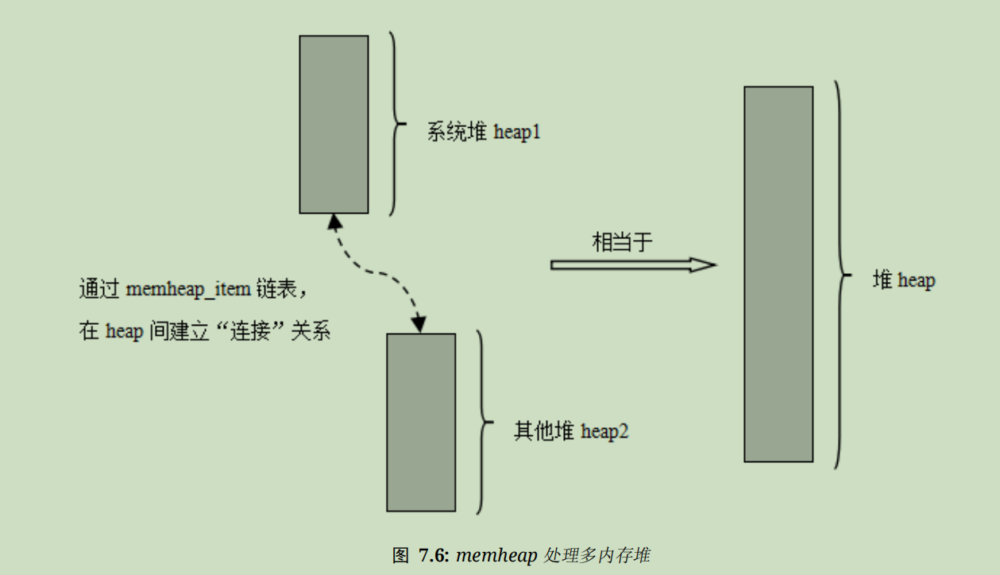
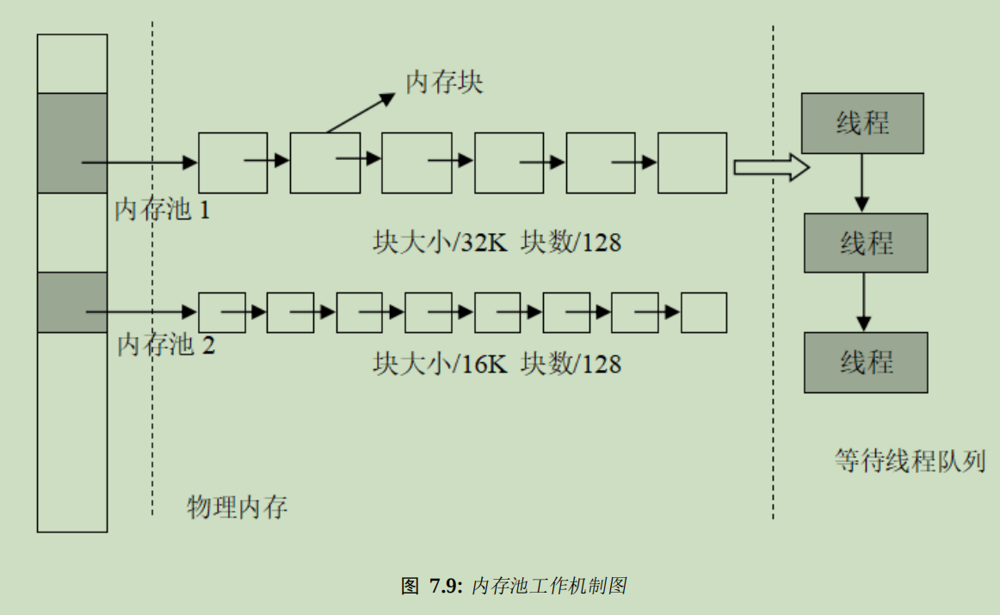

# 内存管理

RTOS对时间的要求非常严格， 内存管理要求具有以下特征：

1. 分配内存的时间确定：RTOS要求内存块的分配过程在可预测的确定时间内完成，否则实时任务对外部事件的响应将不可确定
2. 尽可能不产生内存碎片：通用OS中，申请的内存中一部分被释放了，导致内存空间中存在一些小内存块，它们地址不连续，无法作为一整块的大内存分配出去（类比机械硬盘的磁盘碎片），随着内存区域产生越来越多的碎片，会导致程序不能申请到大容量内存空间，通用OS一般采用数月一次的重启来解决；但RTOS需要在工况下长时间工作，这样的内存碎片累计是不可接受的
3. 能够使用各种嵌入式资源：RTOS所能获取的资源不尽相同，从几十KB的小内存到几百MB甚至1G的内存都可能碰到，甚至需要统一分配片上和片外SRAM、FLASH、EEPROM等资源，需要选择适合它们的高效率内存分配算法

## 【关于内存碎片】

### 进程内存布局

通用操作系统（**以x86架构的实现为例**）的进程内存布局一般从顶（内存线性地址最大）到底（内存地址为0）依次为

**内核空间**：操作系统内核预留的内存，用于满足OS自己的各种内存需求（）

**栈空间（堆栈空间）**：程序的各个段分配在这里，自顶向下生长

**MMAP（内存映射）**：由一个文件到一块内存的映射称为内存映射，用于处理存储在磁盘上的大数据量文件

**堆空间**：剩余内存空间区域，容量较大，自底向上生长

**静态内存空间预留内存**：防止栈空间不够预留给静态变量（自动变量）使用的空间

### 程序堆栈空间分配

一般程序的栈空间被分成：

**神奇数字**：唯一标识该程序属性的一串代码

**堆栈段**：存放函数的局部变量数据（自动变量）

**BSS段（Block Started by Symbol由符号开始的块）**：用于保存没有值的变量，BSS段只保存了这些变量所需内存的大小

**数据段**：存放经过初始化的数据

**文本段**：存放程序指令

特别地，栈顶会被处理器分配一个栈指针sp（stack pointer）

堆栈段的作用如下：

1. 为函数内部声明的局部变量（自动变量）提供存储空间
2. 存储堆栈结构（即 过程活动记录）
3. 用于临时存储（以alloca()函数分配的内存就位于堆栈中）

过程活动记录保存了当前函数的“上下文”（并不等同于线程的上下文）

一般程序可以使用c语言的malloc/free或c++的new/delete等来对堆空间进行申请，这被称为动态内存分配

### 过程活动记录的简介

过程活动记录从顶向下依次分为：

**局部变量保存区、函数参数保存区、静态链接保存区、指向先前结构的指针（一般是函数的回调指针或longjmp()函数的参数等指向之前一个函数过程活动记录的指针）、返回地址（返回函数被调用之前所在指令的地址）**

### 内存碎片

内存碎片分为内部碎片和外部碎片

### 内部碎片 

由于采用固定大小的内存分区，当一个进程不能完全使用分给它的固定内存区域时就产生了内部碎片

通常内部碎片难以完全避免（但RTOS中需要尽可能避免）

### 外部碎片

由于某些未分配的联讯欸村区域太小，以至于==不能满足任意进程的内存分配请求==而产生了不能被进程利用的内存空间

一般使用段页式内存分配方式避免外部碎片

将进程的内存区域分成不同的段，将每一段由多个固定大小的页组成，通过页表机制使 段内的页可以不必连续处于同一内存区域，从而减少外部碎片（然而同一页内仍可能存在少量内部碎片）

这种方法会略微降低操作系统的效率，所以操作系统通常会对其进行大量优化

## RTT的内存管理机制

RTT的内存分配管理算法分为**内存堆管理**和**内存池管理**

其中内存堆管理==根据具体内存设备资源多少==分成：

1. 针对小内存块的分配管理（小内存管理算法）
2. 针对大内存块的分配管理（slab管理算法）
3. 针对多内存堆的分配情况（memheap管理算法）

## 内存堆管理

**内存堆管理用于管理一段连续的内存空间**

RTT的内存分布如下图所示


RTT将“ZI段结尾处”到内存尾部的空间作为内存堆使用

【回顾一下之前介绍的内容】

**Code**:代码段，存放程序的*代码*部分

**RO-data**:只读数据段(Read Only)存放程序中定义的*常量*

**RW-data**:读写数据段(Read&Write)存放初始化为*非0值的全局变量*

**ZI-data**:零数据段(Zero)存放*初始化为0的变量*和*未初始化的全局变量*

**RO段**：包括Code、RO-data，即Read-Only段：常量和代码只读

**RW段**：包括RW-data，即Read-and-Write段——全局变量可读可写

**可执行映像文件**：程序经过编译后生成的bin或hex文件，包括RO段和RW段，它们被存储在FLASH中。ZI-data不包含在映像文件中

stm32上电后默认从FLASH启动，启动后会将RW段的RW-data搬运到RAM中，但不会搬运RO段，另外根据编译器给出的ZI地址和大小分配出ZI段，并将这块RAM区域清零。即**CPU从FLASH读取执行代码，从RAM中读取所需的数据，根据预先规定的ZI地址分配清零的ZI段，剩余RAM空间作为动态内存堆**

==ZI段的分配方式很像x86架构通用计算机的BSS段，它们的作用都是“Better Save Space”（更好的节省空间），可以类比理解==

【结束回顾 : )】

内存堆的用处：在当前资源满足的情况下，根据用户需求分配任意大小的内存块，而当用户不需要在使用这些内存空间时，又可以释放回堆中供其他应用程序分配使用

内存管理算法分为：

1. 小内存管理算法：针对系统资源较少（内存小于2MB）的系统
2. slab内存管理算法：系统资源比较充足的系统可使用，类似于多内存池管理算法
3. memheap管理算法：适用于系统存在多个内存堆的情况，可以将多个内存“粘贴”在一起形成一个大的内存堆，方便用户使用

这**三个内存堆管理算法在系统运行时只能选择其中之一**或完全不使用内存堆管理器

**它们提供给应用程序的API完全相同**

==**注意：内存堆管理器需要满足多线程情况下的安全分配，要考虑多线程之间的互斥问题，不应在中断服务例程中分配或释放动态内存块，否则可能引起当前上下文被挂起等待**==

### 管理算法

#### 小内存管理算法

小内存管理算法较简单：从大内存上划分出与需求大小相匹配的内存块，把剩余的空闲内存块还给堆管理系统；释放时则会查看前后相邻的内存块是否空闲，如果空闲则合并成一个大的空闲内存块

内存块的内部结构如下图所示


每个内存块包含一个数据头和一个内存数据区域，通过数据头把 使用块和空闲块用双向链表链接起来

数据头包括：

1. **magic：神奇数字**（又称变数或幻数），被初始化为英文单词heap的ascii编码**==0x1EA0==**，用于标记这个内存块是一个内存管理用的内存数据块。同时也起到保护内存的作用：如果这个区域被改写也就说明这块内存块被非法改写。正常情况下只有内存管理器才回去碰这块内存
2. **used：当前内存块是否已经分配**
3. next指针和prev指针：构成双向链表的指针域

注意：在每次分配内存块前，都会留出12字节的数据头用于magic、used信息和指针域使用；返回给应用的地址实际上是这块内存块12字节以后的地址，用户不能，至少不应该碰这12字节数据头

#### slab管理算法

RTT的slab分配器建立在DragonFly BSD创始人Matthew Dillon实现的slab分配器基础上。最初的slab算法是Jef Bonwick为Solaris操作系统引入的一种高效内核内存分配算法。

==虽然介绍得很让人不明觉厉但说人话就是“RTT用的是Linux同款内存分配器”==

RTT的slab分配器主要去掉了其中对象构造和析构过程，只保留了纯粹的缓冲型内存池算法。slab分配器会根据对象的大小分成多个区（zone）——也可以看成**每类对象有一个叫zone的内存池**，其结构如下所示


一个zone的大小在32KB到128KB之间（所以说这玩意很明显会把小内存淦爆），分配器会在堆初始化时**根据堆的大小自动调整zone的大小**。系统中的**zone最多包括72种对象，一次最大能够分配16KB的内存空间**，如果超出了16KB那么可以直接从页分配器中分配。每个zone上分配的内存块大小固定，能够分配相同大小内存块的zone会链接在一个链表中。72种对象的zone链表会放在数组zone_arry[]中统一管理

*【注1】DragonFly BSD（DragonFlyBSD） 是一套开放源代码的类Unix操作系统，可以看作是FreeBSD的一分支，从FreeBSD 5系列推出时开始建设*

内存分配算法：向内存分配器发出分配n字节内存的申请，slab内存分配器会按照n字节的值，遍历zonge_arry链表表头数组。如果这个链表是空的，会向页分配器分配一个新的zone然后从zone中返回第一个空闲内存块；如果链表非空，则这个zone链表中的第一个zone节点必然有空闲块存在，返回相应的空闲块。分配完成后，若zone中所有空闲内存块都使用完毕，则分配器把这个zone节点从链表中删除

内存释放算法：向分配器发出释放内存申请，分配器会找到内存块所在的zone节点，把内存块连接到zone的空闲内存块链表中。如果此时zone的空闲链表指示zone的所有内存块都已经释放，说明zone完全空闲，当zone链表中全空闲zone达到一定数目后，系统才会把这个全空闲的zone释放到页面分配器去

#### memheap管理算法

memheap管理器会创建一个memheap_item链表，将所有内存堆通过链表首尾相连

使用了memheap算法的设备在分配内存时，会先从默认内存堆分配；若分配不到，则会查找memheap_item链表，尝试从其他内存堆分配内存块。应用程序将不用关心当前分配的内存块地址



**注意：开启memheap后，原来的heap功能将被关闭，两者只可以通过打开或关闭RT_USING_MEMHEAP_AS_HEAP来选择其中之一**

### 内存堆配置和初始化

1. 在系统初始化时使用rt_system_heap_init()进行堆的初始化，RTT会将begin_addr到end_addr区域中间的内存空间作为内存堆使用

```c
void rt_system_heap_init(void *begin_addr, void *end_addr)
{
    struct heap_mem *mem;
    rt_uint32_t begin_align = RT_ALIGN((rt_uint32_t)begin_addr, RT_ALIGN_SIZE);
    rt_uint32_t end_align = RT_ALIGN_DOWN((rt_uint32_t)end_addr, RT_ALIGN_SIZE);

    RT_DEBUG_NOT_IN_INTERRUPT;

    /* 分配内存堆地址 */
    if ((end_align > (2 * SIZEOF_STRUCT_MEM)) &&
        ((end_align - 2 * SIZEOF_STRUCT_MEM) >= begin_align))
    {
        /* 计算排列的内存大小 */
        mem_size_aligned = end_align - begin_align - 2 * SIZEOF_STRUCT_MEM;
    }
    else
    {
        rt_kprintf("mem init, error begin address 0x%x, and end address 0x%x\n",
                   (rt_uint32_t)begin_addr, (rt_uint32_t)end_addr);
        return;
    }

    /* 堆指针指向堆的起始地址 */
    heap_ptr = (rt_uint8_t *)begin_align;

    RT_DEBUG_LOG(RT_DEBUG_MEM, ("mem init, heap begin address 0x%x, size %d\n",
                                (rt_uint32_t)heap_ptr, mem_size_aligned));

    /* 初始化堆链表头 */
    mem        = (struct heap_mem *)heap_ptr;
    mem->magic = HEAP_MAGIC;
    mem->next  = mem_size_aligned + SIZEOF_STRUCT_MEM;
    mem->prev  = 0;
    mem->used  = 0;
#ifdef RT_USING_MEMTRACE
    rt_mem_setname(mem, "INIT");
#endif
    /* 初始化堆链表头 */
    heap_end        = (struct heap_mem *)&heap_ptr[mem->next];
    heap_end->magic = HEAP_MAGIC;
    heap_end->used  = 1;
    heap_end->next  = mem_size_aligned + SIZEOF_STRUCT_MEM;
    heap_end->prev  = mem_size_aligned + SIZEOF_STRUCT_MEM;
#ifdef RT_USING_MEMTRACE
    rt_mem_setname(heap_end, "INIT");
#endif

    rt_sem_init(&heap_sem, "heap", 1, RT_IPC_FLAG_FIFO);

    /* 初始化堆底指针到堆的开始 */
    lfree = (struct heap_mem *)heap_ptr;
}
```

2. 在系统初始化时使用rt_memheap_init()来初始化memheap堆内存

【注意】**当且仅当开启memheap使用时才能调用**

如果有多个不连续的memheap，可以多次调用该函数将其初始化并将其加入memheap_item链表

```c
rt_err_t rt_memheap_init(struct rt_memheap *memheap,//memheap控制块
                         const char        *name,//内存堆名称
                         void              *start_addr,//堆内存区域起始地址
                         rt_uint32_t        size)//堆内存大小
{
    struct rt_memheap_item *item;

    RT_ASSERT(memheap != RT_NULL);

    /* 初始化内存池对象 */
    rt_object_init(&(memheap->parent), RT_Object_Class_MemHeap, name);

    memheap->start_addr     = start_addr;
    memheap->pool_size      = RT_ALIGN_DOWN(size, RT_ALIGN_SIZE);
    memheap->available_size = memheap->pool_size - (2 * RT_MEMHEAP_SIZE);
    memheap->max_used_size  = memheap->pool_size - memheap->available_size;

    /* 初始化空闲链表头 */
    item            = &(memheap->free_header);
    item->magic     = RT_MEMHEAP_MAGIC;
    item->pool_ptr  = memheap;
    item->next      = RT_NULL;
    item->prev      = RT_NULL;
    item->next_free = item;
    item->prev_free = item;

    /* 将空闲链表链接到空闲链表头 */
    memheap->free_list = item;

    /* 初始化第一个大内存块 */
    item            = (struct rt_memheap_item *)start_addr;
    item->magic     = RT_MEMHEAP_MAGIC;
    item->pool_ptr  = memheap;
    item->next      = RT_NULL;
    item->prev      = RT_NULL;
    item->next_free = item;
    item->prev_free = item;

    item->next = (struct rt_memheap_item *)
                 ((rt_uint8_t *)item + memheap->available_size + RT_MEMHEAP_SIZE);
    item->prev = item->next;

    /* 设置内存块链表头 */
    memheap->block_list = item;

    /* 把大内存块连接到空闲链表上 */
    item->next_free = memheap->free_list->next_free;
    item->prev_free = memheap->free_list;
    memheap->free_list->next_free->prev_free = item;
    memheap->free_list->next_free            = item;

    /* 移动到内存池末尾 并 设置一个小的尾部块以组织块之间互相融合 */
    item = item->next;
    /* 这是一个已使用的内存块 */
    item->magic     = RT_MEMHEAP_MAGIC | RT_MEMHEAP_USED;
    item->pool_ptr  = memheap;
    item->next      = (struct rt_memheap_item *)start_addr;
    item->prev      = (struct rt_memheap_item *)start_addr;
    /* 它不在空闲链表中 */
    item->next_free = item->prev_free = RT_NULL;

    /* 初始化信号量锁 */
    rt_sem_init(&(memheap->lock), name, 1, RT_IPC_FLAG_FIFO);

    RT_DEBUG_LOG(RT_DEBUG_MEMHEAP,
                 ("memory heap: start addr 0x%08x, size %d, free list header 0x%08x\n",
                  start_addr, size, &(memheap->free_header)));

    return RT_EOK;
}
```

### 内存堆的管理方式

#### 分配

使用接口rt_malloc()分配内存，参数单位为字节

```c
void *rt_malloc(rt_size_t size)
{
    rt_size_t ptr, ptr2;
    struct heap_mem *mem, *mem2;

    RT_DEBUG_NOT_IN_INTERRUPT;

    if (size == 0)
        return RT_NULL;

    if (size != RT_ALIGN(size, RT_ALIGN_SIZE))
        RT_DEBUG_LOG(RT_DEBUG_MEM, ("malloc size %d, but align to %d\n",
                                    size, RT_ALIGN(size, RT_ALIGN_SIZE)));
    else
        RT_DEBUG_LOG(RT_DEBUG_MEM, ("malloc size %d\n", size));

    /* alignment size */
    size = RT_ALIGN(size, RT_ALIGN_SIZE);

    if (size > mem_size_aligned)
    {
        RT_DEBUG_LOG(RT_DEBUG_MEM, ("no memory\n"));

        return RT_NULL;
    }

    /* every data block must be at least MIN_SIZE_ALIGNED long */
    if (size < MIN_SIZE_ALIGNED)
        size = MIN_SIZE_ALIGNED;

    /* take memory semaphore */
    rt_sem_take(&heap_sem, RT_WAITING_FOREVER);

    for (ptr = (rt_uint8_t *)lfree - heap_ptr;
         ptr < mem_size_aligned - size;
         ptr = ((struct heap_mem *)&heap_ptr[ptr])->next)
    {
        mem = (struct heap_mem *)&heap_ptr[ptr];

        if ((!mem->used) && (mem->next - (ptr + SIZEOF_STRUCT_MEM)) >= size)
        {
            /* mem is not used and at least perfect fit is possible:
             * mem->next - (ptr + SIZEOF_STRUCT_MEM) gives us the 'user data size' of mem */

            if (mem->next - (ptr + SIZEOF_STRUCT_MEM) >=
                (size + SIZEOF_STRUCT_MEM + MIN_SIZE_ALIGNED))
            {
                /* (in addition to the above, we test if another struct heap_mem (SIZEOF_STRUCT_MEM) containing
                 * at least MIN_SIZE_ALIGNED of data also fits in the 'user data space' of 'mem')
                 * -> split large block, create empty remainder,
                 * remainder must be large enough to contain MIN_SIZE_ALIGNED data: if
                 * mem->next - (ptr + (2*SIZEOF_STRUCT_MEM)) == size,
                 * struct heap_mem would fit in but no data between mem2 and mem2->next
                 * @todo we could leave out MIN_SIZE_ALIGNED. We would create an empty
                 *       region that couldn't hold data, but when mem->next gets freed,
                 *       the 2 regions would be combined, resulting in more free memory
                 */
                ptr2 = ptr + SIZEOF_STRUCT_MEM + size;

                /* create mem2 struct */
                mem2       = (struct heap_mem *)&heap_ptr[ptr2];
                mem2->magic = HEAP_MAGIC;
                mem2->used = 0;
                mem2->next = mem->next;
                mem2->prev = ptr;
#ifdef RT_USING_MEMTRACE
                rt_mem_setname(mem2, "    ");
#endif

                /* and insert it between mem and mem->next */
                mem->next = ptr2;
                mem->used = 1;

                if (mem2->next != mem_size_aligned + SIZEOF_STRUCT_MEM)
                {
                    ((struct heap_mem *)&heap_ptr[mem2->next])->prev = ptr2;
                }
#ifdef RT_MEM_STATS
                used_mem += (size + SIZEOF_STRUCT_MEM);
                if (max_mem < used_mem)
                    max_mem = used_mem;
#endif
            }
            else
            {
                /* (a mem2 struct does no fit into the user data space of mem and mem->next will always
                 * be used at this point: if not we have 2 unused structs in a row, plug_holes should have
                 * take care of this).
                 * -> near fit or excact fit: do not split, no mem2 creation
                 * also can't move mem->next directly behind mem, since mem->next
                 * will always be used at this point!
                 */
                mem->used = 1;
#ifdef RT_MEM_STATS
                used_mem += mem->next - ((rt_uint8_t *)mem - heap_ptr);
                if (max_mem < used_mem)
                    max_mem = used_mem;
#endif
            }
            /* set memory block magic */
            mem->magic = HEAP_MAGIC;
#ifdef RT_USING_MEMTRACE
            if (rt_thread_self())
                rt_mem_setname(mem, rt_thread_self()->name);
            else
                rt_mem_setname(mem, "NONE");
#endif

            if (mem == lfree)
            {
                /* Find next free block after mem and update lowest free pointer */
                while (lfree->used && lfree != heap_end)
                    lfree = (struct heap_mem *)&heap_ptr[lfree->next];

                RT_ASSERT(((lfree == heap_end) || (!lfree->used)));
            }

            rt_sem_release(&heap_sem);
            RT_ASSERT((rt_uint32_t)mem + SIZEOF_STRUCT_MEM + size <= (rt_uint32_t)heap_end);
            RT_ASSERT((rt_uint32_t)((rt_uint8_t *)mem + SIZEOF_STRUCT_MEM) % RT_ALIGN_SIZE == 0);
            RT_ASSERT((((rt_uint32_t)mem) & (RT_ALIGN_SIZE - 1)) == 0);

            RT_DEBUG_LOG(RT_DEBUG_MEM,
                         ("allocate memory at 0x%x, size: %d\n",
                          (rt_uint32_t)((rt_uint8_t *)mem + SIZEOF_STRUCT_MEM),
                          (rt_uint32_t)(mem->next - ((rt_uint8_t *)mem - heap_ptr))));

            RT_OBJECT_HOOK_CALL(rt_malloc_hook,
                                (((void *)((rt_uint8_t *)mem + SIZEOF_STRUCT_MEM)), size));

            /* return the memory data except mem struct */
            return (rt_uint8_t *)mem + SIZEOF_STRUCT_MEM;
        }
    }

    rt_sem_release(&heap_sem);

    return RT_NULL;
}
```

#### 释放

使用接口rt_free()来释放已申请的内存，使用方法同c语言的free()

```c
void rt_free(void *rmem)
{
    struct heap_mem *mem;

    RT_DEBUG_NOT_IN_INTERRUPT;

    if (rmem == RT_NULL)
        return;
    RT_ASSERT((((rt_uint32_t)rmem) & (RT_ALIGN_SIZE - 1)) == 0);
    RT_ASSERT((rt_uint8_t *)rmem >= (rt_uint8_t *)heap_ptr &&
              (rt_uint8_t *)rmem < (rt_uint8_t *)heap_end);

    RT_OBJECT_HOOK_CALL(rt_free_hook, (rmem));

    if ((rt_uint8_t *)rmem < (rt_uint8_t *)heap_ptr ||
        (rt_uint8_t *)rmem >= (rt_uint8_t *)heap_end)
    {
        RT_DEBUG_LOG(RT_DEBUG_MEM, ("illegal memory\n"));

        return;
    }

    /* Get the corresponding struct heap_mem ... */
    mem = (struct heap_mem *)((rt_uint8_t *)rmem - SIZEOF_STRUCT_MEM);

    RT_DEBUG_LOG(RT_DEBUG_MEM,
                 ("release memory 0x%x, size: %d\n",
                  (rt_uint32_t)rmem,
                  (rt_uint32_t)(mem->next - ((rt_uint8_t *)mem - heap_ptr))));


    /* protect the heap from concurrent access */
    rt_sem_take(&heap_sem, RT_WAITING_FOREVER);

    /* ... which has to be in a used state ... */
    if (!mem->used || mem->magic != HEAP_MAGIC)
    {
        rt_kprintf("to free a bad data block:\n");
        rt_kprintf("mem: 0x%08x, used flag: %d, magic code: 0x%04x\n", mem, mem->used, mem->magic);
    }
    RT_ASSERT(mem->used);
    RT_ASSERT(mem->magic == HEAP_MAGIC);
    /* ... and is now unused. */
    mem->used  = 0;
    mem->magic = HEAP_MAGIC;
#ifdef RT_USING_MEMTRACE
    rt_mem_setname(mem, "    ");
#endif

    if (mem < lfree)
    {
        /* the newly freed struct is now the lowest */
        lfree = mem;
    }

#ifdef RT_MEM_STATS
    used_mem -= (mem->next - ((rt_uint8_t *)mem - heap_ptr));
#endif

    /* finally, see if prev or next are free also */
    plug_holes(mem);
    rt_sem_release(&heap_sem);
}
```

#### 重分配

使用rt_realloc()在已分配内存块的基础上增加或减小内存块的大小

在重分配过程中，原来的内存块书据保持不变（缩小的情况下，后面的数据会被自动截断）

```c
void *rt_realloc(void *rmem, rt_size_t newsize)
{
    rt_size_t size;
    rt_size_t ptr, ptr2;
    struct heap_mem *mem, *mem2;
    void *nmem;

    RT_DEBUG_NOT_IN_INTERRUPT;

    /* alignment size */
    newsize = RT_ALIGN(newsize, RT_ALIGN_SIZE);
    if (newsize > mem_size_aligned)
    {
        RT_DEBUG_LOG(RT_DEBUG_MEM, ("realloc: out of memory\n"));

        return RT_NULL;
    }
    else if (newsize == 0)
    {
        rt_free(rmem);
        return RT_NULL;
    }

    /* allocate a new memory block */
    if (rmem == RT_NULL)
        return rt_malloc(newsize);

    rt_sem_take(&heap_sem, RT_WAITING_FOREVER);

    if ((rt_uint8_t *)rmem < (rt_uint8_t *)heap_ptr ||
        (rt_uint8_t *)rmem >= (rt_uint8_t *)heap_end)
    {
        /* illegal memory */
        rt_sem_release(&heap_sem);

        return rmem;
    }

    mem = (struct heap_mem *)((rt_uint8_t *)rmem - SIZEOF_STRUCT_MEM);

    ptr = (rt_uint8_t *)mem - heap_ptr;
    size = mem->next - ptr - SIZEOF_STRUCT_MEM;
    if (size == newsize)
    {
        /* the size is the same as */
        rt_sem_release(&heap_sem);

        return rmem;
    }

    if (newsize + SIZEOF_STRUCT_MEM + MIN_SIZE < size)
    {
        /* split memory block */
#ifdef RT_MEM_STATS
        used_mem -= (size - newsize);
#endif

        ptr2 = ptr + SIZEOF_STRUCT_MEM + newsize;
        mem2 = (struct heap_mem *)&heap_ptr[ptr2];
        mem2->magic = HEAP_MAGIC;
        mem2->used = 0;
        mem2->next = mem->next;
        mem2->prev = ptr;
#ifdef RT_USING_MEMTRACE
        rt_mem_setname(mem2, "    ");
#endif
        mem->next = ptr2;
        if (mem2->next != mem_size_aligned + SIZEOF_STRUCT_MEM)
        {
            ((struct heap_mem *)&heap_ptr[mem2->next])->prev = ptr2;
        }

        plug_holes(mem2);

        rt_sem_release(&heap_sem);

        return rmem;
    }
    rt_sem_release(&heap_sem);

    /* expand memory */
    nmem = rt_malloc(newsize);
    if (nmem != RT_NULL) /* check memory */
    {
        rt_memcpy(nmem, rmem, size < newsize ? size : newsize);
        rt_free(rmem);
    }

    return nmem;
}
```

#### 分配多内存块

使用接口rt_calloc()分配连续内存地址的多个内存块

```c
void *rt_calloc(rt_size_t count, rt_size_t size)
{
    void *p;
    RT_DEBUG_NOT_IN_INTERRUPT;
    /* 申请size*count容量的内存 */
    p = rt_malloc(count * size);
    /* 如果申请到了，则清空内存 */
    if (p)
        rt_memset(p, 0, count * size);
    return p;
}
```

#### 设置内存钩子函数

使用rt_malloc_sethook()来设置分配内存钩子函数，使用接口rt_free_sethook()来设置释放内存钩子函数

```c
void rt_malloc_sethook(void (*hook)(void *ptr, rt_size_t size))
{
    rt_malloc_hook = hook;
}

void rt_free_sethook(void (*hook)(void *ptr))
{
    rt_free_hook = hook;
}
```

钩子函数会在内存分配完成后/内存释放前进行回调，把分配到/待释放的内存块地址和大小作为入口参数传递进钩子函数中去

用于在分配内存后或释放内存前做一些事

## 内存池

内存堆管理器的缺点：分配效率不高（每次分配时都要进行空闲内存块查找）、容易产生内存碎片（fatal！）

可以使用内存池来避免以上问题

**内存池是一种用于分配大量大小相同的小内存块的快速内存分配、释放方式**，它可以尽量避免内存碎片化

RTT的内存池支持线程挂起功能：当内存池中无空闲内存块时，申请线程会被挂起；内存池中有新的可用内存块时，挂起的申请线程会被苏醒。

### 内存池工作机制

#### 内存池控制块

RTT使用内存池控制块管理内存池

内存池控制块中存放内存池的**内存池数据区域开始地址、内存块大小、内存块链表**等内存池信息和**内存块之间连接用的链表结构**和**挂起线程等待事件集合**

代码实现如下：将结构体rt_mempool的指针封装为内存池句柄rt_mp_t

```c
struct rt_mempool
{
    struct rt_object parent;                            /**<继承自内核对象 */

    void            *start_address;                     /**< 内存池开始地址 */
    rt_size_t        size;                              /**< 内存池大小 */

    rt_size_t        block_size;                        /**< 内存块大小 */
    rt_uint8_t      *block_list;                        /**< 内存块链表 */

    rt_size_t        block_total_count;                 /**< 内存块总数 */
    rt_size_t        block_free_count;                  /**< 空闲内存块数 */

    rt_list_t        suspend_thread;                    /**< 这个资源下的挂起线程链表 */
    rt_size_t        suspend_thread_count;              /**< 这个资源下的挂起线程数目 */
};
typedef struct rt_mempool *rt_mp_t;
```

#### 内存块分配机制

1. 内存池创建时向系统申请一大块内存
2. 将这些内存分成**同样大小**的多个小内存块
3. 小内存块通过**空闲链表**进行连接
4. 分配时，从空闲链表中取出链表头的第一个内存块提供给申请者

==物理内存中允许存在多个大小不同的内存池，每个内存池又由多个空闲内存块组成==，如下图所示



每个内存池对象对应一个内存池控制块，也就是说写代码的时候只要创建内存池控制块就能在它的参数范围内实现内存池管理

注意：内存池一旦初始化完成，内部的内存块大小将不能再做调整

当内存池中无可用内存块且申请线程允许等待时，申请线程将挂在suspend_thread链表上

### 内存池管理方式

**不是所有内存池都会被删除，但使用完的内存块都应该被释放！**

**有始有终地对待每一个内存块，没有被漏掉的free()就没有overflow的stack**

#### 创建和删除动态内存池

创建内存池操作会创建一个内存池对象并从堆上分配一个内存池——**创建内存池是从相应内存池中分配和释放内存块的先决条件，创建后线程才能进行申请、释放内存池中内存的操作**

使用接口函数rt_mp_create()创建内存池

系统允许的情况下（内存堆内存资源允许的情况下），这个函数接口才可以创建一个对应的内存池，否则会报错RT_NULL

```c
rt_mp_t rt_mp_create(const char *name,//内存池名
                     rt_size_t   block_count,//内存块数量
                     rt_size_t   block_size)//每个内存块的容量（大小）
{
    rt_uint8_t *block_ptr;
    struct rt_mempool *mp;
    register rt_size_t offset;

    RT_DEBUG_NOT_IN_INTERRUPT;

    /* 分配内核对象及其内存空间 */
    mp = (struct rt_mempool *)rt_object_allocate(RT_Object_Class_MemPool, name);
    /* 如果申请对象失败则返回报错 */
    if (mp == RT_NULL)
        return RT_NULL;

    /* 初始化内存池参数 */
    block_size     = RT_ALIGN(block_size, RT_ALIGN_SIZE);
    mp->block_size = block_size;
    mp->size       = (block_size + sizeof(rt_uint8_t *)) * block_count;

    /* 分配内存 */
    mp->start_address = rt_malloc((block_size + sizeof(rt_uint8_t *)) *
                                  block_count);
    if (mp->start_address == RT_NULL)
    {
        /* 如果没有剩余内存堆空间则将内存池对象删除并返回报错 */
        rt_object_delete(&(mp->parent));
        return RT_NULL;
    }
    mp->block_total_count = block_count;
    mp->block_free_count  = mp->block_total_count;

    /* 初始化等待线程链表 */
    rt_list_init(&(mp->suspend_thread));
    mp->suspend_thread_count = 0;

    /* 初始化空闲内存块链表 */
    block_ptr = (rt_uint8_t *)mp->start_address;
    for (offset = 0; offset < mp->block_total_count; offset ++)
    {
        *(rt_uint8_t **)(block_ptr + offset * (block_size + sizeof(rt_uint8_t *)))
            = block_ptr + (offset + 1) * (block_size + sizeof(rt_uint8_t *));
    }
    *(rt_uint8_t **)(block_ptr + (offset - 1) * (block_size + sizeof(rt_uint8_t *)))
        = RT_NULL;
    mp->block_list = block_ptr;
    return mp;
}
```

使用rt_mp_delete()删除一个内存池：先唤醒所有等待线程，释放已分配的内存池数据存放区域，然后删除内存池对象

```c
rt_err_t rt_mp_delete(rt_mp_t mp)
{
    struct rt_thread *thread;
    register rt_ubase_t temp;
    RT_DEBUG_NOT_IN_INTERRUPT;
    /* 检查参数是否合法 */
    RT_ASSERT(mp != RT_NULL);
    RT_ASSERT(rt_object_get_type(&mp->parent) == RT_Object_Class_MemPool);
    RT_ASSERT(rt_object_is_systemobject(&mp->parent) == RT_FALSE);

    /* 通过遍历等待线程链表 来 唤醒所有挂起的线程 */
    while (!rt_list_isempty(&(mp->suspend_thread)))
    {
        /* 关闭中断 */
        temp = rt_hw_interrupt_disable();
        /* 获得下一个节点 */
        thread = rt_list_entry(mp->suspend_thread.next, struct rt_thread, tlist);
        /* 让挂起线程状态为错误 */
        thread->error = -RT_ERROR;
        /* 唤醒挂起的线程 */
        rt_thread_resume(thread);
        /* 挂起线程数目-1 */
        mp->suspend_thread_count --;
        /* 使能中断 */
        rt_hw_interrupt_enable(temp);
    }
    /* 释放已分配的所有内存空间 */
    rt_free(mp->start_address);
    /* 删除内存池对象 */
    rt_object_delete(&(mp->parent));
    return RT_EOK;
}
```

#### 初始化和脱离静态内存池

静态内存池对象使用的内存空间是由用户指定的一个缓冲区空间，需要用户把缓冲区的指针传递给内存池控制块才能使用内存池，其他操作和创建内存池相同

使用接口函数rt_mp_init()初始化静态内存池

```c
rt_err_t rt_mp_init(struct rt_mempool *mp,//内存池对象
                    const char        *name,//内存池名
                    void              *start,//内存池的起始地址（缓冲区的句柄）
                    rt_size_t          size,//内存池数据区域的大小
                    rt_size_t          block_size)//内存块的大小
{
    rt_uint8_t *block_ptr;
    register rt_size_t offset;
    /* 检查参数是否合法 */
    RT_ASSERT(mp != RT_NULL);
    
    /* 初始化内存池对象 */
    rt_object_init(&(mp->parent), RT_Object_Class_MemPool, name);
    /* 初始化内存池参数 */
    mp->start_address = start;
    mp->size = RT_ALIGN_DOWN(size, RT_ALIGN_SIZE);
    /* 排列内存块大小 */
    block_size = RT_ALIGN(block_size, RT_ALIGN_SIZE);
    mp->block_size = block_size;
    /* 计算内存块参数 */
    mp->block_total_count = mp->size / (mp->block_size + sizeof(rt_uint8_t *));
    mp->block_free_count  = mp->block_total_count;
    /* 初始化等待线程链表 */
    rt_list_init(&(mp->suspend_thread));
    mp->suspend_thread_count = 0;
    /* 初始化空闲内存链表 */
    block_ptr = (rt_uint8_t *)mp->start_address;
    for (offset = 0; offset < mp->block_total_count; offset ++)
    {
        *(rt_uint8_t **)(block_ptr + offset * (block_size + sizeof(rt_uint8_t *))) =
            (rt_uint8_t *)(block_ptr + (offset + 1) * (block_size + sizeof(rt_uint8_t *)));
    }
    *(rt_uint8_t **)(block_ptr + (offset - 1) * (block_size + sizeof(rt_uint8_t *))) =
        RT_NULL;
    
    mp->block_list = block_ptr;
    return RT_EOK;
}
```

计算公式如下：

内存池中内存块个数n

链表指针大小p

内存池数据区总大小S

内存块大小s

$$n=\lvert [ \frac{S}{s+4p} ] \rvert$$

使用接口函数rt_mp_detach()将内存池对象从内核对象管理器中脱离

```c
rt_err_t rt_mp_detach(struct rt_mempool *mp)
{
    struct rt_thread *thread;
    register rt_ubase_t temp;
    /* 检查参数是否合法 */
    RT_ASSERT(mp != RT_NULL);
    RT_ASSERT(rt_object_get_type(&mp->parent) == RT_Object_Class_MemPool);
    RT_ASSERT(rt_object_is_systemobject(&mp->parent));

    /* 唤醒所有等待线程 */
    while (!rt_list_isempty(&(mp->suspend_thread)))
    {
        /* 关闭中断 */
        temp = rt_hw_interrupt_disable();
        /* 获得下一个等待线程 */
        thread = rt_list_entry(mp->suspend_thread.next, struct rt_thread, tlist);
        /* 设置所有线程的错误码为-RT_ERROR */
        thread->error = -RT_ERROR;
		/* 唤醒线程 */
        rt_thread_resume(thread);
        /* 挂起线程数目-1 */
        mp->suspend_thread_count --;
        /* 使能中断 */
        rt_hw_interrupt_enable(temp);
    }
    /* 脱离内存池对象 */
    rt_object_detach(&(mp->parent));
    return RT_EOK;
}
```

#### 分配内存块

使用接口rt_mp_alloc()从指定的内存池中分配一个内存块

其中time参数表示申请分配内存块的超时时间——如果内存池中有可用内存块，则从内存池的空闲块链表上取下一个内存块，减少空闲块数目并返回这个内存块；若无空闲内存块，则判断超时时间设置，对线程进行挂起等待或立刻返回

```c
void *rt_mp_alloc(rt_mp_t mp, rt_int32_t time)
{
    rt_uint8_t *block_ptr;
    register rt_base_t level;
    struct rt_thread *thread;
    rt_uint32_t before_sleep = 0;

    /* 获取当前线程 */
    thread = rt_thread_self();
    
    /* 关闭中断 */
    level = rt_hw_interrupt_disable();
    while (mp->block_free_count == 0)
    {
        /* 没有可用内存块 */
        if (time == 0)
        {
            /* 使能中断 */
            rt_hw_interrupt_enable(level);
            rt_set_errno(-RT_ETIMEOUT);//设置返回报错
            return RT_NULL;
        }
        RT_DEBUG_NOT_IN_INTERRUPT;
        thread->error = RT_EOK;

        /* 需要挂起的线程 */
        rt_thread_suspend(thread);
        rt_list_insert_after(&(mp->suspend_thread), &(thread->tlist));
        mp->suspend_thread_count++;

        if (time > 0)
        {
            /* 获取定时器时间 */
            before_sleep = rt_tick_get();
            /* 初始化线程定时器并启动定时器 */
            rt_timer_control(&(thread->thread_timer),
                             RT_TIMER_CTRL_SET_TIME,
                             &time);
            rt_timer_start(&(thread->thread_timer));
        }
        /* 使能中断 */
        rt_hw_interrupt_enable(level);

        /* 按原安排进行调度 */
        rt_schedule();

        if (thread->error != RT_EOK)//如果线程报错则内存申请不成功
            return RT_NULL;
        if (time > 0)//如果有超时设定
        {
            time -= rt_tick_get() - before_sleep;
            if (time < 0)
                time = 0;//超时
        }
        /* 关闭中断 */
        level = rt_hw_interrupt_disable();
    }

    /* 有可用内存块，空闲内存块数目-1 */
    mp->block_free_count--;
    /* 从空闲内存链表中获取内存块 */
    block_ptr = mp->block_list;
    RT_ASSERT(block_ptr != RT_NULL);
    /* 将内存块链表的指针指向下一个内存块 */
    mp->block_list = *(rt_uint8_t **)block_ptr;
    /* 设置内存池指针 */
    *(rt_uint8_t **)block_ptr = (rt_uint8_t *)mp;
    /* 使能中断 */
    rt_hw_interrupt_enable(level);

    RT_OBJECT_HOOK_CALL(rt_mp_alloc_hook,
                        (mp, (rt_uint8_t *)(block_ptr + sizeof(rt_uint8_t *))));//调用钩子函数

    return (rt_uint8_t *)(block_ptr + sizeof(rt_uint8_t *));//返回获取到的内存块指针
}
```

#### 释放内存块

任何内存块使用完后都必须被释放，否则会造成内存泄露

使用接口rt_mp_free()释放内存块

```c
void rt_mp_free(void *block)
{
    rt_uint8_t **block_ptr;
    struct rt_mempool *mp;
    struct rt_thread *thread;
    register rt_base_t level;

    /* 获取该内存块所属的内存池对象 */
    block_ptr = (rt_uint8_t **)((rt_uint8_t *)block - sizeof(rt_uint8_t *));
    mp        = (struct rt_mempool *)*block_ptr;

    RT_OBJECT_HOOK_CALL(rt_mp_free_hook, (mp, block));//调用钩子函数

    /* 关闭中断 */
    level = rt_hw_interrupt_disable();
    /* 增加内存池对象的可用内存块数目 */
    mp->block_free_count ++;
    /* 把内存块加入到空闲内存块链表上 */
    *block_ptr = mp->block_list;
    mp->block_list = (rt_uint8_t *)block_ptr;

    if (mp->suspend_thread_count > 0)//如果该内存池对象上有等待的线程
    {
        /* 获取挂起的线程 */
        thread = rt_list_entry(mp->suspend_thread.next,
                               struct rt_thread,
                               tlist);

        /* 设置线程状态正常 */
        thread->error = RT_EOK;
        /* 唤醒线程 */
        rt_thread_resume(thread);
        /* 挂起线程数目-1 */
        mp->suspend_thread_count --;
        /* 使能中断 */
        rt_hw_interrupt_enable(level);
        /* 按原顺序执行调度 */
        rt_schedule();
        return;
    }
    /* 使能中断 */
    rt_hw_interrupt_enable(level);
}
```

### 内存池的应用场景

适用于需要通过内存资源进行同步的场景，如：音乐播放器中的播放解码线程和声卡驱动线程之间进行同步