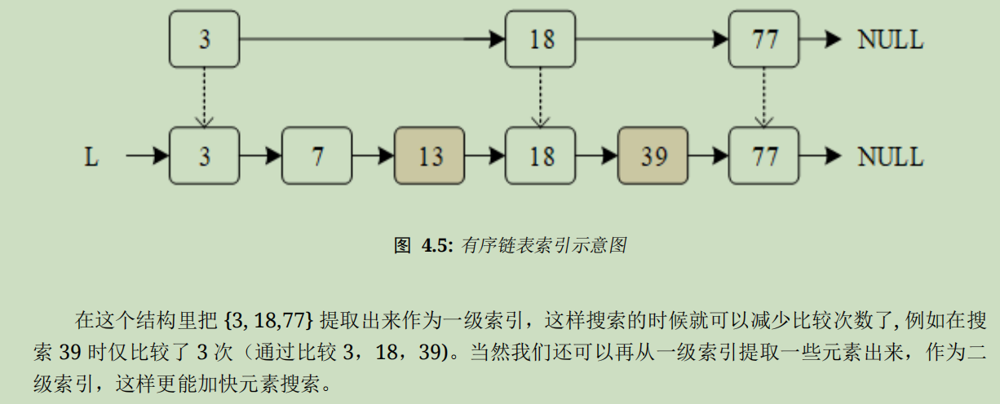
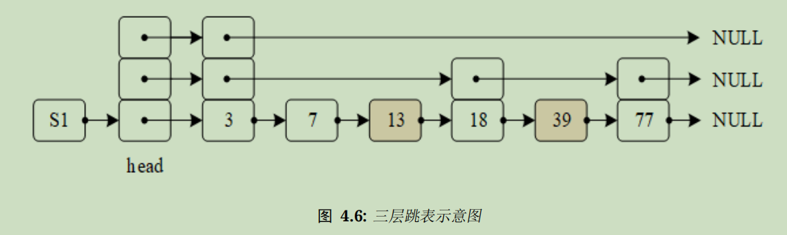

# 时钟

操作系统中最小时间单位是时钟节拍

时钟节拍可以让系统处理包括但不仅限于：线程延时、线程时间片轮转调度、定时器超时等事件

# 时钟节拍

时钟节拍(OS Tick)是**特定的周期性中断**，可以看作是**系统心跳**

中断之间的时间间隔取决于不同的应用，**一般是1ms-100ms**

注意：时钟节拍率越快，系统的额外开销（耗电量）越大

**系统时间：从系统启动开始计数的时钟节拍**

==**RTT中时钟节拍的长度可以根据RT_TICK_PER_SECOND的定义来调整**==

公式：$$T=\frac{1}{RT\_TICK\_PER\_SECOND}$$	单位：秒(s)

时钟节拍使内核可以将线程延时若干个整数时钟节拍并在线程等待事件发生时提供等待超时的依据

频率越快，内核函数介入系统运行的几率越大，内核占用的处理器时间越长，系统的符合就变大；频率越小，时间处理的精度又不够

==**在stm32上一般设置系统时钟节拍频率为100Hz，即每个滴答的时间是10ms**==

## 时钟节拍的实现

==时钟节拍由**配置为中断触发模式的硬件定时器**产生，当中断到来时，将调用一次void rt_tick_increase(void)函数，通知操作系统已经过去一个系统时钟，不同硬件定时器中断实现都不同==

stm32定时器的实现如下：

```c
void SystemClock_Config(void)
{
    RCC_OscInitTypeDef RCC_OscInitStruct;
    RCC_ClkInitTypeDef RCC_ClkInitStruct;
    /**Initializes the CPU, AHB and APB busses clocks
      */
    RCC_OscInitStruct.OscillatorType = RCC_OSCILLATORTYPE_HSE;
    RCC_OscInitStruct.HSEState = RCC_HSE_ON;
    RCC_OscInitStruct.HSEPredivValue = RCC_HSE_PREDIV_DIV1;
    RCC_OscInitStruct.HSIState = RCC_HSI_ON;
    RCC_OscInitStruct.PLL.PLLState = RCC_PLL_ON;
    RCC_OscInitStruct.PLL.PLLSource = RCC_PLLSOURCE_HSE;
    RCC_OscInitStruct.PLL.PLLMUL = RCC_PLL_MUL9;
    RT_ASSERT(HAL_RCC_OscConfig(&RCC_OscInitStruct) == HAL_OK);
    /**Initializes the CPU, AHB and APB busses clocks
      */
    RCC_ClkInitStruct.ClockType = RCC_CLOCKTYPE_HCLK | RCC_CLOCKTYPE_SYSCLK | RCC_CLOCKTYPE_PCLK1 | RCC_CLOCKTYPE_PCLK2;
    RCC_ClkInitStruct.SYSCLKSource = RCC_SYSCLKSOURCE_PLLCLK;
    RCC_ClkInitStruct.AHBCLKDivider = RCC_SYSCLK_DIV1;
    RCC_ClkInitStruct.APB1CLKDivider = RCC_HCLK_DIV2;
    RCC_ClkInitStruct.APB2CLKDivider = RCC_HCLK_DIV1;
    RT_ASSERT(HAL_RCC_ClockConfig(&RCC_ClkInitStruct, FLASH_LATENCY_2) == HAL_OK);
    /**配置Systick分频
      */
    HAL_SYSTICK_Config(HAL_RCC_GetHCLKFreq() / RT_TICK_PER_SECOND);
    /**配置Systick时钟源
      */
    HAL_SYSTICK_CLKSourceConfig(SYSTICK_CLKSOURCE_HCLK);
    /* 配置Systick中断 */
    HAL_NVIC_SetPriority(SysTick_IRQn, 15, 0);
}
```


利用arm核的systick定时器中断驱动系统时钟，系统时钟自增时检查定时器时钟

```c
void SysTick_Handler(void)
{
    /* 进入中断 */
    rt_interrupt_enter();
    HAL_IncTick();//调用HAL库函数
    rt_tick_increase();//系统时钟++
    /* 退出中断 */
    rt_interrupt_leave();
}

void rt_tick_increase(void)
{
    struct rt_thread *thread;

    /* 全局变量rt_tick++ */
    ++ rt_tick;

    /* 检查时间片是否用完 */
    thread = rt_thread_self();

    -- thread->remaining_tick;//剩余时间--
    if (thread->remaining_tick == 0)//如果剩余时间为0
    {
        /* 重新赋初值 */
        thread->remaining_tick = thread->init_tick;

        /* 挂起线程 */
        rt_thread_yield();
    }

    /* 检查定时器是否超时 */
    rt_timer_check();
}
```

rt_tick的值表示系统从启动开始总共经过的时钟节拍数，即**系统时间**

rt_timer_check()用于检查系统**硬件定时器链表**，如果有定时器超时将调用相应的超时函数，且**==所有==定时器超时后都会从定时器链表中被移除**，特别地，**周期性定时器会在它重启时被加入定时器链表**

## 获取时钟节拍

使用rt_tick_get获取当前rt_tick的值，即 当前的时钟节拍值

此接口可用于记录系统运行时间或测量某任务运行的时间

```c
rt_tick_t rt_tick_get(void)
{
    /* 返回当前时钟节拍值 */
    return rt_tick;
}
```

# 定时器

定时器：从指定的时刻开始，经过指定时间后触发一个事件

1. 硬件定时器：MCU本身提供的物理定时器，精度较高，一般以中断触发，也能连接其他外设输出特定信号
2. 软件定时器：操作系统提供的系统接口，构建在硬件定时器基础上，使系统能提供**不限数目**的定时器服务

RTT软件定时器基于OS TIck提供，它的定时数值必须是OS Tick的整数倍

## 定时器基本类型和工作模式

1. 单次触发定时器

启动后只触发一次定时器事件，然后定时器自动停止

2. 周期触发定时器

周期性触发定时器事件，直到用户停止，否则将永远持续执行

3. HARD_TIMER模式（**RTT定时器默认模式**）

定时器超时函数在中断上下文环境（**默认为系统时钟中断上下文环境**）中执行

HARD_TIMER模式下超时函数的要求与中断服务函数的要求相同：==执行时间尽量短、执行时不应导致当前上下文挂起或等待，不应在超时函数中申请或释放动态内存等==

人话：系统时钟中断时运行中断服务函数

4. SOFT_TIMER

可通过宏定义RT_USING_TIMER_SOFT控制是否启用SOFT_TIMER模式

该模式被启用后，系统在初始化时创建一个timer线程，然后SOFT_TIMER模式的定时器超时函数会在timer线程的上下文环境中执行

人话：创建一个中断服务函数的线程，有定时器中断时跳到中断服务函数的线程运行

初始化/创建定时器时，使用参数RT_TIMER_FLAG_HARD_TIMER和RT_TIMER_FLAG_SOFT_TIMER来确定使用哪种模式

## 定时器工作方式

### 两个重要全局变量

系统时间rt_tick：当硬件定时器中断来临时，自增1

定时器链表rt_timer_list：系统新创建并激活的定时器会**按照超时时间排序**插入到此链表

### 定时器控制块

定时器控制块是操作系统用于管理定时器的数据结构

如下所示：

```c
struct rt_timer
{
    struct rt_object parent;                            /**< 继承内核对象的属性 */

    rt_list_t        row[RT_TIMER_SKIP_LIST_LEVEL];//定时器链表节点

    void (*timeout_func)(void *parameter);              /**< 定时器超时调用的函数(定时器中断服务函数) */
    void            *parameter;                         /**< 超时函数的参数 */

    rt_tick_t        init_tick;                         /**< 定时器初始超时节拍数 */
    rt_tick_t        timeout_tick;                      /**< 定时器实际超时节拍数 */
};
typedef struct rt_timer *rt_timer_t;//定时器内核对象 继承自内核对象控制块

//内核控制块
struct rt_object
{
    char name[RT_NAME_MAX];//内核对象名称
    rt_uint8_t type;//内核对象类型
    rt_uint8_t flag;//内核对象参数

#ifdef RT_USING_MODULE
    void *module_id;//应用模块的id
#endif
    
    rt_list_t list;//内核对象管理链表
};
typedef struct rt_object *rt_object_t;//将内核对象指针封装成“内核对象类”
```

定时器控制块被封装为struct rt_timer，再形成定时器内核对象rt_timer_t，链接到内核对象容器中进行管理（继承来的list成员可以将其加入内核对象容器链表）

调用list成员可以把一个激活（已启动）的定时器链接到rt_timer_list链表中

### 定时器跳表(Skip List)算法

系统新创建并激活的定时器都会按照以超时时间排序的方式插入rt_timer_list链表中，即 **rt_timer_list**是一个有序链表，可以使用跳表算法来加快查找链表元素的速度

**跳表：一种基于并联链表的数据结构，在链表基础上增加了“跳跃”功能**，实现插入、删除、查找的时间复杂度均为O(log n)

跳表算法采用类似二叉搜索树的方式：从有序链表中提出一些节点形成新的链表，这个链表作为对原链表的索引






定时器调表从最上层索引开始，依次判断，如果满足条件，则进入下一层索引，依次跳转直到找到最底层的原始链表，减少比较次数、提升查找效率，换句话说，这是一种“空间换时间”的算法

在RTT中通过宏定义RT_TIMER_SKIP_LIST_LEVEL来配置调表层数，默认为1，每增加1，表示在原链表基础上增加1级索引

## 定时器管理

### 定时器管理系统初始化

系统启动时初始化定时器管理系统，接口如下：

```c
void rt_system_timer_init(void)
{
    int i;

    for (i = 0; i < sizeof(rt_timer_list) / sizeof(rt_timer_list[0]); i++)
    {
        rt_list_init(rt_timer_list + i);//初始化链表中第i项定时器
    }
}
```

如果需要使用SOFT_TIMER，还应调用以下函数接口：

```c
void rt_system_timer_thread_init(void)
{
#ifdef RT_USING_TIMER_SOFT
    int i;

    for (i = 0;
         i < sizeof(rt_soft_timer_list) / sizeof(rt_soft_timer_list[0]);//定时器链表中的项数
         i++)
    {
        rt_list_init(rt_soft_timer_list + i);//初始化链表中的第i项定时器
    }

    /* 初始化soft_timer线程 */
    rt_thread_init(&timer_thread,
                   "timer",
                   rt_thread_timer_entry,
                   RT_NULL,
                   &timer_thread_stack[0],
                   sizeof(timer_thread_stack),
                   RT_TIMER_THREAD_PRIO,
                   10);

    /* 线程启动 */
    rt_thread_startup(&timer_thread);
#endif
}
```

### 创建动态定时器

动态创建定时器 rt_timer_create

```c
rt_timer_t rt_timer_create(const char *name,//定时器名称
                           void (*timeout)(void *parameter),//超时函数指针
                           void       *parameter,//超时函数入口参数
                           rt_tick_t   time,//超时时间，单位：时钟节拍
                           rt_uint8_t  flag)//定时器创建时的参数，可用|"或"关系取多个值
{
    struct rt_timer *timer;

    /* 从动态内存堆分配定时器控制块 */
    timer = (struct rt_timer *)rt_object_allocate(RT_Object_Class_Timer, name);
    if (timer == RT_NULL)
    {
        return RT_NULL;
    }
    _rt_timer_init(timer, timeout, parameter, time, flag);//定时器控制块初始化

    return timer;
}

//可用的参数如下
#define RT_TIMER_FLAG_ONE_SHOT          0x0//单次触发定时器
#define RT_TIMER_FLAG_PERIODIC          0x2//周期触发定时器

#define RT_TIMER_FLAG_HARD_TIMER        0x0//HARD_TIMER模式
#define RT_TIMER_FLAG_SOFT_TIMER        0x4//SOFT_TIMER模式
```

### 删除动态定时器

当系统不再使用动态定时器时，可使用rt_timer_delete()删除定时器

```c
rt_err_t rt_timer_delete(rt_timer_t timer)
{
    register rt_base_t level;

    /* 检查定时器是否合法 */
    RT_ASSERT(timer != RT_NULL);
    RT_ASSERT(rt_object_get_type(&timer->parent) == RT_Object_Class_Timer);
    RT_ASSERT(rt_object_is_systemobject(&timer->parent) == RT_FALSE);

    /* 关闭中断 */
    level = rt_hw_interrupt_disable();
    _rt_timer_remove(timer);//将定时器从rt_timer_list链表中删除
    /* 使能中断 */
    rt_hw_interrupt_enable(level);

    rt_object_delete((rt_object_t)timer);//删除定时器内核对象并释放内存

    return RT_EOK;
}
```

### 静态定时器初始化

使用rt_timer_init()进行定时器初始化

```c
void rt_timer_init(rt_timer_t  timer,//定时器句柄，指向要初始化的定时器控制块
                   const char *name,//定时器名称
                   void (*timeout)(void *parameter),//超时函数
                   void       *parameter,//超时函数入口参数
                   rt_tick_t   time,//超时时间
                   rt_uint8_t  flag)//定时器创建时的参数
{
    /* 检查定时器是否合法 */
    RT_ASSERT(timer != RT_NULL);

    /* 定时器对象初始化 */
    rt_object_init((rt_object_t)timer, RT_Object_Class_Timer, name);

    /* 定时器初始化 */
    _rt_timer_init(timer, timeout, parameter, time, flag);
}

static void _rt_timer_init(rt_timer_t timer,
                           void (*timeout)(void *parameter),
                           void      *parameter,
                           rt_tick_t  time,
                           rt_uint8_t flag)
{
    int i;
	
    //设置定时器相关参数
    timer->parent.flag=flag;
    timer->parent.flag&=~RT_TIMER_FLAG_ACTIVATED;
    timer->timeout_func=timeout;
    timer->parameter=parameter;
    timer->timeout_tick=0;
    timer->init_tick=time;
    /* 初始化定时器链表 */
    for (i = 0; i < RT_TIMER_SKIP_LIST_LEVEL; i++)
    {
        rt_list_init(&(timer->row[i]));
    }
}
```

### 静态定时器脱离

使用rt_timer_detach()接口脱离（删除）不再使用的静态定时器

```c
rt_err_t rt_timer_detach(rt_timer_t timer)
{
    register rt_base_t level;

    /* 检查定时器是否合法 */
    RT_ASSERT(timer != RT_NULL);
    RT_ASSERT(rt_object_get_type(&timer->parent) == RT_Object_Class_Timer);
    RT_ASSERT(rt_object_is_systemobject(&timer->parent));

    /* 关闭中断 */
    level = rt_hw_interrupt_disable();
    _rt_timer_remove(timer);//从链表中移除定时器(具体实现同链表遍历)
    /* 使能中断 */
    rt_hw_interrupt_enable(level);

    rt_object_detach((rt_object_t)timer);//脱离定时器内核对象并释放内存

    return RT_EOK;
}
```

### 启动定时器

定时器被创建或初始化后，并不会被立刻启动，必须在调用启动定时器函数接口后才开始工作（定时器状态改为激活状态RT_TIMER_FLAG_ACTIVATED）

```c
rt_err_t rt_timer_start(rt_timer_t timer)
{
    unsigned int row_lvl;
    rt_list_t *timer_list;
    register rt_base_t level;
    rt_list_t *row_head[RT_TIMER_SKIP_LIST_LEVEL];
    unsigned int tst_nr;
    static unsigned int random_nr;

    /* 检查是否合法 */
    RT_ASSERT(timer != RT_NULL);
    RT_ASSERT(rt_object_get_type(&timer->parent) == RT_Object_Class_Timer);

    /* 关闭中断 并 暂停定时器 */
    level = rt_hw_interrupt_disable();
    /* 从链表中移除定时器 */
    _rt_timer_remove(timer);
    /* 改变定时器状态为已激活 */
    timer->parent.flag &= ~RT_TIMER_FLAG_ACTIVATED;
    /* 使能中断 */
    rt_hw_interrupt_enable(level);

    RT_OBJECT_HOOK_CALL(rt_object_take_hook, (&(timer->parent)));//调用钩子函数

    /*
     * 获取超时时间,
     * 最大超时时间不应大于RT_TICK_MAX/2
     */
    RT_ASSERT(timer->init_tick < RT_TICK_MAX / 2);//检查超时时间是否合法
    timer->timeout_tick = rt_tick_get() + timer->init_tick;//计算实际超时时间

    /* 关闭中断 */
    level = rt_hw_interrupt_disable();
#ifdef RT_USING_TIMER_SOFT
    if (timer->parent.flag & RT_TIMER_FLAG_SOFT_TIMER)//如果开启了SOFT_TIMER模式
    {
        /* 将定时器插入soft_timer链表 */
        timer_list = rt_soft_timer_list;
    }
    else//否则
#endif
    {
        /* 将定时器插入系统定时器链表 */
        timer_list = rt_timer_list;
    }

    row_head[0]  = &timer_list[0];//设置表头地址
    
    /* 按超时顺序插入到rt_timer_list链表中 */
    for (row_lvl = 0; row_lvl < RT_TIMER_SKIP_LIST_LEVEL; row_lvl++)//从索引开始遍历
    {
        for (; row_head[row_lvl] != timer_list[row_lvl].prev;//遍历当前层的项
             row_head[row_lvl]  = row_head[row_lvl]->next)
        {
            struct rt_timer *t;
            rt_list_t *p = row_head[row_lvl]->next;

            /* 校准入口指针 */
            t = rt_list_entry(p, struct rt_timer, row[row_lvl]);

            /* 
             * 如果同时存在两个同时超时的定时器，较早插入链表的定时器将被更早触发
             * 所以将新加入的定时器插入到已经触发过的定时器的末尾
             */
            if ((t->timeout_tick - timer->timeout_tick) == 0)
            {
                continue;
            }
            else if ((t->timeout_tick - timer->timeout_tick) < RT_TICK_MAX / 2)
            {
                break;
            }
        }
        
        if (row_lvl != RT_TIMER_SKIP_LIST_LEVEL - 1)
            row_head[row_lvl + 1] = row_head[row_lvl] + 1;
    }

    /* Interestingly, this super simple timer insert counter works very very
     * well on distributing the list height uniformly. By means of "very very
     * well", I mean it beats the randomness of timer->timeout_tick very easily
     * (actually, the timeout_tick is not random and easy to be attacked). */
    random_nr++;
    tst_nr = random_nr;

    rt_list_insert_after(row_head[RT_TIMER_SKIP_LIST_LEVEL - 1],
                         &(timer->row[RT_TIMER_SKIP_LIST_LEVEL - 1]));
    for (row_lvl = 2; row_lvl <= RT_TIMER_SKIP_LIST_LEVEL; row_lvl++)
    {
        if (!(tst_nr & RT_TIMER_SKIP_LIST_MASK))
            rt_list_insert_after(row_head[RT_TIMER_SKIP_LIST_LEVEL - row_lvl],
                                 &(timer->row[RT_TIMER_SKIP_LIST_LEVEL - row_lvl]));
        else
            break;
        /* Shift over the bits we have tested. Works well with 1 bit and 2
         * bits. */
        tst_nr >>= (RT_TIMER_SKIP_LIST_MASK + 1) >> 1;
    }

    timer->parent.flag |= RT_TIMER_FLAG_ACTIVATED;//激活内核容器对象

    /* 使能中断 */
    rt_hw_interrupt_enable(level);

#ifdef RT_USING_TIMER_SOFT
    if (timer->parent.flag & RT_TIMER_FLAG_SOFT_TIMER)
    {
        /* 检查定时器线程是否已经启动完毕 */
        if ((timer_thread.stat & RT_THREAD_STAT_MASK) != RT_THREAD_READY)
        {
            /* 暂停定时器线程来等待定时器工作 */
            rt_thread_resume(&timer_thread);
            rt_schedule();
        }
    }
#endif

    return RT_EOK;
}
```

### 停止定时器

使用rt_timer_stop()接口停止定时器

定时器状态将更改为停止状态(未激活)，并从rt_timer_list链表中脱离不参与定时器超时检查

当一个周期性定时器超时时，也可以调用此接口来停止这个定时器

```c
rt_err_t rt_timer_stop(rt_timer_t timer)
{
    register rt_base_t level;

    /* 检查定时器是否合法 */
    RT_ASSERT(timer != RT_NULL);
    RT_ASSERT(rt_object_get_type(&timer->parent) == RT_Object_Class_Timer);

    if (!(timer->parent.flag & RT_TIMER_FLAG_ACTIVATED))//如果定时器对应的内核容器为未激活状态则出错
        return -RT_ERROR;

    RT_OBJECT_HOOK_CALL(rt_object_put_hook, (&(timer->parent)));//调用相关钩子函数

    /* 关闭中断 */
    level = rt_hw_interrupt_disable();
    _rt_timer_remove(timer);//将定时器从定时器链表中移除
    /* 使能中断 */
    rt_hw_interrupt_enable(level);

    /* 改变定时器状态为未激活 */
    timer->parent.flag &= ~RT_TIMER_FLAG_ACTIVATED;

    return RT_EOK;
}
```

### 定时器控制函数接口

```c
rt_err_t rt_timer_control(rt_timer_t timer, int cmd, void *arg)
{
    /* 检查定时器是否合法*/
    RT_ASSERT(timer != RT_NULL);
    RT_ASSERT(rt_object_get_type(&timer->parent) == RT_Object_Class_Timer);

    switch (cmd)//判断命令
    {
    case RT_TIMER_CTRL_GET_TIME:
        *(rt_tick_t *)arg = timer->init_tick;
        break;

    case RT_TIMER_CTRL_SET_TIME:
        timer->init_tick = *(rt_tick_t *)arg;
        break;

    case RT_TIMER_CTRL_SET_ONESHOT:
        timer->parent.flag &= ~RT_TIMER_FLAG_PERIODIC;
        break;

    case RT_TIMER_CTRL_SET_PERIODIC:
        timer->parent.flag |= RT_TIMER_FLAG_PERIODIC;
        break;
    }

    return RT_EOK;
}

//支持的命令如下
#define RT_TIMER_CTRL_SET_TIME          0x0             /**< 设置定时器超时时间 */
#define RT_TIMER_CTRL_GET_TIME          0x1             /**< 获得定时器超时时间 */
#define RT_TIMER_CTRL_SET_ONESHOT       0x2             /**< 将定时器改为单次触发定时器 */
#define RT_TIMER_CTRL_SET_PERIODIC      0x3             /**< 将定时器改为周期触发定时器 */
```

# RTT的硬件定时器调用

RTT软件定时器的最小精度是由系统时钟节拍决定的，导致当需要实现更短时间长度的时间定时时，操作系统定时器难以满足要求

这时候需要读取系统某个硬件定时器的计数器或直接使用硬件定时器进行定时

对于stm32或者说Cortex-M系列ARM核，**Systick的中断**被用于OS Tick，所以可以在系统使能Systick后，**直接使用SysTick**作为更精确的时钟源获得更精确的延时函数

官方例程如下：

```c
#include <board.h>

void rt_hw_us_delay(rt_uint32_t us)
{
    rt_uint32 delta;
    
    us=us*(SysTick->LOAD/(1000000/RT_TOCK_PER_SECOND));//获得延时经过的tick数
    delta=SysTick->VAL;//获得当前时间
    while(delta - SysTick->VAL < us);//循环直到达到指定的时间
}
```

（其实就是HAL库的延时函数套皮）

入口参数us的单位是微秒(us)，这个函数只能支持低于1 OS Tick的延时，否则SysTick会出现溢出导致不能获得指定的延时时间