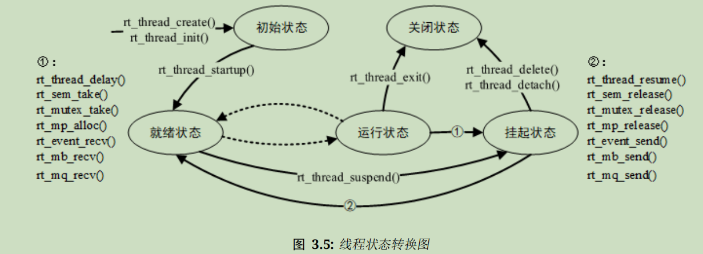

# 线程管理

划分线程的思想：将一个大任务分解成多个小任务

==**线程是实现任务的载体，是RTT的最基本调度单位，描述了一个任务执行的运行环境和优先等级**==

**线程在运行时会认为自己是以独占CPU的方式运行**

**上下文：线程执行时的运行环境，即包括所有寄存器变量、堆栈、内存信息在内的各个变量和数据**

## 功能特点

主要功能：对线程进行管理和调度

将所有线程分为**系统线程**和**用户线程**

系统线程：由RTT内核创建的线程

用户线程：由应用程序创建的线程

线程从内核对象容器中分配线程对象，当线程被删除时也会被从对象容器中删除

RTT线程调度器为**抢占式**：从就绪线程列表中查找最高优先级线程，保证它能够被运行，最高优先级任务一旦就绪，**总**能得到CPU的使用权；当一个运行着的线程使一个比它优先级高的线程满足运行条件，当前线程的CPU使用权就会被让出给更高优先级的线程；当中断服务程序让一个高优先级的线程满足运行条件，中断完成时，被中断的线程挂起，优先级高的线程开始运行

调度器切换线程的步骤：

1. 保存当前线程上下文/挂起被中断线程
2. 切换到高优先级线程
3. 等待高优先级线程运行完毕
4. 切换回之前的线程
5. 恢复当前线程上下文

## 工作机制

1. 线程控制块结构体struct rt_thread

**线程控制块：操作系统用于管理线程的数据结构，存放了线程的优先级、名称、状态等信息和线程之间连接用的链表结构和西安测绘给你等待事件集合等**

```c
struct rt_thread
{
    /* 内核线程对象 */
    char        name[RT_NAME_MAX];//线程名
    rt_uint8_t  type;//对象类型
    rt_uint8_t  flags;//线程标志位

#ifdef RT_USING_MODULE
    void       *module_id;//应用组件的id
#endif

    rt_list_t   list;//对象列表
    rt_list_t   tlist;//线程列表

    /* 栈顶指针和入口函数 */
    void       *sp;//栈顶指针sp
    void       *entry;//入口函数指针
    void       *parameter;//参数
    void       *stack_addr;//栈地址指针
    rt_uint32_t stack_size;//栈大小

    /* 错误代码 */
    rt_err_t    error;//线程错误代码

    rt_uint8_t  stat;//线程状态

    /* 线程优先级 */
    rt_uint8_t  current_priority;//当前优先级
    rt_uint8_t  init_priority;//初始优先级：线程创建时指定的线程优先级，一般在运行中不会改变
#if RT_THREAD_PRIORITY_MAX > 32
    rt_uint8_t  number;//线程代号
    rt_uint8_t  high_mask;
#endif
    rt_uint32_t number_mask;//线程代号掩码

#if defined(RT_USING_EVENT)
    /* 线程事件信息标志 */
    rt_uint32_t event_set;
    rt_uint8_t  event_info;
#endif

#if defined(RT_USING_SIGNALS)
    rt_sigset_t     sig_pending;//等待信号量
    rt_sigset_t     sig_mask;//信号位掩码

    void            *sig_ret;//从信号量返回栈顶的指针
    rt_sighandler_t *sig_vectors;//信号量句柄向量
    void            *si_list;//信号量列表
#endif

    rt_ubase_t  init_tick;//线程初始化计数值
    rt_ubase_t  remaining_tick;//线程剩余计数值

    struct rt_timer thread_timer;//内置线程计数器

    void (*cleanup)(struct rt_thread *tid)//线程退出清除函数

    /* light weight process if present */
#ifdef RT_USING_LWP
    void        *lwp;
#endif

    rt_uint32_t user_data;//用户数据
};
typedef struct rt_thread *rt_thread_t;//以struct rt_thread* 的形式封装
```

cleanup()函数会**在线程退出时被空闲线程==回调==一次**，执行**用户设置**的清理现场等工作

user_data可由用户挂接一些数据信息到线程控制块中来提供类似线程私有数据的实现

2. 线程栈

RTT为线程开辟独立的栈，当进行线程切换时，将当前线程的上下文存在栈中，当线程恢复运行时再从栈中读取上下文恢复现场；线程栈还存放了函数中的局部变量：函数局部变量初始时从寄存器中分配，当这个函数再调用另一个函数时，这些局部变量会被放入线程栈中

RTT3.1.0以前的版本只支持栈自顶向下生长（从高地址向低地址增长）

栈大小设置：可以利用FinSH中的**list_thread**命令查看线程运行过程中使用的栈大小，多次调整余量来确定

3. 线程状态

**同一时间只允许一个线程在CPU中运行**，RTT将线程划分为5种状态

| 状态   | 描述                             | 运行特征                                                     | 宏定义            |
| ------ | -------------------------------- | ------------------------------------------------------------ | ----------------- |
| 初始态 | 线程刚创建，还没开始运行的状态   | 线程不参与调度                                               | RT_THREAD_INIT    |
| 就绪态 | 按优先级排队，等待被执行的状态   | 当前线程运行完毕让出CPU时，最高优先级的就绪态程序会被操作系统指示运行 | RT_THREAD_READY   |
| 运行态 | 正在运行的线程的状态             | 单核系统中只有rt_thread_self()函数返回的线程处于运行状态；多和系统中可能有多个线程处于运行状态 | RT_THREAD_RUNNING |
| 阻塞态 | 因为挂起而无法参与调度的线程状态 | 因为资源不可用或线程主动延时被挂起的线程会进入此状态         | RT_THREAD_SUSPEND |
| 关闭态 | 线程运行结束时的状态             | 不参与线程调度                                               | RT_THREAD_CLOSE   |

4. 线程优先级

**优先级：线程被调度的优先程度**

县城越重要，优先级应越高，线程被调度的可能性越大

RTT最多支持==0-255共256个线程优先级==，**数值越小优先级越高**，0为最高优先级

资源比较紧张的系统中可选择只支持8个活32个优先级的系统配置

ARN Cortex-M系列CPU普遍采用32个优先级，==最低优先级默认分配给空闲线程使用，用户一般不使用==

**线程调度器优先满足高优先级线程的抢占行为**

5. 时间片

每个线程都有时间片这个参数，但时间片仅对**优先级相同**的**就绪态**线程有效

系统对有效线程采用**时间片轮转**的方式进行调度，时间片约束了线程单次运行的时长，其单位是**1个系统节拍(OS Tick)**

时间片设置为n，则该线程在和其他线程切换执行时就执行n个节拍的时长

详见后面的“线程同步”部分

6. 线程入口函数

线程控制块中的

```c
void *entry;//入口函数指针
```

是入口函数，可以设置为**无限循环模式实现**或**顺序执行或有限次循环模式实现**

无限循环模式实现：

```c
/* 示例：线程1的入口函数 */
static void thread1_entry(void *parameter)
{
    rt_uint32_t count = 0;

    while (1)
    {
        /* 线程1采用低优先级运行，一直打印计数值 */
        rt_kprintf("thread1 count: %d\n", count++);
        rt_thread_mdelay(500);
    }
}

/* 原型 */
void thread_entry(void* paramenter)
{
    while(1)
    {
        /*等待事件发发生并对事件进行服务、处理*/
    }
}
```

注意线程中不能陷入死循环操作，必须有让出CPU使用权的动作（如调用延时函数或主动挂起）

一般而言，无限循环的线程用于处理需要一直运行的程序，不会被系统自动删除

顺序执行或有限次循环模式实现：

```c
/* 示例：线程2入口 */
static void thread2_entry(void *param)
{
    rt_uint32_t count = 0;

    /* 线程2拥有较高的优先级，可抢占线程1而获得执行 */
    for (count = 0; count < 10 ; count++)
    {
        /* 线程2打印计数值 */
        rt_kprintf("thread2 count: %d\n", count);
    }
    rt_kprintf("thread2 exit\n");
    /* 线程2运行结束后将自动被系统删除
    (线程控制块和线程栈依然在idle线程中释放) */
}

/* 原型 */
static void thread_entry(void* parameter)
{
	/*顺次处理事务*/   
}
```

这个模式下的线程会在执行完毕后被系统自动删除

7. 线程错误码

每个线程都有一个用于保存错误码的变量

错误码如下：

```c
/* RTT错误码定义 */
#define RT_EOK                          0               /**< 无错误 */
#define RT_ERROR                        1               /**< 普通错误 */
#define RT_ETIMEOUT                     2               /**< 超时错误 */
#define RT_EFULL                        3               /**< 资源满 */
#define RT_EEMPTY                       4               /**< 资源空 */
#define RT_ENOMEM                       5               /**< 内存不足 */
#define RT_ENOSYS                       6               /**< 系统不支持 */
#define RT_EBUSY                        7               /**< 系统忙 */
#define RT_EIO                          8               /**< IO错误 */
#define RT_EINTR                        9               /**< 中断系统调用 */
#define RT_EINVAL                       10              /**< 非法参数 */
```

8. 线程状态切换

线程状态切换图如下



创建线程：调用函数rt_thread_create/init()

线程就绪：调用函数rt_thread_startup()

线程运行：线程调度器将就绪态线程的状态变为运行态

线程阻塞：由上图①中的函数将运行态线程挂起为阻塞态

返回就绪：**处于阻塞态的线程如果等待超时仍未能获得资源或由于其他线程释放了自身资源，它将返回就绪态**

线程主动关闭：阻塞态线程调用函数rt_thread_delete/detach()进入关闭态

线程被动关闭：运行态线程在运行结束时由系统自动调用函数rt_thread_exit()转变为关闭态

注意：==**RTT中实际上线程并不存在运行态，就绪态和运行态是等价的，他们之间的区别是就绪态的线程不被线程调度器允许使用CPU资源，即 运行态线程就是有CPU可用的就绪态线程**==

9. 系统线程

RTT内核中的系统线程分为空闲线程和主线程

**空闲线程：系统创建的最低优先级线程，线程状态永远为就绪态**

**主线程：系统启动时创建的main线程**

当系统中无其他就绪态线程存在时，调度器将调度空闲线程，它通常是一个永远不能被挂起的死循环

==空闲线程就是系统执行“空闲”这个操作的线程，当系统“闲下来”的时候就让空闲线程顶上干活==

若某线程运行完毕，系统将自动执行rt_thread_exit()函数：

```c
void rt_thread_exit(void)
{
    struct rt_thread *thread;
    register rt_base_t level;

    /* 获得运行完毕线程的信息 */
    thread = rt_current_thread;
    
    /* 关闭中断 */
    level = rt_hw_interrupt_disable();

    /* 从系统就绪队列中删除线程 */
    rt_schedule_remove_thread(thread);
    /* 将线程状态更改为关闭态 */
    thread->stat = RT_THREAD_CLOSE;
    /* 从计时器列表中脱离线程计时器 */
    rt_timer_detach(&thread->thread_timer);

    if ((rt_object_is_systemobject((rt_object_t)thread) == RT_TRUE) && thread->cleanup == RT_NULL)
    {
        rt_object_detach((rt_object_t)thread);//如果该线程是系统线程，则从线程队列中脱离
    }
    else//否则
    {
        /* 挂入僵尸队列 */
        rt_list_insert_after(&rt_thread_defunct, &(thread->tlist));
    }
    /* 使能中断 */
    rt_hw_interrupt_enable(level);

    /* 切换到下一个任务 */
    rt_schedule();
}
```

僵尸队列：资源未回收但处于关闭状态的线程队列

**僵尸队列就是死了但还没人给他收尸的线程组成的队列**

空闲线程的任务就是给被删除的线程收尸——回收被删除线程的资源

空闲线程也提供了接口来运行用户设置的钩子函数，可以钩入功耗管理、看门狗喂狗等工作

****

系统线程的入口函数是main_thread_entry()，用户的应用入口函数main()从这里真正开始

系统调度器启动后，main线程开始运行，用户可以在main()函数中添加自己的应用程序初始化代码

具体启用流程参见“系统启动”部分

## 线程管理方式

### 线程的基本操作概述

创建/初始化线程、启动线程、运行线程、删除/脱离线程

对于动态线程使用rt_thread_create()创建，动态线程会自动从动态内存堆上分配栈空间与线程句柄（隐含条件：初始化heap后才能使用create创建动态线程）；使用rt_thread_init()初始化静态线程，由用户为其分配栈空间和线程句柄

### 创建和删除线程

使用一下接口创建一个动态线程：

```c
rt_thread_t rt_thread_create(const char *name,//线程名称，最大长度由宏RT_NAME_MAX指定，多余部分自动裁掉
                             void (*entry)(void *parameter),//线程入口函数
                             void       *parameter,//入口函数参数
                             rt_uint32_t stack_size,//线程栈大小
                             rt_uint8_t  priority,//线程优先级，数字越小优先级越高
                             rt_uint32_t tick)//线程时间片大小，指定线程一次调度能运行的最大时间长度，时间片运行结束时，调度器自动选择下一个就绪态的同优先级线程进行运行
{
    struct rt_thread *thread;
    void *stack_start;

    thread = (struct rt_thread *)rt_object_allocate(RT_Object_Class_Thread,name);//分配内核对象
    if (thread == RT_NULL)//检测是否分配成功
        return RT_NULL;

    stack_start = (void *)RT_KERNEL_MALLOC(stack_size);//分配线程句柄 并 按参数指定的栈大小开出动态堆内存空间
    if (stack_start == RT_NULL)
    {
        /* 如果分配栈失败 */
        rt_object_delete((rt_object_t)thread);//删除当前线程

        return RT_NULL;
    }

    _rt_thread_init(thread,
                    name,
                    entry,
                    parameter,
                    stack_start,
                    stack_size,
                    priority,
                    tick);//初始化线程
    return thread;
}
```

注意分配出的栈空间是按照rtconfig.h中配置的RT_ALIGN_SIZE方式对齐

线程创建成功返回线程句柄，失败则返回RT_NULL

使用rt_thread_delete()删除线程

```c
rt_err_t rt_thread_delete(rt_thread_t thread)
{
    rt_base_t lock;

    /* 检查线程是否合法 */
    RT_ASSERT(thread != RT_NULL);
    RT_ASSERT(rt_object_get_type((rt_object_t)thread) == RT_Object_Class_Thread);
    RT_ASSERT(rt_object_is_systemobject((rt_object_t)thread) == RT_FALSE);

    if ((thread->stat & RT_THREAD_STAT_MASK) != RT_THREAD_INIT)
    {
        /* 从任务列表中移除线程 */
        rt_schedule_remove_thread(thread);
    }

    /* 释放线程定时器 */
    rt_timer_detach(&(thread->thread_timer));

    /* 改变线程状态为关闭态 */
    thread->stat = RT_THREAD_CLOSE;

    /* 关闭中断 */
    lock = rt_hw_interrupt_disable();
    /* 将线程放入僵尸线程队列 */
    rt_list_insert_after(&rt_thread_defunct, &(thread->tlist));
    /* 使能中断 */
    rt_hw_interrupt_enable(lock);

    return RT_EOK;
}
```

这个函数仅在使能了系统动态堆时才有效（即已经定义RT_USING_HEAP）

用此函数删除线程接口仅仅释放掉了部分控制资源，让线程变为关闭态，不让它再使用CPU，真正释放线程控制块和释放线程栈要到下次执行空闲线程时，由空闲线程执行最后的线程删除任务

也就是说**rt_thread_delete()负责把线程弄死，但尸体还堆在内存里，空闲线程会完成收尸工作**

### 初始化和脱离线程

使用rt_thread_init()接口完成静态线程对象初始化

```c
rt_err_t rt_thread_init(struct rt_thread *thread,//线程句柄
                        const char       *name,//线程名称
                        void (*entry)(void *parameter),//入口函数
                        void             *parameter,//入口函数参数
                        void             *stack_start,//线程栈起始地址
                        rt_uint32_t       stack_size,//线程栈大小
                        rt_uint8_t        priority,//线程优先级
                        rt_uint32_t       tick)//线程时间片大小
{
    /* 检查线程是否合法 */
    RT_ASSERT(thread != RT_NULL);
    RT_ASSERT(stack_start != RT_NULL);

    /* 初始化线程内核对象 */
    rt_object_init((rt_object_t)thread, RT_Object_Class_Thread, name);

    /* 进行线程底层初始化 */
    return _rt_thread_init(thread,
                           name,
                           entry,
                           parameter,
                           stack_start,
                           stack_size,
                           priority,
                           tick);
}

//进行线程底层初始化函数
static rt_err_t _rt_thread_init(struct rt_thread *thread,//线程句柄
                                const char       *name,//线程名称
                                void (*entry)(void *parameter),//入口函数
                                void             *parameter,//入口函数参数
                                void             *stack_start,//线程栈起始地址
                                rt_uint32_t       stack_size,//线程栈大小
                                rt_uint8_t        priority,//线程优先级
                                rt_uint32_t       tick)//线程时间片大小
{
    /* 初始化线程列表 */
    rt_list_init(&(thread->tlist));

    thread->entry = (void *)entry;//传参
    thread->parameter = parameter;

    /* 初始化栈 */
    thread->stack_addr = stack_start;
    thread->stack_size = stack_size;

    /* 初始化线程栈 */
    rt_memset(thread->stack_addr, '#', thread->stack_size);//设置物理内存
    thread->sp = (void *)rt_hw_stack_init(thread->entry, thread->parameter,
                                          (void *)((char *)thread->stack_addr + thread->stack_size - 4),
                                          (void *)rt_thread_exit);
    //栈顶指针初始化：设置栈顶指针指向、传入参数、进行物理内存栈顶地址系统对齐（ARM使用4字节对齐）、分配线程退出程序

    /* 线程优先级设置 */
    RT_ASSERT(priority < RT_THREAD_PRIORITY_MAX);
    thread->init_priority    = priority;
    thread->current_priority = priority;

    thread->number_mask = 0;
#if RT_THREAD_PRIORITY_MAX > 32
    thread->number = 0;
    thread->high_mask = 0;
#endif

    /* 时间片初始化 */
    thread->init_tick      = tick;
    thread->remaining_tick = tick;

    /* 错误和运行状态初始化 */
    thread->error = RT_EOK;//正常运行
    thread->stat  = RT_THREAD_INIT;//初始态

    /* 初始化cleanup和用户数据 */
    thread->cleanup   = 0;
    thread->user_data = 0;

    /* 初始化线程定时器 */
    rt_timer_init(&(thread->thread_timer),
                  thread->name,
                  rt_thread_timeout,
                  thread,
                  0,
                  RT_TIMER_FLAG_ONE_SHOT);

    /* 初始化信号量 */
#ifdef RT_USING_SIGNALS
    thread->sig_mask    = 0x00;
    thread->sig_pending = 0x00;

    thread->sig_ret     = RT_NULL;
    thread->sig_vectors = RT_NULL;
    thread->si_list     = RT_NULL;
#endif

#ifdef RT_USING_LWP
    thread->lwp = RT_NULL;
#endif

    RT_OBJECT_HOOK_CALL(rt_thread_inited_hook, (thread));

    return RT_EOK;
}
```

线程创建成功返回RT_EOK；失败返回RT_ERROR

对于使用rt_thread_init()初始化的静态线程，使用rt_thread_detach()将线程对象脱离线程队列和内核对象管理器

```c
rt_err_t rt_thread_detach(rt_thread_t thread)
{
    rt_base_t lock;

    /* 检查线程是否合法 */
    RT_ASSERT(thread != RT_NULL);
    RT_ASSERT(rt_object_get_type((rt_object_t)thread) == RT_Object_Class_Thread);
    RT_ASSERT(rt_object_is_systemobject((rt_object_t)thread));

    if ((thread->stat & RT_THREAD_STAT_MASK) != RT_THREAD_INIT)
    {
        /* 从计划任务中去除 */
        rt_schedule_remove_thread(thread);
    }

    /* 释放线程定时器 */
    rt_timer_detach(&(thread->thread_timer));

    /* 改变线程状态为关闭态 */
    thread->stat = RT_THREAD_CLOSE;

    /* 脱离线程 */
    rt_object_detach((rt_object_t)thread);

    if (thread->cleanup != RT_NULL)
    {
        /* 关闭中断 */
        lock = rt_hw_interrupt_disable();
        /* 将线程放入僵尸线程队列 */
        rt_list_insert_after(&rt_thread_defunct, &(thread->tlist));
        /* 使能中断 */
        rt_hw_interrupt_enable(lock);
    }
    return RT_EOK;
}
```

线程创建成功返回RT_EOK；失败返回RT_ERROR

### 启动线程

使用rt_thread_startup()将处于初始态的线程启动为就绪态

```c
rt_err_t rt_thread_startup(rt_thread_t thread)
{
    /* 检查线程是否合法 */
    RT_ASSERT(thread != RT_NULL);
    RT_ASSERT((thread->stat & RT_THREAD_STAT_MASK) == RT_THREAD_INIT);
    RT_ASSERT(rt_object_get_type((rt_object_t)thread) == RT_Object_Class_Thread);

    /* 设置当前优先级和初始优先级一致 */
    thread->current_priority = thread->init_priority;

    /* 计算优先级值 */
#if RT_THREAD_PRIORITY_MAX > 32
    thread->number      = thread->current_priority >> 3;            /* 5bit */
    thread->number_mask = 1L << thread->number;
    thread->high_mask   = 1L << (thread->current_priority & 0x07);  /* 3bit */
#else
    thread->number_mask = 1L << thread->current_priority;
#endif

    RT_DEBUG_LOG(RT_DEBUG_THREAD, ("startup a thread:%s with priority:%d\n",
                                   thread->name, thread->init_priority));
    /* 改变线程状态为阻塞态 */
    thread->stat = RT_THREAD_SUSPEND;
    /* 恢复线程为就绪态 */
    rt_thread_resume(thread);
    if (rt_thread_self() != RT_NULL)
    {
        /* 将线程加入任务序列 */
        rt_schedule();
    }

    return RT_EOK;
}

//恢复线程函数
rt_err_t rt_thread_resume(rt_thread_t thread)
{
    register rt_base_t temp;

    /* 检查线程是否合法 */
    RT_ASSERT(thread != RT_NULL);
    RT_ASSERT(rt_object_get_type((rt_object_t)thread) == RT_Object_Class_Thread);

    RT_DEBUG_LOG(RT_DEBUG_THREAD, ("thread resume:  %s\n", thread->name));//debug用

    if ((thread->stat & RT_THREAD_STAT_MASK) != RT_THREAD_SUSPEND)
    {
        RT_DEBUG_LOG(RT_DEBUG_THREAD, ("thread resume: thread disorder, %d\n",
                                       thread->stat));
        return -RT_ERROR;
    }

    /* 关闭中断 */
    temp = rt_hw_interrupt_disable();
    /* 从阻塞列表中移除 */
    rt_list_remove(&(thread->tlist));
    rt_timer_stop(&thread->thread_timer);//暂停定时器
    /* 使能中断 */
    rt_hw_interrupt_enable(temp);

    /* 将线程加入任务序列 */
    rt_schedule_insert_thread(thread);

    RT_OBJECT_HOOK_CALL(rt_thread_resume_hook, (thread));//调用线程恢复钩子函数
    return RT_EOK;
}
```

### 获得当前线程

```c
rt_thread_t rt_thread_self(void)
{
    return rt_current_thread;
}
```

### 使线程让出CPU资源

使用此接口后，线程仍会在就绪队列中，但它不再是运行态，不在占有处理器

```c
rt_err_t rt_thread_yield(void)
{
    register rt_base_t level;
    struct rt_thread *thread;

    /* 关闭中断 */
    level = rt_hw_interrupt_disable();

    /* 获取当前线程 */
    thread = rt_current_thread;

    /* 如果当前线程状态为就绪态 且 位于就绪队列中 */
    if ((thread->stat & RT_THREAD_STAT_MASK) == RT_THREAD_READY && thread->tlist.next != thread->tlist.prev)
    {
        /* 将线程从队列中移除 */
        rt_list_remove(&(thread->tlist));
        /* 将线程放到就序队列末尾 */
        rt_list_insert_before(&(rt_thread_priority_table[thread->current_priority]),&(thread->tlist));
        rt_hw_interrupt_enable(level);//激活调度器进行上下文切换
        rt_schedule();//继续执行任务

        return RT_EOK;
    }

    /* 使能中断 */
    rt_hw_interrupt_enable(level);

    return RT_EOK;
}
```

**yield与schedule的区别**执行rt_thread_yield()后，当前线程被换出，相同优先级的下一个就绪线程被执行；执行rt_schedule()后，当前线程并不一定被换出，即使被换出也不会被放到就绪线程链表尾部，而是在系统中选取就绪的最高优先级线程执行，如果系统中没有更高优先级的线程存在，则系统将继续执行当前线程。即 **yield让当前线程去队尾重新排队，schedule按正常手续从队里挑高优先级的插队干活**

### 线程延时

```c
rt_err_t rt_thread_sleep(rt_tick_t tick)//延时tick个OS Tick
{
    register rt_base_t temp;
    struct rt_thread *thread;

    /* 关闭中断 */
    temp = rt_hw_interrupt_disable();
    /* 获取当前线程 */
    thread = rt_current_thread;
    RT_ASSERT(thread != RT_NULL);
    RT_ASSERT(rt_object_get_type((rt_object_t)thread) == RT_Object_Class_Thread);
    /* 挂起线程（阻塞） */
    rt_thread_suspend(thread);
    /* 重新设定线程定时器的溢出时间并重启定时器 */
    rt_timer_control(&(thread->thread_timer), RT_TIMER_CTRL_SET_TIME, &tick);
    rt_timer_start(&(thread->thread_timer));
    /* 使能中断 */
    rt_hw_interrupt_enable(temp);

    rt_schedule();

    /* 清除当前线程的超时错误标志 */
    if (thread->error == -RT_ETIMEOUT)
        thread->error = RT_EOK;

    return RT_EOK;
}

rt_err_t rt_thread_delay(rt_tick_t tick)//延时tick个OS Tick
{
    return rt_thread_sleep(tick);//sleep函数套皮
}

rt_err_t rt_thread_mdelay(rt_int32_t ms)//延时ms个1ms
{
    rt_tick_t tick;
    tick = rt_tick_from_millisecond(ms);//计算延迟时间
    return rt_thread_sleep(tick);//调用延迟函数
}
```

## 挂起（阻塞）和恢复线程

线程主动挂起、资源不可用等情况下，线程将进入阻塞态，处于阻塞态的线程，如果其等待的资源超时，那么该线程将不再等待这些资源，并返回就绪状态；或当其他线程释放掉该线程所等待的资源时，该线程也会返回就绪态

```c
rt_err_t rt_thread_suspend(rt_thread_t thread)
{
    register rt_base_t temp;

    /* 检查线程是否合法 */
    RT_ASSERT(thread != RT_NULL);
    RT_ASSERT(rt_object_get_type((rt_object_t)thread) == RT_Object_Class_Thread);

    RT_DEBUG_LOG(RT_DEBUG_THREAD, ("thread suspend:  %s\n", thread->name));

    if ((thread->stat & RT_THREAD_STAT_MASK) != RT_THREAD_READY)
    {
        RT_DEBUG_LOG(RT_DEBUG_THREAD, ("thread suspend: thread disorder, 0x%2x\n",
                                       thread->stat));
        return -RT_ERROR;
    }

    /* 停止中断 */
    temp = rt_hw_interrupt_disable();
    /* 改变线程状态为阻塞态 */
    thread->stat = RT_THREAD_SUSPEND | (thread->stat & ~RT_THREAD_STAT_MASK);
    rt_schedule_remove_thread(thread);//从当前任务序列中将该线程移除
    /* 无条件停止定时器 */
    rt_timer_stop(&(thread->thread_timer));
    /* 使能中断 */
    rt_hw_interrupt_enable(temp);

    RT_OBJECT_HOOK_CALL(rt_thread_suspend_hook, (thread));//调用线程挂起钩子函数
    return RT_EOK;
}
```

==注意：通常不应使用这个函数来挂起线程，如果非要用，一定记得立刻调用rt_schedual()进行手动的线程上下文切换==

恢复线程内容见上文

### 控制线程

使用以下接口可用于对线程进行特殊控制

```c
rt_err_t rt_thread_control(rt_thread_t thread, int cmd, void *arg)
{
    register rt_base_t temp;

    /* 检查线程是否合法 */
    RT_ASSERT(thread != RT_NULL);
    RT_ASSERT(rt_object_get_type((rt_object_t)thread) == RT_Object_Class_Thread);

    switch (cmd)//使用命令控制
    {
    case RT_THREAD_CTRL_CHANGE_PRIORITY://动态更改线程优先级
        /* 停止中断 */
        temp = rt_hw_interrupt_disable();

        if ((thread->stat & RT_THREAD_STAT_MASK) == RT_THREAD_READY)//就绪态的线程
        {
            /* 将其从任务序列中移除 */
            rt_schedule_remove_thread(thread);
            /* 更改优先级 */
            thread->current_priority = *(rt_uint8_t *)arg;
            /* 重新计算优先级属性 */
#if RT_THREAD_PRIORITY_MAX > 32
            thread->number      = thread->current_priority >> 3;            /* 5bit */
            thread->number_mask = 1 << thread->number;
            thread->high_mask   = 1 << (thread->current_priority & 0x07);   /* 3bit */
#else
            thread->number_mask = 1 << thread->current_priority;
#endif
            /* 将线程重新加入任务序列 */
            rt_schedule_insert_thread(thread);
        }
        else//运行态的线程
        {
            thread->current_priority = *(rt_uint8_t *)arg;
            /* 重新计算优先级 */
#if RT_THREAD_PRIORITY_MAX > 32
            thread->number      = thread->current_priority >> 3;            /* 5bit */
            thread->number_mask = 1 << thread->number;
            thread->high_mask   = 1 << (thread->current_priority & 0x07);   /* 3bit */
#else
            thread->number_mask = 1 << thread->current_priority;
#endif
        }
        /* 使能中断 */
        rt_hw_interrupt_enable(temp);
        break;

    case RT_THREAD_CTRL_STARTUP://开始运行一个线程
        return rt_thread_startup(thread);
            
#ifdef RT_USING_HEAP
    case RT_THREAD_CTRL_CLOSE://关闭一个线程
        return rt_thread_delete(thread);
#endif

    default:
        break;
    }
    return RT_EOK;
}
```

### 设置和删除空闲钩子

空闲钩子函数时空闲线程的钩子函数，设置空闲钩子函数可以再系统执行空闲线程时自动执行空闲钩子函数做别的事

注意：空闲线程是一个永远为就绪态的线程，因此设置的**==钩子函数必须保证空闲线程在任何时刻都不会处于挂起状态，不能使用rt_thread_delay()、rt_sem_take()等函数！==**

```c
rt_err_t rt_thread_idle_sethook(void (*hook)(void))//设置
{
    rt_size_t i;
    rt_base_t level;
    rt_err_t ret = -RT_EFULL;
    /* disable interrupt */
    level = rt_hw_interrupt_disable();
    for (i = 0; i < RT_IDEL_HOOK_LIST_SIZE; i++)//遍历钩子列表寻找要钩的位置
    {
        if (idle_hook_list[i] == RT_NULL)
        {
            idle_hook_list[i] = hook;//将钩子函数挂到钩子列表上
            ret = RT_EOK;
            break;
        }
    }
    /* enable interrupt */
    rt_hw_interrupt_enable(level);
    return ret;
}
rt_err_t rt_thread_idle_delhook(void (*hook)(void))//删除
{
    rt_size_t i;
    rt_base_t level;
    rt_err_t ret = -RT_ENOSYS;
    /* disable interrupt */
    level = rt_hw_interrupt_disable();
    for (i = 0; i < RT_IDEL_HOOK_LIST_SIZE; i++)//遍历钩子列表寻找钩子的位置
    {
        if (idle_hook_list[i] == hook)
        {
            idle_hook_list[i] = RT_NULL;//将函数脱离钩子列表
            ret = RT_EOK;
            break;
        }
    }
    /* enable interrupt */
    rt_hw_interrupt_enable(level);
    return ret;
}
```

### 设置调度器钩子

系统的上下文切换时系统中最普遍的事件，用户想知道在一个时刻发生了什么样的线程切换，可以调用下面的函数接口设置调度器钩子，在系统线程切换时这个钩子函数将被调用

from表示系统要切换出的线程控制块指针，to表示系统要切换到的线程控制块指针

```c
rt_scheduler_sethook(void (*hook)(struct rt_thread *from, struct rt_thread *to))
{
    rt_scheduler_hook = hook;
}
```

注意：钩子函数中基本不允许调用系统API，更不应导致当前运行的上下文挂起

### 钩子函数

用函数指针hook指向的函数是钩子函数的本体，在某种特殊事件下会被调用

有些类似中断，不过这个函数是纯软件的

除了上面所说的钩子外还有很多其他触发条件的钩子函数

使用方法大同小异