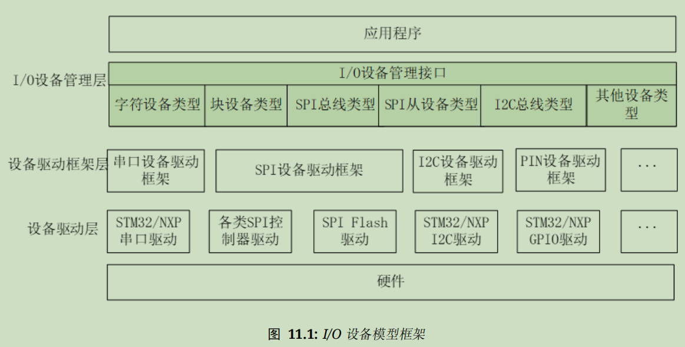

# RT-Thread快速上手【设备驱动】

RTT提供了一套设备驱动框架，但在使用之前，还应该配置对应硬件的引脚和具体的驱动程序。

RTT源码中提供了大部分常见MCU的驱动程序；如果移植到新设备，那就需要按照驱动程序框架层次编写设备驱动，如下图所示：

其中的设备驱动层往往基于MCU厂商提供的SDK（可以是对寄存器的函数封装也可以是硬件抽象层封装）进行修改，而IO设备管理层可以基于其他类似外设提供的代码稍稍修改，但中间的设备驱动框架层就要自行移植了。